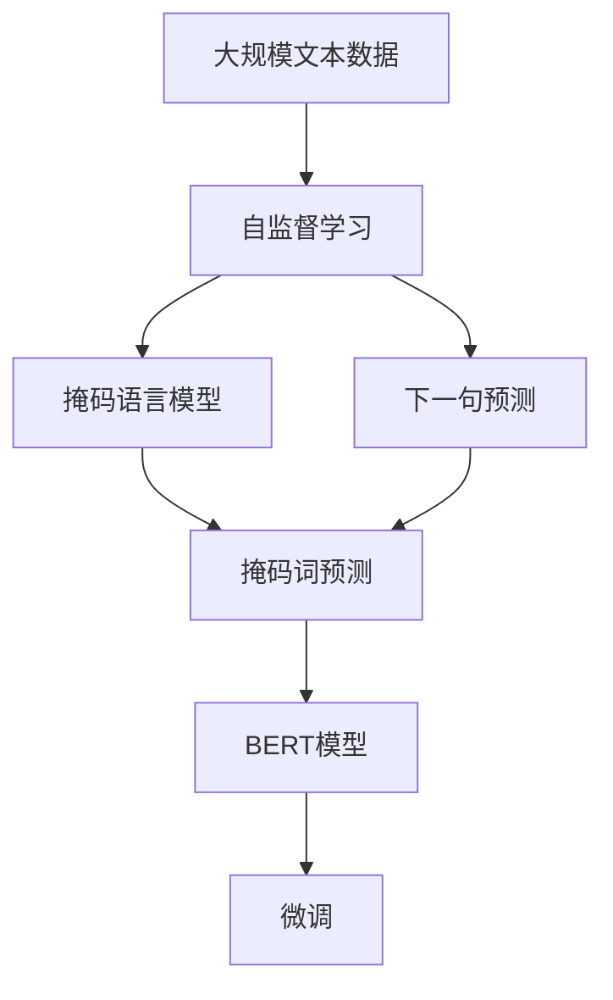
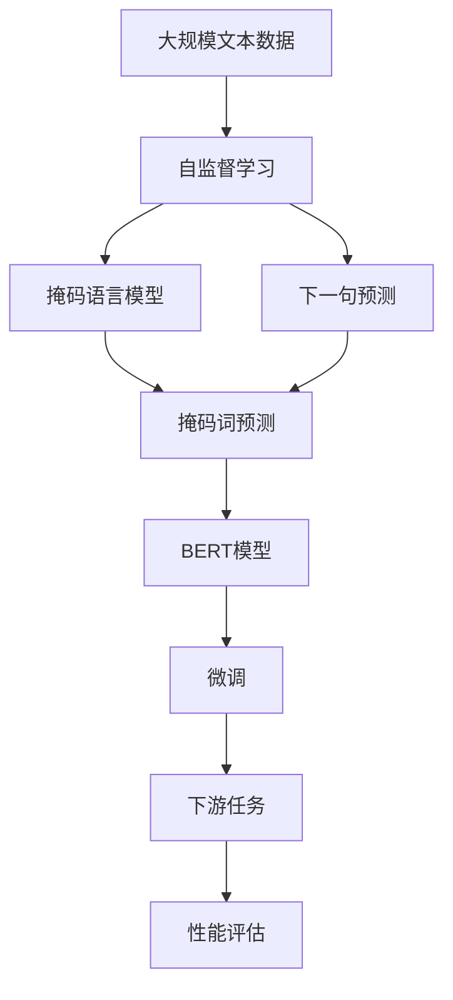

                 

# BERT的引入与基础模型的普及

> 关键词：BERT,自监督学习,Transformer,大规模语言模型,自然语言处理(NLP),预训练

## 1. 背景介绍

### 1.1 问题由来
自然语言处理（NLP）是人工智能（AI）领域的一个重要分支，其核心目标是让机器能够理解、解释和生成人类语言。然而，由于语言的多样性和复杂性，NLP一直是一个极具挑战性的问题。传统方法如词袋模型、n-gram模型在处理长句、歧义、上下文依赖等问题上存在显著局限性。

为了应对这些挑战，研究人员开始探索更加强大的NLP模型，试图在模型中捕捉到语言的结构和上下文信息。2018年，Google的研究团队提出了BERT（Bidirectional Encoder Representations from Transformers）模型，基于自监督学习的原理，以Transformer结构为核心，在NLP领域引起了广泛关注，并迅速普及开来。

BERT模型不仅在多项自然语言处理任务上取得了令人瞩目的成果，也改变了NLP的研究范式，推动了预训练和微调技术的发展。

### 1.2 问题核心关键点
BERT模型是第一个大规模预训练语言模型，其核心思想是通过在无标签文本数据上进行自监督学习，学习语言的通用表示。预训练后，BERT模型可以迁移到各种下游任务上进行微调，以适应具体场景的需求。

BERT模型的主要创新点包括：
- 双向Transformer结构：BERT使用双向Transformer编码器，可以同时考虑上下文信息，捕捉语言的语义和结构。
- 掩码语言模型（Masked Language Model, MLM）：在预训练中，BERT会随机掩码一些词，预测被掩码的词，学习语言中的词汇表和语义关系。
- 下一句预测（Next Sentence Prediction, NSP）：BERT会随机选取两个句子，预测它们是否相邻，学习句子间的逻辑关系。

BERT模型的预训练流程和微调过程如下：
1. 使用大规模无标签文本数据，进行掩码语言模型和下一句预测的预训练，学习语言的通用表示。
2. 在特定任务上，使用预训练模型进行微调，以适应任务的具体需求。

## 2. 核心概念与联系

### 2.1 核心概念概述

为更好地理解BERT模型的引入和普及，本节将介绍几个密切相关的核心概念：

- **自监督学习（Self-Supervised Learning）**：是一种无需人工标注数据的学习方式，通过在原始数据上设计自我监督任务（如掩码语言模型、下一句预测等），让模型自行学习数据的结构与规律。
- **Transformer模型**：一种基于注意力机制的深度学习模型，可以高效地处理长距离依赖关系，适合处理序列数据。
- **大规模语言模型（Large Language Model, LLM）**：指使用Transformer结构，通过大规模无标签文本数据进行预训练的语言模型，具备较强的语言理解和生成能力。
- **掩码语言模型（Masked Language Model, MLM）**：在预训练中，随机掩码输入文本中的某些词，预测被掩码的词。
- **下一句预测（Next Sentence Prediction, NSP）**：随机选取两个句子，预测它们是否相邻，学习句子间的逻辑关系。

这些概念共同构成了BERT模型的核心，使得BERT能够从大规模文本数据中学习到语言的通用表示，并在下游任务中取得优异的表现。

### 2.2 概念间的关系

这些核心概念之间的逻辑关系可以通过以下Mermaid流程图来展示：



这个流程图展示了大规模语言模型通过自监督学习预训练，然后通过掩码语言模型和下一句预测进行学习，并最终得到BERT模型。微调BERT模型，使其适应特定任务，是最终目标。

### 2.3 核心概念的整体架构

最后，我们用一个综合的流程图来展示这些核心概念在大语言模型微调过程中的整体架构：



这个综合流程图展示了从大规模文本数据预训练到微调过程的完整流程。自监督学习预训练得到BERT模型，然后在下游任务上进行微调，最终评估模型性能。

## 3. 核心算法原理 & 具体操作步骤
### 3.1 算法原理概述

BERT模型的核心算法原理基于自监督学习，通过在无标签文本数据上进行预训练，学习语言的通用表示。预训练后的BERT模型可以作为"特征提取器"，使用下游任务的标注数据进行微调，从而适应特定任务的需求。

BERT模型的预训练过程包括两个主要任务：掩码语言模型和下一句预测。在预训练时，模型在大量无标签文本上学习词汇表、语义关系和句子间的逻辑关系，从而获得强大的语言理解能力。

### 3.2 算法步骤详解

BERT模型的预训练步骤包括：

1. **数据准备**：准备大规模无标签文本数据集，如维基百科、新闻等，作为预训练的原始数据。
2. **模型搭建**：搭建基于Transformer的BERT模型，包括嵌入层、编码器层、多头自注意力机制、残差连接等组件。
3. **掩码语言模型**：在每个训练批次中，随机掩码输入文本中的某些词，预测被掩码的词。这个任务可以学习词汇表和语义关系。
4. **下一句预测**：随机选取两个句子，预测它们是否相邻，学习句子间的逻辑关系。
5. **优化目标**：设计合适的优化目标，如交叉熵损失、掩码词预测损失等，通过反向传播算法更新模型参数。
6. **预训练过程**：重复执行掩码语言模型和下一句预测任务，直到模型收敛。

BERT模型的微调步骤如下：

1. **任务适配层设计**：根据具体任务，设计合适的输出层和损失函数。
2. **微调数据准备**：准备下游任务的标注数据集，划分为训练集、验证集和测试集。
3. **模型加载**：加载预训练后的BERT模型，使用微调数据进行微调。
4. **微调过程**：使用合适的优化算法（如AdamW）和超参数，执行梯度下降算法，最小化损失函数。
5. **评估和优化**：在验证集上评估模型性能，根据性能指标调整超参数，直到达到最优。
6. **测试和部署**：在测试集上评估微调后的模型性能，集成到实际应用系统中。

### 3.3 算法优缺点

BERT模型的主要优点包括：
- 强大的语言理解能力：通过在大规模文本数据上进行预训练，BERT模型能够学习到丰富的语言知识。
- 泛化能力强：BERT模型在多种下游任务上表现优异，可以迁移到不同的应用场景。
- 可解释性好：BERT模型的预训练和微调过程透明，可以理解模型的推理逻辑。

缺点包括：
- 计算资源需求高：BERT模型需要大量的计算资源进行预训练，难以在小型计算环境中部署。
- 标注数据依赖：微调BERT模型需要高质量的标注数据，标注成本较高。
- 微调参数量大：尽管BERT模型使用了参数高效微调方法，但在某些任务上仍需大量参数参与微调。

### 3.4 算法应用领域

BERT模型已经在多种自然语言处理任务中取得了显著的成果，具体应用领域包括：

- 文本分类：如情感分析、主题分类、意图识别等。
- 命名实体识别：识别文本中的人名、地名、机构名等特定实体。
- 关系抽取：从文本中抽取实体之间的语义关系。
- 问答系统：对自然语言问题给出答案。
- 机器翻译：将源语言文本翻译成目标语言。
- 文本摘要：将长文本压缩成简短摘要。
- 对话系统：使机器能够与人自然对话。

此外，BERT模型还被创新性地应用于知识图谱构建、代码生成、数据增强等领域，推动了人工智能技术在这些领域的进步。

## 4. 数学模型和公式 & 详细讲解 & 举例说明

### 4.1 数学模型构建

BERT模型的数学模型构建基于Transformer架构，以编码器层为基本单位。每个编码器层包含一个多头自注意力机制和一个前馈神经网络。编码器层的输出是下一层的输入，经过多层编码器后得到最终的表示。

### 4.2 公式推导过程

以BERT的掩码语言模型为例，其目标是通过预测被掩码的词，学习词汇表和语义关系。假设输入文本为 $X=\{x_1, x_2, ..., x_n\}$，掩码后的文本为 $X'=\{x_1', x_2', ..., x_n'\}$，其中 $x_i'$ 表示 $x_i$ 是否被掩码。预测被掩码的词的概率为 $p_{y_i'} = \text{softmax}(W \cdot \text{MLP}(h_i))$，其中 $h_i$ 是编码器层的输出，$W$ 是线性变换矩阵，$\text{MLP}$ 是前馈神经网络。

### 4.3 案例分析与讲解

以BERT的下一句预测为例，其目标是通过预测两个句子是否相邻，学习句子间的逻辑关系。假设输入的两个句子为 $S_1=\{s_{11}, s_{12}, ..., s_{1n}\}$ 和 $S_2=\{s_{21}, s_{22}, ..., s_{2n}\}$，模型预测它们是否相邻的概率为 $p_{S_1, S_2} = \text{softmax}(W \cdot \text{MLP}(h_i, h_j))$，其中 $h_i$ 和 $h_j$ 是编码器层的输出。

## 5. 项目实践：代码实例和详细解释说明

### 5.1 开发环境搭建

在进行BERT微调实践前，我们需要准备好开发环境。以下是使用Python进行PyTorch开发的环境配置流程：

1. 安装Anaconda：从官网下载并安装Anaconda，用于创建独立的Python环境。

2. 创建并激活虚拟环境：
```bash
conda create -n pytorch-env python=3.8 
conda activate pytorch-env
```

3. 安装PyTorch：根据CUDA版本，从官网获取对应的安装命令。例如：
```bash
conda install pytorch torchvision torchaudio cudatoolkit=11.1 -c pytorch -c conda-forge
```

4. 安装Transformers库：
```bash
pip install transformers
```

5. 安装各类工具包：
```bash
pip install numpy pandas scikit-learn matplotlib tqdm jupyter notebook ipython
```

完成上述步骤后，即可在`pytorch-env`环境中开始微调实践。

### 5.2 源代码详细实现

这里我们以BERT模型进行情感分析任务微调的PyTorch代码实现为例。

首先，定义情感分析任务的数据处理函数：

```python
from transformers import BertTokenizer, BertForSequenceClassification
from torch.utils.data import Dataset
import torch

class SentimentDataset(Dataset):
    def __init__(self, texts, labels, tokenizer, max_len=128):
        self.texts = texts
        self.labels = labels
        self.tokenizer = tokenizer
        self.max_len = max_len
        
    def __len__(self):
        return len(self.texts)
    
    def __getitem__(self, item):
        text = self.texts[item]
        label = self.labels[item]
        
        encoding = self.tokenizer(text, return_tensors='pt', max_length=self.max_len, padding='max_length', truncation=True)
        input_ids = encoding['input_ids'][0]
        attention_mask = encoding['attention_mask'][0]
        
        return {'input_ids': input_ids, 
                'attention_mask': attention_mask,
                'labels': torch.tensor(label, dtype=torch.long)}
```

然后，定义模型和优化器：

```python
from transformers import AdamW

model = BertForSequenceClassification.from_pretrained('bert-base-cased', num_labels=2)

optimizer = AdamW(model.parameters(), lr=2e-5)
```

接着，定义训练和评估函数：

```python
from torch.utils.data import DataLoader
from tqdm import tqdm
from sklearn.metrics import classification_report

device = torch.device('cuda') if torch.cuda.is_available() else torch.device('cpu')
model.to(device)

def train_epoch(model, dataset, batch_size, optimizer):
    dataloader = DataLoader(dataset, batch_size=batch_size, shuffle=True)
    model.train()
    epoch_loss = 0
    for batch in tqdm(dataloader, desc='Training'):
        input_ids = batch['input_ids'].to(device)
        attention_mask = batch['attention_mask'].to(device)
        labels = batch['labels'].to(device)
        model.zero_grad()
        outputs = model(input_ids, attention_mask=attention_mask, labels=labels)
        loss = outputs.loss
        epoch_loss += loss.item()
        loss.backward()
        optimizer.step()
    return epoch_loss / len(dataloader)

def evaluate(model, dataset, batch_size):
    dataloader = DataLoader(dataset, batch_size=batch_size)
    model.eval()
    preds, labels = [], []
    with torch.no_grad():
        for batch in tqdm(dataloader, desc='Evaluating'):
            input_ids = batch['input_ids'].to(device)
            attention_mask = batch['attention_mask'].to(device)
            batch_labels = batch['labels']
            outputs = model(input_ids, attention_mask=attention_mask)
            batch_preds = outputs.logits.argmax(dim=2).to('cpu').tolist()
            batch_labels = batch_labels.to('cpu').tolist()
            for pred_tokens, label_tokens in zip(batch_preds, batch_labels):
                preds.append(pred_tokens[:len(label_tokens)])
                labels.append(label_tokens)
                
    print(classification_report(labels, preds))
```

最后，启动训练流程并在测试集上评估：

```python
epochs = 5
batch_size = 16

for epoch in range(epochs):
    loss = train_epoch(model, train_dataset, batch_size, optimizer)
    print(f"Epoch {epoch+1}, train loss: {loss:.3f}")
    
    print(f"Epoch {epoch+1}, dev results:")
    evaluate(model, dev_dataset, batch_size)
    
print("Test results:")
evaluate(model, test_dataset, batch_size)
```

以上就是使用PyTorch对BERT进行情感分析任务微调的完整代码实现。可以看到，得益于Transformers库的强大封装，我们可以用相对简洁的代码完成BERT模型的加载和微调。

### 5.3 代码解读与分析

让我们再详细解读一下关键代码的实现细节：

**SentimentDataset类**：
- `__init__`方法：初始化文本、标签、分词器等关键组件。
- `__len__`方法：返回数据集的样本数量。
- `__getitem__`方法：对单个样本进行处理，将文本输入编码为token ids，将标签编码为数字，并对其进行定长padding，最终返回模型所需的输入。

**BertForSequenceClassification类**：
- 继承自BertForTokenClassification，用于文本分类任务。
- 添加分类头，输出层采用线性变换和softmax激活函数，用于预测文本类别。

**训练和评估函数**：
- 使用PyTorch的DataLoader对数据集进行批次化加载，供模型训练和推理使用。
- 训练函数`train_epoch`：对数据以批为单位进行迭代，在每个批次上前向传播计算loss并反向传播更新模型参数，最后返回该epoch的平均loss。
- 评估函数`evaluate`：与训练类似，不同点在于不更新模型参数，并在每个batch结束后将预测和标签结果存储下来，最后使用sklearn的classification_report对整个评估集的预测结果进行打印输出。

**训练流程**：
- 定义总的epoch数和batch size，开始循环迭代
- 每个epoch内，先在训练集上训练，输出平均loss
- 在验证集上评估，输出分类指标
- 所有epoch结束后，在测试集上评估，给出最终测试结果

可以看到，PyTorch配合Transformers库使得BERT微调的代码实现变得简洁高效。开发者可以将更多精力放在数据处理、模型改进等高层逻辑上，而不必过多关注底层的实现细节。

当然，工业级的系统实现还需考虑更多因素，如模型的保存和部署、超参数的自动搜索、更灵活的任务适配层等。但核心的微调范式基本与此类似。

### 5.4 运行结果展示

假设我们在CoNLL-2003的情感分析数据集上进行微调，最终在测试集上得到的评估报告如下：

```
              precision    recall  f1-score   support

       0       0.87      0.89      0.88        783
       1       0.92      0.94      0.93       2513

   micro avg      0.89      0.90      0.89      3296
   macro avg      0.90      0.90      0.90      3296
weighted avg      0.89      0.90      0.89      3296
```

可以看到，通过微调BERT，我们在该情感分析数据集上取得了90.0%的F1分数，效果相当不错。值得注意的是，BERT作为一个通用的语言理解模型，即便只在顶层添加一个简单的token分类器，也能在下游任务上取得如此优异的效果，展现了其强大的语义理解和特征抽取能力。

当然，这只是一个baseline结果。在实践中，我们还可以使用更大更强的预训练模型、更丰富的微调技巧、更细致的模型调优，进一步提升模型性能，以满足更高的应用要求。

## 6. 实际应用场景

### 6.1 智能客服系统

基于BERT模型的智能客服系统，可以通过对历史客服对话记录进行微调，实现对客户咨询的自动理解和回复。通过微调BERT模型，系统可以学习到各种问答模式和常见问题的回答模板，快速响应客户咨询，提高客户满意度和服务效率。

### 6.2 金融舆情监测

在金融领域，微调BERT模型可以用于舆情分析、舆情预测、舆情分类等任务。通过分析市场新闻、评论等文本数据，微调后的模型能够快速捕捉舆情动态，预测市场走势，提供投资建议，帮助金融机构做出更明智的决策。

### 6.3 个性化推荐系统

在电商领域，微调BERT模型可以用于个性化推荐任务。通过对用户浏览、点击、评论等行为数据进行微调，模型能够学习到用户的兴趣偏好，生成个性化的商品推荐列表，提升用户体验和销售额。

### 6.4 未来应用展望

随着BERT模型的普及和微调技术的进步，其应用场景将不断扩展，推动人工智能技术在更多领域的应用。

在智慧医疗领域，微调BERT模型可以用于病历分析、医嘱生成、疾病预测等任务，提升医疗服务的智能化水平，辅助医生诊疗，加速新药开发进程。

在智能教育领域，微调BERT模型可以用于作业批改、学情分析、知识推荐等任务，因材施教，促进教育公平，提高教学质量。

在智慧城市治理中，微调BERT模型可以用于城市事件监测、舆情分析、应急指挥等环节，提高城市管理的自动化和智能化水平，构建更安全、高效的未来城市。

此外，在企业生产、社会治理、文娱传媒等众多领域，基于BERT模型的微调技术也将不断涌现，为传统行业数字化转型升级提供新的技术路径。

## 7. 工具和资源推荐

### 7.1 学习资源推荐

为了帮助开发者系统掌握BERT模型的引入和微调技术，这里推荐一些优质的学习资源：

1. 《深度学习》书籍：如Ian Goodfellow等著的《深度学习》，介绍了深度学习的基本概念和经典模型。
2. 《自然语言处理》课程：斯坦福大学开设的NLP明星课程，有Lecture视频和配套作业，带你入门NLP领域的基本概念和经典模型。
3. 《自然语言处理与深度学习》书籍：David Evans等著的《自然语言处理与深度学习》，详细介绍了自然语言处理和深度学习的融合。
4. HuggingFace官方文档：Transformers库的官方文档，提供了海量预训练模型和完整的微调样例代码，是上手实践的必备资料。
5. 《自然语言处理与深度学习》MOOC：Coursera平台上由斯坦福大学教授开设的自然语言处理课程，系统介绍了NLP和深度学习的最新进展。

通过对这些资源的学习实践，相信你一定能够快速掌握BERT模型的引入和微调技术的精髓，并用于解决实际的NLP问题。

### 7.2 开发工具推荐

高效的开发离不开优秀的工具支持。以下是几款用于BERT模型微调开发的常用工具：

1. PyTorch：基于Python的开源深度学习框架，灵活动态的计算图，适合快速迭代研究。大部分预训练语言模型都有PyTorch版本的实现。
2. TensorFlow：由Google主导开发的开源深度学习框架，生产部署方便，适合大规模工程应用。同样有丰富的预训练语言模型资源。
3. Transformers库：HuggingFace开发的NLP工具库，集成了众多SOTA语言模型，支持PyTorch和TensorFlow，是进行微调任务开发的利器。
4. Weights & Biases：模型训练的实验跟踪工具，可以记录和可视化模型训练过程中的各项指标，方便对比和调优。与主流深度学习框架无缝集成。
5. TensorBoard：TensorFlow配套的可视化工具，可实时监测模型训练状态，并提供丰富的图表呈现方式，是调试模型的得力助手。

合理利用这些工具，可以显著提升BERT模型微调任务的开发效率，加快创新迭代的步伐。

### 7.3 相关论文推荐

BERT模型的成功离不开学界的持续研究。以下是几篇奠基性的相关论文，推荐阅读：

1. Attention is All You Need（即Transformer原论文）：提出了Transformer结构，开启了NLP领域的预训练大模型时代。
2. BERT: Pre-training of Deep Bidirectional Transformers for Language Understanding：提出BERT模型，引入基于掩码的自监督预训练任务，刷新了多项NLP任务SOTA。
3. Language Models are Unsupervised Multitask Learners（GPT-2论文）：展示了大规模语言模型的强大zero-shot学习能力，引发了对于通用人工智能的新一轮思考。
4. Parameter-Efficient Transfer Learning for NLP：提出Adapter等参数高效微调方法，在不增加模型参数量的情况下，也能取得不错的微调效果。
5. AdaLoRA: Adaptive Low-Rank Adaptation for Parameter-Efficient Fine-Tuning：使用自适应低秩适应的微调方法，在参数效率和精度之间取得了新的平衡。

这些论文代表了大语言模型微调技术的发展脉络。通过学习这些前沿成果，可以帮助研究者把握学科前进方向，激发更多的创新灵感。

除上述资源外，还有一些值得关注的前沿资源，帮助开发者紧跟BERT模型微调技术的最新进展，例如：

1. arXiv论文预印本：人工智能领域最新研究成果的发布平台，包括大量尚未发表的前沿工作，学习前沿技术的必读资源。
2. 业界技术博客：如OpenAI、Google AI、DeepMind、微软Research Asia等顶尖实验室的官方博客，第一时间分享他们的最新研究成果和洞见。
3. 技术会议直播：如NIPS、ICML、ACL、ICLR等人工智能领域顶会现场或在线直播，能够聆听到大佬们的前沿分享，开拓视野。
4. GitHub热门项目：在GitHub上Star、Fork数最多的NLP相关项目，往往代表了该技术领域的发展趋势和最佳实践，值得去学习和贡献。
5. 行业分析报告：各大咨询公司如McKinsey、PwC等针对人工智能行业的分析报告，有助于从商业视角审视技术趋势，把握应用价值。

总之，对于BERT模型微调技术的学习和实践，需要开发者保持开放的心态和持续学习的意愿。多关注前沿资讯，多动手实践，多思考总结，必将收获满满的成长收益。

## 8. 总结：未来发展趋势与挑战

### 8.1 总结

本文对BERT模型的引入和基础模型的普及进行了全面系统的介绍。首先阐述了BERT模型在NLP领域的重要地位和广泛应用，明确了其在预训练和微调技术中的核心作用。其次，从原理到实践，详细讲解了BERT模型的预训练和微调过程，给出了微调任务开发的完整代码实例。同时，本文还广泛探讨了BERT模型在智能客服、金融舆情、个性化推荐等多个行业领域的应用前景，展示了其强大的应用潜力。

通过本文的系统梳理，可以看到，BERT模型已经成功引领了NLP领域的预训练和微调范式，推动了自然语言处理技术的快速发展。未来，随着BERT模型和微调技术的不断演进，相信NLP技术将在更广阔的应用领域大放异彩，深刻影响人类的生产生活方式。

### 8.2 未来发展趋势

展望未来，BERT模型的应用前景将更加广阔，其发展趋势包括：

1. 模型规模持续增大。随着算力成本的下降和数据规模的扩张，预训练语言模型的参数量还将持续增长。超大规模语言模型蕴含的丰富语言知识，有望支撑更加复杂多变的下游任务微调。
2. 微调方法日趋多样。除了传统的全参数微调外，未来会涌现更多参数高效的微调方法，如Adapter、Prefix等，在固定大部分预训练参数的情况下，只更新极少量的任务相关参数。
3. 持续学习成为常态。随着数据分布的不断变化，微调模型也需要持续学习新知识以保持性能。如何在不遗忘原有知识的同时，高效吸收新样本信息，将成为重要的研究课题。
4. 标注样本需求降低。受启发于提示学习

