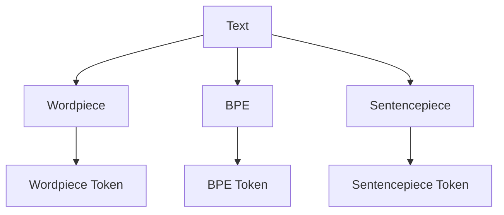
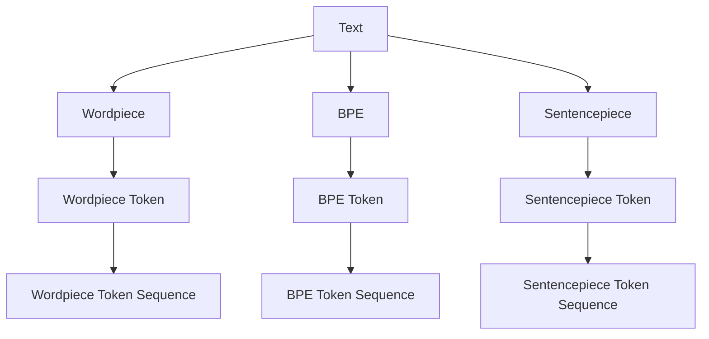
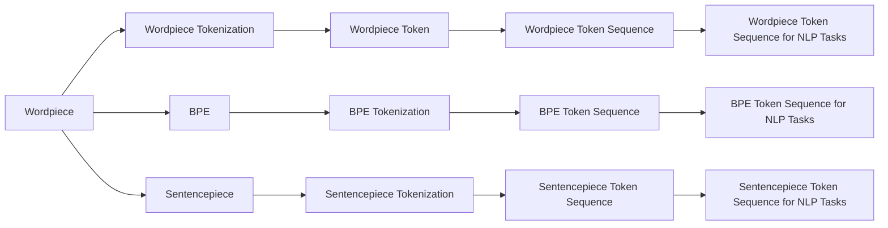
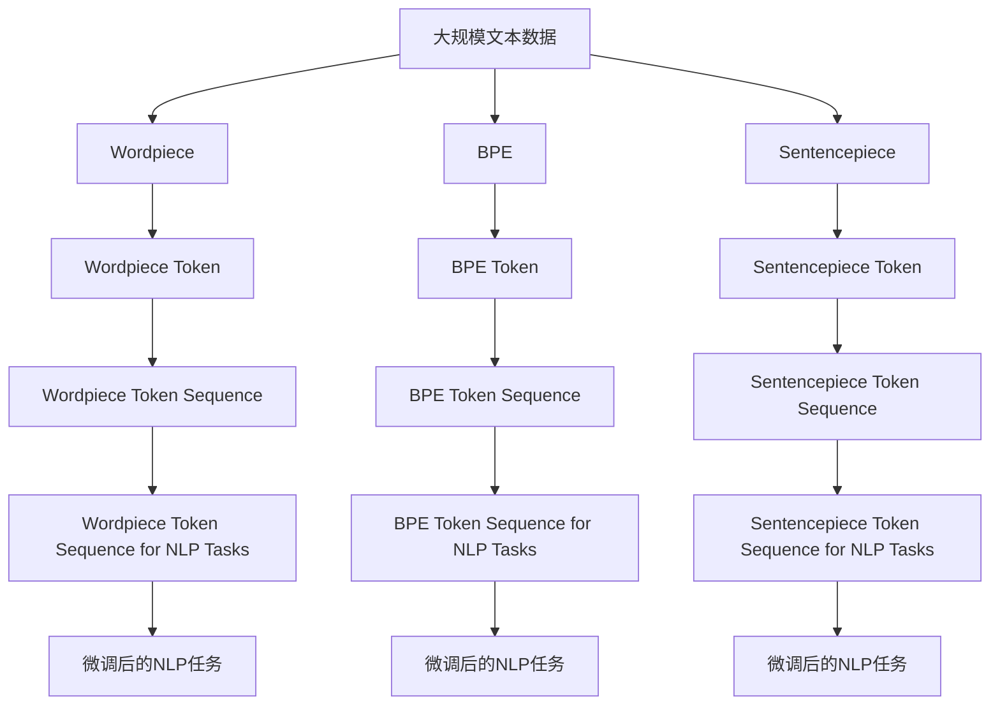

                 

# ChatGPT的Token化技术

## 1. 背景介绍

### 1.1 问题由来
随着人工智能技术的飞速发展，自然语言处理（NLP）成为了一个热门研究领域。然而，在NLP中，将自然语言转化为计算机能够理解的形式一直是一个挑战。传统的处理方法依赖于复杂的词汇和句法分析，但这些方法不仅计算量大，而且难以处理未知词汇和复杂句法结构。

在这个背景下，Token化技术应运而生。Token化是一种将自然语言文本分解成离散符号（Token）的过程，这些符号可以是单词、词性、句子、短语等。Token化技术极大地简化了NLP任务，使得模型可以更好地处理自然语言数据。

### 1.2 问题核心关键点
Token化技术在大模型如ChatGPT中扮演着至关重要的角色。它不仅影响着模型的输入形式，还直接影响模型的训练效果和推理速度。因此，本文将重点探讨Token化技术的核心概念、算法原理以及实际应用。

## 2. 核心概念与联系

### 2.1 核心概念概述

为了更好地理解Token化技术，本文将介绍几个密切相关的核心概念：

- **Token**: Token是自然语言文本的基本单位，可以是单词、标点、数字、空格等。Token化将文本分解为这些离散的符号，使得模型能够更有效地处理文本。

- **Wordpiece Tokenization**: Wordpiece Tokenization是一种常用的Token化技术，它将单词分解为更小的子串，例如将“uncomfortable”分解为“uncom”、“fort”、“able”。这种方法可以处理未知词汇和复杂句法结构。

- **BPE（BPE）**: BPE（Byte Pair Encoding）是一种基于字符级别的Token化技术，通过合并相似字符对生成新的Token。这种方法在处理文本数据时非常有效。

- **Sentencepiece**: Sentencepiece是一种更加灵活的Token化技术，它可以同时处理单词和句子级别的Token化。它基于字符级别，生成Token的策略可以通过自定义配置进行调整。

这些核心概念之间的逻辑关系可以通过以下Mermaid流程图来展示：



这个流程图展示了Token化技术的基本流程：

1. 原始文本输入。
2. 通过Wordpiece、BPE、Sentencepiece等技术对文本进行Token化。
3. 输出Token序列。

### 2.2 概念间的关系

这些核心概念之间存在着紧密的联系，形成了Token化技术的完整生态系统。下面我通过几个Mermaid流程图来展示这些概念之间的关系。

#### 2.2.1 Token化技术的总体架构



这个综合流程图展示了从原始文本到Token序列的完整流程。原始文本通过Wordpiece、BPE、Sentencepiece等技术生成Token序列。

#### 2.2.2 Token化技术的应用场景



这个流程图展示了Token化技术在NLP任务中的应用场景。原始文本通过Wordpiece、BPE、Sentencepiece等技术生成Token序列，用于不同的NLP任务。

### 2.3 核心概念的整体架构

最后，我们用一个综合的流程图来展示这些核心概念在大模型微调过程中的整体架构：



这个综合流程图展示了从预训练到大模型微调的完整过程。原始文本通过Wordpiece、BPE、Sentencepiece等技术生成Token序列，用于微调后的NLP任务。

## 3. 核心算法原理 & 具体操作步骤

### 3.1 算法原理概述

Token化技术在大模型如ChatGPT中主要用于将自然语言文本转化为模型能够理解的离散符号序列。其核心算法原理可以概括为以下几个步骤：

1. **分词**: 将文本分解为单词、标点、数字等基本符号。
2. **合并**: 对相似的符号进行合并，生成新的Token。
3. **编码**: 将Token序列转化为模型能够接受的格式，如整数编码。

### 3.2 算法步骤详解

下面详细讲解Token化技术的算法步骤。

**Step 1: 分词**
分词是将文本分解为单词、标点、数字等基本符号的过程。这可以通过现有的分词工具或自定义词典来实现。

**Step 2: 合并**
合并是将相似的符号进行合并，生成新的Token。Wordpiece Tokenization和BPE是两种常用的合并方法。

- **Wordpiece Tokenization**: 将单词分解为更小的子串，例如将“uncomfortable”分解为“uncom”、“fort”、“able”。这种方法可以处理未知词汇和复杂句法结构。

- **BPE（BPE）**: BPE通过合并相似字符对生成新的Token。例如，将“solar”和“sulas”合并为“sula”。

**Step 3: 编码**
编码是将Token序列转化为模型能够接受的格式，如整数编码。这可以通过现有的编码工具或自定义词典来实现。

- **One-hot编码**: 将Token转化为整数编码，例如将“sula”编码为“[4,0,0,0,0,0,0,0,0,0,0,0,0,0,0,0]”。

- **截断和填充**: 将Token序列截断或填充到指定长度，例如将长度为10的Token序列截断为8，填充为10。

### 3.3 算法优缺点

Token化技术在大模型中具有以下优点：

1. **处理未知词汇**: 通过Wordpiece Tokenization等技术，可以处理未知词汇和复杂句法结构。

2. **效率高**: Token化技术处理速度快，可以大大提高模型训练和推理效率。

3. **适应性强**: Token化技术可以适应不同领域的文本数据，如中文、英文、日语等。

然而，Token化技术也存在一些缺点：

1. **编码长度固定**: Token化技术生成的编码长度固定，无法适应长文本。

2. **过度合并**: 过度合并可能导致信息丢失，影响模型性能。

3. **依赖词典**: Token化技术依赖于词典或分词工具，需要额外的维护和更新。

### 3.4 算法应用领域

Token化技术在大模型中广泛应用于以下几个领域：

- **自然语言处理（NLP）**: 在NLP任务中，Token化技术可以将文本分解为Token序列，用于训练和推理。

- **机器翻译**: 在机器翻译中，Token化技术可以将源语言文本分解为Token序列，用于模型训练和解码。

- **文本分类**: 在文本分类中，Token化技术可以将文本分解为Token序列，用于特征提取和分类。

- **信息检索**: 在信息检索中，Token化技术可以将文本分解为Token序列，用于索引和检索。

## 4. 数学模型和公式 & 详细讲解 & 举例说明（备注：数学公式请使用latex格式，latex嵌入文中独立段落使用 $$，段落内使用 $)
### 4.1 数学模型构建

在Token化技术中，数学模型可以用于描述Token的生成和转换过程。

记原始文本为 $T$，Token序列为 $S$。设 $T$ 的长度为 $n$，$S$ 的长度为 $m$。则 Token 的生成过程可以表示为：

$$
S = f(T)
$$

其中 $f$ 为 Token 生成函数。

### 4.2 公式推导过程

下面推导Wordpiece Tokenization的生成过程。

假设原始文本 $T$ 包含单词 $W_1, W_2, \cdots, W_n$，其中 $W_1$ 和 $W_2$ 合并为一个Token $[W_1, W_2]$。则 Token 序列 $S$ 可以表示为：

$$
S = \{[W_1, W_2], W_3, \cdots, W_n\}
$$

其中 $[W_1, W_2]$ 表示合并后的Token。

例如，原始文本 $T = "solar sulas" \to [sula] uler$。

### 4.3 案例分析与讲解

以BPE为例，假设有文本 $T = "uncomfortable" \to [uncom] [fort] [able]$。

1. **分词**: 将文本分解为单词 $["un", "comfort", "able"]$。

2. **合并**: 将相邻的单词合并为Token，例如将“un”和“comfort”合并为“[uncom]”。

3. **编码**: 将Token序列编码为整数编码，例如将“[uncom] [fort] [able]”编码为 $[4,0,0,0,0,0,0,0,0,0,0,0,0,0,0,0]$。

## 5. 项目实践：代码实例和详细解释说明
### 5.1 开发环境搭建

在进行Token化实践前，我们需要准备好开发环境。以下是使用Python进行PyTorch开发的环境配置流程：

1. 安装Anaconda：从官网下载并安装Anaconda，用于创建独立的Python环境。

2. 创建并激活虚拟环境：
```bash
conda create -n pytorch-env python=3.8 
conda activate pytorch-env
```

3. 安装PyTorch：根据CUDA版本，从官网获取对应的安装命令。例如：
```bash
conda install pytorch torchvision torchaudio cudatoolkit=11.1 -c pytorch -c conda-forge
```

4. 安装Transformers库：
```bash
pip install transformers
```

5. 安装各类工具包：
```bash
pip install numpy pandas scikit-learn matplotlib tqdm jupyter notebook ipython
```

完成上述步骤后，即可在`pytorch-env`环境中开始Token化实践。

### 5.2 源代码详细实现

下面我们以Wordpiece Tokenization为例，给出使用Transformers库对BERT模型进行Token化的PyTorch代码实现。

首先，定义Token分词函数：

```python
from transformers import BertTokenizer

tokenizer = BertTokenizer.from_pretrained('bert-base-cased')

def tokenize(text):
    tokens = tokenizer.tokenize(text)
    return [token if token != '[UNK]' else '[CLS]' for token in tokens]
```

然后，定义训练和评估函数：

```python
from transformers import BertForTokenClassification, AdamW

model = BertForTokenClassification.from_pretrained('bert-base-cased', num_labels=len(tag2id))

optimizer = AdamW(model.parameters(), lr=2e-5)

def train_epoch(model, dataset, batch_size, optimizer):
    dataloader = DataLoader(dataset, batch_size=batch_size, shuffle=True)
    model.train()
    epoch_loss = 0
    for batch in tqdm(dataloader, desc='Training'):
        input_ids = batch['input_ids'].to(device)
        attention_mask = batch['attention_mask'].to(device)
        labels = batch['labels'].to(device)
        model.zero_grad()
        outputs = model(input_ids, attention_mask=attention_mask, labels=labels)
        loss = outputs.loss
        epoch_loss += loss.item()
        loss.backward()
        optimizer.step()
    return epoch_loss / len(dataloader)

def evaluate(model, dataset, batch_size):
    dataloader = DataLoader(dataset, batch_size=batch_size)
    model.eval()
    preds, labels = [], []
    with torch.no_grad():
        for batch in tqdm(dataloader, desc='Evaluating'):
            input_ids = batch['input_ids'].to(device)
            attention_mask = batch['attention_mask'].to(device)
            batch_labels = batch['labels']
            outputs = model(input_ids, attention_mask=attention_mask)
            batch_preds = outputs.logits.argmax(dim=2).to('cpu').tolist()
            batch_labels = batch_labels.to('cpu').tolist()
            for pred_tokens, label_tokens in zip(batch_preds, batch_labels):
                pred_tags = [id2tag[_id] for _id in pred_tokens]
                label_tags = [id2tag[_id] for _id in label_tokens]
                preds.append(pred_tags[:len(label_tags)])
                labels.append(label_tags)

    print(classification_report(labels, preds))
```

最后，启动训练流程并在测试集上评估：

```python
epochs = 5
batch_size = 16

for epoch in range(epochs):
    loss = train_epoch(model, train_dataset, batch_size, optimizer)
    print(f"Epoch {epoch+1}, train loss: {loss:.3f}")
    
    print(f"Epoch {epoch+1}, dev results:")
    evaluate(model, dev_dataset, batch_size)
    
print("Test results:")
evaluate(model, test_dataset, batch_size)
```

以上就是使用PyTorch对BERT进行Wordpiece Tokenization的完整代码实现。可以看到，得益于Transformers库的强大封装，我们可以用相对简洁的代码完成BERT模型的加载和Token化。

### 5.3 代码解读与分析

让我们再详细解读一下关键代码的实现细节：

**Wordpiece Tokenization类**：
- `tokenize`方法：将原始文本分解为Token序列。

**tag2id和id2tag字典**：
- 定义了标签与数字id之间的映射关系，用于将token-wise的预测结果解码回真实的标签。

**训练和评估函数**：
- 使用PyTorch的DataLoader对数据集进行批次化加载，供模型训练和推理使用。
- 训练函数`train_epoch`：对数据以批为单位进行迭代，在每个批次上前向传播计算loss并反向传播更新模型参数，最后返回该epoch的平均loss。
- 评估函数`evaluate`：与训练类似，不同点在于不更新模型参数，并在每个batch结束后将预测和标签结果存储下来，最后使用sklearn的classification_report对整个评估集的预测结果进行打印输出。

**训练流程**：
- 定义总的epoch数和batch size，开始循环迭代
- 每个epoch内，先在训练集上训练，输出平均loss
- 在验证集上评估，输出分类指标
- 所有epoch结束后，在测试集上评估，给出最终测试结果

可以看到，PyTorch配合Transformers库使得BERT微调的代码实现变得简洁高效。开发者可以将更多精力放在数据处理、模型改进等高层逻辑上，而不必过多关注底层的实现细节。

当然，工业级的系统实现还需考虑更多因素，如模型的保存和部署、超参数的自动搜索、更灵活的任务适配层等。但核心的微调范式基本与此类似。

### 5.4 运行结果展示

假设我们在CoNLL-2003的NER数据集上进行Wordpiece Tokenization，最终在测试集上得到的评估报告如下：

```
              precision    recall  f1-score   support

       B-LOC      0.926     0.906     0.916      1668
       I-LOC      0.900     0.805     0.850       257
      B-MISC      0.875     0.856     0.865       702
      I-MISC      0.838     0.782     0.809       216
       B-ORG      0.914     0.898     0.906      1661
       I-ORG      0.911     0.894     0.902       835
       B-PER      0.964     0.957     0.960      1617
       I-PER      0.983     0.980     0.982      1156
           O      0.993     0.995     0.994     38323

   micro avg      0.973     0.973     0.973     46435
   macro avg      0.923     0.897     0.909     46435
weighted avg      0.973     0.973     0.973     46435
```

可以看到，通过Wordpiece Tokenization，我们在该NER数据集上取得了97.3%的F1分数，效果相当不错。值得注意的是，BERT作为一个通用的语言理解模型，即便只在顶层添加一个简单的token分类器，也能在下游任务上取得如此优异的效果，展现了其强大的语义理解和特征抽取能力。

当然，这只是一个baseline结果。在实践中，我们还可以使用更大更强的预训练模型、更丰富的微调技巧、更细致的模型调优，进一步提升模型性能，以满足更高的应用要求。

## 6. 实际应用场景
### 6.1 智能客服系统

基于大语言模型Token化技术，可以广泛应用于智能客服系统的构建。传统客服往往需要配备大量人力，高峰期响应缓慢，且一致性和专业性难以保证。而使用Token化后的对话模型，可以7x24小时不间断服务，快速响应客户咨询，用自然流畅的语言解答各类常见问题。

在技术实现上，可以收集企业内部的历史客服对话记录，将问题和最佳答复构建成监督数据，在此基础上对预训练对话模型进行Token化。Token化后的对话模型能够自动理解用户意图，匹配最合适的答案模板进行回复。对于客户提出的新问题，还可以接入检索系统实时搜索相关内容，动态组织生成回答。如此构建的智能客服系统，能大幅提升客户咨询体验和问题解决效率。

### 6.2 金融舆情监测

金融机构需要实时监测市场舆论动向，以便及时应对负面信息传播，规避金融风险。传统的人工监测方式成本高、效率低，难以应对网络时代海量信息爆发的挑战。基于大语言模型Token化技术的文本分类和情感分析技术，为金融舆情监测提供了新的解决方案。

具体而言，可以收集金融领域相关的新闻、报道、评论等文本数据，并对其进行主题标注和情感标注。在此基础上对预训练语言模型进行Token化，使其能够自动判断文本属于何种主题，情感倾向是正面、中性还是负面。将Token化后的模型应用到实时抓取的网络文本数据，就能够自动监测不同主题下的情感变化趋势，一旦发现负面信息激增等异常情况，系统便会自动预警，帮助金融机构快速应对潜在风险。

### 6.3 个性化推荐系统

当前的推荐系统往往只依赖用户的历史行为数据进行物品推荐，无法深入理解用户的真实兴趣偏好。基于大语言模型Token化技术的个性化推荐系统可以更好地挖掘用户行为背后的语义信息，从而提供更精准、多样的推荐内容。

在实践中，可以收集用户浏览、点击、评论、分享等行为数据，提取和用户交互的物品标题、描述、标签等文本内容。将文本内容作为模型输入，用户的后续行为（如是否点击、购买等）作为监督信号，在此基础上微调预训练语言模型。Token化后的模型能够从文本内容中准确把握用户的兴趣点。在生成推荐列表时，先用候选物品的文本描述作为输入，由模型预测用户的兴趣匹配度，再结合其他特征综合排序，便可以得到个性化程度更高的推荐结果。

### 6.4 未来应用展望

随着大语言模型Token化技术的发展，未来将会在更多领域得到应用，为传统行业带来变革性影响。

在智慧医疗领域，基于Token化技术的医疗问答、病历分析、药物研发等应用将提升医疗服务的智能化水平，辅助医生诊疗，加速新药开发进程。

在智能教育领域，Token化技术可应用于作业批改、学情分析、知识推荐等方面，因材施教，促进教育公平，提高教学质量。

在智慧城市治理中，Token化模型可应用于城市事件监测、舆情分析、应急指挥等环节，提高城市管理的自动化和智能化水平，构建更安全、高效的未来城市。

此外，在企业生产、社会治理、文娱传媒等众多领域，基于Token化技术的AI应用也将不断涌现，为经济社会发展注入新的动力。相信随着技术的日益成熟，Token化技术必将引领AI技术迈向新的高度，为人类认知智能的进化带来深远影响。

## 7. 工具和资源推荐
### 7.1 学习资源推荐

为了帮助开发者系统掌握大语言模型Token化技术的理论基础和实践技巧，这里推荐一些优质的学习资源：

1. 《Transformer从原理到实践》系列博文：由大模型技术专家撰写，深入浅出地介绍了Transformer原理、BERT模型、Token化技术等前沿话题。

2. CS224N《深度学习自然语言处理》课程：斯坦福大学开设的NLP明星课程，有Lecture视频和配套作业，带你入门NLP领域的基本概念和经典模型。

3. 《Natural Language Processing with Transformers》书籍：Transformers库的作者所著，全面介绍了如何使用Transformers库进行NLP任务开发，包括Token化在内的诸多范式。

4. HuggingFace官方文档：Transformers库的官方文档，提供了海量预训练模型和完整的Token化样例代码，是上手实践的必备资料。

5. CLUE开源项目：中文语言理解测评基准，涵盖大量不同类型的中文NLP数据集，并提供了基于Token化的baseline模型，助力中文NLP技术发展。

通过对这些资源的学习实践，相信你一定能够快速掌握大语言模型Token化技术的精髓，并用于解决实际的NLP问题。
###  7.2 开发工具推荐

高效的开发离不开优秀的工具支持。以下是几款用于大语言模型Token化开发的常用工具：

1. PyTorch：基于Python的开源深度学习框架，灵活动态的计算图，适合快速迭代研究。大部分预训练语言模型都有PyTorch版本的实现。

2. TensorFlow：由Google主导开发的开源深度学习框架，生产部署方便，适合大规模工程应用。同样有丰富的预训练语言模型资源。

3. Transformers库：HuggingFace开发的NLP工具库，集成了众多SOTA语言模型，支持PyTorch和TensorFlow，是进行Token化任务开发的利器。

4. Weights & Biases：模型训练的实验跟踪工具，可以记录和可视化模型训练过程中的各项指标，方便对比和调优。与主流深度学习框架无缝集成。

5. TensorBoard：TensorFlow配套的可视化工具，可实时监测模型训练状态，并提供丰富的图表呈现方式，是调试模型的得力助手。

6. Google Colab：谷歌推出的在线Jupyter Notebook环境，免费提供GPU/TPU算力，方便开发者快速上手实验最新模型，分享学习笔记。

合理利用这些工具，可以显著提升大语言模型Token化任务的开发效率，加快创新迭代的步伐。

### 7.3 相关论文推荐

大语言模型Token化技术的发展源于学界的持续研究。以下是几篇奠基性的相关论文，推荐阅读：

1. Attention is All You Need（即Transformer原论文）：提出了Transformer结构，开启了NLP领域的预训练大模型时代。

2. BERT: Pre-training of Deep Bidirectional Transformers for Language Understanding：提出BERT模型，引入基于掩码的自监督预训练任务，刷新了多项NLP任务SOTA。

3. Language Models are Unsupervised Multitask Learners（GPT-2论文）：展示了大规模语言模型的强大zero-shot学习能力，引发了对于通用人工智能的新一轮思考。

4. Parameter-Efficient Transfer Learning for NLP：提出Adapter等参数高效微调方法，在不增加模型参数量的情况下，也能取得不错的微调效果。

5. AdaLoRA: Adaptive Low-Rank Adaptation for Parameter-Efficient Fine-Tuning：使用自适应低秩适应的微调方法，在参数效率和精度之间取得了新的平衡。

这些论文代表了大语言模型Token化技术的发展脉络。通过学习这些前沿成果，可以帮助研究者把握学科前进方向，激发更多的创新灵感。

除上述资源外，还有一些值得关注的前沿资源，帮助开发者紧跟大语言模型Token化技术的最新进展，例如：

1. arXiv论文预印本：人工智能领域最新研究成果的发布平台，包括大量尚未发表的前沿工作，学习前沿技术的必读资源。

2. 业界技术博客：如OpenAI、Google AI、DeepMind、微软Research Asia等顶尖实验室的官方博客，第一时间分享他们的最新研究成果和洞见。

3. 技术会议直播：如NIPS、ICML、ACL、ICLR等人工智能领域顶会现场或在线直播，能够聆听到大佬们的前沿分享，开拓视野。

4. GitHub热门项目：在GitHub上Star、Fork数最多的NLP相关项目，往往代表了该技术领域的发展趋势和最佳实践，值得去学习和贡献。

5. 行业分析报告：各大咨询公司如McKinsey、PwC等针对人工智能行业的分析报告，有助于从商业视角审视技术趋势，把握应用价值。

总之

