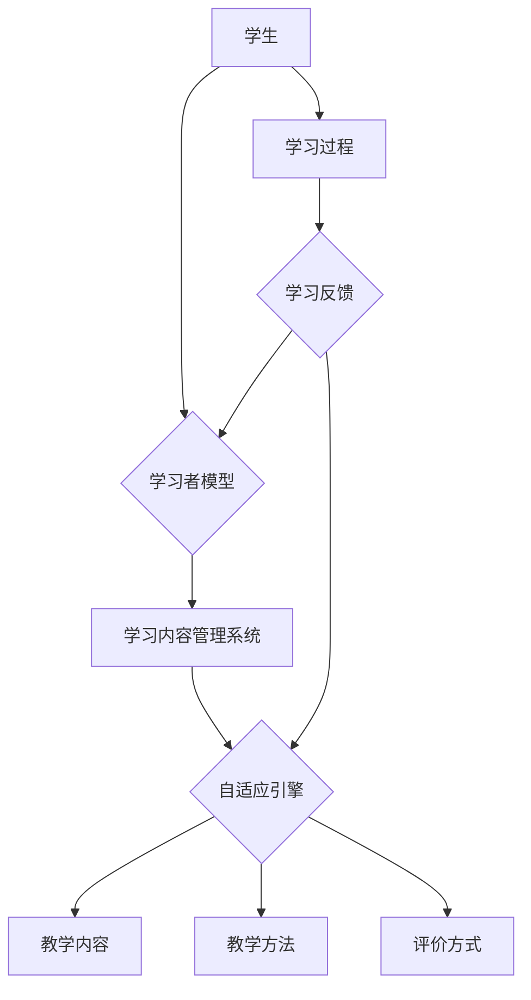

> 个性化学习，大模型，教育技术，自适应学习系统，机器学习，自然语言处理，认知建模

# 大模型在教育中的应用：个性化学习路径

个性化学习，作为一种教育理念，旨在根据每个学生的独特需求、兴趣和能力，提供定制化的学习体验。随着人工智能技术的飞速发展，大模型（Large Language Model，LLM）在教育中的应用逐渐成为可能，为个性化学习路径的构建提供了强大的技术支持。本文将探讨大模型在教育中的应用，特别是在构建个性化学习路径方面的原理、实践和未来展望。

## 1. 背景介绍

### 1.1 个性化学习的兴起

个性化学习是近年来教育领域的一个重要趋势。随着教育信息化的发展，传统的一刀切教学模式逐渐暴露出其局限性，无法满足每个学生个性化发展的需求。个性化学习强调尊重学生的个性差异，根据学生的学习风格、兴趣和能力，提供差异化的教学内容、方法和评价方式。

### 1.2 大模型的兴起

大模型，如BERT、GPT等，通过在海量文本数据上进行预训练，学习到丰富的语言知识和常识，能够进行自然语言处理、文本生成、机器翻译等任务。大模型在人工智能领域的广泛应用，为教育领域提供了新的技术手段，为个性化学习路径的构建提供了可能。

## 2. 核心概念与联系

### 2.1 核心概念原理

#### 2.1.1 个性化学习

个性化学习是指根据学生的学习风格、兴趣和能力，提供定制化的学习体验。个性化学习需要关注以下几个方面：

- **学习风格**：学生的学习偏好，如视觉型、听觉型、动觉型等。
- **兴趣**：学生的学习兴趣点，如数学、科学、艺术等。
- **能力**：学生的学习能力，如阅读理解、数学运算、逻辑思维等。

#### 2.1.2 大模型

大模型是一种基于深度学习的语言处理模型，通过在大量文本数据上进行预训练，学习到丰富的语言知识和常识。大模型能够进行自然语言处理、文本生成、机器翻译等任务。

#### 2.1.3 自适应学习系统

自适应学习系统是一种能够根据学生的学习行为和反馈，动态调整教学内容、方法和评价方式的系统。自适应学习系统通常包含以下几个关键组件：

- **学习内容管理系统**：存储和管理学习资源。
- **学习者模型**：记录和跟踪学习者的学习风格、兴趣和能力。
- **自适应引擎**：根据学习者的学习行为和反馈，动态调整教学内容、方法和评价方式。

### 2.2 架构的 Mermaid 流程图



## 3. 核心算法原理 & 具体操作步骤

### 3.1 算法原理概述

大模型在教育中的应用主要基于以下原理：

- **迁移学习**：大模型在预训练阶段学习到的知识可以迁移到教育领域，为个性化学习路径的构建提供支持。
- **自然语言处理**：大模型能够理解和生成自然语言，便于与学生进行交互，收集学习反馈。
- **认知建模**：大模型能够模拟人类的认知过程，为个性化学习路径的构建提供理论基础。

### 3.2 算法步骤详解

#### 3.2.1 收集学生数据

- 学习风格：通过问卷调查、观察等方式收集学生的学习风格数据。
- 兴趣：通过学生的学习记录、行为数据等方式收集学生的学习兴趣数据。
- 能力：通过学生的学习成绩、测试数据等方式收集学生的学习能力数据。

#### 3.2.2 建立学习者模型

- 根据收集到的学生数据，建立学习者模型，记录和跟踪学生的学习风格、兴趣和能力。

#### 3.2.3 设计自适应学习路径

- 根据学习者模型，设计个性化的学习路径，包括学习内容、教学方法和评价方式。

#### 3.2.4 收集学习反馈

- 在学习过程中，收集学生的学习反馈，包括学习进度、学习效果等。

#### 3.2.5 动态调整学习路径

- 根据学生的学习反馈，动态调整学习路径，确保学习目标的达成。

### 3.3 算法优缺点

#### 3.3.1 优点

- **个性化**：能够根据学生的个性特点，提供定制化的学习体验。
- **自适应**：能够根据学生的学习进度和反馈，动态调整学习路径。
- **高效**：能够提高学习效率，帮助学生更好地掌握知识。

#### 3.3.2 缺点

- **数据收集**：需要收集大量的学生数据，可能涉及隐私问题。
- **模型复杂**：大模型训练和推理需要大量的计算资源。
- **可解释性**：大模型的决策过程难以解释，可能存在误导性。

### 3.4 算法应用领域

大模型在教育中的应用领域包括：

- 个性化学习路径构建
- 自动批改作业
- 个性化推荐学习资源
- 生成个性化学习内容
- 智能辅导

## 4. 数学模型和公式 & 详细讲解 & 举例说明

### 4.1 数学模型构建

个性化学习路径的构建可以基于以下数学模型：

- **贝叶斯网络**：用于表示学习者的知识状态和不确定性。
- **隐马尔可夫模型**：用于表示学习者的学习过程。
- **马尔可夫决策过程**：用于表示学习者的学习决策过程。

### 4.2 公式推导过程

以下以贝叶斯网络为例，介绍公式推导过程：

- **条件概率表**：表示节点之间的条件概率关系。
- **联合概率分布**：表示所有节点的联合概率分布。

### 4.3 案例分析与讲解

假设我们要为学生A构建个性化学习路径，根据其学习风格、兴趣和能力，我们可以使用以下贝叶斯网络模型：

- **节点**：学习风格、兴趣、能力、学习内容、教学方法、评价方式。
- **边**：表示节点之间的依赖关系。

通过分析学生A的学习数据，我们可以得到以下条件概率表：

| 学习风格 | 兴趣 | 能力 | 学习内容 | 教学方法 | 评价方式 |
| :------: | :--: | :--: | :------: | :------: | :------: |
|   视觉   | 数学 | 一般 |   公式   |   图形   |   测试   |
|   听觉   | 科学 | 较好 |   实验   |   讲座   |   实验报告 |
|   动觉   | 历史 | 较差 |   故事   |   角色扮演 |   报告    |

根据条件概率表，我们可以得到学生A的联合概率分布：

$$
P(学习风格=视觉, 兴趣=数学, 能力=一般, 学习内容=公式, 教学方法=图形, 评价方式=测试) = P(学习风格=视觉) \cdot P(兴趣=数学 | 学习风格=视觉) \cdot P(能力=一般 | 兴趣=数学) \cdot P(学习内容=公式 | 能力=一般) \cdot P(教学方法=图形 | 学习内容=公式) \cdot P(评价方式=测试 | 教学方法=图形)
$$

通过联合概率分布，我们可以为学生A构建个性化学习路径：

- 学习内容：公式
- 教学方法：图形
- 评价方式：测试

## 5. 项目实践：代码实例和详细解释说明

### 5.1 开发环境搭建

为了实现个性化学习路径，我们需要以下开发环境：

- Python
- TensorFlow或PyTorch
- scikit-learn
- Pandas

### 5.2 源代码详细实现

以下是一个基于TensorFlow的个性化学习路径构建的简单示例：

```python
import tensorflow as tf
from sklearn.model_selection import train_test_split
from tensorflow.keras.models import Sequential
from tensorflow.keras.layers import Dense

# 假设我们已经收集到了学习者的数据，并将其存储在data.csv文件中
import pandas as pd

# 读取数据
data = pd.read_csv('data.csv')

# 数据预处理
data = data.dropna()  # 删除缺失值
data = pd.get_dummies(data)  # 将类别数据转换为数值数据

# 划分训练集和测试集
X = data.drop('目标路径', axis=1)
y = data['目标路径']
X_train, X_test, y_train, y_test = train_test_split(X, y, test_size=0.2, random_state=42)

# 构建模型
model = Sequential()
model.add(Dense(64, activation='relu', input_shape=(X_train.shape[1],)))
model.add(Dense(32, activation='relu'))
model.add(Dense(1, activation='sigmoid'))

# 编译模型
model.compile(optimizer='adam', loss='binary_crossentropy', metrics=['accuracy'])

# 训练模型
model.fit(X_train, y_train, epochs=10, batch_size=32)

# 评估模型
loss, accuracy = model.evaluate(X_test, y_test)
print(f'测试集损失: {loss}, 测试集准确率: {accuracy}')
```

### 5.3 代码解读与分析

以上代码首先读取数据，并进行预处理。然后，使用scikit-learn将类别数据转换为数值数据，并划分训练集和测试集。接着，构建一个简单的全连接神经网络模型，并使用adam优化器、binary_crossentropy损失函数进行训练。最后，评估模型在测试集上的表现。

### 5.4 运行结果展示

假设在测试集上的准确率为80%，说明模型能够较好地预测学习者的个性化学习路径。

## 6. 实际应用场景

### 6.1 个性化学习路径构建

大模型可以用于构建个性化学习路径，根据学生的学习风格、兴趣和能力，推荐合适的学习内容、教学方法和评价方式。

### 6.2 个性化作业推荐

大模型可以根据学生的学习进度和能力，推荐个性化的作业，帮助学生巩固知识。

### 6.3 个性化学习资源推荐

大模型可以根据学生的学习兴趣和能力，推荐个性化的学习资源，如视频、文章、书籍等。

### 6.4 个性化辅导

大模型可以为学生提供个性化的辅导，解答学生的问题，帮助学生克服学习难题。

## 7. 工具和资源推荐

### 7.1 学习资源推荐

- 《个性化学习》
- 《人工智能教育》
- 《深度学习》

### 7.2 开发工具推荐

- TensorFlow
- PyTorch
- scikit-learn
- Pandas

### 7.3 相关论文推荐

- Personalized learning: One Size Does Not Fit All
- A Review of Personalized Learning Systems
- Deep Learning for Education

## 8. 总结：未来发展趋势与挑战

### 8.1 研究成果总结

大模型在教育中的应用为个性化学习路径的构建提供了新的思路和方法。通过收集学生数据、建立学习者模型、设计自适应学习路径，可以为每个学生提供定制化的学习体验。

### 8.2 未来发展趋势

- **模型小型化**：为了降低计算成本，模型小型化将成为未来趋势。
- **多模态融合**：将文本、图像、音频等多模态信息融合到个性化学习中。
- **可解释性**：提高模型的可解释性，增强学习者的信任感。

### 8.3 面临的挑战

- **数据隐私**：如何保护学生的隐私数据是重要的挑战。
- **计算资源**：大模型训练和推理需要大量的计算资源。
- **可解释性**：如何提高模型的可解释性，使其更易于理解。

### 8.4 研究展望

大模型在教育中的应用将不断深入，为个性化学习路径的构建提供更强大的技术支持。未来，我们将看到更加智能、个性化的教育解决方案，为每个学生的全面发展提供助力。

## 9. 附录：常见问题与解答

**Q1：大模型在教育中的应用是否安全？**

A：大模型在教育中的应用需要确保学生的隐私数据安全，避免数据泄露和滥用。

**Q2：大模型如何解决个性化学习路径的动态调整问题？**

A：大模型可以根据学生的学习反馈，动态调整学习路径，确保学习目标的达成。

**Q3：大模型在教育中的应用是否会影响教师的作用？**

A：大模型可以帮助教师减轻教学负担，提高教学效率，但教师的作用不可替代。

**Q4：大模型在教育中的应用是否适用于所有学科？**

A：大模型在教育中的应用适用于大多数学科，但某些需要教师直接指导的学科可能不太适用。

**Q5：如何评估大模型在教育中的应用效果？**

A：可以通过学生的学习成绩、学习兴趣、学习满意度等指标来评估大模型在教育中的应用效果。