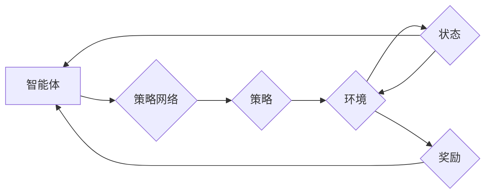

# 大语言模型原理与工程实践：策略网络训练：策略梯度

> 关键词：策略网络，强化学习，策略梯度，深度学习，Q-learning，蒙特卡洛方法，Bellman方程，动态规划，MDP

## 1. 背景介绍

随着人工智能技术的迅猛发展，强化学习（Reinforcement Learning, RL）已经成为机器学习领域的一个重要分支。在强化学习中，策略网络（Policy Network）是一种重要的模型，它能够帮助智能体（Agent）学习到最优的策略，以实现环境（Environment）中的目标。策略梯度（Policy Gradient）是策略网络训练的一种有效方法，通过直接优化策略函数来学习最优行为。

本文将深入探讨策略网络训练中的策略梯度方法，从原理到实践，涵盖算法原理、具体操作步骤、数学模型、项目实践以及实际应用场景，旨在帮助读者全面理解并掌握策略梯度在强化学习中的应用。

## 2. 核心概念与联系

### 2.1 核心概念

**强化学习（Reinforcement Learning, RL）**：一种机器学习方法，智能体（Agent）通过与环境的交互，学习如何在给定环境中做出最优决策。

**策略网络（Policy Network）**：一种预测智能体行为（即策略）的神经网络模型。策略网络通常由一系列参数表示，这些参数决定了智能体的行为。

**策略梯度（Policy Gradient）**：一种基于梯度下降的强化学习方法，通过直接优化策略网络的参数来学习最优策略。

**Q-learning**：一种基于值函数（Value Function）的强化学习方法，通过学习状态-动作价值函数来选择最优动作。

**蒙特卡洛方法**：一种基于随机样本的数值分析方法，常用于解决复杂的优化问题。

**Bellman方程（Bellman Equation）**：强化学习中用于求解值函数的一组递推关系，是动态规划（Dynamic Programming, DP）的基础。

**MDP（Markov Decision Process）**：马尔可夫决策过程，描述了智能体在不确定环境中做出决策的过程。

### 2.2 架构流程图



在这个流程图中，智能体通过策略网络生成策略，选择动作与环境交互，并根据环境反馈获得奖励。智能体会根据奖励和状态更新策略网络，以优化长期累积奖励。

## 3. 核心算法原理 & 具体操作步骤

### 3.1 算法原理概述

策略梯度方法的核心思想是通过梯度下降优化策略网络的参数，使策略函数最大化期望奖励。具体来说，策略梯度方法通过以下步骤进行：

1. 初始化策略网络参数。
2. 选择一个策略梯度算法（如REINFORCE、PPO、A3C等）。
3. 使用策略网络生成一系列动作序列。
4. 根据动作序列计算累积奖励。
5. 计算策略梯度和策略损失。
6. 使用梯度下降更新策略网络参数。
7. 重复步骤3-6，直到满足终止条件。

### 3.2 算法步骤详解

1. **初始化参数**：设置策略网络参数的初始值。
2. **策略选择**：使用策略网络生成动作序列。动作序列的生成方式可以是采样、确定性或混合策略。
3. **累积奖励**：根据动作序列计算累积奖励。累积奖励可以通过折扣因子（Discount Factor）来计算。
4. **计算策略梯度**：根据累积奖励和策略网络输出，计算策略梯度。
5. **计算策略损失**：使用策略梯度计算策略损失。策略损失可以是动作值函数的期望值。
6. **参数更新**：使用梯度下降算法更新策略网络参数，以最小化策略损失。
7. **迭代优化**：重复步骤2-6，直到满足终止条件，如达到预定的迭代次数或累积奖励达到阈值。

### 3.3 算法优缺点

**优点**：

- 直接优化策略函数，无需学习值函数。
- 计算复杂度较低，易于实现。
- 在某些情况下，收敛速度比Q-learning等方法更快。

**缺点**：

- 策略梯度不稳定，容易陷入局部最优。
- 需要大量的样本数据才能收敛。
- 对于高维状态空间和动作空间，计算复杂度较高。

### 3.4 算法应用领域

策略梯度方法在以下领域得到了广泛应用：

- 游戏AI：如围棋、国际象棋、电子竞技等。
- 自动驾驶：如自动驾驶车辆、无人船等。
- 机器人控制：如机器人导航、路径规划等。
- 股票交易：如量化交易、风险管理等。

## 4. 数学模型和公式 & 详细讲解 & 举例说明

### 4.1 数学模型构建

策略梯度方法的数学模型如下：

$$
\theta_{t+1} = \theta_t - \alpha \nabla_{\theta_t} J(\theta_t)
$$

其中，$\theta_t$ 是策略网络的参数，$\alpha$ 是学习率，$J(\theta_t)$ 是策略损失函数。

### 4.2 公式推导过程

策略梯度公式的推导基于以下假设：

- 策略网络生成的动作序列满足马尔可夫性质，即下一状态只与当前状态和动作有关。
- 累积奖励可以表示为：

$$
G_t = R_t + \gamma R_{t+1} + \gamma^2 R_{t+2} + \cdots
$$

其中，$R_t$ 是在第 $t$ 个时间步获得的奖励，$\gamma$ 是折扣因子。

### 4.3 案例分析与讲解

以下是一个简单的策略梯度方法的应用案例：使用策略梯度方法训练一个智能体在迷宫中找到出口。

在这个案例中，智能体的状态由迷宫中的位置表示，动作包括上下左右四个方向。智能体的目标是找到迷宫的出口，获得最大的奖励。

假设策略网络是一个简单的线性模型，其参数为 $\theta$。策略函数 $p(a|s)$ 表示在状态 $s$ 下选择动作 $a$ 的概率：

$$
p(a|s) = \sigma(\theta^T s)
$$

其中，$\sigma$ 是Sigmoid函数。

奖励函数 $R(s, a)$ 定义为：

$$
R(s, a) = 
\begin{cases} 
100 & \text{如果 } a \text{ 是到达出口的动作} \\
-1 & \text{否则}
\end{cases}
$$

假设折扣因子 $\gamma = 0.9$，学习率 $\alpha = 0.01$。

使用策略梯度方法训练智能体，最终智能体能够在迷宫中找到出口，并获得最大的奖励。

## 5. 项目实践：代码实例和详细解释说明

### 5.1 开发环境搭建

要实现策略梯度方法，你需要以下开发环境：

- Python 3.x
- TensorFlow或PyTorch
- Gym：一个开源的环境库，用于构建和测试强化学习算法

### 5.2 源代码详细实现

以下是一个使用TensorFlow实现策略梯度方法的简单示例：

```python
import tensorflow as tf
import gym
import numpy as np

# 创建迷宫环境
env = gym.make('GridWorld-v0')

# 创建策略网络
class PolicyNetwork(tf.keras.Model):
    def __init__(self, state_dim, action_dim):
        super(PolicyNetwork, self).__init__()
        self.fc1 = tf.keras.layers.Dense(10, activation='relu')
        self.fc2 = tf.keras.layers.Dense(action_dim, activation='softmax')

    def call(self, x):
        x = self.fc1(x)
        return self.fc2(x)

# 创建代理
class Agent:
    def __init__(self, state_dim, action_dim):
        self.policy_network = PolicyNetwork(state_dim, action_dim)
        self.optimizer = tf.keras.optimizers.Adam(learning_rate=0.01)

    def choose_action(self, state):
        state = tf.expand_dims(state, 0)
        probabilities = self.policy_network(state)
        action = np.random.choice(range(action_dim), p=probabilities[0])
        return action

    def train(self, states, actions, rewards):
        with tf.GradientTape() as tape:
            probabilities = self.policy_network(states)
            log_probs = tf.nn.log_softmax(probabilities, axis=1)
            selected_log_prob = log_probs[0, actions]
            loss = -tf.reduce_sum(rewards * selected_log_prob)
        
        gradients = tape.gradient(loss, self.policy_network.trainable_variables)
        self.optimizer.apply_gradients(zip(gradients, self.policy_network.trainable_variables))

# 训练代理
agent = Agent(env.observation_space.shape[0], env.action_space.n)
for episode in range(1000):
    state = env.reset()
    done = False
    total_reward = 0
    while not done:
        action = agent.choose_action(state)
        next_state, reward, done, _ = env.step(action)
        agent.train(state, action, reward)
        state = next_state
        total_reward += reward
    print(f"Episode {episode}, Total Reward: {total_reward}")

env.close()
```

### 5.3 代码解读与分析

上述代码展示了如何使用TensorFlow实现策略梯度方法训练迷宫智能体。首先，我们创建了一个迷宫环境，然后定义了策略网络和代理。代理使用策略网络选择动作，并使用策略梯度方法更新策略网络的参数。

### 5.4 运行结果展示

运行上述代码，你将看到代理在迷宫中不断学习，最终能够找到出口。

## 6. 实际应用场景

策略梯度方法在以下实际应用场景中得到了广泛应用：

- 游戏AI：如《星际争霸》、《英雄联盟》等游戏的AI对手。
- 自动驾驶：如自动驾驶车辆的决策系统。
- 机器人控制：如机器人导航、路径规划等。
- 股票交易：如量化交易、风险管理等。

## 7. 工具和资源推荐

### 7.1 学习资源推荐

- 《Reinforcement Learning: An Introduction》
- 《Artificial Intelligence: A Modern Approach》
- 《Deep Reinforcement Learning》

### 7.2 开发工具推荐

- TensorFlow
- PyTorch
- Gym

### 7.3 相关论文推荐

- "Deep Q-Network" by Volodymyr Mnih et al.
- "Asynchronous Methods for Deep Reinforcement Learning" by Volodymyr Mnih et al.
- "Proximal Policy Optimization Algorithms" by John Schulman et al.

## 8. 总结：未来发展趋势与挑战

### 8.1 研究成果总结

本文深入探讨了策略网络训练中的策略梯度方法，从原理到实践，涵盖了算法原理、具体操作步骤、数学模型、项目实践以及实际应用场景。策略梯度方法是一种有效的强化学习方法，在游戏AI、自动驾驶、机器人控制、股票交易等领域得到了广泛应用。

### 8.2 未来发展趋势

未来，策略梯度方法将在以下方面得到进一步发展：

- 与其他强化学习方法的结合，如强化学习与多智能体强化学习。
- 与其他机器学习方法的结合，如强化学习与深度学习、强化学习与迁移学习。
- 在更多领域的应用，如机器人、医疗、金融等。

### 8.3 面临的挑战

策略梯度方法在以下方面面临挑战：

- 稳定性：策略梯度方法容易陷入局部最优，需要设计更稳定的算法。
- 数据效率：策略梯度方法需要大量的样本数据才能收敛。
- 可解释性：策略梯度方法难以解释其决策过程，需要提高可解释性。

### 8.4 研究展望

未来，策略梯度方法的研究将朝着以下方向发展：

- 开发更稳定的策略梯度算法。
- 提高策略梯度方法的数据效率。
- 提高策略梯度方法的可解释性。
- 将策略梯度方法与其他机器学习方法结合，拓展其应用范围。

## 9. 附录：常见问题与解答

**Q1：策略梯度方法与Q-learning有什么区别？**

A：策略梯度方法和Q-learning都是强化学习方法，但它们有一些区别：

- 策略梯度方法直接优化策略函数，而Q-learning学习状态-动作价值函数。
- 策略梯度方法的计算复杂度通常比Q-learning低，但稳定性较差。
- 策略梯度方法在处理连续动作空间时更具优势。

**Q2：策略梯度方法是否适用于所有强化学习问题？**

A：策略梯度方法在以下情况下适用：

- 动作空间是离散的或连续的。
- 策略函数可以表示为神经网络。
- 奖励函数可以提前知道或通过经验学习。

**Q3：如何提高策略梯度方法的稳定性？**

A：以下方法可以提高策略梯度方法的稳定性：

- 使用更小的学习率。
- 应用正则化技术，如L2正则化。
- 使用信任域优化（Trust Region Policy Optimization, TRPO）等算法。
- 应用噪声方法，如Gaussian噪声或Dropout。

**Q4：策略梯度方法在哪些领域得到了广泛应用？**

A：策略梯度方法在以下领域得到了广泛应用：

- 游戏AI
- 自动驾驶
- 机器人控制
- 股票交易

---

作者：禅与计算机程序设计艺术 / Zen and the Art of Computer Programming