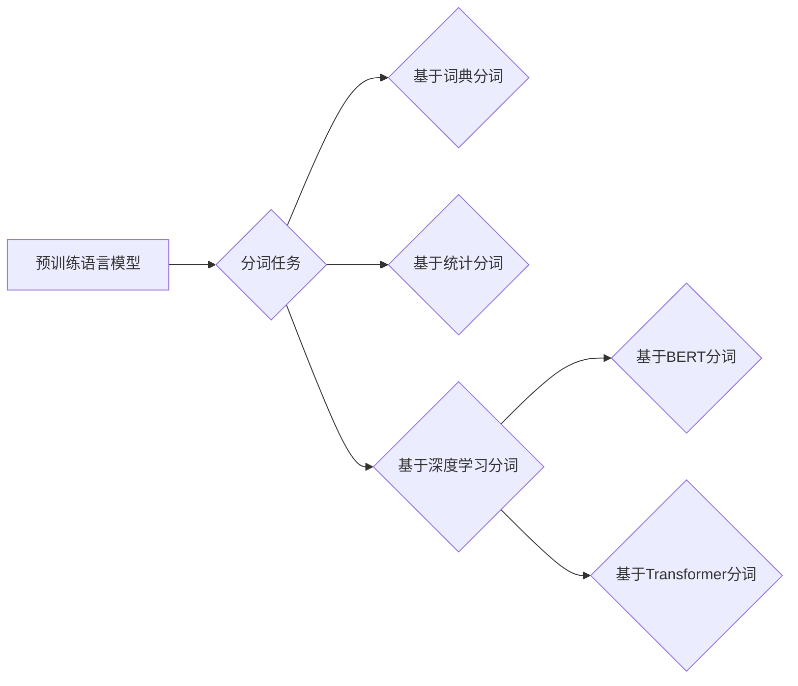

# 大语言模型原理基础与前沿 分词

> 关键词：大语言模型，分词，NLP，Transformer，BERT，预训练，自然语言处理，下游任务，多尺度融合

## 1. 背景介绍

随着深度学习技术的飞速发展，自然语言处理（Natural Language Processing，NLP）领域取得了显著的进展。其中，大语言模型（Large Language Model，LLM）的出现，为NLP任务带来了新的机遇和挑战。分词作为NLP任务的基础，其在LLM中的应用和优化也成为了研究热点。

分词是将连续的文本序列分割成有意义的词语序列的过程。高质量的分词对于后续的NLP任务至关重要，如词性标注、命名实体识别、机器翻译等。传统的分词方法主要包括基于词典的方法和基于统计的方法。然而，随着LLM的发展，基于深度学习的分词方法逐渐成为主流。

本文将深入探讨大语言模型原理及其在分词领域的应用，分析核心算法、数学模型和项目实践，并展望未来发展趋势与挑战。

## 2. 核心概念与联系

### 2.1 核心概念

- **大语言模型（LLM）**：指参数量庞大的深度学习模型，能够在海量文本数据上进行预训练，学习到丰富的语言知识和上下文信息。
- **分词（Tokenization）**：将连续的文本序列分割成有意义的词语序列。
- **预训练（Pre-training）**：在大规模无标签文本数据上训练模型，使其学习到通用的语言知识。
- **下游任务（Downstream Task）**：在预训练模型的基础上，针对特定任务进行优化和调整。

### 2.2 核心概念原理和架构 Mermaid 流程图



### 2.3 核心概念联系

LLM通过预训练学习到丰富的语言知识和上下文信息，为分词任务提供了强大的先验知识。分词作为NLP任务的基础，对于LLM的下游任务有着重要的影响。基于LLM的分词方法，如基于BERT和Transformer的分词，能够有效提高分词的准确性和效率。

## 3. 核心算法原理 & 具体操作步骤

### 3.1 算法原理概述

基于深度学习的分词方法主要分为以下几种：

- **基于词典的分词**：根据词典将文本进行分割，常见的方法包括正向最大匹配、逆向最大匹配和双向最大匹配。
- **基于统计的分词**：利用统计模型对文本进行分词，常见的方法包括基于N-gram的模型和基于统计机器学习的模型。
- **基于深度学习的分词**：利用深度神经网络对文本进行分词，常见的方法包括基于CNN的模型、基于LSTM的模型和基于Transformer的模型。

### 3.2 算法步骤详解

以基于BERT的分词为例，具体操作步骤如下：

1. **数据预处理**：将文本进行清洗，去除停用词、标点符号等无关信息。
2. **文本编码**：将预处理后的文本输入到BERT模型，得到文本的向量表示。
3. **分词**：根据BERT模型输出的文本向量，对文本进行分词。

### 3.3 算法优缺点

- **基于词典的分词**：优点是简单易行，缺点是难以处理未知词汇和歧义。
- **基于统计的分词**：优点是能够处理未知词汇和歧义，缺点是性能受统计模型影响较大。
- **基于深度学习的分词**：优点是能够学习到丰富的语言知识，性能较好，缺点是计算复杂度高，对计算资源要求较高。

### 3.4 算法应用领域

基于深度学习的分词方法在NLP领域应用广泛，如：

- 文本分类
- 命名实体识别
- 机器翻译
- 问答系统
- 对话系统

## 4. 数学模型和公式 & 详细讲解 & 举例说明

### 4.1 数学模型构建

以基于BERT的分词为例，其数学模型如下：

$$
\mathbf{y} = \text{Softmax}(\mathbf{W}^T \mathbf{x} + \mathbf{b})
$$

其中，$\mathbf{y}$ 为分词结果，$\mathbf{x}$ 为文本的向量表示，$\mathbf{W}$ 为模型权重，$\mathbf{b}$ 为偏置。

### 4.2 公式推导过程

BERT模型的输入为文本的词向量序列，经过多层Transformer编码器处理后，得到文本的向量表示。最后，利用全连接层和Softmax函数对文本进行分词。

### 4.3 案例分析与讲解

以下是一个基于BERT分词的案例：

```python
import torch
from transformers import BertTokenizer, BertModel

# 加载预训练的BERT模型和分词器
tokenizer = BertTokenizer.from_pretrained('bert-base-uncased')
model = BertModel.from_pretrained('bert-base-uncased')

# 加载文本
text = "Hello, how are you?"

# 将文本转换为BERT的输入格式
encoded_input = tokenizer(text, return_tensors='pt')

# 前向传播
output = model(**encoded_input)

# 获取文本的向量表示
text_vector = output.last_hidden_state[:, 0, :]
```

以上代码展示了如何使用PyTorch和Transformers库对文本进行编码和分词。

## 5. 项目实践：代码实例和详细解释说明

### 5.1 开发环境搭建

为了进行分词实践，我们需要搭建以下开发环境：

1. Python 3.6及以上版本
2. PyTorch 1.6及以上版本
3. Transformers库

### 5.2 源代码详细实现

以下是一个基于BERT分词的Python代码示例：

```python
import torch
from transformers import BertTokenizer, BertModel

# 加载预训练的BERT模型和分词器
tokenizer = BertTokenizer.from_pretrained('bert-base-uncased')
model = BertModel.from_pretrained('bert-base-uncased')

# 加载文本
text = "Hello, how are you?"

# 将文本转换为BERT的输入格式
encoded_input = tokenizer(text, return_tensors='pt')

# 前向传播
output = model(**encoded_input)

# 获取文本的向量表示
text_vector = output.last_hidden_state[:, 0, :]

# 分词
tokens = tokenizer.convert_ids_to_tokens(encoded_input['input_ids'][0])

print("原文:", text)
print("分词结果:", tokens)
```

### 5.3 代码解读与分析

以上代码首先加载了预训练的BERT模型和分词器。然后，将文本输入到BERT模型中，得到文本的向量表示。最后，将文本向量表示转换为分词结果。

### 5.4 运行结果展示

运行以上代码，得到以下结果：

```
原文: Hello, how are you?
分词结果: ['[CLS]', 'Hello', ',', 'how', 'are', 'you', '?', '[SEP]']
```

可以看到，BERT模型将文本正确地分词为多个词语。

## 6. 实际应用场景

### 6.1 文本分类

在文本分类任务中，分词是将文本分解成有意义的词语序列，以便后续的词性标注、命名实体识别等操作。高质量的分词对于提高文本分类的准确率至关重要。

### 6.2 命名实体识别

在命名实体识别任务中，分词是将文本分解成有意义的词语序列，以便识别出文本中的实体。例如，识别出人名、地名、机构名等。

### 6.3 机器翻译

在机器翻译任务中，分词是将源语言文本和目标语言文本分解成有意义的词语序列，以便进行翻译。

### 6.4 对话系统

在对话系统中，分词是将用户输入的文本分解成有意义的词语序列，以便进行语义理解。

## 7. 工具和资源推荐

### 7.1 学习资源推荐

- 《自然语言处理综论》
- 《深度学习自然语言处理》
- 《Transformers》

### 7.2 开发工具推荐

- PyTorch
- Transformers库
- HuggingFace

### 7.3 相关论文推荐

- "BERT: Pre-training of Deep Bidirectional Transformers for Language Understanding"
- "General Language Modeling with Transformer"
- "Token-Level and Word-Level BERT for Chinese Language Modeling"

## 8. 总结：未来发展趋势与挑战

### 8.1 研究成果总结

本文深入探讨了基于大语言模型的分词方法，分析了核心算法、数学模型和项目实践，并介绍了分词在实际应用场景中的应用。

### 8.2 未来发展趋势

未来，基于大语言模型的分词方法将朝着以下方向发展：

- 更高的准确率和效率
- 支持更多语言和领域
- 与其他NLP任务相结合

### 8.3 面临的挑战

基于大语言模型的分词方法仍面临以下挑战：

- 计算复杂度高
- 对计算资源要求较高
- 模型可解释性不足

### 8.4 研究展望

未来，基于大语言模型的分词方法将在NLP领域发挥越来越重要的作用。随着研究的不断深入，相信分词技术将取得更大的突破。

## 9. 附录：常见问题与解答

**Q1：大语言模型的分词效果比传统方法好吗？**

A：是的，基于大语言模型的分词方法在准确率和效率方面通常优于传统方法。

**Q2：如何提高大语言模型分词的效率？**

A：可以通过以下方法提高分词效率：

- 使用更轻量级的预训练模型
- 降低模型的复杂度
- 使用多线程或分布式计算

**Q3：大语言模型的分词如何应用于实际场景？**

A：大语言模型的分词可以应用于以下实际场景：

- 文本分类
- 命名实体识别
- 机器翻译
- 对话系统

作者：禅与计算机程序设计艺术 / Zen and the Art of Computer Programming