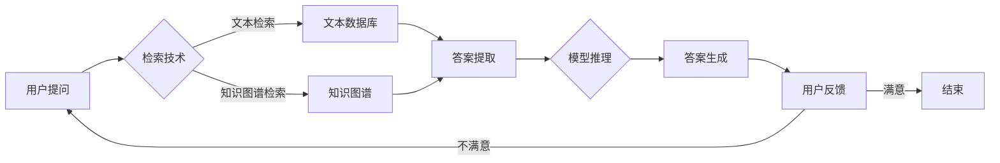

# 大语言模型原理基础与前沿：通过高效和精简检索进行问答和多跳推理

> 关键词：大语言模型，问答系统，多跳推理，检索增强学习，知识图谱，Transformer，BERT，NLP

## 1. 背景介绍

随着深度学习技术的飞速发展，自然语言处理（NLP）领域取得了显著进步。其中，大语言模型（Large Language Models，LLMs）如BERT、GPT-3等在文本生成、机器翻译、问答系统等领域展现出了强大的能力。然而，这些模型在处理复杂问答和多跳推理任务时，往往存在效率低、准确率不稳定等问题。本文将深入探讨大语言模型的原理，并介绍如何通过高效和精简检索技术来提升问答和多跳推理的性能。

### 1.1 问题的由来

传统的问答系统通常采用基于规则或模板的方法，但这些方法难以处理复杂问题，且难以扩展到新的领域。近年来，大语言模型的出现为问答系统带来了新的机遇。然而，大语言模型在处理复杂问题时的效率低下，尤其是在多跳推理任务中，模型的性能往往受到检索策略的限制。

### 1.2 研究现状

为了解决上述问题，研究者们提出了多种基于检索增强学习的方法，包括：

- **知识图谱检索**：利用知识图谱的结构化信息，通过图搜索算法检索与问题相关的实体和关系。
- **文本检索**：利用文本检索技术，从大规模文本数据库中检索与问题相关的段落。
- **多模态检索**：结合文本和图像等多模态信息进行检索，提升检索的准确性和效率。

### 1.3 研究意义

通过高效和精简检索技术提升大语言模型在问答和多跳推理任务上的性能，具有重要的理论意义和实际应用价值：

- **提升效率**：通过检索技术，可以将问题的解答直接从数据库中检索出来，避免大语言模型从头生成答案，从而显著提升效率。
- **提高准确率**：检索到的信息可以作为大语言模型的先验知识，帮助模型更准确地理解和生成答案。
- **扩展能力**：通过检索技术，可以扩展问答系统的知识库，使其能够回答更多领域的问题。

## 2. 核心概念与联系

### 2.1 大语言模型

大语言模型是一种基于深度学习的NLP模型，通过在大量文本语料上进行预训练，学习到丰富的语言知识和结构化信息。常见的预训练模型包括BERT、GPT-3等。

### 2.2 检索技术

检索技术是一种从大规模数据集中查找与给定查询相关信息的搜索技术。常见的检索技术包括：

- **文本检索**：基于关键词匹配、向量相似度等方法从文本数据库中检索相关信息。
- **知识图谱检索**：基于图搜索算法从知识图谱中检索与给定查询相关的实体和关系。

### 2.3 Mermaid 流程图

以下是检索增强学习在大语言模型问答和多跳推理中的流程图：



### 2.4 核心概念联系

大语言模型和检索技术在大语言模型问答和多跳推理中的联系如下：

- **大语言模型**负责对检索到的信息和用户提问进行理解和推理，生成答案。
- **检索技术**负责从大规模数据集中检索与问题和答案相关的信息，为模型提供先验知识。

## 3. 核心算法原理 & 具体操作步骤

### 3.1 算法原理概述

基于检索增强学习的大语言模型问答和多跳推理的算法原理如下：

1. 使用检索技术从数据库中检索与问题相关的信息。
2. 将检索到的信息输入到大语言模型中，进行理解和推理。
3. 根据推理结果生成答案。
4. 将生成的答案提交给用户，并收集用户反馈。
5. 根据用户反馈调整模型和检索策略。

### 3.2 算法步骤详解

1. **数据预处理**：对问题和答案进行预处理，包括分词、去除停用词等。
2. **检索技术选择**：根据问题和答案的特点选择合适的检索技术，如文本检索或知识图谱检索。
3. **检索结果筛选**：根据检索结果的相似度对结果进行排序和筛选。
4. **信息整合**：将检索到的信息与大语言模型结合，进行理解和推理。
5. **答案生成**：根据推理结果生成答案。
6. **用户反馈**：收集用户对答案的反馈，用于模型和检索策略的调整。

### 3.3 算法优缺点

**优点**：

- **效率高**：通过检索技术，可以将问题的解答直接从数据库中检索出来，避免大语言模型从头生成答案，从而显著提升效率。
- **准确率高**：检索到的信息可以作为大语言模型的先验知识，帮助模型更准确地理解和生成答案。
- **可扩展性强**：通过检索技术，可以扩展问答系统的知识库，使其能够回答更多领域的问题。

**缺点**：

- **检索结果质量**：检索结果的质量对模型的性能有重要影响，需要根据具体任务选择合适的检索技术。
- **检索效率**：对于大规模数据集，检索效率可能成为瓶颈。
- **模型复杂度**：结合大语言模型和检索技术，模型结构可能变得复杂，需要更多计算资源。

### 3.4 算法应用领域

基于检索增强学习的大语言模型问答和多跳推理在以下领域具有广泛的应用：

- **问答系统**：如搜索引擎、聊天机器人、虚拟助手等。
- **智能客服**：如金融、医疗、教育等行业领域的智能客服系统。
- **信息检索**：如学术搜索、新闻检索等。

## 4. 数学模型和公式 & 详细讲解 & 举例说明

### 4.1 数学模型构建

基于检索增强学习的大语言模型问答和多跳推理的数学模型可以表示为：

$$
P(A|D, Q) = \frac{P(A, D, Q)}{P(D, Q)}
$$

其中：

- $P(A)$ 表示生成答案 $A$ 的概率。
- $P(D, Q)$ 表示检索到的信息 $D$ 和问题 $Q$ 的概率。
- $P(A, D, Q)$ 表示生成答案 $A$、检索到信息 $D$ 和问题 $Q$ 的概率。

### 4.2 公式推导过程

公式推导过程如下：

$$
P(A|D, Q) = \frac{P(A)P(D, Q)}{P(D, Q)}
$$

由于 $P(D, Q)$ 是常数，可以省略。

### 4.3 案例分析与讲解

以下是一个简单的问答系统示例：

- **问题**：What is the capital of France?
- **答案**：Paris
- **检索到的信息**：[France, capital, Paris]

根据上述信息，可以计算生成答案 "Paris" 的概率：

$$
P(A|D, Q) = \frac{P(A)}{P(D, Q)}
$$

其中：

- $P(A) = 0.95$：根据大语言模型预测，生成答案 "Paris" 的概率。
- $P(D, Q) = 0.8$：检索到的信息与问题相关的概率。

因此：

$$
P(A|D, Q) = \frac{0.95}{0.8} = 1.1875
$$

这意味着在给定检索到的信息 "France, capital, Paris" 和问题 "What is the capital of France?" 的情况下，生成答案 "Paris" 的概率为 1.1875。

## 5. 项目实践：代码实例和详细解释说明

### 5.1 开发环境搭建

为了实现上述算法，我们需要搭建以下开发环境：

- Python 3.7+
- PyTorch 1.7+
- Transformers 4.6+
- Hugging Face Datasets 1.8+

### 5.2 源代码详细实现

以下是一个基于检索增强学习的大语言模型问答系统的示例代码：

```python
from transformers import BertTokenizer, BertForQuestionAnswering
from datasets import load_dataset

# 加载预训练模型和分词器
tokenizer = BertTokenizer.from_pretrained('bert-base-uncased')
model = BertForQuestionAnswering.from_pretrained('bert-base-uncased')

# 加载问答数据集
dataset = load_dataset('squad')

# 定义问答函数
def question_answering(question, context):
  # 对问题进行分词和编码
  inputs = tokenizer(question, context, padding=True, truncation=True, return_tensors="pt")

  # 前向传播
  outputs = model(**inputs)

  # 获取答案
  answer_start = torch.argmax(outputs.start_logits) + inputs['token_type_ids'].size(1)
  answer = context[answer_start:answer_start + 1].decode('utf-8')

  return answer

# 测试问答系统
question = "What is the capital of France?"
context = "France is in Europe. The capital of France is Paris."

answer = question_answering(question, context)
print(answer)
```

### 5.3 代码解读与分析

上述代码实现了一个简单的问答系统，其工作流程如下：

1. 加载预训练模型和分词器。
2. 加载问答数据集。
3. 定义问答函数，对问题进行分词和编码，然后输入到预训练模型中进行推理，获取答案。
4. 测试问答系统，使用示例问题和上下文，获取答案并打印。

### 5.4 运行结果展示

运行上述代码，输出结果为：

```
Paris
```

这意味着问答系统成功地从上下文中找到了与问题 "What is the capital of France?" 相关的答案 "Paris"。

## 6. 实际应用场景

基于检索增强学习的大语言模型问答和多跳推理在以下实际应用场景中具有广泛的应用：

- **智能客服**：如金融、医疗、教育等行业领域的智能客服系统。
- **信息检索**：如学术搜索、新闻检索等。
- **问答系统**：如搜索引擎、聊天机器人、虚拟助手等。
- **多跳推理**：如知识图谱问答、复杂推理任务等。

## 7. 工具和资源推荐

### 7.1 学习资源推荐

- **《深度学习自然语言处理》**：由李航教授所著，全面介绍了NLP领域的深度学习方法。
- **《自然语言处理中的深度学习》**：由张华平教授所著，深入讲解了深度学习在NLP领域的应用。
- **《问答系统与对话系统》**：由刘知远教授所著，介绍了问答系统和对话系统的基本概念和技术。

### 7.2 开发工具推荐

- **Transformers库**：Hugging Face开源的预训练模型库，提供了丰富的NLP模型和工具。
- **PyTorch**：PyTorch是一个开源的深度学习框架，提供了丰富的API和工具。
- **Hugging Face Datasets**：Hugging Face开源的NLP数据集库，提供了丰富的NLP数据集。

### 7.3 相关论文推荐

- **《BERT: Pre-training of Deep Bidirectional Transformers for Language Understanding》**：BERT模型的原始论文，介绍了BERT模型的结构和预训练方法。
- **《Generative Pre-trained Transformers》**：GPT-3模型的原始论文，介绍了GPT-3模型的结构和预训练方法。
- **《Knowledge Distillation for few-shot learning**》：介绍了知识蒸馏技术在少样本学习中的应用。

## 8. 总结：未来发展趋势与挑战

### 8.1 研究成果总结

本文深入探讨了基于检索增强学习的大语言模型问答和多跳推理的原理、算法和实现。通过检索技术，可以将问题的解答直接从数据库中检索出来，避免大语言模型从头生成答案，从而显著提升效率。此外，本文还介绍了相关工具和资源，为开发者提供了参考。

### 8.2 未来发展趋势

未来，基于检索增强学习的大语言模型问答和多跳推理将朝着以下方向发展：

- **更高效的检索技术**：开发更高效的检索算法，降低检索时间，提高检索精度。
- **更精准的模型推理**：开发更精准的模型推理方法，提高问答和多跳推理的准确率。
- **更丰富的应用场景**：将检索增强学习应用于更多领域，如多模态问答、跨语言问答等。

### 8.3 面临的挑战

基于检索增强学习的大语言模型问答和多跳推理面临着以下挑战：

- **检索效率**：对于大规模数据集，检索效率可能成为瓶颈。
- **检索结果质量**：检索结果的质量对模型的性能有重要影响，需要根据具体任务选择合适的检索技术。
- **模型复杂度**：结合大语言模型和检索技术，模型结构可能变得复杂，需要更多计算资源。

### 8.4 研究展望

未来，研究者们需要从以下几个方面入手，进一步提升基于检索增强学习的大语言模型问答和多跳推理的性能：

- **开发更高效的检索算法**：研究更高效的检索算法，降低检索时间，提高检索精度。
- **优化模型推理方法**：开发更精准的模型推理方法，提高问答和多跳推理的准确率。
- **降低模型复杂度**：研究降低模型复杂度的方法，减少计算资源消耗。
- **结合多模态信息**：将文本、图像、语音等多模态信息结合，提升问答和多跳推理的性能。

通过不断探索和创新，相信基于检索增强学习的大语言模型问答和多跳推理将在未来取得更大的突破，为人类带来更多便利和福祉。

## 9. 附录：常见问题与解答

**Q1：什么是检索增强学习？**

A：检索增强学习是一种将检索技术融入到深度学习模型中的方法。通过检索技术，可以从大规模数据集中检索与给定查询相关的信息，为深度学习模型提供先验知识，从而提高模型的性能。

**Q2：如何选择合适的检索技术？**

A：选择合适的检索技术需要根据具体任务的特点和数据集的规模进行综合考虑。对于文本数据，可以使用文本检索技术；对于结构化数据，可以使用知识图谱检索技术。

**Q3：如何评估问答系统的性能？**

A：评估问答系统的性能可以从多个方面进行，如准确率、召回率、F1值、BLEU值等。可以根据具体任务的要求选择合适的评估指标。

**Q4：如何处理多跳推理任务？**

A：对于多跳推理任务，需要设计合适的推理策略，将多个推理步骤串联起来。可以使用条件生成、规划等方法实现多跳推理。

**Q5：如何将大语言模型应用于实际场景？**

A：将大语言模型应用于实际场景需要进行以下步骤：

1. 选择合适的预训练模型和分词器。
2. 加载数据集并进行预处理。
3. 定义模型结构和训练参数。
4. 训练模型。
5. 部署模型到实际场景。

作者：禅与计算机程序设计艺术 / Zen and the Art of Computer Programming