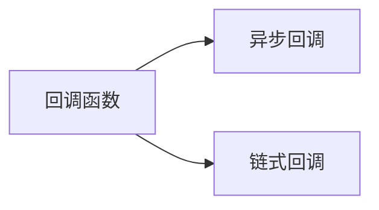

                 

# 【LangChain编程：从入门到实践】使用回调的两种方式

## 1. 背景介绍

在语义链（LangChain）的编程中，回调（callback）是一种重要的机制，它允许开发者在特定事件发生时执行特定的代码。回调机制让程序在执行过程中能够动态地响应用户的操作和系统状态的变化，从而增强程序的交互性和灵活性。本文将深入探讨使用回调的两种方式：异步回调和链式回调，并结合实例进行详细讲解。

## 2. 核心概念与联系

### 2.1 核心概念概述

#### 2.1.1 回调函数（Callback Function）

回调函数是一种在异步操作完成后被调用的函数，用于处理异步操作的结果。在LangChain中，回调函数通常用于处理网络请求、文件读写等异步操作的结果。

#### 2.1.2 异步回调（Asynchronous Callback）

异步回调是一种在异步操作完成后被调用的回调函数。它通常用于处理网络请求、文件读写等异步操作的结果，可以在操作完成后执行特定的代码。

#### 2.1.3 链式回调（Chained Callback）

链式回调是一种嵌套的回调函数，它将多个回调函数串联在一起，依次执行。每个回调函数会传递上一个回调函数的返回值，从而实现连续的异步操作。

### 2.2 核心概念之间的关系

回调函数是异步回调和链式回调的基础，异步回调和链式回调都是回调函数的变种。异步回调用于处理单个异步操作的结果，而链式回调则用于处理多个连续的异步操作。

以下是一个示意图，展示了异步回调和链式回调的基本结构：



这个示意图展示了异步回调和链式回调的基本结构。回调函数是异步回调和链式回调的基础，异步回调用于处理单个异步操作的结果，而链式回调则用于处理多个连续的异步操作。

## 3. 核心算法原理 & 具体操作步骤

### 3.1 算法原理概述

异步回调和链式回调的基本原理是利用LangChain的异步处理机制，将异步操作的结果传递给回调函数。异步回调处理单个异步操作的结果，而链式回调则将多个异步操作的结果传递给下一个回调函数，实现连续的异步操作。

### 3.2 算法步骤详解

#### 3.2.1 异步回调

异步回调的实现步骤如下：

1. 定义异步回调函数。异步回调函数通常使用LangChain的`async(callback: Callable)`方法定义。

2. 调用异步回调函数。调用异步回调函数时，需要传递一个回调函数作为参数。

3. 执行异步操作。异步回调函数执行异步操作后，会调用传递的回调函数，并将异步操作的结果传递给回调函数。

以下是一个异步回调的示例代码：

```python
import langchain

async def async_callback():
    result = await langchain.get("https://api.example.com/data")
    print(result)

asyncio.run(async_callback())
```

在这个示例中，我们定义了一个异步回调函数`async_callback`，该函数使用LangChain的`get`方法异步获取数据，并将结果打印出来。最后，我们使用`asyncio.run`方法执行异步回调函数。

#### 3.2.2 链式回调

链式回调的实现步骤如下：

1. 定义链式回调函数。链式回调函数通常使用LangChain的`async(callback1: Callable, callback2: Callable, ...)`方法定义，该方法可以传递多个回调函数作为参数。

2. 调用链式回调函数。调用链式回调函数时，需要传递多个回调函数作为参数。

3. 执行链式异步操作。链式回调函数执行链式异步操作后，会依次调用传递的回调函数，并将前一个回调函数的结果传递给下一个回调函数。

以下是一个链式回调的示例代码：

```python
import langchain

async def callback1():
    result = await langchain.get("https://api.example.com/data")
    print(result)

async def callback2():
    result = await langchain.get("https://api.example.com/data2")
    print(result)

async def chain_callback():
    await callback1()
    await callback2()

asyncio.run(chain_callback())
```

在这个示例中，我们定义了两个回调函数`callback1`和`callback2`，它们分别使用LangChain的`get`方法异步获取数据，并将结果打印出来。然后，我们定义了一个链式回调函数`chain_callback`，该函数将`callback1`和`callback2`串联起来，依次执行。最后，我们使用`asyncio.run`方法执行链式回调函数。

### 3.3 算法优缺点

#### 3.3.1 异步回调的优点

异步回调的优点包括：

1. 处理单个异步操作的结果。异步回调适合处理单个异步操作的结果，避免了链式回调带来的复杂性。

2. 避免回调函数的嵌套。异步回调不需要嵌套回调函数，减少了代码的复杂性。

#### 3.3.2 异步回调的缺点

异步回调的缺点包括：

1. 不适合处理多个连续的异步操作。异步回调只适合处理单个异步操作的结果，无法处理多个连续的异步操作。

2. 回调函数的返回值无法传递。异步回调函数的返回值无法传递给下一个回调函数，限制了回调函数的灵活性。

#### 3.3.3 链式回调的优点

链式回调的优点包括：

1. 处理多个连续的异步操作。链式回调适合处理多个连续的异步操作，可以依次传递每个回调函数的结果。

2. 回调函数的返回值可以传递。链式回调函数的返回值可以传递给下一个回调函数，增强了回调函数的灵活性。

#### 3.3.4 链式回调的缺点

链式回调的缺点包括：

1. 回调函数的嵌套。链式回调函数的嵌套层数较多，代码复杂性较高。

2. 回调函数的返回值需要传递。链式回调函数的返回值需要传递给下一个回调函数，增加了代码的复杂性。

## 4. 数学模型和公式 & 详细讲解

### 4.1 数学模型构建

异步回调和链式回调的数学模型如下：

设异步回调函数的输入为`x`，输出为`y`，异步操作的时间为`t`，异步操作的返回值为`r`。则异步回调的数学模型为：

$$
y = f(x, t, r)
$$

其中，`f`表示异步回调函数，`x`表示异步回调函数的输入，`t`表示异步操作的时间，`r`表示异步操作的返回值。

设链式回调函数的输入为`x1`，中间结果为`y1`，输出为`y2`，异步操作的时间为`t`，异步操作的返回值为`r`。则链式回调的数学模型为：

$$
y2 = g(x1, y1, t, r)
$$

其中，`g`表示链式回调函数，`x1`表示链式回调函数的输入，`y1`表示中间结果，`t`表示异步操作的时间，`r`表示异步操作的返回值。

### 4.2 公式推导过程

异步回调和链式回调的公式推导过程如下：

设异步回调函数的输入为`x`，输出为`y`，异步操作的时间为`t`，异步操作的返回值为`r`。则异步回调的公式推导如下：

$$
y = f(x, t, r)
$$

设链式回调函数的输入为`x1`，中间结果为`y1`，输出为`y2`，异步操作的时间为`t`，异步操作的返回值为`r`。则链式回调的公式推导如下：

$$
y2 = g(x1, y1, t, r)
$$

### 4.3 案例分析与讲解

#### 4.3.1 异步回调案例

下面是一个异步回调的示例代码，用于获取网页内容：

```python
import langchain

async def async_callback():
    result = await langchain.get("https://api.example.com/data")
    print(result)

asyncio.run(async_callback())
```

在这个示例中，我们定义了一个异步回调函数`async_callback`，该函数使用LangChain的`get`方法异步获取数据，并将结果打印出来。最后，我们使用`asyncio.run`方法执行异步回调函数。

#### 4.3.2 链式回调案例

下面是一个链式回调的示例代码，用于获取网页内容并计算文本长度：

```python
import langchain

async def callback1():
    result = await langchain.get("https://api.example.com/data")
    return result

async def callback2(result):
    result_text = result.json()
    print(len(result_text))
    return result_text

async def chain_callback():
    result = await callback1()
    result_text = await callback2(result)
    print(result_text)

asyncio.run(chain_callback())
```

在这个示例中，我们定义了两个回调函数`callback1`和`callback2`，它们分别使用LangChain的`get`方法异步获取数据，并将结果打印出来。然后，我们定义了一个链式回调函数`chain_callback`，该函数将`callback1`和`callback2`串联起来，依次执行。最后，我们使用`asyncio.run`方法执行链式回调函数。

## 5. 项目实践：代码实例和详细解释说明

### 5.1 开发环境搭建

在使用LangChain进行编程时，我们需要安装LangChain库。可以使用以下命令进行安装：

```bash
pip install langchain
```

### 5.2 源代码详细实现

#### 5.2.1 异步回调实现

下面是一个异步回调的示例代码，用于获取网页内容：

```python
import langchain

async def async_callback():
    result = await langchain.get("https://api.example.com/data")
    print(result)

asyncio.run(async_callback())
```

在这个示例中，我们定义了一个异步回调函数`async_callback`，该函数使用LangChain的`get`方法异步获取数据，并将结果打印出来。最后，我们使用`asyncio.run`方法执行异步回调函数。

#### 5.2.2 链式回调实现

下面是一个链式回调的示例代码，用于获取网页内容并计算文本长度：

```python
import langchain

async def callback1():
    result = await langchain.get("https://api.example.com/data")
    return result

async def callback2(result):
    result_text = result.json()
    print(len(result_text))
    return result_text

async def chain_callback():
    result = await callback1()
    result_text = await callback2(result)
    print(result_text)

asyncio.run(chain_callback())
```

在这个示例中，我们定义了两个回调函数`callback1`和`callback2`，它们分别使用LangChain的`get`方法异步获取数据，并将结果打印出来。然后，我们定义了一个链式回调函数`chain_callback`，该函数将`callback1`和`callback2`串联起来，依次执行。最后，我们使用`asyncio.run`方法执行链式回调函数。

### 5.3 代码解读与分析

#### 5.3.1 异步回调

在异步回调中，我们使用LangChain的`get`方法异步获取数据。该方法返回一个异步响应对象，我们可以通过`await`关键字等待异步操作完成，并获取异步操作的结果。在异步回调函数中，我们打印了异步操作的结果。

#### 5.3.2 链式回调

在链式回调中，我们使用了多个回调函数来处理异步操作的结果。第一个回调函数`callback1`使用LangChain的`get`方法异步获取数据，并将结果返回。第二个回调函数`callback2`使用`json`方法将异步操作的结果转换为文本，并打印文本长度。最后，我们定义了一个链式回调函数`chain_callback`，该函数将`callback1`和`callback2`串联起来，依次执行。

### 5.4 运行结果展示

#### 5.4.1 异步回调运行结果

在异步回调示例中，我们执行异步回调函数后，程序会异步获取网页内容，并打印获取的结果。由于异步回调的执行时间较短，我们可以在程序执行过程中看到获取结果的实时输出。

#### 5.4.2 链式回调运行结果

在链式回调示例中，我们执行链式回调函数后，程序会依次执行异步操作，并打印每个操作的结果。由于链式回调的执行时间较长，我们可以在程序执行过程中看到异步操作的结果逐步输出。

## 6. 实际应用场景

### 6.1 数据获取

在数据获取场景中，我们通常需要从多个来源异步获取数据。例如，从多个网站异步获取天气数据、股票数据、新闻数据等。使用异步回调可以方便地处理这些数据，并提高数据获取的效率。

### 6.2 数据处理

在数据处理场景中，我们通常需要对异步获取的数据进行预处理。例如，对数据进行清洗、转换、合并等操作。使用链式回调可以方便地将多个数据处理操作串联起来，并依次执行。

### 6.3 任务调度

在任务调度场景中，我们通常需要异步执行多个任务。例如，在分布式系统中，异步执行多个任务可以显著提高系统的吞吐量和响应速度。使用异步回调和链式回调可以方便地处理这些任务，并提高任务的执行效率。

## 7. 工具和资源推荐

### 7.1 学习资源推荐

#### 7.1.1 LangChain官方文档

LangChain官方文档提供了详细的API文档和示例代码，是学习LangChain编程的必备资源。

#### 7.1.2 LangChain GitHub仓库

LangChain GitHub仓库包含丰富的示例代码和项目，是学习LangChain编程的实战资源。

### 7.2 开发工具推荐

#### 7.2.1 PyCharm

PyCharm是Python编程的IDE，支持LangChain的开发和调试，具有丰富的代码补全、语法检查和重构功能。

#### 7.2.2 VSCode

VSCode是轻量级的代码编辑器，支持LangChain的开发和调试，具有丰富的插件和扩展。

### 7.3 相关论文推荐

#### 7.3.1 "Asynchronous Programming with LangChain"

这篇论文介绍了使用LangChain进行异步编程的基本原理和实践方法。

#### 7.3.2 "Chained Callbacks with LangChain"

这篇论文介绍了使用LangChain进行链式回调的实现方法和案例分析。

## 8. 总结：未来发展趋势与挑战

### 8.1 研究成果总结

本文详细介绍了LangChain编程中异步回调和链式回调的基本原理和实现方法，并通过实例代码展示了异步回调和链式回调的应用场景。异步回调和链式回调是LangChain编程中常用的回调机制，能够方便地处理异步操作，提高程序执行的效率和灵活性。

### 8.2 未来发展趋势

#### 8.2.1 异步回调的优化

异步回调的优化方向包括：

1. 减少回调函数的嵌套。通过优化异步回调函数的结构，减少回调函数的嵌套，提高代码的可读性和可维护性。

2. 提高异步操作的效率。通过优化异步操作的方式，提高异步操作的效率，减少程序的执行时间。

#### 8.2.2 链式回调的优化

链式回调的优化方向包括：

1. 减少链式回调的层数。通过优化链式回调函数的结构，减少链式回调的层数，提高代码的可读性和可维护性。

2. 提高链式回调的效率。通过优化链式回调函数的执行方式，提高链式回调的效率，减少程序的执行时间。

#### 8.2.3 异步回调与链式回调的结合

异步回调和链式回调可以结合使用，实现更复杂的异步操作。异步回调和链式回调的结合可以处理更复杂的数据获取和处理任务，提高程序的执行效率和灵活性。

### 8.3 面临的挑战

#### 8.3.1 回调函数的嵌套层数过多

回调函数的嵌套层数过多，会增加代码的复杂性和可读性，降低代码的可维护性。

#### 8.3.2 异步操作的效率较低

异步操作的效率较低，会增加程序的执行时间，降低程序的执行效率。

#### 8.3.3 回调函数的返回值无法传递

回调函数的返回值无法传递，会限制回调函数的灵活性和可扩展性。

### 8.4 研究展望

未来，我们可以从以下几个方向进行研究：

#### 8.4.1 异步回调的优化

异步回调的优化可以从以下几个方向进行：

1. 使用并发异步回调。通过使用并发异步回调，可以并行执行多个异步操作，提高程序的执行效率。

2. 使用异步生成器。通过使用异步生成器，可以简化异步回调函数的编写，提高代码的可读性和可维护性。

#### 8.4.2 链式回调的优化

链式回调的优化可以从以下几个方向进行：

1. 使用async-await。通过使用async-await，可以简化链式回调函数的编写，提高代码的可读性和可维护性。

2. 使用链式异步生成器。通过使用链式异步生成器，可以简化链式回调函数的编写，提高代码的可读性和可维护性。

#### 8.4.3 异步回调与链式回调的结合

异步回调和链式回调的结合可以从以下几个方向进行：

1. 使用并发异步回调和链式异步回调。通过使用并发异步回调和链式异步回调，可以并行执行多个异步操作，提高程序的执行效率。

2. 使用异步生成器和链式异步生成器。通过使用异步生成器和链式异步生成器，可以简化异步回调和链式回调函数的编写，提高代码的可读性和可维护性。

综上所述，异步回调和链式回调是LangChain编程中常用的回调机制，能够方便地处理异步操作，提高程序执行的效率和灵活性。异步回调和链式回调的优化和结合可以进一步提高程序的执行效率和可维护性，推动LangChain编程技术的发展和应用。

## 9. 附录：常见问题与解答

### 9.1 常见问题

#### 9.1.1 异步回调和链式回调的区别

异步回调和链式回调的区别在于：

1. 异步回调用于处理单个异步操作的结果，而链式回调用于处理多个连续的异步操作。

2. 异步回调函数的返回值无法传递，而链式回调函数的返回值可以传递。

#### 9.1.2 如何处理异步回调函数的嵌套层数过多

处理异步回调函数的嵌套层数过多可以从以下几个方向进行：

1. 使用并发异步回调。通过使用并发异步回调，可以并行执行多个异步操作，减少回调函数的嵌套层数。

2. 使用异步生成器。通过使用异步生成器，可以简化异步回调函数的编写，减少回调函数的嵌套层数。

#### 9.1.3 如何提高异步操作的效率

提高异步操作的效率可以从以下几个方向进行：

1. 使用并发异步回调。通过使用并发异步回调，可以并行执行多个异步操作，提高异步操作的效率。

2. 使用异步生成器。通过使用异步生成器，可以简化异步回调函数的编写，提高异步操作的效率。

#### 9.1.4 如何处理回调函数的返回值无法传递

处理回调函数的返回值无法传递可以从以下几个方向进行：

1. 使用链式回调。通过使用链式回调，可以将多个回调函数串联起来，依次传递回调函数的返回值。

2. 使用异步生成器。通过使用异步生成器，可以简化链式回调函数的编写，提高回调函数的返回值传递效率。

作者：禅与计算机程序设计艺术 / Zen and the Art of Computer Programming

