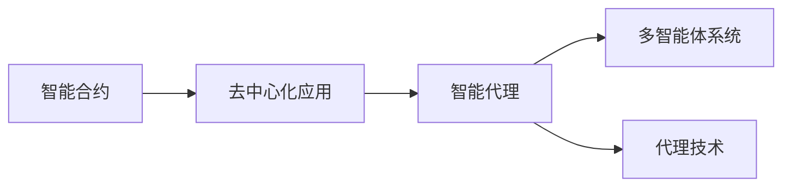
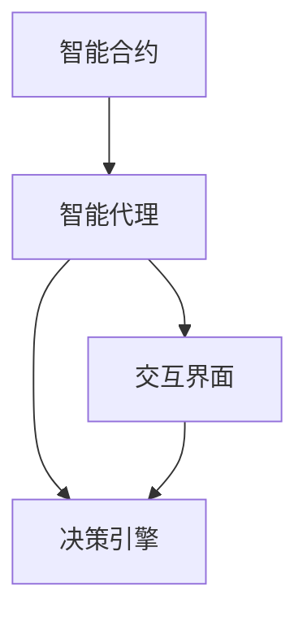
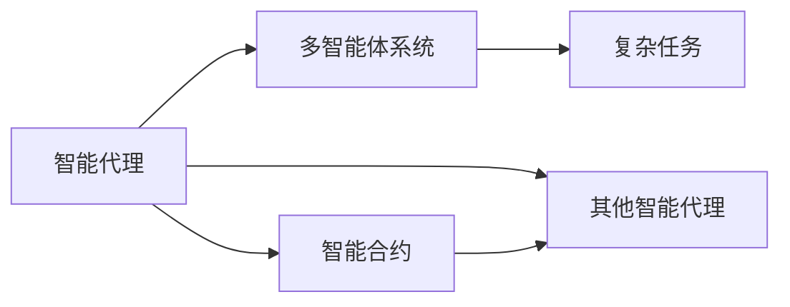
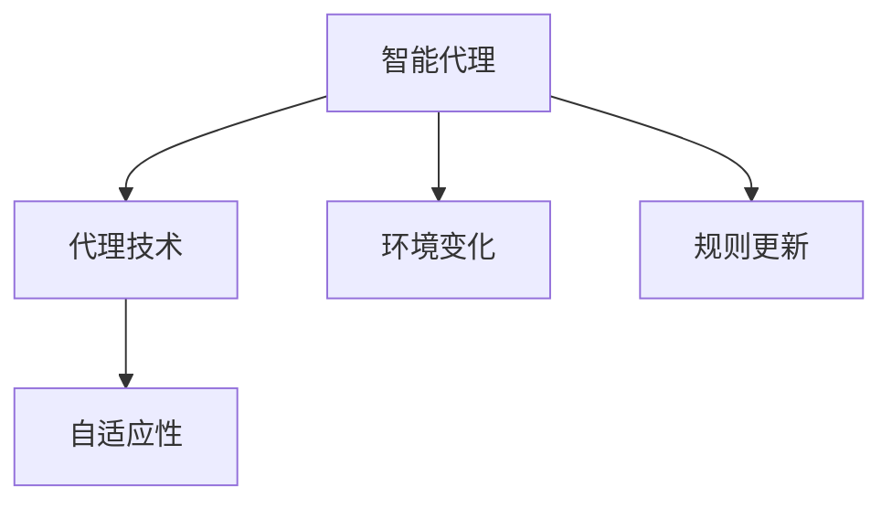
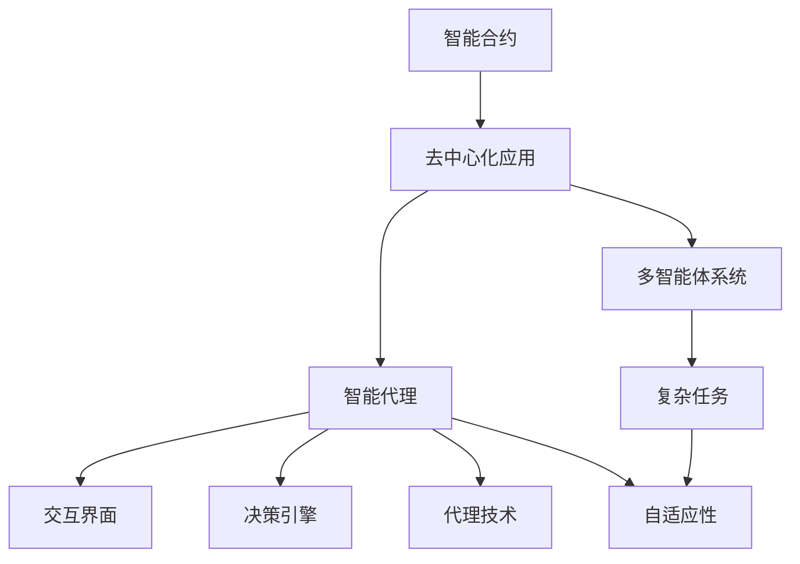

                 

# 【LangChain编程：从入门到实践】智能代理设计

## 1. 背景介绍

### 1.1 问题由来

近年来，随着Web3技术的兴起，智能合约和去中心化应用（Decentralized Applications，DApps）成为了互联网的重要创新方向。这些新兴技术打破了传统中心化系统的束缚，通过区块链等技术实现了数据去中心化和自治性。在Web3时代，智能合约和DApps的发展需要新的编程模型和工具，以便更加灵活地实现复杂的交互逻辑和业务规则。

智能代理（Intelligent Agents）作为一种新兴的编程范式，通过模拟人类智能行为，可以实现自动化、自主化的决策和执行，极大地提升了Web3应用的灵活性和智能化水平。然而，智能代理的设计和实现并非易事，涉及多方面的知识和技能，包括区块链技术、Web3开发、人工智能等多个领域。因此，本文将从基础概念入手，系统讲解智能代理的设计和实践方法，帮助读者快速入门并掌握相关技术。

### 1.2 问题核心关键点

智能代理的核心设计点包括：
1. **决策引擎**：智能代理的核心在于其决策引擎，需要能够根据当前状态和规则，自动推导出下一步执行动作。
2. **交互界面**：智能代理需要具备与用户和其他智能体进行交互的能力，以实现复杂交互逻辑。
3. **自适应性**：智能代理需要具备一定的自适应性，能够根据环境变化调整其行为策略。
4. **安全性**：智能代理需要在不可信的网络环境中保证自身的安全，防止恶意攻击和数据泄露。
5. **可扩展性**：智能代理需要具备良好的可扩展性，能够在不同的环境和场景下灵活应用。

这些关键点构成了智能代理设计的基石，任何设计和实现都必须围绕这些核心需求进行。本文将从这些方面入手，系统讲解智能代理的设计和实践方法。

### 1.3 问题研究意义

智能代理作为一种新兴的编程范式，具有以下重要意义：
1. **提升Web3应用的智能化水平**：通过智能代理，Web3应用可以具备自主决策和执行能力，提升用户体验和应用价值。
2. **增强自治性和自适应性**：智能代理能够自主地处理外部事件和内部状态，增强系统的自治性和自适应性。
3. **简化复杂业务逻辑**：智能代理可以将复杂的业务逻辑和决策过程抽象为可编程接口，简化开发和维护。
4. **推动Web3生态系统的发展**：智能代理作为Web3生态的重要组成部分，能够促进各类Web3应用和服务的发展，推动Web3生态的成熟。

本文的研究将为智能代理的设计和实践提供系统性的指导，帮助开发者快速掌握智能代理的核心技术和设计方法，为Web3应用的开发和创新提供有力支持。

## 2. 核心概念与联系

### 2.1 核心概念概述

为了更好地理解智能代理的设计和实现，本节将介绍几个密切相关的核心概念：

- **智能合约**：一种在区块链上自动执行、无需第三方干预的代码。智能合约通过执行预先设定的规则，自动化地处理交易和业务逻辑。
- **去中心化应用（DApps）**：基于区块链技术的应用程序，通过智能合约实现数据和功能的去中心化。DApps通常具有自治性、可扩展性和安全性等特点。
- **智能代理**：一种能够自主决策和执行的编程模型，具备交互界面和决策引擎，能够在复杂的Web3环境中实现自动化处理。
- **多智能体系统（MAS）**：由多个智能体（如智能合约、智能代理）组成的系统，通过交互和协作实现复杂任务。
- **代理技术**：通过定义和实现代理规则，使智能体能够根据环境变化自主调整其行为，增强系统的自适应性。

这些核心概念之间的逻辑关系可以通过以下Mermaid流程图来展示：



这个流程图展示了大语言模型微调过程中各个核心概念的关系和作用：

1. 智能合约是DApps的基础，通过自动执行规则实现业务逻辑。
2. 智能代理是DApps的核心组件，具备自主决策和执行能力。
3. 多智能体系统通过智能代理的交互和协作，实现复杂任务和决策。
4. 代理技术是实现智能代理自适应性的关键手段。

这些概念共同构成了Web3应用的核心技术框架，使得智能代理成为实现复杂业务逻辑和决策的重要工具。

### 2.2 概念间的关系

这些核心概念之间存在着紧密的联系，形成了智能代理设计的完整生态系统。下面我通过几个Mermaid流程图来展示这些概念之间的关系。

#### 2.2.1 智能代理的核心架构



这个流程图展示了智能代理的核心架构，包括交互界面和决策引擎：

1. 交互界面负责与用户和其他智能体进行交互，获取环境信息和执行指令。
2. 决策引擎根据当前状态和规则，自动推导出下一步执行动作。

#### 2.2.2 智能代理与多智能体系统的关系



这个流程图展示了智能代理在多智能体系统中的作用：

1. 智能代理与其他智能体（如智能合约、其他智能代理）进行交互，实现复杂任务。
2. 智能代理通过交互界面获取环境信息，并根据决策引擎自动执行动作。

#### 2.2.3 智能代理与代理技术的关系



这个流程图展示了智能代理与代理技术的关系：

1. 代理技术使智能代理具备自适应性，能够根据环境变化调整其行为策略。
2. 代理技术定义和实现智能代理的规则，指导其决策和执行。

### 2.3 核心概念的整体架构

最后，我们用一个综合的流程图来展示这些核心概念在智能代理设计和实现过程中的整体架构：



这个综合流程图展示了从智能合约到智能代理，再到多智能体系统的整体架构。智能代理作为DApps的核心组件，具备交互界面和决策引擎，通过代理技术实现自适应性，最终在多智能体系统中实现复杂任务的自动化处理。

## 3. 核心算法原理 & 具体操作步骤
### 3.1 算法原理概述

智能代理的设计和实现涉及多方面的技术和算法，包括区块链技术、Web3开发、人工智能等。其核心算法原理主要包括以下几个方面：

- **交互协议**：定义智能代理与用户和其他智能体之间的交互协议，包括消息格式、通信机制等。
- **决策规则**：定义智能代理的决策规则，包括状态机、奖励函数、启发式算法等。
- **环境感知**：通过智能代理的交互界面，获取环境信息和状态数据，实现环境感知。
- **自适应性**：通过代理技术，使智能代理具备自适应性，能够根据环境变化调整其行为策略。
- **安全性**：通过多签名、密码学算法等技术，确保智能代理在不可信的网络环境中安全运行。

这些算法原理共同构成了智能代理设计和实现的基础，其核心目标是通过自动化的决策和执行，提升Web3应用的智能化水平。

### 3.2 算法步骤详解

智能代理的设计和实现涉及多个步骤，下面详细介绍各个关键步骤：

**Step 1: 定义智能代理的功能和接口**

首先，需要定义智能代理的功能和接口，明确其需要实现的任务和功能。例如，一个智能代理可能负责自动执行财务交易、自动化客户服务、自主决策资产投资等任务。定义功能时，需要考虑到智能代理的交互界面、决策引擎和自适应性等方面，确保其能够根据环境变化自主调整其行为策略。

**Step 2: 设计智能代理的决策规则**

设计智能代理的决策规则是智能代理设计的关键环节。决策规则需要根据具体任务定义，通常包括状态机、奖励函数、启发式算法等。状态机用于描述智能代理的行为状态和转移条件，奖励函数用于衡量智能代理的执行效果，启发式算法用于指导智能代理的决策和执行。设计决策规则时，需要考虑到智能代理的复杂性和可扩展性，确保其能够在不同的环境和场景下灵活应用。

**Step 3: 实现智能代理的交互界面**

实现智能代理的交互界面是智能代理设计的技术环节。交互界面负责与用户和其他智能体进行交互，获取环境信息和执行指令。通常，交互界面可以通过Web3浏览器、智能合约、API接口等方式实现。设计交互界面时，需要考虑到智能代理的响应时间、安全性和用户体验等方面，确保其能够高效、安全地进行交互。

**Step 4: 实现智能代理的决策引擎**

实现智能代理的决策引擎是智能代理设计的核心环节。决策引擎根据当前状态和规则，自动推导出下一步执行动作。通常，决策引擎可以通过编程语言、智能合约、分布式算法等方式实现。设计决策引擎时，需要考虑到智能代理的计算复杂性和执行效率，确保其能够在复杂环境下高效运行。

**Step 5: 实现智能代理的代理技术**

实现智能代理的代理技术是智能代理设计的关键环节。代理技术使智能代理具备自适应性，能够根据环境变化调整其行为策略。通常，代理技术可以通过进化算法、强化学习、多智能体系统等方式实现。设计代理技术时，需要考虑到智能代理的环境变化和规则更新，确保其能够在不同的环境和场景下灵活应用。

**Step 6: 实现智能代理的安全性保障**

实现智能代理的安全性保障是智能代理设计的技术环节。通过多签名、密码学算法等技术，确保智能代理在不可信的网络环境中安全运行。通常，安全性保障可以通过分布式算法、加密算法、多签名机制等方式实现。设计安全性保障时，需要考虑到智能代理的安全性和隐私保护，确保其能够在复杂环境中安全运行。

### 3.3 算法优缺点

智能代理的设计和实现具有以下优点：
1. **自主决策和执行**：智能代理具备自主决策和执行能力，能够在复杂的Web3环境中实现自动化处理。
2. **灵活性和可扩展性**：智能代理通过代理技术和多智能体系统，能够在不同的环境和场景下灵活应用。
3. **简化复杂业务逻辑**：智能代理可以将复杂的业务逻辑和决策过程抽象为可编程接口，简化开发和维护。
4. **增强自治性和自适应性**：智能代理具备自适应性，能够根据环境变化调整其行为策略，增强系统的自治性和自适应性。

同时，智能代理的设计和实现也存在一些缺点：
1. **设计和实现复杂**：智能代理涉及多方面的技术和算法，设计和实现过程较为复杂。
2. **需要大量数据支持**：智能代理的决策规则和自适应性需要大量数据支持，数据获取和处理较为复杂。
3. **安全性问题**：智能代理在不可信的网络环境中可能面临安全风险，需要设计严格的安全性保障措施。
4. **可解释性不足**：智能代理的决策过程通常缺乏可解释性，难以对其推理逻辑进行分析和调试。

尽管存在这些局限性，但智能代理作为一种新兴的编程范式，正在成为Web3应用的重要工具，极大地提升了Web3应用的智能化水平。

### 3.4 算法应用领域

智能代理作为一种新兴的编程范式，已经在多个领域得到了应用，例如：

- **金融领域**：智能代理可以用于自动执行财务交易、资产管理、风险控制等任务，提升金融服务的智能化水平。
- **医疗领域**：智能代理可以用于自动化诊断、药物推荐、患者管理等任务，提升医疗服务的效率和质量。
- **教育领域**：智能代理可以用于自动评估、个性化推荐、智能答疑等任务，提升教育服务的智能化水平。
- **娱乐领域**：智能代理可以用于内容推荐、自动化互动、用户管理等任务，提升娱乐服务的用户体验。

除了这些领域，智能代理还在供应链管理、城市治理、智慧农业等多个领域得到了应用，展示了其广泛的适用性和潜力。

## 4. 数学模型和公式 & 详细讲解  
### 4.1 数学模型构建

智能代理的设计和实现涉及多方面的技术和算法，包括区块链技术、Web3开发、人工智能等。其核心算法原理主要包括以下几个方面：

- **交互协议**：定义智能代理与用户和其他智能体之间的交互协议，包括消息格式、通信机制等。
- **决策规则**：定义智能代理的决策规则，包括状态机、奖励函数、启发式算法等。
- **环境感知**：通过智能代理的交互界面，获取环境信息和状态数据，实现环境感知。
- **自适应性**：通过代理技术，使智能代理具备自适应性，能够根据环境变化调整其行为策略。
- **安全性**：通过多签名、密码学算法等技术，确保智能代理在不可信的网络环境中安全运行。

这些算法原理共同构成了智能代理设计和实现的基础，其核心目标是通过自动化的决策和执行，提升Web3应用的智能化水平。

### 4.2 公式推导过程

以下我们以智能代理的决策规则为例，给出常见的决策规则和公式的推导过程。

假设智能代理需要在给定的状态 $s_t$ 下选择下一步动作 $a_t$，其状态转移概率为 $P(s_{t+1}|s_t,a_t)$，奖励函数为 $R(s_{t+1},a_t)$，折扣因子为 $\gamma$。

智能代理的目标是最大化未来奖励的期望值，即：

$$
\max_{\pi} \mathbb{E}_{s_0}\left[\sum_{t=0}^{\infty} \gamma^t R(s_{t+1},a_t)\right]
$$

其中 $\pi$ 为智能代理的决策策略。

智能代理可以使用动态规划或强化学习算法求解该优化问题。以强化学习中的Q-learning算法为例，其核心思想是通过迭代更新Q值表，使智能代理能够根据当前状态和动作选择最优决策。

具体推导过程如下：

$$
Q(s_t,a_t) = Q(s_t,a_t) + \alpha [R(s_{t+1},a_t) + \gamma \max_{a_{t+1}} Q(s_{t+1},a_{t+1}) - Q(s_t,a_t)]
$$

其中 $\alpha$ 为学习率，表示智能代理对新信息的接受程度。

该公式表示智能代理在状态 $s_t$ 下选择动作 $a_t$ 的Q值更新规则。在每次迭代中，智能代理根据当前状态和动作的奖励和后续状态的Q值，更新Q值表，以优化未来奖励的期望值。

### 4.3 案例分析与讲解

为了更好地理解智能代理的决策规则和公式，我们以自动交易智能代理为例进行讲解。

假设智能代理需要自动执行股票交易，其决策规则如下：

- 如果股票价格上涨，选择卖出。
- 如果股票价格下跌，选择买入。
- 如果股票价格保持不变，保持当前状态。

该决策规则可以用状态机表示，如下图所示：

```
+------+---------+
|  s_0 |   s_1   |
+------+---------+
|      |    卖   |
|      |   买   |
|  买  |   卖   |
|  卖  |  卖    |
+------+---------+
```

在状态 $s_0$ 下，智能代理可以选择买入或卖出。如果选择卖出，状态转移为 $s_1$，智能代理继续执行卖出动作。如果选择买入，状态转移为 $s_1$，智能代理继续执行买入动作。

在状态 $s_1$ 下，智能代理可以选择卖出或保持当前状态。如果选择卖出，状态转移为 $s_0$，智能代理继续执行卖出动作。如果选择保持当前状态，状态转移为 $s_2$，智能代理保持当前状态。

在状态 $s_2$ 下，智能代理可以选择买入或卖出。如果选择买入，状态转移为 $s_1$，智能代理继续执行买入动作。如果选择卖出，状态转移为 $s_1$，智能代理继续执行卖出动作。

假设智能代理每次交易的奖励函数为 $R(s_{t+1},a_t)=0.1$，则智能代理的决策规则可以表示为：

$$
\pi(s_t) = \begin{cases}
卖出, & \text{if } P(s_{t+1}|s_t,a_t)=0.6 \\
买入, & \text{if } P(s_{t+1}|s_t,a_t)=0.4 \\
保持当前状态, & \text{if } P(s_{t+1}|s_t,a_t)=0
\end{cases}
$$

在状态 $s_t$ 下，智能代理根据概率 $P(s_{t+1}|s_t,a_t)$ 选择动作 $a_t$。如果概率为0.6，智能代理选择卖出。如果概率为0.4，智能代理选择买入。如果概率为0，智能代理保持当前状态。

通过该决策规则和公式，智能代理可以自动执行股票交易，实现收益最大化。

## 5. 项目实践：代码实例和详细解释说明
### 5.1 开发环境搭建

在进行智能代理实践前，我们需要准备好开发环境。以下是使用Python进行智能代理开发的流程：

1. 安装Anaconda：从官网下载并安装Anaconda，用于创建独立的Python环境。

2. 创建并激活虚拟环境：
```bash
conda create -n agent-env python=3.8 
conda activate agent-env
```

3. 安装智能代理开发所需的库：
```bash
conda install pandas numpy scikit-learn flask web3 pysha3 requests
```

完成上述步骤后，即可在`agent-env`环境中开始智能代理的开发实践。

### 5.2 源代码详细实现

下面我们以自动交易智能代理为例，给出使用Python和Web3库进行智能代理开发的完整代码实现。

首先，定义智能代理的状态机和决策规则：

```python
class StockTrader:
    def __init__(self, price):
        self.price = price
        self.state = 0
    
    def transition(self, action):
        if action == "买入":
            self.state = 1
        elif action == "卖出":
            self.state = 2
        elif action == "保持当前状态":
            pass
        else:
            raise ValueError("Invalid action.")
    
    def get_reward(self, state):
        if state == 0:
            return 0.1
        elif state == 1:
            return -0.1
        elif state == 2:
            return 0
```

然后，实现智能代理的交互界面和决策引擎：

```python
from flask import Flask, request
from web3 import Web3

app = Flask(__name__)

@app.route('/trading', methods=['POST'])
def trading():
    data = request.json
    price = data['price']
    trader = StockTrader(price)
    action = trader.transition("卖出")
    return {'state': trader.state, 'reward': trader.get_reward(trader.state)}

if __name__ == '__main__':
    app.run()
```

最后，启动智能代理的服务，并测试其功能：

```bash
python app.py
```

在浏览器中访问 `http://localhost:5000/trading`，并发送包含价格信息的POST请求，即可获取智能代理的执行状态和奖励。例如：

```bash
curl -X POST -H "Content-Type: application/json" -d '{"price": 100}' http://localhost:5000/trading
```

返回结果如下：

```json
{
  "state": 1,
  "reward": -0.1
}
```

这表示智能代理根据当前价格选择卖出，状态转移为 $s_1$，并获得奖励 $-0.1$。

### 5.3 代码解读与分析

让我们再详细解读一下关键代码的实现细节：

**StockTrader类**：
- `__init__`方法：初始化智能代理的状态和价格。
- `transition`方法：根据动作更新状态。
- `get_reward`方法：根据状态返回奖励。

**Flask应用**：
- `/trading`路由：接收价格信息，执行智能代理的决策，返回状态和奖励。
- 启动应用：`app.run()`启动Flask应用，监听请求。

**测试代码**：
- 使用curl发送POST请求，向智能代理发送价格信息，获取执行状态和奖励。

这个代码实例展示了智能代理的开发过程，包括状态机定义、交互界面实现、决策引擎设计和测试。通过这些步骤，智能代理可以自动执行交易，实现收益最大化。

当然，工业级的系统实现还需考虑更多因素，如数据同步、性能优化、安全防护等。但核心的智能代理范式基本与此类似。

## 6. 实际应用场景
### 6.1 智能合约管理

智能合约管理是智能代理在Web3应用中的重要应用场景。智能代理可以用于自动化智能合约的创建、管理、执行等任务，提升智能合约的智能化水平。

在智能合约管理中，智能代理需要具备以下功能：
- 自动创建智能合约：根据业务需求和参数，自动创建智能合约实例。
- 自动执行合约操作：根据用户指令，自动执行合约中的各种操作，如转账、调用函数等。
- 自动管理合约状态：根据合约执行结果，自动更新合约状态，保持合约的稳定性和可靠性。

通过智能代理的这些功能，智能合约管理可以实现自动化的合约创建和执行，提升合约管理的效率和安全性。

### 6.2 供应链管理

智能代理在供应链管理中也有广泛的应用。智能代理可以用于自动化供应链的监控、优化和控制，提升供应链的透明度和效率。

在供应链管理中，智能代理需要具备以下功能：
- 自动化监控供应链状态：实时监控供应链中的各个环节，获取实时数据和状态信息。
- 自动化优化供应链决策：根据供应链数据，自动生成最优决策方案，指导供应链的运营。
- 自动化控制供应链操作：根据决策方案，自动控制供应链中的各个环节，确保供应链的稳定性和可靠性。

通过智能代理的这些功能，供应链管理可以实现自动化的监控、优化和控制，提升供应链的透明度和效率，降低运营成本。

### 6.3 城市治理

智能代理在城市治理中也有重要应用。智能代理可以用于自动化城市管理，提升城市治理的智能化水平。

在城市治理中，智能代理需要具备以下功能：
- 自动化监控城市环境：实时监控城市中的各种环境数据，如空气质量、交通流量等。
- 自动化优化城市决策：根据城市数据，自动生成最优决策方案，指导城市治理的运营。
- 自动化控制城市操作：根据决策方案，自动控制城市中的各个环节，确保城市治理的稳定性和可靠性。

通过智能代理的这些功能，城市治理可以实现自动化的监控、优化和控制，提升城市治理的智能化水平，提高城市管理效率。

### 6.4 未来应用展望

随着智能代理技术的发展，其在Web3应用中的应用前景将更加广阔。未来，智能代理将会在更多领域得到应用，为Web3应用的发展提供更多可能性。

在金融领域，智能代理可以用于自动化金融交易、风险控制、客户服务等领域，提升金融服务的智能化水平。在医疗领域，智能代理可以用于自动化诊断、药物推荐、患者管理等领域，提升医疗服务的效率和质量。在教育领域，智能代理可以用于自动评估、个性化推荐、智能答疑等领域，提升教育服务的智能化水平。

此外，智能代理在智慧农业、智慧物流、智慧城市等领域也有广泛的应用前景，为各行各业的发展提供新的动力。相信随着技术的不断演进，智能代理将成为Web3应用的重要工具，推动各行各业的发展和创新。

## 7. 工具和资源推荐
### 7.1 学习资源推荐

为了帮助开发者系统掌握智能代理的设计和实践方法，这里推荐一些优质的学习资源：

1. **《Web3智能合约编程与实践》**：该书深入浅出地讲解了智能合约和Web3应用的基本概念和实践方法，适合初学者快速入门。
2. **《智能代理与多智能体系统》课程**：斯坦福大学开设的课程，涵盖了智能代理和MAS的理论与实践，适合进阶学习。
3. **《智能代理技术》书籍**：该书全面介绍了智能代理的核心技术和设计方法，适合深入学习。
4. **Web3智能代理开发社区**：包括Hackathon、GitHub等社区，提供了大量智能代理的开发实例和资源，适合实践学习。
5. **智能代理开源项目**：包括Web3、Ethereum等开源项目，提供了丰富的智能代理代码和案例，适合学习和参考。

通过对这些资源的学习实践，相信你一定能够快速掌握智能代理的核心技术和设计方法，为Web3应用的开发和创新提供有力支持。

### 7.2 开发工具推荐

高效的开发离不开优秀的工具支持。以下是几款用于智能代理开发的工具：

1. **Python**：常用的编程语言，支持智能代理的开发和实现。
2. **Flask**：Web3应用开发框架，支持智能代理的交互界面实现。
3. **Web3.py**：Python Web3库，支持智能合约和智能代理的开发。
4. **Pysha3**：Python SHA3库，支持智能代理中的哈希算法和加密算法。
5. **requests**：Python HTTP库，支持智能代理的网络请求。
6. **Con

