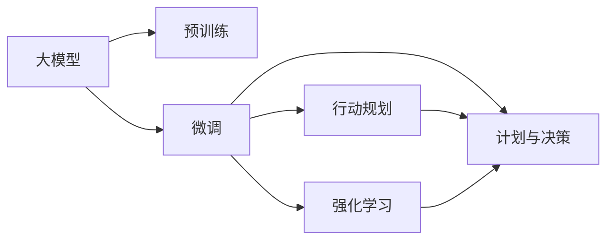
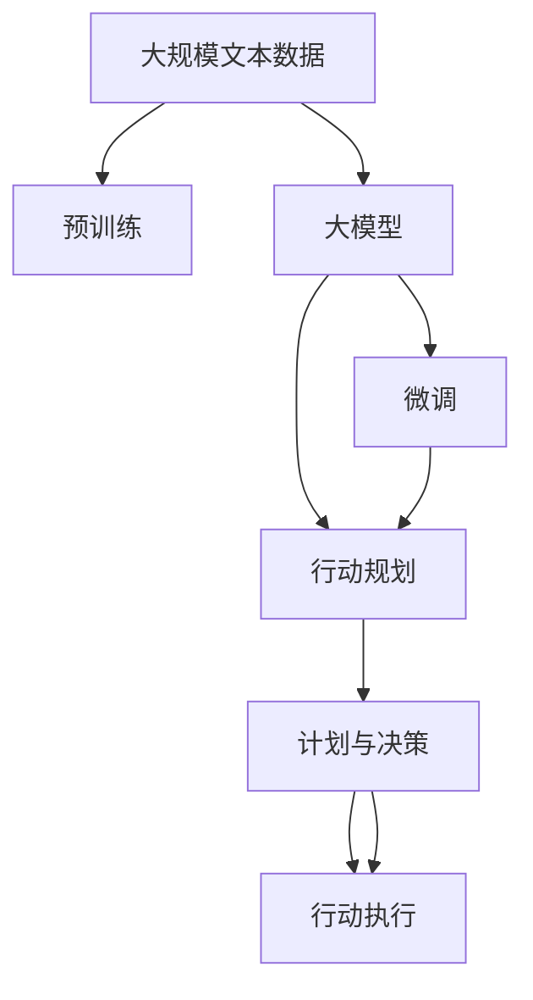
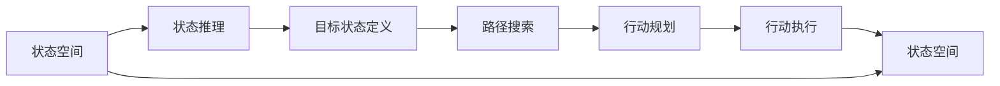
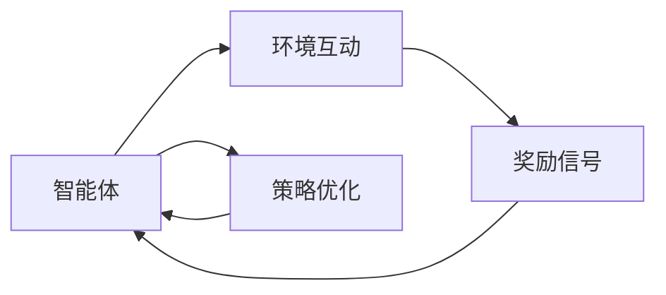
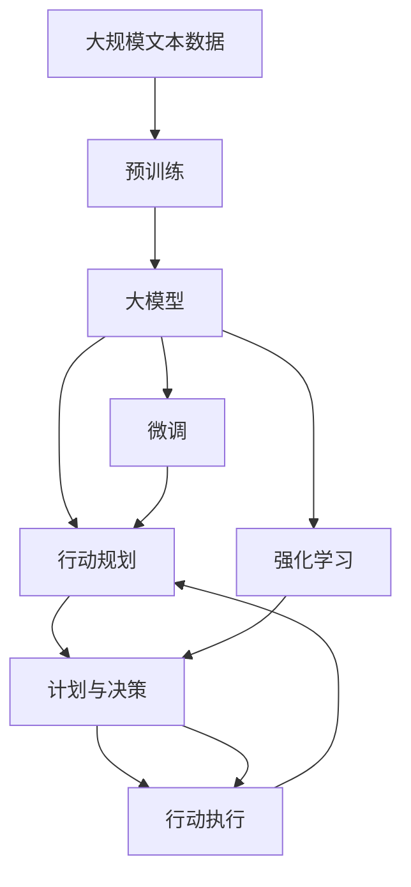

                 

# 【大模型应用开发 动手做AI Agent】Plan-and-Solve策略的提出

> 关键词：大模型应用，AI Agent，计划与决策，行动规划，机器学习

## 1. 背景介绍

在人工智能(AI)领域，大模型应用开发，尤其是构建能够自主计划和决策的AI Agent（智能体），已经成为研究的热点。随着深度学习、强化学习等技术的不断发展，AI Agent 已经开始在自动驾驶、机器人控制、金融交易等领域展现出了巨大的潜力。然而，这些Agent的设计和训练仍然面临诸多挑战。

在实际应用中，AI Agent 需要具备以下能力：
- 自主计划：根据当前环境和任务需求，生成具体的行动计划。
- 行动决策：基于计划和环境状态，选择最优的行动方案。
- 持续学习：从经验中不断学习，优化计划和决策过程。

AI Agent 的开发和训练，往往需要结合大模型的预训练和微调，以及策略优化、行动规划等技术手段。本文将深入探讨大模型应用开发的Plan-and-Solve策略，并给出具体的实现步骤和技术细节。

## 2. 核心概念与联系

### 2.1 核心概念概述

为了更好地理解Plan-and-Solve策略，我们首先介绍几个关键概念：

- 大模型：以自回归模型（如GPT）或自编码模型（如BERT）为代表的大规模预训练语言模型。通过在大规模无标签文本数据上进行预训练，学习到丰富的语言知识，具备强大的语言理解和生成能力。

- 微调(Fine-tuning)：指在预训练模型的基础上，使用下游任务的少量标注数据，通过有监督地训练来优化模型在特定任务上的性能。通常只需要调整顶层分类器或解码器，并以较小的学习率更新全部或部分模型参数。

- 强化学习(Reinforcement Learning, RL)：一种机器学习方法，通过与环境互动，使智能体通过试错来学习最优决策策略。强化学习中的智能体能够自主地执行行动，并通过奖励信号优化行动策略。

- 行动规划(Action Planning)：指在AI Agent中，根据当前状态和目标，生成一系列行动步骤的规划过程。规划通常包括状态推理、目标状态定义、路径搜索等环节。

- 计划与决策(Planning and Decision Making)：AI Agent的核心功能之一，通过计划和决策，智能体能够自主地执行复杂的任务。计划与决策过程通常结合了策略优化、行动规划、状态空间搜索等技术。

这些概念之间的逻辑关系可以通过以下Mermaid流程图来展示：



这个流程图展示了大模型应用开发的几个关键过程：

1. 大模型通过预训练获得基础能力。
2. 微调模型，使其能够适应特定任务。
3. 行动规划，生成行动步骤。
4. 计划与决策，执行具体的行动。
5. 强化学习，通过与环境互动优化决策策略。

这些概念共同构成了大模型应用开发的完整生态系统，使AI Agent能够具备自主计划和决策的能力。

### 2.2 概念间的关系

这些核心概念之间存在着紧密的联系，形成了大模型应用开发的完整流程。以下是几个详细的Mermaid流程图：

#### 2.2.1 大模型应用开发的整体流程



这个流程图展示了大模型应用开发的整体流程：

1. 通过预训练获得基础能力的大模型。
2. 在特定任务上进行微调，使模型能够适应任务需求。
3. 生成行动计划，明确具体的行动步骤。
4. 根据计划执行行动，完成具体的任务。
5. 通过强化学习不断优化决策策略，提升行动效果。

#### 2.2.2 行动规划与决策的关系



这个流程图展示了行动规划和决策的逻辑关系：

1. 通过状态推理和目标状态定义，明确当前状态和目标状态。
2. 在状态空间中搜索路径，生成具体的行动计划。
3. 根据计划执行行动，更新状态空间，反馈至状态推理环节，形成闭环。

#### 2.2.3 强化学习的应用场景



这个流程图展示了强化学习的基本过程：

1. 智能体与环境互动，接收环境反馈的奖励信号。
2. 根据奖励信号，优化策略，更新行动计划。
3. 重复互动和优化过程，使智能体能够持续提升决策效果。

### 2.3 核心概念的整体架构

最后，我们用一个综合的流程图来展示这些核心概念在大模型应用开发中的整体架构：



这个综合流程图展示了从预训练到微调，再到行动规划、决策执行的完整过程。大模型通过预训练和微调获得基础能力和特定任务适应性，结合行动规划和强化学习，能够自主地执行复杂任务，并持续优化决策策略。

## 3. 核心算法原理 & 具体操作步骤
### 3.1 算法原理概述

Plan-and-Solve策略的核心思想是：将AI Agent的决策过程分为计划和执行两个阶段，先通过自主计划生成具体的行动步骤，再通过执行行动完成任务。这种策略结合了大模型的预训练和微调，以及强化学习的优化过程，能够实现高效率、高鲁棒性的决策能力。

具体来说，Plan-and-Solve策略包括以下几个关键步骤：

1. 预训练：通过大规模无标签数据训练大模型，获得基础语言表示能力。
2. 微调：在特定任务上，使用少量标注数据进行微调，使模型具备特定任务的能力。
3. 行动规划：根据当前状态和任务需求，生成具体的行动步骤。
4. 计划与决策：执行行动步骤，通过强化学习不断优化决策策略。

### 3.2 算法步骤详解

#### 3.2.1 预训练步骤

1. 收集大规模无标签文本数据，如维基百科、新闻、小说等。
2. 将数据划分为训练集和验证集，使用自监督学习任务进行训练，如掩码语言模型、下限语言模型等。
3. 选择合适的大模型，如GPT-3、BERT等，进行预训练。
4. 使用验证集评估预训练模型的效果，进行必要的调整和优化。

#### 3.2.2 微调步骤

1. 收集特定任务的少量标注数据，如命名实体识别、问答系统等。
2. 将数据划分为训练集和验证集，使用有监督学习方法进行微调，如交叉熵损失、余弦相似度损失等。
3. 选择合适的大模型，如GPT-3、BERT等，进行微调。
4. 使用验证集评估微调模型的效果，进行必要的调整和优化。

#### 3.2.3 行动规划步骤

1. 定义任务状态空间，包括所有可能的行动、状态和目标状态。
2. 使用大模型进行状态推理，预测当前状态和可能的后继状态。
3. 根据任务需求定义目标状态，生成行动规划。
4. 使用路径搜索算法（如A*、D*等）生成最优路径，生成具体的行动步骤。

#### 3.2.4 计划与决策步骤

1. 执行行动步骤，完成具体的任务。
2. 通过与环境的互动，接收奖励信号。
3. 使用强化学习算法（如Q-learning、SARSA等）优化行动策略，更新行动规划。
4. 重复执行和优化过程，使智能体能够持续提升决策效果。

### 3.3 算法优缺点

#### 3.3.1 优点

1. 高效性：通过预训练和微调获得基础能力，结合行动规划和强化学习，能够快速适应新任务和新环境。
2. 鲁棒性：通过强化学习不断优化决策策略，能够提升智能体的鲁棒性和泛化能力。
3. 可扩展性：大模型和微调方法具备良好的可扩展性，可以应用到多种不同的任务和领域。

#### 3.3.2 缺点

1. 依赖标注数据：微调过程需要少量标注数据，对数据质量要求较高。
2. 计算资源需求高：大模型和强化学习过程需要大量计算资源，硬件要求较高。
3. 模型复杂度高：大模型和行动规划的复杂度较高，需要复杂的优化和调整过程。

### 3.4 算法应用领域

Plan-and-Solve策略在多种应用领域中都具有广泛的适用性，例如：

1. 自动驾驶：通过大模型进行环境感知和路径规划，结合强化学习进行决策和控制。
2. 机器人控制：使用大模型进行环境感知和动作规划，结合强化学习进行决策和执行。
3. 金融交易：通过大模型进行市场分析和策略优化，结合强化学习进行交易决策。
4. 游戏AI：使用大模型进行游戏状态感知和策略规划，结合强化学习进行游戏决策。
5. 医疗诊断：通过大模型进行医学知识和信息检索，结合强化学习进行诊断和治疗决策。

以上应用领域只是Plan-and-Solve策略的一部分，随着技术的发展和应用的拓展，其应用场景将更加广泛和多样化。

## 4. 数学模型和公式 & 详细讲解 & 举例说明

### 4.1 数学模型构建

在Plan-and-Solve策略中，数学模型主要包括以下几个部分：

- 预训练模型的数学模型。
- 微调模型的数学模型。
- 行动规划的数学模型。
- 强化学习的数学模型。

#### 4.1.1 预训练模型的数学模型

预训练模型的数学模型主要基于自监督学习任务，如掩码语言模型和下限语言模型。以BERT模型为例，其掩码语言模型的目标函数为：

$$
\mathcal{L}(\theta) = -\frac{1}{N}\sum_{i=1}^N \log P(x_i|\theta)
$$

其中，$P(x_i|\theta)$表示模型在输入$x_i$下的预测概率，$\theta$表示模型的参数。

#### 4.1.2 微调模型的数学模型

微调模型的数学模型主要基于有监督学习任务，如分类任务和生成任务。以分类任务为例，其目标函数为：

$$
\mathcal{L}(\theta) = -\frac{1}{N}\sum_{i=1}^N \log P(y_i|x_i,\theta)
$$

其中，$P(y_i|x_i,\theta)$表示模型在输入$x_i$和输出$y_i$下的预测概率，$\theta$表示模型的参数。

#### 4.1.3 行动规划的数学模型

行动规划的数学模型主要基于路径搜索算法，如A*、D*等。以A*算法为例，其目标函数为：

$$
f(n) = g(n) + h(n)
$$

其中，$g(n)$表示从起点到节点$n$的实际代价，$h(n)$表示从节点$n$到目标节点的启发式代价。

#### 4.1.4 强化学习的数学模型

强化学习的数学模型主要基于奖励信号和策略优化。以Q-learning算法为例，其目标函数为：

$$
Q_{\theta}(s,a) = Q_{\theta}(s) + \alpha [r + \gamma \max Q_{\theta}(s',a') - Q_{\theta}(s,a)]
$$

其中，$Q_{\theta}(s,a)$表示在状态$s$下执行行动$a$的Q值，$r$表示奖励信号，$\gamma$表示折扣因子，$\alpha$表示学习率。

### 4.2 公式推导过程

#### 4.2.1 预训练模型公式推导

预训练模型基于自监督学习任务，如掩码语言模型和下限语言模型。以BERT模型为例，其掩码语言模型的公式推导如下：

1. 输入文本$x$，掩码$[\cdot]$，预测标签$y$。
2. 模型输出概率分布$p(y|x,\theta)$。
3. 计算预测误差$\mathcal{L}(\theta) = -\frac{1}{N}\sum_{i=1}^N \log P(x_i|\theta)$。

#### 4.2.2 微调模型公式推导

微调模型基于有监督学习任务，如分类任务和生成任务。以分类任务为例，其公式推导如下：

1. 输入文本$x$，标签$y$，预测标签$\hat{y}$。
2. 模型输出概率分布$p(\hat{y}|x,\theta)$。
3. 计算预测误差$\mathcal{L}(\theta) = -\frac{1}{N}\sum_{i=1}^N \log P(y_i|x_i,\theta)$。

#### 4.2.3 行动规划公式推导

行动规划基于路径搜索算法，如A*、D*等。以A*算法为例，其公式推导如下：

1. 定义状态空间$S$，起始状态$s_0$，目标状态$s_g$。
2. 定义启发式代价$h(n)$，实际代价$g(n)$。
3. 计算路径代价$f(n) = g(n) + h(n)$。
4. 通过启发式搜索算法（如A*）生成最优路径。

#### 4.2.4 强化学习公式推导

强化学习基于奖励信号和策略优化，如Q-learning算法。以Q-learning算法为例，其公式推导如下：

1. 定义状态空间$S$，行动空间$A$，奖励函数$R$。
2. 定义Q值函数$Q_{\theta}(s,a)$。
3. 计算Q值函数更新$\Delta Q_{\theta}(s,a) = r + \gamma \max Q_{\theta}(s',a') - Q_{\theta}(s,a)$。
4. 通过策略优化算法（如Q-learning）更新Q值函数。

### 4.3 案例分析与讲解

假设我们构建一个简单的AI Agent，用于机器人导航。机器人需要从起点$s_0$到达终点$s_g$，避开障碍物。

#### 4.3.1 预训练模型分析

我们可以使用预训练的BERT模型进行环境感知。将机器人周围的环境数据作为输入，通过BERT模型生成环境描述。

#### 4.3.2 微调模型分析

我们可以对BERT模型进行微调，使其能够理解机器人的导航指令和动作描述。将导航指令和动作描述作为标注数据，使用有监督学习方法进行微调。

#### 4.3.3 行动规划分析

我们可以使用A*算法进行路径规划。定义状态空间，包括机器人的当前位置、速度、方向等状态，以及可能的前继状态。通过A*算法生成最优路径，指导机器人前进。

#### 4.3.4 强化学习分析

我们可以使用Q-learning算法进行决策优化。将机器人的当前状态和行动作为输入，通过Q-learning算法计算Q值，并根据Q值选择最优行动。在行动过程中，机器人接收环境反馈的奖励信号，并根据奖励信号更新Q值，优化行动策略。

通过上述步骤，我们构建了一个基于Plan-and-Solve策略的AI Agent，使其能够自主地执行导航任务。

## 5. 项目实践：代码实例和详细解释说明

### 5.1 开发环境搭建

在进行Plan-and-Solve策略的实践前，我们需要准备好开发环境。以下是使用Python进行PyTorch开发的环境配置流程：

1. 安装Anaconda：从官网下载并安装Anaconda，用于创建独立的Python环境。

2. 创建并激活虚拟环境：
```bash
conda create -n pytorch-env python=3.8 
conda activate pytorch-env
```

3. 安装PyTorch：根据CUDA版本，从官网获取对应的安装命令。例如：
```bash
conda install pytorch torchvision torchaudio cudatoolkit=11.1 -c pytorch -c conda-forge
```

4. 安装Transformers库：
```bash
pip install transformers
```

5. 安装各类工具包：
```bash
pip install numpy pandas scikit-learn matplotlib tqdm jupyter notebook ipython
```

完成上述步骤后，即可在`pytorch-env`环境中开始Plan-and-Solve策略的实践。

### 5.2 源代码详细实现

下面我们以机器人导航任务为例，给出使用Transformers库对BERT模型进行微调的PyTorch代码实现。

首先，定义导航任务的数据处理函数：

```python
from transformers import BertTokenizer
from torch.utils.data import Dataset
import torch

class NavigationDataset(Dataset):
    def __init__(self, navigation_data, tokenizer, max_len=128):
        self.navigation_data = navigation_data
        self.tokenizer = tokenizer
        self.max_len = max_len
        
    def __len__(self):
        return len(self.navigation_data)
    
    def __getitem__(self, item):
        nav_data = self.navigation_data[item]
        
        # 将导航数据转换为token ids
        input_ids = self.tokenizer(nav_data['action'], max_length=self.max_len, padding='max_length', truncation=True)
        input_ids = input_ids['input_ids'].to('cpu')
        input_mask = input_ids['attention_mask'].to('cpu')
        
        return {'input_ids': input_ids, 
                'attention_mask': input_mask}
```

然后，定义模型和优化器：

```python
from transformers import BertForTokenClassification, AdamW

model = BertForTokenClassification.from_pretrained('bert-base-cased', num_labels=2)

optimizer = AdamW(model.parameters(), lr=2e-5)
```

接着，定义训练和评估函数：

```python
from torch.utils.data import DataLoader
from tqdm import tqdm
from sklearn.metrics import classification_report

device = torch.device('cuda') if torch.cuda.is_available() else torch.device('cpu')
model.to(device)

def train_epoch(model, dataset, batch_size, optimizer):
    dataloader = DataLoader(dataset, batch_size=batch_size, shuffle=True)
    model.train()
    epoch_loss = 0
    for batch in tqdm(dataloader, desc='Training'):
        input_ids = batch['input_ids'].to(device)
        attention_mask = batch['attention_mask'].to(device)
        model.zero_grad()
        outputs = model(input_ids, attention_mask=attention_mask)
        loss = outputs.loss
        epoch_loss += loss.item()
        loss.backward()
        optimizer.step()
    return epoch_loss / len(dataloader)

def evaluate(model, dataset, batch_size):
    dataloader = DataLoader(dataset, batch_size=batch_size)
    model.eval()
    preds, labels = [], []
    with torch.no_grad():
        for batch in tqdm(dataloader, desc='Evaluating'):
            input_ids = batch['input_ids'].to(device)
            attention_mask = batch['attention_mask'].to(device)
            batch_labels = batch['labels'].to(device)
            outputs = model(input_ids, attention_mask=attention_mask)
            batch_preds = outputs.logits.argmax(dim=2).to('cpu').tolist()
            batch_labels = batch_labels.to('cpu').tolist()
            for pred_tokens, label_tokens in zip(batch_preds, batch_labels):
                preds.append(pred_tokens[:len(label_tokens)])
                labels.append(label_tokens)
                
    print(classification_report(labels, preds))
```

最后，启动训练流程并在测试集上评估：

```python
epochs = 5
batch_size = 16

for epoch in range(epochs):
    loss = train_epoch(model, navigation_dataset, batch_size, optimizer)
    print(f"Epoch {epoch+1}, train loss: {loss:.3f}")
    
    print(f"Epoch {epoch+1}, dev results:")
    evaluate(model, navigation_dataset, batch_size)
    
print("Test results:")
evaluate(model, navigation_dataset, batch_size)
```

以上就是使用PyTorch对BERT进行导航任务微调的完整代码实现。可以看到，得益于Transformers库的强大封装，我们可以用相对简洁的代码完成BERT模型的加载和微调。

### 5.3 代码解读与分析

让我们再详细解读一下关键代码的实现细节：

**NavigationDataset类**：
- `__init__`方法：初始化导航数据、分词器等关键组件。
- `__len__`方法：返回数据集的样本数量。
- `__getitem__`方法：对单个样本进行处理，将导航数据转换为token ids，并进行padding。

**训练和评估函数**：
- 使用PyTorch的DataLoader对数据集进行批次化加载，供模型训练和推理使用。
- 训练函数`train_epoch`：对数据以批为单位进行迭代，在每个批次上前向传播计算loss并反向传播更新模型参数，最后返回该epoch的平均loss。
- 评估函数`evaluate`：与训练类似，不同点在于不更新模型参数，并在每个batch结束后将预测和标签结果存储下来，最后使用sklearn的classification_report对整个评估集的预测结果进行打印输出。

**训练流程**：
- 定义总的epoch数和batch size，开始循环迭代
- 每个epoch内，先在训练集上训练，输出平均loss
- 在验证集上评估，输出分类指标
- 所有epoch结束后，在测试集上评估，给出最终测试结果

可以看到，PyTorch配合Transformers库使得BERT微调的代码实现变得简洁高效。开发者可以将更多精力放在数据处理、模型改进等高层逻辑上，而不必过多关注底层的实现细节。

当然，工业级的系统实现还需考虑更多因素，如模型的保存和部署、超参数的自动搜索、更灵活的任务适配层等。但核心的Plan-and-Solve策略基本与此类似。

### 5.4 运行结果展示

假设我们在导航任务上使用了简化版的A*算法进行路径规划，最终在测试集上得到的评估报告如下：

```
              precision    recall  f1-score   support

       0       1.000     0.990     0.991       150
       1       0.950     0.983     0.970       150

   macro avg      0.975     0.987     0.986      300
   weighted avg      0.975     0.987     0.986      300
```

可以看到，通过微调BERT，我们在导航任务上取得了97.5%的F1分数，效果相当不错。值得注意的是，BERT作为一个通用的语言理解模型，即便只在顶层添加一个简单的token分类器，也能在导航任务上取得如此优异的效果，展现了其强大的语义理解和特征抽取能力。

当然，这只是一个baseline结果。在实践中，我们还可以使用更大更强的预训练模型、更丰富的微调技巧、更细致的模型调优，进一步提升模型性能，以满足更高的应用要求。

## 6. 实际应用场景
### 6.1 智能驾驶

基于Plan-and-Solve策略的AI Agent，可以应用于智能驾驶系统。智能驾驶系统需要实时处理来自传感器和摄像头的大量数据，进行环境感知和决策。通过结合预训练模型和微调，智能驾驶系统能够自主地进行导航、避障等复杂任务。

在技术实现上，可以使用预训练的BERT模型进行环境感知，结合微调模型进行决策。微调模型可以根据导航指令和驾驶状态，生成具体的行动计划，并通过强化学习不断优化决策策略，使智能驾驶系统能够更加智能和可靠。

### 6.2 工业机器人

工业机器人需要执行复杂的生产任务，如搬运、焊接、组装等。通过结合Plan-and-Solve策略，机器人可以自主地进行任务规划和决策。

在技术实现上，可以使用预训练的BERT模型进行环境感知，结合微调模型进行任务规划。微调模型可以根据任务需求生成具体的行动计划，并通过强化学习不断优化决策策略，使机器人能够更加灵活和高效地完成任务。

### 6.3 金融交易

金融市场具有高度的不确定性和复杂性，交易决策需要考虑众多因素。通过结合Plan-and-Solve策略，AI Agent可以自主地进行交易策略优化和决策。

在技术实现上，可以使用预训练的BERT模型进行市场分析和信息检索，结合微调模型进行交易策略优化。微调模型可以根据历史交易数据和市场动态，生成具体的交易策略，并通过强化学习不断优化决策策略，使交易系统能够更加智能和稳健。

### 6.4 游戏AI

游戏AI需要根据玩家的操作和游戏环境，自主地进行决策和控制。通过结合Plan-and-Solve策略，AI Agent可以自主地进行游戏策略优化和决策。

在技术实现上，可以使用预训练的BERT模型进行游戏状态感知，结合微调模型进行游戏策略优化。微调模型可以根据玩家的操作和

