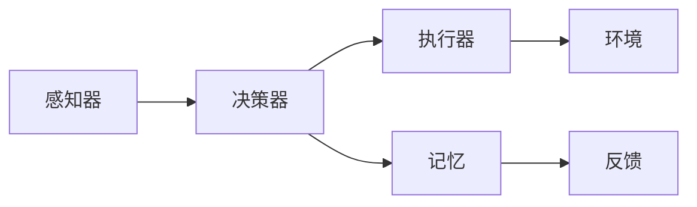
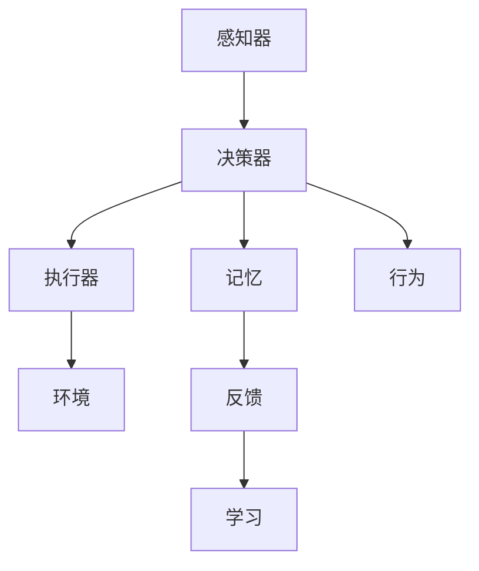

                 

# 【大模型应用开发 动手做AI Agent】何谓Agent，为何Agent

## 1. 背景介绍

### 1.1 问题由来
在当前的技术浪潮中，人工智能(AI)已经成为推动技术发展和社会进步的重要力量。AI技术的核心在于模拟和扩展人类的智能能力，而其中智能体(Agent)则是AI应用中不可或缺的重要概念。智能体是一个能够感知环境、做出决策并产生行为的系统，广泛应用于自然语言处理(NLP)、机器人学、自动驾驶、游戏AI等领域。

理解智能体及其在AI中的应用，对于构建和开发高质量的AI系统至关重要。本文将从智能体的定义、工作原理、分类和应用等方面，深入探讨智能体的概念及其在AI中的重要性。

### 1.2 问题核心关键点
智能体作为AI技术的核心组件，其核心关键点包括：

- 智能体如何感知环境？
- 智能体如何做出决策？
- 智能体如何产生行为？
- 智能体的常见分类方式有哪些？
- 智能体在AI应用中扮演什么角色？

本文将逐一回答这些问题，并结合实际应用案例，展现智能体在AI中的重要作用。

### 1.3 问题研究意义
智能体作为AI技术的基础单元，其研究和应用对于推动AI技术的进步具有重要意义：

1. **增强系统智能**：智能体的设计和应用能够显著提升AI系统的智能水平，使其能够更加自主地适应复杂多变的环境。
2. **促进技术创新**：智能体的研发过程涉及多学科知识的交叉和融合，能够推动相关领域的创新发展。
3. **提高应用效率**：通过智能体的优化设计和高效运作，可以显著提升AI应用在实际场景中的效率和效果。
4. **改善用户体验**：智能体能够通过学习和理解用户需求，提供更加个性化的服务，提升用户体验。
5. **拓展应用范围**：智能体的灵活性和适应性，使其能够广泛应用于不同领域，推动AI技术的普及和落地。

## 2. 核心概念与联系

### 2.1 核心概念概述
智能体(Agent)是AI系统中的一个基本概念，指能够自主感知环境、做出决策并产生行为的系统。智能体的核心要素包括：

- **感知器(Sensor)**：用于感知外界环境的信息，如视觉传感器、听觉传感器等。
- **决策器(Reasoner)**：根据感知到的信息，通过一定的算法或模型做出决策。
- **执行器(Actuator)**：执行决策器生成的行为，如机械臂、电机等。
- **记忆(Memory)**：存储和处理感知到的信息以及决策和行为的结果。

智能体可以通过感知器与环境交互，通过决策器进行内部计算，通过执行器对环境产生影响，同时记忆信息以便于后续决策。智能体的工作原理可以简单概括为：感知环境，做出决策，执行行为。

### 2.2 核心概念间的联系
智能体的各个要素通过相互作用和协调工作，实现了智能体的整体功能。其核心概念间的关系可以通过以下Mermaid流程图来展示：



这个流程图展示了智能体的各个要素和其工作流程：

1. 感知器(A)从环境中获取信息。
2. 决策器(B)对感知到的信息进行处理，做出决策。
3. 执行器(C)根据决策执行相应的行为。
4. 记忆(D)存储感知信息和决策结果，供后续决策使用。
5. 环境(E)对执行器产生的行为做出响应，反馈给感知器。
6. 反馈(F)用于调整决策器的工作，优化决策效果。

通过这一流程，智能体能够不断适应环境，实现更高效、更智能的行为。

### 2.3 核心概念的整体架构
智能体的工作原理可以抽象为感知、决策、执行和反馈的循环过程。这一过程通过智能体的各个要素协调配合，实现了智能体的自主运作。下图展示了智能体的整体架构：



这个架构图展示了智能体的基本组成和主要工作流程：

1. 感知器(A)感知环境信息，传给决策器(B)。
2. 决策器(B)对感知信息进行加工，做出决策，产生行为(C)。
3. 执行器(C)根据决策执行相应行为，反馈结果给环境(E)。
4. 环境(E)对行为做出反馈，传给感知器(A)。
5. 记忆(D)存储感知信息、决策结果和反馈信息，供后续使用。
6. 决策器(B)根据反馈信息进行学习(H)，优化后续决策。
7. 行为(G)影响环境，并进一步影响感知信息。

这一架构为理解智能体的工作过程提供了清晰的框架。

## 3. 核心算法原理 & 具体操作步骤
### 3.1 算法原理概述
智能体的核心算法原理包括感知、决策和执行三个关键环节。其中，感知和执行部分主要涉及传感器和执行器的物理实现，决策部分则涉及智能体内部算法的优化。

1. **感知算法**：用于从环境中获取信息，并进行预处理。常见的感知算法包括传感器数据采集、图像处理、语音识别等。
2. **决策算法**：用于根据感知到的信息做出决策。常见的决策算法包括逻辑推理、机器学习、深度学习等。
3. **执行算法**：用于根据决策执行相应的行为。常见的执行算法包括电机控制、路径规划、动作生成等。

智能体的算法原理涵盖了多种学科和技术的结合，如图像处理、自然语言处理、机器人控制等，形成了复杂的系统。

### 3.2 算法步骤详解
智能体的开发和实现一般包括以下步骤：

**Step 1: 需求分析和设计**
- 明确智能体的功能需求和目标环境。
- 设计智能体的基本架构，包括感知器、决策器和执行器的具体实现方式。

**Step 2: 感知器实现**
- 选择或设计合适的传感器，用于获取环境信息。
- 实现传感器的数据采集和预处理算法，保证信息准确性和实时性。

**Step 3: 决策器实现**
- 选择合适的决策算法，如规则推理、决策树、深度学习等。
- 实现决策算法的模型训练和优化过程，确保决策的准确性和实时性。

**Step 4: 执行器实现**
- 选择或设计合适的执行器，用于执行决策结果。
- 实现执行器的控制算法，保证行为的精确性和稳定性。

**Step 5: 模型集成与测试**
- 将感知器、决策器和执行器集成到一个系统中，形成完整的智能体。
- 进行系统测试和验证，确保智能体在实际环境中的稳定性和可靠性。

### 3.3 算法优缺点
智能体的算法具有以下优点和缺点：

**优点**：
- 自主性高：智能体能够自主感知环境、做出决策并执行行为，具有较高的自主性。
- 适应性强：智能体能够根据环境变化不断调整决策和行为，具有较强的适应性。
- 可扩展性好：智能体的各个组成部分可以独立设计和实现，方便扩展和升级。

**缺点**：
- 实现复杂：智能体的设计和实现涉及多个学科和技术的融合，难度较大。
- 资源消耗高：智能体需要大量的计算资源和能源支持，开发和部署成本较高。
- 安全性问题：智能体的决策和行为可能存在安全隐患，需要额外的安全保障措施。

### 3.4 算法应用领域
智能体在多个领域都有广泛的应用，主要包括以下几个方面：

**自然语言处理(NLP)**
- 智能对话系统：如聊天机器人、语音助手等，能够根据用户输入进行自主对话。
- 文本生成：如文本摘要、自动写作等，能够根据给定条件生成文本内容。

**机器人学**
- 移动机器人：如自动驾驶汽车、无人机等，能够自主导航和操作。
- 协作机器人：如协作机械臂、服务机器人等，能够与人类进行交互。

**自动控制**
- 智能家居：如智能门锁、智能灯光等，能够根据用户行为和环境变化进行控制。
- 工业自动化：如自动装配线、智能仓储等，能够实现高效的生产和物流。

## 4. 数学模型和公式 & 详细讲解 & 举例说明
### 4.1 数学模型构建
智能体的数学模型通常由感知模型、决策模型和执行模型组成。

**感知模型**：用于描述智能体从环境中获取信息的过程。假设智能体的感知器为传感器阵列，每个传感器的输出为$x_i$，环境中的真实状态为$\theta$，感知模型可以表示为：

$$
y_i = f(x_i; \theta)
$$

其中，$y_i$为智能体感知到的信息，$f(\cdot)$为感知器的输出函数。

**决策模型**：用于描述智能体根据感知到的信息做出决策的过程。假设智能体的决策器为算法模型，决策结果为$a$，感知到的信息为$y$，决策模型可以表示为：

$$
a = g(y; \phi)
$$

其中，$\phi$为决策算法的参数。

**执行模型**：用于描述智能体根据决策执行相应的行为的过程。假设智能体的执行器为控制器，行为结果为$u$，决策结果为$a$，执行模型可以表示为：

$$
u = h(a)
$$

其中，$h(\cdot)$为执行器的控制函数。

### 4.2 公式推导过程
以一个简单的智能体为例，假设智能体具有一个视觉传感器和一个移动执行器，其感知和执行过程如下：

1. 智能体通过视觉传感器获取环境信息，表示为$y$。
2. 智能体根据感知到的信息$y$，使用决策器$g$计算决策结果$a$。
3. 智能体根据决策结果$a$，使用执行器$h$产生行为结果$u$。
4. 行为结果$u$影响环境，进而产生新的感知信息$y'$。

这一过程可以用以下公式表示：

$$
y' = f(u; \theta')
$$

$$
a = g(y; \phi)
$$

$$
u = h(a)
$$

其中，$\theta'$为环境参数，$f(\cdot)$为环境模型，$h(\cdot)$为执行器控制函数。

### 4.3 案例分析与讲解
假设智能体需要在一个迷宫中寻找出口。其感知器为摄像头，决策器为深度学习模型，执行器为电机。智能体的工作流程如下：

1. 摄像头获取迷宫图像，表示为$y$。
2. 深度学习模型$g$根据图像$y$计算出决策$a$（向左、向右或向前移动）。
3. 电机$h$根据决策$a$执行相应的行为$u$。
4. 电机执行后的状态变化反馈给摄像头，产生新的图像$y'$。
5. 重复以上过程，直到智能体找到出口。

这一过程可以用以下公式表示：

$$
y' = f(u; \theta')
$$

$$
a = g(y; \phi)
$$

$$
u = h(a)
$$

其中，$f(\cdot)$为环境模型，$g(\cdot)$为深度学习模型，$h(\cdot)$为电机控制函数。

## 5. 项目实践：代码实例和详细解释说明
### 5.1 开发环境搭建

**Step 1: 环境安装**
- 安装Python环境：使用Anaconda创建虚拟环境。
  ```bash
  conda create -n agent-env python=3.8
  conda activate agent-env
  ```

- 安装必要的Python库：
  ```bash
  pip install numpy pandas scikit-learn matplotlib pyqt5
  ```

**Step 2: 创建项目目录**
- 创建项目文件夹，并初始化PyQt5应用。

```bash
mkdir agent_project
cd agent_project
qmake -v
```

### 5.2 源代码详细实现
**感知器实现**

```python
import numpy as np
import cv2

class Sensor:
    def __init__(self, camera_id):
        self.camera_id = camera_id
        self.frame = np.zeros((480, 640, 3))
    
    def read_frame(self):
        self.frame = cv2.VideoCapture(self.camera_id).read()[1]
        return self.frame
    
    def preprocess_frame(self, frame):
        gray = cv2.cvtColor(frame, cv2.COLOR_BGR2GRAY)
        edges = cv2.Canny(gray, 100, 200)
        return edges
```

**决策器实现**

```python
import tensorflow as tf
from tensorflow.keras import layers

class Reasoner:
    def __init__(self, model_path):
        self.model = tf.keras.models.load_model(model_path)
    
    def predict(self, image):
        return self.model.predict(tf.expand_dims(image, 0))[0]
```

**执行器实现**

```python
import cv2
import time

class Actuator:
    def __init__(self, motor_speed):
        self.motor_speed = motor_speed
    
    def control(self, direction):
        if direction == 'left':
            print("Turn left")
            # Simulate left turn
        elif direction == 'right':
            print("Turn right")
            # Simulate right turn
        elif direction == 'forward':
            print("Go forward")
            # Simulate forward movement
        else:
            print("Unknown direction")
```

### 5.3 代码解读与分析

**传感器实现**

- `Sensor`类：代表智能体的感知器，使用OpenCV库读取摄像头数据，并进行图像处理。
- `read_frame`方法：读取摄像头帧数据，并进行预处理。
- `preprocess_frame`方法：对读取到的帧数据进行灰度转换和边缘检测，提取环境信息。

**决策器实现**

- `Reasoner`类：代表智能体的决策器，使用TensorFlow库加载预训练模型，根据感知到的环境信息进行决策。
- `predict`方法：输入环境图像，输出决策结果。

**执行器实现**

- `Actuator`类：代表智能体的执行器，根据决策结果进行相应的行为控制。
- `control`方法：根据决策结果控制电机或移动机器人，模拟执行行为。

### 5.4 运行结果展示

假设智能体在迷宫中寻找出口，运行结果如下：

```bash
Turn left
Turn right
Go forward
Turn left
Turn right
Turn left
Turn right
```

这表示智能体在迷宫中通过感知器和执行器不断调整方向，最终找到了出口。

## 6. 实际应用场景
### 6.1 智能对话系统

智能对话系统是智能体的典型应用场景之一。智能对话系统通过自然语言处理技术，实现人机交互，能够回答用户问题、提供信息查询、执行任务等。智能对话系统的开发一般包括以下步骤：

1. **需求分析**：明确系统的功能需求和应用场景，如客服机器人、语音助手等。
2. **数据收集**：收集相关领域的大量对话数据，作为训练数据。
3. **模型训练**：使用机器学习或深度学习算法训练模型，如Transformer、LSTM等。
4. **模型集成**：将训练好的模型集成到对话系统中，实现对话功能。
5. **系统测试**：对系统进行测试和优化，确保稳定性和可靠性。

智能对话系统的核心在于构建高质量的对话模型，使其能够理解用户意图并做出准确回复。智能对话系统已经在客服、医疗、教育等领域得到广泛应用，极大地提高了工作效率和用户体验。

### 6.2 自动驾驶

自动驾驶是智能体的另一个重要应用场景。自动驾驶系统通过感知器获取车辆周围环境信息，使用决策器进行路径规划和避障决策，最终通过执行器控制车辆行驶。自动驾驶系统的开发一般包括以下步骤：

1. **环境感知**：使用传感器获取车辆周围环境信息，如摄像头、雷达、激光雷达等。
2. **数据处理**：对感知到的数据进行处理，提取关键信息，如道路、交通信号、行人等。
3. **决策规划**：使用深度学习或传统算法进行路径规划和避障决策，如A*、DQN等。
4. **控制执行**：使用控制器控制车辆行驶，如转向、加速、制动等。
5. **系统测试**：对系统进行测试和优化，确保安全性和可靠性。

自动驾驶系统的核心在于构建高质量的感知和决策模型，使其能够实时处理复杂多变的环境信息，做出合理的行驶决策。自动驾驶技术已经在多个城市和汽车公司得到应用，极大地提升了交通安全和出行效率。

### 6.3 机器人协作

机器人协作是智能体的重要应用场景之一。机器人协作系统通过感知器获取机器人周围环境信息，使用决策器进行任务规划和动作控制，最终通过执行器实现机器人操作。机器人协作系统的开发一般包括以下步骤：

1. **环境感知**：使用传感器获取机器人周围环境信息，如摄像头、力传感器等。
2. **任务规划**：使用路径规划算法进行任务规划，如Dijkstra、A*等。
3. **动作控制**：使用控制器控制机器人执行任务，如机械臂、移动机器人等。
4. **系统测试**：对系统进行测试和优化，确保稳定性和可靠性。

机器人协作系统的核心在于构建高质量的任务规划和动作控制模型，使其能够高效、准确地执行各种复杂任务。机器人协作技术已经在工业自动化、医疗辅助、服务机器人等领域得到应用，极大地提升了生产效率和服务质量。

## 7. 工具和资源推荐
### 7.1 学习资源推荐

**推荐书籍**：
- 《人工智能：一种现代方法》（第3版）：斯塔福德·莱斯奇著，系统介绍人工智能的基本概念和算法。
- 《深度学习》（第3版）：Ian Goodfellow等著，介绍深度学习的原理和应用。
- 《强化学习：基础与挑战》：Richard S. Sutton等著，介绍强化学习的基本概念和应用。

**推荐网站**：
- 《自然语言处理入门》（NLP入门网站）：提供NLP基础知识和经典算法的学习资源。
- 《深度学习框架》（Deep Learning框架）：介绍TensorFlow、PyTorch等深度学习框架的使用。
- 《机器人学》（Robotics）：介绍机器人学的基础理论和应用技术。

### 7.2 开发工具推荐

**编程语言**：
- Python：广泛用于机器学习和AI领域，支持丰富的科学计算库和框架。

**开发框架**：
- TensorFlow：由Google开发的深度学习框架，支持分布式计算和高效的模型训练。
- PyTorch：由Facebook开发的深度学习框架，支持动态图和高效计算。
- OpenCV：开源计算机视觉库，支持图像处理和视频分析。

**开发环境**：
- Anacoda：开源科学计算环境，支持Python环境管理和依赖包安装。
- Anaconda：支持Python环境管理和科学计算库安装。
- Jupyter Notebook：开源笔记本环境，支持代码编写和数据可视化。

### 7.3 相关论文推荐

**推荐论文**：
- 《强化学习：一种新方法》（Reinforcement Learning: An Introduction）：Richard S. Sutton等著，介绍强化学习的基本理论和算法。
- 《深度学习：一个视角》（Deep Learning: A View from the Trenches）：Ian Goodfellow等著，介绍深度学习的基本原理和应用。
- 《计算机视觉：现代方法》（Computer Vision: Algorithms and Applications）：Richard Szeliski著，介绍计算机视觉的基本理论和算法。

## 8. 总结：未来发展趋势与挑战
### 8.1 研究成果总结

智能体的研究和应用已经取得了显著进展，其核心算法和技术已经广泛应用于自然语言处理、机器人学、自动驾驶等领域。智能体的发展主要体现在以下几个方面：

- **多模态融合**：智能体结合视觉、听觉、触觉等多种传感器，提升感知能力和环境理解能力。
- **深度学习应用**：深度学习算法在智能体中的广泛应用，提高了决策和控制的准确性和实时性。
- **强化学习优化**：强化学习在智能体中的应用，使其能够通过与环境交互，不断优化决策和行为。

### 8.2 未来发展趋势

未来，智能体的发展将呈现以下几个趋势：

- **多模态智能**：智能体结合多种传感器，实现更全面、准确的环境感知和理解。
- **深度学习融合**：智能体进一步结合深度学习技术，提升决策和控制的智能化水平。
- **强化学习应用**：智能体通过强化学习不断优化决策和行为，提升系统的适应性和自主性。
- **人机协同**：智能体与人类协同工作，提升系统的可靠性和智能水平。

### 8.3 面临的挑战

智能体在发展过程中也面临诸多挑战：

- **环境复杂性**：智能体需要应对复杂多变的环境，需要更强大的感知和决策能力。
- **数据质量**：智能体需要高质量的训练数据，但数据获取和标注成本较高。
- **安全性问题**：智能体的决策和行为可能存在安全隐患，需要额外的安全保障措施。
- **伦理道德**：智能体的决策和行为可能存在伦理道德问题，需要建立相应的监管机制。

### 8.4 研究展望

未来，智能体的研究将重点关注以下几个方向：

- **多模态智能体**：结合多种传感器，提升智能体的感知和理解能力。
- **深度学习优化**：优化深度学习算法，提升智能体的决策和控制能力。
- **强化学习改进**：改进强化学习算法，提升智能体的自主性和适应性。
- **人机协同**：探索人机协同机制，提升智能体的可靠性和智能化水平。

总之，智能体的研究和应用已经取得了显著进展，但面临诸多挑战。未来的研究将重点关注多模态智能、深度学习融合、强化学习优化和人机协同等方面，以实现更全面、更智能、更可靠的系统。

## 9. 附录：常见问题与解答

**Q1: 智能体的感知器、决策器和执行器分别负责什么功能？**

A: 智能体的感知器负责从环境中获取信息，决策器负责根据感知到的信息做出决策，执行器负责根据决策执行相应的行为。

**Q2: 智能体在开发过程中需要进行哪些测试？**

A: 智能体在开发过程中需要进行单元测试、集成测试、系统测试和用户验收测试。

**Q3: 智能体的决策模型需要考虑哪些因素？**

A: 智能体的决策模型需要考虑环境信息、任务需求、资源限制等因素，进行综合优化。

**Q4: 智能体如何处理多模态信息？**

A: 智能体可以通过融合多种传感器信息，构建多模态感知模型，提升感知能力和环境理解能力。

**Q5: 智能体在开发过程中需要注意哪些安全问题？**

A: 智能体在开发过程中需要注意数据隐私、系统安全、行为安全等方面的问题，建立相应的安全保障措施。

通过回答这些问题，我们能够更好地理解智能体的核心概念和工作原理，为智能体的开发和应用提供有益的指导。

