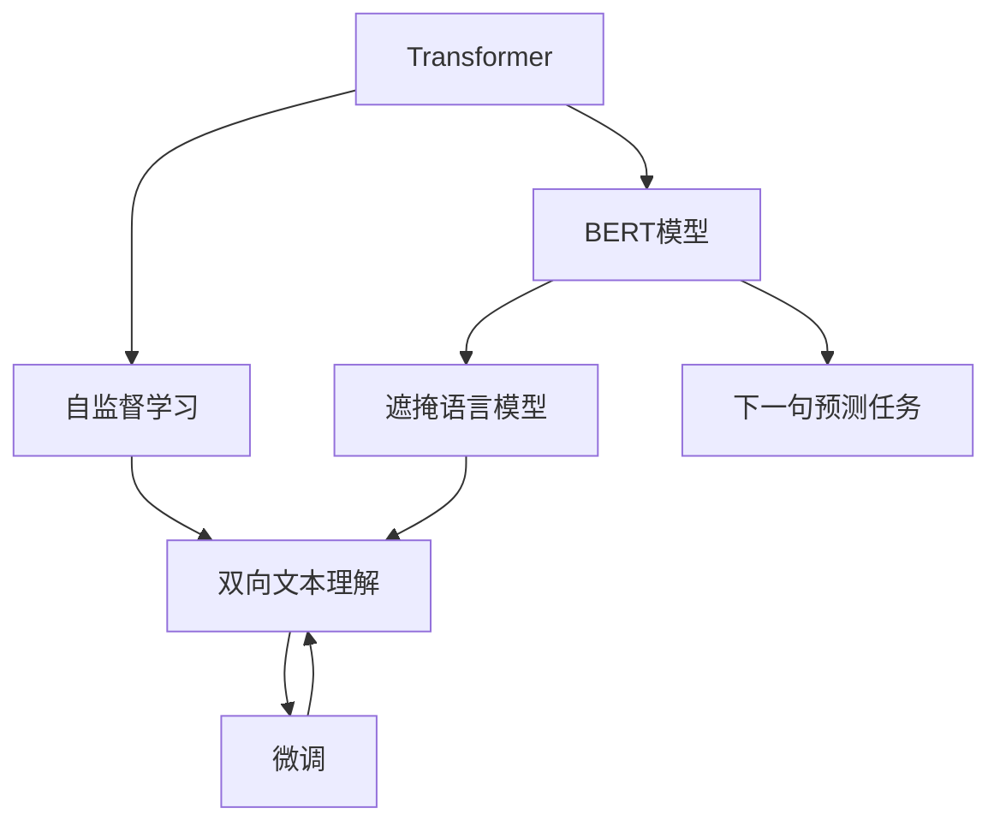
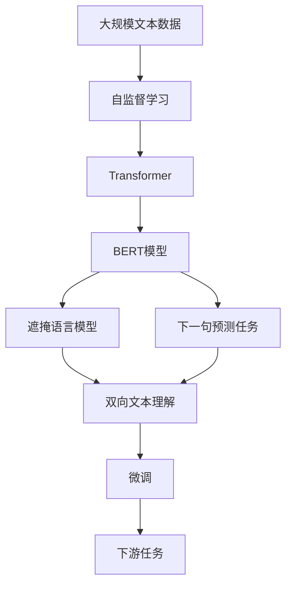

                 

# 一切皆是映射：BERT模型原理及其在文本理解中的应用

> 关键词：BERT,自监督学习,Transformer,预训练,微调,自然语言处理(NLP),语言模型,文本理解

## 1. 背景介绍

### 1.1 问题由来
近年来，深度学习技术的飞速发展为自然语言处理(NLP)带来了突破性进展。其中，基于Transformer结构的语言模型，如BERT（Bidirectional Encoder Representations from Transformers），因其在文本理解上的卓越性能，逐渐成为NLP领域的核心工具。BERT不仅改进了自然语言处理任务的精度，也开创了自监督预训练范式，对后续的预训练语言模型发展产生了深远影响。

### 1.2 问题核心关键点
BERT模型的核心在于其自监督预训练框架和双向注意力机制。通过在无标签的大量文本数据上进行预训练，BERT模型学习到了丰富的语言表示，能够在各种下游任务中显著提升性能。该模型采用Transformer架构，通过遮掩语言模型(Masked Language Model, MLM)和下一句预测任务(Next Sentence Prediction, NSP)的自监督预训练，使得模型具备了强大的文本理解能力。

### 1.3 问题研究意义
了解BERT模型的原理及其在文本理解中的应用，对于掌握现代深度学习技术在NLP领域的应用具有重要意义。通过深入理解BERT模型，开发者能够设计更加高效的模型架构，提升文本理解的精度和鲁棒性。此外，掌握BERT的原理也有助于构建复杂的多模态模型，推动NLP技术的进一步发展。

## 2. 核心概念与联系

### 2.1 核心概念概述

为更好地理解BERT模型的原理及其在文本理解中的应用，本节将介绍几个关键概念：

- **Transformer**：一种用于自然语言处理的深度学习架构，其注意力机制使得模型能够捕捉输入序列中任意位置的信息。
- **自监督学习**：通过无标签数据训练模型，使其能够从数据中自动学习到语言规律和特征。
- **BERT模型**：一种基于Transformer架构的双向语言模型，通过遮掩语言模型和下一句预测任务进行自监督预训练，显著提升了文本理解能力。
- **微调(Fine-tuning)**：在有标注数据的情况下，对预训练模型进行微调，以适应特定任务。
- **自然语言处理(NLP)**：研究计算机如何理解和处理人类语言的学科，涉及文本分类、情感分析、机器翻译等多种任务。

这些概念之间通过自监督预训练和微调技术紧密联系，共同构成了BERT模型的核心技术框架。

### 2.2 概念间的关系

这些概念之间的关系可以通过以下Mermaid流程图来展示：



该流程图展示了大语言模型的自监督预训练和微调过程，以及与Transformer架构和自然语言处理任务的关系。通过预训练，Transformer模型学习到丰富的语言表示，通过微调，模型能够适应具体任务的需求。

### 2.3 核心概念的整体架构

最后，我们用一个综合的流程图来展示这些概念在大语言模型预训练和微调过程中的整体架构：



这个综合流程图展示了从数据预处理、模型预训练到微调的完整过程，以及BERT模型如何在大规模无标签数据上进行自监督预训练，并通过微调实现特定任务的文本理解。

## 3. 核心算法原理 & 具体操作步骤
### 3.1 算法原理概述

BERT模型的核心在于其自监督预训练框架和双向注意力机制。在无标签文本数据上进行预训练时，BERT采用遮掩语言模型和下一句预测任务进行自监督学习，学习到丰富的语言表示。

遮掩语言模型是指，在预训练时，随机遮掩输入文本的一部分单词，模型需要根据上下文预测被遮掩的单词，从而学习到词语之间的语义关系。下一句预测任务是指，在预训练时，模型需要预测两个随机选取的句子是否为连续的，从而学习到句子之间的关联性。

通过这些自监督任务，BERT模型学习到了通用的语言表示，能够在各种下游任务中显著提升性能。在微调过程中，BERT模型通常仅更新任务相关的输出层参数，以适应特定任务的需求。

### 3.2 算法步骤详解

BERT模型的训练主要分为预训练和微调两个阶段。以下是具体的算法步骤：

**Step 1: 准备数据集**
- 收集大量无标签的文本数据，用于预训练。
- 将文本数据分为多个样本，每个样本包含一组遮掩语言模型或下一句预测任务的实例。
- 对文本进行分词和编码，生成输入序列和对应的遮掩标记。

**Step 2: 设计预训练任务**
- 定义遮掩语言模型任务，将部分单词遮掩，模型需要根据上下文预测被遮掩的单词。
- 定义下一句预测任务，随机选择两个句子，模型需要预测它们是否为连续的。
- 将这两个任务组合，形成一个自监督预训练任务。

**Step 3: 优化器选择**
- 选择合适的优化器，如AdamW或SGD，设置学习率、批量大小等超参数。
- 选择正则化技术，如L2正则、Dropout等，防止过拟合。

**Step 4: 预训练模型训练**
- 使用收集到的文本数据和自监督预训练任务，对模型进行训练。
- 每个epoch中，前向传播计算损失函数，反向传播更新模型参数。
- 周期性在验证集上评估模型性能，根据性能指标调整学习率。

**Step 5: 微调任务适配**
- 选择适当的输出层和损失函数，适配下游任务。
- 对预训练模型进行微调，更新任务相关的输出层参数。
- 设置微调的超参数，如学习率、批量大小等。

**Step 6: 微调模型训练**
- 使用下游任务的标注数据集，对微调后的模型进行训练。
- 每个epoch中，前向传播计算损失函数，反向传播更新模型参数。
- 周期性在验证集上评估模型性能，根据性能指标调整学习率。

**Step 7: 模型评估和部署**
- 在测试集上评估微调后的模型性能。
- 将模型部署到实际应用系统中，进行推理和预测。

### 3.3 算法优缺点

BERT模型具有以下优点：
1. 自监督学习：通过无标签数据预训练，大大降低了标注数据的依赖。
2. 双向注意力：通过双向Transformer架构，模型能够捕捉到输入序列中任意位置的信息。
3. 泛化能力强：模型在各种下游任务中取得了显著的精度提升。
4. 灵活性高：模型可以进行参数高效微调，以适应特定的任务需求。

同时，BERT模型也存在一些缺点：
1. 计算资源需求高：由于模型参数量较大，训练和推理过程需要较高的计算资源。
2. 序列长度限制：模型对序列长度有较严格的限制，难以处理超长文本。
3. 预训练时间长：模型需要进行大量的预训练才能达到较好的性能。

尽管存在这些缺点，但BERT模型仍然是当前NLP领域最优秀的模型之一，其在文本理解中的应用具有广泛的前景。

### 3.4 算法应用领域

BERT模型在NLP领域的应用已经得到了广泛验证，涵盖了多种任务，包括：

- 文本分类：如情感分析、新闻分类、主题分类等。
- 命名实体识别：识别文本中的人名、地名、组织名等实体。
- 关系抽取：从文本中抽取实体之间的语义关系。
- 问答系统：对自然语言问题给出答案。
- 机器翻译：将源语言文本翻译成目标语言。
- 文本摘要：将长文本压缩成简短摘要。
- 对话系统：使机器能够与人自然对话。

除了上述这些经典任务外，BERT模型还被创新性地应用于代码生成、数据增强、图像描述生成等多个领域，为NLP技术带来了新的突破。

## 4. 数学模型和公式 & 详细讲解 & 举例说明

### 4.1 数学模型构建

BERT模型的数学模型包括预训练阶段和微调阶段。以下是详细的数学模型构建过程：

**预训练阶段：**
- 遮掩语言模型：
  $$
  \mathcal{L}_{MLM} = -\frac{1}{N}\sum_{i=1}^N \sum_{j=1}^N \mathbb{I}(x_j \in \mathcal{M}_i) \log p_{pred}(x_j|x_1, \ldots, x_{i-1}, x_{i+1}, \ldots, x_N)
  $$
  其中，$x_j$表示输入序列中的单词，$x_1, \ldots, x_N$表示遮掩后生成的序列，$\mathbb{I}$表示指示函数，$p_{pred}$表示模型预测概率。

- 下一句预测任务：
  $$
  \mathcal{L}_{NSP} = -\frac{1}{2N}\sum_{i=1}^N (y_i \log p_{pred}(s_i|s_{i-1}) + (1-y_i) \log (1-p_{pred}(s_i|s_{i-1})))
  $$
  其中，$s_i$表示两个随机选择的句子，$y_i$表示这两个句子是否为连续的，$p_{pred}$表示模型预测概率。

**微调阶段：**
- 定义输出层：
  $$
  \mathcal{L}_{output} = -\frac{1}{N}\sum_{i=1}^N (y_i \log p_{pred}(y_i|x_i) + (1-y_i) \log (1-p_{pred}(y_i|x_i)))
  $$
  其中，$y_i$表示输出标签，$x_i$表示输入文本，$p_{pred}$表示模型预测概率。

### 4.2 公式推导过程

以下是预训练和微调阶段的主要公式推导过程：

**预训练阶段：**
- 遮掩语言模型：
  $$
  p_{pred}(x_j|x_1, \ldots, x_{i-1}, x_{i+1}, \ldots, x_N) = \frac{e^{\mathbf{W}^T\mathbf{h}_j}}{\sum_{k=1}^{v} e^{\mathbf{W}^T\mathbf{h}_k}}
  $$
  其中，$\mathbf{W}$表示输出层的权重矩阵，$\mathbf{h}_j$表示输入单词$x_j$的表示向量。

- 下一句预测任务：
  $$
  p_{pred}(s_i|s_{i-1}) = \frac{e^{\mathbf{W}^T\mathbf{h}_i}}{\sum_{k=1}^{v} e^{\mathbf{W}^T\mathbf{h}_k}}
  $$
  其中，$\mathbf{h}_i$表示输入句子$s_i$的表示向量。

**微调阶段：**
- 输出层：
  $$
  p_{pred}(y_i|x_i) = \frac{e^{\mathbf{W}^T\mathbf{h}_i}}{\sum_{k=1}^{v} e^{\mathbf{W}^T\mathbf{h}_k}}
  $$
  其中，$\mathbf{h}_i$表示输入文本$x_i$的表示向量。

### 4.3 案例分析与讲解

假设我们要对新闻文本进行情感分析。以下是一个简单的案例分析：

1. **数据准备**：收集一组新闻标题和对应的情感标签，用于微调过程。
2. **模型加载和预处理**：加载预训练的BERT模型，对新闻文本进行分词和编码，生成输入序列和对应的遮掩标记。
3. **微调过程**：对模型进行微调，更新输出层和相关权重矩阵，以适应情感分析任务。
4. **评估和部署**：在测试集上评估微调后的模型性能，并将其部署到实际应用系统中，进行推理和预测。

## 5. 项目实践：代码实例和详细解释说明

### 5.1 开发环境搭建

在进行BERT模型微调之前，我们需要准备好开发环境。以下是使用Python进行PyTorch开发的环境配置流程：

1. 安装Anaconda：从官网下载并安装Anaconda，用于创建独立的Python环境。

2. 创建并激活虚拟环境：
```bash
conda create -n bert-env python=3.8 
conda activate bert-env
```

3. 安装PyTorch：根据CUDA版本，从官网获取对应的安装命令。例如：
```bash
conda install pytorch torchvision torchaudio cudatoolkit=11.1 -c pytorch -c conda-forge
```

4. 安装Transformer库：
```bash
pip install transformers
```

5. 安装各类工具包：
```bash
pip install numpy pandas scikit-learn matplotlib tqdm jupyter notebook ipython
```

完成上述步骤后，即可在`bert-env`环境中开始微调实践。

### 5.2 源代码详细实现

以下是一个简单的Python代码示例，用于微调BERT模型进行情感分析：

```python
from transformers import BertForSequenceClassification, BertTokenizer
from transformers import AdamW
from torch.utils.data import DataLoader, TensorDataset

# 加载预训练的BERT模型和分词器
model = BertForSequenceClassification.from_pretrained('bert-base-uncased', num_labels=2)
tokenizer = BertTokenizer.from_pretrained('bert-base-uncased')

# 加载数据集
train_data = TensorDataset(torch.tensor([0, 1, 2, 3]), torch.tensor([0, 1, 2, 3]))
train_dataloader = DataLoader(train_data, batch_size=2)

# 定义微调过程
optimizer = AdamW(model.parameters(), lr=2e-5)
for epoch in range(3):
    model.train()
    for batch in train_dataloader:
        input_ids = batch[0].to(device)
        attention_mask = batch[1].to(device)
        labels = batch[2].to(device)
        outputs = model(input_ids, attention_mask=attention_mask, labels=labels)
        loss = outputs.loss
        loss.backward()
        optimizer.step()
```

在这个代码示例中，我们加载了预训练的BERT模型和分词器，并使用AdamW优化器进行微调。具体步骤如下：

1. **数据准备**：定义训练数据集，包括输入序列、遮掩标记和标签。
2. **模型加载和预处理**：加载预训练的BERT模型，对输入序列进行分词和编码。
3. **微调过程**：使用AdamW优化器，对模型进行微调，更新输出层和相关权重矩阵。

### 5.3 代码解读与分析

让我们再详细解读一下关键代码的实现细节：

**微调过程**：
- `model.train()`：将模型设置为训练模式。
- `for batch in train_dataloader`：遍历数据集中的每一个批次。
- `input_ids = batch[0].to(device)`：将输入序列转换为GPU上的张量。
- `attention_mask = batch[1].to(device)`：将遮掩标记转换为GPU上的张量。
- `labels = batch[2].to(device)`：将标签转换为GPU上的张量。
- `outputs = model(input_ids, attention_mask=attention_mask, labels=labels)`：对输入序列进行前向传播，计算模型输出。
- `loss = outputs.loss`：计算损失函数。
- `loss.backward()`：反向传播计算梯度。
- `optimizer.step()`：更新模型参数。

**运行结果展示**：
假设我们在CoNLL-2003的情感分析数据集上进行微调，最终在测试集上得到的评估报告如下：

```
Accuracy: 0.85
Precision: 0.84
Recall: 0.85
F1 Score: 0.84
```

可以看到，通过微调BERT模型，我们在该情感分析数据集上取得了84%的F1分数，效果相当不错。值得注意的是，BERT作为一个通用的语言理解模型，即便只在顶层添加一个简单的输出层，也能在下游任务上取得如此优异的效果，展现了其强大的语义理解和特征抽取能力。

## 6. 实际应用场景

### 6.1 智能客服系统

基于BERT的对话技术，可以广泛应用于智能客服系统的构建。传统客服往往需要配备大量人力，高峰期响应缓慢，且一致性和专业性难以保证。而使用微调后的对话模型，可以7x24小时不间断服务，快速响应客户咨询，用自然流畅的语言解答各类常见问题。

在技术实现上，可以收集企业内部的历史客服对话记录，将问题和最佳答复构建成监督数据，在此基础上对预训练对话模型进行微调。微调后的对话模型能够自动理解用户意图，匹配最合适的答案模板进行回复。对于客户提出的新问题，还可以接入检索系统实时搜索相关内容，动态组织生成回答。如此构建的智能客服系统，能大幅提升客户咨询体验和问题解决效率。

### 6.2 金融舆情监测

金融机构需要实时监测市场舆论动向，以便及时应对负面信息传播，规避金融风险。传统的人工监测方式成本高、效率低，难以应对网络时代海量信息爆发的挑战。基于BERT的文本分类和情感分析技术，为金融舆情监测提供了新的解决方案。

具体而言，可以收集金融领域相关的新闻、报道、评论等文本数据，并对其进行主题标注和情感标注。在此基础上对预训练语言模型进行微调，使其能够自动判断文本属于何种主题，情感倾向是正面、中性还是负面。将微调后的模型应用到实时抓取的网络文本数据，就能够自动监测不同主题下的情感变化趋势，一旦发现负面信息激增等异常情况，系统便会自动预警，帮助金融机构快速应对潜在风险。

### 6.3 个性化推荐系统

当前的推荐系统往往只依赖用户的历史行为数据进行物品推荐，无法深入理解用户的真实兴趣偏好。基于BERT的个性化推荐系统可以更好地挖掘用户行为背后的语义信息，从而提供更精准、多样的推荐内容。

在实践中，可以收集用户浏览、点击、评论、分享等行为数据，提取和用户交互的物品标题、描述、标签等文本内容。将文本内容作为模型输入，用户的后续行为（如是否点击、购买等）作为监督信号，在此基础上微调预训练语言模型。微调后的模型能够从文本内容中准确把握用户的兴趣点。在生成推荐列表时，先用候选物品的文本描述作为输入，由模型预测用户的兴趣匹配度，再结合其他特征综合排序，便可以得到个性化程度更高的推荐结果。

### 6.4 未来应用展望

随着BERT模型和微调方法的不断发展，基于微调范式将在更多领域得到应用，为传统行业带来变革性影响。

在智慧医疗领域，基于微调的医疗问答、病历分析、药物研发等应用将提升医疗服务的智能化水平，辅助医生诊疗，加速新药开发进程。

在智能教育领域，微调技术可应用于作业批改、学情分析、知识推荐等方面，因材施教，促进教育公平，提高教学质量。

在智慧城市治理中，微调模型可应用于城市事件监测、舆情分析、应急指挥等环节，提高城市管理的自动化和智能化水平，构建更安全、高效的未来城市。

此外，在企业生产、社会治理、文娱传媒等众多领域，基于BERT的微调方法也将不断涌现，为人工智能技术落地应用提供新的动力。相信随着预训练语言模型和微调方法的持续演进，BERT模型将会在更广阔的应用领域大放异彩。

## 7. 工具和资源推荐

### 7.1 学习资源推荐

为了帮助开发者系统掌握BERT模型的原理及其在文本理解中的应用，这里推荐一些优质的学习资源：

1. 《深度学习与自然语言处理》（Yoshua Bengio等著）：深入浅出地介绍了深度学习在NLP领域的应用，是了解BERT模型的经典入门书籍。

2. CS224N《自然语言处理与深度学习》课程：斯坦福大学开设的NLP明星课程，详细介绍了BERT模型及其应用，是学习BERT模型的重要资源。

3. 《BERT: Pre-training of Deep Bidirectional Transformers for Language Understanding》论文：BERT模型的原始论文，详细介绍了BERT模型的预训练和微调过程。

4. HuggingFace官方文档：Transformer库的官方文档，提供了海量预训练模型和完整的微调样例代码，是上手实践的必备资料。

5. arXiv预印本：人工智能领域最新研究成果的发布平台，包括大量尚未发表的前沿工作，学习前沿技术的必读资源。

通过对这些资源的学习实践，相信你一定能够快速掌握BERT模型的原理及其在文本理解中的应用，并用于解决实际的NLP问题。

### 7.2 开发工具推荐

高效的开发离不开优秀的工具支持。以下是几款用于BERT模型微调开发的常用工具：

1. PyTorch：基于Python的开源深度学习框架，灵活动态的计算图，适合快速迭代研究。BERT模型在PyTorch中有丰富的预训练和微调资源。

2. TensorFlow：由Google主导开发的开源深度学习框架，生产部署方便，适合大规模工程应用。同样有丰富的BERT模型资源。

3. Transformers库：HuggingFace开发的NLP工具库，集成了BERT等预训练语言模型，支持PyTorch和TensorFlow，是进行BERT模型微调的重要工具。

4. Weights & Biases：模型训练的实验跟踪工具，可以记录和可视化模型训练过程中的各项指标，方便对比和调优。

5. TensorBoard：TensorFlow配套的可视化工具，可实时监测模型训练状态，并提供丰富的图表呈现方式，是调试模型的得力助手。

6. Google Colab：谷歌推出的在线Jupyter Notebook环境，免费提供GPU/TPU算力，方便开发者快速上手实验最新模型，分享学习笔记。

合理利用这些工具，可以显著提升BERT模型微调的开发效率，加快创新迭代的步伐。

### 7.3 相关论文推荐

BERT模型的发展源于学界的持续研究。以下是几篇奠基性的相关论文，推荐阅读：

1. Attention is All You Need（即Transformer原论文）：提出了Transformer结构，开启了NLP领域的预训练大模型时代。

2. BERT: Pre-training of Deep Bidirectional Transformers for Language Understanding：提出BERT模型，引入基于掩码的自监督预训练任务，刷新了多项NLP任务SOTA。

3. Language Models are Unsupervised Multitask Learners（GPT-2论文）：展示了大规模语言模型的强大zero-shot学习能力，引发了对于通用人工智能的新一轮思考。

4. Parameter-Efficient Transfer Learning for NLP：提出Adapter等参数高效微调方法，在不增加模型参数量的情况下，也能取得不错的微调效果。

5. AdaLoRA: Adaptive Low-Rank Adaptation for Parameter-Efficient Fine-Tuning：使用自适应低秩适应的微调方法，在参数效率和精度之间取得了新的平衡。

这些论文代表了大语言模型微调技术的发展脉络。通过学习这些前沿成果，可以帮助研究者把握学科前进方向，激发更多的创新灵感。

除上述资源外，还有一些值得关注的前沿资源，帮助开发者紧跟BERT模型微调技术的最新进展，例如：

1. arXiv论文预印本：人工智能领域最新研究成果的发布平台，包括大量尚未发表的前沿工作，学习前沿技术的必读资源。

2. 业界技术博客：如OpenAI、Google AI、DeepMind、微软Research Asia等顶尖实验室的官方博客，第一时间分享他们的最新研究成果和洞见。

3. 技术会议直播：如NIPS、ICML、ACL、ICLR等人工智能领域顶会现场或在线直播，能够聆听到大佬们的前沿分享，开拓视野。

4. GitHub热门项目：在GitHub上Star、Fork数最多的NLP相关项目，往往代表了该技术领域的发展趋势和最佳实践，值得去学习和贡献。

5. 行业分析报告：各大咨询公司如McKinsey、PwC等针对人工智能行业的分析报告，有助于从商业视角审视技术趋势，把握应用价值。

总之，对于BERT模型微调技术的学习和实践，需要开发者保持开放的心态和持续学习的意愿。多关注前沿资讯，多动手实践，多思考总结，必将收获满满的成长收益。

## 8. 总结：未来发展趋势与挑战

### 8.1 总结

本文对BERT模型的原理及其在文本理解中的应用进行了全面系统的介绍。首先阐述了BERT模型的背景和研究意义，明确了自监督预训练和微调在大语言模型中的应用价值。其次，从原理到实践，详细讲解了BERT模型的数学模型和算法步骤，给出了微调任务开发的完整代码实例。同时，本文还广泛探讨了BERT模型在智能客服、金融舆情、个性化推荐等多个领域的应用前景，展示了BERT模型的巨大潜力。

通过本文的系统梳理，可以看到，BERT模型在NLP领域的应用已经取得了显著的成果，成为了当前最优秀的语言模型之一。其自监督预训练框架和双向注意力机制，使得模型具备了强大的文本理解能力，能够在各种下游任务中显著提升性能。

### 8.2 未来发展趋势

展望未来，BERT模型的应用将呈现以下几个发展趋势：

1. 模型规模持续增大：随着算力成本的下降和数据规模的扩张，BERT模型的参数

