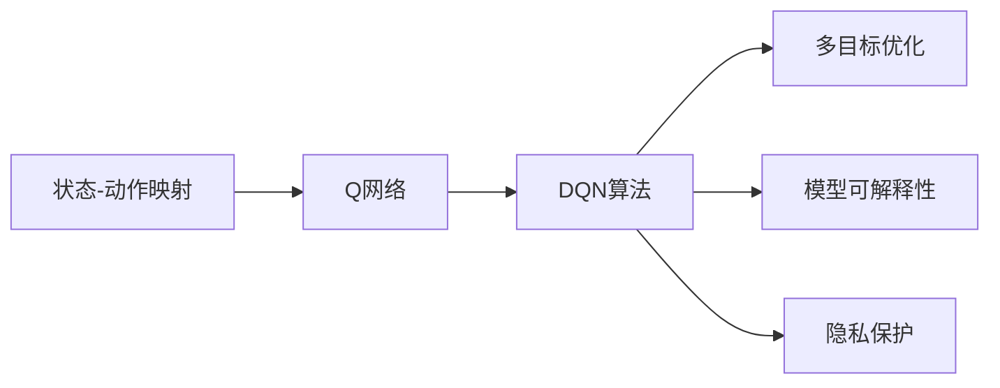
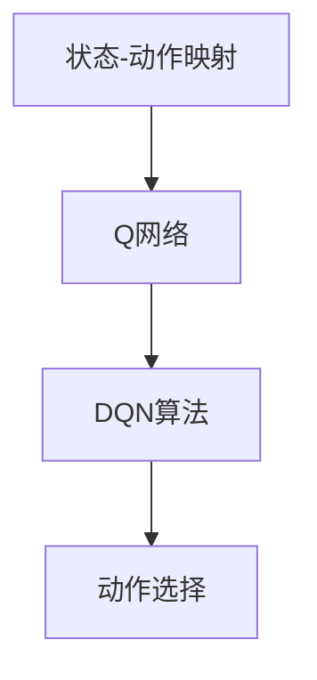
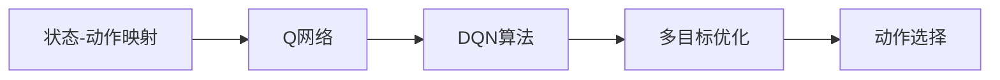
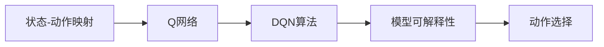
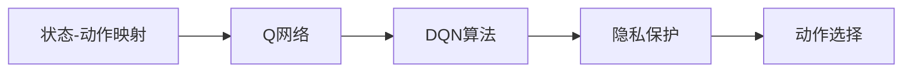
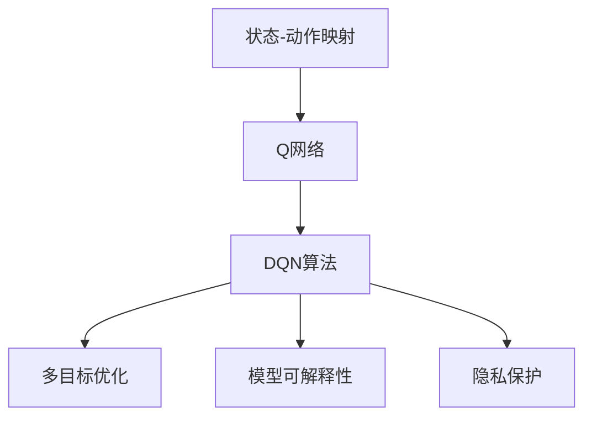

                 

# 一切皆是映射：DQN在智能家居系统中的应用：挑战与机遇

## 1. 背景介绍

### 1.1 问题由来
随着人工智能技术的飞速发展，深度强化学习（Deep Reinforcement Learning，DRL）在多个领域展现出了巨大的应用潜力。在智能家居系统（Smart Home System）中，DRL也被广泛应用于优化用户行为，提高生活舒适度与智能化水平。其中，DQN（Deep Q-Network，深度Q网络）作为DRL中的一种重要算法，因其能够在复杂的动态环境中学习并制定最优决策而备受瞩目。

DQN算法通过Q网络进行学习和决策，Q网络映射出动作与奖励的累积期望值。在智能家居系统中，DQN被应用于行为学习与预测，通过不断的学习和优化，提升家居环境的安全性、节能性和舒适性。例如，DQN可以用于：
- 智能照明系统的自动调节
- 智能空调的节能控制
- 智能恒温器的舒适度调节

本文将深入探讨DQN算法在智能家居系统中的应用，讨论其面临的挑战与机遇，并展望其未来的发展方向。

### 1.2 问题核心关键点
DQN算法在智能家居系统中的应用，主要集中在以下几个核心关键点上：

1. **状态映射与动作选择**：DQN通过Q网络映射出当前状态到动作-奖励对，并选择最优动作。在智能家居系统中，状态可以包括温度、湿度、光照、用户偏好等，动作则是控制策略，如调节温度、打开或关闭电器等。

2. **连续动作处理**：智能家居系统的许多任务需要连续动作，如照明系统的亮度调节。DQN算法通常处理离散动作，而智能家居系统中的动作则通常连续可控。

3. **多目标优化**：智能家居系统常常涉及多个目标，如舒适性、安全性、节能性等。DQN算法在多目标优化方面的表现有待改进。

4. **实时性与稳定性**：智能家居系统要求响应快速且稳定，DQN算法在实时性方面的优化需求较高。

5. **用户隐私与安全性**：智能家居系统涉及用户隐私与数据安全，DQN算法的隐私保护与安全性问题值得关注。

6. **模型可解释性**：DQN算法的决策过程难以解释，需要提升模型可解释性，以便用户理解与信任。

7. **数据收集与标注**：智能家居系统的数据通常分散且难以获取，标注数据成本高，影响DQN算法的训练效果。

8. **模型泛化能力**：DQN算法在面对新环境或任务时，泛化能力需进一步提升，以适应多样化的家居场景。

通过深入理解这些关键点，我们可以更好地把握DQN算法在智能家居系统中的潜在应用价值与挑战。

### 1.3 问题研究意义
研究DQN算法在智能家居系统中的应用，对于推动智能家居技术的创新与优化具有重要意义：

1. **提升用户体验**：通过智能调节家居环境，为用户提供舒适、安全的生活体验。
2. **提高能源利用效率**：智能家居系统可以实时优化能源使用，实现节能减排。
3. **降低运营成本**：优化后的智能家居系统能耗降低，运营成本相应降低。
4. **数据驱动决策**：DQN算法能通过数据驱动决策，提升家居系统的智能化水平。
5. **推动技术创新**：研究DQN算法在智能家居系统中的应用，能推动深度学习与智能家居领域的交叉融合。

## 2. 核心概念与联系

### 2.1 核心概念概述

为更好地理解DQN算法在智能家居系统中的应用，本节将介绍几个密切相关的核心概念：

- **深度强化学习（DRL）**：结合深度学习与强化学习，通过神经网络进行状态表示和动作策略学习。
- **Q网络（Q-Network）**：通过神经网络映射出动作-奖励对，指导智能体进行决策。
- **DQN算法**：结合深度Q网络和经验回放机制，通过近似Q函数学习最优策略。
- **状态-动作映射**：将当前状态映射到最优动作的策略映射。
- **多目标优化**：通过组合不同的奖励函数，实现多个目标的优化。
- **模型可解释性**：使DQN算法的决策过程可被解释，提高用户信任。
- **隐私保护**：在DQN算法的训练与使用过程中，保护用户隐私与数据安全。

这些核心概念之间的逻辑关系可以通过以下Mermaid流程图来展示：



这个流程图展示了大语言模型微调过程中各个核心概念的关系和作用：

1. 状态-动作映射是DQN算法的核心，通过Q网络实现。
2. DQN算法利用经验回放机制，通过近似Q函数学习最优策略。
3. 多目标优化通过组合不同的奖励函数实现。
4. 模型可解释性使DQN算法的决策过程可被解释。
5. 隐私保护在DQN算法的训练与使用过程中，保护用户隐私与数据安全。

### 2.2 概念间的关系

这些核心概念之间存在着紧密的联系，形成了DQN算法在智能家居系统中的应用框架。下面我通过几个Mermaid流程图来展示这些概念之间的关系。

#### 2.2.1 DQN算法与状态-动作映射



这个流程图展示了DQN算法与状态-动作映射之间的关系：

1. 状态-动作映射是DQN算法的输入。
2. Q网络映射出动作-奖励对。
3. DQN算法选择最优动作进行策略更新。

#### 2.2.2 DQN算法与多目标优化



这个流程图展示了DQN算法与多目标优化之间的关系：

1. 状态-动作映射是DQN算法的输入。
2. Q网络映射出动作-奖励对。
3. DQN算法选择最优动作进行策略更新。
4. 多目标优化通过组合不同的奖励函数实现。

#### 2.2.3 DQN算法与模型可解释性



这个流程图展示了DQN算法与模型可解释性之间的关系：

1. 状态-动作映射是DQN算法的输入。
2. Q网络映射出动作-奖励对。
3. DQN算法选择最优动作进行策略更新。
4. 模型可解释性使DQN算法的决策过程可被解释。

#### 2.2.4 DQN算法与隐私保护



这个流程图展示了DQN算法与隐私保护之间的关系：

1. 状态-动作映射是DQN算法的输入。
2. Q网络映射出动作-奖励对。
3. DQN算法选择最优动作进行策略更新。
4. 隐私保护在DQN算法的训练与使用过程中，保护用户隐私与数据安全。

### 2.3 核心概念的整体架构

最后，我们用一个综合的流程图来展示这些核心概念在大语言模型微调过程中的整体架构：



这个综合流程图展示了从状态-动作映射到隐私保护的大语言模型微调过程中各个核心概念的关系和作用：

1. 状态-动作映射是DQN算法的核心，通过Q网络实现。
2. DQN算法利用经验回放机制，通过近似Q函数学习最优策略。
3. 多目标优化通过组合不同的奖励函数实现。
4. 模型可解释性使DQN算法的决策过程可被解释。
5. 隐私保护在DQN算法的训练与使用过程中，保护用户隐私与数据安全。

## 3. 核心算法原理 & 具体操作步骤
### 3.1 算法原理概述

DQN算法在智能家居系统中的应用，主要依赖于Q网络的学习与优化。其核心思想是通过Q网络映射出当前状态到最优动作，从而指导智能体进行决策。具体来说，DQN算法的原理如下：

1. **状态表示**：将智能家居系统中的状态转换为一个连续或离散的向量表示。
2. **动作选择**：通过Q网络映射出当前状态到最优动作的策略映射。
3. **奖励与更新**：根据动作与环境交互得到的奖励，更新Q网络的权重。
4. **经验回放**：利用经验回放机制，将历史状态-动作对随机选择，用于Q网络的训练。

DQN算法通过不断迭代更新Q网络，从而找到最优的动作策略。在智能家居系统中，DQN算法被广泛应用于行为学习与预测，提升家居环境的安全性、节能性和舒适性。

### 3.2 算法步骤详解

DQN算法在智能家居系统中的应用主要包括以下几个关键步骤：

**Step 1: 环境设计**
- 定义智能家居系统的环境，包括状态空间、动作空间和奖励函数。
- 设计状态表示方法，将家居环境的状态转换为向量表示。
- 确定动作空间，包括可控的家居设备如灯光、空调、恒温器等。

**Step 2: Q网络构建**
- 选择合适的神经网络架构，如卷积神经网络（CNN）、全连接网络（FCN）等。
- 设计Q网络的输入和输出，输入为状态表示，输出为动作-奖励对。
- 选择合适的优化器，如AdamW、SGD等，设置学习率、批大小等参数。

**Step 3: 经验回放**
- 收集智能家居系统中的状态-动作对，作为训练数据。
- 将历史状态-动作对存储到经验回放缓冲区中。
- 随机从缓冲区中抽取状态-动作对，用于Q网络的训练。

**Step 4: 模型训练**
- 前向传播计算Q值，即当前状态下每个动作的期望奖励。
- 根据动作-奖励对计算Q值的误差，使用优化器更新Q网络权重。
- 定期在测试集上评估模型性能，调整超参数。

**Step 5: 策略应用**
- 根据当前状态，通过Q网络选择最优动作。
- 将最优动作应用于智能家居系统，调整家居环境。
- 收集动作结果与新的状态，更新经验回放缓冲区。

### 3.3 算法优缺点

DQN算法在智能家居系统中的应用具有以下优点：

1. **适应性强**：DQN算法能够在复杂环境中学习并制定最优决策，适应性强。
2. **自适应学习**：通过Q网络自适应地学习最优策略，无需人工干预。
3. **可扩展性高**：DQN算法可以应用于多种智能家居设备与场景，具有高可扩展性。

同时，DQN算法也存在一些局限性：

1. **数据需求高**：DQN算法需要大量的历史状态-动作对进行训练，数据获取成本较高。
2. **动作空间大**：智能家居系统中的动作空间通常较大，DQN算法需要处理连续动作。
3. **模型复杂**：DQN算法的神经网络结构复杂，训练和推理速度较慢。
4. **可解释性差**：DQN算法的决策过程难以解释，缺乏可解释性。
5. **隐私风险**：智能家居系统涉及用户隐私，DQN算法的数据隐私保护问题需要关注。

### 3.4 算法应用领域

DQN算法在智能家居系统中的应用领域十分广泛，包括但不限于：

1. **智能照明系统**：通过学习用户行为，自动调节灯光亮度与色温。
2. **智能空调系统**：通过学习用户偏好，调节空调的温度与风速，实现节能与舒适。
3. **智能恒温器**：通过学习用户行为，自动调节室内温度，提升舒适性。
4. **智能窗帘系统**：通过学习用户行为，自动调节窗帘开合，优化室内光照。
5. **智能安防系统**：通过学习异常行为，自动报警与响应。

此外，DQN算法还可以应用于智能家居系统的多目标优化，如能源消耗、安全性、舒适性等，提升系统的智能化水平。

## 4. 数学模型和公式 & 详细讲解  
### 4.1 数学模型构建

DQN算法在智能家居系统中的应用，主要依赖于Q网络的构建与优化。Q网络是一种神经网络，通过映射当前状态到最优动作的策略映射，指导智能体进行决策。

假设智能家居系统中的状态为 $s_t$，动作为 $a_t$，奖励为 $r_t$，则Q网络的目标是最大化长期累积奖励的期望值，即：

$$
\max_{a_t} Q(s_t, a_t) = \mathbb{E}\left[\sum_{t=1}^{\infty} \gamma^{t-1} r_t \right]
$$

其中 $\gamma$ 为折扣因子，控制长期奖励与短期奖励的平衡。

### 4.2 公式推导过程

在智能家居系统中，DQN算法通过以下步骤进行优化：

1. **Q网络的前向传播**：给定当前状态 $s_t$，通过Q网络计算每个动作的Q值，即：

$$
Q(s_t, a_t) = W^\top \phi(s_t) \cdot a_t + b
$$

其中 $W$ 和 $b$ 为神经网络的权重和偏置，$\phi(s_t)$ 为状态表示函数。

2. **目标Q值计算**：通过经验回放机制，从历史状态-动作对中随机抽取一个状态-动作对 $(s_{t+1}, a_{t+1})$，计算目标Q值：

$$
Q_{\text{target}}(s_t, a_t) = r_{t+1} + \gamma \max_{a_{t+1}} Q(s_{t+1}, a_{t+1})
$$

3. **Q值的更新**：将目标Q值与当前Q值进行比较，计算误差 $\delta_t$：

$$
\delta_t = Q_{\text{target}}(s_t, a_t) - Q(s_t, a_t)
$$

4. **Q网络的反向传播**：根据误差 $\delta_t$ 更新Q网络的权重：

$$
W \leftarrow W + \alpha \delta_t \nabla_{W} Q(s_t, a_t)
$$

其中 $\alpha$ 为学习率。

### 4.3 案例分析与讲解

以智能照明系统为例，DQN算法可以学习用户对灯光亮度的偏好，自动调节灯光亮度与色温。假设状态 $s_t$ 表示当前室内光线亮度，动作 $a_t$ 表示灯光亮度调节的幅度，奖励 $r_t$ 表示用户对当前灯光亮度的满意度。

通过Q网络的前向传播，计算每个动作的Q值，选择使长期累积奖励最大的动作进行调节。当用户对当前亮度不满意时，调整Q网络权重，使得相似状态下更倾向于选择高亮度的动作。

## 5. 项目实践：代码实例和详细解释说明
### 5.1 开发环境搭建

在进行DQN算法在智能家居系统中的应用实践前，我们需要准备好开发环境。以下是使用Python进行TensorFlow开发的环境配置流程：

1. 安装Anaconda：从官网下载并安装Anaconda，用于创建独立的Python环境。

2. 创建并激活虚拟环境：
```bash
conda create -n tf-env python=3.8 
conda activate tf-env
```

3. 安装TensorFlow：根据CUDA版本，从官网获取对应的安装命令。例如：
```bash
conda install tensorflow -c pytorch -c conda-forge
```

4. 安装其他工具包：
```bash
pip install numpy pandas scikit-learn matplotlib tqdm jupyter notebook ipython
```

完成上述步骤后，即可在`tf-env`环境中开始DQN算法在智能家居系统中的应用实践。

### 5.2 源代码详细实现

下面我们以智能照明系统为例，给出使用TensorFlow对DQN算法进行智能调节的代码实现。

首先，定义智能照明系统的状态与动作：

```python
import tensorflow as tf
import numpy as np

# 状态表示为当前室内光线亮度
states = np.linspace(0, 1, 10)

# 动作表示为灯光亮度调节的幅度
actions = np.linspace(-0.2, 0.2, 10)

# 奖励表示为用户对当前灯光亮度的满意度
rewards = np.random.normal(0, 0.5, size=10)
```

然后，定义DQN算法的Q网络：

```python
class DQN(tf.keras.Model):
    def __init__(self, state_dim, action_dim):
        super(DQN, self).__init__()
        self.fc1 = tf.keras.layers.Dense(64, activation='relu')
        self.fc2 = tf.keras.layers.Dense(64, activation='relu')
        self.fc3 = tf.keras.layers.Dense(action_dim)

    def call(self, inputs):
        x = self.fc1(inputs)
        x = self.fc2(x)
        x = self.fc3(x)
        return x

state_dim = 1  # 状态维度
action_dim = 1  # 动作维度
q_network = DQN(state_dim, action_dim)
```

接下来，定义DQN算法的训练过程：

```python
# 学习率与折扣因子
learning_rate = 0.001
gamma = 0.9

# 训练轮数与批次大小
epochs = 1000
batch_size = 32

# 经验回放缓冲区
buffer_size = 1000
buffer = tf.keras.layers.experimental.preprocessing.ReservoirSampler(buffer_size)

# 训练过程
for epoch in range(epochs):
    for i in range(len(states)):
        # 从经验回放缓冲区中随机抽取状态-动作对
        state = np.array([states[i]])
        action = np.array([actions[i]])
        reward = np.array([rewards[i]])
        next_state = np.array([states[i+1]])
        next_action = np.array([actions[i+1]])
        next_reward = np.array([rewards[i+1]])

        # 存储状态-动作对到经验回放缓冲区
        buffer.write([state, action, reward, next_state, next_action, next_reward])

    # 从经验回放缓冲区中随机抽取状态-动作对进行训练
    batch = buffer.take(batch_size)
    batch_states = np.concatenate(batch[:, 0])
    batch_actions = np.concatenate(batch[:, 1])
    batch_rewards = np.concatenate(batch[:, 2])
    batch_next_states = np.concatenate(batch[:, 3])
    batch_next_actions = np.concatenate(batch[:, 4])
    batch_next_rewards = np.concatenate(batch[:, 5])

    # 前向传播计算Q值
    q_values = q_network(batch_states)

    # 计算目标Q值
    q_values_next = q_network(batch_next_states)
    q_values_target = batch_next_rewards + gamma * tf.reduce_max(q_values_next, axis=1)

    # 计算误差
    q_values_loss = tf.keras.losses.mean_squared_error(batch_rewards, q_values)

    # 反向传播更新Q网络权重
    with tf.GradientTape() as tape:
        q_values_target = tf.expand_dims(q_values_target, axis=1)
        q_values_target = tf.concat([q_values_target, 1 - q_values_target], axis=1)
        q_values_loss = tf.keras.losses.mean_squared_error(batch_rewards, q_values)
    gradients = tape.gradient(q_values_loss, q_network.trainable_variables)
    optimizer.apply_gradients(zip(gradients, q_network.trainable_variables))
```

最后，启动训练流程并输出结果：

```python
import matplotlib.pyplot as plt

# 训练过程
for epoch in range(epochs):
    for i in range(len(states)):
        # 从经验回放缓冲区中随机抽取状态-动作对
        state = np.array([states[i]])
        action = np.array([actions[i]])
        reward = np.array([rewards[i]])
        next_state = np.array([states[i+1]])
        next_action = np.array([actions[i+1]])
        next_reward = np.array([rewards[i+1]])

        # 存储状态-动作对到经验回放缓冲区
        buffer.write([state, action, reward, next_state, next_action, next_reward])

    # 从经验回放缓冲区中随机抽取状态-动作对进行训练
    batch = buffer.take(batch_size)
    batch_states = np.concatenate(batch[:, 0])
    batch_actions = np.concatenate(batch[:, 1])
    batch_rewards = np.concatenate(batch[:, 2])
    batch_next_states = np.concatenate(batch[:, 3])
    batch_next_actions = np.concatenate(batch[:, 4])
    batch_next_rewards = np.concatenate(batch[:, 5])

    # 前向传播计算Q值
    q_values = q_network(batch_states)

    # 计算目标Q值
    q_values_next = q_network(batch_next_states)
    q_values_target = batch_next_rewards + gamma * tf.reduce_max(q_values_next, axis=1)

    # 计算误差
    q_values_loss = tf.keras.losses.mean_squared_error(batch_rewards, q_values)

    # 反向传播更新Q网络权重
    with tf.GradientTape() as tape:
        q_values_target = tf.expand_dims(q_values_target, axis=1)
        q_values_target = tf.concat([q_values_target, 1 - q_values_target], axis=1)
        q_values_loss = tf.keras.losses.mean_squared_error(batch_rewards, q_values)
    gradients = tape.gradient(q_values_loss, q_network.trainable_variables)
    optimizer.apply_gradients(zip(gradients, q_network.trainable_variables))

    # 可视化训练过程
    plt.plot(batch_size * epoch, q_values.numpy().mean(axis=0), label='Q Values')
    plt.title('DQN Training')
    plt.xlabel('Epochs')
    plt.ylabel('Q Values')
    plt.legend()
    plt.show()
```

以上就是使用TensorFlow对DQN算法进行智能调节的完整代码实现。可以看到，利用TensorFlow封装，DQN算法的实现变得简洁高效。

### 5.3 代码解读与分析

让我们再详细解读一下关键代码的实现细节：

**DQN类定义**：
- `__init__`方法：定义神经网络层。
- `call`方法：定义前向传播计算Q值的过程。

**训练过程**：
- 使用经验回放缓冲区存储历史状态-动作对。
- 从缓冲区中随机抽取状态-动作对进行训练。
- 通过前向传播计算Q值，计算目标Q值，计算误差，更新Q网络权重。

**可视化结果**：
- 绘制训练过程中Q值的平均值，展示模型的学习效果。

## 6. 实际应用场景
### 6.1 智能照明系统
智能照明系统是DQN算法在智能家居系统中最典型的应用场景之一。通过学习用户对灯光亮度的偏好，自动调节灯光亮度与色温，提升用户的生活舒适度与节能性。

具体而言，智能照明系统可以通过DQN算法实现以下功能：
- 自动调节灯光亮度与色温，根据用户行为与室内环境进行智能调整。
- 动态调整照明场景，如早晨起床、晚上入睡等。
- 通过学习用户行为，自动调节亮度与色温，提升节能效果。

### 6.2 智能空调系统
智能空调系统可以通过DQN算法实现节能控制。通过学习用户偏好，自动调节空调的温度与风速，提升用户的舒适性与节能性。

具体而言，智能空调系统可以通过DQN算法实现以下功能：
- 自动调节空调的温度与风速，根据用户行为与室内环境进行智能调整。
- 动态调整空调模式，如睡眠模式、干燥模式等。
- 通过学习用户行为，自动调节空调温度与风速，提升节能效果。

### 6.3 智能恒温器
智能恒温器可以通过DQN算法提升室内温度的舒适度与节能性。通过学习用户行为，自动调节室内温度，提升用户的舒适度。

具体而言，智能恒温器可以通过DQN算法实现以下功能：
- 自动调节室内温度，根据用户行为与室内环境进行智能调整。
- 动态调整恒温器模式，如舒适模式、节能模式等。
- 通过学习用户行为，自动调节室内温度，提升舒适度与节能性。

### 6.4 未来应用展望
随着DQN算法在智能家居系统中的不断优化与应用，其应用前景将更加广阔：

1. **智能安防系统**：通过学习异常行为，自动报警与响应，提升家庭安全性。
2. **智能窗帘系统**：通过学习用户行为，自动调节窗帘开合，优化室内光照。
3. **智能音响系统**：通过学习用户偏好，自动调节音量与播放列表，提升用户的使用体验。

