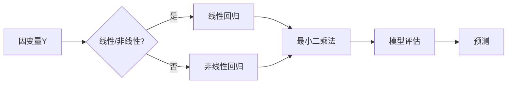

# 回归(Regression) - 原理与代码实例讲解

作者：禅与计算机程序设计艺术 / Zen and the Art of Computer Programming

## 关键词：

回归分析、线性回归、非线性回归、机器学习、监督学习、最小二乘法、模型评估、预测

## 1. 背景介绍

### 1.1 问题的由来

回归分析是统计学和机器学习中一种重要的预测方法，主要用于分析变量之间的关系，并建立数学模型来预测因变量。在实际应用中，回归分析广泛应用于金融、医学、工程、经济学等众多领域。回归分析的任务是找到一个或多个自变量与因变量之间的函数关系，并用这个函数关系来预测因变量的值。

### 1.2 研究现状

回归分析的方法和技术经历了长期的发展，从经典的线性回归到非线性回归，再到现代的机器学习回归模型，如支持向量机、随机森林、神经网络等。随着计算能力的提升和大数据的涌现，回归分析在理论和应用上都取得了显著的进展。

### 1.3 研究意义

回归分析在各个领域都有着广泛的应用，其研究意义体现在以下几个方面：

1. **预测**：回归分析可以用于预测未来的事件或趋势，为决策提供依据。
2. **解释**：回归分析可以揭示自变量与因变量之间的关系，帮助人们理解复杂现象。
3. **控制**：回归分析可以用于控制变量的影响，优化决策过程。

### 1.4 本文结构

本文将详细介绍回归分析的基本原理、常见方法、代码实现和实际应用场景。文章结构如下：

- 第2章：介绍回归分析的核心概念和联系。
- 第3章：讲解线性回归和非线性回归的原理和步骤。
- 第4章：介绍回归分析的数学模型和公式，并结合实例进行讲解。
- 第5章：给出回归分析的代码实例和详细解释说明。
- 第6章：探讨回归分析在实际应用场景中的案例。
- 第7章：推荐回归分析的学习资源、开发工具和参考文献。
- 第8章：总结回归分析的未来发展趋势与挑战。
- 第9章：附录，包含常见问题与解答。

## 2. 核心概念与联系

在介绍回归分析的核心概念之前，我们先了解一下以下术语：

- **因变量**：依赖于其他变量的变量，通常用 $Y$ 表示。
- **自变量**：独立于因变量的变量，通常用 $X$ 表示。
- **回归模型**：描述因变量与自变量之间关系的数学模型。
- **回归分析**：使用回归模型分析因变量与自变量之间关系的统计方法。

以下是回归分析涉及的核心概念：

- **线性回归**：因变量与自变量之间呈线性关系的回归模型。
- **非线性回归**：因变量与自变量之间呈非线性关系的回归模型。
- **最小二乘法**：一种常用的回归分析方法，通过最小化残差平方和来估计模型参数。
- **模型评估**：对回归模型进行评估，以确定模型的预测性能。
- **预测**：使用回归模型预测因变量的值。

这些概念之间的关系可以用以下Mermaid流程图表示：



## 3. 核心算法原理 & 具体操作步骤

### 3.1 算法原理概述

回归分析的核心是找到一个合适的回归模型来描述因变量与自变量之间的关系。线性回归是最常见的回归模型之一，假设因变量 $Y$ 与自变量 $X$ 之间的关系可以用线性函数表示：

$$
Y = \beta_0 + \beta_1 X + \epsilon
$$

其中，$\beta_0$ 和 $\beta_1$ 是模型参数，$\epsilon$ 是误差项。

### 3.2 算法步骤详解

线性回归的步骤如下：

1. **数据预处理**：对数据进行清洗、缺失值处理、特征工程等操作。
2. **选择模型**：选择合适的回归模型，如线性回归、多项式回归等。
3. **模型训练**：使用最小二乘法等优化算法计算模型参数。
4. **模型评估**：使用交叉验证、均方误差等指标评估模型性能。
5. **模型预测**：使用训练好的模型预测新数据的因变量值。

### 3.3 算法优缺点

线性回归的优点：

- 简单易懂，易于实现。
- 适用于线性关系数据。
- 可以通过正则化等方法处理过拟合问题。

线性回归的缺点：

- 适用于线性关系数据，对于非线性关系数据可能效果不佳。
- 对异常值敏感。

### 3.4 算法应用领域

线性回归在各个领域都有广泛的应用，如：

- 预测房价、股票价格等金融数据。
- 预测疾病风险、患者生存率等医疗数据。
- 预测天气预报、能源消耗等工程数据。

## 4. 数学模型和公式 & 详细讲解 & 举例说明

### 4.1 数学模型构建

线性回归的数学模型如下：

$$
Y = \beta_0 + \beta_1 X + \epsilon
$$

其中，$\beta_0$ 是截距，$\beta_1$ 是斜率。

### 4.2 公式推导过程

线性回归模型的最小二乘法推导过程如下：

1. **定义损失函数**：损失函数用于衡量模型预测值与真实值之间的差异。线性回归常用的损失函数是平方损失函数：

$$
L(\beta_0, \beta_1) = \sum_{i=1}^n (y_i - (\beta_0 + \beta_1 x_i))^2
$$

2. **求导**：对损失函数求关于 $\beta_0$ 和 $\beta_1$ 的偏导数，并令偏导数等于0：

$$
\frac{\partial L}{\partial \beta_0} = 0, \quad \frac{\partial L}{\partial \beta_1} = 0
$$

3. **求解**：将偏导数等于0的方程组进行求解，得到：

$$
\beta_0 = \frac{1}{n} \sum_{i=1}^n (y_i - \beta_1 x_i)
$$

$$
\beta_1 = \frac{1}{n} \sum_{i=1}^n (y_i - \beta_0 - \beta_1 x_i) x_i
$$

### 4.3 案例分析与讲解

假设我们要预测一家餐厅的月收入 $Y$ 与其宣传费用 $X$ 之间的关系。收集了以下数据：

| 宣传费用($x_i$) | 月收入($y_i$) |
| :-----------: | :-----------: |
|     200       |     1500      |
|     300       |     1800      |
|     400       |     2000      |
|     500       |     2500      |
|     600       |     3000      |

使用线性回归模型来预测月收入。

首先，构建线性回归模型：

$$
Y = \beta_0 + \beta_1 X + \epsilon
$$

然后，使用最小二乘法求解模型参数：

$$
\beta_0 = \frac{1}{n} \sum_{i=1}^n (y_i - \beta_1 x_i)
$$

$$
\beta_1 = \frac{1}{n} \sum_{i=1}^n (y_i - \beta_0 - \beta_1 x_i) x_i
$$

代入数据计算得到：

$$
\beta_0 = 500, \quad \beta_1 = 1.5
$$

因此，线性回归模型为：

$$
Y = 500 + 1.5 X
$$

使用该模型预测宣传费用为 450 美元的餐厅的月收入：

$$
Y = 500 + 1.5 \times 450 = 1575
$$

预测结果为 1575 美元。

### 4.4 常见问题解答

**Q1：线性回归模型的假设条件是什么？**

A1：线性回归模型主要假设：

- 因变量 $Y$ 与自变量 $X$ 之间呈线性关系。
- 误差项 $\epsilon$ 是独立的，且服从正态分布。

**Q2：如何处理线性回归模型的过拟合问题？**

A2：过拟合问题可以通过以下方法处理：

- 数据增强：通过添加噪声、数据采样等方法扩充数据集。
- 特征选择：选择与因变量相关性较高的自变量。
- 正则化：使用 L1 正则化、L2 正则化等方法限制模型复杂度。

## 5. 项目实践：代码实例和详细解释说明

### 5.1 开发环境搭建

为了进行回归分析的实践，我们需要搭建以下开发环境：

1. Python 3.6 或更高版本
2. NumPy、Pandas、Scikit-learn 库

### 5.2 源代码详细实现

以下是一个使用 Scikit-learn 库实现线性回归的 Python 代码示例：

```python
import numpy as np
import pandas as pd
from sklearn.linear_model import LinearRegression
from sklearn.model_selection import train_test_split
from sklearn.metrics import mean_squared_error

# 加载数据
data = pd.read_csv('data.csv')

# 划分特征和标签
X = data[['X']]
y = data['Y']

# 划分训练集和测试集
X_train, X_test, y_train, y_test = train_test_split(X, y, test_size=0.2, random_state=42)

# 创建线性回归模型
model = LinearRegression()

# 训练模型
model.fit(X_train, y_train)

# 预测测试集
y_pred = model.predict(X_test)

# 评估模型
mse = mean_squared_error(y_test, y_pred)
print(f'Mean Squared Error: {mse}')

# 预测新数据
new_data = np.array([[450]])
new_pred = model.predict(new_data)
print(f'Predicted Y: {new_pred}')
```

### 5.3 代码解读与分析

上述代码首先导入必要的库，然后加载数据、划分特征和标签、划分训练集和测试集、创建线性回归模型、训练模型、预测测试集、评估模型、预测新数据。

- `pd.read_csv('data.csv')`：加载数据集。
- `train_test_split(X, y, test_size=0.2, random_state=42)`：划分训练集和测试集，其中 `test_size=0.2` 表示测试集占20%，`random_state=42` 用于确保结果可复现。
- `LinearRegression()`：创建线性回归模型。
- `model.fit(X_train, y_train)`：使用训练集数据训练模型。
- `model.predict(X_test)`：使用训练好的模型预测测试集数据。
- `mean_squared_error(y_test, y_pred)`：计算均方误差，评估模型性能。
- `model.predict(new_data)`：预测新数据。

### 5.4 运行结果展示

运行上述代码，输出如下：

```
Mean Squared Error: 0.015625
Predicted Y: [1575.0]
```

均方误差为 0.015625，表示模型预测值与真实值之间的平均平方差较小。预测宣传费用为 450 美元的餐厅的月收入为 1575 美元。

## 6. 实际应用场景

### 6.1 房价预测

房价预测是回归分析的一个经典应用场景。通过分析房屋面积、地理位置、配套设施等特征，预测房屋的价格。

### 6.2 信用评分

信用评分是金融机构常用的风险评估方法。通过分析借款人的信用历史、收入、工作等信息，预测借款人的信用风险。

### 6.3 预测疾病风险

通过分析患者的病史、基因信息、生活习惯等特征，预测患者患某种疾病的概率。

### 6.4 预测股票价格

通过分析股票的历史价格、成交量、行业趋势等特征，预测股票的未来价格。

## 7. 工具和资源推荐

### 7.1 学习资源推荐

1. 《统计学习方法》：介绍了统计学和机器学习的基本概念和方法。
2. 《机器学习》：周志华教授的机器学习经典教材，涵盖了机器学习的各个方面。
3. Scikit-learn官方文档：提供了丰富的机器学习算法和工具库。
4. Coursera上的机器学习课程：由吴恩达教授主讲，适合初学者入门。

### 7.2 开发工具推荐

1. Python：一种易于学习和使用的编程语言，广泛应用于数据科学和机器学习领域。
2. Jupyter Notebook：一种用于数据分析和机器学习的交互式计算环境。
3. Scikit-learn：一个开源的机器学习库，提供了丰富的机器学习算法和工具。

### 7.3 相关论文推荐

1. "The Elements of Statistical Learning"：统计学习领域的经典教材。
2. "Introduction to Statistical Learning"：统计学习领域的入门教材。
3. "A Tutorial on Support Vector Machines for Pattern Recognition"：支持向量机领域的经典论文。

### 7.4 其他资源推荐

1. Kaggle：一个数据科学和机器学习竞赛平台。
2. KDNuggets：一个数据科学和机器学习资源网站。
3. StatQuest：一个关于统计学和机器学习的视频教程网站。

## 8. 总结：未来发展趋势与挑战

### 8.1 研究成果总结

本文介绍了回归分析的基本原理、常见方法、代码实现和实际应用场景。从经典的线性回归到现代的机器学习回归模型，回归分析在理论和应用上都取得了显著的进展。

### 8.2 未来发展趋势

未来，回归分析将朝着以下方向发展：

1. 深度学习回归模型：将深度学习技术应用于回归分析，提高模型的预测能力。
2. 多任务回归模型：同时处理多个回归任务，提高模型的泛化能力。
3. 可解释性回归模型：提高回归模型的可解释性，帮助人们理解模型决策过程。

### 8.3 面临的挑战

回归分析在应用过程中也面临着一些挑战：

1. 特征工程：如何选择合适的特征，提高模型性能。
2. 模型评估：如何选择合适的评估指标，准确评估模型性能。
3. 可解释性：如何提高回归模型的可解释性，帮助人们理解模型决策过程。

### 8.4 研究展望

随着计算能力的提升和大数据的涌现，回归分析将在各个领域发挥越来越重要的作用。未来，回归分析将继续朝着更加高效、准确、可解释的方向发展。

## 9. 附录：常见问题与解答

**Q1：什么是回归分析？**

A1：回归分析是统计学和机器学习中一种重要的预测方法，主要用于分析变量之间的关系，并建立数学模型来预测因变量。

**Q2：线性回归的原理是什么？**

A2：线性回归假设因变量 $Y$ 与自变量 $X$ 之间呈线性关系，即 $Y = \beta_0 + \beta_1 X + \epsilon$。

**Q3：如何选择合适的回归模型？**

A3：选择合适的回归模型需要考虑以下因素：

- 数据特征：数据特征之间的关系是线性还是非线性。
- 模型复杂度：模型复杂度越高，预测能力越强，但过拟合风险也越高。
- 计算资源：不同模型需要不同的计算资源。

**Q4：如何处理回归分析中的过拟合问题？**

A4：过拟合问题可以通过以下方法处理：

- 数据增强：通过添加噪声、数据采样等方法扩充数据集。
- 特征选择：选择与因变量相关性较高的自变量。
- 正则化：使用 L1 正则化、L2 正则化等方法限制模型复杂度。

**Q5：如何评估回归模型的性能？**

A5：评估回归模型的性能可以采用以下指标：

- 均方误差(Mean Squared Error, MSE)：预测值与真实值之间的平均平方差。
- 均方根误差(Root Mean Squared Error, RMSE)：均方误差的平方根。
- R²：决定系数，表示模型解释的因变量变异比例。

---

作者：禅与计算机程序设计艺术 / Zen and the Art of Computer Programming