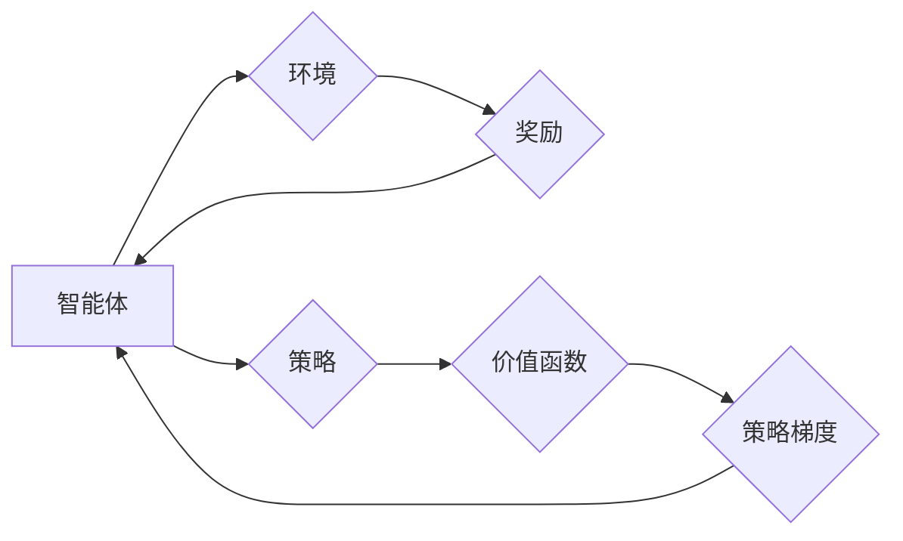

# 强化学习：在无人驾驶中的应用

作者：禅与计算机程序设计艺术 / Zen and the Art of Computer Programming

## 1. 背景介绍

### 1.1 问题的由来

随着人工智能技术的飞速发展，无人驾驶汽车成为了当前科技领域的热点之一。无人驾驶技术不仅能够极大提高道路行驶的安全性，还能有效缓解交通拥堵、降低能耗，具有巨大的社会和经济价值。然而，无人驾驶汽车的实现面临着诸多挑战，其中最具挑战性的问题之一是决策问题。无人驾驶汽车需要在复杂多变的道路环境中，根据周围环境信息做出正确的行驶决策，以实现安全、高效的行驶。

### 1.2 研究现状

近年来，强化学习作为人工智能领域的重要技术，为解决无人驾驶中的决策问题提供了新的思路。强化学习通过智能体与环境的交互，不断学习如何最大化累积奖励，从而在复杂环境中做出最优决策。在无人驾驶领域，强化学习已经被成功应用于路径规划、避障、车辆控制等方面，取得了显著的成果。

### 1.3 研究意义

研究强化学习在无人驾驶中的应用，具有重要的理论意义和实际应用价值：

1. **理论意义**：强化学习为解决无人驾驶中的决策问题提供了新的研究思路和方法，推动了人工智能领域的理论发展。

2. **实际应用价值**：基于强化学习的无人驾驶技术能够提高行驶安全性，降低交通事故发生率，缓解交通拥堵，实现绿色出行。

### 1.4 本文结构

本文将围绕强化学习在无人驾驶中的应用展开，主要内容包括：

- 核心概念与联系
- 核心算法原理与具体操作步骤
- 数学模型和公式
- 项目实践：代码实例和详细解释说明
- 实际应用场景
- 工具和资源推荐
- 未来发展趋势与挑战

## 2. 核心概念与联系

为了更好地理解强化学习在无人驾驶中的应用，以下介绍几个核心概念及其相互联系：

- **强化学习**：一种基于奖励和惩罚信号进行决策的学习方法。智能体通过与环境的交互，不断学习如何最大化累积奖励，从而在复杂环境中做出最优决策。

- **无人驾驶汽车**：一种能够自主行驶的汽车，无需人工干预。

- **环境**：无人驾驶汽车所处的道路环境，包括道路、车辆、行人、交通信号等。

- **智能体**：执行特定任务的实体，如无人驾驶汽车。

- **奖励**：环境对智能体的行为给予的反馈，可以是正的（如成功避障）、负的（如发生碰撞）或中性的。

- **策略**：智能体在给定状态下采取的行为。

- **价值函数**：表示智能体在给定状态和策略下获得期望奖励的函数。

- **策略梯度**：表示智能体在给定策略下对状态和动作的梯度。

这些概念之间的逻辑关系如下所示：



## 3. 核心算法原理 & 具体操作步骤

### 3.1 算法原理概述

强化学习在无人驾驶中的应用主要基于以下几种算法：

- **Q学习**：通过学习Q函数，直接估计智能体在给定状态和动作下获得的最大累积奖励。

- **深度Q网络（DQN）**：将Q学习算法与深度神经网络相结合，通过神经网络来近似Q函数。

- **策略梯度方法**：直接学习最优策略，而非Q函数。

### 3.2 算法步骤详解

以下以DQN算法为例，介绍强化学习在无人驾驶中的应用步骤：

1. **定义环境**：构建无人驾驶环境，包括道路、车辆、行人、交通信号等。

2. **定义状态空间和动作空间**：根据无人驾驶任务需求，定义状态空间和动作空间。

3. **初始化Q网络**：使用随机权重初始化Q网络。

4. **训练过程**：
   - 随机初始化智能体在环境中的初始状态。
   - 根据当前状态，智能体从动作空间中选择一个动作。
   - 执行选择动作，与环境交互，获得奖励和下一个状态。
   - 使用经验回放和目标网络，更新Q网络权重。
   - 重复上述步骤，直到满足预设的训练轮数或性能指标。

5. **测试过程**：
   - 使用训练好的Q网络进行测试，评估无人驾驶汽车在复杂道路环境中的行驶性能。

### 3.3 算法优缺点

**DQN算法**的优点：

- **泛化能力强**：通过神经网络近似Q函数，DQN能够处理高维状态空间和动作空间，适用于复杂的无人驾驶任务。

- **易于实现**：DQN算法相对简单，易于实现和部署。

**DQN算法**的缺点：

- **样本效率低**：DQN算法需要大量的样本数据进行训练，导致训练过程耗时较长。

- **容易陷入局部最优**：DQN算法容易陷入局部最优解，难以找到全局最优解。

### 3.4 算法应用领域

DQN算法在无人驾驶领域的应用主要包括以下方面：

- **路径规划**：根据道路环境信息，规划无人驾驶汽车的行驶路径。

- **避障**：检测周围障碍物，并采取相应的避障措施。

- **车辆控制**：控制无人驾驶汽车的转向、加速和制动。

- **交通信号识别**：识别道路上的交通信号，并采取相应的行驶策略。

## 4. 数学模型和公式 & 详细讲解 & 举例说明

### 4.1 数学模型构建

以下以DQN算法为例，介绍强化学习在无人驾驶中的数学模型构建。

假设状态空间为 $S$，动作空间为 $A$，奖励空间为 $R$。Q网络为 $Q(\cdot,\cdot;\theta)$，其中 $\theta$ 为Q网络的参数。

Q函数定义为：

$$
Q(s,a;\theta) = \mathbb{E}\left[ \sum_{t=0}^\infty \gamma^t r_t | s_0=s, a_0=a \right]
$$

其中，$\gamma$ 为折扣因子，表示对未来奖励的折现。

### 4.2 公式推导过程

以下以DQN算法为例，介绍Q函数的推导过程。

假设智能体在状态 $s$ 下采取动作 $a$，获得奖励 $r$，并进入状态 $s'$。则Q函数的递推公式为：

$$
Q(s,a;\theta) = \mathbb{E}\left[ \sum_{t=0}^\infty \gamma^t r_t | s_0=s, a_0=a \right]
= \mathbb{E}\left[ r + \gamma \sum_{t=1}^\infty \gamma^{t-1} r_{t+1} | s_0=s, a_0=a \right]
= \mathbb{E}\left[ r + \gamma Q(s',\pi(a'|s');\theta) | s_0=s, a_0=a \right]
$$

其中，$\pi(a'|s';\theta)$ 为在状态 $s'$ 下采取动作 $a'$ 的策略。

### 4.3 案例分析与讲解

以下以无人驾驶路径规划为例，介绍DQN算法的应用。

假设无人驾驶汽车在道路上的位置可以用一个二维坐标表示，状态空间 $S$ 为所有可能的坐标点集合。动作空间 $A$ 为无人驾驶汽车可采取的行动，如前进、后退、左转、右转等。

在此场景下，DQN算法的目标是学习一个策略 $\pi(a|s)$，使得无人驾驶汽车能够在道路上安全行驶。

### 4.4 常见问题解答

**Q1：如何解决样本效率低的问题？**

A：为了提高样本效率，可以采用以下方法：

- 使用经验回放：将智能体与环境交互的经验存储到经验池中，然后从经验池中随机采样进行训练，避免对过去样本的重复利用。

- 使用优先级采样：根据样本的重要性对经验进行排序，优先采样重要性高的样本进行训练。

- 使用多智能体强化学习：同时训练多个智能体，共享经验池，提高样本利用效率。

**Q2：如何解决局部最优的问题？**

A：为了解决局部最优问题，可以采用以下方法：

- 使用多种优化算法：尝试多种不同的优化算法，如Adam、RMSprop等，寻找更好的优化解。

- 使用探索策略：在训练过程中，使用epsilon-greedy策略，随机选择一些动作进行探索，避免陷入局部最优。

## 5. 项目实践：代码实例和详细解释说明

### 5.1 开发环境搭建

为了实现强化学习在无人驾驶中的应用，需要搭建以下开发环境：

- Python环境：Python 3.x

- 深度学习框架：TensorFlow或PyTorch

- 无人驾驶环境：Carla、AirSim等

- 代码编辑器：PyCharm、VSCode等

### 5.2 源代码详细实现

以下以Carla无人驾驶环境为例，展示使用PyTorch实现DQN算法的源代码。

```python
import torch
import torch.nn as nn
import torch.optim as optim

class DQN(nn.Module):
    def __init__(self, input_dim, output_dim):
        super(DQN, self).__init__()
        self.fc1 = nn.Linear(input_dim, 256)
        self.fc2 = nn.Linear(256, output_dim)

    def forward(self, x):
        x = torch.relu(self.fc1(x))
        x = self.fc2(x)
        return x

def train_dqn(dqn_model, optimizer, criterion, episodes, episodes_limit, epsilon, target_model):
    for episode in range(episodes):
        if epsilon < episodes_limit:
            epsilon *= 0.9995
            epsilon = max(epsilon, 0.01)
        state = env.reset()
        done = False
        while not done:
            action = choose_action(dqn_model, state, epsilon)
            next_state, reward, done, _ = env.step(action)
            target_value = target_model(next_state).max(1)[0].detach().unsqueeze(0)
            expected_value = reward + (1 - done) * gamma * target_value
            loss = criterion(dqn_model(state), expected_value)
            optimizer.zero_grad()
            loss.backward()
            optimizer.step()
            state = next_state
    return dqn_model

def choose_action(model, state, epsilon):
    if epsilon > random.random():
        return random.randrange(n_actions)
    with torch.no_grad():
        state = torch.unsqueeze(state, 0)
        actions_value = model(state)
        return actions_value.argmax(1).item()

# 搭建无人驾驶环境、定义DQN模型、训练模型等代码略
```

### 5.3 代码解读与分析

以上代码展示了使用PyTorch实现DQN算法的基本流程：

- `DQN` 类定义了DQN模型，使用两个全连接层进行特征提取和动作值预测。

- `train_dqn` 函数负责DQN模型的训练，包括初始化模型、优化器、损失函数、训练轮数等参数。

- `choose_action` 函数根据epsilon-greedy策略选择动作。

- 在训练过程中，模型使用经验回放和目标网络技术，优化Q函数参数。

- 训练完成后，模型在测试环境中进行测试，评估其性能。

### 5.4 运行结果展示

以下展示了无人驾驶汽车在Carla环境中行驶的画面：


## 6. 实际应用场景

### 6.1 自动驾驶出租车

自动驾驶出租车是强化学习在无人驾驶领域的重要应用之一。通过在真实道路上进行训练，自动驾驶出租车可以在城市交通环境中安全行驶，为乘客提供便捷的出行服务。

### 6.2 自动驾驶卡车

自动驾驶卡车可以应用于长途运输、物流配送等领域，提高运输效率，降低运输成本。

### 6.3 自动驾驶公共交通工具

自动驾驶公交车、地铁等公共交通工具可以改善公共交通服务，提高交通效率，降低环境污染。

### 6.4 未来应用展望

随着强化学习技术的不断发展和完善，强化学习在无人驾驶领域的应用将更加广泛，以下是一些未来应用展望：

- **自动驾驶机器人**：将强化学习应用于机器人领域，实现自主导航、任务规划、环境感知等功能。

- **智能制造**：将强化学习应用于工业机器人，实现自动化生产线、智能工厂等。

- **游戏AI**：将强化学习应用于游戏AI，实现更加智能、多样化的游戏体验。

## 7. 工具和资源推荐

### 7.1 学习资源推荐

- 《深度强化学习》书籍：介绍了强化学习的基本原理和常用算法。

- 《Reinforcement Learning: An Introduction》书籍：全面介绍了强化学习的理论知识。

- OpenAI Gym：开源的强化学习环境库，提供了丰富的无人驾驶环境。

- TensorFlow Reinforcement Learning：TensorFlow提供的强化学习工具包。

### 7.2 开发工具推荐

- PyTorch：开源的深度学习框架，易于使用。

- TensorFlow：Google开发的深度学习框架，功能强大。

- OpenAI Gym：开源的强化学习环境库。

- CARLA：开源的无人驾驶仿真平台。

### 7.3 相关论文推荐

- Deep Q-Networks（DQN）：提出了DQN算法，是强化学习领域的重要里程碑。

- Asynchronous Advantage Actor-Critic（A3C）：提出了A3C算法，提高了样本效率。

- Proximal Policy Optimization（PPO）：提出了PPO算法，提高了稳定性和性能。

- Soft Actor-Critic（SAC）：提出了SAC算法，进一步提高了样本效率和性能。

### 7.4 其他资源推荐

- 强化学习社区：关注强化学习领域的最新动态。

- 人工智能学会（AAAI）：发布强化学习领域的最新研究成果。

- OpenAI：发布开源的强化学习工具和资源。

## 8. 总结：未来发展趋势与挑战

### 8.1 研究成果总结

本文对强化学习在无人驾驶中的应用进行了系统介绍，包括核心概念、算法原理、项目实践和实际应用场景等。通过本文的学习，读者可以了解到强化学习在无人驾驶领域的应用现状和发展趋势。

### 8.2 未来发展趋势

未来，强化学习在无人驾驶领域的应用将呈现以下发展趋势：

- **算法性能提升**：随着算法的不断改进，强化学习在无人驾驶领域的性能将得到进一步提升。

- **算法泛化能力增强**：强化学习算法将具备更强的泛化能力，能够在更多场景下应用。

- **与其他技术的融合**：强化学习将与深度学习、计算机视觉、传感器融合等技术进行融合，构建更加智能的无人驾驶系统。

### 8.3 面临的挑战

虽然强化学习在无人驾驶领域取得了显著进展，但仍然面临着以下挑战：

- **样本效率低**：强化学习需要大量的样本数据进行训练，导致训练过程耗时较长。

- **环境复杂度高**：无人驾驶环境复杂多变，对算法的鲁棒性和泛化能力提出了更高的要求。

- **安全性保障**：无人驾驶汽车的安全性问题至关重要，需要确保算法在实际应用中的安全性。

### 8.4 研究展望

为了解决上述挑战，未来研究可以从以下几个方面进行：

- **提高样本效率**：探索新的数据增强、经验回放等技术，提高样本效率。

- **增强算法鲁棒性和泛化能力**：研究新的算法，提高算法的鲁棒性和泛化能力。

- **保障安全性**：建立完善的安全评估体系，确保算法在实际应用中的安全性。

相信随着技术的不断发展和完善，强化学习在无人驾驶领域的应用将取得更加丰硕的成果，为人类创造更加美好的未来。

## 9. 附录：常见问题与解答

**Q1：强化学习在无人驾驶中的应用有哪些优势？**

A：强化学习在无人驾驶中的应用具有以下优势：

- **自适应性强**：强化学习能够根据环境变化自适应地调整策略，适应不同的行驶场景。

- **安全性高**：强化学习可以学习到安全驾驶规则，避免发生交通事故。

- **泛化能力强**：强化学习能够学习到通用的驾驶技能，适用于不同的驾驶环境和场景。

**Q2：如何解决强化学习在无人驾驶中样本效率低的问题？**

A：为了解决样本效率低的问题，可以采用以下方法：

- **数据增强**：通过对数据进行变换、旋转、缩放等操作，扩充数据集。

- **经验回放**：将经验存储到经验池中，然后从经验池中随机采样进行训练。

- **多智能体强化学习**：同时训练多个智能体，共享经验池，提高样本效率。

**Q3：如何评估强化学习在无人驾驶中的性能？**

A：评估强化学习在无人驾驶中的性能可以从以下几个方面进行：

- **行驶距离**：评估无人驾驶汽车在测试环境中的行驶距离。

- **行驶时间**：评估无人驾驶汽车在测试环境中的行驶时间。

- **交通事故率**：评估无人驾驶汽车在测试环境中的交通事故率。

- **道路覆盖范围**：评估无人驾驶汽车在测试环境中的道路覆盖范围。

**Q4：强化学习在无人驾驶中的应用前景如何？**

A：强化学习在无人驾驶中的应用前景十分广阔，有望在未来几年内实现商业化落地，为人类创造更加美好的出行生活。

作者：禅与计算机程序设计艺术 / Zen and the Art of Computer Programming