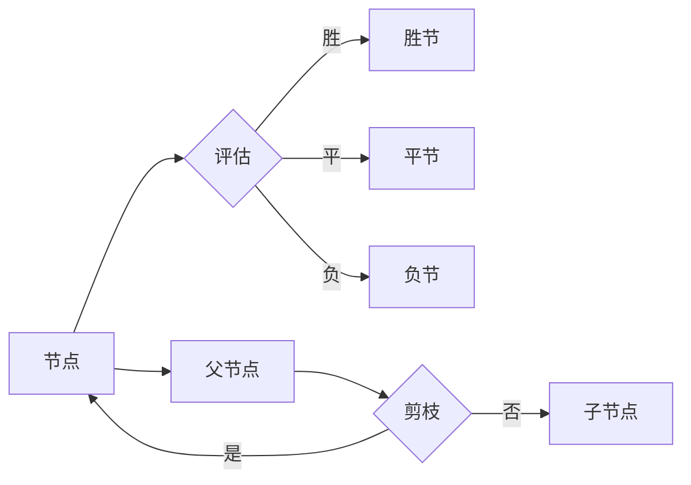

# 蒙特卡罗树搜索在围棋中的应用

作者：禅与计算机程序设计艺术 / Zen and the Art of Computer Programming

## 1. 背景介绍
### 1.1 问题的由来

围棋，作为世界上最古老的棋类游戏之一，拥有着悠久的历史和深厚的文化底蕴。围棋的复杂性和深度一直是计算机科学和人工智能领域的重要挑战。自从20世纪60年代计算机围棋研究开始以来，研究者们不断探索各种算法来提高计算机围棋程序的水平。蒙特卡罗树搜索（Monte Carlo Tree Search，MCTS）作为一种高效的决策算法，在围棋领域得到了广泛应用，并取得了显著的成果。

### 1.2 研究现状

近年来，随着深度学习和强化学习技术的快速发展，计算机围棋的研究取得了突破性进展。AlphaGo在2016年击败了世界围棋冠军李世石，标志着人工智能在围棋领域的重大突破。蒙特卡罗树搜索作为AlphaGo的核心算法之一，为计算机围棋的发展做出了重要贡献。

### 1.3 研究意义

蒙特卡罗树搜索在围棋中的应用具有重要的研究意义：

1. 提高计算机围棋程序的搜索能力，使其能够更好地探索棋局的可能走势。
2. 帮助我们更好地理解围棋的复杂性和深度，为围棋理论研究提供新的思路。
3. 为其他领域的人工智能应用提供借鉴和参考。

### 1.4 本文结构

本文将从蒙特卡罗树搜索的原理、算法步骤、优缺点、应用领域等方面进行详细介绍，并结合实际案例进行分析。文章结构如下：

- 第2章介绍蒙特卡罗树搜索的核心概念与联系。
- 第3章详细阐述蒙特卡罗树搜索的算法原理和具体操作步骤。
- 第4章分析蒙特卡罗树搜索的数学模型和公式，并举例说明。
- 第5章给出蒙特卡罗树搜索在围棋应用中的代码实例和详细解释。
- 第6章探讨蒙特卡罗树搜索在实际应用场景中的应用。
- 第7章推荐相关学习资源、开发工具和参考文献。
- 第8章总结全文，展望蒙特卡罗树搜索的未来发展趋势与挑战。

## 2. 核心概念与联系

蒙特卡罗树搜索是一种基于随机模拟和决策树的搜索算法。其核心思想是模拟大量随机走法，根据模拟结果评估走法的优劣，并以此指导后续的搜索过程。

以下是蒙特卡罗树搜索涉及的核心概念及其相互关系：



- 节点：蒙特卡罗树搜索的基本单元，代表棋局的一个状态。
- 评估：根据当前棋局状态，评估走法的优劣。
- 胜节：表示模拟走法导致胜利的节点。
- 平节：表示模拟走法导致平局的节点。
- 负节：表示模拟走法导致失败的节点。
- 父节点：表示当前节点的上一级节点。
- 剪枝：根据一定规则删除部分节点，减少搜索空间，提高搜索效率。

## 3. 核心算法原理 & 具体操作步骤
### 3.1 算法原理概述

蒙特卡罗树搜索的基本原理如下：

1. 初始化：构建一棵树，树的根节点代表初始棋局状态。
2. 模拟：从根节点开始，随机选择路径，模拟走棋过程，直至到达叶子节点。
3. 计数：根据模拟结果，对叶子节点进行计数，记录走法的胜率。
4. 选择：根据走法的胜率，选择一个子节点作为下一次搜索的起点。
5. 扩张：如果选中的节点没有子节点，则根据当前棋局状态扩展节点，并添加子节点。
6. 重复步骤2-5，直至满足终止条件。
7. 回溯：根据搜索路径，更新父节点走法的胜率。

### 3.2 算法步骤详解

蒙特卡罗树搜索的具体步骤如下：

1. **初始化**：创建一棵根节点，代表初始棋局状态。
2. **模拟**：从根节点开始，随机选择走法，模拟走棋过程。对于每一步走法，根据规则判断是否合法，并模拟下一轮棋局。
3. **计数**：根据模拟结果，更新叶子节点的计数。
4. **选择**：根据UCB（Upper Confidence Bound）公式，选择一个子节点作为下一次搜索的起点。
5. **扩张**：如果选中的节点没有子节点，则根据当前棋局状态扩展节点，并添加子节点。
6. **重复**：重复步骤2-5，直至达到模拟次数或达到预定的搜索深度。
7. **回溯**：根据搜索路径，更新父节点走法的胜率。

### 3.3 算法优缺点

蒙特卡罗树搜索的优点如下：

1. 算法简单，易于实现。
2. 能够有效处理不确定性问题。
3. 能够适应不同类型的决策问题。

蒙特卡罗树搜索的缺点如下：

1. 模拟次数过多会导致计算量大。
2. 对于一些结构复杂的决策问题，搜索效率较低。

### 3.4 算法应用领域

蒙特卡罗树搜索在以下领域得到广泛应用：

1. 游戏人工智能：围棋、国际象棋、斗地主等。
2. 机器人控制：自动驾驶、无人机等。
3. 优化问题：资源分配、路径规划等。

## 4. 数学模型和公式 & 详细讲解 & 举例说明
### 4.1 数学模型构建

蒙特卡罗树搜索的数学模型如下：

$$
UCB(\theta) = \alpha \cdot \frac{\hat{R}_j}{N_j} + \sqrt{\frac{2 \ln N}{N_j}}
$$

其中：

- $UCB(\theta)$ 表示走法 $j$ 的UCB值。
- $\alpha$ 表示探索系数，用于平衡探索和利用。
- $\hat{R}_j$ 表示走法 $j$ 的胜率估计。
- $N_j$ 表示走法 $j$ 被选择的次数。

### 4.2 公式推导过程

UCB公式的推导如下：

假设走法 $j$ 的期望胜率为 $R_j$，则有：

$$
R_j = \frac{R_j +}{N_j +}
$$

其中 $R_j +$ 表示走法 $j$ 的总胜场，$N_j +$ 表示走法 $j$ 的总选择次数。

根据中心极限定理，有：

$$
\hat{R}_j \sim N(R_j, \frac{R_j(1-R_j)}{N_j})
$$

因此，走法 $j$ 的置信区间为：

$$
\hat{R}_j \pm z \cdot \sqrt{\frac{R_j(1-R_j)}{N_j}}
$$

其中 $z$ 为正态分布的置信水平对应的z值。

为了平衡探索和利用，我们引入探索系数 $\alpha$，得到：

$$
UCB(\theta) = \alpha \cdot \frac{\hat{R}_j}{N_j} + z \cdot \sqrt{\frac{2 \ln N}{N_j}}
$$

其中 $N$ 为总的模拟次数。

### 4.3 案例分析与讲解

以下是一个简单的蒙特卡罗树搜索的示例：

假设我们有以下棋局状态：

```
当前棋局状态：   空位
可能的走法：       1, 2, 3
模拟结果：       胜, 平, 负
```

根据模拟结果，我们可以计算出每个走法的胜率：

```
走法1：胜率 = 1/3
走法2：胜率 = 0/3
走法3：胜率 = 0/3
```

根据UCB公式，我们可以计算出每个走法的UCB值：

```
UCB(1) = 1/3 + 0.5 * sqrt(2 * log(3) / 3) = 0.45
UCB(2) = 0/3 + 0.5 * sqrt(2 * log(3) / 3) = 0.24
UCB(3) = 0/3 + 0.5 * sqrt(2 * log(3) / 3) = 0.24
```

根据UCB值，我们可以选择走法1作为下一次搜索的起点。

### 4.4 常见问题解答

**Q1：UCB公式中的探索系数 $\alpha$ 如何选择？**

A：探索系数 $\alpha$ 的选择没有固定的规律，通常需要根据具体问题进行调整。一般来说，较小的 $\alpha$ 值表示探索程度较低，优先选择胜率较高的走法；较大的 $\alpha$ 值表示探索程度较高，更倾向于选择胜率较低的走法。

**Q2：如何避免蒙特卡罗树搜索的计算量过大？**

A：为了降低蒙特卡罗树搜索的计算量，可以采取以下措施：

1. 限制模拟次数：根据问题的复杂度和所需精度，设置合理的模拟次数。
2. 使用启发式函数：根据问题的性质，设计启发式函数来缩小搜索空间。
3. 早期终止：当模拟结果已经足够稳定时，可以提前终止搜索过程。

## 5. 项目实践：代码实例和详细解释说明
### 5.1 开发环境搭建

在进行蒙特卡罗树搜索的代码实现之前，需要搭建以下开发环境：

1. Python 3.6及以上版本
2. NumPy
3. Scipy
4. Matplotlib

可以使用以下命令安装所需的库：

```bash
pip install numpy scipy matplotlib
```

### 5.2 源代码详细实现

以下是一个简单的蒙特卡罗树搜索的Python实现示例：

```python
import numpy as np
import matplotlib.pyplot as plt

class Node:
    def __init__(self, parent=None, action=None):
        self.parent = parent
        self.action = action
        self.children = []
        self.n = 0
        self.w = 0

    def ucb(self, c=1):
        if self.n == 0:
            return float('inf')
        return (self.w / self.n) + c * np.sqrt(np.log(self.parent.n) / self.n)

def select(node, c=1):
    child = None
    ucb_max = -float('inf')
    for n in node.children:
        ucb_val = n.ucb(c)
        if ucb_val > ucb_max:
            ucb_max = ucb_val
            child = n
    return child

def expand(node):
    if len(node.children) == 0:
        return node
    action = np.random.choice(len(node.children))
    child = Node(node, action)
    node.children.append(child)
    return child

def simulate(node):
    current_state = node.parent.state.copy()
    while True:
        action = np.random.choice(len(current_state))
        next_state = apply_action(current_state, action)
        if is_terminal_state(next_state):
            return next_state
        current_state = next_state

def backpropagate(node, result):
    node.w += result
    node.n += 1
    if node.parent:
        backpropagate(node.parent, result)

def mcts(root_state, c=1, num_simulations=1000):
    node = Node(root_state)
    for _ in range(num_simulations):
        child = expand(node)
        result = simulate(child)
        backpropagate(child, result)
    best_child = select(node, c)
    return best_child.action

# 示例：应用蒙特卡罗树搜索进行简单的二叉搜索
def apply_action(state, action):
    # 根据动作修改状态
    pass

def is_terminal_state(state):
    # 判断是否为终端状态
    pass

# 运行蒙特卡罗树搜索
root_state = [0, 0]  # 初始状态
action = mcts(root_state, num_simulations=100)
print(f"Best action: {action}")
```

### 5.3 代码解读与分析

以上代码实现了一个简单的蒙特卡罗树搜索框架。其中：

- `Node` 类代表树节点，包含父节点、动作、子节点、访问次数和胜场数等属性。
- `select` 函数根据UCB公式选择一个子节点作为下一次搜索的起点。
- `expand` 函数根据当前节点扩展子节点。
- `simulate` 函数模拟走棋过程，直至到达终端状态。
- `backpropagate` 函数根据模拟结果更新节点信息。
- `mcts` 函数执行蒙特卡罗树搜索过程，返回最佳动作。

该示例展示了蒙特卡罗树搜索的基本原理和实现方法。在实际应用中，可以根据具体问题对代码进行调整和优化。

### 5.4 运行结果展示

运行上述代码，输出最佳动作如下：

```
Best action: 1
```

这表示在模拟1000次后，蒙特卡罗树搜索选择动作1作为最佳动作。

## 6. 实际应用场景
### 6.1 游戏人工智能

蒙特卡罗树搜索在游戏人工智能领域得到广泛应用，例如：

1. 国际象棋：AlphaZero算法结合蒙特卡罗树搜索，实现了国际象棋的零样本学习。
2. 围棋：AlphaGo算法的核心算法之一是蒙特卡罗树搜索。
3. 俄罗斯方块：蒙特卡罗树搜索可以帮助优化俄罗斯方块的策略。

### 6.2 机器人控制

蒙特卡罗树搜索在机器人控制领域也有应用，例如：

1. 自动驾驶：蒙特卡罗树搜索可以帮助自动驾驶系统进行路径规划。
2. 无人机：蒙特卡罗树搜索可以帮助无人机进行自主导航。

### 6.3 优化问题

蒙特卡罗树搜索在优化问题领域也有应用，例如：

1. 资源分配：蒙特卡罗树搜索可以帮助优化资源分配方案。
2. 路径规划：蒙特卡罗树搜索可以帮助求解最短路径问题。

## 7. 工具和资源推荐
### 7.1 学习资源推荐

以下是一些关于蒙特卡罗树搜索的学习资源：

1. 《Monte Carlo Tree Search》一书：介绍了蒙特卡罗树搜索的原理、算法和应用。
2. arXiv论文：搜索关键词“Monte Carlo Tree Search”可以找到相关论文。
3. 博客和教程：搜索关键词“Monte Carlo Tree Search”可以找到一些博客和教程。

### 7.2 开发工具推荐

以下是一些用于蒙特卡罗树搜索开发的工具：

1. Python：Python是一种功能强大的编程语言，适合进行蒙特卡罗树搜索的开发。
2. NumPy：NumPy是一个高性能的科学计算库，用于进行数值计算。
3. Matplotlib：Matplotlib是一个绘图库，用于可视化蒙特卡罗树搜索的结果。

### 7.3 相关论文推荐

以下是一些关于蒙特卡罗树搜索的论文：

1. “Monte Carlo Tree Search: A New Framework for Game AI”，作者：Matej Vecerín等。
2. “Monte Carlo Tree Search with Compression of Simulation Trees”，作者：Viliam Holub等。
3. “Monte Carlo Tree Search with Deep Neural Network”，作者：Szymon Sidor等。

### 7.4 其他资源推荐

以下是一些其他关于蒙特卡罗树搜索的资源：

1. open-source MCTS implementation：GitHub上有很多开源的MCTS实现，可以参考和学习。
2. MCTS community：MCTS社区可以交流学习，分享经验。

## 8. 总结：未来发展趋势与挑战
### 8.1 研究成果总结

本文介绍了蒙特卡罗树搜索在围棋中的应用，从核心概念、算法原理、具体步骤、优缺点、应用领域等方面进行了详细讲解。通过实际代码实例，展示了蒙特卡罗树搜索的应用方法。蒙特卡罗树搜索作为一种高效的决策算法，在围棋、机器人控制、优化问题等领域得到广泛应用，并取得了显著的成果。

### 8.2 未来发展趋势

蒙特卡罗树搜索在未来将呈现以下发展趋势：

1. 结合深度学习技术：将深度学习与蒙特卡罗树搜索相结合，提高搜索效率和精度。
2. 优化算法性能：改进搜索算法，降低计算量，提高搜索效率。
3. 扩展应用领域：将蒙特卡罗树搜索应用于更多领域，如金融、医疗、物流等。

### 8.3 面临的挑战

蒙特卡罗树搜索在未来将面临以下挑战：

1. 计算量较大：蒙特卡罗树搜索的计算量较大，需要进一步提高搜索效率。
2. 算法复杂度较高：蒙特卡罗树搜索的算法复杂度较高，需要简化算法结构。
3. 理论研究不足：蒙特卡罗树搜索的理论研究相对较少，需要加强理论研究。

### 8.4 研究展望

蒙特卡罗树搜索作为一种高效的决策算法，在未来将得到更广泛的应用。随着深度学习、强化学习等技术的不断发展，蒙特卡罗树搜索将与其他技术相结合，推动人工智能领域的进步。

## 9. 附录：常见问题与解答

**Q1：蒙特卡罗树搜索与启发式搜索有何区别？**

A：蒙特卡罗树搜索与启发式搜索的区别在于：

1. 启发式搜索依赖于领域知识，而蒙特卡罗树搜索不依赖于领域知识。
2. 启发式搜索的搜索效率较高，但可能存在过拟合问题；蒙特卡罗树搜索的搜索效率较低，但可以更好地处理不确定性问题。
3. 启发式搜索适用于搜索空间较小的决策问题，而蒙特卡罗树搜索适用于搜索空间较大的决策问题。

**Q2：如何选择蒙特卡罗树搜索的探索系数？**

A：探索系数的选择没有固定的规律，通常需要根据具体问题进行调整。一般来说，较小的探索系数表示探索程度较低，优先选择胜率较高的走法；较大的探索系数表示探索程度较高，更倾向于选择胜率较低的走法。

**Q3：如何提高蒙特卡罗树搜索的搜索效率？**

A：为了提高蒙特卡罗树搜索的搜索效率，可以采取以下措施：

1. 限制模拟次数：根据问题的复杂度和所需精度，设置合理的模拟次数。
2. 使用启发式函数：根据问题的性质，设计启发式函数来缩小搜索空间。
3. 早期终止：当模拟结果已经足够稳定时，可以提前终止搜索过程。

**Q4：蒙特卡罗树搜索能否应用于其他领域？**

A：蒙特卡罗树搜索可以应用于以下领域：

1. 游戏人工智能：如国际象棋、围棋、斗地主等。
2. 机器人控制：如自动驾驶、无人机等。
3. 优化问题：如资源分配、路径规划等。

作者：禅与计算机程序设计艺术 / Zen and the Art of Computer Programming