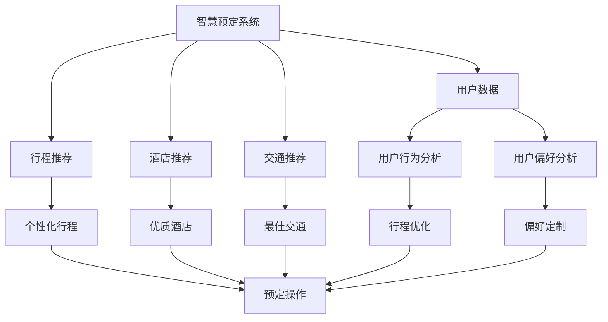
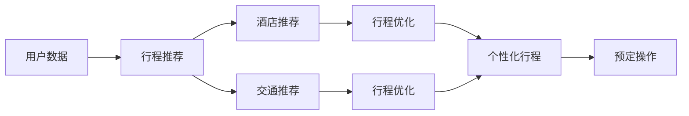
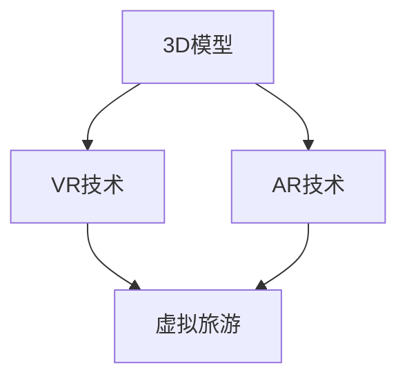
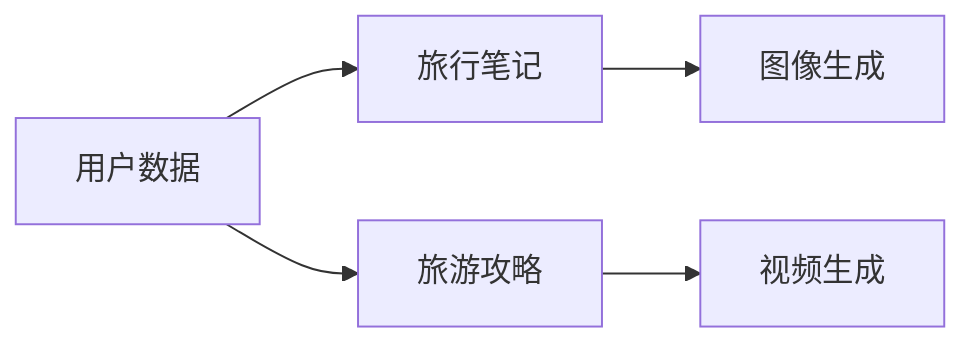
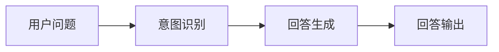

                 

# AI在旅游业中的应用探索

## 1. 背景介绍

旅游业是一个庞大且复杂的行业，涵盖了从预定到行后的各个环节。传统旅游业务依赖于人工操作，效率低、成本高。近年来，AI技术在旅游业的应用开始逐渐增多，带动了旅游业智能化、自动化、个性化的转型升级。AI在旅游业中的应用主要集中在以下几个方面：

### 1.1 智慧预定系统

AI驱动的智慧预定系统能够根据用户历史行为和偏好自动推荐目的地和行程安排，提供个性化的旅行方案。具体应用场景包括智能搜索、智能筛选、智能推荐等。

### 1.2 虚拟旅游体验

通过VR、AR等技术，AI驱动的虚拟旅游体验系统能够提供沉浸式的旅游体验，让用户在家中也能感受到如临其境的旅游感。虚拟旅游体验系统可以用于展示景区景点、酒店、博物馆等，为无法亲身游览的用户提供便捷的体验。

### 1.3 旅游内容生成

AI驱动的内容生成技术能够自动生成高质量的旅游文本和图片内容，如旅游攻略、旅游博文、旅游图片等，帮助用户更好地规划行程，提升用户体验。

### 1.4 智能客服与在线咨询

AI驱动的智能客服与在线咨询系统能够24/7提供实时的旅游咨询服务，解答用户问题，提升用户满意度。

## 2. 核心概念与联系

### 2.1 核心概念概述

为更好地理解AI在旅游业中的应用，本节将介绍几个密切相关的核心概念：

- **智慧预定系统**：基于AI技术的旅游预定系统，能够自动推荐行程、酒店、交通等，提升预定效率和用户体验。
- **虚拟旅游体验**：利用VR、AR等技术，为用户提供沉浸式旅游体验，替代部分线下旅游需求。
- **旅游内容生成**：AI驱动的内容生成技术，自动生成旅游文本和图片，辅助用户规划行程。
- **智能客服与在线咨询**：基于AI的智能客服与在线咨询系统，提供24/7旅游咨询服务，提升客户满意度。
- **数据分析与预测**：利用机器学习等技术，分析用户数据，预测未来旅游趋势，辅助决策。

这些核心概念之间的联系可以通过以下Mermaid流程图来展示：



这个流程图展示了智慧预定系统的各个核心功能模块及其相互联系。用户数据通过分析和预测，生成行程、酒店和交通推荐，并根据用户的个性化偏好和历史行为进行优化和定制，最终完成预定操作。

### 2.2 概念间的关系

这些核心概念之间存在着紧密的联系，形成了智慧旅游生态系统的完整架构。下面我通过几个Mermaid流程图来展示这些概念之间的关系。

#### 2.2.1 智慧预定系统的运行流程



这个流程图展示了智慧预定系统运行的基本流程。用户数据经过分析和推荐，生成行程、酒店和交通建议，并根据用户偏好进行优化，最终完成预定操作。

#### 2.2.2 虚拟旅游体验的技术栈



这个流程图展示了虚拟旅游体验系统的主要技术栈。3D模型是虚拟旅游体验的基础，通过VR和AR技术进行呈现，为用户提供沉浸式体验。

#### 2.2.3 旅游内容生成的数据处理



这个流程图展示了旅游内容生成系统的数据处理流程。用户数据经过分析和整合，生成旅行笔记、旅游攻略、图片和视频等内容，辅助用户规划行程。

#### 2.2.4 智能客服与在线咨询的交互流程



这个流程图展示了智能客服与在线咨询系统的交互流程。用户输入问题后，系统进行意图识别，并生成回答，输出给用户。

## 3. 核心算法原理 & 具体操作步骤

### 3.1 算法原理概述

AI在旅游业中的应用，主要依赖于机器学习、自然语言处理、计算机视觉等核心技术。以下是对几个核心算法的简要介绍：

#### 3.1.1 自然语言处理（NLP）

自然语言处理（NLP）是AI在旅游业中应用的基础。通过NLP技术，系统能够理解用户的自然语言输入，生成自然语言回复，提供更人性化的交互体验。NLP技术包括文本分类、情感分析、文本生成、机器翻译等。

#### 3.1.2 计算机视觉

计算机视觉技术在旅游业中主要应用于场景识别、图像处理和增强现实（AR）等。通过计算机视觉技术，系统能够识别用户输入的图片和视频，生成场景描述和推荐，提升用户体验。

#### 3.1.3 机器学习

机器学习技术是AI在旅游业中应用的核心。通过机器学习，系统能够分析用户数据，预测用户行为，生成个性化的推荐和行程安排，提高用户满意度和转化率。机器学习技术包括分类、回归、聚类、推荐系统等。

### 3.2 算法步骤详解

AI在旅游业中的应用，主要包括以下几个关键步骤：

#### 3.2.1 数据收集与预处理

首先，需要收集大量的旅游数据，包括用户历史行为数据、行程数据、酒店数据、交通数据等。然后，对数据进行清洗、归一化和特征提取等预处理步骤，以便后续的分析和建模。

#### 3.2.2 模型训练与优化

基于收集到的数据，选择合适的算法模型进行训练和优化。模型训练包括特征工程、模型选择、超参数调优等步骤。模型优化包括模型评估、交叉验证、模型融合等步骤，以提升模型的泛化能力和性能。

#### 3.2.3 模型部署与应用

训练好的模型需要部署到实际应用中，以便为用户提供实时服务。模型部署包括服务端部署、API接口设计等步骤。在实际应用中，系统需要实时处理用户请求，生成推荐和回复，并提供用户评价和反馈，以不断优化模型。

### 3.3 算法优缺点

AI在旅游业中的应用具有以下优点：

- **个性化推荐**：通过分析用户历史数据，生成个性化的行程和推荐，提升用户体验。
- **实时服务**：AI系统能够24/7提供实时服务，满足用户随时随地查询的需求。
- **高效率**：AI系统能够自动化处理大量数据，显著提高业务效率。

同时，AI在旅游业中的应用也存在一些缺点：

- **数据隐私问题**：收集大量用户数据，可能引发隐私泄露和数据安全问题。
- **模型可解释性不足**：AI系统的决策过程往往难以解释，可能引发用户不信任和质疑。
- **依赖高质量数据**：AI系统需要大量高质量的数据进行训练，数据质量直接影响系统性能。

### 3.4 算法应用领域

AI在旅游业中的应用，主要集中在以下几个领域：

#### 3.4.1 智慧预定系统

智慧预定系统是AI在旅游业中应用的主要领域之一。系统通过分析用户数据，生成行程、酒店和交通推荐，提供个性化的预定服务。

#### 3.4.2 虚拟旅游体验

虚拟旅游体验系统通过VR、AR等技术，提供沉浸式的旅游体验，让用户在家中也能感受真实的旅游感。

#### 3.4.3 旅游内容生成

AI驱动的内容生成技术，自动生成旅游文本和图片内容，辅助用户规划行程，提升用户体验。

#### 3.4.4 智能客服与在线咨询

智能客服与在线咨询系统基于NLP技术，提供24/7旅游咨询服务，解答用户问题，提升用户满意度。

## 4. 数学模型和公式 & 详细讲解 & 举例说明

### 4.1 数学模型构建

AI在旅游业中的应用，通常基于以下数学模型进行建模：

- **回归模型**：用于预测用户行为，如旅行目的地、酒店评分等。
- **分类模型**：用于分类用户输入，如行程类型、酒店类型等。
- **聚类模型**：用于发现用户群体，如不同旅游偏好用户等。
- **推荐模型**：用于生成个性化的行程和酒店推荐。

### 4.2 公式推导过程

以下以回归模型为例，推导其数学公式：

设训练集为 $D=\{(x_i,y_i)\}_{i=1}^N$，其中 $x_i$ 为输入特征，$y_i$ 为真实标签。假设回归模型为 $y=f(x;\theta)$，其中 $\theta$ 为模型参数。回归模型的目标是最小化均方误差损失函数：

$$
L(\theta)=\frac{1}{N}\sum_{i=1}^N(y_i-f(x_i;\theta))^2
$$

根据梯度下降法，模型参数 $\theta$ 的更新公式为：

$$
\theta_j=\theta_j-\eta\frac{\partial L(\theta)}{\partial \theta_j}
$$

其中 $\eta$ 为学习率。

### 4.3 案例分析与讲解

以智能客服与在线咨询系统的意图识别为例，分析模型的训练和应用过程。

#### 4.3.1 意图识别模型

意图识别模型通常基于文本分类算法进行训练。以朴素贝叶斯分类器为例，模型训练步骤如下：

1. 数据预处理：将用户输入文本进行分词、去除停用词、词干提取等处理。
2. 特征提取：将处理后的文本转换为词频向量或TF-IDF向量。
3. 模型训练：使用训练数据集进行模型训练，得到分类器参数。
4. 模型评估：使用测试数据集评估模型性能，计算准确率、召回率和F1分数。

#### 4.3.2 意图识别应用

在实际应用中，用户输入问题后，系统进行意图识别，生成相应的回答。例如，用户询问“上海的旅游景点有哪些”，系统通过意图识别模型分析，生成“上海有东方明珠、外滩等景点”的回答，并发送给用户。

## 5. 项目实践：代码实例和详细解释说明

### 5.1 开发环境搭建

在进行AI在旅游业中的应用开发时，需要准备以下开发环境：

- Python 3.x：推荐的开发语言，支持众多科学计算和机器学习库。
- Anaconda：Python环境管理工具，方便管理依赖库和创建虚拟环境。
- Jupyter Notebook：交互式开发环境，支持代码编写、数据可视化和模型评估。

### 5.2 源代码详细实现

以下是一个简单的AI驱动的智慧预定系统实现，包括用户数据收集、行程推荐和预定操作的代码实现。

```python
import pandas as pd
from sklearn.model_selection import train_test_split
from sklearn.ensemble import RandomForestRegressor
from sklearn.metrics import mean_squared_error
from sklearn.metrics import r2_score
from sklearn.model_selection import cross_val_score

# 数据收集与预处理
data = pd.read_csv('user_data.csv')
# 特征工程：提取重要特征，如用户偏好、旅行日期、行程类型等
features = ['user_preference', 'travel_date', 'trip_type']
X = data[features]
y = data['trip_cost']

# 模型训练与优化
X_train, X_test, y_train, y_test = train_test_split(X, y, test_size=0.2, random_state=42)
model = RandomForestRegressor()
model.fit(X_train, y_train)

# 模型评估
y_pred = model.predict(X_test)
mse = mean_squared_error(y_test, y_pred)
r2 = r2_score(y_test, y_pred)
print('Mean Squared Error:', mse)
print('R2 Score:', r2)

# 模型部署与应用
def predict_trip_cost(user_preference, travel_date, trip_type):
    user_data = pd.DataFrame({'user_preference': [user_preference],
                             'travel_date': [travel_date],
                             'trip_type': [trip_type]}, index=[0])
    cost = model.predict(user_data)
    return cost[0]
```

### 5.3 代码解读与分析

这段代码实现了一个简单的随机森林回归模型，用于预测旅游行程的成本。其中，`train_test_split`函数用于将数据集划分为训练集和测试集，`RandomForestRegressor`用于建立随机森林回归模型，`mean_squared_error`和`r2_score`用于评估模型性能。`predict_trip_cost`函数用于预测特定用户的行程成本，接受用户偏好、旅行日期和行程类型作为输入，返回预测结果。

## 6. 实际应用场景

### 6.1 智慧预定系统

智慧预定系统在实际应用中，可以帮助用户快速找到满意的行程安排。例如，用户通过输入目的地、出行日期、预算等要求，系统能够自动推荐符合条件的行程，并提供价格、酒店评分等详细信息，供用户参考。用户选择满意行程后，系统自动完成预定操作。

### 6.2 虚拟旅游体验

虚拟旅游体验系统在实际应用中，可以让用户在家中体验虚拟旅游。例如，用户通过VR头盔查看景点，选择感兴趣的点位，系统自动生成旅游路线，并在虚拟场景中提供实时解说和互动体验。

### 6.3 旅游内容生成

旅游内容生成系统在实际应用中，可以帮助用户生成高质量的旅游攻略和博客。例如，系统通过分析用户的历史行为数据和行程信息，自动生成详细的旅游攻略，包括行程安排、景点介绍、餐饮推荐等，供用户参考。

### 6.4 智能客服与在线咨询

智能客服与在线咨询系统在实际应用中，可以帮助用户解答旅行相关问题。例如，用户通过聊天界面输入问题，系统能够自动识别意图，并生成回答。用户可以选择系统提供的推荐回答，或者通过人工客服进一步咨询。

## 7. 工具和资源推荐

### 7.1 学习资源推荐

为了帮助开发者系统掌握AI在旅游业中的应用，这里推荐一些优质的学习资源：

1. 《Python机器学习》：该书系统介绍了机器学习算法，包括回归、分类、聚类、推荐系统等。
2. 《深度学习》：该书介绍了深度学习算法，包括神经网络、卷积神经网络、循环神经网络等。
3. 《自然语言处理综论》：该书介绍了自然语言处理算法，包括文本分类、情感分析、文本生成、机器翻译等。
4. 《计算机视觉：算法与应用》：该书介绍了计算机视觉算法，包括图像处理、场景识别、图像分割等。
5. Kaggle：Kaggle是一个数据科学竞赛平台，提供大量旅游数据集和相关竞赛，帮助开发者学习和实践AI技术。

### 7.2 开发工具推荐

高效的开发离不开优秀的工具支持。以下是几款用于AI在旅游业中的应用开发的常用工具：

1. TensorFlow：由Google主导开发的深度学习框架，支持分布式计算，适用于大规模深度学习模型训练。
2. PyTorch：由Facebook主导开发的深度学习框架，易于使用，支持动态计算图，适用于深度学习研究和原型开发。
3. Scikit-learn：一个开源机器学习库，支持分类、回归、聚类等常见机器学习算法，易于集成使用。
4. NLTK：一个自然语言处理库，提供文本处理、情感分析、词性标注等功能，适合NLP任务开发。
5. OpenCV：一个开源计算机视觉库，提供图像处理、特征提取、场景识别等功能，适合计算机视觉任务开发。

### 7.3 相关论文推荐

AI在旅游业中的应用研究涉及众多领域，以下是几篇具有代表性的论文，推荐阅读：

1. "A Survey on Travel Recommendation Systems"：该论文综述了旅游推荐系统的最新研究进展，涵盖数据收集、模型构建、推荐算法等方面。
2. "Deep Learning for Tourist Experience Enhancement"：该论文介绍了深度学习在旅游体验增强中的应用，包括情感分析、图像处理、虚拟旅游等方面。
3. "Natural Language Processing in Travel Recommendation"：该论文讨论了自然语言处理在旅游推荐中的应用，包括文本分类、情感分析、文本生成等方面。
4. "Computer Vision for Tourist Attraction Enhancement"：该论文介绍了计算机视觉在旅游景点增强中的应用，包括图像处理、场景识别、图像分割等方面。

## 8. 总结：未来发展趋势与挑战

### 8.1 研究成果总结

AI在旅游业中的应用已经取得了显著进展，主要体现在以下方面：

- 智能推荐：通过分析用户数据，生成个性化的行程和推荐，提升用户体验。
- 虚拟体验：通过VR、AR等技术，提供沉浸式的旅游体验，满足用户随时随地查询的需求。
- 内容生成：自动生成旅游文本和图片内容，辅助用户规划行程，提升用户体验。
- 智能客服：基于NLP技术，提供24/7旅游咨询服务，解答用户问题，提升用户满意度。

### 8.2 未来发展趋势

展望未来，AI在旅游业中的应用将呈现以下几个趋势：

- **多模态融合**：将图像、语音、视频等多模态数据与文本数据结合，提升旅游体验的多样性和丰富性。
- **实时数据处理**：通过实时数据处理技术，如流式处理、边缘计算等，提升旅游系统的响应速度和实时性。
- **用户隐私保护**：加强用户数据隐私保护，如数据脱敏、差分隐私等，提升用户信任和满意度。
- **情感智能**：通过情感分析等技术，提升旅游系统的情感识别和反馈能力，提升用户互动体验。
- **交互式体验**：通过交互式对话系统，提升用户参与感和互动体验，如语音交互、手势控制等。

### 8.3 面临的挑战

尽管AI在旅游业中的应用已经取得了不少进展，但仍面临以下挑战：

- **数据隐私问题**：收集大量用户数据，可能引发隐私泄露和数据安全问题。
- **模型可解释性不足**：AI系统的决策过程往往难以解释，可能引发用户不信任和质疑。
- **依赖高质量数据**：AI系统需要大量高质量的数据进行训练，数据质量直接影响系统性能。
- **实时服务要求高**：实时服务需要高效、稳定、可扩展的系统架构，对技术要求较高。
- **用户需求多样性**：旅游需求多样，需要系统具备高度的灵活性和个性化定制能力。

### 8.4 研究展望

为了应对这些挑战，未来的研究需要在以下几个方面寻求新的突破：

- **数据隐私保护**：研究差分隐私、联邦学习等技术，保护用户数据隐私。
- **模型可解释性**：研究可解释性算法，如LIME、SHAP等，提升模型的可解释性。
- **数据质量提升**：研究数据清洗、数据增强等技术，提升数据质量。
- **实时服务优化**：研究实时数据处理、分布式计算等技术，提升实时服务性能。
- **个性化定制**：研究个性化推荐、交互式对话等技术，提升用户互动体验。

## 9. 附录：常见问题与解答

**Q1: AI在旅游业中的应用是否适用于所有旅游场景？**

A: AI在旅游业中的应用，主要适用于大规模、标准化的旅游场景，如酒店预定、景区景点等。对于一些个性化、小众化的旅游场景，如私人定制游、高端定制游等，AI系统的应用仍有待进一步探索和优化。

**Q2: AI在旅游业中的数据隐私问题如何解决？**

A: 数据隐私问题是AI在旅游业中的重要挑战之一。可以通过差分隐私、联邦学习等技术，保护用户数据隐私。差分隐私可以在数据处理过程中加入噪声，使攻击者难以识别单个用户的数据。联邦学习可以让数据在本地计算，不涉及数据传输，保护用户隐私。

**Q3: AI在旅游业中的应用是否需要高质量的数据？**

A: AI在旅游业中的应用，需要高质量的数据进行训练。高质量的数据包括用户行为数据、行程数据、酒店数据、交通数据等，数据质量直接影响系统性能。可以通过数据清洗、数据增强等技术提升数据质量。

**Q4: AI在旅游业中的应用是否需要实时数据处理？**

A: 对于需要实时响应的场景，如智能客服、虚拟旅游体验等，实时数据处理是必要的。实时数据处理可以通过流式处理、边缘计算等技术实现。流式处理可以在数据源实时生成时进行处理，提高处理速度。边缘计算可以在本地处理数据，减少延迟。

**Q5: AI在旅游业中的应用是否需要可解释性？**

A: AI在旅游业中的应用，需要具备较高的可解释性。用户需要了解系统推荐的理由，才能信任和接受系统的建议。可以通过可解释性算法，如LIME、SHAP等，提升模型的可解释性。可解释性算法可以生成特征重要性排名，解释模型预测结果。

---

作者：禅与计算机程序设计艺术 / Zen and the Art of Computer Programming

