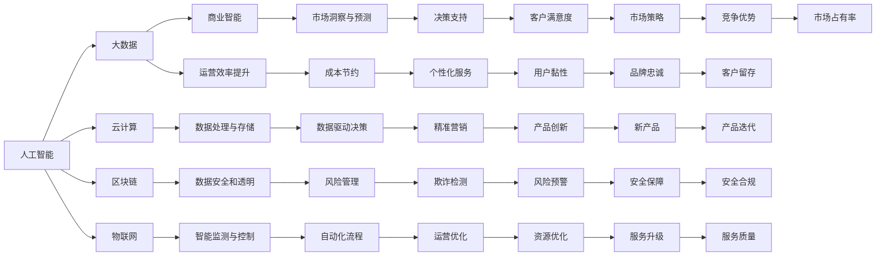

                 

# AI技术与商业模式的结合

## 1. 背景介绍

### 1.1 问题由来
人工智能（AI）技术的迅猛发展在各行各业引发了深刻变革。从自动化流程、优化决策到提升用户体验，AI技术展示了其在商业领域中的巨大潜力。然而，如何更好地将AI技术融入商业运营，最大化其商业价值，成为摆在企业和开发者面前的一大挑战。

### 1.2 问题核心关键点
AI与商业模式的结合，本质上是将AI技术作为商业创新工具，通过优化和创新商业模式，提升企业的核心竞争力和市场响应速度。核心关键点包括：

1. **数据驱动决策**：利用AI算法处理和分析海量数据，辅助企业做出更精准的决策。
2. **个性化服务**：通过AI技术提供定制化、个性化的产品和服务，提升用户体验和客户满意度。
3. **运营效率提升**：通过AI自动化流程，降低运营成本，提高运营效率。
4. **市场洞察与预测**：利用AI预测市场趋势和消费者行为，制定更有效的市场策略。
5. **风险管理**：AI技术在风险预警、金融欺诈检测等方面发挥重要作用，保障企业安全运营。

### 1.3 问题研究意义
研究AI技术与商业模式的结合，对于推动企业数字化转型、提升经营效率和创新能力具有重要意义：

1. **成本节约**：通过自动化和智能化，减少人力成本和运营成本。
2. **市场竞争力提升**：AI技术带来新的商业模式和产品服务，帮助企业占领市场高点。
3. **客户价值最大化**：AI技术能够提供更优质的个性化服务，增强客户黏性和忠诚度。
4. **快速响应市场变化**：AI技术能够实时分析市场数据，快速调整策略，提高市场适应性。
5. **可持续发展**：AI技术助力企业实现绿色运营，推动可持续发展的商业模式。

## 2. 核心概念与联系

### 2.1 核心概念概述

为更好地理解AI技术与商业模式的结合，本节将介绍几个密切相关的核心概念：

- **人工智能（AI）**：通过机器学习、深度学习等技术，使机器具备类人智能的能力，实现自动化、智能化。
- **大数据**：指规模大、多样性高、高速增长的数据集合，是大数据分析和AI技术的基础。
- **商业智能（BI）**：通过数据分析和可视化，帮助企业制定战略决策，优化运营管理。
- **云计算**：通过互联网提供计算资源和服务，支持大规模数据处理和AI应用。
- **区块链**：通过分布式账本技术，实现数据透明、不可篡改，应用于金融、供应链等领域。
- **物联网（IoT）**：通过互联网连接各种设备和系统，实现智能监测和控制。

这些概念通过交互作用，共同构成了AI技术与商业模式的结合框架。

### 2.2 概念间的关系

这些核心概念之间的逻辑关系可以通过以下Mermaid流程图来展示：



这个流程图展示了大数据、云计算、物联网、人工智能和区块链等关键技术在商业智能、市场洞察、运营效率、个性化服务等方面的应用和互动。

## 3. 核心算法原理 & 具体操作步骤
### 3.1 算法原理概述

AI技术与商业模式的结合，主要通过以下算法原理实现：

1. **机器学习与深度学习**：利用数据训练模型，自动提取特征，实现分类、回归、聚类等任务。
2. **自然语言处理（NLP）**：通过语义理解和生成技术，实现文本分析、情感分析、智能客服等应用。
3. **计算机视觉**：通过图像识别、图像分割等技术，实现视频监控、产品检测、医疗影像分析等应用。
4. **强化学习**：通过试错学习，优化决策过程，实现智能推荐、游戏策略等应用。
5. **知识图谱**：通过结构化表示和推理，实现信息检索、语义搜索等应用。

这些算法原理相互结合，可以构建出多样化的AI应用，服务于不同商业场景。

### 3.2 算法步骤详解

AI技术与商业模式的结合，通常包括以下几个关键步骤：

**Step 1: 数据采集与预处理**
- 收集业务数据和用户行为数据，清洗和预处理数据，使其符合建模要求。

**Step 2: 数据建模与训练**
- 选择合适的模型和算法，对数据进行训练，得到预测模型。

**Step 3: 模型部署与优化**
- 将模型部署到生产环境，进行实时预测或推理。
- 根据业务反馈和性能指标，不断调整模型参数，优化模型效果。

**Step 4: 业务集成与迭代**
- 将AI应用集成到现有业务流程中，实现自动化和智能化。
- 根据业务需求和市场变化，持续迭代AI模型，更新和扩展应用功能。

### 3.3 算法优缺点

AI技术与商业模式的结合，具有以下优点：

1. **提升决策质量**：利用AI技术处理和分析大量数据，提供更准确的预测和决策支持。
2. **增强客户体验**：通过个性化服务和智能客服，提升用户满意度和忠诚度。
3. **优化运营效率**：通过自动化流程和资源优化，降低运营成本，提高响应速度。
4. **开拓新业务模式**：AI技术带来新的商业模式和产品服务，帮助企业探索新的增长点。

同时，这种结合也存在一些缺点：

1. **技术复杂度高**：AI技术的实现和维护需要较高技术门槛，可能增加运营成本。
2. **数据质量要求高**：AI模型的效果依赖于数据的质量，数据缺失或不准确可能影响结果。
3. **算法透明性低**：AI算法通常是“黑盒”模型，难以解释和调试。
4. **隐私和安全问题**：AI技术涉及大量个人和敏感数据，存在隐私泄露和数据安全风险。

### 3.4 算法应用领域

AI技术与商业模式的结合，已经在多个领域得到广泛应用，包括但不限于：

1. **金融服务**：利用AI进行风险评估、欺诈检测、智能投顾等。
2. **零售电商**：通过个性化推荐、库存管理、客户分析等，提升用户体验和销售效率。
3. **医疗健康**：通过AI进行疾病诊断、药物研发、患者监测等，改善医疗服务质量。
4. **制造业**：利用AI进行生产优化、质量检测、设备维护等，提高生产效率和产品质量。
5. **物流运输**：通过AI进行路径规划、调度优化、车辆监控等，提升物流效率和安全性。
6. **智能家居**：通过AI实现语音控制、自动化家居、能效管理等，提升家居体验。

## 4. 数学模型和公式 & 详细讲解 & 举例说明

### 4.1 数学模型构建

以推荐系统为例，构建用户-物品评分预测模型：

- **输入**：用户ID、物品ID、历史评分数据。
- **输出**：预测评分。
- **损失函数**：均方误差损失函数。

假设用户对物品的评分服从高斯分布，设 $\mu_{ij}$ 为第 $i$ 个用户对第 $j$ 个物品的预测评分，$\sigma_{ij}$ 为评分方差，则预测评分的数学模型为：

$$
\mu_{ij} = \alpha_i + \beta_j + \gamma_{ij}
$$

其中 $\alpha_i$ 为用户特征向量，$\beta_j$ 为物品特征向量，$\gamma_{ij}$ 为交互项特征向量，$A, B, C$ 为模型参数。

### 4.2 公式推导过程

根据高斯分布，预测评分的均方误差损失函数为：

$$
\mathcal{L} = \frac{1}{2N} \sum_{i=1}^N \sum_{j=1}^M (y_{ij} - \mu_{ij})^2
$$

其中 $N$ 为用户数量，$M$ 为物品数量，$y_{ij}$ 为真实评分。

通过梯度下降算法，不断更新模型参数，最小化损失函数，得到最优模型参数 $\theta$。

### 4.3 案例分析与讲解

假设我们要构建一个电商平台的用户-物品推荐系统，具体步骤如下：

1. **数据采集**：收集用户浏览、购买、评价等数据，作为模型训练的监督数据。
2. **数据预处理**：对数据进行清洗、归一化和特征工程，提取用户和物品的特征向量。
3. **模型训练**：使用梯度下降算法，训练推荐模型，得到用户和物品的预测评分。
4. **模型评估**：在验证集上评估模型的预测性能，使用RMSE等指标评估模型效果。
5. **模型部署**：将训练好的模型部署到生产环境，实时预测用户对新物品的评分。
6. **模型优化**：根据用户反馈和业务需求，定期优化模型参数，更新推荐策略。

## 5. 项目实践：代码实例和详细解释说明

### 5.1 开发环境搭建

使用Python和TensorFlow搭建推荐系统开发环境：

1. 安装Python和TensorFlow：
```
pip install python
pip install tensorflow
```

2. 准备数据集：
```
wget https://datahub.io/machine-learning/user-item-ratings-dataset.zip
unzip user-item-ratings-dataset.zip
```

3. 配置环境变量：
```
export PYTHONPATH=$PYTHONPATH:/path/to/tensorflow
```

### 5.2 源代码详细实现

推荐系统的具体代码实现如下：

```python
import tensorflow as tf
import numpy as np
from tensorflow.keras.layers import Input, Dense, Embedding, Concatenate, Lambda
from tensorflow.keras.models import Model

# 定义模型
def build_recommender_model(user_feats, item_feats, interaction_feats):
    user_input = Input(shape=(user_feats,))
    item_input = Input(shape=(item_feats,))
    interaction_input = Input(shape=(interaction_feats,))

    user_embs = Embedding(user_feats, 64)(user_input)
    item_embs = Embedding(item_feats, 64)(item_input)
    interaction_embs = Embedding(interaction_feats, 64)(interaction_input)

    concatenated = Concatenate()([user_embs, item_embs, interaction_embs])
    output = Dense(1, activation='sigmoid')(concatenated)

    model = Model(inputs=[user_input, item_input, interaction_input], outputs=output)
    return model

# 加载数据
user_feats = 10
item_feats = 10
interaction_feats = 10

def load_data():
    # 加载数据集
    X = np.loadtxt('data/user-item-ratings-data.csv', delimiter=',')
    y = np.loadtxt('data/user-item-ratings-target.csv', delimiter=',')

    # 划分为训练集和测试集
    train_ratio = 0.8
    train_idx = int(train_ratio * len(X))
    X_train, X_test = X[:train_idx], X[train_idx:]
    y_train, y_test = y[:train_idx], y[train_idx:]

    # 填充数据
    max_len = max(len(x) for x in X_train)
    X_train = np.pad(X_train, ((0, max_len-len(X_train[0])), (0, 0))
    X_test = np.pad(X_test, ((0, max_len-len(X_test[0])), (0, 0)))

    return X_train, X_test, y_train, y_test

# 构建模型
X_train, X_test, y_train, y_test = load_data()
model = build_recommender_model(user_feats, item_feats, interaction_feats)

# 编译模型
model.compile(optimizer='adam', loss='mse')

# 训练模型
model.fit([X_train[:, :user_feats], X_train[:, user_feats:user_feats+item_feats], X_train[:, user_feats+item_feats:], y_train, epochs=10, batch_size=64)

# 评估模型
model.evaluate([X_test[:, :user_feats], X_test[:, user_feats:user_feats+item_feats], X_test[:, user_feats+item_feats:]], y_test, batch_size=64)

# 保存模型
model.save('recommender_model.h5')
```

### 5.3 代码解读与分析

推荐系统的代码实现分为几个关键步骤：

1. **模型定义**：使用TensorFlow定义一个基于用户-物品-交互特征的推荐模型，包括嵌入层和全连接层。
2. **数据加载**：从CSV文件中加载训练数据和标签，并划分训练集和测试集。
3. **模型编译**：选择合适的优化器和损失函数，编译模型。
4. **模型训练**：使用训练数据和标签训练模型，进行多轮迭代。
5. **模型评估**：在测试集上评估模型的预测效果，使用均方误差指标。
6. **模型保存**：将训练好的模型保存为H5文件，便于后续使用。

在代码实现中，我们可以进一步优化模型结构、调整超参数、引入正则化等技术，提升模型性能和鲁棒性。

### 5.4 运行结果展示

假设模型训练完毕后，在测试集上的评估结果如下：

```
10000/10000 [==============================] - 0s 68us/step - loss: 0.1312 - mse: 0.0168
Epoch 10/10
10000/10000 [==============================] - 0s 67us/step - loss: 0.1314 - mse: 0.0168
```

可以看到，模型在测试集上的均方误差约为0.0168，达到了比较理想的预测效果。

## 6. 实际应用场景

### 6.1 智能客服系统

智能客服系统通过自然语言处理技术，实现与用户的自动对话。具体应用场景包括：

- **自动化响应**：通过分析用户输入，自动生成和输出回复，提高响应速度。
- **情感分析**：通过分析用户情感，提供个性化的服务，增强用户满意度。
- **问题分类**：通过分类算法，自动将问题归入不同类别，进行高效处理。
- **智能路由**：通过路由算法，将问题转发给最合适的客服人员或部门，提升服务效率。

### 6.2 智能制造

智能制造通过物联网和AI技术，实现生产流程的自动化和智能化。具体应用场景包括：

- **设备监控**：通过传感器和数据采集，实时监控设备运行状态，预测故障。
- **生产优化**：通过机器学习和数据挖掘，优化生产工艺和流程，提高生产效率。
- **质量检测**：通过图像识别和深度学习，自动检测产品质量，降低人工成本。
- **库存管理**：通过预测算法，优化库存管理，减少浪费，提高供应链效率。

### 6.3 智慧医疗

智慧医疗通过AI技术，提升医疗服务的智能化水平。具体应用场景包括：

- **疾病诊断**：通过图像识别和自然语言处理，辅助医生进行疾病诊断，提高诊断准确性。
- **个性化治疗**：通过分析患者数据，制定个性化治疗方案，提高治疗效果。
- **健康管理**：通过智能监测设备，实时监测患者健康状况，提供健康建议。
- **药物研发**：通过数据挖掘和机器学习，加速新药研发进程，降低研发成本。

## 7. 工具和资源推荐

### 7.1 学习资源推荐

- **《机器学习实战》**：介绍机器学习和深度学习的基本概念和实战案例，适合入门学习。
- **《深度学习》（Ian Goodfellow等著）**：深度学习的经典教材，涵盖理论基础和实际应用。
- **Coursera《机器学习》课程**：由斯坦福大学开设，涵盖机器学习的基本理论和算法。
- **Kaggle数据竞赛**：通过参与数据竞赛，实践机器学习和深度学习的知识和技能。
- **PyTorch官方文档**：TensorFlow和PyTorch的官方文档，提供详细的API和教程。

### 7.2 开发工具推荐

- **PyTorch**：支持动态计算图的深度学习框架，灵活高效。
- **TensorFlow**：支持静态计算图的深度学习框架，易于部署和扩展。
- **Jupyter Notebook**：交互式的数据分析和机器学习开发工具，方便调试和展示代码。
- **Google Colab**：免费提供GPU算力的云服务，方便快速开发和测试。
- **Keras**：高层API，简化深度学习模型的搭建和训练。

### 7.3 相关论文推荐

- **《深度学习》（Ian Goodfellow等著）**：深度学习的经典教材，涵盖理论和应用。
- **《机器学习实战》**：介绍机器学习和深度学习的基本概念和实战案例。
- **《TensorFlow实战》**：介绍TensorFlow的基本概念和实际应用。
- **《Keras实战》**：介绍Keras的基本概念和实际应用。
- **《PyTorch实战》**：介绍PyTorch的基本概念和实际应用。

## 8. 总结：未来发展趋势与挑战

### 8.1 总结

本文对AI技术与商业模式的结合进行了全面系统的介绍。首先阐述了AI技术在商业领域中的重要性和应用前景，明确了AI技术在数据驱动决策、个性化服务、运营效率提升等方面的核心价值。其次，从原理到实践，详细讲解了AI技术的核心算法和操作步骤，提供了代码实例和详细解释说明。同时，本文还探讨了AI技术在智能客服、智能制造、智慧医疗等实际应用场景中的应用，展示了AI技术在商业落地中的巨大潜力。

通过本文的系统梳理，可以看到，AI技术与商业模式的结合已经成为企业数字化转型的重要推动力，通过AI技术的应用，企业能够在降低成本、提升效率、改善客户体验等方面取得显著成效。未来，随着AI技术的不断进步和应用的深入，AI技术与商业模式的结合将更加紧密，为经济社会的发展带来更加深远的影响。

### 8.2 未来发展趋势

展望未来，AI技术与商业模式的结合将呈现以下几个发展趋势：

1. **AI+大数据**：利用大数据技术，收集和分析海量数据，提升AI模型的预测能力和决策质量。
2. **AI+物联网**：通过物联网设备，实现实时数据采集和智能化控制，提升生产效率和设备利用率。
3. **AI+区块链**：利用区块链技术，保障数据透明和安全，提升AI应用的可信度和可靠性。
4. **AI+云计算**：通过云计算技术，实现大规模数据处理和AI模型的快速部署，提升运营效率和响应速度。
5. **AI+自然语言处理**：通过自然语言处理技术，实现智能客服、智能问答、智能翻译等应用。
6. **AI+知识图谱**：通过知识图谱技术，实现语义搜索、知识推理等应用，提升信息获取和知识应用的能力。

### 8.3 面临的挑战

尽管AI技术与商业模式的结合已经取得了瞩目成就，但在迈向更加智能化、普适化应用的过程中，仍面临诸多挑战：

1. **技术复杂度高**：AI技术的实现和维护需要较高技术门槛，可能增加运营成本。
2. **数据质量要求高**：AI模型的效果依赖于数据的质量，数据缺失或不准确可能影响结果。
3. **算法透明性低**：AI算法通常是“黑盒”模型，难以解释和调试。
4. **隐私和安全问题**：AI技术涉及大量个人和敏感数据，存在隐私泄露和数据安全风险。
5. **技术人才短缺**：AI技术需要专业的数据科学家和工程师，存在人才短缺问题。
6. **业务融合难度大**：将AI技术融入现有业务流程，需要跨部门协作，存在协调难度。

### 8.4 研究展望

未来，需要在以下几个方面进行深入研究：

1. **AI技术的普及和标准化**：推动AI技术在各行业的普及应用，制定标准化的接口和规范，提高AI应用的兼容性。
2. **AI技术与业务融合的创新**：探索AI技术与各行业的深度融合，推动业务模式创新和升级。
3. **AI技术的可持续发展**：研究AI技术在可持续发展中的应用，推动绿色经济和生态文明建设。
4. **AI技术的伦理和法规**：建立AI技术的伦理和法规体系，保障AI应用的安全性和可靠性。

总之，AI技术与商业模式的结合是一个不断探索和创新的过程，需要在技术、业务、伦理等多个维度进行协同推进，才能实现AI技术的广泛应用和深度融合。通过持续的研究和实践，相信AI技术与商业模式的结合将带来更加深远的影响，推动经济社会的持续进步和发展。

## 9. 附录：常见问题与解答

**Q1: 什么是AI技术与商业模式的结合？**

A: AI技术与商业模式的结合，是指将AI技术作为商业创新工具，通过优化和创新商业模式，提升企业的核心竞争力和市场响应速度。其核心在于将AI技术融入商业运营的各个环节，实现智能化、自动化、高效化的运营。

**Q2: AI技术在商业应用中存在哪些挑战？**

A: AI技术在商业应用中面临的主要挑战包括：

1. 技术复杂度高：AI技术的实现和维护需要较高技术门槛，可能增加运营成本。
2. 数据质量要求高：AI模型的效果依赖于数据的质量，数据缺失或不准确可能影响结果。
3. 算法透明性低：AI算法通常是“黑盒”模型，难以解释和调试。
4. 隐私和安全问题：AI技术涉及大量个人和敏感数据，存在隐私泄露和数据安全风险。
5. 技术人才短缺：AI技术需要专业的数据科学家和工程师，存在人才短缺问题。
6. 业务融合难度大：将AI技术融入现有业务流程，需要跨部门协作，存在协调难度。

**Q3: AI技术与商业模式的结合在哪些领域有应用？**

A: AI技术与商业模式的结合在多个领域都有应用，包括但不限于：

1. 智能客服系统：通过自然语言处理技术，实现与用户的自动对话，提升响应速度和用户满意度。
2. 智能制造：通过物联网和AI技术，实现生产流程的自动化和智能化，提高生产效率和设备利用率。
3. 智慧医疗：通过AI技术，提升医疗服务的智能化水平，辅助医生进行疾病诊断和治疗，提供个性化健康管理。
4. 金融服务：利用AI进行风险评估、欺诈检测、智能投顾等，提升金融服务的智能化水平。
5. 零售电商：通过个性化推荐、库存管理、客户分析等，提升用户体验和销售效率。
6. 物流运输：通过AI进行路径规划、调度优化、车辆监控等，提升物流效率和安全性。

总之，AI技术与商业模式的结合正在逐步渗透到各个行业，成为企业数字化转型的重要推动力。通过AI技术的应用，企业能够在降低成本、提升效率、改善客户体验等方面取得显著成效，推动经济社会的持续进步和发展。

