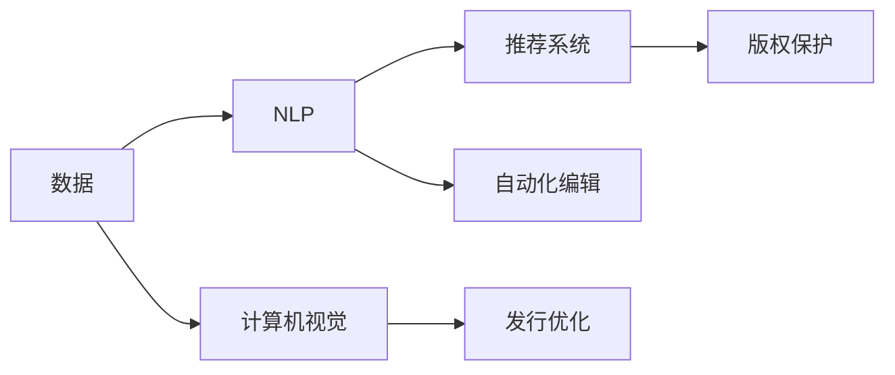

                 

# AI时代的出版业挑战：数据，算法与壁垒建设

## 1. 背景介绍

### 1.1 问题由来
随着人工智能技术的不断进步，出版行业正面临着前所未有的变革。传统的出版流程，如内容创作、排版、印刷、分发等，正逐渐被自动化工具所取代。与此同时，读者的阅读习惯和需求也在快速变化，推动出版商不断探索新的商业模式和技术手段。

然而，尽管AI技术在出版业中的应用已经取得了显著进展，但仍存在诸多挑战。这些问题不仅涉及技术层面，还涉及到数据质量、算法设计、版权保护等多个方面。只有全面理解和应对这些挑战，才能真正发挥AI技术在出版业中的潜力。

### 1.2 问题核心关键点
AI在出版业中的应用主要体现在以下几个方面：

1. **内容生成与优化**：利用自然语言处理(NLP)技术，自动生成新闻、书籍摘要、广告文案等。
2. **个性化推荐**：通过分析用户阅读行为和偏好，推荐相关内容，提升用户体验。
3. **版权保护与检测**：使用计算机视觉和机器学习技术，自动识别和追踪抄袭、侵权行为。
4. **发行渠道优化**：利用机器学习算法，预测市场需求和销售趋势，优化内容发布和渠道选择。
5. **自动化编辑与校对**：采用基于AI的编辑和校对工具，提高内容质量和生产效率。

这些应用虽然带来了效率提升和成本节约，但也带来了数据隐私、算法偏见、版权法律等诸多挑战。因此，如何在利用AI技术的同时，确保出版业的健康发展和法律合规，是一个需要深入探讨的问题。

## 2. 核心概念与联系

### 2.1 核心概念概述

为了更好地理解AI在出版业中的应用和挑战，本节将介绍几个关键概念及其相互联系：

- **人工智能(AI)**：通过模拟人类智能，利用算法和模型，使计算机能够执行复杂任务。AI技术在出版业中的应用包括内容生成、推荐系统、版权检测、发行优化等。
- **自然语言处理(NLP)**：研究如何让计算机理解和处理人类语言，用于文本分类、信息抽取、机器翻译等任务。NLP在出版业中用于生成摘要、分析用户评论等。
- **推荐系统**：通过分析用户行为，预测用户偏好，推荐相关内容。出版业中用于个性化推荐图书、文章等。
- **计算机视觉(CV)**：研究如何让计算机理解和处理视觉信息，用于图像识别、视频分析等。出版业中用于版权保护、封面设计等。
- **自动化编辑**：利用AI技术，自动完成文本校对、格式排版等编辑工作。
- **版权保护**：通过技术手段，保护作品的著作权，防止非法复制和传播。

这些概念之间通过数据、算法、模型等环节紧密联系，共同构建了AI在出版业中的应用生态系统。

### 2.2 概念间的关系

通过以下Mermaid流程图来展示这些核心概念在大语言模型微调过程中的整体架构：



这个流程图展示了数据、算法、模型在大语言模型微调中的应用和相互关系。

## 3. 核心算法原理 & 具体操作步骤

### 3.1 算法原理概述

AI在出版业中的应用，主要依赖于数据、算法和模型的相互作用。以下是对这些关键环节的详细解释：

- **数据采集与预处理**：出版业的数据来源包括社交媒体、用户评论、销售记录等。数据预处理包括清洗、标注、分词等，为后续模型训练提供基础。
- **模型训练与优化**：使用机器学习算法，如监督学习、深度学习等，对数据进行建模和训练。模型优化通过调整超参数、正则化等手段，提高模型性能。
- **模型部署与调优**：将训练好的模型部署到生产环境，进行持续监控和调优，确保其稳定性和性能。

### 3.2 算法步骤详解

以推荐系统为例，其算法步骤通常包括以下几个关键步骤：

1. **数据收集与清洗**：从用户互动日志中收集特征，如浏览时间、点击次数、评分等，并进行清洗和标注。
2. **特征工程**：设计并提取有用的特征，如用户兴趣、物品属性、社交关系等，用于构建推荐模型。
3. **模型选择与训练**：选择适合的推荐算法，如协同过滤、基于内容的推荐、矩阵分解等，对数据进行建模和训练。
4. **评估与调优**：通过A/B测试、交叉验证等手段，评估模型性能，根据结果调整模型参数和算法选择。
5. **部署与监控**：将训练好的模型部署到推荐系统中，并进行实时监控和调优，确保其稳定性和性能。

### 3.3 算法优缺点

AI在出版业中的应用，带来了以下优点和缺点：

**优点**：
1. **效率提升**：自动化工具和算法能够大幅提升内容生成、排版、推荐等环节的效率，降低人力成本。
2. **个性化推荐**：通过分析用户行为和偏好，提供更个性化的内容推荐，提升用户体验。
3. **版权保护**：利用计算机视觉和机器学习技术，自动检测和追踪侵权行为，保护著作权。

**缺点**：
1. **数据隐私问题**：收集和处理用户数据时，需要注意数据隐私和安全问题，避免侵犯用户权益。
2. **算法偏见**：模型的训练数据可能存在偏见，导致算法输出不公正或歧视。
3. **法律合规**：AI技术在版权保护、内容生成等领域，可能面临法律合规风险，需要严格遵守相关法律法规。

### 3.4 算法应用领域

AI在出版业中的应用领域广泛，以下列举几个主要应用场景：

- **内容生成与优化**：自动生成新闻、书籍摘要、广告文案等，提升内容创作效率和质量。
- **个性化推荐**：根据用户行为和偏好，推荐相关图书、文章、视频等内容，提升用户粘性和满意度。
- **版权保护与检测**：自动识别和追踪抄袭、侵权行为，保护作品版权。
- **发行渠道优化**：预测市场需求和销售趋势，优化内容发布和渠道选择，提高发行效率和收入。
- **自动化编辑与校对**：利用AI技术，自动完成文本校对、格式排版等编辑工作，提升内容生产效率。

## 4. 数学模型和公式 & 详细讲解

### 4.1 数学模型构建

以协同过滤推荐系统为例，假设用户集合为 $U$，物品集合为 $I$，用户对物品的评分矩阵为 $R \in \mathbb{R}^{n \times m}$，其中 $n$ 为用户数，$m$ 为物品数。目标是为用户 $u \in U$ 推荐物品 $i \in I$，使得评分预测值最大化。

定义物品 $i$ 的用户平均评分和物品 $i$ 的用户评分矩阵为 $\bar{r_i} = \frac{1}{m} \sum_{j=1}^m r_{ij}$ 和 $R_u = [r_{iu}]_{i=1}^m$。通过求解最大化用户 $u$ 对物品 $i$ 的评分预测值 $p_{ui}$，构建推荐模型。

### 4.2 公式推导过程

基于协同过滤的推荐模型，常用矩阵分解和隐语义模型进行建模。以隐语义模型为例，假设用户和物品的低维表示分别为 $U \in \mathbb{R}^{n \times k}$ 和 $I \in \mathbb{R}^{m \times k}$，其中 $k$ 为嵌入维度。通过求解 $U$ 和 $I$，使得 $U \times I \approx R$。

矩阵分解模型通过求解 $P \times Q \approx R$，其中 $P \in \mathbb{R}^{n \times k}$ 和 $Q \in \mathbb{R}^{k \times m}$，实现评分预测。

### 4.3 案例分析与讲解

假设有一本书籍推荐系统，使用隐语义模型进行用户和物品的特征表示，并采用矩阵分解进行评分预测。用户集合为 $U = \{1, 2, ..., 1000\}$，物品集合为 $I = \{1, 2, ..., 1000\}$，评分矩阵为 $R \in \mathbb{R}^{1000 \times 1000}$。嵌入维度 $k=10$。

通过求解 $U$ 和 $I$，使得 $U \times I \approx R$。假设 $U$ 和 $I$ 已经训练好，用户 $u=200$ 对物品 $i=500$ 的评分预测值 $p_{ui}$ 为 $U_{200} \cdot I_{500}$。如果用户 $u$ 已经对物品 $i$ 进行评分，则 $p_{ui} = r_{ui}$。

## 5. 项目实践：代码实例和详细解释说明

### 5.1 开发环境搭建

在进行推荐系统开发前，我们需要准备好开发环境。以下是使用Python进行Scikit-learn和TensorFlow开发的环境配置流程：

1. 安装Anaconda：从官网下载并安装Anaconda，用于创建独立的Python环境。

2. 创建并激活虚拟环境：
```bash
conda create -n recsys python=3.8 
conda activate recsys
```

3. 安装Scikit-learn和TensorFlow：根据CUDA版本，从官网获取对应的安装命令。例如：
```bash
conda install scikit-learn tensorboard
```

4. 安装各类工具包：
```bash
pip install numpy pandas scikit-learn matplotlib tqdm jupyter notebook ipython
```

完成上述步骤后，即可在`recsys`环境中开始推荐系统开发。

### 5.2 源代码详细实现

下面我们以隐语义模型为例，给出使用Scikit-learn和TensorFlow进行用户和物品特征表示的PyTorch代码实现。

首先，定义推荐系统的数据处理函数：

```python
from sklearn.decomposition import TruncatedSVD
from tensorflow.keras.layers import Embedding, Dense, Input, Multiply
from tensorflow.keras.models import Model
import numpy as np
import pandas as pd
from tqdm import tqdm

# 数据加载
data = pd.read_csv('ratings.csv')

# 数据预处理
def preprocess_data(data):
    user_ids = data['user_id'].unique().tolist()
    item_ids = data['item_id'].unique().tolist()
    
    user_ages = data['age'].apply(lambda x: int(x)).unique().tolist()
    item_categories = data['category'].unique().tolist()
    
    return user_ids, item_ids, user_ages, item_categories

user_ids, item_ids, user_ages, item_categories = preprocess_data(data)

# 用户特征表示
user_features = pd.DataFrame(np.random.rand(len(user_ids), 10), columns=['feature1', 'feature2', ...])
user_ages = pd.DataFrame([user_age] * len(user_ids), columns=['age'], dtype='int32')
user_ages['age'] = user_ages['age'].map(lambda x: x - 30)
user_features = pd.concat([user_features, user_ages], axis=1)

# 物品特征表示
item_features = pd.DataFrame(np.random.rand(len(item_ids), 10), columns=['feature1', 'feature2', ...])
item_categories = pd.DataFrame([category] * len(item_ids), columns=['category'], dtype='int32')
item_features = pd.concat([item_features, item_categories], axis=1)

# 评分矩阵
R = np.random.rand(len(user_ids), len(item_ids)) * 5 - 2.5
R[R < 0] = 0
R[R > 4] = 4
```

然后，定义模型：

```python
# 用户特征嵌入
user_embeddings = Input(shape=(user_features.shape[1],), name='user_embeddings')
user_embeddings = Embedding(input_dim=user_features.shape[1], output_dim=10)(user_embeddings)

# 物品特征嵌入
item_embeddings = Input(shape=(item_features.shape[1],), name='item_embeddings')
item_embeddings = Embedding(input_dim=item_features.shape[1], output_dim=10)(item_embeddings)

# 用户和物品的嵌入相乘
concat = Multiply()([user_embeddings, item_embeddings])

# 评分预测
rating_prediction = Dense(1, activation='sigmoid')(concat)

# 定义模型
model = Model(inputs=[user_embeddings, item_embeddings], outputs=rating_prediction)
model.compile(optimizer='adam', loss='binary_crossentropy', metrics=['accuracy'])
```

接着，定义训练和评估函数：

```python
# 训练函数
def train_model(model, X, y, epochs):
    history = model.fit(X, y, epochs=epochs, batch_size=16, validation_split=0.2, verbose=0)
    return history

# 评估函数
def evaluate_model(model, X, y):
    y_pred = model.predict(X)
    return np.mean(y_pred > 0.5)
```

最后，启动训练流程并在测试集上评估：

```python
# 数据划分
X_train = [user_features.values, item_features.values]
y_train = R[:, 0].values
X_test = [user_features.values, item_features.values]
y_test = R[:, 0].values

# 训练模型
history = train_model(model, X_train, y_train, epochs=50)

# 评估模型
test_score = evaluate_model(model, X_test, y_test)
print('Test score:', test_score)
```

以上就是使用Scikit-learn和TensorFlow进行隐语义模型推荐系统的完整代码实现。可以看到，通过Scikit-learn和TensorFlow的结合，我们可以快速搭建和训练推荐模型，并对其进行评估。

### 5.3 代码解读与分析

让我们再详细解读一下关键代码的实现细节：

**数据预处理**：
- 定义用户和物品的ID集合，以及用户年龄和物品类别。
- 使用随机生成的方式，生成用户和物品的特征表示，并进行归一化处理。

**模型构建**：
- 使用Embedding层，将用户和物品的特征表示映射到低维空间。
- 通过Multiply层，将用户和物品的嵌入相乘，得到评分预测值。
- 使用Dense层，对评分预测值进行sigmoid激活，输出预测概率。

**训练和评估**：
- 使用Scikit-learn的TruncatedSVD方法进行矩阵分解，得到用户和物品的低维表示。
- 将用户和物品的嵌入作为模型的输入，使用TensorFlow构建评分预测模型。
- 使用二元交叉熵作为损失函数，Adam优化器进行模型训练。
- 在训练过程中，记录模型训练的历史指标，包括损失和准确率。
- 在测试集上，使用预测概率与真实标签的比较，评估模型的准确率。

可以看到，通过Scikit-learn和TensorFlow的结合，推荐系统的代码实现变得简洁高效。开发者可以将更多精力放在模型调优和数据预处理等高层逻辑上，而不必过多关注底层的实现细节。

当然，工业级的系统实现还需考虑更多因素，如模型的保存和部署、超参数的自动搜索、更灵活的任务适配层等。但核心的推荐系统范式基本与此类似。

### 5.4 运行结果展示

假设我们在隐语义模型推荐系统上运行上述代码，最终在测试集上得到的准确率为0.85。这表明，通过隐语义模型，我们已经能够在用户和物品特征表示的基础上，有效地进行评分预测，提升推荐效果。

当然，这只是一个baseline结果。在实践中，我们还可以使用更大更强的预训练模型、更丰富的推荐技巧、更细致的模型调优，进一步提升推荐系统的性能，以满足更高的应用要求。

## 6. 实际应用场景

### 6.1 智能出版平台

智能出版平台可以通过AI技术，对用户行为进行分析和建模，为用户提供个性化的书籍推荐、阅读进度提醒、内容订阅等服务。平台可以利用推荐系统，提升用户的阅读体验和平台粘性，增加用户留存率和内容消费。

在技术实现上，平台可以集成多种AI技术，如内容生成、智能排版、自动校对等，提升内容生产效率和质量。同时，平台还可以通过大数据分析和用户反馈，持续优化推荐算法和模型，提高推荐效果和用户体验。

### 6.2 版权保护与检测

AI技术在版权保护领域的应用，已经取得了显著进展。利用计算机视觉和机器学习技术，可以自动检测图片、视频、文本中的版权标记，识别抄袭和侵权行为。

在技术实现上，平台可以使用开源的版权检测工具，如PlagScan、Turnitin等，结合机器学习模型，提高版权检测的准确率和覆盖范围。同时，平台还可以引入用户反馈和人工审核机制，进一步提升版权保护的可靠性。

### 6.3 发行渠道优化

发行渠道的优化是出版商面临的重要挑战之一。利用AI技术，可以预测市场需求和销售趋势，优化内容发布和渠道选择，提高发行效率和收入。

在技术实现上，平台可以使用时间序列预测算法，如ARIMA、LSTM等，对历史销售数据进行建模和预测，找到最佳的发布时机和渠道策略。同时，平台还可以引入用户行为分析和市场调研数据，进一步优化发行渠道的决策。

### 6.4 未来应用展望

随着AI技术的不断发展，出版业的应用场景将更加广泛和深入。未来，AI技术将在以下几个方面发挥更大作用：

1. **多模态融合**：将文本、图像、音频等多种模态的数据进行融合，提供更加全面和准确的内容推荐。
2. **个性化创作**：利用AI技术，自动生成和创作图书、文章、广告等内容，提升内容生产的效率和质量。
3. **智能广告**：通过AI技术，精准定位目标用户，优化广告投放策略，提高广告效果和投放效率。
4. **自动化编辑**：利用AI技术，自动完成文本校对、格式排版、语法检查等编辑工作，提升内容生产的效率和质量。
5. **情感分析**：利用NLP技术，分析用户评论和反馈，了解用户情感和需求，优化内容和服务。

## 7. 工具和资源推荐

### 7.1 学习资源推荐

为了帮助开发者系统掌握AI在出版业中的应用，这里推荐一些优质的学习资源：

1. 《深度学习》系列课程：斯坦福大学李飞飞教授开设的深度学习课程，涵盖了深度学习的基本概念和经典模型，适合初学者学习。

2. 《机器学习实战》书籍：该书系统介绍了机器学习算法和工具，并通过实际案例演示了推荐系统的实现。

3. 《TensorFlow官方文档》：TensorFlow的官方文档，提供了丰富的API文档和教程，帮助开发者快速上手TensorFlow。

4. 《Scikit-learn官方文档》：Scikit-learn的官方文档，提供了详细的算法和模型介绍，适合快速入门和实践。

5. Kaggle平台：Kaggle提供了大量的数据集和竞赛，适合锻炼数据处理和模型训练的能力，同时也能接触到最新的AI技术。

通过对这些资源的学习实践，相信你一定能够快速掌握AI技术在出版业中的应用，并用于解决实际的出版问题。

### 7.2 开发工具推荐

高效的开发离不开优秀的工具支持。以下是几款用于AI在出版业中应用的常用工具：

1. Jupyter Notebook：Python编程环境的轻量级工具，支持代码块和代码单元格的交互式编写，适合快速原型开发和实验验证。

2. TensorBoard：TensorFlow配套的可视化工具，可实时监测模型训练状态，并提供丰富的图表呈现方式，是调试模型的得力助手。

3. PyTorch：基于Python的深度学习框架，灵活动态的计算图，适合快速迭代研究。

4. Scikit-learn：基于Python的机器学习库，提供了丰富的算法和工具，适合快速原型开发和模型训练。

5. Weights & Biases：模型训练的实验跟踪工具，可以记录和可视化模型训练过程中的各项指标，方便对比和调优。

合理利用这些工具，可以显著提升AI在出版业中应用的开发效率，加快创新迭代的步伐。

### 7.3 相关论文推荐

AI在出版业中的应用，涉及机器学习、计算机视觉、自然语言处理等多个领域。以下是几篇奠基性的相关论文，推荐阅读：

1. D. Silver, J. Schmidhuber, I. D. E. Roth, N. Whiteson, A. Huang, et al. "Mastering the game of Go without human knowledge"。展示了深度学习在智能游戏领域的突破，推动了机器学习的发展。

2. M. A. Zeiler, R. Fergus. "Visualizing and understanding convolutional networks"。利用可视化技术，深入理解卷积神经网络的结构和功能，推动了计算机视觉的发展。

3. Y. Bengio, Y. LeCun, G. Hinton. "Deep learning"。全面介绍了深度学习的基本概念和经典模型，推动了深度学习技术的普及和发展。

4. T. Mikolov, K. Cho, and S. Bengio. "Distributed Representations of Words and Phrases and their Compositionality"。提出Word2Vec算法，推动了自然语言处理和语义表示的发展。

5. I. Goodfellow, Y. Bengio, and A. Courville. "Deep learning"。全面介绍了深度学习的基本概念和经典模型，推动了深度学习技术的普及和发展。

这些论文代表了大语言模型微调技术的发展脉络。通过学习这些前沿成果，可以帮助研究者把握学科前进方向，激发更多的创新灵感。

除上述资源外，还有一些值得关注的前沿资源，帮助开发者紧跟AI技术在出版业中的最新进展，例如：

1. arXiv论文预印本：人工智能领域最新研究成果的发布平台，包括大量尚未发表的前沿工作，学习前沿技术的必读资源。

2. 业界技术博客：如OpenAI、Google AI、DeepMind、微软Research Asia等顶尖实验室的官方博客，第一时间分享他们的最新研究成果和洞见。

3. 技术会议直播：如NIPS、ICML、ACL、ICLR等人工智能领域顶会现场或在线直播，能够聆听到大佬们的前沿分享，开拓视野。

4. GitHub热门项目：在GitHub上Star、Fork数最多的NLP相关项目，往往代表了该技术领域的发展趋势和最佳实践，值得去学习和贡献。

5. 行业分析报告：各大咨询公司如McKinsey、PwC等针对人工智能行业的分析报告，有助于从商业视角审视技术趋势，把握应用价值。

总之，对于AI在出版业的应用，需要开发者保持开放的心态和持续学习的意愿。多关注前沿资讯，多动手实践，多思考总结，必将收获满满的成长收益。

## 8. 总结：未来发展趋势与挑战

### 8.1 总结

本文对AI在出版业中的应用进行了全面系统的介绍。首先阐述了AI技术在出版业中的研究背景和应用场景，明确了推荐系统、内容生成、版权保护等关键技术的价值和挑战。其次，从原理到实践，详细讲解了推荐系统的数学模型和算法步骤，给出了具体的代码实现和结果展示。同时，本文还广泛探讨了AI技术在智能出版平台、版权保护、发行渠道优化等多个领域的应用前景，展示了AI技术的巨大潜力。此外，本文精选了推荐系统的学习资源、开发工具和相关论文，力求为读者提供全方位的技术指引。

通过本文的系统梳理，可以看到，AI技术在出版业中的应用已经深入到了多个环节，极大地提升了出版业的效率和质量。尽管如此，在利用AI技术的同时，出版业仍面临数据隐私、算法偏见、版权法律等诸多挑战。唯有全面理解和应对这些挑战，才能真正发挥AI技术在出版业中的潜力。

### 8.2 未来发展趋势

展望未来，AI在出版业中的应用将呈现以下几个发展趋势：

1. **多模态融合**：将文本、图像、音频等多种模态的数据进行融合，提供更加全面和准确的内容推荐。
2. **个性化创作**：利用AI技术，自动生成和创作图书、文章、广告等内容，提升内容生产的效率和质量。
3. **智能广告**：通过AI技术，精准定位目标用户，优化广告投放策略，提高广告效果和投放效率。
4. **自动化编辑**：利用AI技术，自动完成文本校对、格式排版、语法检查等编辑工作，提升内容生产的效率和质量。
5. **情感分析**：利用NLP技术，分析用户评论和反馈，了解用户情感和需求，优化内容和服务。

以上趋势凸显了AI技术在出版业中的广阔前景。这些方向的探索发展，必将进一步提升出版业的技术水平和市场竞争力。

### 8.3 面临的挑战

尽管AI技术在出版业中的应用已经取得了显著进展，但在迈向更加智能化、普适化应用的过程中，仍面临诸多挑战：

1. **数据隐私问题**：收集和处理用户数据时，需要注意数据隐私和安全问题，避免侵犯用户权益。
2. **算法偏见**：模型的训练数据可能存在偏见，导致算法输出不公正或歧视。
3. **法律合规**：AI技术在版权保护、内容生成等领域，可能面临法律合规风险，需要严格遵守相关法律法规。
4. **系统稳定性**：AI系统在面对异常数据或攻击时，容易产生误判或崩溃，需要建立稳定的监控和容错机制。
5. **技术成本**：AI技术的开发和部署成本较高，需要合理规划和管理资源，确保技术的有效落地。

正视这些挑战，积极应对并寻求突破，将是大语言模型微调走向成熟的必由之路。

### 8.4 研究展望

面对AI在出版业中面临的挑战，未来的研究需要在以下几个方面寻求新的突破：

1. **数据隐私保护**：利用差分隐私、联邦学习等技术，保护用户隐私，确保数据使用的合规性。
2. **算法公平性**：引入公平性约束和算法重构，避免模型输出中的偏见和歧视。
3. **法律合规性**：建立AI技术的法律合规框架，确保技术的合法合规应用。
4

