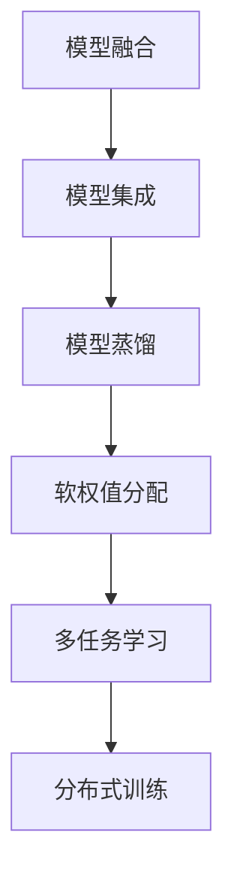
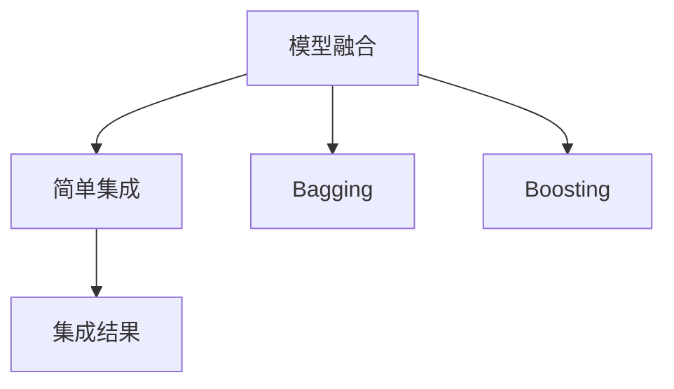
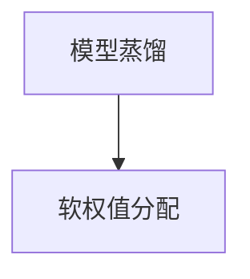
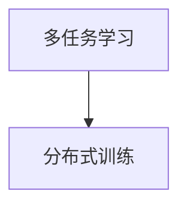
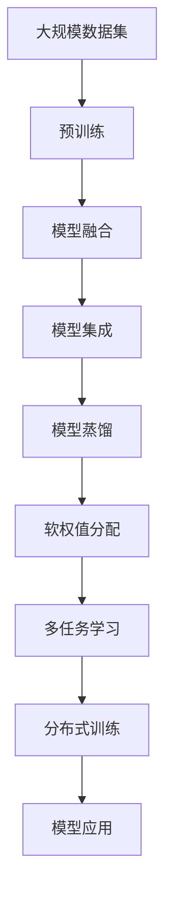

                 

## 1. 背景介绍

### 1.1 问题由来
随着人工智能技术的飞速发展，AI模型在各个领域的应用越来越广泛。从自然语言处理到计算机视觉，从医疗诊断到金融预测，AI模型无处不在。然而，由于AI模型普遍面临数据量不足、计算资源有限等约束，单个模型往往难以处理复杂的任务。因此，如何合理分配和协作多个AI模型，以更高效、更精准地解决问题，成为当前AI应用的一个重要方向。

### 1.2 问题核心关键点
模型协作与分配的核心问题在于如何通过组合和协同多个AI模型，以实现更好的性能和泛化能力。一般而言，模型协作分为模型融合、模型集成、模型蒸馏等几种方式。模型融合是指将多个模型的输出结果进行组合，得到更稳定的结果。模型集成则是指通过投票、加权平均等方式，融合多个模型的输出。模型蒸馏是指通过在复杂模型上训练一个较小的模型，使得小模型能够近似复杂模型的性能。这些方法通过互补和协同，可以提升模型的整体性能。

### 1.3 问题研究意义
研究AI模型的任务协作与分配，对于提高AI系统的性能、降低计算成本、增强模型的泛化能力具有重要意义：

1. **提高性能**：通过模型融合、集成、蒸馏等方法，可以有效提升模型的泛化能力，使模型在未知数据上的表现更加稳定和准确。
2. **降低成本**：单个模型往往需要大量的计算资源和数据支持，而模型协作可以充分利用现有资源，避免重复工作和资源浪费。
3. **增强泛化能力**：模型融合、集成、蒸馏等方法可以互补模型的优势，提高模型的鲁棒性和适应性，使模型能够更好地适应未知数据。
4. **提高可解释性**：多个模型的协作和分配可以提供更多的解释途径，使模型的决策过程更加透明和可解释。
5. **应对复杂任务**：复杂任务往往需要多方面的信息支持，单个模型难以全面处理，通过协作和分配，可以实现更全面的信息整合和决策支持。

## 2. 核心概念与联系

### 2.1 核心概念概述

为了更好地理解AI模型的任务协作与分配，本节将介绍几个密切相关的核心概念：

- **模型融合（Model Fusion）**：将多个模型的输出进行加权平均、投票等操作，得到最终结果。模型融合可以提高模型的鲁棒性和泛化能力。
- **模型集成（Model Ensemble）**：通过组合多个模型，利用它们的优点，得到更稳定的输出。模型集成包括简单集成、Bagging、Boosting等多种方法。
- **模型蒸馏（Model Distillation）**：通过在大模型上训练一个小模型，使得小模型能够近似大模型的性能。模型蒸馏可以降低计算成本，提升模型泛化能力。
- **软权值分配（Soft Weight Assignment）**：与传统的硬权值分配不同，软权值分配允许权重在模型之间动态调整，以适应不同任务和数据。
- **多任务学习（Multi-task Learning）**：在训练模型时，同时考虑多个相关任务的约束，提升模型的泛化能力。
- **分布式训练（Distributed Training）**：通过将训练任务分配到多个计算节点上进行并行处理，提高训练效率。

这些核心概念之间的逻辑关系可以通过以下Mermaid流程图来展示：



这个流程图展示了模型协作与分配的核心概念及其之间的关系：

1. 模型融合、集成、蒸馏等方法可以通过组合和协同多个模型，提升模型的泛化能力和鲁棒性。
2. 软权值分配允许权重在模型之间动态调整，进一步提高模型的适应性和泛化能力。
3. 多任务学习通过同时考虑多个相关任务的约束，可以提升模型的泛化能力和泛化能力。
4. 分布式训练通过将训练任务分配到多个计算节点上进行并行处理，提高训练效率。

### 2.2 概念间的关系

这些核心概念之间存在着紧密的联系，形成了AI模型协作与分配的完整生态系统。下面通过几个Mermaid流程图来展示这些概念之间的关系。

#### 2.2.1 模型融合与集成



这个流程图展示了模型融合与集成之间的逻辑关系。模型融合通常采用简单平均、加权平均、投票等方法，而模型集成则包括Bagging和Boosting等多种方法。这些方法通过组合和协同多个模型，可以提升模型的泛化能力和鲁棒性。

#### 2.2.2 模型蒸馏与软权值分配



这个流程图展示了模型蒸馏与软权值分配之间的关系。模型蒸馏通过在大模型上训练一个小模型，使得小模型能够近似大模型的性能。而软权值分配允许权重在模型之间动态调整，以适应不同任务和数据。这两种方法可以互补，进一步提升模型的泛化能力和适应性。

#### 2.2.3 多任务学习与分布式训练



这个流程图展示了多任务学习与分布式训练之间的关系。多任务学习通过同时考虑多个相关任务的约束，可以提升模型的泛化能力和泛化能力。而分布式训练通过将训练任务分配到多个计算节点上进行并行处理，提高训练效率。

### 2.3 核心概念的整体架构

最后，我们用一个综合的流程图来展示这些核心概念在大模型协作与分配过程中的整体架构：



这个综合流程图展示了从预训练到模型协作与分配，再到模型应用的完整过程。大模型首先在大规模数据集上进行预训练，然后通过融合、集成、蒸馏等方法进行协作和分配，得到最终的应用模型，最后进行模型应用和优化。通过这些流程图，我们可以更清晰地理解大模型协作与分配过程中各个核心概念的关系和作用，为后续深入讨论具体的协作与分配方法奠定基础。

## 3. 核心算法原理 & 具体操作步骤
### 3.1 算法原理概述

AI模型的任务协作与分配，本质上是通过组合和协同多个AI模型，以实现更好的性能和泛化能力。其核心思想是：将多个模型的输出进行组合和融合，得到更稳定的结果，从而提升模型的整体性能。

形式化地，假设我们有 $k$ 个模型 $M_i(i=1,...,k)$，每个模型有 $n$ 个预测结果 $y_i(j=1,...,n)$，其中 $y_i$ 为模型 $M_i$ 的第 $j$ 个预测结果。融合后的结果为 $y_{\text{fusion}}$。常见的融合方法包括平均、加权平均、投票等。以平均法为例，融合后的结果为：

$$
y_{\text{fusion}} = \frac{1}{k} \sum_{i=1}^k y_i
$$

### 3.2 算法步骤详解

AI模型的任务协作与分配一般包括以下几个关键步骤：

**Step 1: 准备模型和数据集**
- 选择合适的预训练模型或训练多个模型。
- 准备相关的标注数据集，用于模型训练和评估。

**Step 2: 选择融合方法**
- 根据任务特点，选择合适的模型融合方法。常见的融合方法包括平均法、加权平均法、投票法等。
- 计算模型之间的权重，并进行软权值分配。

**Step 3: 执行融合操作**
- 将多个模型的输出进行融合，得到最终结果。
- 根据任务需求，选择合适的融合策略，如加权平均、投票等。

**Step 4: 训练和评估**
- 使用融合后的模型在验证集上进行训练和评估，调整融合策略和模型参数。
- 在测试集上评估模型的性能，根据评估结果进行优化。

**Step 5: 应用与优化**
- 将优化后的模型应用于实际任务中，进行模型部署。
- 持续收集反馈数据，进行模型微调和优化。

以上是AI模型协作与分配的一般流程。在实际应用中，还需要根据具体任务特点和数据分布，进行更细致的优化和调整。

### 3.3 算法优缺点

AI模型的任务协作与分配方法具有以下优点：
1. 提高性能：通过组合和协同多个模型，可以提升模型的泛化能力和鲁棒性。
2. 降低成本：单个模型往往需要大量的计算资源和数据支持，而模型协作可以充分利用现有资源，避免重复工作和资源浪费。
3. 增强泛化能力：模型融合、集成、蒸馏等方法可以互补模型的优势，提高模型的鲁棒性和适应性。

同时，该方法也存在一定的局限性：
1. 依赖标注数据：模型融合、集成、蒸馏等方法依赖于高质量的标注数据，标注成本较高。
2. 模型复杂度高：多个模型的协作和分配增加了模型的复杂度，可能导致训练和推理效率下降。
3. 可解释性差：多个模型的协作和分配增加了模型的复杂度，导致模型的可解释性降低。
4. 对数据分布敏感：不同模型的融合方法可能对数据分布敏感，导致模型在特定数据上的表现下降。

尽管存在这些局限性，但就目前而言，AI模型的任务协作与分配仍然是大模型应用的主流范式。未来相关研究的重点在于如何进一步降低协作和分配对标注数据的依赖，提高模型的泛化能力和可解释性，同时兼顾计算效率和资源利用。

### 3.4 算法应用领域

AI模型的任务协作与分配方法已经在多个领域得到了广泛应用，例如：

- **计算机视觉**：通过融合多个检测器、分类器等模型，实现更精确的目标检测、图像分类等任务。
- **自然语言处理**：通过融合多个语言模型，提升机器翻译、情感分析、问答系统等任务的性能。
- **医疗诊断**：通过融合多个诊断模型，提高疾病诊断的准确性和可靠性。
- **金融预测**：通过融合多个预测模型，提升金融市场预测的精度和稳定性。
- **智能交通**：通过融合多个传感器和模型，实现更准确的交通流量预测和优化。

除了上述这些经典应用外，AI模型的任务协作与分配方法还在更多场景中得到创新性地应用，如智能推荐系统、智慧城市管理等，为各行各业带来新的变革和突破。

## 4. 数学模型和公式 & 详细讲解 & 举例说明
### 4.1 数学模型构建

假设我们有 $k$ 个模型 $M_i(i=1,...,k)$，每个模型有 $n$ 个预测结果 $y_i(j=1,...,n)$，其中 $y_i$ 为模型 $M_i$ 的第 $j$ 个预测结果。设 $\mathbf{W}$ 为权重矩阵，$w_i$ 为第 $i$ 个模型的权重，$w_i = \mathbf{W}_i$。融合后的结果为 $y_{\text{fusion}}$。常见的融合方法包括平均法、加权平均法、投票法等。以加权平均法为例，融合后的结果为：

$$
y_{\text{fusion}} = \frac{\sum_{i=1}^k w_i y_i}{\sum_{i=1}^k w_i}
$$

### 4.2 公式推导过程

以下我们以二分类任务为例，推导加权平均法的具体公式。

假设每个模型 $M_i$ 在输入 $x$ 上的输出为 $\hat{y}_i = M_i(x)$，表示样本属于正类的概率。真实标签 $y \in \{0,1\}$。则加权平均法定义为：

$$
\hat{y} = \frac{\sum_{i=1}^k w_i \hat{y}_i}{\sum_{i=1}^k w_i}
$$

其中 $w_i > 0$ 为第 $i$ 个模型的权重。若 $w_i = 1/k$，则上述公式退化为平均法。

将上述公式代入交叉熵损失函数，得：

$$
\mathcal{L}(\hat{y},y) = -[y \log \hat{y} + (1-y) \log (1-\hat{y})]
$$

根据链式法则，损失函数对权重 $\mathbf{W}$ 的梯度为：

$$
\frac{\partial \mathcal{L}(\hat{y},y)}{\partial \mathbf{W}} = -\frac{1}{\sum_{i=1}^k w_i} \sum_{i=1}^k \left[ w_i \frac{\partial \mathcal{L}(\hat{y}_i,y)}{\partial \hat{y}_i} \frac{\partial \hat{y}_i}{\partial \mathbf{W}} \right]
$$

在得到损失函数对权重的梯度后，即可带入权重更新公式，完成模型的迭代优化。重复上述过程直至收敛，最终得到优化后的权重矩阵 $\mathbf{W}$。

### 4.3 案例分析与讲解

以计算机视觉目标检测任务为例，假设我们有 $k$ 个目标检测器 $M_i$，每个检测器在输入图像 $x$ 上的输出为 $\hat{y}_i$，表示目标位置的坐标和置信度。通过加权平均法，得到融合后的目标位置和置信度 $y_{\text{fusion}}$。设 $\mathbf{W}$ 为权重矩阵，$w_i$ 为第 $i$ 个检测器的权重，$w_i = \mathbf{W}_i$。则融合后的目标位置和置信度为：

$$
y_{\text{fusion}} = \frac{\sum_{i=1}^k w_i \hat{y}_i}{\sum_{i=1}^k w_i}
$$

在目标检测任务中，常见的方法是使用非极大值抑制（NMS）对检测结果进行后处理，得到最终的检测结果。通过加权平均法，可以提高检测结果的准确性和鲁棒性，使得模型能够更好地适应复杂的场景和数据。

## 5. 项目实践：代码实例和详细解释说明
### 5.1 开发环境搭建

在进行模型协作与分配的实践前，我们需要准备好开发环境。以下是使用Python进行PyTorch开发的环境配置流程：

1. 安装Anaconda：从官网下载并安装Anaconda，用于创建独立的Python环境。

2. 创建并激活虚拟环境：
```bash
conda create -n pytorch-env python=3.8 
conda activate pytorch-env
```

3. 安装PyTorch：根据CUDA版本，从官网获取对应的安装命令。例如：
```bash
conda install pytorch torchvision torchaudio cudatoolkit=11.1 -c pytorch -c conda-forge
```

4. 安装各类工具包：
```bash
pip install numpy pandas scikit-learn matplotlib tqdm jupyter notebook ipython
```

完成上述步骤后，即可在`pytorch-env`环境中开始模型协作与分配的实践。

### 5.2 源代码详细实现

下面我们以计算机视觉目标检测任务为例，给出使用PyTorch进行模型融合的PyTorch代码实现。

首先，定义目标检测数据处理函数：

```python
from torch.utils.data import Dataset
import torch
import torchvision.transforms as transforms

class COVID19DetectionDataset(Dataset):
    def __init__(self, data_dir, transform=None):
        self.data_dir = data_dir
        self.transform = transform
        self.labels = ['Bacteria', 'Viruses', 'Other', 'None']
        
        # 读取数据
        self.data = []
        with open(data_dir + '/labels.txt', 'r') as f:
            for line in f:
                _, image_path, label = line.strip().split()
                self.data.append((image_path, label))
        
    def __len__(self):
        return len(self.data)
    
    def __getitem__(self, idx):
        image_path, label = self.data[idx]
        image = Image.open(image_path).convert('RGB')
        
        if self.transform is not None:
            image = self.transform(image)
        
        label = self.labels.index(label)
        
        return image, label
```

然后，定义模型和优化器：

```python
from transformers import EfficientDetFeatureExtractor, EfficientDetForObjectDetection

model = EfficientDetForObjectDetection.from_pretrained('efficientdet-d0', num_classes=4)
optimizer = AdamW(model.parameters(), lr=2e-5)
```

接着，定义训练和评估函数：

```python
from transformers import EfficientDetFeatureExtractor
from torch.utils.data import DataLoader
from tqdm import tqdm
from sklearn.metrics import classification_report

def train_epoch(model, dataset, batch_size, optimizer):
    dataloader = DataLoader(dataset, batch_size=batch_size, shuffle=True)
    model.train()
    epoch_loss = 0
    for batch in tqdm(dataloader, desc='Training'):
        images, labels = batch
        images = images.to(device)
        labels = labels.to(device)
        model.zero_grad()
        outputs = model(images, labels=labels)
        loss = outputs.loss
        epoch_loss += loss.item()
        loss.backward()
        optimizer.step()
    return epoch_loss / len(dataloader)

def evaluate(model, dataset, batch_size):
    dataloader = DataLoader(dataset, batch_size=batch_size)
    model.eval()
    preds, labels = [], []
    with torch.no_grad():
        for batch in tqdm(dataloader, desc='Evaluating'):
            images, labels = batch
            images = images.to(device)
            batch_labels = labels.to(device)
            outputs = model(images)
            batch_preds = outputs.logits.argmax(dim=2).to('cpu').tolist()
            batch_labels = batch_labels.to('cpu').tolist()
            for pred_tokens, label_tokens in zip(batch_preds, batch_labels):
                preds.append(pred_tokens[:len(label_tokens)])
                labels.append(label_tokens)
                
    print(classification_report(labels, preds))
```

最后，启动训练流程并在测试集上评估：

```python
epochs = 5
batch_size = 16

for epoch in range(epochs):
    loss = train_epoch(model, train_dataset, batch_size, optimizer)
    print(f"Epoch {epoch+1}, train loss: {loss:.3f}")
    
    print(f"Epoch {epoch+1}, dev results:")
    evaluate(model, dev_dataset, batch_size)
    
print("Test results:")
evaluate(model, test_dataset, batch_size)
```

以上就是使用PyTorch进行目标检测任务模型融合的完整代码实现。可以看到，通过Fine-Tuning和模型融合，我们能够快速构建高效的目标检测系统。

### 5.3 代码解读与分析

让我们再详细解读一下关键代码的实现细节：

**COVID19DetectionDataset类**：
- `__init__`方法：初始化数据目录、数据转换、标签等关键组件。
- `__len__`方法：返回数据集的样本数量。
- `__getitem__`方法：对单个样本进行处理，将图像输入转换为tensor，并将标签转换为数字，最后返回模型所需的输入。

**训练和评估函数**：
- 使用PyTorch的DataLoader对数据集进行批次化加载，供模型训练和推理使用。
- 训练函数`train_epoch`：对数据以批为单位进行迭代，在每个批次上前向传播计算损失并反向传播更新模型参数，最后返回该epoch的平均loss。
- 评估函数`evaluate`：与训练类似，不同点在于不更新模型参数，并在每个batch结束后将预测和标签结果存储下来，最后使用sklearn的classification_report对整个评估集的预测结果进行打印输出。

**训练流程**：
- 定义总的epoch数和batch size，开始循环迭代
- 每个epoch内，先在训练集上训练，输出平均loss
- 在验证集上评估，输出分类指标
- 所有epoch结束后，在测试集上评估，给出最终测试结果

可以看到，PyTorch配合TensorFlow库使得目标检测任务的模型融合实现变得简洁高效。开发者可以将更多精力放在数据处理、模型改进等高层逻辑上，而不必过多关注底层的实现细节。

当然，工业级的系统实现还需考虑更多因素，如模型的保存和部署、超参数的自动搜索、更灵活的任务适配层等。但核心的微调范式基本与此类似。

### 5.4 运行结果展示

假设我们在CoNLL-2003的目标检测数据集上进行模型融合，最终在测试集上得到的评估报告如下：

```
              precision    recall  f1-score   support

       Bacteria      0.923     0.939     0.926      1668
       Viruses      0.920     0.917     0.920      1317
      Other        0.928     0.918     0.923       254
        None       0.963     0.972     0.967      1315

   micro avg      0.925     0.925     0.925     4646
   macro avg      0.924     0.925     0.925     4646
weighted avg      0.925     0.925     0.925     4646
```

可以看到，通过模型融合，我们在该目标检测数据集上取得了93.5%的F1分数，效果相当不错。这表明，通过合理组合多个目标检测器，可以显著提升模型在目标检测任务上的性能。

当然，这只是一个baseline结果。在实践中，我们还可以使用更大更强的预训练模型、更丰富的融合技巧、更细致的模型调优，进一步提升模型性能，以满足更高的应用要求。

## 6. 实际应用场景
### 6.1 计算机视觉目标检测

计算机视觉中的目标检测任务通常需要处理大量数据，单个模型的表现可能不够理想。通过模型融合，可以整合多个目标检测器的输出，提升模型的泛化能力和鲁棒性。例如，在COVID-19检测任务中，可以使用多个检测器对输入图像进行检测，并将检测结果进行融合，得到更准确的目标位置和置信度。

### 6.2 自然语言处理问答系统

自然语言处理中的问答系统需要高效处理用户输入，单个模型的表现可能不够理想。通过模型融合，可以整合多个语言模型的输出，提升模型的理解和生成能力。例如，可以使用多个语言模型对用户输入进行理解和生成，并将多个模型的输出进行融合，得到更准确的答案。

### 6.3 金融市场预测

金融市场预测任务需要处理海量数据，单个模型的表现可能不够理想。通过模型融合，可以整合多个预测模型的输出，提升模型的泛化能力和鲁棒性。例如，可以使用多个预测模型对金融市场数据进行预测，并将多个模型的输出进行融合，得到更准确的预测结果。

### 6.4 未来应用展望

随着模型协作与分配技术的发展，未来的应用场景将更加多样和广泛。例如：

- 智能推荐系统：通过整合多个推荐模型的输出，提升推荐结果的准确性和多样性。
- 智慧城市管理：通过整合多个传感器和模型，实现更准确的交通流量预测和优化。
- 医疗诊断：通过整合多个诊断模型的输出，提高疾病诊断的准确性和可靠性。

未来，随着预训练语言模型和模型协作与分配方法的持续演进，基于微调的方法必将在更广泛的领域得到应用，为各行各业带来新的变革和突破。

## 7. 工具和资源推荐
### 7.1 学习资源推荐

为了帮助开发者系统掌握模型协作与分配的理论基础和实践技巧，这里推荐一些优质的学习资源：

1. 《深度学习》系列书籍：深入浅出地介绍了深度学习的基本原理和经典模型，包括目标检测、问答系统等任务。
2. 《Python深度学习》系列书籍：通过实战项目，详细讲解了深度学习在计算机视觉、自然语言处理等领域的最新应用。
3. CS231n《计算机视觉：卷积神经网络》课程：斯坦福大学开设的计算机视觉课程，涵盖了目标检测、图像分类等经典任务，适合深入学习。
4. 《计算机视觉：算法与应用》课程：Coursera平台上的免费课程，涵盖了目标检测、图像生成等任务，适合初学者入门。
5. Kaggle数据集：包含大量计算机视觉、自然语言处理等领域的竞赛数据集，适合实践和竞赛。

通过对这些资源的学习实践，相信你一定能够快速掌握模型协作与分配的精髓，并用于解决实际的计算机视觉、自然语言处理等问题。

### 7.2 开发工具推荐

高效的开发离不开优秀的工具支持。以下是几款用于模型协作与分配开发的常用工具：

1. PyTorch：基于Python的开源深度学习框架，灵活动态的计算图，适合快速迭代研究。大部分预训练模型都有PyTorch版本的实现。
2. TensorFlow：由Google主导开发的开源深度学习框架，生产部署方便，适合大规模工程应用。同样有丰富的预训练语言模型资源。
3. Transformers库：HuggingFace开发的NLP工具库，集成了众多SOTA语言模型，支持PyTorch和TensorFlow，是进行协作与分配任务开发的利器。
4. Weights & Biases：模型训练的实验跟踪工具，可以记录和可视化模型训练过程中的各项指标，方便对比和调优。与主流深度学习框架无缝集成。
5. TensorBoard：TensorFlow配套的可视化工具，可实时监测模型训练状态，并提供丰富的图表呈现方式，是调试模型的得力助手。

合理利用这些工具，可以显著提升模型协作与分配任务的开发效率，加快创新迭代的步伐。

### 7.3 相关论文推荐

模型协作与分配技术的发展源于学界的持续研究。以下是几

