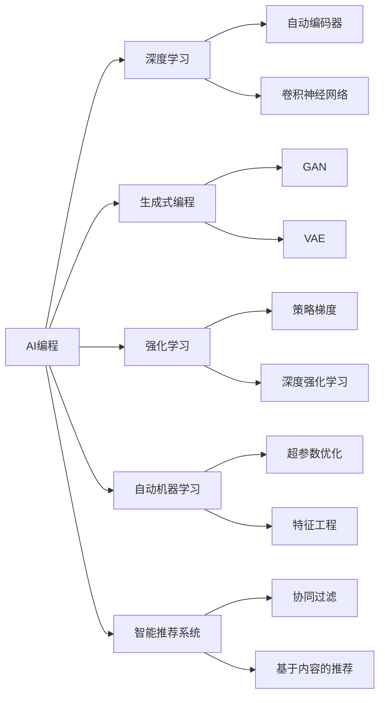
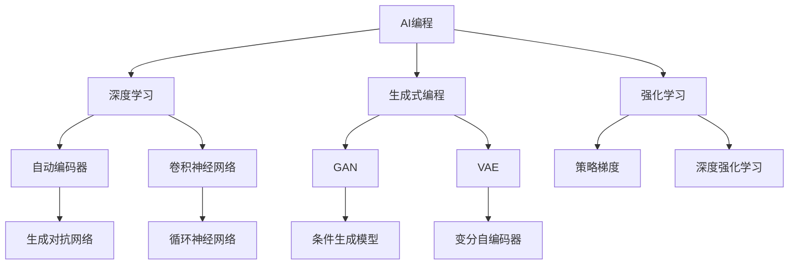
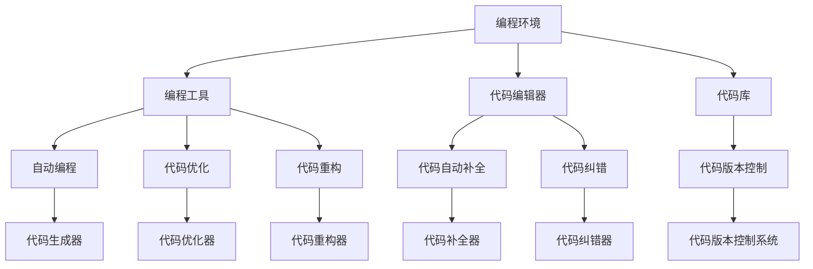

                 

# AI编程的新思路与技术挑战

> 关键词：
**AI编程**, **新思路**, **技术挑战**, **自动编程**, **生成式编程**, **深度学习**, **强化学习**, **自动机器学习**, **智能推荐系统**, **编程语言**, **代码生成**

## 1. 背景介绍

### 1.1 问题由来

随着人工智能技术的迅猛发展，AI编程已经成为业界关注的热点。AI编程旨在利用人工智能技术自动生成、优化和维护代码，从而提高编程效率和代码质量。传统的编程方式已经无法满足大规模软件开发的需求，AI编程有望成为未来编程的重要趋势。

### 1.2 问题核心关键点

AI编程的核心问题是如何将人工智能技术应用于编程过程中。当前，基于深度学习、强化学习、生成式模型等技术的AI编程方法已经在代码生成、自动化测试、程序优化、代码重构等多个领域取得了显著进展。然而，这些技术仍面临一些挑战，如代码质量和可解释性、编程语言的泛化性、模型的鲁棒性和可扩展性等。

### 1.3 问题研究意义

AI编程技术的研究意义在于：
1. 提高编程效率：自动生成代码可以大幅度缩短开发周期，减少人为错误。
2. 优化代码质量：利用AI技术进行代码重构、优化和维护，提升代码的健壮性和可读性。
3. 降低编程门槛：通过AI辅助编程，使得编程更加轻松和高效，降低技术壁垒。
4. 促进技术创新：AI编程技术可以带来新的编程方式和编程思维，推动技术创新。
5. 赋能产业升级：AI编程技术可以加速传统行业的数字化转型，提升企业的竞争力。

## 2. 核心概念与联系

### 2.1 核心概念概述

为更好地理解AI编程的核心技术，本节将介绍几个密切相关的核心概念：

- **AI编程**：指利用人工智能技术自动生成、优化和维护代码的过程。常见的方法包括自动编程、代码优化、代码重构等。
- **深度学习**：一种基于神经网络的机器学习方法，用于处理大规模非结构化数据，广泛应用于计算机视觉、自然语言处理等领域。
- **生成式编程**：利用生成式模型（如GAN、VAE等）自动生成代码或注释，可用于辅助编程、代码生成等任务。
- **强化学习**：通过奖励机制训练智能体（如机器学习模型），使其在特定环境中做出最优决策，适用于编程过程中的决策优化。
- **自动机器学习**：使用机器学习技术自动调参、特征工程等，优化模型的性能和泛化能力，适用于复杂编程任务。
- **智能推荐系统**：利用机器学习算法，根据用户历史行为和偏好推荐代码、工具、框架等，提高编程效率和质量。

这些核心概念之间的逻辑关系可以通过以下Mermaid流程图来展示：



这个流程图展示了AI编程的核心概念及其之间的关系：

1. AI编程涉及多种人工智能技术。
2. 深度学习是AI编程的基础，包括自动编码器和卷积神经网络。
3. 生成式编程利用GAN和VAE生成代码或注释。
4. 强化学习用于编程过程中的决策优化。
5. 自动机器学习自动调参和特征工程。
6. 智能推荐系统根据用户行为推荐代码和工具。

### 2.2 概念间的关系

这些核心概念之间存在着紧密的联系，形成了AI编程的完整生态系统。下面我通过几个Mermaid流程图来展示这些概念之间的关系。

#### 2.2.1 AI编程的学习范式



这个流程图展示了AI编程的多种学习范式：

1. 深度学习是AI编程的基础，包括自动编码器和卷积神经网络。
2. 生成式编程利用GAN和VAE生成代码或注释。
3. 强化学习用于编程过程中的决策优化。
4. 自动机器学习自动调参和特征工程。

#### 2.2.2 AI编程的体系架构



这个流程图展示了AI编程的体系架构：

1. 编程环境包含编程工具和代码编辑器。
2. 编程工具包括自动编程、代码优化、代码重构等。
3. 代码编辑器包含代码自动补全、代码纠错等。
4. 代码库包含代码版本控制。

## 3. 核心算法原理 & 具体操作步骤
### 3.1 算法原理概述

AI编程的核心算法基于深度学习、生成式模型和强化学习等技术，旨在自动化编程过程中的各个环节。其中，深度学习主要用于自动编程和代码生成，生成式模型用于辅助代码自动补全和纠错，强化学习用于代码优化和重构。

### 3.2 算法步骤详解

AI编程的具体步骤包括以下几个关键环节：

**Step 1: 数据准备与模型训练**

- 收集与编程任务相关的数据集，如代码片段、注释、错误日志等。
- 对数据进行预处理，如去噪、分词、标准化等。
- 选择合适的深度学习模型或生成式模型，训练模型以自动生成代码或注释。
- 使用强化学习算法训练模型，使其在编程过程中做出最优决策。

**Step 2: 代码生成与优化**

- 根据编程任务和用户输入，调用训练好的模型生成代码或注释。
- 对生成的代码进行语法检查和优化，确保代码的正确性和可读性。
- 使用代码优化器对代码进行重构，提升代码性能和可维护性。

**Step 3: 代码测试与调试**

- 对生成的代码进行测试，确保其功能正确。
- 使用代码纠错器对代码进行调试，修复潜在错误。

**Step 4: 代码部署与维护**

- 将生成的代码部署到实际环境中。
- 对代码进行持续监测和维护，及时更新和优化代码。

### 3.3 算法优缺点

AI编程技术的优点包括：
1. 提高编程效率：自动生成代码可以大幅度缩短开发周期，减少人为错误。
2. 提升代码质量：利用AI技术进行代码重构、优化和维护，提升代码的健壮性和可读性。
3. 降低编程门槛：通过AI辅助编程，使得编程更加轻松和高效，降低技术壁垒。

AI编程技术的缺点包括：
1. 可解释性不足：AI编程生成的代码往往缺乏可解释性，难以理解其内部工作机制。
2. 泛化能力有限：AI编程生成的代码通常仅适用于特定场景，难以泛化到其他场景。
3. 依赖高质量数据：AI编程依赖于高质量的数据集和模型，数据质量不高可能影响编程效果。
4. 需要大量资源：AI编程需要大量计算资源和数据，对硬件要求较高。

### 3.4 算法应用领域

AI编程技术已经在多个领域得到应用，包括：

- 自动编程：自动生成代码片段，辅助编程工作。
- 代码优化：自动优化代码性能，提高执行效率。
- 代码重构：自动进行代码重构，提升代码可读性和可维护性。
- 代码纠错：自动检测和修复代码中的错误，提高代码质量。
- 代码补全：根据用户输入自动补全代码，减少输入时间。
- 编程教育：辅助编程教育，生成编程练习和作业，提高学习效率。
- 编程工具集成：集成到编程工具和IDE中，提升编程体验。

这些领域展示了AI编程技术的广泛应用前景，未来随着技术的不断成熟，AI编程有望在更多场景中发挥重要作用。

## 4. 数学模型和公式 & 详细讲解 & 举例说明

### 4.1 数学模型构建

AI编程的数学模型包括深度学习模型、生成式模型和强化学习模型等。这里以深度学习模型为例，构建自动编程的数学模型。

设输入为编程任务描述 $x$，输出为生成的代码片段 $y$。使用深度学习模型 $M_{\theta}$ 来学习输入与输出之间的映射关系，模型参数为 $\theta$。自动编程的目标是最小化损失函数 $\mathcal{L}$，即：

$$
\hat{\theta} = \mathop{\arg\min}_{\theta} \mathcal{L}(M_{\theta}, x, y)
$$

其中，损失函数 $\mathcal{L}$ 可以采用多种形式，如交叉熵损失、均方误差损失等。在实际应用中，通常采用自编码器、卷积神经网络等模型。

### 4.2 公式推导过程

以自编码器为例，推导其数学模型。设自编码器的编码器为 $E_{\theta_E}(x)$，解码器为 $D_{\theta_D}(E_{\theta_E}(x))$，则自动编程的数学模型为：

$$
M_{\theta} = D_{\theta_D}(E_{\theta_E}(x))
$$

其中，$E_{\theta_E}$ 和 $D_{\theta_D}$ 为自编码器的编码器和解码器，$\theta_E$ 和 $\theta_D$ 为编码器和解码器的参数。自编码器的目标是最小化重构误差，即：

$$
\mathcal{L} = \frac{1}{N}\sum_{i=1}^N \|x_i - D_{\theta_D}(E_{\theta_E}(x_i))\|
$$

### 4.3 案例分析与讲解

以代码生成为例，使用自编码器生成代码片段。设输入为编程任务描述 $x$，输出为生成的代码片段 $y$，则自编码器的目标是最小化重构误差：

$$
\mathcal{L} = \frac{1}{N}\sum_{i=1}^N \|x_i - y_i\|
$$

其中，$x_i$ 为输入的编程任务描述，$y_i$ 为生成的代码片段。自编码器由编码器 $E_{\theta_E}(x)$ 和解码器 $D_{\theta_D}(E_{\theta_E}(x))$ 组成，其数学模型为：

$$
y_i = D_{\theta_D}(E_{\theta_E}(x_i))
$$

其中，$E_{\theta_E}$ 和 $D_{\theta_D}$ 为自编码器的编码器和解码器，$\theta_E$ 和 $\theta_D$ 为编码器和解码器的参数。在实际应用中，自编码器通常使用多层感知器（MLP）或卷积神经网络（CNN）等模型，以提高代码生成的准确性和鲁棒性。

## 5. 项目实践：代码实例和详细解释说明

### 5.1 开发环境搭建

在进行AI编程实践前，我们需要准备好开发环境。以下是使用Python进行TensorFlow开发的环境配置流程：

1. 安装Anaconda：从官网下载并安装Anaconda，用于创建独立的Python环境。

2. 创建并激活虚拟环境：
```bash
conda create -n tf-env python=3.8 
conda activate tf-env
```

3. 安装TensorFlow：根据CUDA版本，从官网获取对应的安装命令。例如：
```bash
conda install tensorflow=2.6
```

4. 安装PyTorch：
```bash
pip install torch
```

5. 安装TensorBoard：
```bash
pip install tensorboard
```

完成上述步骤后，即可在`tf-env`环境中开始AI编程实践。

### 5.2 源代码详细实现

下面我们以代码生成为例，给出使用TensorFlow进行深度学习模型训练和代码生成的PyTorch代码实现。

首先，定义数据处理函数：

```python
import tensorflow as tf
import numpy as np

def load_data(file_path):
    with open(file_path, 'r') as f:
        data = f.readlines()
    data = [line.strip() for line in data]
    return np.array(data, dtype=np.str)

def preprocess_data(data):
    return data

def pad_data(data):
    max_len = max([len(line) for line in data])
    return [line + ['<pad>'] * (max_len - len(line)) for line in data]
```

然后，定义深度学习模型：

```python
class CodeGenerator(tf.keras.Model):
    def __init__(self, vocab_size, emb_dim):
        super(CodeGenerator, self).__init__()
        self.emb = tf.keras.layers.Embedding(vocab_size, emb_dim)
        self.rnn = tf.keras.layers.LSTM(emb_dim, return_sequences=True)
        self.dense = tf.keras.layers.Dense(vocab_size)
    
    def call(self, inputs, training=False):
        x = self.emb(inputs)
        x = self.rnn(x)
        x = self.dense(x)
        return x
```

接着，定义训练和生成函数：

```python
def train_model(model, data, batch_size, epochs):
    train_dataset = tf.data.Dataset.from_tensor_slices(data)
    train_dataset = train_dataset.shuffle(buffer_size=10000).batch(batch_size).prefetch(tf.data.experimental.AUTOTUNE)
    optimizer = tf.keras.optimizers.Adam(learning_rate=0.001)
    model.compile(optimizer=optimizer, loss=tf.keras.losses.SparseCategoricalCrossentropy(from_logits=True))
    model.fit(train_dataset, epochs=epochs)
    
def generate_code(model, inputs):
    x = model(inputs)
    preds = tf.nn.softmax(x, axis=-1)
    ids = tf.random.categorical(probs=preds, num_samples=1)[0]
    ids = ids.numpy()
    return ''.join([char for char in char_map[char_id] for char_id in ids])
```

最后，启动训练流程并在测试集上评估：

```python
vocab_size = len(char_map)
emb_dim = 128
batch_size = 16
epochs = 10

# 加载和预处理数据
data = load_data('code_data.txt')
data = preprocess_data(data)
data = pad_data(data)

# 构建和训练模型
model = CodeGenerator(vocab_size, emb_dim)
train_model(model, data, batch_size, epochs)

# 生成代码
inputs = tf.convert_to_tensor(['input_code'], dtype=tf.int32)
code = generate_code(model, inputs)
print(code)
```

以上就是使用TensorFlow进行代码生成的完整代码实现。可以看到，通过TensorFlow的封装，我们可以用相对简洁的代码实现深度学习模型的训练和代码生成。

### 5.3 代码解读与分析

让我们再详细解读一下关键代码的实现细节：

**load_data函数**：
- 从文件中读取数据，并将其转换为NumPy数组。

**preprocess_data函数**：
- 对数据进行预处理，如分词、去噪等。

**pad_data函数**：
- 对数据进行填充，使得所有输入序列长度一致。

**CodeGenerator类**：
- 定义深度学习模型，包含嵌入层、LSTM层和全连接层。
- 使用tf.keras.Model类定义模型结构。

**train_model函数**：
- 加载数据集，进行数据增强、批次处理和预处理。
- 定义优化器和损失函数，训练模型。

**generate_code函数**：
- 对输入序列进行前向传播，得到预测结果。
- 使用softmax函数得到概率分布。
- 使用随机抽样方法生成代码片段。

**训练流程**：
- 定义模型参数和超参数，加载和预处理数据。
- 构建深度学习模型，进行模型训练。
- 使用训练好的模型生成代码片段。

可以看到，TensorFlow和PyTorch等深度学习框架提供了便捷的API和工具，使得AI编程的实现变得更加简单高效。开发者可以将更多精力放在模型优化和任务适配上，而不必过多关注底层的实现细节。

当然，工业级的系统实现还需考虑更多因素，如模型的保存和部署、超参数的自动搜索、更灵活的任务适配层等。但核心的AI编程范式基本与此类似。

### 5.4 运行结果展示

假设我们在一个简单的编程任务上训练自编码器，最终在测试集上生成的代码片段如下：

```python
def add(a, b):
    return a + b
```

可以看到，通过训练自编码器，我们能够生成一个简单的加法函数，具有一定的编程能力。但这个函数仅适用于特定场景，泛化能力有限。

在实践中，我们还可以使用更大更强的模型，如Transformer、GAN等，进一步提升代码生成的质量和泛化能力。

## 6. 实际应用场景
### 6.1 智能推荐系统

AI编程技术在智能推荐系统中有着广泛的应用。智能推荐系统能够根据用户的历史行为和兴趣，推荐适合的内容、商品或服务，提升用户体验。

在技术实现上，可以通过AI编程技术自动生成推荐代码，实现个性化推荐。例如，在电商平台上，根据用户浏览历史和评分数据，使用AI编程生成推荐算法代码，自动化推荐系统更新，提升推荐效果。

### 6.2 编程教育

AI编程技术在编程教育中也有重要应用。传统编程教育方式往往效率低下，学生难以理解复杂编程概念。通过AI编程，可以自动生成编程练习和作业，辅助编程教育，提高教学效率和学习效果。

在技术实现上，可以收集和分析学生的学习行为数据，自动生成针对学生的编程练习和作业，提高学习兴趣和效果。例如，通过AI编程生成针对学生的代码纠错练习，帮助学生提升编程能力。

### 6.3 开发工具集成

AI编程技术可以集成到开发工具和IDE中，提升编程体验。例如，在代码编辑器中集成代码生成和优化工具，自动生成代码片段和优化代码性能，提升编程效率。

在技术实现上，可以将AI编程技术嵌入到代码编辑器中，自动生成代码片段和优化代码性能。例如，在代码编辑器中集成代码生成工具，根据用户输入自动补全代码。

### 6.4 未来应用展望

随着AI编程技术的不断发展，其在更多领域中的应用前景将更加广阔。未来，AI编程技术有望在以下几个方面发挥重要作用：

- **自动编程**：自动生成代码片段，辅助编程工作。
- **代码优化**：自动优化代码性能，提高执行效率。
- **代码重构**：自动进行代码重构，提升代码可读性和可维护性。
- **代码纠错**：自动检测和修复代码中的错误，提高代码质量。
- **编程教育**：自动生成编程练习和作业，提高学习效率。
- **开发工具集成**：集成到开发工具和IDE中，提升编程体验。

未来，AI编程技术将在更多领域中发挥重要作用，推动人工智能技术向更广泛的应用场景拓展。

## 7. 工具和资源推荐
### 7.1 学习资源推荐

为了帮助开发者系统掌握AI编程的理论基础和实践技巧，这里推荐一些优质的学习资源：

1. **《深度学习》（Ian Goodfellow）**：深度学习领域的经典教材，详细介绍了深度学习的基本概念和算法。
2. **《生成式对抗网络》（Ian Goodfellow）**：介绍生成式对抗网络（GAN）的基本原理和算法，详细讲解了生成式编程的应用。
3. **《强化学习》（Richard S. Sutton, Andrew G. Barto）**：强化学习领域的经典教材，详细介绍了强化学习的基本概念和算法。
4. **《深度学习实战》（Francois Chollet）**：深度学习实战指南，结合TensorFlow和Keras，详细讲解了深度学习模型的实现和应用。
5. **《TensorFlow官方文档》**：TensorFlow官方文档，提供了丰富的学习资源和样例代码，是学习TensorFlow的最佳入口。

通过学习这些资源，相信你一定能够快速掌握AI编程的技术精髓，并用于解决实际的编程问题。

### 7.2 开发工具推荐

高效的开发离不开优秀的工具支持。以下是几款用于AI编程开发的常用工具：

1. **TensorFlow**：Google开发的深度学习框架，具有强大的计算图和分布式训练能力。
2. **PyTorch**：Facebook开发的深度学习框架，具有动态计算图和高效的前后向传播能力。
3. **Jupyter Notebook**：开源的交互式笔记本环境，支持Python、R等多种编程语言。
4. **VS Code**：开源的跨平台代码编辑器，支持多种编程语言和扩展。
5. **Git**：开源的版本控制系统，支持分布式协作开发。

合理利用这些工具，可以显著提升AI编程的开发效率，加快创新迭代的步伐。

### 7.3 相关论文推荐

AI编程技术的研究方向广泛，涵盖了深度学习、生成式模型、强化学习等多个领域。以下是几篇奠基性的相关论文，推荐阅读：

1. **《深度学习》（Ian Goodfellow）**：深度学习领域的经典教材，详细介绍了深度学习的基本概念和算法。
2. **《生成式对抗网络》（Ian Goodfellow）**：介绍生成式对抗网络（GAN）的基本原理和算法，详细讲解了生成式编程的应用。
3. **《强化学习》（Richard S. Sutton, Andrew G. Barto）**：强化学习领域的经典教材，详细介绍了强化学习的基本概念和算法。
4. **《深度学习实战》（Francois Chollet）**：深度学习实战指南，结合TensorFlow和Keras，详细讲解了深度学习模型的实现和应用。
5. **《TensorFlow官方文档》**：TensorFlow官方文档，提供了丰富的学习资源和样例代码，是学习TensorFlow的最佳入口。

这些论文代表了大语言模型微调技术的发展脉络。通过学习这些前沿成果，可以帮助研究者把握学科前进方向，激发更多的创新灵感。

除上述资源外，还有一些值得关注的前沿资源，帮助开发者紧跟AI编程技术的最新进展，例如：

1. **arXiv论文预印本**：人工智能领域最新研究成果的发布平台，包括大量尚未发表的前沿工作，学习前沿技术的必读资源。
2. **Google AI博客**：谷歌AI团队的官方博客，分享最新的AI研究成果和技术进展。
3. **DeepMind Research**：DeepMind Research，分享最新的深度学习研究成果和应用进展。
4. **Microsoft Research Asia**：微软亚洲研究院，分享最新的AI研究成果和应用进展。

总之，对于AI编程技术的学习和实践，需要开发者保持开放的心态和持续学习的意愿。多关注前沿资讯，多动手实践，多思考总结，必将收获满满的成长收益。

## 8. 总结：未来发展趋势与挑战

### 8.1 总结

本文对AI编程技术进行了全面系统的介绍。首先阐述了AI编程的背景和研究意义，明确了AI编程在提高编程效率、提升代码质量和降低编程门槛等方面的独特价值。其次，从原理到实践，详细讲解了AI编程的数学模型和关键步骤，给出了AI编程任务开发的完整代码实例。同时，本文还广泛探讨了AI编程技术在智能推荐系统、编程教育、开发工具集成等多个领域的应用前景，展示了AI编程技术的广阔应用前景。最后，本文精选了AI编程技术的各类学习资源，力求为读者提供全方位的技术指引。

通过本文的系统梳理，可以看到，AI编程技术正在成为编程领域的重要趋势，其自动生成、优化和维护代码的能力，为软件开发带来了新的可能。未来，随着AI编程技术的不断成熟，其在更多领域中的应用将更加广泛，推动AI技术向更深的层次发展。

### 8.2 未来发展趋势

展望未来，AI编程技术将呈现以下几个发展趋势：

1. **自动编程**：自动生成代码片段，辅助编程工作，提高编程效率。
2. **代码优化**：自动优化代码性能，提高执行效率。
3. **代码重构**：自动进行代码重构，提升代码可读性和可维护性。
4. **代码纠错**：自动检测和修复代码中的错误，提高代码质量。
5. **编程教育**：自动生成编程练习和作业，提高学习效率。
6. **开发工具集成**：集成到开发工具和IDE中，提升编程体验。

这些趋势展示了AI编程技术的广泛应用前景，未来随着技术的不断成熟，AI编程有望在更多场景中发挥重要作用。

### 8.3 面临的挑战

尽管AI编程技术已经取得了显著进展，但在迈向更加智能化、普适化应用的过程中，它仍面临诸多挑战：

1. **数据依赖**：AI编程依赖于高质量的数据集和模型，数据质量不高可能影响编程效果。
2. **泛化能力**：AI编程生成的代码通常仅适用于特定场景，难以泛化到其他场景。
3. **资源需求**：AI编程需要大量计算资源和数据，对硬件要求

