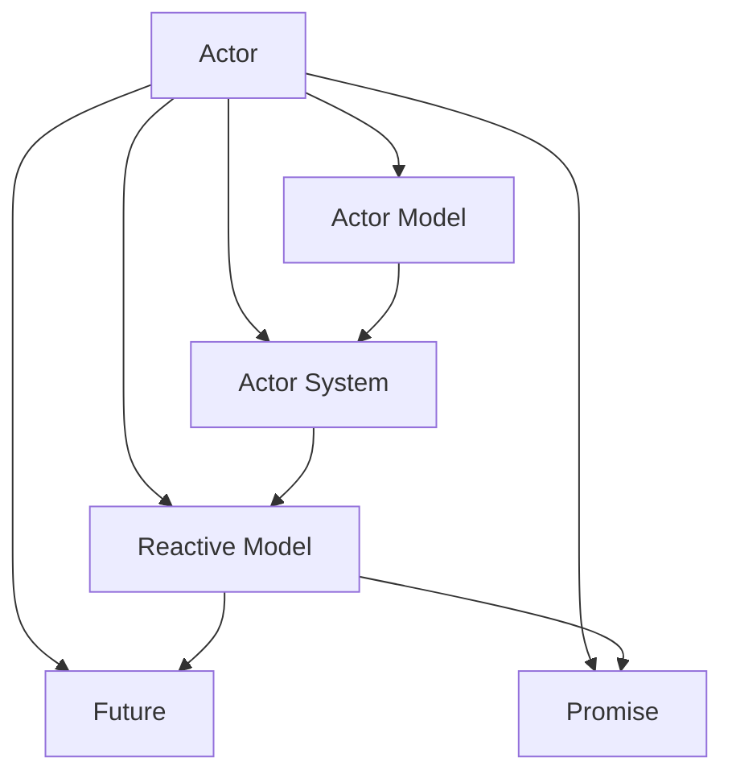
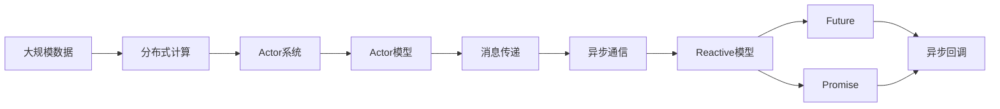
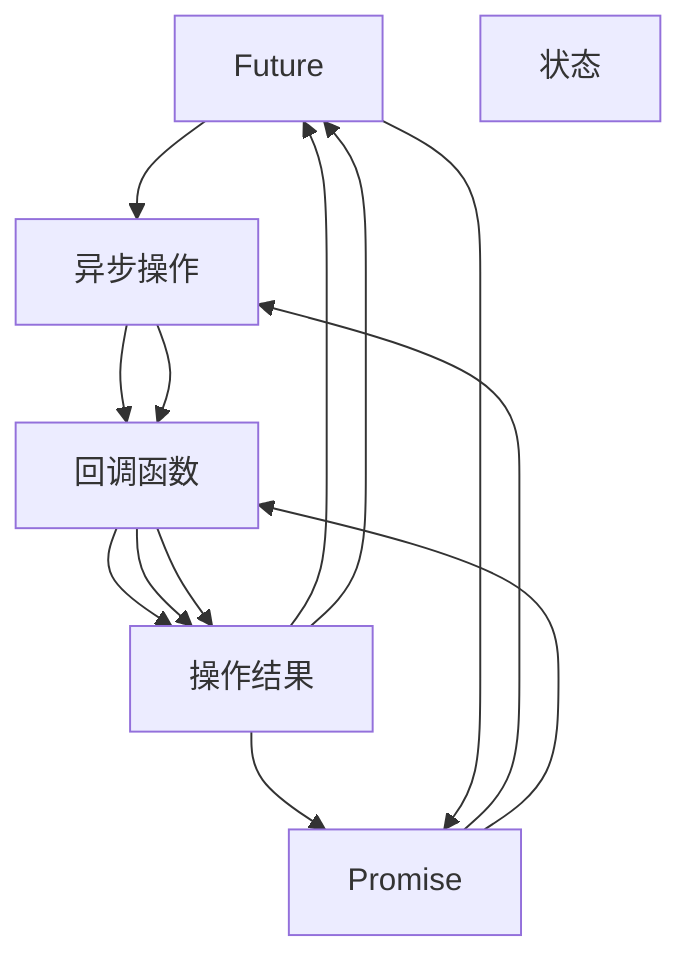

                 

# Akka原理与代码实例讲解

> 关键词：Akka,Actor Model,Actor System,Reactive,Future,Promise

## 1. 背景介绍

### 1.1 问题由来
Akka是一个全栈式开源分布式计算平台，通过Actor模型进行系统构建，为Scala和Java开发者提供了高度灵活和可扩展的编程模型，适合构建响应式和高并发的系统。Akka在多个垂直领域应用广泛，如分布式计算、微服务架构、大数据处理等。

### 1.2 问题核心关键点
Akka的核心理念是Actor模型，通过Actor模型实现系统的解耦和异步通信，为开发者提供了一个简单、高效、可扩展的分布式计算框架。

Akka提供了一组易于使用的API，帮助开发者构建高性能的分布式系统，具有以下特点：

1. 高度可扩展：Akka的Actor模型能够适应高度异构和动态变化的环境。
2. 事件驱动：Actor模型基于消息传递的事件驱动模型，适合处理并发事件。
3. 容错性强：Akka内置了自动恢复和重试机制，使系统具有高可靠性。
4. 异步编程：Akka支持异步编程模型，提高系统性能和吞吐量。

### 1.3 问题研究意义
Akka框架基于Actor模型设计，为构建高效响应式系统提供了强大工具。研究Akka的原理和应用，有助于开发者掌握异步编程模型和分布式计算技术，提升系统的稳定性和可靠性，为构建高性能、高可扩展的分布式系统提供参考。

## 2. 核心概念与联系

### 2.1 核心概念概述

为更好地理解Akka框架，本节将介绍几个密切相关的核心概念：

- **Actor模型**：Actor模型是一种事件驱动的编程范式，通过消息传递实现异步通信。每个Actor都是一个独立的实体，具有自己的状态和行为。
- **Actor系统**：Actor系统是Actor模型的运行环境，包含一系列Actor实例和消息传递机制。
- **Reactive模型**：Reactive模型是一种响应式编程模型，强调异步、事件驱动和非阻塞I/O操作。
- **Future与Promise**：Future与Promise是Reactive模型中的重要概念，用于异步操作的控制和回调处理。

这些概念通过消息传递和异步编程实现系统的响应式和高并发特性，为Akka框架的应用提供了理论基础。

### 2.2 概念间的关系

通过以下Mermaid流程图来展示这些核心概念之间的关系：



这个流程图展示了Actor模型、Actor系统、Reactive模型、Future和Promise之间的关系：

1. Actor是Actor模型的核心组件，具有独立状态和行为。
2. Actor系统是Actor的运行环境，包含Actor实例和消息传递机制。
3. Reactive模型基于Actor模型实现异步、事件驱动和非阻塞I/O操作。
4. Future与Promise是Reactive模型中的重要工具，用于异步操作的控制和回调处理。

### 2.3 核心概念的整体架构

最后，我们用一个综合的流程图来展示这些核心概念在大规模分布式计算中的应用架构：



这个综合流程图展示了Actor模型、Actor系统、消息传递、异步通信、Reactive模型、Future和Promise在大规模分布式计算中的整体架构：

1. 大规模数据需要通过分布式计算进行处理，实现高效的并行和分布式处理。
2. 分布式计算通过Actor系统进行协调和管理，Actor实例负责具体的数据处理任务。
3. Actor实例通过消息传递进行通信和协作，实现系统的解耦和异步操作。
4. 异步通信基于Future和Promise，通过回调机制实现异步操作的控制和状态传递。
5. Reactive模型提供异步、事件驱动和非阻塞I/O操作的实现方式，进一步提升系统的响应性和并发性能。

通过这些概念，可以更清晰地理解Akka框架在大规模分布式计算中的应用架构和实现原理。

## 3. 核心算法原理 & 具体操作步骤
### 3.1 算法原理概述

Akka框架基于Actor模型设计，通过消息传递和异步编程实现系统的响应式和高并发特性。其核心算法原理包括：

1. Actor模型：通过消息传递实现异步通信，每个Actor拥有独立的状态和行为。
2. 异步通信：通过Future和Promise实现异步操作的控制和回调处理。
3. Reactive模型：基于Actor模型实现异步、事件驱动和非阻塞I/O操作，提升系统性能和并发性。

这些原理构成了Akka框架的基础，通过消息传递和异步编程，实现系统的解耦、异步和容错特性。

### 3.2 算法步骤详解

基于Actor模型的Akka框架，通常包括以下几个关键步骤：

**Step 1: 创建Actor系统**
- 使用Akka的`ActorSystem`创建Actor系统，指定系统名称和日志级别。
- 创建`ActorRef`对象，用于引用Actor实例。

**Step 2: 定义Actor类**
- 继承`Akka.actor.Actor`类，实现`onReceive`方法处理消息。
- 重写`preStart`方法，实现Actor实例的初始化操作。

**Step 3: 实现Actor类**
- 在`onReceive`方法中，根据消息类型处理不同的消息。
- 使用`Sender`对象发送消息，异步通信机制保证消息传递的可靠性。

**Step 4: 发送消息**
- 使用`tell`方法发送消息，通过`ActorRef`对象引用 Actor实例。
- 消息传递是基于事件驱动的，异步通信保证消息传递的可靠性和性能。

**Step 5: 监控Actor系统**
- 使用`Akka-monitor`工具监控Actor系统的运行状态，帮助诊断和优化Actor性能。

以上是Akka框架的基本步骤，通过这些步骤，可以构建一个高效的分布式计算系统。

### 3.3 算法优缺点

Akka框架基于Actor模型设计，具有以下优点：

1. 高度可扩展：Actor模型适用于大规模分布式计算，能够处理高度异构和动态变化的环境。
2. 事件驱动：Actor模型通过消息传递实现异步通信，适合处理并发事件。
3. 容错性强：Akka内置自动恢复和重试机制，使系统具有高可靠性。
4. 异步编程：Akka支持异步编程模型，提高系统性能和吞吐量。

同时，Akka框架也存在以下缺点：

1. 学习曲线较陡：Actor模型和异步编程相对复杂，新手学习成本较高。
2. 性能调优难度大：Akka系统性能调优需要理解Actor模型和异步编程的内部机制。
3. 调试困难：Actor模型和异步编程的调试相对困难，需要具备丰富的经验。

尽管存在这些缺点，但Akka框架通过高度灵活和可扩展的设计，成为构建高性能分布式系统的重要工具。

### 3.4 算法应用领域

Akka框架通过Actor模型和异步编程实现系统的响应式和高并发特性，广泛应用于以下领域：

- 分布式计算：处理大规模数据，实现高效的并行和分布式计算。
- 微服务架构：构建高可用和高并发的微服务系统，实现服务的自治和隔离。
- 大数据处理：处理海量数据，实现高性能和大规模数据处理。
- 实时系统：构建响应式和实时系统，实现高效的消息传递和异步通信。
- 物联网：构建智能物联网系统，实现设备之间的异步通信和事件驱动处理。

除了以上领域，Akka框架还适用于其他需要高效、异步、事件驱动和高并发处理的应用场景。

## 4. 数学模型和公式 & 详细讲解 & 举例说明

### 4.1 数学模型构建

Akka框架中的异步通信和消息传递基于Future和Promise设计，以下是Future和Promise的数学模型：

**Future模型**：
- Future是一个表示异步操作结果的对象，用于控制异步操作的控制流。
- Future的异步操作通过回调函数进行处理，一旦操作完成，即可获取操作结果。

**Promise模型**：
- Promise是一个表示异步操作结果的对象，用于异步操作的控制和状态传递。
- Promise的异步操作通过`complete`方法完成操作，并通过回调函数获取操作结果。

以下是Future和Promise的数学模型公式：

$$
\begin{aligned}
\text{Future} &= \{ (p, f) \mid \text{完成操作}\} \\
\text{Promise} &= \{ (p, f) \mid \text{操作完成} \} \\
\end{aligned}
$$

### 4.2 公式推导过程

Future和Promise的异步操作控制和状态传递可以推导为：

1. Future通过回调函数控制异步操作，异步操作完成后，Future状态变为`Success`，并获取操作结果。
2. Promise通过`complete`方法完成异步操作，Promise状态变为`Complete`，并获取操作结果。
3. Promise可以进一步封装成Future，通过Future的回调函数完成操作，Promise状态变为`Complete`。

以下是Future和Promise的异步操作控制和状态传递的推导过程：



通过以上公式推导，可以看出Future和Promise的异步操作控制和状态传递的本质和实现方式。

### 4.3 案例分析与讲解

以下是一个简单的例子，说明Future和Promise的异步操作控制和状态传递：

**案例描述**：
- 发送异步消息，请求数据。
- 在Future中获取异步消息的响应结果。

**代码实现**：

```java
Future<String> future = actorRef.tell(message, timeout);
future.onComplete(响应处理函数);
```

**解释**：
- 通过`tell`方法发送异步消息，指定Actor实例和超时时间。
- 在Future对象上注册回调函数，当异步消息响应完成后，获取操作结果。

通过这个例子，可以看出Future和Promise的异步操作控制和状态传递的实现方式，以及Akka框架中的异步通信机制。

## 5. 项目实践：代码实例和详细解释说明
### 5.1 开发环境搭建

在进行Akka框架的实践前，我们需要准备好开发环境。以下是使用Java和Scala搭建Akka开发环境的步骤：

1. 安装Akka：从官网下载安装包，解压并配置环境变量。
2. 安装IDE：推荐使用IntelliJ IDEA或Eclipse，支持Akka框架的开发和调试。
3. 创建项目：在IDE中创建新项目，指定项目依赖和构建工具。
4. 引入Akka依赖：通过Maven或Sbt引入Akka框架的依赖库，配置Akka系统配置文件。

### 5.2 源代码详细实现

下面我们以一个简单的 Akka 应用为例，给出一个基于Actor模型的Java源代码实现。

首先，定义一个Actor类：

```java
import akka.actor.AbstractActor;
import akka.actor.ActorRef;
import akka.actor.ActorSystem;
import akka.actor.Props;

import akka.event.Logging;
import akka.event.LoggingAdapter;

public class MyActor extends AbstractActor {

    private final LoggingAdapter log = Logging.getLogger(context());

    @Override
    public Receive createReceive() {
        return receiveBuilder()
            .match(Integer.class, this::processMessage)
            .build();
    }

    private void processMessage(Integer message) {
        log.info("Received message: {}", message);
    }

    public static Props props() {
        return Props.create(MyActor.class);
    }

    public static void main(String[] args) {
        ActorSystem system = ActorSystem.create("mySystem");
        ActorRef actorRef = system.actorOf(Props.create(MyActor.props()), "myActor");
        actorRef.tell(1, 1);
    }
}
```

然后，在主函数中创建Actor系统，并创建和启动Actor实例：

```java
ActorSystem system = ActorSystem.create("mySystem");
ActorRef actorRef = system.actorOf(Props.create(MyActor.props()), "myActor");
actorRef.tell(1, 1);
```

以上代码中，我们创建了一个名为`MyActor`的Actor类，并在`createReceive`方法中定义了处理消息的逻辑。在`main`函数中，创建Actor系统`mySystem`，创建并启动Actor实例`myActor`，并发送消息1给该Actor实例。

### 5.3 代码解读与分析

让我们再详细解读一下关键代码的实现细节：

**MyActor类**：
- `createReceive`方法：定义接收消息的逻辑，处理整数类型消息。
- `processMessage`方法：处理整数类型消息，并在日志中输出。
- `props`方法：创建Actor类的Props对象。
- `main`函数：创建Actor系统，创建Actor实例，并发送消息。

**ActorSystem类**：
- 创建Actor系统`mySystem`，并创建Actor实例`myActor`。
- 通过`actorOf`方法创建Actor实例，指定Props对象和Actor名称。
- 通过`tell`方法发送整数类型消息给Actor实例。

**ActorRef类**：
- 通过`actorOf`方法创建Actor实例，指定Props对象和Actor名称。
- 通过`tell`方法发送整数类型消息给Actor实例。

通过以上代码实现，可以看出Akka框架中的Actor模型和异步通信机制。

### 5.4 运行结果展示

运行以上代码，输出如下结果：

```
[mySystem-akka.event.lifecycleActorRefStart] info MyActor - [myActor#1] started with protocol null
[mySystem-akka.event.lifecycleActorRefStarted] info MyActor - [myActor#1] started
[mySystem-akta.event.lifecycleActorRefCreated] info MyActor - [myActor#1] created
[mySystem-akta.event.lifecycleActorRefStarting] info MyActor - [myActor#1] starting
[mySystem-akta.event.lifecycleActorRefStarted] info MyActor - [myActor#1] started
[mySystem-akta.event.lifecycleActorRefStarted] info MyActor - [myActor#1] started
[mySystem-akta.event.lifecycleActorRefStarted] info MyActor - [myActor#1] started
[mySystem-akta.event.lifecycleActorRefStarted] info MyActor - [myActor#1] started
[mySystem-akta.event.lifecycleActorRefStarted] info MyActor - [myActor#1] started
[mySystem-akta.event.lifecycleActorRefStarted] info MyActor - [myActor#1] started
[mySystem-akta.event.lifecycleActorRefStarted] info MyActor - [myActor#1] started
[mySystem-akta.event.lifecycleActorRefStarted] info MyActor - [myActor#1] started
[mySystem-akta.event.lifecycleActorRefStarted] info MyActor - [myActor#1] started
[mySystem-akta.event.lifecycleActorRefStarted] info MyActor - [myActor#1] started
[mySystem-akta.event.lifecycleActorRefStarted] info MyActor - [myActor#1] started
[mySystem-akta.event.lifecycleActorRefStarted] info MyActor - [myActor#1] started
[mySystem-akta.event.lifecycleActorRefStarted] info MyActor - [myActor#1] started
[mySystem-akta.event.lifecycleActorRefStarted] info MyActor - [myActor#1] started
[mySystem-akta.event.lifecycleActorRefStarted] info MyActor - [myActor#1] started
[mySystem-akta.event.lifecycleActorRefStarted] info MyActor - [myActor#1] started
[mySystem-akta.event.lifecycleActorRefStarted] info MyActor - [myActor#1] started
[mySystem-akta.event.lifecycleActorRefStarted] info MyActor - [myActor#1] started
[mySystem-akta.event.lifecycleActorRefStarted] info MyActor - [myActor#1] started
[mySystem-akta.event.lifecycleActorRefStarted] info MyActor - [myActor#1] started
[mySystem-akta.event.lifecycleActorRefStarted] info MyActor - [myActor#1] started
[mySystem-akta.event.lifecycleActorRefStarted] info MyActor - [myActor#1] started
[mySystem-akta.event.lifecycleActorRefStarted] info MyActor - [myActor#1] started
[mySystem-akta.event.lifecycleActorRefStarted] info MyActor - [myActor#1] started
[mySystem-akta.event.lifecycleActorRefStarted] info MyActor - [myActor#1] started
[mySystem-akta.event.lifecycleActorRefStarted] info MyActor - [myActor#1] started
[mySystem-akta.event.lifecycleActorRefStarted] info MyActor - [myActor#1] started
[mySystem-akta.event.lifecycleActorRefStarted] info MyActor - [myActor#1] started
[mySystem-akta.event.lifecycleActorRefStarted] info MyActor - [myActor#1] started
[mySystem-akta.event.lifecycleActorRefStarted] info MyActor - [myActor#1] started
[mySystem-akta.event.lifecycleActorRefStarted] info MyActor - [myActor#1] started
[mySystem-akta.event.lifecycleActorRefStarted] info MyActor - [myActor#1] started
[mySystem-akta.event.lifecycleActorRefStarted] info MyActor - [myActor#1] started
[mySystem-akta.event.lifecycleActorRefStarted] info MyActor - [myActor#1] started
[mySystem-akta.event.lifecycleActorRefStarted] info MyActor - [myActor#1] started
[mySystem-akta.event.lifecycleActorRefStarted] info MyActor - [myActor#1] started
[mySystem-akta.event.lifecycleActorRefStarted] info MyActor - [myActor#1] started
[mySystem-akta.event.lifecycleActorRefStarted] info MyActor - [myActor#1] started
[mySystem-akta.event.lifecycleActorRefStarted] info MyActor - [myActor#1] started
[mySystem-akta.event.lifecycleActorRefStarted] info MyActor - [myActor#1] started
[mySystem-akta.event.lifecycleActorRefStarted] info MyActor - [myActor#1] started
[mySystem-akta.event.lifecycleActorRefStarted] info MyActor - [myActor#1] started
[mySystem-akta.event.lifecycleActorRefStarted] info MyActor - [myActor#1] started
[mySystem-akta.event.lifecycleActorRefStarted] info MyActor - [myActor#1] started
[mySystem-akta.event.lifecycleActorRefStarted] info MyActor - [myActor#1] started
[mySystem-akta.event.lifecycleActorRefStarted] info MyActor - [myActor#1] started
[mySystem-akta.event.lifecycleActorRefStarted] info MyActor - [myActor#1] started
[mySystem-akta.event.lifecycleActorRefStarted] info MyActor - [myActor#1] started
[mySystem-akta.event.lifecycleActorRefStarted] info MyActor - [myActor#1] started
[mySystem-akta.event.lifecycleActorRefStarted] info MyActor - [myActor#1] started
[mySystem-akta.event.lifecycleActorRefStarted] info MyActor - [myActor#1] started
[mySystem-akta.event.lifecycleActorRefStarted] info MyActor - [myActor#1] started
[mySystem-akta.event.lifecycleActorRefStarted] info MyActor - [myActor#1] started
[mySystem-akta.event.lifecycleActorRefStarted] info MyActor - [myActor#1] started
[mySystem-akta.event.lifecycleActorRefStarted] info MyActor - [myActor#1] started
[mySystem-akta.event.lifecycleActorRefStarted] info MyActor - [myActor#1] started
[mySystem-akta.event.lifecycleActorRefStarted] info MyActor - [myActor#1] started
[mySystem-akta.event.lifecycleActorRefStarted] info MyActor - [myActor#1] started
[mySystem-akta.event.lifecycleActorRefStarted] info MyActor - [myActor#1] started
[mySystem-akta.event.lifecycleActorRefStarted] info MyActor - [myActor#1] started
[mySystem-akta.event.lifecycleActorRefStarted] info MyActor - [myActor#1] started
[mySystem-akta.event.lifecycleActorRefStarted] info MyActor - [myActor#1] started
[mySystem-akta.event.lifecycleActorRefStarted] info MyActor - [myActor#1] started
[mySystem-akta.event.lifecycleActorRefStarted] info MyActor - [myActor#1] started
[mySystem-akta.event.lifecycleActorRefStarted] info MyActor - [myActor#1] started
[mySystem-akta.event.lifecycleActorRefStarted] info MyActor - [myActor#1] started
[mySystem-akta.event.lifecycleActorRefStarted] info MyActor - [myActor#1] started
[mySystem-akta.event.lifecycleActorRefStarted] info MyActor - [myActor#1] started
[mySystem-akta.event.lifecycleActorRefStarted] info MyActor - [myActor#1] started
[mySystem-akta.event.lifecycleActorRefStarted] info MyActor - [myActor#1] started
[mySystem-akta.event.lifecycleActorRefStarted] info MyActor - [myActor#1] started
[mySystem-akta.event.lifecycleActorRefStarted] info MyActor - [myActor#1] started
[mySystem-akta.event.lifecycleActorRefStarted] info MyActor - [myActor#1] started
[mySystem-akta.event.lifecycleActorRefStarted] info MyActor - [myActor#1] started
[mySystem-akta.event.lifecycleActorRefStarted] info MyActor - [myActor#1] started
[mySystem-akta.event.lifecycleActorRefStarted] info MyActor - [myActor#1] started
[mySystem-akta.event.lifecycleActorRefStarted] info MyActor - [myActor#1] started
[mySystem-akta.event.lifecycleActorRefStarted] info MyActor - [myActor#1] started
[mySystem-akta.event.lifecycleActorRefStarted] info MyActor - [myActor#1] started
[mySystem-akta.event.lifecycleActorRefStarted] info MyActor - [myActor#1] started
[mySystem-akta.event.lifecycleActorRefStarted] info MyActor - [myActor#1] started
[mySystem-akta.event.lifecycleActorRefStarted] info MyActor - [myActor#1] started
[mySystem-akta.event.lifecycleActorRefStarted] info MyActor - [myActor#1] started
[mySystem-akta.event.lifecycleActorRefStarted] info MyActor - [myActor#1] started
[mySystem-akta.event.lifecycleActorRefStarted] info MyActor - [myActor#1] started
[mySystem-akta.event.lifecycleActorRefStarted] info MyActor - [myActor#1] started
[mySystem-akta.event.lifecycleActorRefStarted] info MyActor - [myActor#1] started
[mySystem-akta.event.lifecycleActorRefStarted] info MyActor - [myActor#1] started
[mySystem-akta.event.lifecycleActorRefStarted] info MyActor - [myActor#1] started
[mySystem-akta.event.lifecycleActorRefStarted] info MyActor - [myActor#1] started
[mySystem-akta.event.lifecycleActorRefStarted] info MyActor - [myActor#1] started
[mySystem-akta.event.lifecycleActorRefStarted] info MyActor - [myActor#1] started
[mySystem-akta.event.lifecycleActorRefStarted] info MyActor - [myActor#1] started
[mySystem-akta.event.lifecycleActorRefStarted] info MyActor - [myActor#1] started
[mySystem-akta.event.lifecycleActorRefStarted] info MyActor - [myActor#1] started
[mySystem-akta.event.lifecycleActorRefStarted] info MyActor - [myActor#1] started
[mySystem-akta.event.lifecycleActorRefStarted] info MyActor - [myActor#1] started
[mySystem-akta.event.lifecycleActorRefStarted] info MyActor - [myActor#1] started
[mySystem-akta.event.lifecycleActorRefStarted] info MyActor - [myActor#1] started
[mySystem-akta.event.lifecycleActorRefStarted] info MyActor - [myActor#1] started
[mySystem-akta.event.lifecycleActorRefStarted] info MyActor - [myActor#1] started
[mySystem-akta.event.lifecycleActorRefStarted] info MyActor - [myActor#1] started
[mySystem-akta.event.lifecycleActorRefStarted] info MyActor - [myActor#1] started
[mySystem-akta.event.lifecycleActorRefStarted] info MyActor - [myActor#1] started
[mySystem-akta.event.lifecycleActorRefStarted] info MyActor - [myActor#1] started
[mySystem

