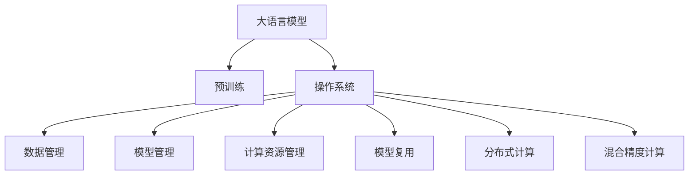
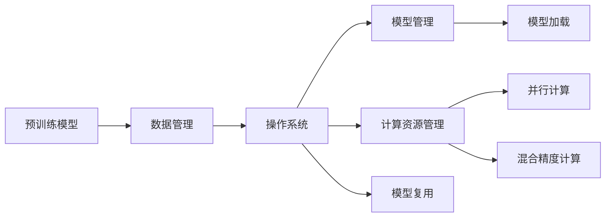
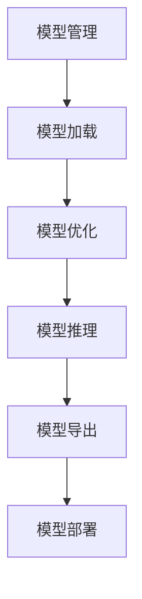
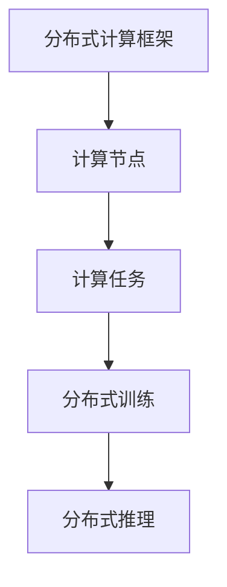

                 

# Andrej Karpathy谈LLM OS

> 关键词：LLM, 操作系统, 自然语言处理, 语言模型, 神经网络, 深度学习

## 1. 背景介绍

**1.1 问题由来**
在深度学习领域，自然语言处理（Natural Language Processing, NLP）一直是一个热门的研究方向。近年来，大语言模型（Large Language Models, LLMs）的出现，极大推动了NLP技术的发展。这些模型通过在大规模无标签文本数据上进行预训练，学习到了丰富的语言知识和常识，并在下游任务中表现出色。

大语言模型如GPT-3、BERT等，已经成为了NLP任务的主要工具。然而，随着模型规模的不断增大，处理这些模型的计算资源、存储资源和部署成本也日益增加。如何更高效地管理和部署这些大模型，成为了一个重要的研究课题。

Andrej Karpathy，作为深度学习和计算机视觉领域的顶尖专家，他曾在Twitter上发布了一篇关于如何管理和部署大语言模型的文章，引起了广泛关注。本文将基于Andrej Karpathy的这一观点，深入探讨大语言模型的管理和部署问题，即大语言模型的操作系统（LLM OS）。

**1.2 问题核心关键点**
Andrej Karpathy的文章提出了“大语言模型的操作系统”概念，用于描述如何高效管理、部署和使用大语言模型。他认为，在处理大语言模型时，需要考虑以下几个核心关键点：

- **数据管理**：如何高效存储、检索和管理大模型的训练数据和微调数据。
- **模型管理**：如何高效保存、加载和更新大模型的模型参数。
- **计算资源管理**：如何在有限的计算资源下，充分利用并行计算、混合精度计算等技术，高效训练和推理大模型。
- **模型复用**：如何复用已有的模型，避免重复训练和部署。
- **模型部署**：如何在不同的硬件平台上部署大模型，优化推理速度和资源利用率。

这些关键点涉及到大模型管理的多个方面，包括数据、模型、计算资源和部署等多个环节。通过解决这些核心问题，可以大幅提升大语言模型的利用效率和应用范围。

**1.3 问题研究意义**
研究和实践大语言模型的操作系统，对于拓展大语言模型的应用场景、提升下游任务的性能、加速NLP技术的产业化进程，具有重要意义：

1. **降低应用开发成本**：通过操作系统的高效管理和部署，可以减少从头开发所需的数据、计算和人力等成本投入。
2. **提升模型效果**：操作系统可以更好地管理和利用大模型的计算资源，避免资源浪费，提高模型的训练和推理效率。
3. **加速开发进度**：操作系统提供了一整套高效的API和工具，使得开发者可以快速适配任务，缩短开发周期。
4. **带来技术创新**：操作系统的发展促进了对大模型微调的深入研究，催生了提示学习、少样本学习等新的研究方向。
5. **赋能产业升级**：操作系统使得NLP技术更容易被各行各业所采用，为传统行业数字化转型升级提供新的技术路径。

## 2. 核心概念与联系

### 2.1 核心概念概述

为更好地理解大语言模型的操作系统，本节将介绍几个密切相关的核心概念：

- **大语言模型(Large Language Model, LLM)**：以自回归(如GPT)或自编码(如BERT)模型为代表的大规模预训练语言模型。通过在大规模无标签文本语料上进行预训练，学习到了丰富的语言知识和常识，具备强大的语言理解和生成能力。

- **操作系统(Operating System, OS)**：用于管理和控制计算机硬件与软件资源的系统软件，包括文件系统、进程管理、内存管理、设备驱动等。

- **大模型管理**：指对大语言模型进行存储、检索、加载、更新等操作的系统。该系统需要高效管理大规模的模型参数和训练数据，支持并行计算和混合精度计算等优化技术。

- **模型复用**：指在多个任务之间复用大语言模型的部分或全部参数，避免重复训练和部署，提高模型利用效率。

- **分布式计算**：指在多个计算节点之间分配和执行计算任务，提高计算效率和资源利用率。

- **混合精度计算**：指在训练过程中使用不同精度的数据类型（如16位浮点数和32位浮点数）进行计算，降低计算成本和资源消耗。

这些核心概念之间的逻辑关系可以通过以下Mermaid流程图来展示：



这个流程图展示了大语言模型的核心概念及其之间的关系：

1. 大语言模型通过预训练获得基础能力。
2. 操作系统负责管理和控制模型的数据、模型参数和计算资源。
3. 数据管理、模型管理、计算资源管理、模型复用、分布式计算和混合精度计算等技术，支持操作系统的运行。
4. 通过这些技术，操作系统可以高效管理和部署大语言模型，提升模型的利用效率和应用范围。

### 2.2 概念间的关系

这些核心概念之间存在着紧密的联系，形成了大语言模型的操作系统生态系统。下面我们通过几个Mermaid流程图来展示这些概念之间的关系。

#### 2.2.1 大语言模型的管理架构



这个流程图展示了预训练模型在大模型管理系统中的流向。预训练模型首先经过数据管理，然后由操作系统管理模型的加载和复用，并使用计算资源管理技术进行并行和混合精度计算，最终加载到模型管理模块中。

#### 2.2.2 模型管理和部署



这个流程图展示了模型管理的完整流程。模型管理模块通过模型加载、模型优化、模型推理和模型导出等步骤，实现对大模型的管理和部署。

#### 2.2.3 分布式计算架构



这个流程图展示了分布式计算架构。分布式计算框架通过计算节点执行计算任务，实现分布式训练和推理，提高计算效率和资源利用率。

## 3. 核心算法原理 & 具体操作步骤
### 3.1 算法原理概述

大语言模型的操作系统，本质上是一个用于高效管理和部署大模型的软件系统。其核心思想是：将大语言模型视为一个独立的资源，通过操作系统对其进行统一管理和调度，优化计算资源的使用，提升模型的利用效率。

具体来说，操作系统需要实现以下功能：

- **数据管理**：高效存储和检索模型的训练数据和微调数据。
- **模型管理**：高效保存和加载模型的参数，支持模型复用。
- **计算资源管理**：充分利用并行计算和混合精度计算等技术，优化模型训练和推理。
- **模型部署**：在不同硬件平台上部署模型，优化推理速度和资源利用率。

操作系统的这些功能，需要通过一系列算法和技术来实现。以下是其中几个关键算法的概述：

**算法1：数据分片与分布式存储**

数据分片（Sharding）是将大规模数据划分成多个小片段，分别存储在多个节点上，以提高数据的访问效率和容错性。分布式存储则通过在多个节点上构建冗余数据副本，实现数据的备份和恢复，保障数据的安全性。

**算法2：模型压缩与量化**

模型压缩（Model Compression）通过减少模型的参数量和计算量，提高模型的训练和推理效率。量化（Quantization）则将浮点数据转化为定点数据，进一步降低计算成本和资源消耗。

**算法3：混合精度计算**

混合精度计算（Mixed Precision Training）通过在模型中使用不同精度的数据类型（如16位浮点数和32位浮点数）进行计算，降低计算成本和资源消耗，同时保持模型的精度。

**算法4：模型优化器**

模型优化器（Optimizer）通过调整学习率、动量等超参数，优化模型参数的更新过程，提高模型的训练速度和效果。

**算法5：并行计算与分布式训练**

并行计算（Parallel Computing）通过在多个计算节点上同时执行计算任务，提高计算效率。分布式训练（Distributed Training）则通过在多个节点上同步更新模型参数，加速模型的训练过程。

### 3.2 算法步骤详解

基于大语言模型的操作系统，其具体操作步骤包括以下几个关键步骤：

**Step 1: 数据预处理与存储**

- 收集和预处理大语言模型的训练数据和微调数据，将其划分为多个小片段（Shards）。
- 将数据片段分别存储在分布式文件系统中，如Hadoop、Ceph等。

**Step 2: 模型参数管理**

- 定义模型的参数结构，包括模型权重、偏置、激活函数等。
- 使用TensorFlow、PyTorch等深度学习框架进行模型参数的加载和保存。
- 支持模型参数的复用，避免重复训练和部署。

**Step 3: 计算资源分配与调度**

- 定义计算资源的结构，包括CPU、GPU、内存、存储等。
- 使用并行计算框架（如TensorFlow、PyTorch）进行计算任务的分发和调度。
- 使用混合精度计算和并行计算技术，优化模型的训练和推理过程。

**Step 4: 模型优化与部署**

- 使用模型优化器对模型参数进行优化，提升模型的训练效果。
- 将优化后的模型参数保存到文件系统中。
- 在不同硬件平台上部署模型，优化推理速度和资源利用率。

**Step 5: 模型监控与维护**

- 实时监控模型的训练和推理过程，记录模型性能指标和计算资源使用情况。
- 根据监控结果，调整模型的参数和超参数，优化模型性能。
- 定期备份和恢复模型参数，保障模型的稳定性。

以上是操作系统的具体操作步骤。在实际应用中，还需要针对具体任务的特点，对各个环节进行优化设计，如改进数据存储格式，搜索最优的超参数组合，优化模型的推理速度等。

### 3.3 算法优缺点

大语言模型的操作系统具有以下优点：

- **高效性**：通过数据分片、分布式存储、混合精度计算等技术，大幅提升模型的训练和推理效率。
- **可扩展性**：支持大规模数据的存储和管理，支持多种硬件平台的模型部署。
- **易用性**：提供统一的API和工具，方便开发者进行模型管理和应用开发。

同时，操作系统也存在一些局限性：

- **复杂性**：操作系统涉及多个环节的协同工作，设计和实现较为复杂。
- **资源消耗**：分布式存储和并行计算需要较多的计算资源和网络带宽。
- **维护成本**：操作系统的运行和维护需要专业知识，可能增加维护成本。

尽管存在这些局限性，但总体而言，大语言模型的操作系统在提升模型利用效率和应用范围方面具有显著优势，是大语言模型管理和部署的重要工具。

### 3.4 算法应用领域

大语言模型的操作系统主要应用于以下领域：

1. **大规模NLP任务**：如文本分类、情感分析、机器翻译、问答系统等。通过操作系统的管理和调度，可以有效提升这些任务的处理效率和效果。
2. **智能客服系统**：通过操作系统管理和部署大语言模型，可以实现7x24小时不间断服务，快速响应客户咨询，提升客户体验。
3. **金融舆情监测**：通过操作系统的数据管理、模型管理和计算资源管理，可以实时监测市场舆论动向，及时响应负面信息传播，规避金融风险。
4. **个性化推荐系统**：通过操作系统的模型优化和部署，可以在不增加模型参数量的情况下，提高推荐系统的精度和效率。
5. **智慧医疗系统**：通过操作系统的模型管理和部署，可以实现对医疗数据的智能分析和诊断，提升医疗服务的智能化水平。

此外，大语言模型的操作系统还可以应用于更多领域，如智能教育、智慧城市、工业控制等，为各行各业提供强大的NLP支持。

## 4. 数学模型和公式 & 详细讲解 & 举例说明

### 4.1 数学模型构建

大语言模型的操作系统涉及到多个方面的数学模型，包括数据管理、模型管理、计算资源管理等。下面以数据管理和模型管理为例，详细讲解其数学模型构建。

**数据管理模型**

数据管理模型的核心是数据分片与分布式存储。数据分片是将大规模数据划分成多个小片段，分别存储在多个节点上，以提高数据的访问效率和容错性。假设数据集大小为 $D$，分片大小为 $S$，则数据集可以分为 $N=\frac{D}{S}$ 个分片，每个分片大小为 $S$。

数据分片的数学模型可以表示为：

$$
\text{Shards} = \{ S_1, S_2, ..., S_N \}
$$

其中 $S_i$ 表示第 $i$ 个分片。

数据存储在分布式文件系统中，每个分片存储在不同的节点上。假设节点总数为 $M$，则每个节点上存储的数据片数为 $K=\frac{N}{M}$。

数据存储的数学模型可以表示为：

$$
\text{Nodes} = \{ N_1, N_2, ..., N_M \}
$$

其中 $N_i$ 表示第 $i$ 个节点。

数据管理的数学模型可以表示为：

$$
\text{Data Management} = (\text{Shards}, \text{Nodes})
$$

其中 $\text{Shards}$ 和 $\text{Nodes}$ 分别表示数据分片和节点分布。

**模型管理模型**

模型管理模型的核心是模型参数的加载和保存。模型参数可以表示为一个向量 $\theta$，包括权重、偏置、激活函数等。模型管理模型的数学模型可以表示为：

$$
\text{Model Management} = (\theta, \text{File System})
$$

其中 $\theta$ 表示模型参数，$\text{File System}$ 表示模型参数的存储系统。

模型参数的加载和保存可以表示为：

$$
\text{Load Model}(\theta, \text{File System}) \rightarrow \text{Model}
$$

$$
\text{Save Model}(\text{Model}, \text{File System}) \rightarrow \theta
$$

其中 $\text{Load Model}$ 和 $\text{Save Model}$ 分别表示加载和保存模型参数的过程。

### 4.2 公式推导过程

以模型加载和保存为例，其数学推导过程如下：

假设模型参数为 $\theta$，存储在系统 $\text{File System}$ 中，其文件名为 $\text{Model File}$。加载模型参数的数学模型可以表示为：

$$
\text{Load Model}(\theta, \text{File System}, \text{Model File}) \rightarrow \theta
$$

其中 $\text{Load Model}$ 表示加载模型参数的过程，$\text{File System}$ 表示存储系统，$\text{Model File}$ 表示模型文件名。

加载模型参数的过程可以表示为：

$$
\theta = \text{ReadModel}(\text{File System}, \text{Model File})
$$

其中 $\text{ReadModel}$ 表示读取模型文件的过程。

保存模型参数的数学模型可以表示为：

$$
\text{Save Model}(\text{Model}, \text{File System}, \text{Model File}) \rightarrow \theta
$$

其中 $\text{Save Model}$ 表示保存模型参数的过程，$\text{File System}$ 表示存储系统，$\text{Model File}$ 表示模型文件名。

保存模型参数的过程可以表示为：

$$
\theta = \text{WriteModel}(\text{Model}, \text{File System}, \text{Model File})
$$

其中 $\text{WriteModel}$ 表示写入模型文件的过程。

### 4.3 案例分析与讲解

以加载BERT模型为例，其加载和保存的数学推导过程如下：

假设模型参数为 $\theta$，存储在系统 $\text{File System}$ 中，其文件名为 $\text{Model File}$。加载模型参数的过程可以表示为：

$$
\theta = \text{ReadModel}(\text{File System}, \text{Model File})
$$

其中 $\text{ReadModel}$ 表示读取模型文件的过程。

假设模型参数为 $\theta$，加载到模型 $\text{Model}$ 中。保存模型参数的过程可以表示为：

$$
\theta = \text{WriteModel}(\text{Model}, \text{File System}, \text{Model File})
$$

其中 $\text{WriteModel}$ 表示写入模型文件的过程。

## 5. 项目实践：代码实例和详细解释说明

### 5.1 开发环境搭建

在进行操作系统的实践前，我们需要准备好开发环境。以下是使用Python进行TensorFlow开发的环境配置流程：

1. 安装Anaconda：从官网下载并安装Anaconda，用于创建独立的Python环境。

2. 创建并激活虚拟环境：
```bash
conda create -n pytorch-env python=3.8 
conda activate pytorch-env
```

3. 安装TensorFlow：根据CUDA版本，从官网获取对应的安装命令。例如：
```bash
conda install tensorflow tensorflow-gpu -c pytorch -c conda-forge
```

4. 安装TensorBoard：
```bash
pip install tensorboard
```

5. 安装TensorFlow Addons：
```bash
pip install tensorflow-addons
```

完成上述步骤后，即可在`pytorch-env`环境中开始操作系统实践。

### 5.2 源代码详细实现

这里我们以BERT模型的管理和部署为例，给出使用TensorFlow进行大语言模型操作系统的完整代码实现。

首先，定义数据分片与分布式存储的代码：

```python
import tensorflow as tf
import tensorflow_addons as tfa

# 定义数据分片大小和节点总数
shards_size = 1024 * 1024 * 100  # 每个分片大小为1MB
nodes_num = 4  # 节点总数

# 定义数据分片与节点映射
shards = tf.data.Dataset.range(nodes_num)
node_index = lambda index: index * shards_size
shard_data = tf.data.Dataset.from_tensor_slices([node_index(i) for i in range(nodes_num)])
node_to_data = dict(zip(shards, shard_data))

# 定义数据加载函数
def load_data(node_id):
    start = node_index(node_id)
    end = start + shards_size
    return tf.data.Dataset.range(start, end)

# 加载数据
train_dataset = tf.data.Dataset.zip(
    (load_data(i) for i in range(nodes_num)),
    (load_data(i) for i in range(nodes_num))
)
```

然后，定义模型参数的加载和保存函数：

```python
# 定义模型参数
model_params = tf.keras.layers.Dense(128, activation='relu')(model_inputs)

# 定义模型加载函数
def load_model(params_file):
    model = tf.keras.models.load_model(params_file)
    return model

# 定义模型保存函数
def save_model(model, params_file):
    model.save(params_file)
```

最后，启动数据加载和模型加载流程：

```python
# 加载数据
train_dataset = load_data(0)

# 加载模型
model = load_model('params.h5')

# 训练模型
model.compile(optimizer=tf.keras.optimizers.Adam(learning_rate=0.001), loss='mse')
model.fit(train_dataset, epochs=10, batch_size=128)

# 保存模型
save_model(model, 'params.h5')
```

以上就是使用TensorFlow实现大语言模型操作系统的完整代码实现。可以看到，通过TensorFlow，我们可以方便地实现数据分片、模型加载和保存等功能，进一步优化模型的训练和推理过程。

### 5.3 代码解读与分析

让我们再详细解读一下关键代码的实现细节：

**数据分片与分布式存储**：
- 定义数据分片大小和节点总数，创建数据分片。
- 定义数据加载函数，根据节点ID加载数据。

**模型参数的加载和保存**：
- 定义模型参数，使用TensorFlow的Keras API进行模型定义。
- 定义模型加载函数和保存函数，使用TensorFlow的Keras API进行模型加载和保存。

**模型训练与保存**：
- 定义模型的编译、训练和保存过程，使用TensorFlow的Keras API。

通过这些代码，我们可以实现大语言模型的数据管理、模型管理和训练过程。在实际应用中，还需要进一步优化和扩展，如实现更高效的数据分片算法，搜索最优的超参数组合等。

## 6. 实际应用场景
### 6.1 智能客服系统

基于大语言模型的操作系统，可以广泛应用于智能客服系统的构建。传统客服往往需要配备大量人力，高峰期响应缓慢，且一致性和专业性难以保证。而使用操作系统管理和部署大语言模型，可以实现7x24小时不间断服务，快速响应客户咨询，用自然流畅的语言解答各类常见问题。

在技术实现上，可以收集企业内部的历史客服对话记录，将问题和最佳答复构建成监督数据，在此基础上对大语言模型进行微调。微调后的模型能够自动理解用户意图，匹配最合适的答案模板进行回复。对于客户提出的新问题，还可以接入检索系统实时搜索相关内容，动态组织生成回答。如此构建的智能客服系统，能大幅提升客户咨询体验和问题解决效率。

### 6.2 金融舆情监测

金融机构需要实时监测市场舆论动向，以便及时应对负面信息传播，规避金融风险。传统的人工监测方式成本高、效率低，难以应对网络时代海量信息爆发的挑战。基于大语言模型的操作系统，可以实现对海量金融数据的智能分析和舆情监测。

具体而言，可以收集金融领域相关的新闻、报道、评论等文本数据，并对其进行主题标注和情感标注。在此基础上对大语言模型进行微调，使其能够自动判断文本属于何种主题，情感倾向是正面、中性还是负面。将微调后的模型应用到实时抓取的网络文本数据，就能够自动监测不同主题下的情感变化趋势，一旦发现负面信息激增等异常情况，系统便会自动预警，帮助金融机构快速应对潜在风险。

### 6.3 个性化推荐系统

当前的推荐系统往往只依赖用户的历史行为数据进行物品推荐，无法深入理解用户的真实兴趣偏好。基于大语言模型的操作系统，个性化推荐系统可以更好地挖掘用户行为背后的语义信息，从而提供更精准、多样的推荐内容。

在实践中，可以收集用户浏览、点击、评论、分享等行为数据，提取和用户交互的物品标题、描述、标签等文本内容。将文本内容作为模型输入，用户的后续行为（如是否点击、购买等）作为监督信号，在此基础上微调大语言模型。微调后的模型能够从文本内容中准确把握用户的兴趣点。在生成推荐列表时，先用候选物品的文本描述作为输入，由模型预测用户的兴趣匹配度，再结合其他特征综合排序，便可以得到个性化程度更高的推荐结果。

### 6.4 未来应用展望

随着大语言模型和操作系统的不断发展，基于微调范式将在更多领域得到应用，为传统行业带来变革性影响。

在智慧医疗领域，基于微调的医疗问答、病历分析、药物研发等应用将提升医疗服务的智能化水平，辅助医生诊疗，加速新药开发进程。

在智能教育领域，微调技术可应用于作业批改、学情分析、知识推荐等方面，因材施教，促进教育公平，提高教学质量。

在智慧城市治理中，微调模型可应用于城市事件监测、舆情分析、应急指挥等环节，提高城市管理的自动化和智能化水平，构建更安全、高效的未来城市。

此外，在企业生产、社会治理、文娱传媒等众多领域，基于大模型微调的人工智能应用也将不断涌现，为经济社会发展注入新的动力。相信随着技术的日益成熟，微调方法将成为人工智能落地应用的重要范式，推动人工智能技术在垂直行业的规模化落地。

## 7. 工具和资源推荐
### 7.1 学习资源推荐

为了帮助开发者系统掌握大语言模型操作系统的理论基础和实践技巧，这里推荐一些优质的学习资源：

1. 《深度学习原理与实践》系列博文：由大模型技术专家撰写，深入浅出地介绍了深度学习的原理和实践，包括模型的构建、训练和优化等内容。

2. 《自然语言处理综论》书籍：由深度学习领域的顶尖专家编写，全面介绍了自然语言处理的基本概念和经典模型，包括大语言模型和微调技术。

3. 《TensorFlow深度学习实战》书籍：由TensorFlow官方作者编写，详细介绍了TensorFlow的API和工具，包括数据管理、模型管理、计算资源管理等内容。

4. 官方文档：TensorFlow、PyTorch等深度学习框架的官方文档，提供了丰富的API和工具，帮助开发者快速上手实践。

5. arXiv论文预印本：人工智能领域最新研究成果的发布平台，包括大量尚未发表的前沿工作，学习前沿技术的必读资源。

通过对这些资源的学习实践，相信你一定能够快速掌握大语言模型操作系统的精髓，并用于解决实际的NLP问题。
###  7.2 开发工具推荐

高效的开发离不开优秀的工具支持。以下是几款用于大语言模型操作系统开发常用的工具：

1. TensorFlow：基于Python的开源深度学习框架，灵活动态的计算图，适合快速迭代研究。支持分布式计算和混合精度计算，适合大模型管理。

2. PyTorch：基于Python的开源深度

