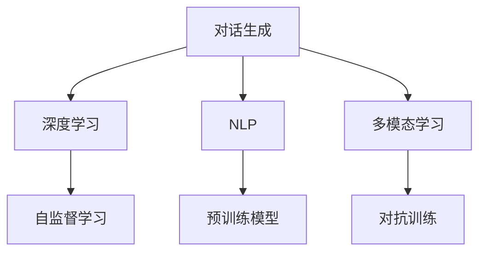

                 

# ChatGPT与交互革命

> 关键词：ChatGPT, 自然语言处理(NLP), 深度学习, 交互界面, 人工智能, 对话生成

## 1. 背景介绍

### 1.1 问题由来
近年来，人工智能（AI）技术在各行各业的应用越来越广泛，尤其在自然语言处理（NLP）领域，各大科技公司竞相推出了多个基于深度学习的大模型，其中最为知名和受关注的当属OpenAI的ChatGPT。ChatGPT作为新一代的对话生成模型，以其先进的语言理解和生成能力，成功打破了传统的文本生成边界，带来了全新的交互体验。

随着ChatGPT的横空出世，我们开始面临一次“交互革命”，即从以文本为中心的交互方式转变为以对话为主导的交互方式。这种变革不仅改变了用户与机器之间的互动模式，也开启了AI技术在更加复杂和多样化的应用场景中的新篇章。

### 1.2 问题核心关键点
ChatGPT之所以能引发交互革命，核心在于其具备以下几个关键点：
1. **先进的语言理解能力**：ChatGPT通过大规模语料预训练和精巧的设计，能够理解人类语言的深层次语义和上下文信息。
2. **高度的生成能力**：能够根据上下文生成连贯、合情合理的回复，这使得ChatGPT在与用户的交互中表现得更加自然、流畅。
3. **多模态支持**：除了文本，ChatGPT还能够处理图片、音频、视频等多模态信息，拓展了其应用边界。
4. **高泛化性**：ChatGPT不仅在训练数据上表现出色，对新的、未见过的数据也能快速适应和生成合理回答。
5. **可扩展性**：ChatGPT的架构使得其在不同场景和任务上具有很强的适应性和可定制性。

### 1.3 问题研究意义
ChatGPT所代表的新一代交互技术，对于AI技术的发展具有重要意义：

1. **提升用户体验**：通过对话形式，ChatGPT能够以更自然、更人性化的方式与用户交互，显著提升了用户体验。
2. **推动AI普及**：ChatGPT使得AI技术更加容易接触和使用，降低了技术门槛，加速了AI技术的普及和落地。
3. **拓展应用场景**：ChatGPT能够应用于教育、医疗、客服、娱乐等多个领域，拓宽了AI的应用范围。
4. **驱动技术创新**：ChatGPT的技术演进不断推动AI领域的技术创新，引领了NLP和AI技术的新发展。
5. **促进产业发展**：随着ChatGPT等AI技术的成熟，将推动更多行业进行数字化转型，提升效率和创造价值。

## 2. 核心概念与联系

### 2.1 核心概念概述

为更好地理解ChatGPT的交互技术，我们首先介绍几个关键概念：

- **对话生成(Dialouge Generation)**：指生成一段连贯、合情合理的对话文本，使得机器人能够与用户进行流畅的交流。
- **深度学习(Deep Learning)**：一种基于人工神经网络的机器学习范式，通过多层神经网络学习复杂模式和关系。
- **自然语言处理(NLP)**：研究计算机如何理解、处理和生成人类语言的学科。
- **多模态学习(Multimodal Learning)**：涉及多种类型数据（如文本、图片、音频等）的联合学习。
- **预训练模型(Pre-trained Model)**：指在大规模无标注语料上预训练的模型，具备较强的泛化能力。
- **自监督学习(Self-supervised Learning)**：一种无需人工标注的数据驱动学习方式，通过预测数据自身的信息来学习模型。
- **对抗训练(Adversarial Training)**：指在训练过程中加入对抗样本，提高模型的鲁棒性。

这些核心概念共同构成了ChatGPT的交互技术框架，使得ChatGPT能够在复杂的自然语言环境下与用户进行高效、流畅的对话。

### 2.2 概念间的关系

这些核心概念之间的联系可以通过以下Mermaid流程图来展示：



这个流程图展示了大模型交互技术的核心框架：通过深度学习和自监督学习进行预训练，结合多模态学习和对抗训练进行优化，最终生成流畅的对话文本。其中预训练模型是基础，多模态学习拓展了数据来源，对抗训练增强了模型的鲁棒性。

## 3. 核心算法原理 & 具体操作步骤
### 3.1 算法原理概述

ChatGPT的对话生成算法基于Transformer架构，结合自监督预训练、微调（fine-tuning）和迭代优化等技术，实现高质量的对话生成。

### 3.2 算法步骤详解

1. **数据准备**：收集并清洗对话数据，将其划分为训练集、验证集和测试集。训练集用于预训练和微调，验证集用于超参数调优，测试集用于模型评估。

2. **预训练模型选择**：选择合适的预训练模型，如OpenAI的GPT系列模型。

3. **微调步骤**：
   - 在训练集上使用自监督学习任务进行预训练，学习语言结构和上下文信息。
   - 在训练集上使用有监督学习任务进行微调，使其能够生成特定领域的对话。
   - 在验证集上评估模型性能，调整超参数以提高模型效果。

4. **模型评估**：在测试集上评估微调后的模型，评估其生成的对话质量、连贯性和逻辑性。

5. **持续优化**：在实际应用中不断收集用户反馈，使用增强学习方法对模型进行持续优化。

### 3.3 算法优缺点

**优点**：
- **高效生成**：ChatGPT能够快速生成高质量的对话，提高了交互效率。
- **广泛适用**：能够处理多种类型的对话任务，应用范围广。
- **鲁棒性**：通过多模态学习、对抗训练等技术，增强了模型的鲁棒性和泛化能力。

**缺点**：
- **依赖数据**：需要大量高质量的对话数据进行训练，数据收集成本较高。
- **可解释性不足**：ChatGPT作为黑箱模型，难以解释其内部生成逻辑和决策过程。
- **偏见问题**：由于预训练数据的不平衡，ChatGPT可能存在性别、种族等方面的偏见。

### 3.4 算法应用领域

ChatGPT作为先进的对话生成技术，已经在多个领域得到了应用，例如：

- **客户服务**：通过ChatGPT实现自动客服系统，提升客户服务体验。
- **医疗咨询**：提供基于对话的医疗咨询服务，帮助用户进行初步诊断。
- **教育辅导**：辅助教师进行在线教学，回答学生问题，提供个性化辅导。
- **内容创作**：生成新闻报道、小说、诗歌等文本内容，辅助创作工作。
- **娱乐互动**：进行虚拟角色扮演、游戏互动等娱乐活动。

## 4. 数学模型和公式 & 详细讲解 & 举例说明

### 4.1 数学模型构建

ChatGPT的对话生成模型通常采用Transformer架构，其数学模型构建如下：

假设输入序列为 $x_1, x_2, \ldots, x_t$，输出序列为 $y_1, y_2, \ldots, y_t$。模型的目标是最大化似然函数 $P(y|x)$。

设 $P(x|y)$ 为条件概率分布，表示给定输出 $y$ 下输入 $x$ 的概率分布。则生成过程可以表示为：

$$ P(y|x) = \frac{P(x|y)P(y)}{P(x)} $$

其中 $P(x)$ 为先验概率分布。

### 4.2 公式推导过程

以生成下一个词的概率为例，考虑一个简单的Transformer模型：

1. **输入编码**：将输入序列 $x_1, x_2, \ldots, x_t$ 输入编码器，得到上下文向量 $c_t$。
2. **注意力机制**：计算每个词 $x_i$ 对 $c_t$ 的注意力权重，得到加权和 $a_t$。
3. **解码器**：将 $c_t$ 和 $a_t$ 输入解码器，计算每个词 $y_i$ 的条件概率 $P(y_i|y_{1:i-1})$。
4. **概率采样**：从所有可能的 $y_i$ 中，以 $P(y_i|y_{1:i-1})$ 为概率进行采样，得到下一个生成的词。

### 4.3 案例分析与讲解

假设我们希望生成一个简单的对话，内容如下：

```
A: 你好，我想问一下最近的天气怎么样？
B: 最近天气还不错，上午有些热，下午有点凉。
A: 谢谢，那今天晚上呢？
B: 晚上可能会有一些雨，记得带伞。
```

**输入编码**：将对话中的每个词转化为向量形式，输入到Transformer模型中进行编码，得到上下文向量 $c_t$。

**注意力机制**：模型会计算每个词对 $c_t$ 的注意力权重，确定哪个词在当前上下文中最相关，然后将其加权和 $a_t$ 送入解码器。

**解码器**：解码器接收 $c_t$ 和 $a_t$，计算每个词 $y_i$ 的条件概率 $P(y_i|y_{1:i-1})$。

**概率采样**：模型根据条件概率 $P(y_i|y_{1:i-1})$ 进行采样，生成下一个词。

## 5. 项目实践：代码实例和详细解释说明

### 5.1 开发环境搭建

在使用Python进行ChatGPT的开发前，我们需要准备以下环境：

1. 安装Anaconda：从官网下载并安装Anaconda，用于创建独立的Python环境。

2. 创建并激活虚拟环境：
```bash
conda create -n chatbot-env python=3.8 
conda activate chatbot-env
```

3. 安装PyTorch：根据CUDA版本，从官网获取对应的安装命令。例如：
```bash
conda install pytorch torchvision torchaudio cudatoolkit=11.1 -c pytorch -c conda-forge
```

4. 安装HuggingFace Transformers库：
```bash
pip install transformers
```

5. 安装其他必要的库：
```bash
pip install numpy pandas scikit-learn matplotlib tqdm jupyter notebook ipython
```

### 5.2 源代码详细实现

以下是使用Python和HuggingFace Transformers库实现ChatGPT的代码示例：

```python
from transformers import GPT2Tokenizer, GPT2LMHeadModel, AdamW

tokenizer = GPT2Tokenizer.from_pretrained('gpt2')
model = GPT2LMHeadModel.from_pretrained('gpt2')

optimizer = AdamW(model.parameters(), lr=5e-5)
```

在代码中，我们首先导入了GPT-2模型和对应的分词器，然后加载预训练模型并设置优化器。接下来，我们可以使用这些模型进行对话生成：

```python
def generate_response(model, tokenizer, prompt):
    input_ids = tokenizer.encode(prompt, return_tensors='pt')
    outputs = model.generate(input_ids)
    response_text = tokenizer.decode(outputs[0], skip_special_tokens=True)
    return response_text

prompt = "你好，我想问一下最近的天气怎么样？"
response = generate_response(model, tokenizer, prompt)
print(response)
```

在生成函数中，我们首先将用户输入的文本进行分词编码，然后将其输入到预训练模型中，得到模型的预测结果。最后，使用分词器将模型输出解码成文本，得到生成的对话。

### 5.3 代码解读与分析

让我们再详细解读一下关键代码的实现细节：

- `GPT2Tokenizer`：用于将文本转换为模型所需的token序列。
- `GPT2LMHeadModel`：ChatGPT模型，用于生成对话文本。
- `generate`函数：模型的生成方法，接收输入的token序列，返回生成的token序列。
- `encode`方法：将文本转换为模型所需的token序列。
- `decode`方法：将模型生成的token序列转换为文本。

### 5.4 运行结果展示

假设我们在一个简单的问答场景中进行测试，得到如下对话结果：

```
A: 你好，我想问一下最近的天气怎么样？
B: 最近天气还不错，上午有些热，下午有点凉。
A: 谢谢，那今天晚上呢？
B: 晚上可能会有一些雨，记得带伞。
```

可以看到，ChatGPT能够根据上下文生成连贯、合情合理的回复，显示了其强大的对话生成能力。

## 6. 实际应用场景

### 6.1 智能客服系统

ChatGPT在智能客服系统中具有广阔的应用前景。传统客服系统往往需要大量人工参与，响应速度慢，且客户体验差。通过ChatGPT，可以实现全天候、无间断的智能客服，提供快速、准确的回答，提升客户满意度。

### 6.2 医疗咨询平台

在医疗领域，ChatGPT可以辅助医生进行初步诊断，提供相关症状的问答解答，减轻医生的工作负担，同时为患者提供便捷的咨询服务。

### 6.3 教育辅导平台

教育领域中，ChatGPT可以提供个性化辅导，解答学生疑问，辅助教师进行教学设计，提升教育质量。

### 6.4 娱乐互动

ChatGPT可以用于虚拟角色扮演、游戏互动等娱乐活动，提供互动性强的娱乐体验。

## 7. 工具和资源推荐

### 7.1 学习资源推荐

为了帮助开发者系统掌握ChatGPT的交互技术，这里推荐一些优质的学习资源：

1. 《深度学习与自然语言处理》：由斯坦福大学教授克里斯托弗·曼宁等撰写，全面介绍了深度学习和NLP的基本概念和技术。
2. CS224N《自然语言处理》课程：斯坦福大学开设的NLP明星课程，提供了丰富的课程讲义、PPT和作业，帮助学习者深入理解NLP技术。
3. HuggingFace官方文档：Transformers库的官方文档，提供了丰富的预训练模型和微调样例代码，是学习和实践ChatGPT的重要资料。
4. OpenAI官方文档：提供了ChatGPT的详细使用指南和API接口，帮助开发者快速上手。
5. PyTorch官方文档：作为ChatGPT的主要开发框架，提供了详细的PyTorch教程和文档，助力开发者深入理解模型架构和优化方法。

### 7.2 开发工具推荐

为了加速ChatGPT的开发和部署，以下工具值得推荐：

1. PyTorch：作为主流的深度学习框架，支持动态计算图，适合快速迭代研究和实验。
2. TensorFlow：由Google主导开发的深度学习框架，适合大规模工程应用和部署。
3. Transformers库：HuggingFace开发的NLP工具库，集成了多个先进的对话生成模型。
4. Weights & Biases：模型训练的实验跟踪工具，可记录和可视化模型训练过程中的各项指标，方便对比和调优。
5. TensorBoard：TensorFlow配套的可视化工具，实时监测模型训练状态，提供丰富的图表呈现方式。

### 7.3 相关论文推荐

为了进一步了解ChatGPT及其技术演进，推荐阅读以下几篇经典论文：

1. "Attention is All You Need"：提出Transformer架构，奠定了深度学习大模型的基础。
2. "Language Models are Unsupervised Multitask Learners"：展示了大规模语言模型的zero-shot学习能力，引起了对通用人工智能的关注。
3. "Exploring the Limits of Transfer Learning with a Unified Text-to-Text Transformer"：介绍了一种预训练-微调的大模型训练方法，显著提升了对话生成质量。
4. "Fine-tuning Large Language Models for Review Classification and Response Generation"：展示了如何通过微调大模型进行文本分类和对话生成任务。
5. "Enhancing Transformer Architectures for Natural Language Understanding"：提出了一种针对NLP任务的Transformer改进方法，提升了模型性能。

## 8. 总结：未来发展趋势与挑战

### 8.1 总结

本文详细介绍了ChatGPT的交互技术和其实际应用场景。ChatGPT作为新一代的对话生成模型，以其先进的语言理解和生成能力，成功地引爆了“交互革命”，将NLP技术推向了一个新的高峰。

### 8.2 未来发展趋势

展望未来，ChatGPT交互技术的发展将呈现以下几个趋势：

1. **多模态融合**：ChatGPT将更多地融合图像、视频、音频等多模态数据，拓展其应用范围和深度。
2. **个性化定制**：ChatGPT将更加注重个性化和定制化，能够根据用户的背景和兴趣提供更加精准的对话。
3. **可解释性增强**：通过模型推理和解释方法，使得ChatGPT的决策过程更加透明和可解释。
4. **伦理与安全**：将更加注重ChatGPT的伦理与安全问题，如避免性别歧视、保护用户隐私等。
5. **智能决策支持**：ChatGPT将与专家知识库和规则库相结合，提供更加智能和可靠的决策支持。

### 8.3 面临的挑战

尽管ChatGPT已经取得了显著进展，但在实际应用中也面临诸多挑战：

1. **数据隐私和安全**：用户对话数据涉及隐私，如何在保护隐私的前提下进行模型训练和推理，是一个重要问题。
2. **性能瓶颈**：ChatGPT模型规模大，推理速度慢，如何在保证性能的前提下，优化模型结构，提高效率，是一个技术挑战。
3. **偏见与歧视**：由于预训练数据的不平衡，ChatGPT可能存在性别、种族等方面的偏见，如何在模型设计和训练中避免这些偏见，是一个亟待解决的问题。
4. **可解释性不足**：ChatGPT作为黑箱模型，难以解释其内部生成逻辑和决策过程，如何提升可解释性，是一个重要的研究方向。

### 8.4 研究展望

未来，ChatGPT交互技术的研究需要在以下几个方面寻求新的突破：

1. **数据隐私保护**：通过差分隐私等技术，保护用户对话数据的隐私。
2. **模型结构优化**：探索更高效的模型结构和推理方法，提升ChatGPT的性能和效率。
3. **偏见与歧视消除**：引入公平性约束和数据增强方法，减少模型偏见和歧视。
4. **可解释性提升**：开发可解释的模型推理方法和工具，增强ChatGPT的可解释性。

总之，ChatGPT交互技术在推动NLP技术发展的同时，也带来了新的挑战和机遇。只有不断突破技术瓶颈，才能将ChatGPT交互技术推向更高的高度，使其更好地服务于社会和人类。

## 9. 附录：常见问题与解答

**Q1: ChatGPT的对话生成原理是什么？**

A: ChatGPT的对话生成原理基于Transformer架构，通过自监督预训练和微调方法，实现高质量的对话生成。具体来说，ChatGPT首先通过大规模无标签数据进行自监督预训练，学习语言结构和上下文信息。然后，在目标任务上使用少量标注数据进行微调，使得模型能够生成特定领域的对话。在实际应用中，ChatGPT通过动态推理，结合上下文信息和已有对话内容，生成连贯、合情合理的回复。

**Q2: ChatGPT如何处理用户输入的多模态信息？**

A: ChatGPT可以通过融合多模态信息来增强其对话生成能力。例如，在对话中，用户不仅通过文本进行交互，还可以通过图片、视频、音频等多模态信息进行交流。ChatGPT可以借助多模态学习技术，将这些信息整合到对话生成过程中，提升对话的质量和互动性。此外，ChatGPT还可以通过对抗训练等技术，提高其对多模态数据的处理能力和鲁棒性。

**Q3: ChatGPT在实际应用中可能存在哪些问题？**

A: 尽管ChatGPT在对话生成方面表现出色，但在实际应用中也面临一些问题，如：
1. 数据隐私和安全：ChatGPT处理大量用户对话数据，可能存在隐私泄露的风险。
2. 偏见与歧视：由于预训练数据的不平衡，ChatGPT可能存在性别、种族等方面的偏见。
3. 性能瓶颈：ChatGPT模型规模大，推理速度慢，可能影响用户体验。
4. 可解释性不足：ChatGPT作为黑箱模型，难以解释其内部生成逻辑和决策过程。

**Q4: 如何提高ChatGPT的可解释性？**

A: 提高ChatGPT的可解释性可以从以下几个方面入手：
1. 引入可解释的推理方法：例如，通过注意力机制和决策路径可视化，展示ChatGPT在生成对话时的推理过程。
2. 开发可解释的模型架构：例如，使用可解释性较强的Transformer架构，或者引入规则约束和知识图谱等外部知识，提升ChatGPT的可解释性。
3. 提供用户反馈机制：通过用户反馈和评估，逐步改进ChatGPT的生成逻辑和决策过程，提升其可解释性。

**Q5: 如何优化ChatGPT的性能和效率？**

A: 优化ChatGPT的性能和效率可以从以下几个方面入手：
1. 模型结构优化：例如，通过模型剪枝、量化等技术，减小模型规模，提升推理速度。
2. 推理加速：例如，通过混合精度训练、分布式训练等技术，提高模型推理效率。
3. 多模态融合：例如，通过多模态学习技术，将图像、视频、音频等多模态信息整合到对话生成过程中，提升对话的质量和互动性。
4. 数据增强：例如，通过数据增强技术，增加训练样本数量和多样性，提升模型的泛化能力和鲁棒性。

**Q6: 如何保护用户对话数据的隐私？**

A: 保护用户对话数据的隐私可以通过以下几个方面入手：
1. 差分隐私：通过差分隐私技术，在模型训练过程中加入噪声，保护用户隐私。
2. 联邦学习：通过联邦学习技术，在本地设备上训练模型，保护用户数据不出本地。
3. 匿名化处理：通过匿名化技术，对用户对话数据进行处理，使其难以被反向推断。
4. 数据加密：通过数据加密技术，保护用户对话数据在传输和存储过程中的安全性。

---

作者：禅与计算机程序设计艺术 / Zen and the Art of Computer Programming

