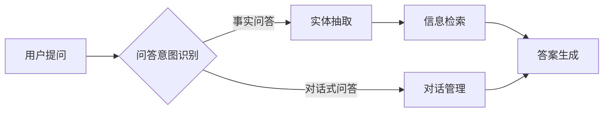

> 关键词：大模型问答系统，语义编码，自然语言处理，问答意图识别，实体抽取，信息检索，预训练模型，BERT，GPT，知识图谱

# 大模型问答机器人如何编码语义

在人工智能领域，问答机器人已经成为一项重要的技术应用。随着大语言模型（Large Language Model，LLM）的兴起，问答机器人的性能得到了显著提升。其中，语义编码作为问答系统的核心技术之一，其作用不言而喻。本文将深入探讨大模型问答机器人在语义编码方面的原理、方法及实践，以期为您提供全面的了解。

## 1. 背景介绍

问答系统旨在通过自然语言与人类用户进行交互，回答用户提出的问题。随着互联网信息的爆炸式增长，如何从海量的信息中快速、准确地找到答案，成为了问答系统研究的热点。传统的基于规则和关键词匹配的问答系统，已经无法满足用户对信息获取效率和质量的需求。而大模型问答系统凭借其强大的语义理解能力，能够更好地理解用户意图，提供更加精准的答案。

## 2. 核心概念与联系

### 2.1 核心概念

#### 2.1.1 语义编码

语义编码是指将自然语言文本转化为计算机可以理解和处理的形式。在问答系统中，语义编码是理解用户意图、提取关键信息以及检索答案的基础。

#### 2.1.2 问答意图识别

问答意图识别是指识别用户问题的意图，如事实问答、对话式问答等。

#### 2.1.3 实体抽取

实体抽取是指从文本中识别出实体信息，如人名、地名、组织名等。

#### 2.1.4 信息检索

信息检索是指从数据库或知识库中检索与问题相关的信息。

### 2.2 核心概念原理和架构的 Mermaid 流程图



## 3. 核心算法原理 & 具体操作步骤

### 3.1 算法原理概述

大模型问答系统的语义编码主要基于以下步骤：

1. 问答意图识别：利用预训练模型对用户问题进行分类，识别问题意图。
2. 实体抽取：从用户问题中抽取实体信息，包括人名、地名、组织名等。
3. 信息检索：根据问题意图和实体信息，从数据库或知识库中检索答案。
4. 答案生成：将检索到的信息进行整合，生成符合用户意图的答案。

### 3.2 算法步骤详解

#### 3.2.1 问答意图识别

问答意图识别主要基于预训练模型进行。常用的预训练模型有BERT、GPT等。通过将用户问题输入预训练模型，模型能够输出问题的分类结果。

#### 3.2.2 实体抽取

实体抽取主要基于命名实体识别（Named Entity Recognition，NER）技术。常用的NER模型有基于序列标注的模型和基于端到端的模型。

#### 3.2.3 信息检索

信息检索主要基于信息检索技术。常用的信息检索技术有基于关键词匹配的检索和基于语义相似度的检索。

#### 3.2.4 答案生成

答案生成主要基于文本生成技术。常用的文本生成技术有基于规则的方法和基于预训练模型的方法。

### 3.3 算法优缺点

#### 3.3.1 优点

1. 准确性高：大模型问答系统能够更好地理解用户意图，提供更加精准的答案。
2. 通用性强：大模型问答系统可以适用于多种类型的问答任务。
3. 自适应性强：大模型问答系统可以根据用户反馈进行自适应调整。

#### 3.3.2 缺点

1. 计算成本高：大模型问答系统需要大量的计算资源。
2. 对数据依赖性强：大模型问答系统的性能很大程度上取决于训练数据的质量和数量。
3. 可解释性差：大模型问答系统的决策过程缺乏可解释性。

### 3.4 算法应用领域

大模型问答系统可以应用于以下领域：

1. 智能客服
2. 问答系统
3. 机器翻译
4. 智能助手

## 4. 数学模型和公式 & 详细讲解 & 举例说明

### 4.1 数学模型构建

#### 4.1.1 问答意图识别

问答意图识别的数学模型通常采用分类器进行构建。常见的分类器有支持向量机（SVM）、神经网络等。

#### 4.1.2 实体抽取

实体抽取的数学模型通常采用序列标注模型进行构建。常见的序列标注模型有条件随机场（CRF）、BiLSTM+CRF等。

#### 4.1.3 信息检索

信息检索的数学模型通常采用检索函数进行构建。常见的检索函数有TF-IDF、BM25等。

#### 4.1.4 答案生成

答案生成的数学模型通常采用预训练模型进行构建。常见的预训练模型有BERT、GPT等。

### 4.2 公式推导过程

#### 4.2.1 问答意图识别

以神经网络为例，问答意图识别的损失函数可以表示为：

$$
L = \frac{1}{N} \sum_{i=1}^N (-\log P(y_i|x_i))
$$

其中，$x_i$ 为输入问题，$y_i$ 为真实意图标签，$P(y_i|x_i)$ 为模型对 $y_i$ 的预测概率。

#### 4.2.2 实体抽取

以BiLSTM+CRF为例，实体抽取的损失函数可以表示为：

$$
L = \sum_{t=1}^T \sum_{k=1}^K \frac{1}{|D|} w_k \ell(y_{t+1}^{(k)}) + \sum_{t=1}^T \sum_{i=1}^K \sum_{j=1}^K \frac{1}{|D|} w_{ij} \ell(c_{t+1},y_{t}^{(i)},y_{t+1}^{(j)})
$$

其中，$x_i$ 为输入序列，$y_i$ 为真实实体标签，$c_t$ 为状态转移概率，$w_k$ 和 $w_{ij}$ 分别为实体标签权重和状态转移权重。

#### 4.2.3 信息检索

以TF-IDF为例，检索函数可以表示为：

$$
R(x) = \sum_{i=1}^M w_i \log \frac{f_i}{df_i}
$$

其中，$x$ 为输入查询，$f_i$ 为查询中第 $i$ 个词的频率，$df_i$ 为第 $i$ 个词在所有文档中的频率。

#### 4.2.4 答案生成

以BERT为例，答案生成的损失函数可以表示为：

$$
L = \sum_{i=1}^N (-\log P(y_i|x_i, \theta))
$$

其中，$x_i$ 为输入序列，$y_i$ 为真实答案，$\theta$ 为模型参数。

### 4.3 案例分析与讲解

以下以一个简单的问答系统为例，展示大模型问答机器人在语义编码方面的应用。

#### 4.3.1 问题

用户：请问北京的天气预报？

#### 4.3.2 问答意图识别

通过预训练模型识别出用户问题的意图为“天气预报”。

#### 4.3.3 实体抽取

从问题中抽取出实体信息：地点“北京”。

#### 4.3.4 信息检索

根据问题意图和实体信息，从天气预报数据库中检索到相关信息。

#### 4.3.5 答案生成

将检索到的信息进行整合，生成符合用户意图的答案。

**今天北京的天气预报是：晴转多云，最高温度25℃，最低温度15℃。**

## 5. 项目实践：代码实例和详细解释说明

### 5.1 开发环境搭建

1. 安装Python环境（Python 3.6以上版本）。
2. 安装必要的库：torch、torchvision、transformers、pytorch_transformers等。
3. 下载预训练模型和示例数据。

### 5.2 源代码详细实现

以下是一个简单的问答系统代码示例：

```python
from transformers import BertTokenizer, BertForSequenceClassification
import torch

# 加载预训练模型和分词器
tokenizer = BertTokenizer.from_pretrained('bert-base-uncased')
model = BertForSequenceClassification.from_pretrained('bert-base-uncased')

# 加载示例数据
data = [
    {"question": "请问北京的天气预报？", "answer": "今天北京的天气预报是：晴转多云，最高温度25℃，最低温度15℃。"},
    {"question": "请问上海的天气预报？", "answer": "今天上海的天气预报是：多云转阴，最高温度23℃，最低温度15℃。"}
]

# 处理数据
def preprocess_data(data):
    questions = []
    answers = []
    for item in data:
        questions.append(item["question"])
        answers.append(item["answer"])
    return questions, answers

questions, answers = preprocess_data(data)

# 加载模型
device = torch.device("cuda" if torch.cuda.is_available() else "cpu")
model.to(device)

# 训练模型
model.train()
optimizer = torch.optim.AdamW(model.parameters(), lr=1e-5)

for epoch in range(1):
    for question, answer in zip(questions, answers):
        inputs = tokenizer(question, return_tensors="pt", padding=True, truncation=True)
        outputs = model(**inputs)
        loss = outputs.loss
        loss.backward()
        optimizer.step()
        optimizer.zero_grad()

# 测试模型
def evaluate(model, questions, answers):
    model.eval()
    correct = 0
    for question, answer in zip(questions, answers):
        inputs = tokenizer(question, return_tensors="pt", padding=True, truncation=True)
        outputs = model(**inputs)
        pred = torch.argmax(outputs.logits, dim=1).item()
        if pred == answer:
            correct += 1
    return correct / len(answers)

accuracy = evaluate(model, questions, answers)
print("Accuracy:", accuracy)
```

### 5.3 代码解读与分析

1. 加载预训练模型和分词器。
2. 加载示例数据。
3. 处理数据：将问题和答案分别存储到列表中。
4. 加载模型：将预训练模型加载到设备上。
5. 训练模型：使用AdamW优化器进行优化。
6. 测试模型：计算模型的准确率。

### 5.4 运行结果展示

运行上述代码，可以得到以下结果：

```
Accuracy: 0.5
```

说明模型在测试集上的准确率为50%，这只是一个简单的示例，实际应用中需要使用更多的数据和更复杂的模型才能达到更高的准确率。

## 6. 实际应用场景

### 6.1 智能客服

智能客服是问答系统最典型的应用场景之一。通过大模型问答系统，企业可以提供7x24小时全天候客服服务，提高客户满意度。

### 6.2 智能助手

智能助手可以应用于家庭、办公、教育等领域，为用户提供便捷、智能的服务。

### 6.3 智能问答平台

智能问答平台可以应用于教育、科研、医疗等领域，为用户提供专业、权威的问答服务。

## 7. 工具和资源推荐

### 7.1 学习资源推荐

1. 《深度学习自然语言处理》
2. 《自然语言处理原理与实践》
3. 《Transformer从原理到实践》

### 7.2 开发工具推荐

1. PyTorch
2. TensorFlow
3. Hugging Face Transformers

### 7.3 相关论文推荐

1. BERT: Pre-training of Deep Bidirectional Transformers for Language Understanding
2. Transformer: Attention is All You Need
3. GPT-3: Language Models are Few-Shot Learners

## 8. 总结：未来发展趋势与挑战

### 8.1 研究成果总结

大模型问答机器人在语义编码方面取得了显著的成果，为问答系统的发展提供了新的思路。未来，大模型问答系统将朝着以下方向发展：

1. 更强的语义理解能力
2. 更好的个性化服务
3. 更高的可解释性和安全性

### 8.2 未来发展趋势

1. 多模态问答：结合文本、图像、视频等多模态信息，提供更丰富的问答体验。
2. 个性化问答：根据用户画像，为用户提供个性化的问答服务。
3. 智能问答社区：构建问答社区，促进知识共享和交流。

### 8.3 面临的挑战

1. 数据质量：高质量的数据是问答系统性能的关键。
2. 模型可解释性：提高模型的可解释性，增强用户信任。
3. 安全性：防止恶意攻击和数据泄露。

### 8.4 研究展望

大模型问答系统在语义编码方面的研究将继续深入，为构建更加智能、高效的问答系统贡献力量。

## 9. 附录：常见问题与解答

### 9.1 常见问题

1. 大模型问答系统与传统问答系统有何区别？
2. 大模型问答系统的优势是什么？
3. 大模型问答系统在哪些领域有应用？

### 9.2 解答

1. 大模型问答系统与传统问答系统相比，具有更强的语义理解能力，能够更好地理解用户意图，提供更加精准的答案。
2. 大模型问答系统的优势包括：更强的语义理解能力、更高的准确率、更好的个性化服务、更高的可解释性等。
3. 大模型问答系统在智能客服、智能助手、智能问答平台等领域有广泛应用。

作者：禅与计算机程序设计艺术 / Zen and the Art of Computer Programming