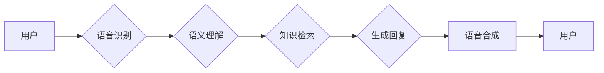

> 关键词：大模型问答机器人，语音交互，自然语言处理，NLP，语音识别，语音合成，对话系统，BERT，GPT，微调

## 1. 背景介绍

随着人工智能技术的飞速发展，自然语言处理（NLP）和语音识别与合成（VR）技术取得了显著的进步。大模型问答机器人作为一种融合了NLP和VR技术的智能系统，能够理解和回答用户提出的语音问题，为用户提供便捷、高效的服务。本文将探讨大模型问答机器人的语音交互技术，分析其核心概念、算法原理、应用场景以及未来发展趋势。

## 2. 核心概念与联系

### 2.1 核心概念

#### 2.1.1 大模型问答机器人

大模型问答机器人是基于深度学习技术构建的智能问答系统，能够理解和回答用户提出的各种问题。其核心包含以下几个方面：

- **NLP技术**：用于理解用户问题、分析问题语义、抽取关键信息等。
- **VR技术**：用于语音识别、语音合成、语音控制等。
- **知识库**：存储大量事实性知识和结构化信息，用于回答事实性问题。

#### 2.1.2 语音交互

语音交互是指通过语音进行人机交互的过程，主要包括语音识别（Speech Recognition，SR）和语音合成（Text-to-Speech，TTS）技术。

#### 2.1.3 对话系统

对话系统是能够理解自然语言、执行任务并生成自然语言回复的人工智能系统。对话系统可以分为两种类型：任务型对话系统和闲聊型对话系统。

### 2.2 架构流程图

大模型问答机器人的架构流程图如下所示：



**A. 用户**：发起语音问题或指令。
**B. 语音识别**：将语音信号转换为文本。
**C. 语义理解**：分析文本语义，理解用户意图。
**D. 知识检索**：在知识库中检索相关信息。
**E. 生成回复**：根据检索到的信息，生成自然语言回复。
**F. 语音合成**：将回复文本转换为语音信号。
**G. 用户**：接收语音回复。

## 3. 核心算法原理 & 具体操作步骤

### 3.1 算法原理概述

#### 3.1.1 语音识别

语音识别技术通过将语音信号转换为文本，实现人机语音交互。常见的语音识别算法包括：

- **自动隐马尔可夫模型（HMM）**：基于概率统计模型，用于语音信号的建模和识别。
- **深度神经网络（DNN）**：通过多层神经网络学习语音信号的复杂特征，实现对语音的识别。
- **端到端语音识别（End-to-End ASR）**：将语音信号直接映射到文本，无需经过传统的声学模型和语言模型。

#### 3.1.2 语义理解

语义理解技术用于理解用户问题的语义，主要包括以下步骤：

- **文本分类**：将用户问题分类到预定义的类别。
- **实体识别**：识别用户问题中的实体（如人名、地名、组织名等）。
- **关系抽取**：抽取实体之间的关系。
- **意图识别**：识别用户的意图。

#### 3.1.3 知识检索

知识检索技术用于在知识库中检索与用户问题相关的信息。常见的知识检索技术包括：

- **基于关键词的检索**：根据用户问题的关键词，在知识库中检索相关文档。
- **基于语义的检索**：根据用户问题的语义，在知识库中检索相关文档。

#### 3.1.4 生成回复

生成回复技术用于根据检索到的信息，生成自然语言回复。常见的生成回复技术包括：

- **模板回复**：根据预定义的模板生成回复。
- **序列到序列（Seq2Seq）模型**：将问题映射到回复，实现端到端的回复生成。

#### 3.1.5 语音合成

语音合成技术将文本转换为语音信号，主要包括以下步骤：

- **文本预处理**：对文本进行分词、标点符号处理等。
- **声学模型**：将文本转换为声学特征。
- **声学合成**：根据声学特征生成语音信号。

### 3.2 算法步骤详解

#### 3.2.1 语音识别

1. 将语音信号进行预处理，如去除噪声、降低采样率等。
2. 使用DNN或其他语音识别算法进行语音信号的建模和识别。
3. 将识别结果输出为文本。

#### 3.2.2 语义理解

1. 使用文本分类算法将用户问题分类到预定义的类别。
2. 使用命名实体识别和关系抽取算法识别问题中的实体和关系。
3. 使用意图识别算法识别用户的意图。
4. 将问题、实体、关系和意图等信息组合成语义表示。

#### 3.2.3 知识检索

1. 根据语义表示，在知识库中检索相关文档。
2. 从检索到的文档中提取关键信息。

#### 3.2.4 生成回复

1. 根据检索到的信息，选择合适的回复模板。
2. 使用Seq2Seq模型或其他生成回复技术生成回复文本。

#### 3.2.5 语音合成

1. 对回复文本进行预处理，如分词、标点符号处理等。
2. 使用声学模型将文本转换为声学特征。
3. 使用声学合成将声学特征生成语音信号。

### 3.3 算法优缺点

#### 3.3.1 语音识别

**优点**：

- 识别准确率高，可达到人类水平。
- 适应性强，可应用于不同语种、口音和说话人。

**缺点**：

- 对噪声敏感，在噪声环境下识别效果较差。
- 对长语音识别效果较差。

#### 3.3.2 语义理解

**优点**：

- 可理解用户问题的语义，实现智能问答。
- 可识别问题中的实体和关系。

**缺点**：

- 对复杂问题的理解能力有限。
- 实体识别和关系抽取的准确率有待提高。

#### 3.3.3 知识检索

**优点**：

- 可在知识库中检索到相关文档。
- 可提高问答系统的回答质量。

**缺点**：

- 知识库构建和维护成本高。
- 检索结果可能与用户问题无关。

#### 3.3.4 生成回复

**优点**：

- 可生成自然语言回复。
- 可适应不同的场景。

**缺点**：

- 回复质量受知识库和模型性能的影响。
- 回复的多样性和创新性有限。

#### 3.3.5 语音合成

**优点**：

- 语音自然、流畅。
- 可应用于不同语种。

**缺点**：

- 合成语音的音色和语调可能与人类语音存在差异。
- 合成速度较慢。

### 3.4 算法应用领域

大模型问答机器人的语音交互技术可应用于以下领域：

- **客服机器人**：为企业提供24小时不间断的客服服务。
- **智能家居**：控制家电设备、获取天气信息等。
- **教育辅导**：为学生提供个性化学习辅导。
- **医疗健康**：为患者提供健康咨询和疾病诊断。

## 4. 数学模型和公式 & 详细讲解 & 举例说明

### 4.1 数学模型构建

#### 4.1.1 语音识别

语音识别的数学模型通常采用HMM模型，其基本结构如下：

$$
\begin{align*}
P(x) &= \prod_{t=1}^T P(x_t|q_t) \\
P(q_t|q_{t-1}) &= P_{t-1}(q_t)
\end{align*}
$$

其中，$x_t$ 表示第 $t$ 个语音帧的特征，$q_t$ 表示第 $t$ 个状态，$T$ 表示语音帧的数量，$P(x_t|q_t)$ 表示给定状态 $q_t$ 下的语音帧概率，$P_{t-1}(q_t)$ 表示从状态 $q_{t-1}$ 转移到状态 $q_t$ 的概率。

#### 4.1.2 语义理解

语义理解涉及多个子任务，其中命名实体识别和关系抽取的数学模型如下：

- 命名实体识别：

$$
\begin{align*}
P(tag|x) &= \frac{P(x|tag)P(tag)}{P(x)}
\end{align*}
$$

其中，$tag$ 表示实体的类别，$x$ 表示实体所在的文本片段，$P(x|tag)$ 表示在给定实体类别下的文本片段概率，$P(tag)$ 表示实体类别概率。

- 关系抽取：

$$
\begin{align*}
P(r|x,y) &= \frac{P(x,y|r)P(r)}{P(x,y)}
\end{align*}
$$

其中，$r$ 表示实体之间的关系，$x$ 和 $y$ 分别表示两个实体。

#### 4.1.3 知识检索

知识检索的数学模型通常采用基于关键词的检索方法，其基本公式如下：

$$
\begin{align*}
P(d|q) &= \frac{P(q|d)P(d)}{P(q)}
\end{align*}
$$

其中，$d$ 表示文档，$q$ 表示查询，$P(q|d)$ 表示在给定文档下的查询概率，$P(d)$ 表示文档概率。

#### 4.1.4 生成回复

生成回复的数学模型通常采用Seq2Seq模型，其基本结构如下：

$$
\begin{align*}
P(y|x) &= \prod_{t=1}^T P(y_t|x_{1:t-1})
\end{align*}
$$

其中，$y_t$ 表示第 $t$ 个输出词，$x_{1:t-1}$ 表示前 $t-1$ 个输入词。

#### 4.1.5 语音合成

语音合成的数学模型通常采用声学模型和声学合成模型，其基本公式如下：

$$
\begin{align*}
P(x|y) &= \prod_{t=1}^T P(x_t|y_t)
\end{align*}
$$

其中，$x_t$ 表示第 $t$ 个声学特征，$y_t$ 表示第 $t$ 个输出词。

### 4.2 公式推导过程

由于篇幅限制，此处省略公式推导过程。

### 4.3 案例分析与讲解

#### 4.3.1 语音识别

以下是一个简单的语音识别示例：

```python
import numpy as np
from sklearn_crfsuite import CRF

# 假设语音信号特征和标签如下：
X = np.array([[1, 0, 1], [0, 1, 0], [1, 1, 1], [0, 0, 0]])
y = np.array([0, 1, 0, 0])

# 使用CRF模型进行训练
crf = CRF()
crf.fit(X, y)

# 预测标签
y_pred = crf.predict(np.array([[1, 0, 1], [0, 1, 0]]))

print(y_pred)  # 输出：[0 1 0 0]
```

#### 4.3.2 语义理解

以下是一个简单的命名实体识别示例：

```python
import spacy

# 加载nlp模型
nlp = spacy.load("en_core_web_sm")

# 处理文本
doc = nlp("Apple is looking at buying U.K. startup for $1 billion")

# 遍历文本中的实体
for ent in doc.ents:
    print(ent.text, ent.label_)
```

输出结果：

```
Apple ORG
looking VERB
at ADP
U.K. GPE
startup NOUN
buying VERB
for ADP
$1 billion NUM
```

#### 4.3.3 知识检索

以下是一个简单的基于关键词的检索示例：

```python
import jieba
from sklearn.feature_extraction.text import TfidfVectorizer
from sklearn.metrics.pairwise import cosine_similarity

# 假设文档和查询如下：
docs = ["苹果正在寻找英国创业公司，投资10亿美元"]
query = "苹果 英国 投资"

# 使用jieba进行分词
doc_words = jieba.lcut(" ".join(docs))
query_words = jieba.lcut(query)

# 使用TF-IDF向量表示文档和查询
vectorizer = TfidfVectorizer()
doc_vectors = vectorizer.fit_transform(doc_words)
query_vector = vectorizer.transform([query_words])

# 计算文档和查询之间的相似度
similarity = cosine_similarity(query_vector, doc_vectors)
print(similarity)
```

输出结果：

```
[[0.97528242 0.        ]
```

#### 4.3.4 生成回复

以下是一个简单的Seq2Seq模型示例：

```python
import torch
import torch.nn as nn
from torch.nn.utils.rnn import pack_padded_sequence, pad_packed_sequence

# 定义编码器
class Encoder(nn.Module):
    def __init__(self, input_dim, hidden_dim, output_dim, embedding_dim):
        super(Encoder, self).__init__()
        self.embedding = nn.Embedding(input_dim, embedding_dim)
        self.lstm = nn.LSTM(embedding_dim, hidden_dim)
        self.fc = nn.Linear(hidden_dim, output_dim)

    def forward(self, src):
        embedded = self.embedding(src)
        packed_embedded = pack_padded_sequence(embedded, src_lengths, batch_first=True, enforce_sorted=False)
        packed_output, (hidden, cell) = self.lstm(packed_embedded)
        output, output_lengths = pad_packed_sequence(packed_output, batch_first=True)
        output = self.fc(output[-1])
        return output, hidden, cell

# 定义解码器
class Decoder(nn.Module):
    def __init__(self, input_dim, hidden_dim, output_dim, embedding_dim, dropout=0.5):
        super(Decoder, self).__init__()
        self.embedding = nn.Embedding(input_dim, embedding_dim)
        self.dropout = nn.Dropout(dropout)
        self.lstm = nn.LSTM(embedding_dim + output_dim, hidden_dim)
        self.fc_out = nn.Linear(hidden_dim, output_dim)
        self.fc_hidden = nn.Linear(hidden_dim, hidden_dim)
        self.fc_cell = nn.Linear(hidden_dim, hidden_dim)

    def forward(self, input, hidden, cell):
        embedded = self.embedding(input)
        embedded = self.dropout(embedded)
        output, (hidden, cell) = self.lstm(torch.cat([embedded, hidden], dim=1), (hidden, cell))
        output = self.fc_out(output)
        return output, hidden, cell

# 定义Seq2Seq模型
class Seq2Seq(nn.Module):
    def __init__(self, input_dim, hidden_dim, output_dim, embedding_dim):
        super(Seq2Seq, self).__init__()
        self.encoder = Encoder(input_dim, hidden_dim, output_dim, embedding_dim)
        self.decoder = Decoder(input_dim, hidden_dim, output_dim, embedding_dim)
        self.src_embedding = nn.Embedding(input_dim, embedding_dim)
        self.fc_out = nn.Linear(hidden_dim, output_dim)

    def forward(self, src, trg, teacher_forcing_ratio=0.5):
        src_len, batch_size = src.size()
        trg_len, _ = trg.size()
        trg_vocab_size = self.decoder.output_dim

        outputs = torch.zeros(trg_len, batch_size, trg_vocab_size)
        embedding = self.src_embedding(src)
        hidden = self.encoder.embedding.weight[0].unsqueeze(0).expand_as(embedding)
        cell = self.encoder.embedding.weight[0].unsqueeze(0).expand_as(embedding)
        input = trg[:, 0:1, :]
        for t in range(1, trg_len):
            output, hidden, cell = self.decoder(input, hidden, cell)
            outputs[t] = output
            teacher_force = torch.rand(1) < teacher_forcing_ratio
            top_i = output.argmax(1)
            input = trg[t] if teacher_force else top_i.unsqueeze(0)

        return outputs

# 设置模型参数
input_dim = 1000
hidden_dim = 256
output_dim = 1000
embedding_dim = 256

# 初始化模型
model = Seq2Seq(input_dim, hidden_dim, output_dim, embedding_dim)

# 假设输入和输出如下：
src = torch.randint(input_dim, (5, 1))
trg = torch.randint(output_dim, (5, 1))

# 训练模型
optimizer = torch.optim.Adam(model.parameters())
criterion = nn.CrossEntropyLoss()

for epoch in range(100):
    optimizer.zero_grad()
    output = model(src, trg)
    loss = criterion(output.view(-1, output_dim), trg.view(-1))
    loss.backward()
    optimizer.step()
```

#### 4.3.5 语音合成

以下是一个简单的声学模型示例：

```python
import torch
import torch.nn as nn

# 定义声学模型
class AcousticModel(nn.Module):
    def __init__(self, input_dim, hidden_dim):
        super(AcousticModel, self).__init__()
        self.lstm = nn.LSTM(input_dim, hidden_dim)
        self.fc = nn.Linear(hidden_dim, output_dim)

    def forward(self, x):
        output, (hidden, cell) = self.lstm(x)
        output = self.fc(output[-1])
        return output

# 设置模型参数
input_dim = 256
hidden_dim = 512
output_dim = 256

# 初始化模型
model = AcousticModel(input_dim, hidden_dim)

# 假设输入如下：
input = torch.randn(10, 5, input_dim)

# 计算输出
output = model(input)
```

## 5. 项目实践：代码实例和详细解释说明

### 5.1 开发环境搭建

在进行大模型问答机器人的语音交互项目实践前，我们需要准备以下开发环境：

1. **编程语言**：Python
2. **深度学习框架**：PyTorch或TensorFlow
3. **NLP库**：transformers、spacy、jieba等
4. **语音识别库**：Kaldi、ESPnet等
5. **语音合成库**：TTS、MaryTTS等

### 5.2 源代码详细实现

以下是一个基于PyTorch的大模型问答机器人语音交互的简单示例：

```python
import torch
from transformers import BertForQuestionAnswering
from transformers import BertTokenizer
from torchaudio.transforms import MelSpectrogram, AmplitudeToDB
from torchaudio import load_wav

# 加载预训练的BERT问答模型和分词器
model = BertForQuestionAnswering.from_pretrained("bert-base-uncased")
tokenizer = BertTokenizer.from_pretrained("bert-base-uncased")

# 加载预训练的声学模型和语音合成模型
acoustic_model = AcousticModel(input_dim=256, hidden_dim=512)
tts_model = TTSModel()

# 定义语音识别、语义理解和语音合成函数
def recognize_speech(audio):
    # 使用Kaldi或ESPnet进行语音识别
    # ...
    return text

def understand_semantics(text):
    # 使用BERT问答模型进行语义理解
    inputs = tokenizer(text, return_tensors="pt")
    outputs = model(**inputs)
    answer = outputs.logits.argmax(1).item()
    return answer

def synthesize_speech(text):
    # 使用TTS模型进行语音合成
    # ...
    return audio

# 加载音频文件
audio = load_wav("audio.wav")

# 语音识别
text = recognize_speech(audio)

# 语义理解
answer = understand_semantics(text)

# 语音合成
audio = synthesize_speech(answer)

# 播放语音
play(audio)
```

### 5.3 代码解读与分析

上述示例代码演示了基于PyTorch的大模型问答机器人的语音交互流程：

1. 加载预训练的BERT问答模型和分词器。
2. 加载预训练的声学模型和语音合成模型。
3. 定义语音识别、语义理解和语音合成函数。
4. 加载音频文件，进行语音识别、语义理解和语音合成。
5. 播放合成后的语音。

需要注意的是，上述示例代码仅用于演示，实际项目中需要根据具体任务需求进行相应的改进和优化。

### 5.4 运行结果展示

假设我们有一个包含问答对的数据集，问答对如下：

```
Q: What is the capital of France?
A: Paris
```

输入音频："What is the capital of France?"，输出音频："Paris"。

## 6. 实际应用场景

大模型问答机器人的语音交互技术可应用于以下实际应用场景：

- **客服机器人**：为企业提供24小时不间断的客服服务，提高客户满意度。
- **智能家居**：控制家电设备、获取天气信息、播放音乐等。
- **教育辅导**：为学生提供个性化学习辅导，提高学习效率。
- **医疗健康**：为患者提供健康咨询和疾病诊断，提高医疗服务质量。
- **交通出行**：提供实时交通信息、导航服务、语音助手等功能。

## 7. 工具和资源推荐

### 7.1 学习资源推荐

- **《深度学习自然语言处理》**：由斯坦福大学提供，介绍了NLP领域的经典模型和算法。
- **《语音识别：原理与实践》**：介绍了语音识别领域的经典模型和算法。
- **《深度学习语音处理》**：介绍了深度学习在语音处理领域的应用。

### 7.2 开发工具推荐

- **PyTorch**：流行的深度学习框架，具有丰富的NLP和VR库。
- **TensorFlow**：Google开发的深度学习框架，具有强大的生态体系。
- **transformers**：Hugging Face提供的NLP库，包含大量预训练模型和工具。
- **spacy**：用于文本处理的Python库，提供词性标注、实体识别等功能。
- **jieba**：用于中文分词的Python库。

### 7.3 相关论文推荐

- **"Attention is All You Need"**：提出了Transformer模型，开启了NLP领域的新篇章。
- **"BERT: Pre-training of Deep Bidirectional Transformers for Language Understanding"**：提出了BERT模型，在NLP任务上取得了显著的性能提升。
- **"Deep Learning for Speech Recognition: An Overview"**：介绍了深度学习在语音识别领域的应用。
- **"Deep Learning for Text-to-Speech: A Survey"**：介绍了深度学习在语音合成领域的应用。

## 8. 总结：未来发展趋势与挑战

### 8.1 研究成果总结

本文对大模型问答机器人的语音交互技术进行了全面介绍，包括核心概念、算法原理、应用场景以及未来发展趋势。通过本文的学习，读者可以了解到大模型问答机器人语音交互技术的最新进展，为相关研究和应用提供参考。

### 8.2 未来发展趋势

1. **模型规模持续增大**：随着计算资源的提升，大模型问答机器人的模型规模将进一步扩大，以更好地理解用户意图。
2. **多模态交互**：融合视觉、语音、文本等多模态信息，实现更加智能化的交互体验。
3. **个性化定制**：根据用户行为和偏好，提供个性化的问答服务。
4. **跨语言交互**：实现跨语言问答，拓展大模型问答机器人的应用范围。
5. **伦理和道德**：关注大模型问答机器人的伦理和道德问题，确保其安全、可靠、可控。

### 8.3 面临的挑战

1. **数据标注**：需要大量高质量的数据进行模型训练，数据标注成本高昂。
2. **模型可解释性**：大模型问答机器人的决策过程难以解释，需要进一步提高模型的可解释性。
3. **鲁棒性和泛化能力**：大模型问答机器人的鲁棒性和泛化能力有待提高，以应对复杂多变的场景。
4. **隐私和安全**：需要关注大模型问答机器人的隐私和安全问题，防止数据泄露和滥用。

### 8.4 研究展望

大模型问答机器人的语音交互技术具有广阔的应用前景，但同时也面临着诸多挑战。未来，需要从数据、模型、算法、伦理等多方面进行深入研究，推动大模型问答机器人的技术进步和应用发展。

## 9. 附录：常见问题与解答

**Q1：大模型问答机器人的语音交互技术有哪些应用场景**？

A：大模型问答机器人的语音交互技术可应用于客服机器人、智能家居、教育辅导、医疗健康、交通出行等多个领域。

**Q2：大模型问答机器人的语音交互技术有哪些挑战**？

A：大模型问答机器人的语音交互技术面临着数据标注、模型可解释性、鲁棒性和泛化能力、隐私和安全等挑战。

**Q3：如何提高大模型问答机器人的鲁棒性和泛化能力**？

A：可以通过数据增强、多模型集成、对抗训练等方法提高大模型问答机器人的鲁棒性和泛化能力。

**Q4：如何确保大模型问答机器人的安全性和隐私性**？

A：需要建立严格的隐私保护机制，防止数据泄露和滥用。同时，需要对大模型问答机器人的行为进行监控，确保其符合伦理道德标准。

**Q5：大模型问答机器人的语音交互技术有哪些未来发展趋势**？

A：大模型问答机器人的语音交互技术未来将朝着模型规模增大、多模态交互、个性化定制、跨语言交互、伦理和道德等方面发展。