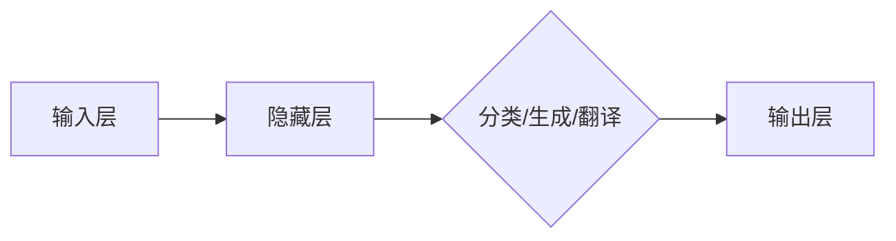

> - 大模型
> - 智能化
> - 商业模式
> - 数据驱动
> - 人工智能
> - 技术创新

# 大模型：智能时代的商业新模式

在数字化浪潮的推动下，人工智能技术正以前所未有的速度发展，而大模型（Large Models）作为人工智能领域的一项重要创新，正引领着智能时代的商业新模式。本文将深入探讨大模型的概念、原理、应用场景，以及其对商业和社会的深远影响。

## 1. 背景介绍

### 1.1 智能时代的来临

随着移动互联网、大数据、云计算等技术的发展，我们正进入一个以数据为核心、以智能为驱动的时代。在这个时代，人工智能技术将成为推动社会进步的重要力量。

### 1.2 大模型的出现

大模型是指参数规模达到亿级甚至千亿级的深度学习模型，如Transformer、BERT、GPT等。这些模型通过在海量数据上进行预训练，学习到丰富的语言知识和常识，能够进行自然语言处理、计算机视觉、语音识别等多种任务。

### 1.3 大模型对商业的影响

大模型的出现，不仅推动了人工智能技术的发展，也为商业模式的创新提供了新的契机。大模型的应用，可以帮助企业降低成本、提高效率、优化决策，从而在激烈的市场竞争中占据优势。

## 2. 核心概念与联系

### 2.1 大模型的概念

大模型是一种基于深度学习的算法模型，通过在海量数据上进行预训练，学习到丰富的知识，能够进行多种复杂任务。

### 2.2 大模型的架构

大模型的架构通常包含以下几个部分：

- **输入层**：接收输入数据，如文本、图像、语音等。
- **隐藏层**：通过神经网络对输入数据进行处理，提取特征。
- **输出层**：根据提取的特征进行输出，如分类、生成、翻译等。

### 2.3 Mermaid流程图



## 3. 核心算法原理 & 具体操作步骤

### 3.1 算法原理概述

大模型的算法原理主要基于深度学习，包括以下步骤：

1. **数据预处理**：对输入数据进行清洗、标准化等处理。
2. **模型选择**：选择合适的模型架构，如Transformer、BERT、GPT等。
3. **预训练**：在大量无标签数据上进行预训练，学习通用知识。
4. **微调**：在少量有标签数据上进行微调，优化模型在特定任务上的性能。

### 3.2 算法步骤详解

1. **数据预处理**：对输入数据进行清洗、去噪、归一化等处理，提高数据质量。
2. **模型选择**：根据任务需求选择合适的模型架构，如BERT适用于文本任务，GPT适用于生成任务。
3. **预训练**：在大量无标签数据上进行预训练，学习通用知识。预训练过程中，模型会通过自监督学习等方法，从数据中提取特征，并优化模型参数。
4. **微调**：在少量有标签数据上进行微调，优化模型在特定任务上的性能。微调过程中，模型会根据训练数据中的真实标签，调整模型参数，以减少预测误差。

### 3.3 算法优缺点

**优点**：

- **强大的知识学习能力**：大模型能够从海量数据中学习到丰富的知识，具有较强的泛化能力。
- **高效的任务执行**：大模型在多种任务上都能表现出色，能够快速完成任务。
- **降低成本**：大模型能够替代人工进行部分工作，降低人力成本。

**缺点**：

- **数据需求量大**：大模型需要大量的数据才能进行有效的训练。
- **计算资源消耗**：大模型的训练和推理过程需要大量的计算资源。
- **隐私和安全风险**：大模型在训练过程中可能会学习到敏感数据，存在隐私和安全风险。

### 3.4 算法应用领域

大模型在以下领域有着广泛的应用：

- **自然语言处理**：如文本分类、问答系统、机器翻译等。
- **计算机视觉**：如图像识别、目标检测、图像生成等。
- **语音识别**：如语音转文字、语音合成等。
- **推荐系统**：如商品推荐、新闻推荐等。

## 4. 数学模型和公式 & 详细讲解 & 举例说明

### 4.1 数学模型构建

大模型的数学模型通常基于深度学习的原理，包括以下几个部分：

- **损失函数**：用于衡量模型预测结果与真实标签之间的差异。
- **优化算法**：用于更新模型参数，以最小化损失函数。
- **激活函数**：用于引入非线性关系，使模型能够学习更复杂的特征。

### 4.2 公式推导过程

以下以BERT模型为例，介绍其损失函数的推导过程：

假设模型预测的输出为 $\hat{y}$，真实标签为 $y$，则交叉熵损失函数为：

$$
L(\theta) = -\frac{1}{N}\sum_{i=1}^N [y_i\log \hat{y}_i + (1-y_i)\log (1-\hat{y}_i)]
$$

其中 $N$ 为样本数量，$\theta$ 为模型参数。

### 4.3 案例分析与讲解

以下以BERT模型在文本分类任务上的应用为例，讲解大模型的实现过程。

1. **数据准备**：收集标注好的文本数据，并将其划分为训练集、验证集和测试集。
2. **模型构建**：使用Transformers库构建BERT模型。
3. **模型训练**：使用训练集数据对模型进行训练，并使用验证集数据调整模型参数。
4. **模型评估**：使用测试集数据评估模型的性能。

## 5. 项目实践：代码实例和详细解释说明

### 5.1 开发环境搭建

1. 安装Python和PyTorch。
2. 安装Transformers库。

### 5.2 源代码详细实现

```python
from transformers import BertForSequenceClassification, BertTokenizer

# 加载预训练模型和分词器
model = BertForSequenceClassification.from_pretrained('bert-base-uncased')
tokenizer = BertTokenizer.from_pretrained('bert-base-uncased')

# 数据预处理
def preprocess_data(texts):
    encodings = tokenizer(texts, truncation=True, padding=True)
    return encodings['input_ids'], encodings['attention_mask']

# 训练模型
def train_model(model, optimizer, train_encodings, train_labels):
    model.train()
    for input_ids, attention_mask, labels in zip(train_encodings['input_ids'], train_encodings['attention_mask'], train_labels):
        inputs = {'input_ids': input_ids, 'attention_mask': attention_mask, 'labels': labels}
        outputs = model(**inputs)
        loss = outputs.loss
        loss.backward()
        optimizer.step()
        optimizer.zero_grad()

# 评估模型
def evaluate_model(model, test_encodings, test_labels):
    model.eval()
    correct = 0
    total = len(test_labels)
    with torch.no_grad():
        for input_ids, attention_mask, labels in zip(test_encodings['input_ids'], test_encodings['attention_mask'], test_labels):
            inputs = {'input_ids': input_ids, 'attention_mask': attention_mask, 'labels': labels}
            outputs = model(**inputs)
            _, predicted = torch.max(outputs.logits, 1)
            correct += (predicted == labels).sum().item()
    return correct / total

# 主程序
train_encodings, train_labels = preprocess_data(train_texts)
test_encodings, test_labels = preprocess_data(test_texts)

optimizer = AdamW(model.parameters(), lr=2e-5)

for epoch in range(3):  # 训练3个epoch
    train_model(model, optimizer, train_encodings, train_labels)
    accuracy = evaluate_model(model, test_encodings, test_labels)
    print(f"Epoch {epoch+1}, accuracy: {accuracy}")

# 使用模型进行预测
def predict(model, text):
    input_ids, attention_mask = preprocess_data([text])
    with torch.no_grad():
        outputs = model(**input_ids)
    _, predicted = torch.max(outputs.logits, 1)
    return label2id[predicted.item()]

# 测试
print(predict(model, "我爱编程"))
```

### 5.3 代码解读与分析

以上代码展示了使用PyTorch和Transformers库构建BERT模型进行文本分类的完整过程。

- 首先加载预训练的BERT模型和分词器。
- 然后对训练集和测试集进行预处理，将文本转换为模型所需的输入格式。
- 接着定义训练和评估函数，用于训练和评估模型。
- 最后，定义主程序，训练和评估模型，并使用模型进行预测。

## 6. 实际应用场景

### 6.1 智能客服

大模型在智能客服领域的应用，可以帮助企业提高客户服务效率，降低人力成本。通过大模型，智能客服可以自动识别客户问题，提供准确的解答，并根据客户反馈不断优化服务质量。

### 6.2 智能推荐

大模型在智能推荐领域的应用，可以帮助企业实现个性化推荐，提高用户满意度。通过大模型，企业可以分析用户行为，预测用户兴趣，从而为用户提供更符合其需求的推荐内容。

### 6.3 智能金融

大模型在智能金融领域的应用，可以帮助金融机构进行风险管理、信用评估等任务。通过大模型，金融机构可以分析大量金融数据，发现潜在风险，提高金融服务的安全性。

## 7. 工具和资源推荐

### 7.1 学习资源推荐

- 《深度学习》（Goodfellow et al.）
- 《PyTorch深度学习》（Williams et al.）
- 《Natural Language Processing with Python》（Bird et al.）

### 7.2 开发工具推荐

- PyTorch
- TensorFlow
- Hugging Face Transformers

### 7.3 相关论文推荐

- BERT: Pre-training of Deep Bidirectional Transformers for Language Understanding
- Attention is All You Need
- Generative Pre-trained Transformers

## 8. 总结：未来发展趋势与挑战

### 8.1 研究成果总结

大模型作为人工智能领域的一项重要创新，在多个领域取得了显著的应用成果。未来，大模型将继续推动人工智能技术的发展，并引领智能时代的商业新模式。

### 8.2 未来发展趋势

- **更大规模的模型**：随着计算资源的提升，未来将出现更大规模的模型，能够处理更复杂的任务。
- **更多样化的应用**：大模型将在更多领域得到应用，如医疗、教育、交通等。
- **更高效的训练方法**：开发更高效的训练方法，降低大模型的训练成本。

### 8.3 面临的挑战

- **数据安全**：大模型的训练需要大量的数据，如何保障数据安全成为一个重要挑战。
- **模型可解释性**：大模型的决策过程难以解释，如何提高模型的可解释性是一个重要挑战。
- **计算资源**：大模型的训练和推理需要大量的计算资源，如何降低计算成本是一个重要挑战。

### 8.4 研究展望

未来，大模型的研究将朝着以下方向发展：

- **更安全的大模型**：研究如何保障大模型的安全性，防止数据泄露和恶意攻击。
- **更可解释的大模型**：研究如何提高大模型的可解释性，使其决策过程更加透明。
- **更高效的大模型**：研究如何降低大模型的训练和推理成本，使其更易于应用。

## 9. 附录：常见问题与解答

**Q1：大模型和传统机器学习模型有什么区别？**

A：大模型和传统机器学习模型的主要区别在于数据规模和模型复杂度。大模型通常需要大量的数据和更复杂的模型结构，能够学习到更丰富的知识，并应用于更复杂的任务。

**Q2：大模型如何保证模型的泛化能力？**

A：大模型通过在大量无标签数据上进行预训练，学习到丰富的知识，从而提高模型的泛化能力。此外，还可以通过数据增强、正则化等方法，进一步提高模型的泛化能力。

**Q3：大模型的训练和推理需要多少计算资源？**

A：大模型的训练和推理需要大量的计算资源，特别是GPU或TPU等专用硬件。随着模型规模的增大，所需的计算资源也会相应增加。

**Q4：大模型的应用有哪些伦理和隐私问题？**

A：大模型的应用可能会涉及伦理和隐私问题，如数据泄露、歧视性偏见等。因此，在进行大模型应用时，需要充分考虑这些问题，并采取措施加以解决。

**Q5：大模型是否会替代人类工作？**

A：大模型可以帮助人类完成一些重复性、低效的工作，但不会完全替代人类工作。大模型的发展应该以辅助人类为目标，提高人类的工作效率和生活质量。

---

作者：禅与计算机程序设计艺术 / Zen and the Art of Computer Programming