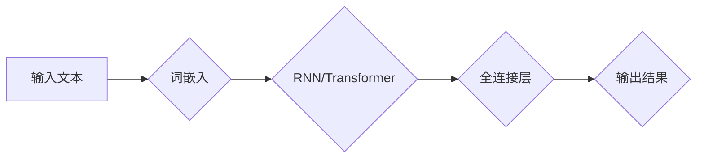

> 大语言模型，原理，前沿技术，有害性，安全，伦理，NLP，机器学习

# 大语言模型原理基础与前沿 有害性

## 1. 背景介绍

近年来，随着深度学习技术的飞速发展，大语言模型（Large Language Models，LLMs）如BERT、GPT-3等在自然语言处理（Natural Language Processing，NLP）领域取得了突破性的进展。这些模型能够理解和生成人类语言，展现出强大的能力，从文本摘要到机器翻译，再到对话系统，应用范围日益广泛。然而，随着大语言模型的应用日益深入，其潜在的有害性也逐渐显现，引发了社会各界的广泛关注。本文将深入探讨大语言模型的原理、前沿技术及其潜在的有害性，旨在为读者提供全面而深入的洞察。

## 2. 核心概念与联系

### 2.1 大语言模型

大语言模型是一种基于深度学习的自然语言处理模型，通过在海量文本数据上进行预训练，学习到丰富的语言知识，能够理解和生成自然语言。其核心架构通常包括以下几个部分：

- **词嵌入（Word Embedding）**：将单词映射为稠密向量，以便于在神经网络中进行处理。
- **循环神经网络（RNN）或Transformer**：用于捕捉语言序列中的长距离依赖关系。
- **全连接层**：用于将模型的输出映射到特定任务的空间。

以下是大语言模型的Mermaid流程图：



### 2.2 前沿技术

大语言模型的前沿技术包括：

- **预训练**：在大规模无标注文本数据上进行预训练，学习通用语言特征。
- **微调**：在特定任务的标注数据上进行微调，使模型适应特定领域。
- **多模态学习**：结合文本、图像、语音等多种模态信息，提升模型的理解和生成能力。
- **知识增强**：结合外部知识库，提高模型的常识推理和事实性知识。

### 2.3 有害性

大语言模型可能存在的有害性包括：

- **偏见和歧视**：模型可能学习到数据集中的偏见，导致歧视性输出。
- **虚假信息和误导**：模型可能生成虚假信息或误导性内容。
- **隐私侵犯**：模型可能泄露用户隐私或敏感信息。
- **安全风险**：恶意攻击者可能利用模型进行欺骗、欺诈等行为。

## 3. 核心算法原理 & 具体操作步骤

### 3.1 算法原理概述

大语言模型的算法原理主要包括以下几个方面：

- **预训练**：使用无标注数据学习通用语言特征。
- **微调**：在标注数据上调整模型参数，使其适应特定任务。
- **解码**：生成文本输出。

### 3.2 算法步骤详解

1. **数据预处理**：清洗、分词、去停用词等。
2. **预训练**：在无标注数据上进行预训练。
3. **微调**：在标注数据上进行微调。
4. **解码**：生成文本输出。

### 3.3 算法优缺点

**优点**：

- **强大的语言理解能力**：能够理解和生成自然语言。
- **泛化能力强**：能够适应各种语言任务。
- **可扩展性强**：能够轻松扩展到新的任务和数据集。

**缺点**：

- **数据偏见**：可能学习到数据集中的偏见。
- **计算复杂度高**：需要大量计算资源和时间。
- **可解释性差**：模型的决策过程难以解释。

### 3.4 算法应用领域

大语言模型的应用领域包括：

- **文本分类**：如垃圾邮件检测、情感分析等。
- **机器翻译**：如将英文翻译成中文。
- **对话系统**：如聊天机器人。
- **文本生成**：如自动写作、生成对话等。

## 4. 数学模型和公式 & 详细讲解 & 举例说明

### 4.1 数学模型构建

大语言模型的数学模型主要包括以下几个方面：

- **词嵌入**：$ \mathbf{e}_w = \mathbf{W} \mathbf{w} $
- **RNN/Transformer**：$\mathbf{h}_t = \mathbf{f}(\mathbf{h}_{t-1}, \mathbf{e}_w)$ 或 $\mathbf{h}_t = \text{Transformer}(\mathbf{h}_{t-1}, \mathbf{e}_w)$
- **全连接层**：$ \mathbf{y} = \mathbf{W}_y \mathbf{h}_T $

### 4.2 公式推导过程

以BERT中的Transformer为例，公式推导过程如下：

- **Self-Attention**：$ \mathbf{Q} = \mathbf{W}_Q \mathbf{h}_T, \mathbf{K} = \mathbf{W}_K \mathbf{h}_T, \mathbf{V} = \mathbf{W}_V \mathbf{h}_T $
- **Scaled Dot-Product Attention**：$ \mathbf{S} = \frac{\mathbf{QK}^T}{\sqrt{d_k}} \mathbf{V} $
- **Multi-Head Attention**：$ \mathbf{H} = \text{Concat}(\mathbf{h}_1, \dots, \mathbf{h}_h) $
- **Output Layer**：$ \mathbf{h}_T = \mathbf{W}_O \mathbf{H} $

### 4.3 案例分析与讲解

以BERT在情感分析任务上的应用为例，讲解大语言模型的实际应用。

1. **数据预处理**：对文本数据进行清洗、分词、去停用词等操作。
2. **预训练**：在无标注数据上进行预训练，学习通用语言特征。
3. **微调**：在标注数据上进行微调，使模型适应情感分析任务。
4. **解码**：输入文本，生成情感标签。

## 5. 项目实践：代码实例和详细解释说明

### 5.1 开发环境搭建

1. 安装Python环境。
2. 安装PyTorch或TensorFlow等深度学习框架。
3. 安装transformers库。

### 5.2 源代码详细实现

以下是一个使用transformers库进行情感分析任务的示例代码：

```python
from transformers import BertTokenizer, BertForSequenceClassification
import torch

# 加载预训练模型和分词器
tokenizer = BertTokenizer.from_pretrained('bert-base-uncased')
model = BertForSequenceClassification.from_pretrained('bert-base-uncased')

# 定义训练函数
def train(model, dataloader, optimizer):
    model.train()
    for batch in dataloader:
        inputs = tokenizer(batch['text'], padding=True, truncation=True, return_tensors='pt')
        labels = torch.tensor(batch['label'])
        outputs = model(**inputs, labels=labels)
        loss = outputs.loss
        loss.backward()
        optimizer.step()
        optimizer.zero_grad()

# 定义评估函数
def evaluate(model, dataloader):
    model.eval()
    total = 0
    correct = 0
    with torch.no_grad():
        for batch in dataloader:
            inputs = tokenizer(batch['text'], padding=True, truncation=True, return_tensors='pt')
            labels = torch.tensor(batch['label'])
            outputs = model(**inputs, labels=labels)
            _, predicted = torch.max(outputs.logits, 1)
            total += labels.size(0)
            correct += (predicted == labels).sum().item()
    return 100 * correct / total

# 训练和评估模型
# ...
```

### 5.3 代码解读与分析

以上代码展示了如何使用transformers库进行情感分析任务的微调。首先加载预训练模型和分词器，然后定义训练和评估函数，最后进行模型训练和评估。

## 6. 实际应用场景

大语言模型在实际应用场景中具有广泛的应用，以下是一些典型的应用场景：

- **智能客服**：提供24小时在线客服，解答用户问题。
- **智能助手**：帮助用户完成日常任务，如日程管理、提醒事项等。
- **文本摘要**：自动生成文章摘要，提高信息获取效率。
- **机器翻译**：实现多语言翻译，打破语言障碍。

## 7. 工具和资源推荐

### 7.1 学习资源推荐

- 《深度学习自然语言处理》
- 《BERT: Pre-training of Deep Bidirectional Transformers for Language Understanding》
- 《Natural Language Processing with Transformers》

### 7.2 开发工具推荐

- PyTorch
- TensorFlow
- Hugging Face Transformers

### 7.3 相关论文推荐

- Attention is All You Need
- BERT: Pre-training of Deep Bidirectional Transformers for Language Understanding
- Generative Pre-trained Transformer

## 8. 总结：未来发展趋势与挑战

### 8.1 研究成果总结

大语言模型在NLP领域取得了显著的成果，为许多任务提供了强大的解决方案。然而，其潜在的有害性也引发了许多关注。

### 8.2 未来发展趋势

- **更强大的模型**：开发更强大的模型，提高模型的理解和生成能力。
- **更安全的模型**：研究如何降低模型的偏见和歧视，提高模型的安全性。
- **更高效的模型**：开发更高效的模型，降低计算成本。
- **更可解释的模型**：提高模型的可解释性，增强用户对模型的信任。

### 8.3 面临的挑战

- **数据偏见**：如何降低模型学习到的数据偏见。
- **计算成本**：如何降低模型的计算成本。
- **可解释性**：如何提高模型的可解释性。

### 8.4 研究展望

大语言模型在未来将继续在NLP领域发挥重要作用，但也需要面对诸多挑战。我们需要不断探索新的技术和方法，以解决这些问题，推动大语言模型的发展。

## 9. 附录：常见问题与解答

### 9.1 什么是大语言模型？

大语言模型是一种基于深度学习的自然语言处理模型，能够理解和生成自然语言。

### 9.2 大语言模型有什么优势？

大语言模型具有强大的语言理解能力、泛化能力强和可扩展性强等优势。

### 9.3 大语言模型有哪些潜在的有害性？

大语言模型可能存在的有害性包括偏见和歧视、虚假信息和误导、隐私侵犯、安全风险等。

### 9.4 如何降低大语言模型的偏见和歧视？

可以通过以下方法降低大语言模型的偏见和歧视：

- 使用多样化和平衡的数据集。
- 引入对抗训练。
- 使用知识蒸馏等技术。

作者：禅与计算机程序设计艺术 / Zen and the Art of Computer Programming