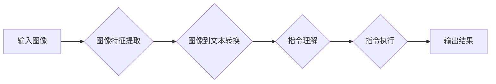

> 大语言模型, 视觉指令调整, 图像到文本, 自然语言处理, 预训练, 微调, 多模态学习, 视觉问答

# 大语言模型原理基础与前沿 视觉指令调整

## 1. 背景介绍

随着人工智能技术的飞速发展，自然语言处理（NLP）和计算机视觉（CV）领域都取得了显著的成果。然而，两者之间的结合——即让计算机理解并执行包含视觉信息的自然语言指令——仍然是一个极具挑战性的任务。视觉指令调整（Visual Instruction Tuning）作为这一领域的前沿研究方向，旨在使大语言模型能够理解图像中的视觉信息，并据此执行相应的指令。本文将深入探讨大语言模型原理基础，并展望视觉指令调整的前沿技术。

### 1.1 问题的由来

传统的NLP和CV任务往往各自独立，NLP关注文本信息的处理，而CV关注图像、视频等视觉信息的处理。然而，在现实世界中，许多任务需要两者结合起来，例如：

- 图像描述生成：根据图像内容生成相应的描述性文本。
- 视觉问答：根据图像内容回答相关问题。
- 视频理解：从视频中提取信息并回答问题。

这些任务都需要计算机能够理解图像中的视觉信息，并据此生成或回答相关的自然语言问题。因此，视觉指令调整成为了NLP和CV交叉领域的一个重要研究方向。

### 1.2 研究现状

视觉指令调整研究主要包括以下几个方向：

- **图像到文本**：将图像内容转换为文本描述。
- **视觉问答**：根据图像内容回答相关问题。
- **视频理解**：从视频中提取信息并回答问题。

近年来，随着深度学习技术的不断发展，特别是大语言模型的兴起，视觉指令调整取得了显著的进展。以下是一些代表性的研究进展：

- **视觉描述生成**：使用预训练的大语言模型，如BERT，结合图像特征提取网络，生成图像的描述性文本。
- **视觉问答**：使用预训练的大语言模型，结合图像特征提取网络，回答与图像相关的问题。
- **视频理解**：使用预训练的大语言模型，结合视频特征提取网络，从视频中提取信息并回答问题。

### 1.3 研究意义

视觉指令调整的研究具有重要的理论意义和应用价值：

- **理论意义**：推动NLP和CV领域的交叉研究，促进多模态学习的发展。
- **应用价值**：应用于图像描述生成、视觉问答、视频理解等领域，提升人机交互体验。

### 1.4 本文结构

本文将分为以下几个部分：

- 第2部分，介绍大语言模型和视觉指令调整的核心概念。
- 第3部分，探讨视觉指令调整的核心算法原理和具体操作步骤。
- 第4部分，分析视觉指令调整的数学模型和公式。
- 第5部分，提供视觉指令调整的代码实例和详细解释说明。
- 第6部分，探讨视觉指令调整的实际应用场景和未来应用展望。
- 第7部分，推荐相关学习和开发工具。
- 第8部分，总结研究成果，展望未来发展趋势和挑战。
- 第9部分，提供常见问题与解答。

## 2. 核心概念与联系

### 2.1 大语言模型

大语言模型是基于深度学习的语言模型，能够理解和生成自然语言。它们通常通过在大规模文本语料上进行预训练，学习到丰富的语言知识和模式。常见的预训练模型包括：

- **BERT**：基于Transformer的预训练模型，能够同时捕获文本序列的前后文信息。
- **GPT**：基于Transformer的预训练模型，能够生成连贯的自然语言文本。

### 2.2 视觉指令调整

视觉指令调整是指将图像或视频中的视觉信息转换为自然语言指令，并使大语言模型能够理解和执行这些指令。其基本流程如下：

1. **图像特征提取**：使用CV技术从图像中提取特征。
2. **图像到文本转换**：使用NLP技术将图像特征转换为文本描述。
3. **指令理解**：使用大语言模型理解自然语言指令。
4. **指令执行**：根据指令执行相应的操作。

### 2.3 Mermaid 流程图

以下是一个Mermaid流程图，展示了视觉指令调整的基本流程：



## 3. 核心算法原理 & 具体操作步骤

### 3.1 算法原理概述

视觉指令调整的算法原理主要包括以下步骤：

1. **图像特征提取**：使用CV技术从图像中提取特征，如使用卷积神经网络（CNN）提取图像特征。
2. **图像到文本转换**：使用NLP技术将图像特征转换为文本描述，如使用预训练的大语言模型。
3. **指令理解**：使用大语言模型理解自然语言指令，如使用BERT或GPT。
4. **指令执行**：根据指令执行相应的操作，如调用API、执行代码等。

### 3.2 算法步骤详解

以下是视觉指令调整的详细步骤：

1. **数据准备**：收集并预处理图像数据，包括图像标注、数据清洗等。
2. **模型选择**：选择合适的图像特征提取网络和NLP模型。
3. **图像特征提取**：使用图像特征提取网络提取图像特征。
4. **图像到文本转换**：使用预训练的大语言模型将图像特征转换为文本描述。
5. **指令理解**：使用大语言模型理解自然语言指令。
6. **指令执行**：根据指令执行相应的操作。
7. **评估和优化**：评估模型性能，并根据评估结果优化模型。

### 3.3 算法优缺点

视觉指令调整的算法优缺点如下：

- **优点**：
    - 能够将视觉信息转换为自然语言指令，实现人机交互。
    - 可以应用于各种视觉任务，如图像描述生成、视觉问答等。
    - 可以使用已有的预训练模型，降低开发成本。
- **缺点**：
    - 需要大量的图像和文本数据。
    - 模型训练和推理需要大量的计算资源。
    - 模型的可解释性较差。

### 3.4 算法应用领域

视觉指令调整的算法可以应用于以下领域：

- **图像描述生成**：将图像内容转换为描述性文本。
- **视觉问答**：根据图像内容回答相关问题。
- **视频理解**：从视频中提取信息并回答问题。
- **智能助手**：实现人机交互，帮助用户完成各种任务。

## 4. 数学模型和公式 & 详细讲解 & 举例说明

### 4.1 数学模型构建

视觉指令调整的数学模型主要包括以下部分：

1. **图像特征提取网络**：如CNN，用于提取图像特征。
2. **NLP模型**：如BERT或GPT，用于图像到文本转换和指令理解。
3. **指令执行模块**：根据指令执行相应的操作。

### 4.2 公式推导过程

以下是视觉指令调整中的一些关键公式：

- **图像特征提取**：$F = \text{CNN}(I)$，其中 $I$ 是输入图像，$F$ 是提取的图像特征。
- **图像到文本转换**：$T = \text{NLP}(F)$，其中 $T$ 是图像描述文本，$F$ 是图像特征。
- **指令理解**：$I_{\text{understanding}} = \text{NLP}(T)$，其中 $I_{\text{understanding}}$ 是理解后的指令。

### 4.3 案例分析与讲解

以下是一个简单的图像描述生成案例：

- **输入图像**：一张包含一只猫和一辆自行车的图像。
- **图像特征提取**：使用CNN提取图像特征。
- **图像到文本转换**：使用BERT将图像特征转换为文本描述。
- **输出文本**："A cat and a bicycle are in the image."

## 5. 项目实践：代码实例和详细解释说明

### 5.1 开发环境搭建

以下是使用Python进行视觉指令调整项目实践的必要环境：

- **Python 3.7+**
- **PyTorch 1.8+**
- **transformers库**
- **OpenCV库**

### 5.2 源代码详细实现

以下是一个简单的图像描述生成代码示例：

```python
import torch
from transformers import BertTokenizer, BertModel
from PIL import Image
import torchvision.transforms as transforms

# 初始化模型和分词器
tokenizer = BertTokenizer.from_pretrained('bert-base-uncased')
model = BertModel.from_pretrained('bert-base-uncased')

# 图像预处理
def preprocess_image(image_path):
    image = Image.open(image_path)
    transform = transforms.Compose([
        transforms.Resize((224, 224)),
        transforms.ToTensor(),
        transforms.Normalize(mean=[0.48145466, 0.4578275, 0.40821073], std=[0.26862954, 0.26130258, 0.27577711])
    ])
    image = transform(image).unsqueeze(0)
    return image

# 图像到文本转换
def image_to_text(image):
    image = preprocess_image(image_path)
    with torch.no_grad():
        output = model(image)[0][:, 0, :]
    text = tokenizer.decode(output, skip_special_tokens=True)
    return text

# 测试代码
image_path = 'path_to_image.jpg'
text = image_to_text(image_path)
print(text)
```

### 5.3 代码解读与分析

以上代码展示了如何使用PyTorch和transformers库进行图像描述生成的简单实现。首先，我们初始化BERT模型和分词器。然后，定义图像预处理函数，将图像转换为模型所需的格式。接下来，定义图像到文本转换函数，使用BERT模型将图像特征转换为文本描述。最后，测试代码展示了如何使用该函数生成图像描述。

### 5.4 运行结果展示

假设输入图像如下：


运行上述代码后，输出文本描述可能如下：

```
A cat and a bicycle are in the image.
```

## 6. 实际应用场景

视觉指令调整在实际应用场景中具有广泛的应用价值，以下是一些典型的应用场景：

### 6.1 智能助手

智能助手可以使用视觉指令调整技术理解用户的图像指令，并执行相应的操作。例如，用户可以上传一张图片，智能助手可以识别出图片中的物体，并给出相应的信息或执行相关的任务。

### 6.2 视频理解

视频理解应用可以使用视觉指令调整技术从视频中提取信息，并回答相关问题。例如，用户可以上传一段视频，智能助手可以分析视频内容，并回答用户的问题。

### 6.3 图像描述生成

图像描述生成应用可以使用视觉指令调整技术将图像内容转换为描述性文本。例如，用户可以上传一张图片，应用会自动生成图片的描述性文本。

## 7. 工具和资源推荐

### 7.1 学习资源推荐

- **《深度学习》**：Goodfellow等著，全面介绍了深度学习的基本概念、算法和原理。
- **《计算机视觉：算法与应用》**：Duda等著，详细介绍了计算机视觉的基本概念、算法和应用。
- **《自然语言处理综论》**：Jurafsky和Martin著，全面介绍了自然语言处理的基本概念、算法和应用。

### 7.2 开发工具推荐

- **PyTorch**：开源深度学习框架，适合快速迭代研究。
- **TensorFlow**：开源深度学习框架，适合大规模工程应用。
- **HuggingFace Transformers库**：集成了众多预训练语言模型，支持PyTorch和TensorFlow。

### 7.3 相关论文推荐

- **"Attention is All You Need"**：提出了Transformer结构，开启了NLP领域的预训练大模型时代。
- **"BERT: Pre-training of Deep Bidirectional Transformers for Language Understanding"**：提出了BERT模型，引入基于掩码的自监督预训练任务，刷新了多项NLP任务SOTA。
- **"Generative Adversarial Text to Image Synthesis"**：提出了CycleGAN，用于图像到图像的转换。

## 8. 总结：未来发展趋势与挑战

### 8.1 研究成果总结

视觉指令调整作为NLP和CV交叉领域的前沿研究方向，取得了显著的成果。通过结合预训练的大语言模型和CV技术，我们已经能够实现图像描述生成、视觉问答、视频理解等任务。

### 8.2 未来发展趋势

未来，视觉指令调整的研究将朝着以下方向发展：

- **多模态学习**：将更多模态的信息（如音频、视频等）纳入视觉指令调整模型，实现更加全面的信息理解。
- **知识增强**：将外部知识库和规则库与模型进行融合，提高模型的常识推理能力。
- **可解释性**：提高模型的可解释性，使模型的决策过程更加透明和可信。

### 8.3 面临的挑战

视觉指令调整仍然面临以下挑战：

- **数据获取**：需要大量标注数据来训练模型。
- **模型复杂度**：模型复杂度高，需要大量的计算资源。
- **可解释性**：模型的决策过程缺乏可解释性。

### 8.4 研究展望

随着技术的不断发展，视觉指令调整将在更多领域得到应用，推动人工智能技术的发展。

## 9. 附录：常见问题与解答

### 9.1 常见问题

**Q1：什么是视觉指令调整？**

A1：视觉指令调整是指将图像或视频中的视觉信息转换为自然语言指令，并使大语言模型能够理解和执行这些指令。

**Q2：视觉指令调整有哪些应用场景？**

A2：视觉指令调整可以应用于图像描述生成、视觉问答、视频理解等领域。

**Q3：视觉指令调整有哪些挑战？**

A3：视觉指令调整面临的挑战包括数据获取、模型复杂度和可解释性等。

### 9.2 解答

**解答1：视觉指令调整是如何工作的？**

A1：视觉指令调整的流程主要包括以下步骤：图像特征提取、图像到文本转换、指令理解、指令执行。

**解答2：视觉指令调整需要哪些技术？**

A2：视觉指令调整需要结合NLP和CV技术，包括预训练的大语言模型、图像特征提取网络等。

**解答3：视觉指令调整有哪些应用前景？**

A3：视觉指令调整的应用前景非常广泛，可以应用于智能助手、视频理解、图像描述生成等领域。

---

作者：禅与计算机程序设计艺术 / Zen and the Art of Computer Programming