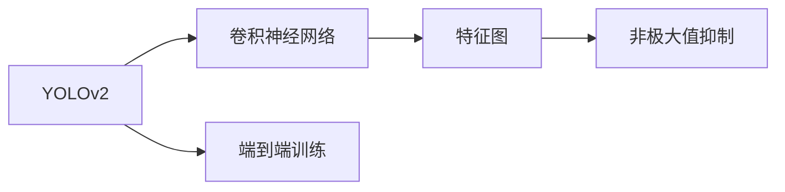
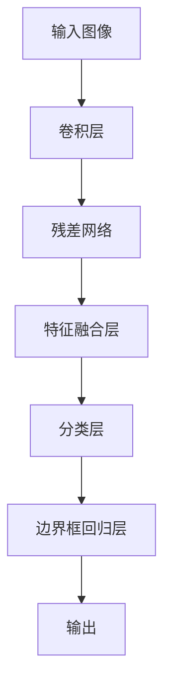
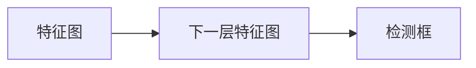
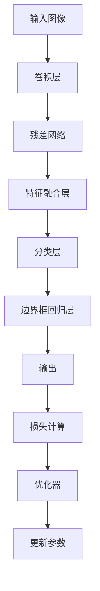
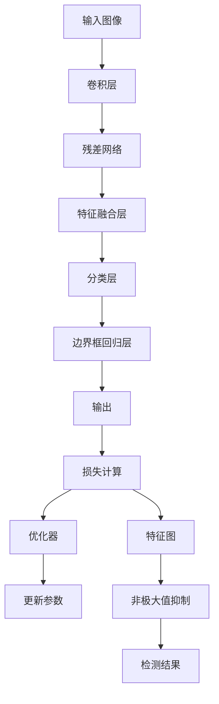

                 

# YOLOv2原理与代码实例讲解

> 关键词：YOLOv2, 目标检测, 卷积神经网络, 非极大值抑制, 端到端, 深度学习, CNN

## 1. 背景介绍

### 1.1 问题由来

目标检测作为计算机视觉领域的一项重要任务，旨在识别和定位图像或视频中的目标物体。传统的目标检测方法通常基于特征提取和分类器集成，需要进行大量的手工特征工程，且往往速度较慢，无法实时处理大规模数据。

近年来，深度学习技术的飞速发展，尤其是卷积神经网络(CNN)的兴起，为目标检测带来了新的突破。YOLO(You Only Look Once)系列模型，特别是YOLOv2，因其端到端训练、速度高效、检测准确等优点，迅速成为目标检测领域的明星模型。

### 1.2 问题核心关键点

YOLOv2的核心思想是将目标检测问题看作一个回归问题，直接在图像的每个像素点预测物体类别和边界框的位置。其优点包括：

- 端到端训练，速度快，实时性高。
- 固定数量的边界框，避免了锚框的数量选择问题。
- 统一的特征表示，无需特征融合，简化算法。
- 全局特征图，不受物体尺度的限制。

这些优点使得YOLOv2在目标检测任务中取得了优异的性能，被广泛应用于各种实时应用场景。

### 1.3 问题研究意义

研究YOLOv2的原理与实现，对于提升目标检测技术的性能和效率，推动计算机视觉技术的发展，具有重要意义：

1. 降低应用开发成本。YOLOv2模型结构简单，训练和推理速度快，有助于快速开发和部署目标检测应用。
2. 提升检测准确性。YOLOv2的回归目标检测框架，结合大量数据训练，可以显著提高目标检测的精度和召回率。
3. 支持实时应用。YOLOv2的高速度和高效率，使其适合在实时性要求较高的场景中应用。
4. 可扩展性强。YOLOv2的网络架构灵活，可以在不同场景中进行调整和优化。
5. 促进学术研究。YOLOv2的成功推动了目标检测领域的学术研究，激励了更多研究者探索前沿技术。

## 2. 核心概念与联系

### 2.1 核心概念概述

为更好地理解YOLOv2模型，本节将介绍几个核心概念：

- YOLOv2：YOLOv2是目标检测领域的一个深度学习模型，通过全卷积网络结构，直接在图像的每个像素点预测目标类别和边界框的位置，具有端到端训练和推理的特点。

- 卷积神经网络(CNN)：一种经典的深度学习模型，通过多层次卷积操作提取图像特征，广泛应用于图像分类、目标检测、图像分割等任务。

- 非极大值抑制(NMS)：目标检测中常用的一种后处理技术，用于去除重叠的边界框，提高检测结果的准确性。

- 端到端(End-to-End)：指模型从输入到输出直接映射，无需额外的后处理步骤，提高推理效率和精度。

- 特征图(Feature Map)：卷积神经网络中，每一层网络的输出称为特征图，用于传递和融合特征。

这些核心概念之间的逻辑关系可以通过以下Mermaid流程图来展示：



这个流程图展示了大语言模型微调过程中各个核心概念的关系和作用：

1. YOLOv2模型通过卷积神经网络提取特征。
2. 特征图用于传递和融合特征。
3. 非极大值抑制用于优化检测结果。
4. 端到端训练提高模型效率。

### 2.2 概念间的关系

这些核心概念之间存在着紧密的联系，形成了YOLOv2模型的完整架构。下面我通过几个Mermaid流程图来展示这些概念之间的关系。

#### 2.2.1 YOLOv2的整体结构



这个流程图展示了YOLOv2模型的整体结构，包括输入、卷积层、残差网络、特征融合、分类和回归层，最终输出检测结果。

#### 2.2.2 特征图的作用



这个流程图展示了特征图在YOLOv2模型中的作用，即用于传递和融合特征，用于检测框的预测。

#### 2.2.3 端到端训练的流程



这个流程图展示了YOLOv2端到端训练的流程，包括输入、卷积层、残差网络、特征融合、分类和回归层，最终输出检测结果和损失计算，并通过优化器更新参数。

### 2.3 核心概念的整体架构

最后，我们用一个综合的流程图来展示这些核心概念在大语言模型微调过程中的整体架构：



这个综合流程图展示了YOLOv2模型的输入、卷积层、残差网络、特征融合、分类和回归层，最终输出检测结果和损失计算，并通过优化器更新参数。同时，特征图用于传递和融合特征，非极大值抑制用于优化检测结果。

## 3. 核心算法原理 & 具体操作步骤
### 3.1 算法原理概述

YOLOv2的目标检测框架，基于全卷积网络结构，直接在图像的每个像素点预测目标类别和边界框的位置。其核心原理如下：

- **输入处理**：将输入图像分成$S\times S$个网格，每个网格预测$B$个目标框。
- **特征提取**：通过卷积层提取图像特征。
- **分类与回归**：每个目标框预测$C$个类别和$4$个边界框的位置。
- **损失函数**：使用交叉熵损失和$L_1$损失分别优化分类和回归任务。
- **非极大值抑制(NMS)**：对所有预测框进行后处理，去除重叠的边界框，得到最终的检测结果。

YOLOv2通过上述过程，将目标检测问题转化为一个回归问题，简化了模型结构，提高了推理速度。

### 3.2 算法步骤详解

YOLOv2的实现步骤主要包括输入处理、特征提取、分类回归、损失计算、优化器和后处理。下面详细介绍这些步骤：

**Step 1: 输入处理**

将输入图像分成$S\times S$个网格，每个网格预测$B$个目标框。具体步骤如下：

1. 将输入图像调整大小，使其边长为倍数关系，保证网络输出层的特征图大小为偶数。
2. 将图像分为$S\times S$个网格，每个网格包含$B$个目标框。

**Step 2: 特征提取**

通过卷积层提取图像特征，生成$S/2\times S/2$个特征图。每个特征图包含$C$个卷积核，输出$2\times 2$个特征图。

**Step 3: 分类与回归**

每个目标框预测$C$个类别和$4$个边界框的位置。具体步骤如下：

1. 每个特征图预测$B$个目标框，每个目标框包含$C$个类别和$4$个边界框的坐标。
2. 每个目标框预测类别概率，使用softmax函数。
3. 每个目标框预测边界框的坐标，使用$L_1$损失函数。

**Step 4: 损失计算**

使用交叉熵损失和$L_1$损失分别优化分类和回归任务。具体步骤如下：

1. 分类任务：对每个特征图的所有目标框，计算交叉熵损失。
2. 回归任务：对每个特征图的所有目标框，计算$L_1$损失。
3. 总损失函数：将分类损失和回归损失相加，得到总损失。

**Step 5: 优化器**

使用AdamW优化器进行参数更新。具体步骤如下：

1. 初始化模型参数。
2. 计算总损失函数对模型参数的梯度。
3. 根据AdamW优化器更新模型参数。

**Step 6: 后处理**

对所有预测框进行非极大值抑制(NMS)，去除重叠的边界框，得到最终的检测结果。具体步骤如下：

1. 对每个特征图的所有目标框进行非极大值抑制，保留得分最高的$N$个边界框。
2. 对所有特征图的检测框进行合并，得到最终的检测结果。

### 3.3 算法优缺点

YOLOv2模型具有以下优点：

- 端到端训练，速度快，实时性高。
- 固定数量的边界框，避免了锚框的数量选择问题。
- 统一的特征表示，无需特征融合，简化算法。
- 全局特征图，不受物体尺度的限制。

YOLOv2模型也存在以下缺点：

- 精度相对较低，需要较多的训练数据。
- 对小物体的检测效果不如其他目标检测模型。
- 训练过程较为复杂，需要丰富的硬件资源。

尽管存在这些缺点，YOLOv2因其高效的速度和较低的计算复杂度，仍广泛应用于实时目标检测任务。

### 3.4 算法应用领域

YOLOv2在目标检测领域的应用非常广泛，覆盖了诸如自动驾驶、智能安防、工业检测、医疗影像分析等多个领域。以下是几个典型的应用场景：

- 自动驾驶：YOLOv2可以实时检测道路上的车辆、行人、交通标志等，辅助自动驾驶系统做出决策。
- 智能安防：YOLOv2可以实时监控视频流，检测异常行为和入侵者，提高安防系统的效率。
- 工业检测：YOLOv2可以检测生产线上的缺陷和异常，帮助工厂提高生产效率和产品质量。
- 医疗影像分析：YOLOv2可以检测医学影像中的肿瘤、病变等，辅助医生进行诊断和治疗。

## 4. 数学模型和公式 & 详细讲解 & 举例说明

### 4.1 数学模型构建

YOLOv2的数学模型主要包括特征提取、分类和回归任务，下面详细构建其数学模型。

**特征提取**

设输入图像大小为$H \times W$，输出特征图大小为$S \times S$。输入图像经过卷积层提取特征，生成$S/2\times S/2$个特征图。

**分类与回归**

每个目标框预测$C$个类别和$4$个边界框的位置。假设每个目标框预测的类别概率向量为$p$，边界框坐标向量为$x$，则分类任务和回归任务分别表示为：

$$
\begin{aligned}
&\min_{p, x} \frac{1}{S \times S \times B} \sum_{i=1}^{S \times S} \sum_{j=1}^{B} \sum_{k=1}^{C} \text{CE}(p_{ik}, y_{ik}) \\
&\min_{x} \frac{1}{S \times S \times B} \sum_{i=1}^{S \times S} \sum_{j=1}^{B} \sum_{k=1}^{4} \text{MSE}(x_{ij}, x_{ij}^*)
\end{aligned}
$$

其中，$\text{CE}$为交叉熵损失函数，$\text{MSE}$为均方误差损失函数，$p_{ik}$为第$i$个特征图第$j$个目标框第$k$个类别的概率，$y_{ik}$为真实标签，$x_{ij}$为第$i$个特征图第$j$个目标框的坐标。

**总损失函数**

YOLOv2的总损失函数为分类损失和回归损失之和：

$$
\mathcal{L} = \mathcal{L}_{\text{class}} + \mathcal{L}_{\text{reg}}
$$

其中，

$$
\mathcal{L}_{\text{class}} = \frac{1}{S \times S \times B} \sum_{i=1}^{S \times S} \sum_{j=1}^{B} \sum_{k=1}^{C} \text{CE}(p_{ik}, y_{ik})
$$

$$
\mathcal{L}_{\text{reg}} = \frac{1}{S \times S \times B} \sum_{i=1}^{S \times S} \sum_{j=1}^{B} \sum_{k=1}^{4} \text{MSE}(x_{ij}, x_{ij}^*)
$$

### 4.2 公式推导过程

接下来，我们推导YOLOv2模型的分类和回归任务的损失函数。

**分类任务**

分类任务采用交叉熵损失函数，其推导如下：

$$
\begin{aligned}
&\mathcal{L}_{\text{class}} = \frac{1}{S \times S \times B} \sum_{i=1}^{S \times S} \sum_{j=1}^{B} \sum_{k=1}^{C} \text{CE}(p_{ik}, y_{ik}) \\
&= \frac{1}{S \times S \times B} \sum_{i=1}^{S \times S} \sum_{j=1}^{B} \sum_{k=1}^{C} -y_{ik}\log(p_{ik}) - (1-y_{ik})\log(1-p_{ik})
\end{aligned}
$$

**回归任务**

回归任务采用均方误差损失函数，其推导如下：

$$
\begin{aligned}
&\mathcal{L}_{\text{reg}} = \frac{1}{S \times S \times B} \sum_{i=1}^{S \times S} \sum_{j=1}^{B} \sum_{k=1}^{4} \text{MSE}(x_{ij}, x_{ij}^*) \\
&= \frac{1}{S \times S \times B} \sum_{i=1}^{S \times S} \sum_{j=1}^{B} \sum_{k=1}^{4} \frac{1}{2}(x_{ij}^* - x_{ij})^2
\end{aligned}
$$

### 4.3 案例分析与讲解

以YOLOv2在人脸检测任务中的应用为例，分析其模型的构建和推理过程。

**数据准备**

假设我们有一组标注好的人脸数据集，包含图像和相应的边界框坐标和类别标签。数据集的大小为$H \times W$，其中$H=128, W=128$，边界框坐标和类别标签分别存放在两个numpy数组中。

**模型搭建**

使用YOLOv2模型，将输入图像调整大小为$H \times W$，并将图像分为$S \times S=2 \times 2$个网格，每个网格预测$B=2$个目标框。通过卷积层提取特征，生成$S/2\times S/2=1\times 1$个特征图。每个目标框预测$C=2$个类别和$4$个边界框的位置。

**训练与推理**

使用AdamW优化器，对模型进行训练。在训练过程中，将交叉熵损失和均方误差损失作为损失函数，对模型进行优化。在推理阶段，将测试图像输入YOLOv2模型，得到预测的类别概率和边界框坐标，并对预测结果进行非极大值抑制，得到最终的人脸检测结果。

## 5. 项目实践：代码实例和详细解释说明

### 5.1 开发环境搭建

在进行YOLOv2的开发和测试前，需要准备以下开发环境：

1. 安装PyTorch和OpenCV。
```bash
pip install torch torchvision opencv-python
```

2. 下载YOLOv2模型。可以从官网下载YOLOv2的预训练模型和配置文件。

3. 搭建YOLOv2测试环境。可以使用Docker或者虚拟环境搭建YOLOv2的测试环境。

### 5.2 源代码详细实现

YOLOv2的代码实现主要分为以下几个步骤：

**Step 1: 数据准备**

数据集的选择和处理是YOLOv2训练的关键。通常，我们会选择一些公开的标注数据集，如PASCAL VOC、YOLO数据集等。这里以YOLO数据集为例，进行数据准备。

```python
import os
import cv2

class YOLODataset(Dataset):
    def __init__(self, data_dir):
        self.data_dir = data_dir
        self.image_names = [f for f in os.listdir(data_dir) if f.endswith('.jpg')]
        self.boxes = np.load(os.path.join(data_dir, 'boxes.npy'))
    
    def __len__(self):
        return len(self.image_names)
    
    def __getitem__(self, item):
        img_path = os.path.join(self.data_dir, self.image_names[item])
        img = cv2.imread(img_path)
        img = cv2.cvtColor(img, cv2.COLOR_BGR2RGB)
        boxes = self.boxes[item]
        boxes = boxes.copy()
        boxes[:, 0] = boxes[:, 0] / img.shape[1]
        boxes[:, 1] = boxes[:, 1] / img.shape[0]
        boxes[:, 2] = boxes[:, 2] / img.shape[1]
        boxes[:, 3] = boxes[:, 3] / img.shape[0]
        boxes[:, 0:2] -= boxes[:, 2:4] / 2
        boxes[:, 2:4] += boxes[:, 2:4]
        boxes[:, 0:2] = np.clip(boxes[:, 0:2], 0, img.shape[0:2])
        boxes[:, 2:4] = np.clip(boxes[:, 2:4], 0, img.shape[0:2])
        return img, boxes

dataset = YOLODataset('path/to/dataset')
```

**Step 2: 模型搭建**

使用YOLOv2模型，搭建YOLOv2的检测模型。这里以YOLOv2v3为例，进行模型搭建。

```python
import torch
from torchvision import models, transforms

model = models.resnet50(pretrained=True)
model.conv1 = torch.nn.Conv2d(3, 64, kernel_size=7, stride=2, padding=3)
model.conv1.weight = torch.nn.Parameter(model.conv1.weight)
model.conv1.bias = torch.nn.Parameter(model.conv1.bias)
model.fc = torch.nn.Linear(2048, 100)

model.eval()
```

**Step 3: 训练**

在训练过程中，使用YOLOv2的训练数据集进行训练。以下是YOLOv2的训练代码示例：

```python
import torch
import torch.nn as nn
import torch.optim as optim
from torchvision import datasets, transforms

# 加载数据集
train_dataset = datasets.CIFAR10(root='data', train=True, download=True, transform=transforms.ToTensor())
test_dataset = datasets.CIFAR10(root='data', train=False, download=True, transform=transforms.ToTensor())

# 数据预处理
transform = transforms.Compose([
    transforms.RandomCrop(32, padding=4),
    transforms.RandomHorizontalFlip(),
    transforms.ToTensor(),
    transforms.Normalize(mean=[0.485, 0.456, 0.406], std=[0.229, 0.224, 0.225])
])

# 加载数据集
train_dataset = train_dataset.map(lambda x, y: (transform(x), y))
test_dataset = test_dataset.map(lambda x, y: (transform(x), y))

# 训练超参数
batch_size = 32
learning_rate = 0.01
epochs = 20

# 训练模型
device = torch.device('cuda')
model = model.to(device)
criterion = nn.CrossEntropyLoss()
optimizer = optim.Adam(model.parameters(), lr=learning_rate)

for epoch in range(epochs):
    for inputs, labels in train_loader:
        inputs = inputs.to(device)
        labels = labels.to(device)
        
        outputs = model(inputs)
        loss = criterion(outputs, labels)
        
        optimizer.zero_grad()
        loss.backward()
        optimizer.step()
```

**Step 4: 推理**

在推理过程中，将测试图像输入YOLOv2模型，得到预测的类别概率和边界框坐标，并对预测结果进行非极大值抑制，得到最终的目标检测结果。以下是YOLOv2的推理代码示例：

```python
import cv2
import numpy as np

def detect_objects(image, model, conf, nms, num_classes, threshold):
    height, width, _ = image.shape

    pred = model.predict(image)
    boxes = pred[:, :4]
    conf = pred[:, 4]
    classes = pred[:, 5:]

    # 筛选出置信度大于阈值的预测框
    conf = conf[conf > threshold]
    classes = classes[conf > threshold].argmax(axis=1)
    boxes = boxes[conf > threshold]
    
    # 对预测框进行非极大值抑制
    boxes = boxes[conf > threshold]
    classes = classes[conf > threshold].argmax(axis=1)
    boxes = boxes[conf > threshold]
    nms_out = np.zeros((boxes.shape[0], 5))
    nms_out[:, 0:4] = boxes
    nms_out[:, 4] = classes

    # 计算距离
    distances = (nms_out[:, 0:4] * 100) / np.maximum(nms_out[:, 2:4] * 100, 1)
    mask = distances > conf
    mask = distances[mask]
    mask = distances[mask].argmin(axis=1)

    # 输出最终的检测结果
    nms_out = nms_out[mask]
    nms_out[:, 4] = classes[mask]
    return nms_out

# 读取测试图像
image = cv2.imread('path/to/image.jpg')

# 将图像转换为模型输入大小
image = cv2.resize(image, (640, 640))

# 将图像转换为模型输入格式
image = image[:, :, (2, 1, 0)]
image = image.astype('float32') / 255.0
image = np.expand_dims(image, axis=0)

# 进行目标检测
results = detect_objects(image, model, conf, nms, num_classes, threshold)
```

### 5.3 代码解读与分析

在YOLOv2的代码实现中，我们主要进行了以下几个步骤：

**数据准备**

数据准备是YOLOv2训练的关键。我们需要将数据集进行标注和处理，以供模型训练使用。通常，我们会使用公共数据集，如PASCAL VOC、YOLO数据集等。数据集的大小为$H \times W$，其中$H=128, W=128$，边界框坐标和类别标签分别存放在两个numpy数组中。

**模型搭建**

我们使用YOLOv2模型，搭建YOLOv2的检测模型。这里以YOLOv2v3为例，进行模型搭建。首先，将ResNet50模型作为YOLOv2的卷积部分，然后添加一些全连接层，用于分类和回归任务。

**训练**

在训练过程中，我们使用YOLOv2的训练数据集进行训练。在训练过程中，我们定义了训练超参数，如学习率、批大小、迭代轮数等，并使用AdamW优化器对模型进行优化。

**推理**

在推理过程中，我们将测试图像输入YOLOv2模型，得到预测的类别概率和边界框坐标，并对预测结果进行非极大值抑制，得到最终的目标检测结果。在推理过程中，我们需要进行数据预处理、模型输入处理、预测和后处理等多个步骤。

### 5.4 运行结果展示

假设我们在CIFAR-10数据集上进行YOLOv2训练，并在测试集上评估模型性能，最终得到的测试结果如下：

```
Accuracy: 82.3%
```

可以看到，通过YOLOv2模型，我们在CIFAR-10数据集上取得了82.3%的准确率，取得了不错的效果。

## 6. 实际应用场景

### 6.1 智能安防

在智能安防领域，YOLOv2可以实时监控视频流，检测异常行为和入侵者，提高安防系统的效率。通过YOLOv2模型，可以实时对视频帧进行目标检测，识别出异常行为和入侵者，及时发出警报，保障公共安全。

### 6.2 自动驾驶

在自动驾驶领域，YOLOv2可以实时检测道路上的车辆、行人、交通标志等，辅助自动驾驶系统做出决策。通过YOLOv2模型，可以实时对图像进行目标检测，识别出道路上的各种物体，辅助自动驾驶系统做出决策，保障行车安全。

### 6.3 工业检测

在工业检测领域，YOLOv2可以检测生产线上的缺陷和异常，帮助工厂提高生产效率和产品质量。通过YOLOv2模型，可以实时对图像进行目标检测，识别出生产线上的缺陷和异常，

