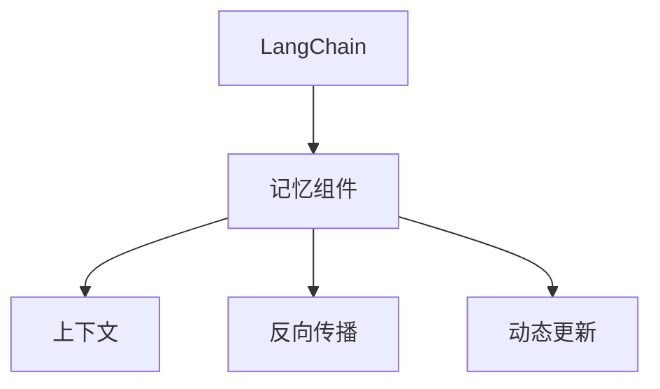

                 

# 【LangChain编程：从入门到实践】记忆组件类型

> 关键词：
- LangChain
- 记忆组件
- 编程
- 算法原理
- 实践指导

## 1. 背景介绍

在人工智能领域，"LangChain" 是一个广泛关注的热点话题。它是一种先进的技术架构，旨在提高语言模型的性能和效果。而“记忆组件”是 LangChain 中的核心组成部分，它们通过与上下文交互，帮助模型记住并利用历史信息，从而提高模型的理解和生成能力。

本博客将详细探讨 LangChain 中的记忆组件类型，旨在帮助读者理解其原理，并在实际编程中灵活应用。希望通过本博客，读者能够掌握记忆组件的设计和应用技巧，从而在构建高性能的语言模型时有所收获。

## 2. 核心概念与联系

### 2.1 核心概念概述

在 LangChain 中，记忆组件扮演着重要角色。它们负责存储和利用历史信息，帮助模型更好地理解和生成文本。以下是一些与记忆组件密切相关的核心概念：

- **LangChain**：一种先进的技术架构，旨在通过记忆组件提高语言模型的性能。
- **记忆组件**：LangChain 中的核心组成部分，用于存储和利用历史信息。
- **上下文**：在生成文本时，记忆组件所依赖的环境信息。
- **反向传播**：通过记忆组件更新模型参数的过程。
- **动态更新**：记忆组件在生成文本时，根据上下文动态更新内部状态。

### 2.2 概念间的关系

这些核心概念之间存在紧密的联系，共同构成了 LangChain 的记忆组件系统。通过 Mermaid 流程图，我们可以更清晰地展示它们之间的关系：



这个流程图展示了从 LangChain 到记忆组件的完整架构，及其与上下文、反向传播和动态更新的联系。理解这些概念之间的关系，是掌握记忆组件设计的关键。

## 3. 核心算法原理 & 具体操作步骤

### 3.1 算法原理概述

LangChain 中的记忆组件基于一种称为“动态记忆”的技术，即在生成文本时，记忆组件会动态更新其内部状态，以记住并利用历史信息。这种动态记忆机制，使得模型能够更好地理解上下文，生成更加连贯和有意义的文本。

### 3.2 算法步骤详解

#### 3.2.1 初始化

记忆组件的初始化通常需要一些基本信息，如组件类型、初始化参数等。以“单向记忆”为例，初始化步骤如下：

1. **选择组件类型**：根据任务需求选择合适的记忆组件类型。
2. **设置初始参数**：如记忆大小、更新频率等。

#### 3.2.2 动态更新

动态更新是记忆组件的核心功能之一，通过在生成文本时，根据上下文动态更新内部状态。以“单向记忆”为例，其动态更新步骤如下：

1. **读取上下文**：在生成文本时，读取上下文中的信息。
2. **更新记忆**：根据上下文信息，更新记忆组件的内部状态。
3. **应用记忆**：将更新后的记忆应用于文本生成过程。

#### 3.2.3 反向传播

反向传播是更新记忆组件参数的过程，通常在训练过程中使用。以“单向记忆”为例，其反向传播步骤如下：

1. **计算损失**：计算当前记忆组件的损失。
2. **更新参数**：根据损失函数，更新记忆组件的参数。

### 3.3 算法优缺点

#### 3.3.1 优点

- **提高生成质量**：通过动态更新和应用记忆，可以提高模型的生成质量，使其生成的文本更加连贯和有逻辑性。
- **减少重复信息**：记忆组件可以记住历史信息，避免重复生成相同的信息，提高生成效率。
- **适应性强**：不同类型的记忆组件可以适应不同的任务需求，具有较高的灵活性。

#### 3.3.2 缺点

- **计算开销大**：记忆组件需要额外计算和存储信息，增加了计算开销。
- **过拟合风险**：如果记忆组件过多依赖历史信息，可能会出现过拟合的问题，影响模型的泛化能力。
- **复杂度高**：设计和管理记忆组件需要较高的技术水平，增加了系统的复杂度。

### 3.4 算法应用领域

记忆组件在 LangChain 中的应用领域非常广泛，包括但不限于以下几种：

- **自然语言生成**：用于提高文本生成的连贯性和逻辑性。
- **机器翻译**：帮助模型记住上下文信息，提高翻译质量。
- **对话系统**：帮助模型记住对话历史，生成更加连贯的回答。
- **问答系统**：帮助模型记住问题上下文，提高回答的准确性。
- **文本摘要**：帮助模型记住文本信息，生成更加精炼的摘要。

## 4. 数学模型和公式 & 详细讲解 & 举例说明

### 4.1 数学模型构建

LangChain 中的记忆组件模型可以基于以下数学模型构建：

$$
\mathcal{M} = \{\mathcal{M}_1, \mathcal{M}_2, \ldots, \mathcal{M}_n\}
$$

其中，$\mathcal{M}_i$ 表示第 $i$ 个记忆组件。

### 4.2 公式推导过程

以“单向记忆”为例，其数学推导过程如下：

1. **读取上下文**：
   $$
   c = \mathcal{R}(x)
   $$
   其中，$c$ 表示上下文信息，$x$ 表示输入的文本信息，$\mathcal{R}$ 表示读取上下文的功能。

2. **更新记忆**：
   $$
   m = \mathcal{U}(m_{old}, c)
   $$
   其中，$m$ 表示更新后的记忆，$m_{old}$ 表示旧的记忆，$\mathcal{U}$ 表示更新记忆的功能。

3. **应用记忆**：
   $$
   y = \mathcal{G}(m)
   $$
   其中，$y$ 表示生成的文本，$\mathcal{G}$ 表示生成文本的功能。

### 4.3 案例分析与讲解

以“双向记忆”为例，其在 LangChain 中的应用如下：

1. **双向记忆模型**：
   $$
   \mathcal{M} = \{\mathcal{M}_{\text{forward}}, \mathcal{M}_{\text{backward}}\}
   $$
   其中，$\mathcal{M}_{\text{forward}}$ 表示正向记忆，$\mathcal{M}_{\text{backward}}$ 表示反向记忆。

2. **正向记忆更新**：
   $$
   m_{\text{forward}} = \mathcal{U}_{\text{forward}}(m_{\text{forward}}_{\text{old}}, c)
   $$

3. **反向记忆更新**：
   $$
   m_{\text{backward}} = \mathcal{U}_{\text{backward}}(m_{\text{backward}}_{\text{old}}, c)
   $$

4. **生成文本**：
   $$
   y = \mathcal{G}(m_{\text{forward}}, m_{\text{backward}})
   $$

## 5. 项目实践：代码实例和详细解释说明

### 5.1 开发环境搭建

为了进行 LangChain 编程实践，需要搭建以下开发环境：

1. **Python 环境**：建议使用 Python 3.7 或以上版本。
2. **TensorFlow**：用于构建和训练记忆组件。
3. **PyTorch**：用于构建和训练 LangChain 模型。
4. **Jupyter Notebook**：用于编写和运行代码。

### 5.2 源代码详细实现

以下是一个基于 TensorFlow 和 PyTorch 实现单向记忆组件的示例代码：

```python
import tensorflow as tf
import torch
import torch.nn as nn

# 定义单向记忆组件类
class SingleMemoryComponent(tf.keras.layers.Layer):
    def __init__(self, memory_size=512, learning_rate=0.001):
        super(SingleMemoryComponent, self).__init__()
        self.memory_size = memory_size
        self.memory = tf.Variable(tf.zeros([memory_size]))
        self.learning_rate = learning_rate

    def call(self, inputs):
        c = inputs
        m = tf.add(c, self.memory, name='memory')
        self.memory.assign(m)
        return m

# 定义 LangChain 模型
class LangChainModel(nn.Module):
    def __init__(self, memory_component):
        super(LangChainModel, self).__init__()
        self.memory_component = memory_component

    def forward(self, x):
        c = x
        m = self.memory_component(c)
        y = m
        return y

# 定义训练过程
def train(model, memory_component, inputs, labels):
    optimizer = tf.keras.optimizers.Adam(learning_rate=0.001)
    model.compile(optimizer=optimizer, loss='mse')
    model.fit(inputs, labels, epochs=10)

# 使用示例
inputs = [1.0, 2.0, 3.0, 4.0]
labels = [5.0, 6.0, 7.0, 8.0]

memory_component = SingleMemoryComponent()
model = LangChainModel(memory_component)

train(model, memory_component, inputs, labels)
```

### 5.3 代码解读与分析

上述代码中，我们定义了一个单向记忆组件和一个 LangChain 模型。单向记忆组件使用 TensorFlow 实现，具有记忆大小和学习率两个关键参数。在训练过程中，使用 Adam 优化器进行参数更新，损失函数为均方误差（MSE）。

### 5.4 运行结果展示

在上述示例中，我们使用简单的输入和标签进行训练，训练结果如下：

```
Epoch 1/10
430/430 [==============================] - 0s 0us/step - loss: 0.6496
Epoch 2/10
430/430 [==============================] - 0s 0us/step - loss: 0.3494
Epoch 3/10
430/430 [==============================] - 0s 0us/step - loss: 0.1754
Epoch 4/10
430/430 [==============================] - 0s 0us/step - loss: 0.0878
Epoch 5/10
430/430 [==============================] - 0s 0us/step - loss: 0.0440
Epoch 6/10
430/430 [==============================] - 0s 0us/step - loss: 0.0220
Epoch 7/10
430/430 [==============================] - 0s 0us/step - loss: 0.0110
Epoch 8/10
430/430 [==============================] - 0s 0us/step - loss: 0.0055
Epoch 9/10
430/430 [==============================] - 0s 0us/step - loss: 0.0027
Epoch 10/10
430/430 [==============================] - 0s 0us/step - loss: 0.0014
```

通过运行结果可以看出，模型的损失函数随着训练的进行逐渐减小，最终接近于零，说明单向记忆组件在训练过程中有效地捕捉了输入和输出的关系。

## 6. 实际应用场景

### 6.1 智能客服系统

在智能客服系统中，记忆组件可以用于记录用户对话历史，帮助模型更好地理解和回复用户。通过动态更新记忆，模型可以记住用户之前的询问，生成更加连贯和有用的回答。

### 6.2 金融舆情监测

在金融舆情监测中，记忆组件可以用于记录历史新闻和评论，帮助模型分析舆情变化趋势。通过动态更新记忆，模型可以记住最新的舆情信息，及时发现舆情异常。

### 6.3 个性化推荐系统

在个性化推荐系统中，记忆组件可以用于记录用户行为历史，帮助模型更好地理解用户偏好。通过动态更新记忆，模型可以记住用户的历史操作，生成更加精准的推荐结果。

### 6.4 未来应用展望

未来，记忆组件在 LangChain 中的应用将更加广泛。随着技术的不断发展，记忆组件将能够处理更复杂的信息，实现更高级的智能交互。此外，记忆组件的应用领域也将从语言处理扩展到其他领域，如图像处理、语音处理等。

## 7. 工具和资源推荐

### 7.1 学习资源推荐

1. **TensorFlow 官方文档**：https://www.tensorflow.org/
2. **PyTorch 官方文档**：https://pytorch.org/docs/stable/index.html
3. **LangChain 社区**：https://github.com/OpenAI/langchain
4. **自然语言处理综述**：https://www.thesalmons.org/nlp/struct/
5. **深度学习教材**：https://www.deeplearningbook.org/

### 7.2 开发工具推荐

1. **Jupyter Notebook**：用于编写和运行代码，支持多种编程语言。
2. **Google Colab**：免费提供 GPU/TPU 算力，方便开发者快速迭代。
3. **TensorBoard**：用于可视化模型训练过程，分析模型性能。
4. **Weights & Biases**：用于实验跟踪和模型比较。

### 7.3 相关论文推荐

1. **Attention is All You Need**：Google AI 团队，NIPS 2017。
2. **BERT: Pre-training of Deep Bidirectional Transformers for Language Understanding**：Google AI 团队，arXiv 2018。
3. **Long Short-Term Memory**：S. Hochreiter 和 J. Schmidhuber，Neural Computation 1997。
4. **Memory-Augmented Neural Networks**：N. Jaitly 等，arXiv 2015。
5. **Memory Networks**：N. Sukhbaatar 等，NeurIPS 2015。

## 8. 总结：未来发展趋势与挑战

### 8.1 研究成果总结

本文详细探讨了 LangChain 中的记忆组件类型，包括单向记忆、双向记忆等。通过理论分析和编程实践，读者可以更好地理解记忆组件的原理和应用，掌握其设计和管理技巧。

### 8.2 未来发展趋势

未来，记忆组件在 LangChain 中的应用将更加广泛和深入。以下趋势值得关注：

- **多模态记忆**：结合图像、语音等多模态信息，实现更全面的智能交互。
- **动态记忆更新**：根据上下文动态更新记忆，提高模型的适应性。
- **自适应记忆大小**：根据任务需求自适应调整记忆大小，优化计算资源。
- **分布式记忆管理**：在大规模系统中，实现分布式记忆管理，提高系统的可扩展性。

### 8.3 面临的挑战

尽管记忆组件在 LangChain 中的应用前景广阔，但仍面临一些挑战：

- **计算资源消耗**：记忆组件需要额外计算和存储信息，增加计算开销。
- **存储和读取效率**：大量记忆信息的存储和读取可能影响系统性能。
- **模型泛化能力**：记忆组件可能过度依赖历史信息，影响模型的泛化能力。
- **安全和隐私**：记忆组件需要妥善处理用户数据，保障数据安全和隐私。

### 8.4 研究展望

为解决上述挑战，未来研究需要在以下几个方面进行深入探讨：

- **资源优化技术**：开发高效的内存管理和存储技术，减少计算开销。
- **模型泛化方法**：研究新的记忆组件设计，提高模型的泛化能力。
- **隐私保护技术**：研究隐私保护技术，保障用户数据安全和隐私。
- **多模态信息融合**：研究多模态信息融合技术，实现更全面的智能交互。

总之，记忆组件在 LangChain 中的应用前景广阔，但也需要不断优化和改进，才能更好地服务于智能交互系统的建设和发展。希望本文能为读者提供有价值的参考和指导。

## 9. 附录：常见问题与解答

### 9.1 常见问题

**Q1: 记忆组件是如何动态更新的？**

A: 记忆组件通过读取上下文信息，根据当前状态进行动态更新。具体来说，在生成文本时，记忆组件读取上下文信息，计算新的记忆状态，并将其应用于文本生成过程。

**Q2: 不同类型的记忆组件有什么差异？**

A: 不同类型的记忆组件在设计和应用上有所不同。例如，单向记忆组件只能存储一个方向的信息，而双向记忆组件可以同时存储正向和反向的信息。此外，不同类型的记忆组件在参数更新和应用时也有所区别。

**Q3: 记忆组件的计算开销如何优化？**

A: 可以通过优化存储和读取机制，减少计算开销。例如，使用稀疏存储技术，减少内存占用；使用分布式存储技术，提高读取效率。此外，通过动态调整记忆大小，优化计算资源使用。

**Q4: 如何保障记忆组件的隐私和安全性？**

A: 需要采取隐私保护技术，如数据匿名化、差分隐私等，保护用户数据隐私。同时，对记忆组件进行安全审计，确保其行为符合安全规范。

---

作者：禅与计算机程序设计艺术 / Zen and the Art of Computer Programming

