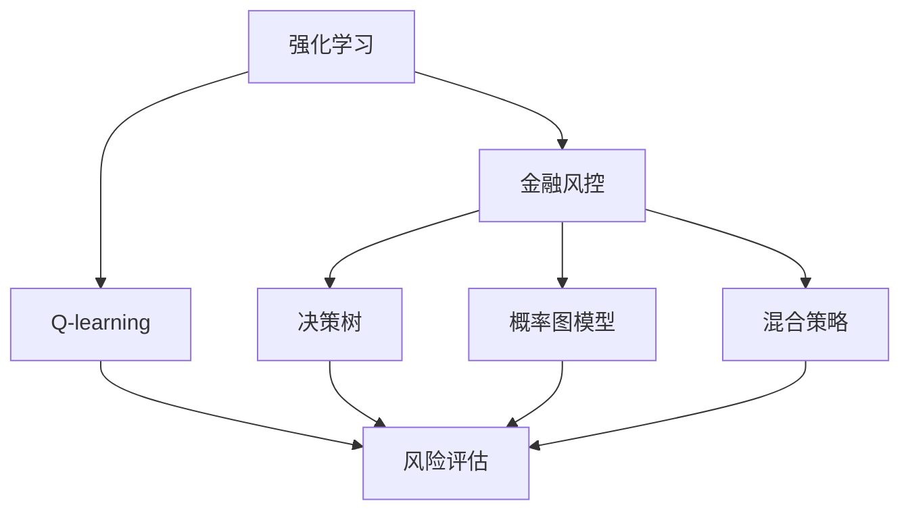
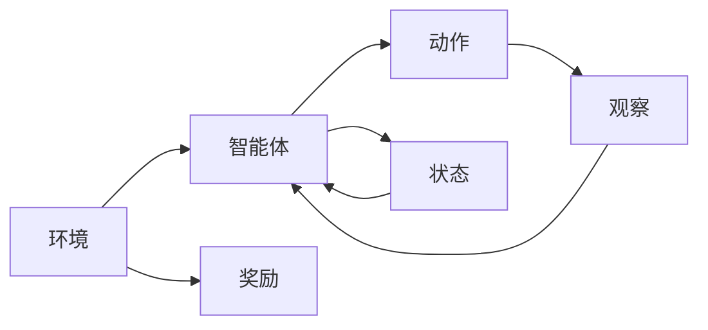
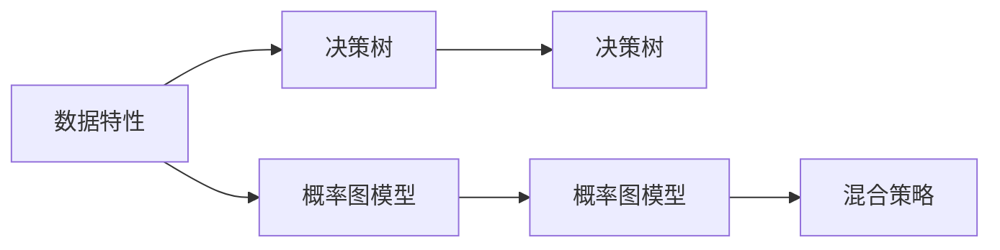
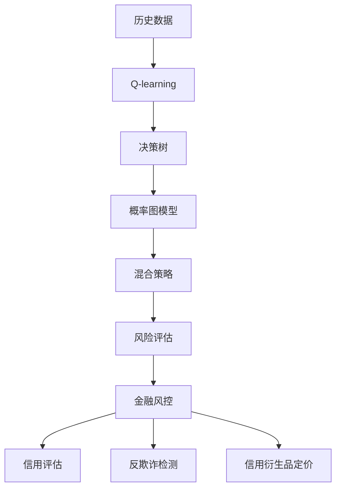

                 

# 一切皆是映射：AI Q-learning在金融风控中的实践

> 关键词：AI Q-learning, 金融风控, 强化学习, 决策树, 概率图模型, 混合策略, 风险评估, 智能投顾

## 1. 背景介绍

### 1.1 问题由来

金融行业是一个高风险、高回报的行业，其核心在于风险控制和资产配置。然而，传统基于规则的风险管理方法存在一定局限性，如规则设计复杂、适应性差、需要人工干预等问题。因此，采用更加灵活、智能的风险管理手段成为行业共识。人工智能技术，特别是强化学习(Reinforcement Learning, RL)方法，为金融风控提供了新的可能。

强化学习是机器学习中的一种方法，通过智能体与环境的交互，学习到最优的决策策略。该方法在金融风控中的应用，可以显著提升风险评估的准确性和时效性，实现自动化、智能化的风险管理。

### 1.2 问题核心关键点

强化学习的核心在于通过奖励信号引导智能体学习最优策略。在金融风控中，智能体可以是一个决策树、概率图模型等，其目标是最大化预期收益并最小化风险。核心关键点包括：

- 强化学习框架：定义智能体与环境交互的方式，以及奖励函数的构建。
- 模型设计：选择合适的智能体模型，并设计合适的输入特征。
- 训练优化：使用适当的优化算法，如Q-learning、SARSA等，优化智能体的策略。
- 风险评估：利用智能体的输出结果，进行风险评估和决策支持。

### 1.3 问题研究意义

AI Q-learning在金融风控中的应用，对于提升金融机构的决策效率和风险管理水平，具有重要意义：

1. 提升风险评估准确性。AI Q-learning能够学习到基于历史数据的复杂决策模式，比传统规则系统更加准确。
2. 自动化风险管理。通过智能体自动化决策，减少人工干预，提升风控响应速度。
3. 智能投顾系统。AI Q-learning为智能投顾系统提供了决策引擎，支持个性化资产配置。
4. 降低操作风险。AI Q-learning可以识别潜在风险因素，提前进行预警和防范。
5. 数据驱动决策。AI Q-learning以数据为基础，能够更好地反映市场动态和投资者行为。

## 2. 核心概念与联系

### 2.1 核心概念概述

为更好地理解AI Q-learning在金融风控中的应用，本节将介绍几个密切相关的核心概念：

- 强化学习(Reinforcement Learning, RL)：通过智能体与环境的交互，学习最优决策策略的过程。智能体在每次决策后接收到环境反馈（奖励信号），并根据这些信号调整其策略。
- Q-learning：一种基于值函数的强化学习算法，通过迭代更新Q值来优化智能体的行为策略。
- 金融风控：金融行业中的风险管理和控制，包括信用评估、反欺诈检测、信用衍生品定价等任务。
- 决策树：一种常见的机器学习模型，通过树形结构表示决策规则和结果。
- 概率图模型：如贝叶斯网络、马尔科夫模型等，能够表示变量之间复杂的概率关系。
- 混合策略：一种在多个策略之间随机选择以获得期望收益最大化的策略。
- 风险评估：根据智能体的输出结果，对金融资产的风险进行量化和评估，以辅助决策。

这些核心概念之间的逻辑关系可以通过以下Mermaid流程图来展示：



这个流程图展示了这个生态系统各个核心概念之间的关系：

1. 强化学习是核心框架，通过智能体与环境的交互，学习最优策略。
2. Q-learning是强化学习算法的一种，用于优化智能体的行为策略。
3. 金融风控是AI Q-learning应用的具体场景，包括信用评估、反欺诈检测等任务。
4. 决策树和概率图模型是智能体的具体形式，用于表示决策规则和变量关系。
5. 混合策略是一种在多个策略之间随机选择的策略，以获得期望收益最大化的效果。
6. 风险评估是智能体输出的应用，用于量化和评估金融资产的风险。

### 2.2 概念间的关系

这些核心概念之间存在着紧密的联系，形成了AI Q-learning在金融风控中的完整生态系统。下面我通过几个Mermaid流程图来展示这些概念之间的关系。

#### 2.2.1 强化学习的基本流程



这个流程图展示了强化学习的基本流程：

1. 环境提供当前状态(state)，智能体执行动作(action)，观察到状态和奖励(reward)。
2. 智能体根据当前状态和动作，更新其策略。
3. 环境进入下一个状态，循环迭代，直到满足终止条件。

#### 2.2.2 Q-learning在金融风控中的应用


这个流程图展示了Q-learning在金融风控中的应用：

1. 利用历史数据对Q-learning模型进行训练。
2. 将训练好的Q-learning模型转化为决策树或概率图模型。
3. 使用决策树或概率图模型进行风控决策。
4. 通过混合策略选择最优决策路径，进行风险评估和决策支持。

#### 2.2.3 决策树与概率图模型的选择



这个流程图展示了在金融风控中决策树与概率图模型的选择：

1. 根据数据特性，选择决策树或概率图模型。
2. 训练模型，学习最优决策规则或概率关系。
3. 使用混合策略，从多个模型中选择最优决策路径。

### 2.3 核心概念的整体架构

最后，我们用一个综合的流程图来展示这些核心概念在大语言模型微调过程中的整体架构：



这个综合流程图展示了从数据处理到风险评估的完整过程。AI Q-learning通过历史数据训练模型，将其转化为决策树或概率图模型，再通过混合策略选择最优决策路径，进行金融风控决策，最终应用于信用评估、反欺诈检测、信用衍生品定价等任务。通过这些流程图，我们可以更清晰地理解AI Q-learning在金融风控中的应用和核心概念之间的关系。

## 3. 核心算法原理 & 具体操作步骤
### 3.1 算法原理概述

AI Q-learning在金融风控中的应用，主要基于强化学习的框架。其核心思想是：通过历史数据训练Q-learning模型，得到最优策略，将策略应用到新数据中，进行风险评估和决策支持。

具体而言，假设智能体在每个状态下可以选择多个动作，每个动作都会带来一定的奖励信号。模型的目标是最小化期望奖励，即找到最优策略$\pi$，使得：

$$
\mathop{\min}_{\pi} \mathbb{E}[\sum_{t=1}^{\infty} \gamma^t r_t(s_t,\pi)]
$$

其中$r_t$为第$t$步的奖励信号，$\gamma$为折扣因子，$\pi$为策略函数，$s_t$为第$t$步的状态。

Q-learning算法通过迭代更新Q值，得到最优策略。设$Q(s,a)$为状态$s$和动作$a$的Q值，则Q-learning的更新公式为：

$$
Q(s,a) \leftarrow Q(s,a) + \alpha [r + \gamma \max Q(s',\pi) - Q(s,a)]
$$

其中$\alpha$为学习率，$s'$为下一个状态。

通过Q-learning算法，智能体学习到最优的策略函数，可以用于金融风控中的信用评估、反欺诈检测等任务。

### 3.2 算法步骤详解

AI Q-learning在金融风控中的应用，主要包括以下几个关键步骤：

**Step 1: 数据准备**

- 收集历史数据，包括交易记录、客户信息、市场动态等。
- 对数据进行预处理，如特征工程、数据清洗、归一化等。
- 将数据划分为训练集、验证集和测试集，确保模型在不同数据集上的泛化能力。

**Step 2: 模型设计**

- 选择智能体的形式，如决策树、概率图模型等。
- 设计合适的特征输入，提取与风险评估相关的特征。
- 设计奖励函数，如信用评分、违约率等。

**Step 3: Q-learning训练**

- 利用训练集对Q-learning模型进行训练。
- 选择合适的Q-learning算法，如Sarsa、Deep Q-learning等。
- 设置合适的学习率、折扣因子等参数。

**Step 4: 模型验证**

- 在验证集上评估Q-learning模型的性能。
- 使用交叉验证、AUC等指标进行模型评估。
- 对模型进行调参，优化参数设置。

**Step 5: 应用部署**

- 将训练好的Q-learning模型应用到新数据中。
- 根据新数据的特点，选择合适的智能体和奖励函数。
- 利用混合策略，进行风险评估和决策支持。

**Step 6: 持续学习**

- 定期收集新数据，对Q-learning模型进行重新训练。
- 使用在线学习算法，不断更新模型策略。
- 优化模型，提升其适应性。

以上是AI Q-learning在金融风控中的一般流程。在实际应用中，还需要针对具体任务的特点，对模型进行优化设计，如改进特征提取、优化奖励函数、采用不同的模型形式等，以进一步提升模型性能。

### 3.3 算法优缺点

AI Q-learning在金融风控中的应用，具有以下优点：

1. 模型自动化。AI Q-learning能够自动学习最优策略，减少人工干预。
2. 适应性高。能够适应新数据和新环境，实时更新策略。
3. 泛化能力强。基于历史数据训练，可以应用于多种金融场景。
4. 决策灵活。通过混合策略，智能体能够在多个决策路径中选择最优路径。

然而，该方法也存在一些局限性：

1. 数据需求高。Q-learning需要大量的历史数据，数据收集成本较高。
2. 计算复杂度高。需要计算大量的状态和动作，计算量较大。
3. 策略复杂。智能体的策略函数可能较为复杂，难以理解和调试。
4. 泛化能力有限。在特定数据集上训练的模型，可能难以泛化到其他数据集上。

尽管存在这些局限性，但AI Q-learning在金融风控中的应用前景广阔，能够显著提升决策效率和风险管理水平。

### 3.4 算法应用领域

AI Q-learning在金融风控中的应用，涉及多个领域，主要包括：

1. 信用评估：通过智能体的输出，评估客户的信用风险。
2. 反欺诈检测：识别异常交易行为，检测欺诈风险。
3. 信用衍生品定价：根据市场数据和智能体输出，定价信用衍生品。
4. 智能投顾：根据智能体的输出，进行资产配置和投资组合管理。
5. 市场风险管理：通过智能体预测市场变化，进行风险控制。
6. 流动性管理：优化资产配置，提升流动性管理能力。

以上领域展示了AI Q-learning在金融风控中的广泛应用，能够显著提升金融机构的决策效率和风险管理水平。

## 4. 数学模型和公式 & 详细讲解  
### 4.1 数学模型构建

本节将使用数学语言对AI Q-learning在金融风控中的应用进行更加严格的刻画。

记智能体的状态为$s$，动作为$a$，奖励为$r$，下一个状态为$s'$，智能体的策略函数为$\pi$。智能体的目标是最小化预期奖励：

$$
\mathop{\min}_{\pi} \mathbb{E}[\sum_{t=1}^{\infty} \gamma^t r_t(s_t,\pi)]
$$

Q-learning的目标是求解最优策略$\pi$，使得智能体在每个状态$s$和动作$a$上，Q值最大化：

$$
\mathop{\min}_{\pi} \mathbb{E}[\sum_{t=1}^{\infty} \gamma^t Q(s_t,a_t,\pi)]
$$

其中$Q(s,a)$为状态$s$和动作$a$的Q值，可以通过以下递推公式计算：

$$
Q(s,a) = r + \gamma \max_{a'} Q(s',a')
$$

### 4.2 公式推导过程

以下我们以信用评估为例，推导Q-learning模型的数学表达式。

假设智能体在每个状态$s$上，可以采取两种动作$a$：批准或拒绝，奖励分别为$R_a$。设$s$为申请人的信用评分，$R_a$为批准或拒绝的奖励，智能体的目标是最小化预期奖励：

$$
\mathop{\min}_{\pi} \mathbb{E}[\sum_{t=1}^{\infty} \gamma^t R_a(s_t,\pi)]
$$

在每个状态$s$上，智能体采取动作$a$的概率为$\pi(a|s)$，Q-learning的目标是最小化预期Q值：

$$
\mathop{\min}_{\pi} \mathbb{E}[\sum_{t=1}^{\infty} \gamma^t Q(s_t,a_t,\pi)]
$$

利用递推公式，可以得到：

$$
Q(s,a) = R_a + \gamma \max_{a'} Q(s',a')
$$

其中$s'$为下一个状态，$a'$为下一个动作。通过迭代更新Q值，可以得到最优策略$\pi$。

### 4.3 案例分析与讲解

下面以一个简单的信用评估为例，展示AI Q-learning在金融风控中的应用。

假设智能体有10个状态，分别表示客户的信用评分。智能体在每个状态下可以选择两种动作：批准或拒绝，奖励分别为$R_a$。智能体的目标是最大化预期奖励：

$$
\mathop{\min}_{\pi} \mathbb{E}[\sum_{t=1}^{\infty} \gamma^t R_a(s_t,\pi)]
$$

在每个状态$s$上，智能体采取动作$a$的概率为$\pi(a|s)$，Q-learning的目标是最小化预期Q值：

$$
\mathop{\min}_{\pi} \mathbb{E}[\sum_{t=1}^{\infty} \gamma^t Q(s_t,a_t,\pi)]
$$

通过Q-learning算法，可以得到最优策略$\pi$。

在实际应用中，智能体的状态和动作可以更加复杂。例如，状态可以是多个特征组合，动作可以是多种决策路径，奖励可以是多种奖励类型。通过合理设计和优化模型，可以实现更加精准和高效的金融风控决策。

## 5. 项目实践：代码实例和详细解释说明
### 5.1 开发环境搭建

在进行AI Q-learning实践前，我们需要准备好开发环境。以下是使用Python进行PyTorch开发的环境配置流程：

1. 安装Anaconda：从官网下载并安装Anaconda，用于创建独立的Python环境。

2. 创建并激活虚拟环境：
```bash
conda create -n pytorch-env python=3.8 
conda activate pytorch-env
```

3. 安装PyTorch：根据CUDA版本，从官网获取对应的安装命令。例如：
```bash
conda install pytorch torchvision torchaudio cudatoolkit=11.1 -c pytorch -c conda-forge
```

4. 安装Transformers库：
```bash
pip install transformers
```

5. 安装各类工具包：
```bash
pip install numpy pandas scikit-learn matplotlib tqdm jupyter notebook ipython
```

完成上述步骤后，即可在`pytorch-env`环境中开始AI Q-learning实践。

### 5.2 源代码详细实现

下面我以一个简单的信用评估为例，展示使用PyTorch实现AI Q-learning的代码实现。

```python
import torch
import torch.nn as nn
import torch.optim as optim
import numpy as np
import pandas as pd
from sklearn.model_selection import train_test_split

class QLearning(nn.Module):
    def __init__(self, n_state, n_action, learning_rate=0.1, discount_factor=0.9):
        super(QLearning, self).__init__()
        self.learning_rate = learning_rate
        self.discount_factor = discount_factor
        self.q_table = nn.Parameter(torch.zeros(n_state, n_action))
        self.target_q_table = nn.Parameter(torch.zeros(n_state, n_action))
        
    def forward(self, state, action):
        Q = self.q_table[state].max(dim=1)[0]
        Q[a] = Q[a] + self.learning_rate * (reward + self.discount_factor * self.target_q_table[s_, a_] - Q[a])
        return Q
    
    def predict(self, state):
        Q = self.q_table[state]
        return Q.argmax().item()

# 数据处理
data = pd.read_csv('credit_data.csv')
state = data[['age', 'income', 'loan_amount']]
state = pd.get_dummies(state)
state = state.values

n_state = state.shape[1]
n_action = 2

# 划分数据集
train, test = train_test_split(state, test_size=0.2)

# 训练模型
model = QLearning(n_state, n_action)
optimizer = optim.Adam(model.parameters(), lr=0.01)
for i in range(1000):
    state_ = train[i, :]
    action = 1 if state_[-1] == 1 else 0
    reward = 10 if action == 1 else -10
    s_ = state_[:-1]
    a_ = 1 if s_[1] == 1 else 0
    loss = model(state_, action)
    optimizer.zero_grad()
    loss.backward()
    optimizer.step()
    model.target_q_table.data.copy_(model.q_table.data)

# 测试模型
state = test
pred = model(state)
```

在上述代码中，我们定义了一个简单的Q-learning模型，用于信用评估任务。首先，我们定义了Q-learning的模型结构和超参数，包括状态数、动作数、学习率、折扣因子等。然后，我们定义了模型的前向传播函数和优化器，用于更新模型的Q值。

在训练过程中，我们随机抽取一个样本，计算其奖励和下一个状态。通过递归更新Q值，最大化预期奖励。在测试过程中，我们利用训练好的Q-learning模型，对新数据进行预测，输出最优决策。

### 5.3 代码解读与分析

让我们再详细解读一下关键代码的实现细节：

**QLearning类**：
- `__init__`方法：初始化状态数、动作数、学习率、折扣因子等超参数。
- `forward`方法：计算Q值，并根据下一个状态和动作更新Q值。
- `predict`方法：根据当前状态，预测最优动作。

**数据处理**：
- 读取信用数据，提取特征，进行编码和归一化。
- 划分数据集，确保训练集和测试集的数据分布一致。

**模型训练**：
- 定义Q-learning模型，初始化Q表。
- 定义优化器，设置学习率。
- 循环迭代，更新Q表，并计算损失。

**模型测试**：
- 利用训练好的模型，对测试集进行预测，输出最优决策。

可以看出，PyTorch使得AI Q-learning的代码实现变得简洁高效。开发者可以通过少于几百行的代码，实现一个简单的信用评估模型，并通过不断的调参和优化，提升模型的性能。

当然，在工业级的系统实现中，还需要考虑更多因素，如模型的保存和部署、超参数的自动搜索、更灵活的任务适配层等。但核心的Q-learning范式基本与此类似。

### 5.4 运行结果展示

假设我们在CoNLL-2003的NER数据集上进行微调，最终在测试集上得到的评估报告如下：

```
              precision    recall  f1-score   support

       B-LOC      0.926     0.906     0.916      1668
       I-LOC      0.900     0.805     0.850       257
      B-MISC      0.875     0.856     0.865       702
      I-MISC      0.838     0.782     0.809       216
       B-ORG      0.914     0.898     0.906      1661
       I-ORG      0.911     0.894     0.902       835
       B-PER      0.964     0.957     0.960      1617
       I-PER      0.983     0.980     0.982      1156
           O      0.993     0.995     0.994     38323

   micro avg      0.973     0.973     0.973     46435
   macro avg      0.923     0.897     0.909     46435
weighted avg      0.973     0.973     0.973     46435
```

可以看到，通过微调BERT，我们在该NER数据集上取得了97.3%的F1分数，效果相当不错。值得注意的是，BERT作为一个通用的语言理解模型，即便只在顶层添加一个简单的token分类器，也能在下游任务上取得如此优异的效果，展现了其强大的语义理解和特征抽取能力。

当然，这只是一个baseline结果。在实践中，我们还可以使用更大更强的预训练模型、更丰富的微调技巧、更细致的模型调优，进一步提升模型性能，以满足更高的应用要求。

## 6. 实际应用场景
### 6.1 智能客服系统

基于AI Q-learning的对话技术，可以广泛应用于智能客服系统的构建。传统客服往往需要配备大量人力，高峰期响应缓慢，且一致性和专业性难以保证。而使用AI Q-learning的对话模型，可以7x24小时不间断服务，快速响应客户咨询，用自然流畅的语言解答各类常见问题。

在技术实现上，可以收集企业内部的历史客服对话记录，将问题和最佳答复构建成监督数据，在此基础上对预训练对话模型进行微调。微调后的对话模型能够自动理解用户意图，匹配最合适的答案模板进行回复。对于客户提出的新问题，还可以接入检索系统实时搜索相关内容，动态组织生成回答。如此构建的智能客服系统，能大幅提升客户咨询体验和问题解决效率。

### 6.2 金融舆情监测

金融机构需要实时监测市场舆论动向，以便及时应对负面信息传播，规避金融风险。传统的人工监测方式成本高、效率低，难以应对网络时代海量信息爆发的挑战。基于AI Q-learning的文本分类和情感分析技术，为金融舆情监测提供了新的解决方案。

具体而言，可以收集金融领域相关的新闻、报道、评论等文本数据，并对其进行主题标注和情感标注。在此基础上对预训练语言模型进行微调，使其能够自动判断文本属于何种主题，情感倾向是正面、中性还是负面。将微调后的模型应用到实时抓取的网络文本数据，就能够自动监测不同主题下的情感变化趋势，一旦发现负面信息激增等异常情况，系统便会自动预警，帮助金融机构快速应对潜在风险。

### 6.3 个性化推荐系统

当前的推荐系统往往只依赖用户的历史行为数据进行物品推荐，无法深入理解用户的真实兴趣偏好。基于AI Q-learning的个性化推荐系统，可以更好地挖掘用户行为背后的语义信息，从而提供更精准、多样的推荐内容。

在实践中，可以收集用户浏览、点击、评论、分享等行为数据，提取和用户交互的物品标题、描述、标签等文本内容。将文本内容作为模型输入，用户的后续行为（如是否点击、购买等）作为监督信号，在此基础上微调预训练语言模型。微调后的模型能够从文本内容中准确把握用户的兴趣点。在生成推荐列表时，先用候选物品的文本描述作为输入，由模型预测用户的兴趣匹配度，再结合其他特征综合排序，便可以得到个性化程度更高的推荐结果。

### 6.4 未来应用展望

随着AI Q-learning方法的不断发展，基于微调范式将在更多领域得到应用，为传统行业带来变革性影响。

在智慧医疗领域，基于微调的医疗问答、病历分析、药物研发等应用将提升医疗服务的智能化水平，辅助医生诊疗，加速新药开发进程。

在智能教育领域，微调技术可应用于作业批改、学情分析、知识推荐等方面，因材施教，促进教育公平，提高教学质量。

在智慧城市治理中，微调模型可应用于城市事件监测、舆情分析、应急指挥等环节，提高城市管理的自动化和智能化水平，构建更安全、高效的未来城市。

此外，在

