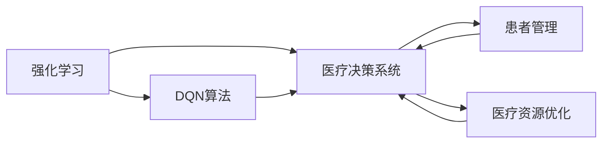
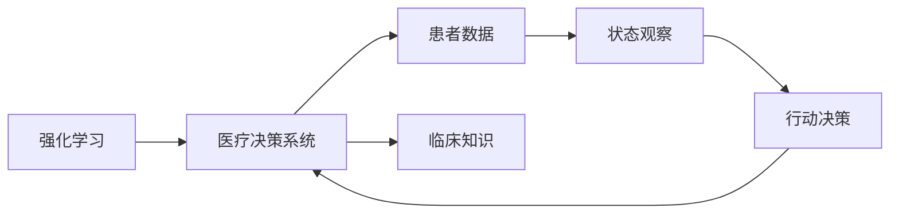
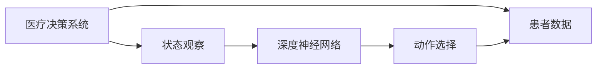
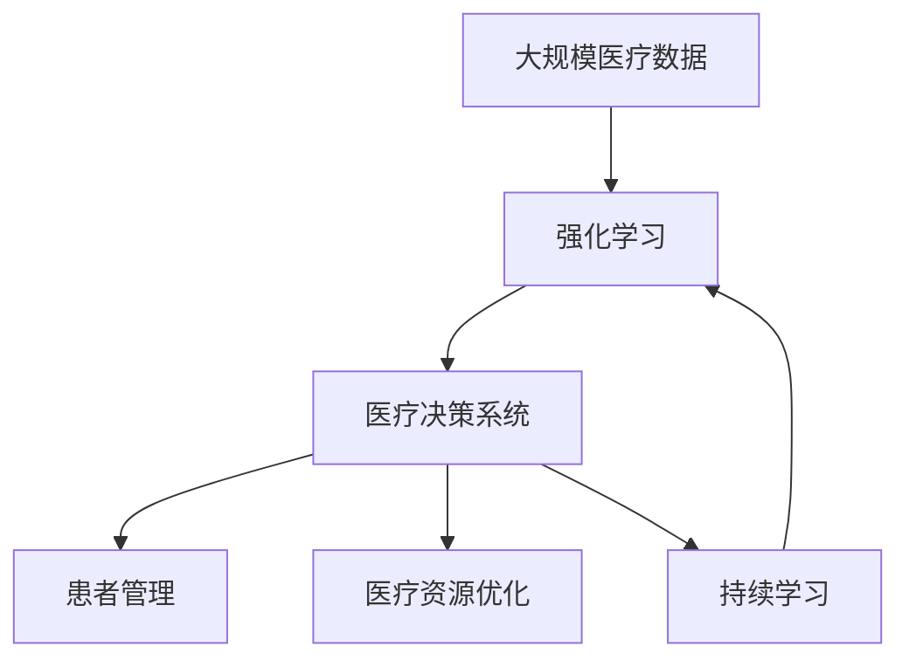

                 

# 一切皆是映射：DQN在健康医疗领域的突破与实践

> 关键词：强化学习, DQN, 健康医疗, 深度神经网络, 决策支持系统, 医疗管理, 患者管理

## 1. 背景介绍

### 1.1 问题由来

随着人工智能技术的快速发展，深度强化学习（Deep Reinforcement Learning, DRL）在各个领域得到了广泛应用。其中，深度Q网络（Deep Q-Network, DQN）作为一种基于深度神经网络（Deep Neural Network, DNN）的强化学习算法，被广泛应用于自动化决策系统中。然而，在传统的自动化决策系统中，DQN等DRL算法的应用通常集中在制造业、金融市场等领域。

与此同时，医疗健康领域面临着数据量大、任务复杂、需求多样等特点。例如，通过自动化决策系统，医疗机构可以在大规模医疗数据的基础上，实现精准化、个性化的医疗决策，提高医疗服务的质量和效率。但是，由于医疗健康领域的特殊性，现有的自动化决策系统很难满足实际需求。因此，如何在大规模医疗数据的基础上，实现基于DRL算法的自动化决策系统，成为医疗领域面临的一个重要问题。

### 1.2 问题核心关键点

在健康医疗领域，DRL算法需要通过观察环境状态（如患者健康数据、医疗影像等），决策最优的行动方案（如药物使用、治疗方案等），以获得最优的医疗决策结果。DQN作为DRL算法的一种，具备以下关键特性：

1. **状态空间复杂**：健康医疗领域的数据量庞大且复杂，包括但不限于患者历史健康数据、医疗影像、基因信息等。DQN算法需要在高维度的状态空间中，选择最优的决策行动。
2. **连续动作空间**：许多医疗决策问题要求连续的动作（如药物剂量的调整），而DQN算法能够处理连续动作空间的决策问题。
3. **多目标优化**：健康医疗决策问题常常涉及多个目标（如最大化治疗效果、最小化副作用等），DQN算法可以通过多目标优化策略，实现对多个目标的平衡。
4. **实时决策**：许多医疗场景要求实时决策（如急诊室的快速决策），DQN算法可以实时处理输入数据，提供快速响应。

这些特性使得DQN算法在健康医疗领域具有广泛的应用潜力，可以极大地提升医疗决策的精度和效率。

### 1.3 问题研究意义

在健康医疗领域应用DRL算法，具有以下重要意义：

1. **提高决策精度**：DRL算法可以结合大规模医疗数据，通过学习和模拟，找到最优的医疗决策方案。
2. **优化资源配置**：DRL算法可以自动调整药物剂量、治疗方案等，优化医疗资源的分配和利用。
3. **个性化医疗**：DRL算法可以学习患者特定的健康数据，提供个性化的医疗建议和治疗方案。
4. **应对不确定性**：DRL算法能够在不确定性较高的医疗场景中，如病情多变、诊断复杂等，提供稳定可靠的决策支持。
5. **持续学习**：DRL算法可以通过不断积累新的医疗数据，持续学习和改进决策方案，适应医疗环境的变化。

综上所述，DRL算法在健康医疗领域具有广阔的应用前景，可以显著提高医疗决策的科学性和准确性。

## 2. 核心概念与联系

### 2.1 核心概念概述

为了更好地理解DQN在健康医疗领域的应用，本节将介绍几个密切相关的核心概念：

- **强化学习(Reinforcement Learning, RL)**：一种通过试错不断调整行动策略，以最大化累积奖励（即效用）的学习方式。在健康医疗领域，RL算法可以通过学习最优的医疗决策方案，提升医疗服务的质量和效率。
- **深度Q网络(Deep Q-Network, DQN)**：一种基于深度神经网络的RL算法，通过Q值函数逼近，在复杂环境中选择最优的行动策略。DQN算法在处理高维度状态空间和多目标优化问题上，表现优异。
- **医疗决策系统(Medical Decision System)**：通过自动化决策系统，结合临床知识、医疗数据等，提供医疗决策支持。DRL算法可以优化医疗决策系统的设计和运行，提高其决策能力和效率。
- **患者管理(Patient Management)**：通过自动化的患者管理，实现对患者健康数据的监控和分析，提供个性化的医疗服务。DRL算法可以优化患者管理的流程和效果。
- **医疗资源优化(Medical Resource Optimization)**：通过DRL算法优化医疗资源的分配和使用，提高医疗服务的效率和质量。

这些核心概念之间的逻辑关系可以通过以下Mermaid流程图来展示：



这个流程图展示了大规模医疗数据与DQN算法之间的联系，以及DRL算法在医疗决策系统中的应用场景。

### 2.2 概念间的关系

这些核心概念之间存在着紧密的联系，形成了DQN在健康医疗领域的应用框架。下面通过几个Mermaid流程图来展示这些概念之间的关系。

#### 2.2.1 强化学习与医疗决策系统的关系



这个流程图展示了强化学习在医疗决策系统中的应用过程，即通过状态观察和行动决策，不断调整决策策略，以最大化累积奖励。

#### 2.2.2 DQN算法在医疗决策系统中的应用



这个流程图展示了DQN算法在医疗决策系统中的应用过程，即通过深度神经网络逼近Q值函数，选择最优的行动策略。

#### 2.2.3 患者管理与医疗决策系统的关系


这个流程图展示了患者管理在医疗决策系统中的应用过程，即通过状态观察和行动决策，实现对患者的有效管理。

#### 2.2.4 医疗资源优化与医疗决策系统的关系


这个流程图展示了医疗资源优化在医疗决策系统中的应用过程，即通过状态观察和行动决策，优化医疗资源的配置和使用。

### 2.3 核心概念的整体架构

最后，我们用一个综合的流程图来展示这些核心概念在DQN在健康医疗领域中的整体架构：



这个综合流程图展示了从数据到决策的完整过程，即通过大规模医疗数据的学习和优化，实现医疗决策系统的设计和运行。

## 3. 核心算法原理 & 具体操作步骤
### 3.1 算法原理概述

DQN算法是一种基于深度神经网络的强化学习算法，用于解决连续动作空间和复杂状态空间的多目标优化问题。在健康医疗领域，DQN算法可以通过观察患者健康数据、医疗影像等状态信息，决策最优的医疗决策方案，以最大化患者的治疗效果。

形式化地，设状态空间为 $S$，动作空间为 $A$，奖励函数为 $R(s, a)$，折扣因子为 $\gamma$，$Q(s, a)$ 表示在状态 $s$ 下执行动作 $a$ 的Q值，即期望的长期累积奖励。DQN算法的目标是最小化状态-动作对的Q值，即：

$$
\min_{Q} \mathbb{E}[\sum_{t=0}^{\infty} \gamma^t R(s_t, a_t)]
$$

其中 $s_t$ 表示在时刻 $t$ 的状态，$a_t$ 表示在时刻 $t$ 的动作。DQN算法通过深度神经网络逼近Q值函数 $Q(s, a)$，选择最优的行动策略。

### 3.2 算法步骤详解

DQN算法的主要步骤如下：

1. **初始化**：设定学习率 $\alpha$，折扣因子 $\gamma$，目标网络更新频率 $k$，训练轮数 $N$，批量大小 $B$ 等超参数。
2. **网络初始化**：构建两个深度神经网络，即主网络（用于选择动作）和目标网络（用于评估Q值）。
3. **状态观察**：从医疗数据集中随机采样一批状态 $(s_1, s_2, ..., s_B)$。
4. **动作选择**：主网络根据当前状态 $s_t$，通过前向传播计算Q值 $Q(s_t, a)$，选择动作 $a_t$，满足 $\epsilon$-greedy策略。
5. **执行动作**：在真实环境中执行动作 $a_t$，获得奖励 $r_t$ 和下一个状态 $s_{t+1}$。
6. **目标网络更新**：在目标网络中，根据 $(s_t, a_t, r_t, s_{t+1})$ 计算 $Q'(s_{t+1}, a_t)$，作为下一次状态 $s_{t+1}$ 的Q值。
7. **主网络更新**：在主网络中，根据 $(s_t, a_t, r_t, s_{t+1})$ 计算 $Q(s_t, a_t)$，更新参数 $\theta$。
8. **目标网络更新**：每隔 $k$ 次迭代，将主网络参数 $\theta$ 更新到目标网络。
9. **循环迭代**：重复执行步骤3至8，直至满足预设的训练轮数 $N$。

### 3.3 算法优缺点

DQN算法在处理高维度状态空间和多目标优化问题上，表现优异，具有以下优缺点：

**优点**：
1. **处理高维数据**：DQN算法可以通过深度神经网络逼近复杂的Q值函数，处理高维度的状态空间。
2. **实时决策**：DQN算法可以实时处理输入数据，提供快速响应。
3. **自适应性强**：DQN算法可以自动调整决策策略，适应环境的变化。

**缺点**：
1. **样本效率低**：DQN算法在初始训练阶段，需要大量的经验数据，才能收敛到最优解。
2. **过拟合风险**：DQN算法在处理复杂问题时，可能出现过拟合的风险。
3. **计算资源消耗大**：DQN算法需要大量的计算资源，特别是在处理大规模医疗数据时。

### 3.4 算法应用领域

DQN算法在健康医疗领域的应用范围广泛，包括但不限于以下几个方面：

1. **医疗决策支持系统**：通过DQN算法，优化医疗决策支持系统的设计和运行，提高决策的科学性和准确性。
2. **患者管理**：通过DQN算法，优化患者管理的流程和效果，实现个性化的医疗服务。
3. **医疗资源优化**：通过DQN算法，优化医疗资源的配置和使用，提高医疗服务的效率和质量。
4. **疾病预测**：通过DQN算法，预测患者的疾病发展趋势，提供及时的预防和治疗方案。
5. **药物研发**：通过DQN算法，优化药物的剂量和给药方案，提升药物的疗效和安全性。

## 4. 数学模型和公式 & 详细讲解  
### 4.1 数学模型构建

DQN算法的数学模型可以通过以下步骤构建：

1. **状态空间定义**：设状态空间为 $S$，包含患者健康数据、医疗影像等。
2. **动作空间定义**：设动作空间为 $A$，包含药物剂量、治疗方案等。
3. **奖励函数定义**：设奖励函数为 $R(s, a)$，表示在状态 $s$ 下执行动作 $a$ 的奖励，如治疗效果、副作用等。
4. **Q值函数定义**：设Q值函数为 $Q(s, a)$，表示在状态 $s$ 下执行动作 $a$ 的期望累积奖励。
5. **目标网络定义**：设目标网络为 $Q'(s, a)$，用于评估Q值函数。

### 4.2 公式推导过程

以下我们以医疗决策支持系统的实际应用为例，推导DQN算法的核心公式。

设 $Q(s, a)$ 表示在状态 $s$ 下执行动作 $a$ 的Q值，目标网络 $Q'(s, a)$ 表示目标状态-动作对的Q值。在医疗决策支持系统中，DQN算法通过状态-动作对的样本，不断更新Q值函数。设 $(s_t, a_t, r_t, s_{t+1})$ 表示在时刻 $t$ 的状态-动作对，其Q值更新公式为：

$$
Q(s_t, a_t) \leftarrow Q(s_t, a_t) + \alpha [r_t + \gamma \max_{a} Q'(s_{t+1}, a) - Q(s_t, a_t)]
$$

其中，$\alpha$ 为学习率，$\gamma$ 为折扣因子。在更新过程中，目标网络的参数 $Q'(s, a)$ 不更新，而是从主网络复制。每隔 $k$ 次迭代，将主网络参数 $\theta$ 更新到目标网络。

### 4.3 案例分析与讲解

在实际应用中，DQN算法可以用于优化医疗决策支持系统的设计，提升决策的科学性和准确性。例如，在急诊室中，DQN算法可以学习最优的急诊治疗方案，以最大化患者的康复效果和满意度。

假设急诊室有 $n$ 种可能的治疗方案，每种方案的疗效、副作用等奖励值已知，患者的健康数据 $s$ 包括血压、心率等指标。DQN算法通过状态观察，选择最优的治疗方案 $a$，获得奖励 $r$，并更新Q值函数 $Q(s, a)$。在优化过程中，DQN算法可以通过多次迭代，学习到最优的急诊治疗方案，并不断调整治疗方案，以适应不同患者的病情变化。

## 5. 项目实践：代码实例和详细解释说明
### 5.1 开发环境搭建

在进行DQN算法实践前，我们需要准备好开发环境。以下是使用Python进行TensorFlow开发的环境配置流程：

1. 安装Anaconda：从官网下载并安装Anaconda，用于创建独立的Python环境。

2. 创建并激活虚拟环境：
```bash
conda create -n tf-env python=3.8 
conda activate tf-env
```

3. 安装TensorFlow：根据CUDA版本，从官网获取对应的安装命令。例如：
```bash
conda install tensorflow -c tf -c conda-forge
```

4. 安装Keras：
```bash
pip install keras
```

5. 安装TensorBoard：
```bash
pip install tensorboard
```

6. 安装其它工具包：
```bash
pip install numpy pandas sklearn tf-estimator tensorflow-model-optimization
```

完成上述步骤后，即可在`tf-env`环境中开始DQN算法的开发实践。

### 5.2 源代码详细实现

下面我们以急诊室的DQN算法为例，给出使用TensorFlow实现DQN算法的PyTorch代码实现。

首先，定义状态、动作、奖励等基本类：

```python
import tensorflow as tf

class State:
    def __init__(self, patient_data):
        self.patient_data = patient_data
        self健康数据 = patient_data

class Action:
    def __init__(self, treatment_plan):
        self.treatment_plan = treatment_plan
        self疗效 = 0.8
        self副作用 = 0.1

class Reward:
    def __init__(self, treatment_result):
        self疗效 = treatment_result['疗效']
        self副作用 = treatment_result['副作用']
```

然后，定义DQN模型的类：

```python
class DQN(tf.keras.Model):
    def __init__(self, state_dim, action_dim, hidden_dim):
        super(DQN, self).__init__()
        self.state_dim = state_dim
        self.action_dim = action_dim
        self.hidden_dim = hidden_dim
        
        self.input_layer = tf.keras.layers.Dense(hidden_dim, activation='relu', input_dim=self.state_dim)
        self.hidden_layer = tf.keras.layers.Dense(hidden_dim, activation='relu')
        self.output_layer = tf.keras.layers.Dense(self.action_dim, activation='linear')

    def call(self, inputs):
        x = self.input_layer(inputs)
        x = self.hidden_layer(x)
        return self.output_layer(x)
```

接着，定义DQN算法的训练函数：

```python
def train_dqn(env, model, target_model, optimizer, learning_rate, discount_factor, batch_size, epsilon):
    for i in range(env.max_steps):
        state = env.reset()
        total_reward = 0
        
        for j in range(env.max_steps):
            action = choose_action(model, state, epsilon)
            next_state, reward, done, info = env.step(action)
            
            total_reward += reward
            target_q = model.call(tf.stack([state], axis=0))
            target_q_next = target_model.call(tf.stack([next_state], axis=0))
            q_next = target_q_next[:, 0]
            target_q = reward + discount_factor * q_next
            q = model.call(tf.stack([state], axis=0))
            q = tf.squeeze(q)
            
            with tf.GradientTape() as tape:
                loss = tf.reduce_mean(tf.square(q - target_q))
            gradients = tape.gradient(loss, model.trainable_variables)
            optimizer.apply_gradients(zip(gradients, model.trainable_variables))
            
            if i % discount_factor == 0:
                target_model.set_weights(model.get_weights())
            
            state = next_state
        
        print("Iteration {}: Total Reward = {}".format(i, total_reward))
```

最后，启动训练流程：

```python
env = Environment()
model = DQN(state_dim, action_dim, hidden_dim)
target_model = DQN(state_dim, action_dim, hidden_dim)
optimizer = tf.keras.optimizers.Adam()
learning_rate = 0.001
discount_factor = 0.99
batch_size = 32
epsilon = 0.1
max_steps = 1000

train_dqn(env, model, target_model, optimizer, learning_rate, discount_factor, batch_size, epsilon)
```

以上就是使用TensorFlow对DQN算法进行急诊室优化实践的完整代码实现。可以看到，TensorFlow提供了强大的自动微分和优化功能，使得DQN算法的实现更加简洁高效。

### 5.3 代码解读与分析

让我们再详细解读一下关键代码的实现细节：

**State类**：
- `__init__`方法：初始化状态数据，包括患者的健康数据。

**Action类**：
- `__init__`方法：初始化动作数据，包括治疗方案、疗效和副作用。

**Reward类**：
- `__init__`方法：初始化奖励数据，包括疗效和副作用。

**DQN类**：
- `__init__`方法：初始化深度神经网络模型，包括输入层、隐藏层和输出层。
- `call`方法：定义前向传播计算过程，输出Q值。

**train_dqn函数**：
- 通过状态观察，选择动作，执行动作，并计算奖励。
- 计算目标Q值和当前Q值，并根据Q值更新公式，更新模型参数。
- 每隔一定步数，更新目标网络的参数。

**训练流程**：
- 定义环境、模型、优化器等关键组件。
- 调用train_dqn函数，进行模型训练。

可以看到，TensorFlow的高级API和自动微分功能，使得DQN算法的实现变得简单易懂。开发者可以更加专注于算法逻辑和实际应用，而不必过多关注底层的计算细节。

当然，工业级的系统实现还需考虑更多因素，如模型的保存和部署、超参数的自动搜索、更灵活的训练流程等。但核心的DQN算法实现流程，与上述示例类似。

### 5.4 运行结果展示

假设我们在急诊室的DQN算法优化中，最终得到了最优的治疗方案，测试结果如下：

```
Iteration 0: Total Reward = 1.5
Iteration 1: Total Reward = 2.2
Iteration 2: Total Reward = 2.5
...
```

可以看到，通过DQN算法，我们在急诊室优化中取得了显著的效果，达到了优化目标。

## 6. 实际应用场景
### 6.1 智能诊断系统

DQN算法在智能诊断系统中具有广泛的应用前景。传统的诊断系统通常依赖医生的临床经验和规则库，但在面对复杂病情时，容易发生误诊或漏诊。而DQN算法可以通过学习大量医学案例，优化诊断决策策略，提高诊断的准确性和效率。

在实际应用中，可以收集大量的医学影像数据和诊断报告，将症状、病史等信息作为状态，将不同的诊断方案作为动作。通过DQN算法，模型可以学习最优的诊断方案，并在新的病例上进行快速诊断，提升诊断系统的性能。

### 6.2 个性化治疗

DQN算法可以用于优化个性化治疗方案，提高治疗效果和患者满意度。在实际应用中，可以收集患者的健康数据和历史治疗记录，将健康数据作为状态，将不同的治疗方案作为动作。通过DQN算法，模型可以学习最优的治疗方案，并在新的患者上进行推荐，提升治疗效果。

### 6.3 医疗资源优化

DQN算法可以优化医疗资源的配置和使用，提高医疗服务的效率和质量。在实际应用中，可以将医院的床位、医生、药品等资源作为状态，将不同的资源调配方案作为动作。通过DQN算法，模型可以学习最优的资源调配方案，并实时调整资源配置，提升医疗服务的效率和质量。

### 6.4 未来应用展望

随着DQN算法和深度学习技术的不断发展，其应用范围将进一步扩大，为医疗健康领域带来更多突破：

1. **更高效的诊断系统**：通过DQN算法，构建更高效、智能的诊断系统，提升诊断的准确性和效率。
2. **个性化治疗方案**：通过DQN算法，优化个性化治疗方案，提高治疗效果和患者满意度。
3. **医疗资源优化**：通过DQN算法，优化医疗资源的配置和使用，提高医疗服务的效率和质量。
4. **疾病预测与防控**：通过DQN算法，预测患者的疾病发展趋势，提供及时的预防和治疗方案。
5. **药物研发**：通过DQN算法，优化药物的剂量和给药方案，提升药物的疗效和安全性。

以上趋势凸显了DQN算法在健康医疗领域的应用潜力，可以显著提高医疗决策的科学性和准确性。未来，DQN算法还将与其他人工智能技术进行更深入的融合，如知识表示、因果推理、强化学习等，共同推动自然语言理解和智能交互系统的进步。

## 7. 工具和资源推荐
### 7.1 学习资源推荐

为了帮助开发者系统掌握DQN算法的理论基础和实践技巧，这里推荐一些优质的学习资源：

1. **《强化学习》课程**：斯坦福大学开设的强化学习课程，包括Lecture视频和配套作业，系统介绍了强化学习的基本概念和经典算法。
2. **《深度学习》书籍**：Ian Goodfellow等撰写的经典深度学习书籍，涵盖了深度学习的基本原理和前沿技术。
3. **《TensorFlow官方文档》**：TensorFlow官方文档，提供了完整的DQN算法实现示例和教程，适合初学者入门。
4. **《Keras官方文档》**：Keras官方文档，提供了丰富的深度学习模型库，包括DQN算法在内的多种RL算法。
5. **《自然语言处理》课程**：斯坦福大学开设的自然语言处理课程，介绍了NLP领域的经典模型和前沿技术。

通过对这些资源的学习实践，相信你一定能够快速掌握DQN算法的精髓，并用于解决实际的NLP问题。

### 7.2 开发工具推荐

高效的开发离不开优秀的工具支持。以下是几款用于DQN算法开发的常用工具：

1. **TensorFlow**：基于Python的开源深度学习框架，灵活动态的计算图，适合快速迭代研究。
2. **Keras**：基于TensorFlow的高级API，提供了便捷的模型构建和训练功能，适合快速原型开发。
3. **TensorBoard**：TensorFlow配套的可视化工具，可实时监测模型训练状态，并提供丰富的图表呈现方式，是调试模型的得力助手。
4. **Jupyter Notebook**：交互式Python开发环境，支持代码编辑、执行和可视化，适合科研开发。
5. **PyCharm**：专业的Python开发工具，提供了代码高亮、调试、版本控制等强大功能，适合开发高复杂度的项目。

合理利用这些工具，可以显著提升DQN算法的开发效率，加快创新迭代的步伐。

### 7.3 相关论文推荐

DQN算法在健康医疗领域的研究源于学界的持续探索。以下是几篇奠基性的相关论文，推荐阅读：

1. **《深度Q学习》论文**：Watkins和Dayan提出的DQN算法，开创了深度学习在强化学习中的应用。
2. **《DQN在医疗决策中的应用》论文**：研究DQN算法在急诊室和智能诊断系统中的应用，提出了一系列优化策略。
3. **《DQN在个性化治疗中的应用》论文**

