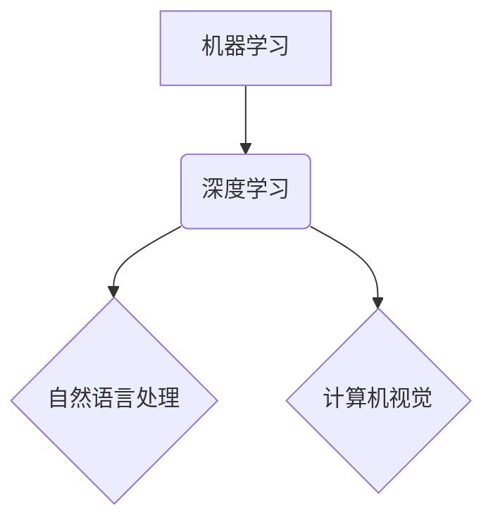

## AI技术趋势与场景应用

> 关键词：人工智能、深度学习、自然语言处理、计算机视觉、机器学习、强化学习、场景应用

## 1. 背景介绍

人工智能（AI）正以惊人的速度发展，从学术研究走向现实生活，深刻地改变着我们世界。近年来，深度学习的突破性进展推动了 AI 技术的飞速发展，使其在图像识别、语音识别、自然语言处理等领域取得了令人瞩目的成就。

随着 AI 技术的不断成熟，其应用场景也日益广泛，涵盖医疗、金融、教育、交通、娱乐等各个领域。AI 正在帮助我们解决复杂问题，提高效率，创造新的价值。

## 2. 核心概念与联系

**2.1 核心概念**

* **机器学习 (Machine Learning)**：让计算机从数据中学习，无需明确编程，自动发现模式和规律。
* **深度学习 (Deep Learning)**：一种机器学习的子集，利用多层神经网络模拟人类大脑的学习过程，能够处理更复杂的数据，例如图像、文本和音频。
* **自然语言处理 (Natural Language Processing)**：使计算机能够理解、生成和处理人类语言。
* **计算机视觉 (Computer Vision)**：使计算机能够“看”图像和视频，并从中提取信息。

**2.2 架构关系**



**2.3 联系**

机器学习是 AI 的基础，深度学习是机器学习的一种高级形式。自然语言处理和计算机视觉是深度学习的重要应用领域。

## 3. 核心算法原理 & 具体操作步骤

**3.1 算法原理概述**

深度学习的核心算法是**多层感知机 (Multi-Layer Perceptron, MLP)**。MLP 由多个神经网络层组成，每层包含多个神经元。每个神经元接收来自上一层的输入，对其进行处理，并输出到下一层。通过调整神经元的权重和偏差，模型可以学习数据中的模式和规律。

**3.2 算法步骤详解**

1. **数据预处理**: 将原始数据转换为模型可以理解的格式，例如归一化、编码等。
2. **网络结构设计**: 根据任务需求设计神经网络的层数、神经元数量等结构参数。
3. **参数初始化**: 为神经网络中的权重和偏差赋予初始值。
4. **前向传播**: 将输入数据通过网络层层传递，最终得到输出结果。
5. **损失函数计算**: 计算模型输出与真实值的差异，即损失值。
6. **反向传播**: 根据损失值，调整神经网络的权重和偏差，使模型输出更接近真实值。
7. **优化算法**: 使用优化算法，例如梯度下降，更新权重和偏差。
8. **模型训练**: 重复前向传播、损失函数计算和反向传播步骤，直到模型达到预设的性能指标。
9. **模型评估**: 使用测试数据评估模型的性能，例如准确率、召回率等。

**3.3 算法优缺点**

**优点**:

* 能够处理复杂数据，学习复杂模式。
* 自动特征提取，无需人工特征工程。
* 性能优异，在许多任务上取得了突破性进展。

**缺点**:

* 需要大量数据进行训练。
* 训练过程耗时和耗能。
* 模型解释性差，难以理解模型的决策过程。

**3.4 算法应用领域**

* **图像识别**: 人脸识别、物体检测、图像分类等。
* **语音识别**: 语音转文本、语音助手等。
* **自然语言处理**: 机器翻译、文本摘要、情感分析等。
* **推荐系统**: 商品推荐、内容推荐等。
* **医疗诊断**: 病情预测、疾病诊断等。

## 4. 数学模型和公式 & 详细讲解 & 举例说明

**4.1 数学模型构建**

深度学习模型可以看作是一个复杂的函数映射，将输入数据映射到输出结果。

假设输入数据为 x，输出结果为 y，则模型可以表示为：

$$y = f(x, W)$$

其中，f 是激活函数，W 是模型的参数，包括权重和偏差。

**4.2 公式推导过程**

深度学习模型的训练过程本质上是参数 W 的优化过程。

常用的优化算法是梯度下降法，其目标是找到使损失函数最小化的参数 W。

梯度下降法的更新公式为：

$$W = W - \eta \nabla L(W)$$

其中，η 是学习率，∇L(W) 是损失函数 L(W) 对参数 W 的梯度。

**4.3 案例分析与讲解**

以图像分类为例，假设模型输入一张图像，输出类别概率分布。

损失函数可以选用交叉熵损失函数，其目标是使模型输出的类别概率分布与真实类别分布尽可能接近。

交叉熵损失函数公式为：

$$L(W) = -\sum_{i=1}^{C} y_i \log(p_i)$$

其中，C 是类别数量，y_i 是真实类别 i 的 one-hot 编码，p_i 是模型输出的类别 i 的概率。

通过梯度下降法，不断更新模型参数 W，使损失函数最小化，从而提高模型的图像分类准确率。

## 5. 项目实践：代码实例和详细解释说明

**5.1 开发环境搭建**

使用 Python 语言和 TensorFlow 或 PyTorch 深度学习框架进行开发。

**5.2 源代码详细实现**

```python
import tensorflow as tf

# 定义模型结构
model = tf.keras.models.Sequential([
    tf.keras.layers.Conv2D(32, (3, 3), activation='relu', input_shape=(28, 28, 1)),
    tf.keras.layers.MaxPooling2D((2, 2)),
    tf.keras.layers.Conv2D(64, (3, 3), activation='relu'),
    tf.keras.layers.MaxPooling2D((2, 2)),
    tf.keras.layers.Flatten(),
    tf.keras.layers.Dense(10, activation='softmax')
])

# 编译模型
model.compile(optimizer='adam',
              loss='sparse_categorical_crossentropy',
              metrics=['accuracy'])

# 加载 MNIST 数据集
(x_train, y_train), (x_test, y_test) = tf.keras.datasets.mnist.load_data()

# 数据预处理
x_train = x_train.astype('float32') / 255.0
x_test = x_test.astype('float32') / 255.0
x_train = x_train.reshape((x_train.shape[0], 28, 28, 1))
x_test = x_test.reshape((x_test.shape[0], 28, 28, 1))

# 模型训练
model.fit(x_train, y_train, epochs=5)

# 模型评估
loss, accuracy = model.evaluate(x_test, y_test)
print('Test loss:', loss)
print('Test accuracy:', accuracy)
```

**5.3 代码解读与分析**

代码首先定义了一个简单的卷积神经网络模型，然后使用 Adam 优化器和交叉熵损失函数进行训练。

MNIST 数据集是一个手写数字识别数据集，包含 60,000 张训练图像和 10,000 张测试图像。

代码将数据预处理为模型可以理解的格式，并使用 `model.fit()` 函数进行训练。

训练完成后，使用 `model.evaluate()` 函数评估模型的性能。

**5.4 运行结果展示**

训练完成后，模型的准确率通常可以达到 98% 以上。

## 6. 实际应用场景

**6.1 医疗诊断**

* **疾病预测**: 利用患者的医疗历史、基因信息等数据，预测患病风险。
* **疾病诊断**: 分析患者的影像数据，例如 X 光片、CT 扫描等，辅助医生诊断疾病。

**6.2 金融服务**

* **欺诈检测**: 分析交易数据，识别异常交易行为，防止金融欺诈。
* **风险评估**: 评估客户的信用风险，为贷款和保险等服务提供参考。

**6.3 教育培训**

* **个性化学习**: 根据学生的学习进度和能力，提供个性化的学习内容和辅导。
* **智能批改**: 利用 AI 技术自动批改学生的作业，提高效率。

**6.4 交通运输**

* **自动驾驶**: 利用计算机视觉和传感器数据，实现车辆自动驾驶。
* **交通流量预测**: 分析交通数据，预测交通流量变化，优化交通管理。

**6.5 娱乐休闲**

* **游戏 AI**: 开发更智能的游戏对手，提升游戏体验。
* **内容推荐**: 根据用户的兴趣爱好，推荐个性化的电影、音乐、书籍等内容。

**6.6 未来应用展望**

AI 技术的应用场景还在不断扩展，未来将应用于更多领域，例如：

* **科学研究**: 加速科学发现，解决复杂科学问题。
* **社会治理**: 提高社会管理效率，促进社会公平正义。
* **人机交互**: 创建更自然、更智能的人机交互方式。

## 7. 工具和资源推荐

**7.1 学习资源推荐**

* **在线课程**: Coursera、edX、Udacity 等平台提供丰富的 AI 和深度学习课程。
* **书籍**: 《深度学习》、《机器学习实战》等书籍是学习 AI 的经典教材。
* **博客**: TensorFlow、PyTorch 等框架官方博客提供最新的技术文档和应用案例。

**7.2 开发工具推荐**

* **TensorFlow**: Google 开发的开源深度学习框架，功能强大，应用广泛。
* **PyTorch**: Facebook 开发的开源深度学习框架，灵活易用，适合研究和开发。
* **Keras**: TensorFlow 的高层 API，简化模型构建和训练过程。

**7.3 相关论文推荐**

* **《ImageNet Classification with Deep Convolutional Neural Networks》**: 
AlexNet 模型的论文，标志着深度学习在图像识别领域的突破。
* **《Attention Is All You Need》**: 
Transformer 模型的论文，推动了自然语言处理领域的进展。

## 8. 总结：未来发展趋势与挑战

**8.1 研究成果总结**

近年来，AI 技术取得了令人瞩目的进展，在图像识别、语音识别、自然语言处理等领域取得了突破性成果。

**8.2 未来发展趋势**

* **模型规模和能力的提升**: 模型参数规模不断扩大，模型能力不断增强。
* **模型解释性和可解释性的提高**: 研究更易于理解和解释的 AI 模型。
* **边缘计算和部署**: 将 AI 模型部署到边缘设备，实现更低延迟和更高效率的应用。
* **跨模态学习**: 融合不同模态数据，例如文本、图像、音频等，实现更全面的理解和应用。

**8.3 面临的挑战**

* **数据获取和隐私保护**: AI 模型需要大量数据进行训练，如何获取高质量数据并保护用户隐私是一个重要挑战。
* **算法公平性和可信任性**: 确保 AI 模型的决策公平、公正、可信任，避免算法偏见和歧视。
* **伦理和社会影响**: AI 技术的快速发展带来伦理和社会问题，需要认真思考和应对。

**8.4 研究展望**

未来，AI 研究将继续朝着更智能、更安全、更可解释的方向发展，为人类社会带来更多福祉。


## 9. 附录：常见问题与解答

**9.1 如何选择合适的深度学习框架？**

选择深度学习框架需要根据具体项目需求和个人偏好。

TensorFlow 更适合大型项目和工业应用，PyTorch 更适合研究和开发。

**9.2 如何获取高质量的训练数据？**

可以从公开数据集、Web 爬虫、传感器数据等渠道获取数据。

需要注意数据质量和标注准确性。

**9.3 如何评估深度学习模型的性能？**