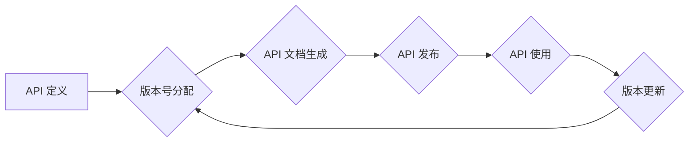
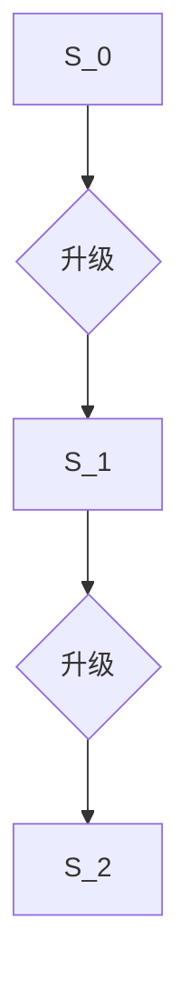

## 1. 背景介绍

在现代软件开发中，API（Application Programming Interface，应用程序接口）扮演着至关重要的角色。它们是不同软件系统之间进行通信和数据交换的桥梁，推动着软件生态系统的协同发展。随着软件系统越来越复杂，API 的数量和使用场景也随之增加，API 版本控制的重要性日益凸显。

API 版本控制是指对 API 的版本进行管理和维护的过程，它涉及到 API 的定义、文档、发布、更新和弃用等各个环节。良好的 API 版本控制策略可以帮助开发团队更好地管理 API 的生命周期，降低 API 升级带来的风险，提高软件系统的稳定性和可维护性。

## 2. 核心概念与联系

### 2.1 API 版本的概念

API 版本是指 API 的一个特定标识符，它代表着 API 的功能、接口和数据结构的特定状态。不同的 API 版本可能存在功能上的差异，例如新增功能、修改参数类型或删除旧功能。

### 2.2 版本控制的必要性

API 版本控制对于软件系统来说至关重要，因为它可以解决以下问题：

* **兼容性问题:** 不同版本的 API 可能存在不兼容性，导致调用方无法正常使用新版本 API。
* **维护成本:**  没有版本控制的 API 难以维护和更新，因为无法追踪 API 的历史变化和依赖关系。
* **风险控制:**  API 版本控制可以帮助开发团队更好地管理 API 的升级过程，降低升级带来的风险。

### 2.3 版本控制策略

常见的 API 版本控制策略包括：

* **版本号:** 使用数字或字母组合来标识 API 的版本，例如 v1.0、v2.0 等。
* **URL 路径:** 使用不同的 URL 路径来区分不同的 API 版本，例如 `/api/v1/users` 和 `/api/v2/users`。
* **API 网关:** 使用 API 网关来管理和路由 API 的请求，根据请求的版本号转发到相应的 API 版本。

**Mermaid 流程图**



## 3. 核心算法原理 & 具体操作步骤

### 3.1 算法原理概述

API 版本控制的核心算法原理是版本管理，它涉及到版本标识、版本历史记录、版本比较和版本切换等操作。

### 3.2 算法步骤详解

1. **版本标识:** 为每个 API 版本分配一个唯一的标识符，例如版本号、URL 路径或其他标识符。
2. **版本历史记录:** 记录每个 API 版本的变更历史，包括变更时间、变更内容和变更原因等信息。
3. **版本比较:** 提供机制比较不同版本的 API，例如功能差异、参数变化和数据结构变更等。
4. **版本切换:**  允许调用方根据需要切换到不同的 API 版本，例如使用旧版本 API 或升级到新版本 API。

### 3.3 算法优缺点

**优点:**

* **提高 API 的稳定性和可维护性:** 版本控制可以帮助开发团队更好地管理 API 的生命周期，降低 API 升级带来的风险。
* **增强 API 的兼容性:** 版本控制可以确保不同版本的 API 互不干扰，避免兼容性问题。
* **方便 API 的调试和测试:** 版本控制可以方便开发团队回滚到之前的版本，方便调试和测试。

**缺点:**

* **增加 API 的复杂度:** 版本控制需要额外的机制和流程，增加 API 的复杂度。
* **增加 API 的维护成本:** 版本控制需要维护版本历史记录和版本比较机制，增加 API 的维护成本。

### 3.4 算法应用领域

API 版本控制广泛应用于各种软件开发领域，例如：

* **Web 应用:**  Web 应用通常使用 API 来提供数据和功能，版本控制可以确保不同版本的 Web 应用能够正常使用 API。
* **移动应用:** 移动应用也经常使用 API 来访问网络资源和第三方服务，版本控制可以帮助移动应用开发者管理 API 的更新和兼容性。
* **云计算:** 云计算平台通常提供丰富的 API 接口，版本控制可以帮助用户管理和使用这些 API。

## 4. 数学模型和公式 & 详细讲解 & 举例说明

### 4.1 数学模型构建

API 版本控制可以抽象为一个版本管理模型，其中每个 API 版本可以看作是一个状态，状态之间的转换遵循一定的规则。

**状态:**

* $S_i$: 表示 API 的第 i 个版本

**转换规则:**

* $S_i \rightarrow S_{i+1}$: 表示 API 从版本 $S_i$ 升级到版本 $S_{i+1}$

**状态转移图:**



### 4.2 公式推导过程

假设 API 的版本号遵循递增的规则，则版本号的转换公式可以表示为:

$$v_{new} = v_{old} + 1$$

其中:

* $v_{new}$: 新版本号
* $v_{old}$: 旧版本号

### 4.3 案例分析与讲解

例如，API 的初始版本号为 v1.0，升级到 v2.0 时，可以使用公式计算出新版本号:

$$v_{new} = 1.0 + 1 = 2.0$$

## 5. 项目实践：代码实例和详细解释说明

### 5.1 开发环境搭建

* 语言: Python
* 框架: Flask
* 版本控制工具: Git

### 5.2 源代码详细实现

```python
from flask import Flask, jsonify

app = Flask(__name__)

# API 版本信息
api_version = "v1.0"

@app.route('/api/users', methods=['GET'])
def get_users():
    users = [
        {'id': 1, 'name': 'John Doe'},
        {'id': 2, 'name': 'Jane Doe'}
    ]
    return jsonify({'api_version': api_version, 'users': users})

if __name__ == '__main__':
    app.run(debug=True)
```

### 5.3 代码解读与分析

*  代码使用 Flask 框架构建了一个简单的 API。
*  `api_version` 变量存储了 API 的版本信息。
*  `/api/users` 路径的 GET 请求返回一个 JSON 数据，包含 API 版本和用户列表。

### 5.4 运行结果展示

运行代码后，访问 `http://127.0.0.1:5000/api/users`，可以获取以下 JSON 数据:

```json
{
  "api_version": "v1.0",
  "users": [
    {
      "id": 1,
      "name": "John Doe"
    },
    {
      "id": 2,
      "name": "Jane Doe"
    }
  ]
}
```

## 6. 实际应用场景

### 6.1  电商平台

电商平台使用 API 来提供商品信息、订单管理、支付处理等功能。版本控制可以帮助电商平台管理 API 的更新和兼容性，确保不同版本的电商平台和第三方应用能够正常使用 API。

### 6.2  社交媒体平台

社交媒体平台使用 API 来提供用户数据、消息推送、分享功能等。版本控制可以帮助社交媒体平台管理 API 的更新和兼容性，确保不同版本的社交媒体平台和第三方应用能够正常使用 API。

### 6.3  金融服务平台

金融服务平台使用 API 来提供账户查询、转账、支付等功能。版本控制可以帮助金融服务平台管理 API 的更新和兼容性，确保不同版本的金融服务平台和第三方应用能够正常使用 API。

### 6.4  未来应用展望

随着微服务架构和云计算的普及，API 的重要性将进一步提升。API 版本控制将成为软件开发中不可或缺的一部分，并会随着技术的发展不断演进。

## 7. 工具和资源推荐

### 7.1 学习资源推荐

* **RESTful API 设计指南:** https://restfulapi.net/
* **API 版本控制最佳实践:** https://www.digitalocean.com/community/tutorials/how-to-version-your-api

### 7.2 开发工具推荐

* **Swagger:** https://swagger.io/
* **Postman:** https://www.postman.com/

### 7.3 相关论文推荐

* **API Versioning: A Survey:** https://dl.acm.org/doi/10.1145/3442188.3445908

## 8. 总结：未来发展趋势与挑战

### 8.1 研究成果总结

API 版本控制已经成为软件开发中重要的实践，它可以帮助开发团队更好地管理 API 的生命周期，降低 API 升级带来的风险，提高软件系统的稳定性和可维护性。

### 8.2 未来发展趋势

* **自动化版本控制:**  利用机器学习和人工智能技术，自动生成 API 文档、版本号和更新策略。
* **API 版本管理平台:**  提供统一的平台来管理和监控 API 的版本信息、使用情况和兼容性。
* **API 版本兼容性测试:**  开发自动化测试工具，帮助开发团队验证不同版本的 API 的兼容性。

### 8.3 面临的挑战

* **API 版本管理的复杂性:**  随着 API 的数量和复杂度增加，API 版本管理的复杂性也会随之增加。
* **API 版本兼容性的挑战:**  不同版本的 API 可能存在不兼容性，需要开发有效的兼容性解决方案。
* **API 版本控制的标准化:**  目前 API 版本控制缺乏统一的标准，需要行业共同努力，制定标准规范。

### 8.4 研究展望

未来，API 版本控制的研究将继续深入，探索更自动化、更智能、更安全的 API 版本管理解决方案。


## 9. 附录：常见问题与解答

### 9.1 如何选择合适的 API 版本控制策略？

选择合适的 API 版本控制策略需要根据实际情况进行评估，考虑以下因素:

* **API 的复杂度:**  API 越复杂，版本控制策略越需要完善。
* **API 的使用场景:**  不同的 API 使用场景可能需要不同的版本控制策略。
* **开发团队的规模和经验:**  开发团队的规模和经验也会影响 API 版本控制策略的选择。

### 9.2 如何管理 API 的版本历史记录？

可以使用版本控制工具，例如 Git，来管理 API 的版本历史记录。版本控制工具可以记录每个 API 版本的变更历史，方便开发团队追踪和回滚版本。

### 9.3 如何进行 API 版本兼容性测试？

可以使用自动化测试工具，例如 Postman，来进行 API 版本兼容性测试。自动化测试工具可以模拟不同版本的 API 调用，验证不同版本的 API 的兼容性。


作者：禅与计算机程序设计艺术 / Zen and the Art of Computer Programming 
