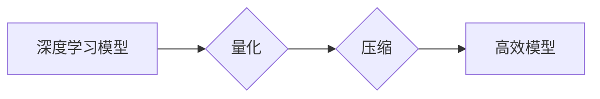

## Python深度学习实践：神经网络的量化和压缩

> 关键词：深度学习、量化、压缩、神经网络、模型优化、效率提升、资源约束

## 1. 背景介绍

深度学习在过去几年取得了令人瞩目的成就，在图像识别、自然语言处理、语音识别等领域取得了突破性的进展。然而，深度学习模型通常具有庞大的参数量和复杂的计算结构，这导致其部署在资源受限的设备上，例如移动设备和嵌入式系统，面临着巨大的挑战。为了解决这个问题，神经网络的量化和压缩技术应运而生。

量化和压缩技术旨在通过降低模型的精度和参数量来减小模型的大小和计算复杂度，从而提高模型的效率和部署的灵活性。量化技术将模型参数和激活值从高精度浮点数（例如32位浮点数）转换为低精度整数（例如8位整数），从而显著减少内存占用和计算量。压缩技术则通过移除冗余的模型参数和连接，或者通过更有效的模型结构设计来减少模型大小。

## 2. 核心概念与联系

量化和压缩技术是深度学习模型优化和部署的重要手段，它们相互关联，共同作用于提高模型的效率和性能。

**Mermaid 流程图:**



**核心概念:**

* **量化:** 将模型参数和激活值从高精度浮点数转换为低精度整数，例如8位整数。
* **压缩:** 通过移除冗余的模型参数和连接，或者通过更有效的模型结构设计来减少模型大小。
* **模型效率:** 指模型的计算速度、内存占用和部署成本等方面的表现。
* **模型精度:** 指模型在测试数据集上的准确率。

**联系:**

量化和压缩技术可以协同工作，以实现更显著的模型优化效果。例如，在量化模型之前进行压缩，可以减少量化带来的精度损失。

## 3. 核心算法原理 & 具体操作步骤

### 3.1  算法原理概述

量化和压缩算法的目标是找到一种平衡精度和效率的方法。

**量化算法:**

* **均匀量化:** 将浮点数范围均匀地映射到整数范围。
* **非均匀量化:** 根据数据分布，使用不同的量化步长来映射浮点数到整数范围。

**压缩算法:**

* **权重剪枝:** 移除模型权重中较小的值。
* **通道裁剪:** 移除模型中不重要的通道。
* **模型蒸馏:** 使用一个较小的模型来模仿一个较大的模型的输出。

### 3.2  算法步骤详解

**量化算法步骤:**

1. **数据预处理:** 对模型输入数据进行预处理，例如归一化。
2. **量化范围确定:** 根据模型参数和激活值的分布，确定量化范围。
3. **量化转换:** 将模型参数和激活值从浮点数转换为整数。
4. **模型微调:** 对量化后的模型进行微调，以恢复精度损失。

**压缩算法步骤:**

1. **模型分析:** 分析模型结构和参数，识别冗余部分。
2. **压缩策略选择:** 根据模型特点和目标精度，选择合适的压缩策略。
3. **参数移除或修改:** 移除或修改冗余的参数，例如权重剪枝或通道裁剪。
4. **模型微调:** 对压缩后的模型进行微调，以恢复精度损失。

### 3.3  算法优缺点

**量化算法:**

* **优点:** 显著减少模型大小和计算量，提高部署效率。
* **缺点:** 可能导致精度损失，需要进行微调以恢复精度。

**压缩算法:**

* **优点:** 可以进一步减少模型大小，提高压缩率。
* **缺点:** 可能导致更大的精度损失，需要更复杂的微调策略。

### 3.4  算法应用领域

量化和压缩技术广泛应用于深度学习模型的部署，例如：

* **移动设备:** 将深度学习模型部署在移动设备上，例如智能手机和平板电脑。
* **嵌入式系统:** 将深度学习模型部署在资源受限的嵌入式系统上，例如无人机和智能家居设备。
* **边缘计算:** 将深度学习模型部署在边缘设备上，例如传感器和网络设备，以实现实时推理。

## 4. 数学模型和公式 & 详细讲解 & 举例说明

### 4.1  数学模型构建

量化和压缩算法通常基于数学模型来实现。例如，量化算法可以使用以下数学模型来将浮点数转换为整数：

$$
q(x) = \text{round}(x \cdot \text{scale})
$$

其中，$x$ 是浮点数，$\text{scale}$ 是量化步长。

### 4.2  公式推导过程

量化算法的精度损失可以通过以下公式来分析：

$$
\text{Error} = |x - q(x)|
$$

其中，$x$ 是浮点数，$q(x)$ 是量化后的整数。

### 4.3  案例分析与讲解

假设我们使用8位整数来量化一个浮点数范围为0到1的激活值。

* 量化步长为0.00390625 (2^-8)。
* 误差最大值为0.001953125 (1/2 * 量化步长)。

这种量化方式可以显著减少内存占用和计算量，但也会导致一定的精度损失。

## 5. 项目实践：代码实例和详细解释说明

### 5.1  开发环境搭建

* Python 3.6+
* TensorFlow 2.0+
* PyTorch 1.0+

### 5.2  源代码详细实现

```python
import tensorflow as tf

# 定义一个简单的卷积神经网络模型
model = tf.keras.models.Sequential([
    tf.keras.layers.Conv2D(32, (3, 3), activation='relu', input_shape=(28, 28, 1)),
    tf.keras.layers.MaxPooling2D((2, 2)),
    tf.keras.layers.Flatten(),
    tf.keras.layers.Dense(10, activation='softmax')
])

# 编译模型
model.compile(optimizer='adam',
              loss='sparse_categorical_crossentropy',
              metrics=['accuracy'])

# 加载 MNIST 数据集
(x_train, y_train), (x_test, y_test) = tf.keras.datasets.mnist.load_data()

# 训练模型
model.fit(x_train, y_train, epochs=5)

# 量化模型
converter = tf.lite.TFLiteConverter.from_keras_model(model)
tflite_model = converter.convert()

# 保存量化模型
with open('quantized_model.tflite', 'wb') as f:
    f.write(tflite_model)
```

### 5.3  代码解读与分析

* 代码首先定义了一个简单的卷积神经网络模型。
* 然后，模型被编译并使用 MNIST 数据集进行训练。
* 训练完成后，使用 TensorFlow Lite 的 `TFLiteConverter` 将模型量化为 TFLite 格式。
* 最后，量化后的模型被保存为 `quantized_model.tflite` 文件。

### 5.4  运行结果展示

量化后的模型可以部署在资源受限的设备上，例如移动设备和嵌入式系统。

## 6. 实际应用场景

量化和压缩技术在深度学习的实际应用场景中发挥着重要作用。

### 6.1  移动设备应用

* **图像识别:** 将深度学习模型部署在智能手机上，实现实时图像识别功能，例如识别物体、场景和人脸。
* **语音识别:** 将深度学习模型部署在智能音箱上，实现语音识别和自然语言理解功能。
* **增强现实 (AR):** 将深度学习模型部署在 AR 设备上，实现实时物体识别和场景理解功能。

### 6.2  嵌入式系统应用

* **无人机:** 将深度学习模型部署在无人机上，实现目标跟踪、避障和路径规划功能。
* **智能家居设备:** 将深度学习模型部署在智能家居设备上，实现人脸识别、语音控制和环境感知功能。
* **工业自动化:** 将深度学习模型部署在工业设备上，实现缺陷检测、质量控制和生产优化功能。

### 6.3  边缘计算应用

* **传感器数据分析:** 将深度学习模型部署在传感器设备上，实现实时数据分析和决策支持。
* **网络安全:** 将深度学习模型部署在网络设备上，实现网络流量分析、入侵检测和恶意软件识别功能。
* **医疗诊断:** 将深度学习模型部署在边缘设备上，实现医疗图像分析、疾病诊断和个性化治疗方案推荐功能。

### 6.4  未来应用展望

随着深度学习技术的不断发展，量化和压缩技术将发挥越来越重要的作用。未来，我们可能会看到以下应用场景:

* **更小、更快的模型:** 量化和压缩技术将使深度学习模型更加轻量化，能够部署在更小的设备上，例如可穿戴设备和物联网设备。
* **更低功耗的模型:** 量化和压缩技术可以显著降低模型的计算复杂度，从而降低设备的功耗。
* **更广泛的应用场景:** 量化和压缩技术将使深度学习技术能够应用于更多领域，例如医疗、教育、金融和交通运输。

## 7. 工具和资源推荐

### 7.1  学习资源推荐

* **TensorFlow Lite:** https://www.tensorflow.org/lite
* **PyTorch Mobile:** https://pytorch.org/mobile/
* **ONNX Runtime:** https://onnxruntime.ai/

### 7.2  开发工具推荐

* **TensorFlow:** https://www.tensorflow.org/
* **PyTorch:** https://pytorch.org/
* **Keras:** https://keras.io/

### 7.3  相关论文推荐

* **Quantized Neural Networks: Training Neural Networks with Low Precision Weights and Activations**
* **Deep Compression: Compressing Deep Neural Networks with Pruning, Trained Quantization and Huffman Coding**
* **MobileNetV2: Inverted Residuals and Linear Bottlenecks**

## 8. 总结：未来发展趋势与挑战

### 8.1  研究成果总结

量化和压缩技术取得了显著的进展，能够有效地降低深度学习模型的大小和计算复杂度，提高其部署效率。

### 8.2  未来发展趋势

* **更先进的量化算法:** 研究更精确、更有效的量化算法，例如混合精度量化和神经架构搜索量化。
* **更有效的压缩方法:** 开发更先进的压缩方法，例如知识蒸馏和模型剪枝。
* **硬件加速:** 利用专用硬件加速量化和压缩操作，提高模型推理速度。

### 8.3  面临的挑战

* **精度损失:** 量化和压缩技术可能会导致精度损失，需要找到一种平衡精度和效率的方法。
* **模型复杂性:** 复杂模型的量化和压缩更加困难，需要更复杂的算法和技术。
* **硬件支持:** 一些量化和压缩技术需要特定的硬件支持，这可能会限制其应用范围。

### 8.4  研究展望

未来，量化和压缩技术将继续发展，并与其他深度学习技术相结合，例如联邦学习和自监督学习，以实现更智能、更高效的深度学习应用。

## 9. 附录：常见问题与解答

**Q1: 量化和压缩技术会对模型的性能产生什么影响？**

**A1:** 量化和压缩技术可能会导致模型的精度损失，但可以通过模型微调来恢复部分精度。

**Q2: 量化和压缩技术有哪些不同的方法？**

**A2:** 量化技术包括均匀量化和非均匀量化。压缩技术包括权重剪枝、通道裁剪和模型蒸馏等。

**