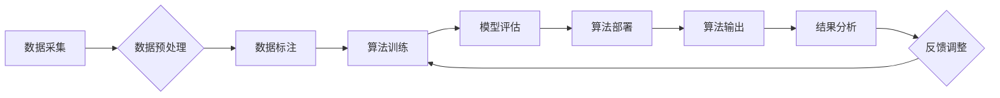

## 你必须学会面对自己的阴影，否则你会继续在别人身上看到阴影

> 关键词：阴影、认知偏差、偏见、算法、公平性、数据驱动、道德责任

## 1. 背景介绍

在当今数据驱动的世界，人工智能（AI）正在以惊人的速度发展，渗透到我们生活的方方面面。从医疗诊断到金融交易，从自动驾驶到个性化推荐，AI 正在改变着我们的生活方式和工作模式。然而，随着 AI 技术的进步，也随之而来了一系列伦理和社会问题。其中，**算法偏见**是一个备受关注的议题。

算法偏见是指 AI 算法在训练过程中由于数据本身的偏差而导致的歧视性结果。这种偏差可能源于数据采集、处理、标注等各个环节，最终导致算法对不同群体产生不公平的对待。例如，一个用于招聘的 AI 算法，如果训练数据中男性占据主导地位，那么该算法可能会倾向于选择男性候选人，从而加剧性别不平等。

## 2. 核心概念与联系

**算法偏见** 的产生是一个复杂的过程，涉及到多个因素的相互作用。

**2.1 认知偏差**

人类的认知存在着各种各样的偏差，这些偏差会潜移默化地影响我们的判断和决策。例如，**确认偏差**是指我们倾向于搜索和接受与我们现有观点相一致的信息，而忽略与之相悖的信息。这种偏差会影响数据标注的准确性，从而导致算法的偏见。

**2.2 数据驱动**

AI 算法本质上是数据驱动的，这意味着算法的性能和结果直接取决于训练数据的质量。如果训练数据本身存在偏差，那么算法就会学习并放大这些偏差。

**2.3 算法设计**

算法的设计也会影响算法的公平性。一些算法的设计本身就存在着潜在的偏见，例如，使用平均值作为特征的标准化方法可能会对数据分布不均匀的情况产生不利影响。

**2.4 流程图**



## 3. 核心算法原理 & 具体操作步骤

**3.1 算法原理概述**

为了解决算法偏见问题，需要从多个方面入手。其中，**公平性算法**是一个重要的研究方向。公平性算法旨在设计和训练能够在不同群体之间公平对待的 AI 算法。

**3.2 算法步骤详解**

1. **识别潜在的偏见:** 首先需要识别算法可能存在的偏见。这可以通过分析训练数据、评估算法的输出结果以及与不同群体进行比较等方式来实现。

2. **制定公平性指标:** 然后需要制定衡量算法公平性的指标。常见的指标包括：

    * **均等机会:** 所有群体都有平等的机会获得算法的正面结果。
    * **差异最小化:** 不同群体之间在算法输出结果上的差异最小化。
    * **正向公平性:** 对于弱势群体，算法的输出结果要更加积极。

3. **调整算法设计:** 根据识别出的偏见和公平性指标，需要调整算法的设计。这可能包括：

    * 使用更公平的数据集进行训练。
    * 使用更公平的算法模型。
    * 使用正则化技术来惩罚算法中的偏见。

4. **持续监控和评估:** 算法部署后，需要持续监控和评估其公平性。如果发现新的偏见，需要及时进行调整。

**3.3 算法优缺点**

**优点:**

* 可以有效地减少算法中的偏见。
* 可以提高算法的公平性和可解释性。

**缺点:**

* 难以定义和衡量公平性。
* 调整算法设计可能会降低算法的性能。

**3.4 算法应用领域**

公平性算法可以应用于各种领域，例如：

* **招聘:** 避免算法对性别、种族等因素产生歧视。
* **贷款:** 确保贷款申请的公平性。
* **刑事司法:** 减少算法对种族和社会经济地位的偏见。

## 4. 数学模型和公式 & 详细讲解 & 举例说明

**4.1 数学模型构建**

一个常见的公平性算法模型是 **公平约束优化**。该模型的目标是找到一个算法模型，能够同时满足以下两个条件：

1. **预测准确性:** 模型在预测任务上的准确性尽可能高。
2. **公平性约束:** 模型在不同群体之间的输出结果差异尽可能小。

**4.2 公式推导过程**

假设我们有一个分类任务，目标是预测样本属于某个类别。我们可以使用以下公式来构建公平约束优化模型：

$$
\min_{w} \mathcal{L}(w) + \lambda \mathcal{D}(w)
$$

其中：

* $\mathcal{L}(w)$ 是模型的损失函数，用于衡量模型预测准确性。
* $\mathcal{D}(w)$ 是公平性约束函数，用于衡量模型在不同群体之间的输出结果差异。
* $w$ 是模型的参数。
* $\lambda$ 是一个权重参数，用于控制公平性约束的强度。

**4.3 案例分析与讲解**

例如，在招聘场景中，我们可以使用公平约束优化模型来训练一个预测候选人是否适合某个职位的人工智能算法。

* 损失函数可以是分类错误率。
* 公平性约束函数可以是不同性别或种族候选人被推荐的比例差异。

通过调整 $\lambda$ 的值，我们可以控制模型在预测准确性和公平性之间的平衡。

## 5. 项目实践：代码实例和详细解释说明

**5.1 开发环境搭建**

* Python 3.x
* TensorFlow 或 PyTorch 等深度学习框架
* Jupyter Notebook 或其他代码编辑器

**5.2 源代码详细实现**

```python
import tensorflow as tf

# 定义模型
model = tf.keras.models.Sequential([
    tf.keras.layers.Dense(64, activation='relu', input_shape=(input_dim,)),
    tf.keras.layers.Dense(1, activation='sigmoid')
])

# 定义损失函数和优化器
optimizer = tf.keras.optimizers.Adam()
loss_fn = tf.keras.losses.BinaryCrossentropy()

# 定义公平性约束函数
def fairness_loss(y_true, y_pred, group_labels):
    # 计算不同群体之间的预测结果差异
    #...
    return fairness_loss_value

# 训练模型
model.compile(optimizer=optimizer, loss=loss_fn + fairness_loss, metrics=['accuracy'])
model.fit(X_train, y_train, epochs=10, batch_size=32, validation_data=(X_val, y_val))

```

**5.3 代码解读与分析**

* 代码中定义了一个简单的深度学习模型。
* 损失函数由预测准确性损失和公平性约束损失组成。
* `fairness_loss` 函数用于计算不同群体之间的预测结果差异。
* 模型使用 Adam 优化器进行训练。

**5.4 运行结果展示**

训练完成后，可以评估模型的预测准确性和公平性。

## 6. 实际应用场景

**6.1 医疗诊断**

AI 算法可以用于辅助医生诊断疾病，但如果训练数据中存在种族或性别偏见，那么算法可能会对不同群体产生不公平的诊断结果。

**6.2 金融贷款**

AI 算法可以用于评估贷款申请人的信用风险，但如果训练数据中存在社会经济地位偏见，那么算法可能会对低收入群体产生不公平的贷款拒绝结果。

**6.3 刑事司法**

AI 算法可以用于预测罪犯的再犯风险，但如果训练数据中存在种族偏见，那么算法可能会对少数族裔群体产生不公平的风险评估结果。

**6.4 未来应用展望**

随着 AI 技术的不断发展，公平性算法将越来越重要。未来，我们可能会看到更多基于公平性算法的应用场景，例如：

* **教育:** 确保教育资源的公平分配。
* **医疗保健:** 减少医疗保健的不平等现象。
* **社会福利:** 确保社会福利的公平性。

## 7. 工具和资源推荐

**7.1 学习资源推荐**

* **书籍:**

    * "Fairness and Machine Learning" by  Sarah M. Bender, Timnit Gebru, Angelina McMillan-Major, and Margaret Mitchell
    * "Weapons of Math Destruction: How Big Data Increases Inequality and Threatens Democracy" by Cathy O'Neil

* **论文:**

    * "On the Dangers of Stochastic Parrots: Can Language Models Be Too Big?" by Emily M. Bender, Timnit Gebru, Angelina McMillan-Major, and Margaret Mitchell
    * "Algorithmic Fairness" by  Virginia Eubanks

**7.2 开发工具推荐**

* **AIF360:** 一个开源工具包，用于评估和缓解算法偏见。
* **Fairlearn:** 一个 Python 库，用于公平性算法的开发和评估。

**7.3 相关论文推荐**

* "Mitigating Unwanted Biases in Text Classification" by  Zafar et al.
* "Fairness through Awareness" by  Barocas and Selbst

## 8. 总结：未来发展趋势与挑战

**8.1 研究成果总结**

近年来，在算法偏见领域取得了显著进展。研究人员提出了多种方法来识别、评估和缓解算法偏见。

**8.2 未来发展趋势**

未来，算法公平性研究将朝着以下方向发展：

* **更深入的理论研究:** 探索更有效的公平性算法和公平性指标。
* **更广泛的应用场景:** 将公平性算法应用到更多领域，例如教育、医疗保健和社会福利。
* **更强的可解释性:** 开发更易于理解和解释的公平性算法。

**8.3 面临的挑战**

算法公平性研究仍然面临着许多挑战：

* **定义公平性:** 公平性是一个复杂的概念，难以用数学公式精确定义。
* **数据偏差:** 训练数据本身可能存在偏差，难以完全消除。
* **公平性与准确性之间的权衡:** 追求公平性可能会降低算法的预测准确性。

**8.4 研究展望**

尽管面临挑战，但算法公平性研究仍然是一个非常重要的课题。未来，我们需要继续努力，开发出能够真正公平对待所有群体的 AI 算法。

## 9. 附录：常见问题与解答

**9.1 如何识别算法中的偏见?**

可以通过分析训练数据、评估算法的输出结果以及与不同群体进行比较等方式来识别算法中的偏见。

**9.2 如何缓解算法中的偏见?**

可以通过使用更公平的数据集、使用更公平的算法模型、使用正则化技术来惩罚算法中的偏见等方式来缓解算法中的偏见。

**9.3 公平性算法是否可以完全消除偏见?**

目前，尚无法完全消除算法中的偏见。因为数据本身可能存在偏差，难以完全消除。

**9.4 公平性算法的应用场景有哪些?**

公平性算法可以应用于各种领域，例如：招聘、贷款、刑事司法、医疗诊断等。


作者：禅与计算机程序设计艺术 / Zen and the Art of Computer Programming 
