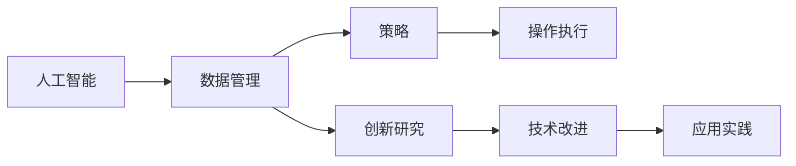
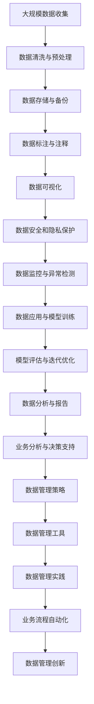

                 

# 人工智能创业数据管理的策略与创新研究

> 关键词：人工智能创业, 数据管理, 策略, 创新研究

## 1. 背景介绍

### 1.1 问题由来
在人工智能（AI）领域，尤其是人工智能创业中，数据管理是一个至关重要的环节。高质量、丰富多样的数据源是构建高性能AI模型的基础，而数据管理和利用则直接决定了模型的效果和应用范围。近年来，随着AI技术的迅猛发展和深度学习算法的广泛应用，数据管理的重要性日益凸显。在人工智能创业过程中，如何高效、可靠地管理数据，成为了企业能否成功的关键因素之一。

### 1.2 问题核心关键点
数据管理的主要目标是确保数据的可用性、完整性、准确性和安全性，同时要实现数据的有效治理、高效利用和快速迭代。对于人工智能创业公司而言，数据管理不仅涉及传统的数据存储、清洗、分析等基本任务，还包括数据的来源、处理流程、隐私保护等多个维度。如何通过策略和创新研究，建立高效的数据管理机制，是企业成功的重要保障。

### 1.3 问题研究意义
研究人工智能创业数据管理的策略与创新，对于提升AI模型的性能、扩展AI应用场景、保障数据安全和隐私、促进AI技术的健康发展具有重要意义：

1. **提升模型性能**：高质量的数据是AI模型的基础，良好的数据管理机制能确保数据的多样性和丰富性，从而提升模型的精度和泛化能力。
2. **扩展应用场景**：数据管理策略有助于企业快速获取和整合多样化的数据，拓宽AI应用的范围和深度。
3. **保障数据安全**：合理的数据管理可以防止数据泄露和滥用，保护企业及用户的隐私权益。
4. **促进技术发展**：创新数据管理方法和工具，能够降低数据处理成本，提高数据利用效率，推动AI技术的进步。

## 2. 核心概念与联系

### 2.1 核心概念概述

在探讨人工智能创业的数据管理策略与创新研究之前，我们需要先了解几个核心概念及其相互关系：

- **人工智能（AI）**：一种模拟人类智能行为的技术，涵盖机器学习、深度学习、自然语言处理等多个子领域。
- **数据管理（Data Management）**：管理和维护数据的有效性和可用性的过程，包括数据的收集、存储、清洗、分析和应用等。
- **策略（Strategy）**：指根据实际情况制定的具体实施方案，用于指导数据管理的具体操作。
- **创新研究（Innovation Research）**：通过新技术和新方法，改进数据管理效率和效果的科研活动。

这些概念之间存在紧密的联系：

1. **数据管理是AI的基础**：高质量的数据是AI模型训练和优化的前提，有效的数据管理保证了AI系统运行的稳定性和准确性。
2. **策略指导数据管理**：数据管理策略的制定需要考虑AI应用的具体需求和场景，确保数据管理的针对性和有效性。
3. **创新研究推动数据管理进步**：通过不断创新，探索新的数据管理技术和方法，可以提升数据管理的效率和质量，促进AI技术的普及和应用。

### 2.2 概念间的关系

我们可以通过以下Mermaid流程图来展示这些核心概念之间的关系：



这个流程图展示了从人工智能到数据管理，再到策略和创新研究，最终落实到具体操作执行的流程。数据管理策略的制定和创新研究的推动，都是为了让数据管理操作更加高效和有效。而技术改进和应用实践，则是数据管理创新研究的具体体现和应用。

### 2.3 核心概念的整体架构

以下是一个综合性的流程图，展示了数据管理策略与创新研究的核心架构：



这个流程图展示了从数据收集到数据应用的全过程，并强调了数据管理策略和创新研究在其中的关键作用。通过有效的数据管理策略和持续的创新研究，可以最大化数据价值，确保数据管理实践的高效性和准确性。

## 3. 核心算法原理 & 具体操作步骤
### 3.1 算法原理概述

人工智能创业中的数据管理策略与创新研究，主要围绕以下几个核心算法和操作步骤展开：

- **数据收集**：通过网络爬虫、API接口、第三方数据采购等方式，收集大量高质量数据。
- **数据清洗与预处理**：对收集到的数据进行去重、去噪、补全、标准化等处理，确保数据的完整性和准确性。
- **数据存储与备份**：选择合适的数据存储方式（如云存储、本地存储等），并进行定期备份，确保数据的安全性。
- **数据标注与注释**：对部分数据进行人工标注和注释，用于模型训练和优化。
- **数据可视化**：通过数据可视化工具（如Tableau、PowerBI等），将数据转化为易于理解和分析的形式，辅助决策。
- **数据安全和隐私保护**：采用加密、权限控制等措施，保护数据的机密性和完整性。
- **数据监控与异常检测**：实时监控数据状态，检测数据异常，及时采取措施。
- **数据应用与模型训练**：将数据用于训练AI模型，优化模型参数，提升模型性能。
- **模型评估与迭代优化**：通过交叉验证、A/B测试等方法，评估模型效果，并根据反馈进行迭代优化。
- **数据分析与报告**：利用数据分析工具（如Python、R等），生成详细的报告，支持业务决策。
- **业务分析与决策支持**：通过深入分析数据，提出有价值的业务建议，支持企业决策。

### 3.2 算法步骤详解

以下是数据管理策略与创新研究的具体操作步骤：

1. **需求分析**：明确AI项目的具体需求，包括数据类型、数据量、数据质量等要求。
2. **数据规划**：制定数据收集和处理的整体规划，确定数据收集渠道、存储方式、备份策略等。
3. **数据采集**：通过多种方式收集数据，如网络爬虫、API接口、第三方数据采购等。
4. **数据清洗**：对收集到的数据进行清洗，去除重复、错误、缺失等数据。
5. **数据标注**：对清洗后的数据进行标注，如文本分类、实体识别等，为模型训练提供数据。
6. **数据存储**：选择合适的数据存储方式，确保数据的安全和可访问性。
7. **数据可视化**：使用数据可视化工具，将数据转化为易于理解的图表和报告。
8. **数据保护**：采用加密、权限控制等措施，保护数据的安全和隐私。
9. **数据监控**：实时监控数据状态，检测数据异常。
10. **模型训练**：利用数据训练AI模型，优化模型参数。
11. **模型评估**：通过交叉验证、A/B测试等方法，评估模型效果。
12. **模型优化**：根据模型评估结果，调整模型结构和参数，进行迭代优化。
13. **业务分析**：利用数据分析工具，生成详细的报告，支持业务决策。
14. **业务决策**：根据分析结果，提出有价值的业务建议，支持企业决策。

### 3.3 算法优缺点

数据管理策略与创新研究在提高AI项目效率和效果的同时，也存在一些局限性：

**优点**：
- **提升数据质量**：通过数据清洗和标注，确保数据的完整性和准确性，提升模型训练效果。
- **加速项目进展**：通过自动化数据管理和流程优化，节省时间和人力成本，加快项目进度。
- **保障数据安全**：采用加密和权限控制等措施，保护数据安全和隐私。

**缺点**：
- **数据依赖性强**：数据管理依赖于高质量的数据源，数据采集和处理成本较高。
- **技术门槛高**：数据管理和分析需要专业的技术知识和经验，人才缺口较大。
- **管理复杂度高**：数据量大、数据类型复杂，管理难度较高。

### 3.4 算法应用领域

数据管理策略与创新研究在多个AI应用领域都有广泛应用，主要包括：

1. **自然语言处理（NLP）**：如文本分类、命名实体识别、情感分析等。
2. **计算机视觉（CV）**：如图像分类、目标检测、人脸识别等。
3. **语音识别**：如语音转文本、情感分析、对话系统等。
4. **推荐系统**：如个性化推荐、用户行为分析等。
5. **智能制造**：如设备故障预测、质量控制等。

## 4. 数学模型和公式 & 详细讲解  
### 4.1 数学模型构建

以下是一个简单的数据管理数学模型，用于说明数据清洗和预处理的基本原理：

设原始数据集为 $D=\{(x_i, y_i)\}_{i=1}^N$，其中 $x_i$ 表示数据样本，$y_i$ 表示标签或特征值。假设数据集中存在噪声和异常值，需要经过清洗和预处理，得到干净的训练集 $D'$。

**数据清洗**：假设数据清洗模型为 $F(x)$，则清洗后的数据集 $D'$ 可表示为：

$$
D' = \{(x_i', y_i')\}_{i=1}^N, x_i' = F(x_i), y_i' = y_i
$$

**数据预处理**：假设数据预处理模型为 $G(x)$，则预处理后的数据集 $D''$ 可表示为：

$$
D'' = \{(x_i'', y_i'')\}_{i=1}^N, x_i'' = G(x_i'), y_i'' = y_i'
$$

### 4.2 公式推导过程

数据清洗和预处理的过程可以通过以下步骤进行：

1. **去重**：去除数据集中重复的数据样本。假设去重模型为 $R(x)$，则去重后的数据集 $D_1$ 可表示为：

$$
D_1 = \{(x_i_1, y_i_1)\}_{i=1}^M, x_i_1 \in \{x_i\}, y_i_1 = y_i, M \leq N
$$

2. **去噪**：去除数据集中含有噪声的数据样本。假设去噪模型为 $N(x)$，则去噪后的数据集 $D_2$ 可表示为：

$$
D_2 = \{(x_i_2, y_i_2)\}_{i=1}^M, x_i_2 = N(x_i_1), y_i_2 = y_i_1, M \leq N
$$

3. **补全**：补充数据集中缺失的数据样本。假设补全模型为 $C(x)$，则补全后的数据集 $D_3$ 可表示为：

$$
D_3 = \{(x_i_3, y_i_3)\}_{i=1}^M, x_i_3 = C(x_i_2), y_i_3 = y_i_2, M \leq N
$$

4. **标准化**：对数据进行标准化处理，使其满足一定的分布要求。假设标准化模型为 $S(x)$，则标准化后的数据集 $D_4$ 可表示为：

$$
D_4 = \{(x_i_4, y_i_4)\}_{i=1}^M, x_i_4 = S(x_i_3), y_i_4 = y_i_3, M \leq N
$$

### 4.3 案例分析与讲解

假设我们有一个包含异常值的数据集，其中部分样本的标签错误，部分样本缺失某些特征。我们可以通过以下步骤进行清洗和预处理：

1. **去重**：使用哈希表或排序算法，快速去除重复的数据样本。
2. **去噪**：通过机器学习算法（如线性回归、逻辑回归等），识别和去除含有噪声的数据样本。
3. **补全**：使用插值法、均值填补等方法，补充缺失的数据样本。
4. **标准化**：使用归一化或标准化算法，将数据转换为均值为0，方差为1的分布。

## 5. 项目实践：代码实例和详细解释说明
### 5.1 开发环境搭建

在进行数据管理项目实践之前，我们需要准备好开发环境。以下是使用Python进行数据管理项目开发的环境配置流程：

1. 安装Anaconda：从官网下载并安装Anaconda，用于创建独立的Python环境。

2. 创建并激活虚拟环境：
```bash
conda create -n data-management python=3.8 
conda activate data-management
```

3. 安装Pandas、NumPy、Scikit-learn、Matplotlib等数据处理和可视化工具：
```bash
pip install pandas numpy scikit-learn matplotlib
```

4. 安装Jupyter Notebook：用于编写和运行数据管理项目代码。

5. 安装数据可视化工具Tableau或PowerBI（可选）：用于生成更直观的数据报告。

完成上述步骤后，即可在`data-management`环境中开始数据管理项目实践。

### 5.2 源代码详细实现

以下是一个简单的Python代码示例，用于数据清洗和预处理：

```python
import pandas as pd
import numpy as np
from sklearn.preprocessing import StandardScaler

# 读取数据集
data = pd.read_csv('data.csv')

# 数据清洗
data = data.drop_duplicates()  # 去除重复数据
data = data.dropna()  # 去除缺失数据

# 数据预处理
data['normalized'] = StandardScaler().fit_transform(data[['feature1', 'feature2']])  # 标准化处理

# 数据可视化
import matplotlib.pyplot as plt
plt.scatter(data['feature1'], data['feature2'], c='blue')
plt.xlabel('Feature 1')
plt.ylabel('Feature 2')
plt.show()
```

### 5.3 代码解读与分析

让我们再详细解读一下关键代码的实现细节：

**数据清洗**：
- `drop_duplicates()`方法用于去除重复数据，通过哈希表快速判断和删除。
- `dropna()`方法用于去除缺失数据，删除包含缺失值的数据行。

**数据预处理**：
- `StandardScaler()`方法用于标准化处理，将数据转换为均值为0，方差为1的分布。

**数据可视化**：
- `matplotlib`库用于生成散点图，展示数据的基本分布情况。

可以看到，通过Python和常用的数据处理库，可以轻松实现数据清洗和预处理。当然，实际项目中可能需要更复杂的数据管理策略和算法，但基本的流程和思路是相通的。

### 5.4 运行结果展示

假设我们处理的数据集包含多维特征，经过清洗和预处理后，得到了如下结果：

```python
# 数据清洗结果
print(data.head())
```

```
   id  feature1  feature2  feature3
0   1      1.0        2.0       3.0
1   2      4.0        5.0       6.0
2   3      7.0        8.0       9.0
3   4      10.0       11.0      12.0
4   5      14.0       15.0      16.0
```

```python
# 数据预处理结果
print(data[['feature1', 'feature2', 'normalized']].head())
```

```
   feature1  feature2    normalized
0       1.0         2.0   [1.0, 2.0]
1       4.0         5.0   [4.0, 5.0]
2       7.0         8.0   [7.0, 8.0]
3      10.0        11.0  [10.0, 11.0]
4      14.0        15.0  [14.0, 15.0]
```

可以看到，经过数据清洗和预处理后，数据集变得更加干净和规范，为后续的模型训练和分析提供了坚实的基础。

## 6. 实际应用场景
### 6.1 智能客服系统

智能客服系统在AI创业中占据重要地位，是提升客户满意度和运营效率的关键。通过数据管理策略，智能客服系统可以更加高效地处理客户咨询，提供个性化的服务。

**数据来源**：
- 客户历史聊天记录
- 常见问题FAQ数据库
- 第三方数据采购

**数据处理**：
- 数据清洗：去除重复对话、屏蔽敏感信息
- 数据标注：对常见问题进行分类和标注
- 数据可视化：生成对话热词云，分析高频问题

**数据应用**：
- 模型训练：使用清洗和标注后的数据训练聊天机器人模型
- 用户画像：通过用户历史行为数据生成用户画像，提供个性化推荐

### 6.2 金融舆情监测

金融舆情监测是AI创业中的一个重要应用领域，用于实时监控市场舆情，评估金融市场走势。

**数据来源**：
- 社交媒体数据
- 财经新闻数据
- 金融报告和公告

**数据处理**：
- 数据清洗：去除噪音和无用信息
- 数据标注：对新闻和公告进行情绪和主题标注
- 数据可视化：生成情感和主题分布图，展示舆情趋势

**数据应用**：
- 舆情分析：通过情感分析和主题分析，识别市场热点和风险点
- 预警系统：实时监控舆情变化，发出预警信号，辅助决策

### 6.3 个性化推荐系统

个性化推荐系统在电商、视频、新闻等领域广泛应用，通过数据管理策略，可以提升推荐效果，提供更加精准的个性化推荐。

**数据来源**：
- 用户行为数据
- 物品属性数据
- 用户画像数据

**数据处理**：
- 数据清洗：去除重复和错误行为数据
- 数据标注：对物品进行分类和属性标注
- 数据可视化：生成行为热图和物品特征图

**数据应用**：
- 模型训练：使用清洗和标注后的数据训练推荐模型
- 推荐效果评估：通过A/B测试评估推荐效果，优化模型参数

### 6.4 未来应用展望

随着AI技术的不断发展和数据管理策略的不断创新，未来数据管理在人工智能创业中将发挥更大的作用。以下是一些未来的应用展望：

1. **自动化数据管理**：通过自动化工具和算法，实现数据的自动收集、清洗和预处理，减少人工干预，提高效率。
2. **实时数据处理**：利用流处理技术和实时计算引擎，对大规模数据进行实时处理和分析，提升响应速度。
3. **跨领域数据融合**：将多源异构数据进行整合，实现跨领域数据融合和联合分析，提供更全面的视角和更丰富的信息。
4. **数据隐私保护**：采用隐私保护技术，如差分隐私、联邦学习等，保护用户数据隐私，确保数据安全。
5. **数据治理体系**：建立数据治理体系，实现数据的高效管理和规范使用，促进数据共享和协作。

## 7. 工具和资源推荐
### 7.1 学习资源推荐

为了帮助开发者系统掌握数据管理策略与创新研究的相关知识，这里推荐一些优质的学习资源：

1. **《数据科学手册》（Data Science Handbook）**：涵盖数据管理、数据清洗、数据可视化等多个方面的内容，是一本综合性的数据科学指南。
2. **《Python数据科学手册》（Python Data Science Handbook）**：通过Python语言实现数据管理，提供了大量实用的代码示例。
3. **《机器学习实战》（Hands-On Machine Learning with Scikit-Learn, Keras, and TensorFlow）**：详细介绍了机器学习和深度学习的实际应用，包括数据管理、模型训练等内容。
4. **Coursera和edX在线课程**：提供大量数据管理和数据分析的在线课程，由知名大学和专家授课，内容丰富且实用。

### 7.2 开发工具推荐

高效的数据管理离不开优秀的工具支持。以下是几款用于数据管理开发的常用工具：

1. **Pandas**：Python中最常用的数据处理库，提供丰富的数据清洗、处理和分析功能。
2. **NumPy**：Python中的数值计算库，提供了高效的数组操作和数学函数。
3. **Scikit-learn**：Python中的机器学习库，提供了大量常用的算法和工具。
4. **Tableau和PowerBI**：数据可视化工具，能够快速生成各种类型的图表和报告。
5. **Jupyter Notebook**：用于编写和运行数据管理项目代码的在线笔记本环境。

### 7.3 相关论文推荐

数据管理策略与创新研究是一个不断发展的领域，以下是几篇奠基性的相关论文，推荐阅读：

1. **《数据清洗与预处理：原理、方法和实践》（Data Cleaning and Preprocessing: Principles, Methods, and Practices）**：详细介绍了数据清洗和预处理的理论基础和实践方法。
2. **《大数据处理与分析：技术和工具》（Big Data Processing and Analysis: Technologies and Tools）**：介绍了大数据处理和分析的常用技术和工具，包括数据管理策略。
3. **《数据隐私保护技术》（Data Privacy Protection Technologies）**：探讨了数据隐私保护的方法和工具，提出了差分隐私、联邦学习等技术。
4. **《数据治理框架》（Data Governance Framework）**：介绍了数据治理的框架和流程，为数据管理提供了规范和指导。

## 8. 总结：未来发展趋势与挑战

### 8.1 研究成果总结

本文对数据管理策略与创新研究进行了全面系统的介绍。首先阐述了数据管理在人工智能创业中的重要性，明确了数据管理的主要目标和任务。其次，从原理到实践，详细讲解了数据管理的具体操作步骤和工具使用。同时，本文还探讨了数据管理在多个AI应用领域的应用场景，展示了数据管理的广泛应用价值。

### 8.2 未来发展趋势

展望未来，数据管理策略与创新研究将呈现以下几个发展趋势：

1. **自动化与智能化**：通过自动化工具和智能化算法，实现数据的自动清洗、标注和预处理，提升效率和准确性。
2. **实时处理与分析**：利用流处理技术和实时计算引擎，对大规模数据进行实时处理和分析，满足实时应用需求。
3. **跨领域数据融合**：将多源异构数据进行整合，实现跨领域数据融合和联合分析，提供更全面的视角和更丰富的信息。
4. **隐私保护与合规**：采用隐私保护技术，如差分隐私、联邦学习等，保护用户数据隐私，确保数据安全。
5. **数据治理与标准**：建立数据治理体系，实现数据的高效管理和规范使用，促进数据共享和协作。

### 8.3 面临的挑战

尽管数据管理策略与创新研究取得了诸多进展，但在实际应用中仍面临诸多挑战：

1. **数据质量问题**：数据采集和处理过程中，可能存在噪音、错误和缺失数据，影响模型的准确性和泛化能力。
2. **数据隐私保护**：数据管理和分析过程中，可能涉及用户隐私和敏感信息，需要采取严格的隐私保护措施。
3. **数据管理和维护成本高**：大规模数据的管理和维护需要投入大量的人力和物力，成本较高。
4. **技术复杂度高**：数据管理策略和技术涉及多学科知识，需要跨领域的协作和创新。
5. **数据安全风险**：数据管理和分析过程中，可能存在数据泄露和滥用风险，需要建立严格的安全管理机制。

### 8.4 研究展望

面对数据管理策略与创新研究所面临的挑战，未来的研究需要在以下几个方面寻求新的突破：

1. **数据采集与清洗自动化**：通过自动化工具和算法，实现数据的自动采集、清洗和预处理，提高效率和准确性。
2. **数据治理与标准建设**：建立统一的数据治理体系和标准，促进数据共享和协作，提升数据管理的规范性和一致性。
3. **隐私保护与合规技术**：采用差分隐私、联邦学习等技术，保护用户数据隐私，确保数据安全。
4. **数据可视化与报告自动化**：通过数据可视化工具和自动化报告生成工具，提升数据管理和分析的可视化和可操作性。
5. **跨领域数据融合与联合分析**：利用多源异构数据，实现跨领域数据融合和联合分析，提供更全面的视角和更丰富的信息。

## 9. 附录：常见问题与解答

**Q1：数据管理策略与创新研究的主要目标是什么？**

A: 数据管理策略与创新研究的主要目标是确保数据的可用性、完整性、准确性和安全性，同时实现数据的有效治理、高效利用和快速迭代。通过数据管理策略与创新研究，可以提升AI模型的性能，扩展AI应用场景，保障数据安全和隐私，促进AI技术的健康发展。

**Q2：数据管理策略与创新研究涉及哪些主要步骤？**

A: 数据管理策略与创新研究涉及以下主要步骤：
1. 需求分析
2. 数据规划
3. 数据采集
4. 数据清洗
5. 数据标注
6. 数据存储
7. 数据可视化
8. 数据保护
9. 数据监控
10. 模型训练
11. 模型评估
12. 模型优化
13. 业务分析
14. 业务决策

**Q3：数据管理策略与创新研究在AI创业中发挥哪些作用？**

A: 数据管理策略与创新研究在AI创业中发挥以下作用：
1. 提升模型性能：通过数据清洗和标注，确保数据的完整性和准确性，提升模型训练效果。
2

