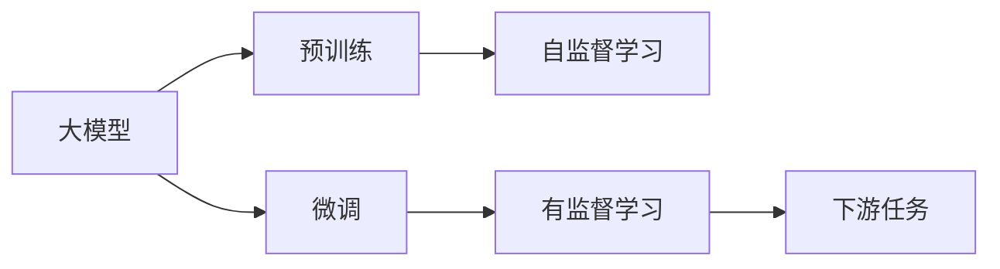
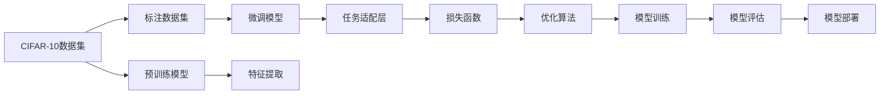

                 

# 从零开始大模型开发与微调：CIFAR-10数据集简介

## 1. 背景介绍

### 1.1 问题由来
在大规模深度学习研究中，常用的大模型往往在初始化时需要大量的计算资源和数据集。如何在大规模数据上进行预训练，使得模型获得较好的泛化能力，是当前深度学习研究的一个热点问题。而微调（Fine-Tuning）技术提供了一种有效的方法，可以在预训练模型的基础上，使用特定任务的少量标注数据进行有监督学习，进一步提升模型的性能。

### 1.2 问题核心关键点
微调技术的关键在于如何有效地利用预训练模型中的知识，同时避免过拟合现象。一般来说，微调过程包括以下几个步骤：
1. 数据准备：收集特定任务的标注数据集。
2. 模型适配：根据任务类型选择合适的输出层和损失函数。
3. 超参数设置：选择合适的优化算法、学习率等超参数。
4. 模型训练：利用标注数据集对模型进行有监督学习。
5. 模型评估：在验证集上评估模型性能，防止过拟合。
6. 模型部署：将训练好的模型应用到实际任务中。

本文将从微调的基本概念出发，通过CIFAR-10数据集的微调实例，深入浅出地介绍微调技术的原理和操作步骤。

## 2. 核心概念与联系

### 2.1 核心概念概述

在大模型微调技术中，有几个关键概念：

- **大模型（Large Model）**：通常指具有大量参数的深度神经网络，如ResNet、Transformer等。通过在大规模数据上进行预训练，大模型可以获得较强的泛化能力。
- **预训练（Pre-training）**：在大规模无标签数据上，使用自监督学习任务训练模型，获取通用的语言或视觉表示。
- **微调（Fine-Tuning）**：在预训练模型的基础上，使用特定任务的少量标注数据进行有监督学习，进一步优化模型。
- **迁移学习（Transfer Learning）**：利用预训练模型的知识，将其迁移到特定任务中进行微调。

这些概念之间的联系可以通过以下Mermaid流程图来展示：



### 2.2 概念间的关系

这些核心概念之间存在着紧密的联系，形成了微调的完整框架。以CIFAR-10数据集为例，其与微调的关系可以表示如下：



## 3. 核心算法原理 & 具体操作步骤
### 3.1 算法原理概述

微调的本质是一种有监督学习，它通过利用预训练模型在大规模数据上获得的知识，进行特定任务的微调。微调模型的目标函数通常是一个损失函数，用于衡量模型输出与真实标签之间的差异。通过梯度下降等优化算法，微调模型不断更新参数，使得损失函数最小化，从而提升模型性能。

以CIFAR-10数据集为例，假设预训练模型为ResNet-18，其输出为大小为$1\times 1\times 10$的特征表示向量。在微调过程中，我们可以添加一个全连接层（或卷积层），将特征表示向量映射为类别概率分布。

### 3.2 算法步骤详解

微调CIFAR-10数据集通常包括以下几个关键步骤：

1. **数据准备**：收集CIFAR-10数据集，并将其划分为训练集、验证集和测试集。

2. **模型适配**：根据CIFAR-10数据集的类别数（10类），添加一个全连接层，其输出大小为10，并使用交叉熵损失函数作为微调模型的目标函数。

3. **超参数设置**：选择合适的优化算法（如SGD、Adam等）和超参数（如学习率、批大小等）。

4. **模型训练**：使用训练集对模型进行有监督学习，利用梯度下降等优化算法更新模型参数。

5. **模型评估**：在验证集上评估模型性能，防止过拟合。

6. **模型部署**：将训练好的模型应用到实际任务中。

### 3.3 算法优缺点

#### 优点

- **高效**：使用预训练模型作为初始化参数，可以避免从头训练所需的巨大计算资源和数据集。
- **通用性**：适用于各种计算机视觉任务，如图像分类、目标检测等。
- **泛化能力强**：利用预训练模型在大规模数据上获得的知识，可以提升模型在小样本情况下的泛化能力。

#### 缺点

- **依赖标注数据**：微调模型需要大量的标注数据进行训练，数据获取成本较高。
- **过拟合风险**：在数据量较小时，模型容易出现过拟合现象。
- **计算成本高**：微调过程仍需要较高的计算资源和内存。

### 3.4 算法应用领域

微调技术在计算机视觉、自然语言处理、推荐系统等领域都有广泛的应用。例如：

- 计算机视觉中的图像分类、目标检测、图像分割等任务。
- 自然语言处理中的文本分类、情感分析、问答系统等任务。
- 推荐系统中的个性化推荐、用户画像构建等任务。

## 4. 数学模型和公式 & 详细讲解  
### 4.1 数学模型构建

假设预训练模型为ResNet-18，其输出大小为$1\times 1\times 10$的特征表示向量。微调模型的目标函数为交叉熵损失函数，记为：

$$
\mathcal{L}(\theta) = -\frac{1}{N}\sum_{i=1}^N \sum_{j=1}^{10} y_{i,j}\log p_{i,j}
$$

其中，$y_{i,j}$为第$i$个样本的第$j$个类别的真实标签，$p_{i,j}$为模型预测的第$i$个样本的第$j$个类别的概率。

### 4.2 公式推导过程

假设模型在训练集$\mathcal{D}=\{(x_i, y_i)\}_{i=1}^N$上进行微调，其中$x_i$为输入图像，$y_i$为标签。在微调过程中，我们假设模型的输出为$\hat{y}_i$，则损失函数可以表示为：

$$
\mathcal{L}(\theta) = -\frac{1}{N}\sum_{i=1}^N \log p_{i}(y_i)
$$

其中，$p_{i}(y_i)$表示模型在输入$x_i$下输出为$y_i$的概率。

### 4.3 案例分析与讲解

假设我们使用PyTorch框架来实现微调过程。以下是使用PyTorch实现微调的代码示例：

```python
import torch
import torch.nn as nn
import torch.optim as optim
from torchvision import datasets, transforms
from torchvision.models import resnet18

# 定义模型
model = resnet18(pretrained=True)
num_classes = 10
model.fc = nn.Linear(model.fc.in_features, num_classes)

# 定义损失函数
criterion = nn.CrossEntropyLoss()

# 定义优化器
optimizer = optim.SGD(model.parameters(), lr=0.001, momentum=0.9)

# 定义数据预处理
transform = transforms.Compose([
    transforms.Resize(224),
    transforms.CenterCrop(224),
    transforms.ToTensor(),
    transforms.Normalize(mean=[0.485, 0.456, 0.406], std=[0.229, 0.224, 0.225])
])

# 加载数据集
train_dataset = datasets.CIFAR10(root='./data', train=True, download=True, transform=transform)
test_dataset = datasets.CIFAR10(root='./data', train=False, download=True, transform=transform)
train_loader = torch.utils.data.DataLoader(train_dataset, batch_size=128, shuffle=True)
test_loader = torch.utils.data.DataLoader(test_dataset, batch_size=128, shuffle=False)

# 训练模型
for epoch in range(10):
    running_loss = 0.0
    for i, data in enumerate(train_loader, 0):
        inputs, labels = data
        optimizer.zero_grad()
        outputs = model(inputs)
        loss = criterion(outputs, labels)
        loss.backward()
        optimizer.step()
        running_loss += loss.item()
    print(f"Epoch {epoch+1}, loss: {running_loss/len(train_loader)}")

# 评估模型
correct = 0
total = 0
with torch.no_grad():
    for data in test_loader:
        inputs, labels = data
        outputs = model(inputs)
        _, predicted = torch.max(outputs.data, 1)
        total += labels.size(0)
        correct += (predicted == labels).sum().item()
print(f"Accuracy: {100 * correct / total}%")
```

## 5. 项目实践：代码实例和详细解释说明
### 5.1 开发环境搭建

在进行微调实践前，我们需要准备好开发环境。以下是使用Python进行PyTorch开发的环境配置流程：

1. 安装Anaconda：从官网下载并安装Anaconda，用于创建独立的Python环境。

2. 创建并激活虚拟环境：
```bash
conda create -n pytorch-env python=3.8 
conda activate pytorch-env
```

3. 安装PyTorch：根据CUDA版本，从官网获取对应的安装命令。例如：
```bash
conda install pytorch torchvision torchaudio cudatoolkit=11.1 -c pytorch -c conda-forge
```

4. 安装TensorFlow：
```bash
conda install tensorflow=2.4
```

5. 安装相关库：
```bash
pip install torch torchvision torchtext
```

完成上述步骤后，即可在`pytorch-env`环境中开始微调实践。

### 5.2 源代码详细实现

以下是使用PyTorch实现CIFAR-10数据集微调的代码实现：

```python
import torch
import torch.nn as nn
import torch.optim as optim
from torchvision import datasets, transforms
from torchvision.models import resnet18

# 定义模型
model = resnet18(pretrained=True)
num_classes = 10
model.fc = nn.Linear(model.fc.in_features, num_classes)

# 定义损失函数
criterion = nn.CrossEntropyLoss()

# 定义优化器
optimizer = optim.SGD(model.parameters(), lr=0.001, momentum=0.9)

# 定义数据预处理
transform = transforms.Compose([
    transforms.Resize(224),
    transforms.CenterCrop(224),
    transforms.ToTensor(),
    transforms.Normalize(mean=[0.485, 0.456, 0.406], std=[0.229, 0.224, 0.225])
])

# 加载数据集
train_dataset = datasets.CIFAR10(root='./data', train=True, download=True, transform=transform)
test_dataset = datasets.CIFAR10(root='./data', train=False, download=True, transform=transform)
train_loader = torch.utils.data.DataLoader(train_dataset, batch_size=128, shuffle=True)
test_loader = torch.utils.data.DataLoader(test_dataset, batch_size=128, shuffle=False)

# 训练模型
for epoch in range(10):
    running_loss = 0.0
    for i, data in enumerate(train_loader, 0):
        inputs, labels = data
        optimizer.zero_grad()
        outputs = model(inputs)
        loss = criterion(outputs, labels)
        loss.backward()
        optimizer.step()
        running_loss += loss.item()
    print(f"Epoch {epoch+1}, loss: {running_loss/len(train_loader)}")

# 评估模型
correct = 0
total = 0
with torch.no_grad():
    for data in test_loader:
        inputs, labels = data
        outputs = model(inputs)
        _, predicted = torch.max(outputs.data, 1)
        total += labels.size(0)
        correct += (predicted == labels).sum().item()
print(f"Accuracy: {100 * correct / total}%")
```

### 5.3 代码解读与分析

让我们再详细解读一下关键代码的实现细节：

**模型定义**：
- 首先，使用`resnet18`预训练模型作为初始化参数。
- 添加一个全连接层，将其输出大小设置为10，用于分类。

**损失函数定义**：
- 使用`nn.CrossEntropyLoss`作为损失函数，计算模型预测输出与真实标签之间的交叉熵损失。

**优化器定义**：
- 使用SGD优化器，学习率为0.001，动量为0.9。

**数据预处理**：
- 使用`transforms`模块定义数据预处理步骤，包括图像缩放、裁剪、归一化等。

**数据集加载**：
- 使用`datasets.CIFAR10`加载CIFAR-10数据集，并使用`DataLoader`进行批次化加载。

**训练模型**：
- 在每个epoch内，对训练集进行迭代，计算损失并反向传播更新模型参数。
- 在每个batch结束后，计算损失并更新模型参数。

**评估模型**：
- 在测试集上评估模型性能，计算准确率。

## 6. 实际应用场景
### 6.1 智能监控

CIFAR-10数据集中的图像分类任务可以用于智能监控系统，识别并分类不同的物体。例如，在视频监控中，可以实时识别行人、车辆、动物等物体，并进行分类统计。

### 6.2 医学影像诊断

CIFAR-10数据集中的图像分类任务可以用于医学影像的诊断。例如，在肺部X光片中，可以自动识别和分类不同类型的肺部病变，帮助医生进行初步诊断。

### 6.3 智能推荐

CIFAR-10数据集中的图像分类任务可以用于个性化推荐系统。例如，在电商平台上，根据用户购买的图片类别的概率分布，推荐相应的商品，提高用户体验。

### 6.4 未来应用展望

随着大模型和微调技术的不断发展，CIFAR-10数据集微调将带来更多的应用场景。

在自动驾驶领域，CIFAR-10数据集中的图像分类任务可以用于道路标志识别、行人检测等任务，辅助自动驾驶系统进行安全决策。

在农业领域，CIFAR-10数据集中的图像分类任务可以用于作物分类、病虫害识别等任务，帮助农民进行精准农业管理。

## 7. 工具和资源推荐
### 7.1 学习资源推荐

为了帮助开发者系统掌握CIFAR-10数据集微调的理论基础和实践技巧，这里推荐一些优质的学习资源：

1. **《深度学习入门》**：由DeepLearning.ai提供的深度学习入门课程，包含各种深度学习框架的使用，是了解微调技术的入门必读。

2. **《PyTorch深度学习》**：PyTorch官方文档，提供了详细的PyTorch使用指南，包括模型定义、训练、评估等操作。

3. **《TensorFlow深度学习》**：TensorFlow官方文档，提供了详细的TensorFlow使用指南，包括模型定义、训练、评估等操作。

4. **《计算机视觉: 算法与应用》**：计算机视觉领域的经典教材，详细介绍了计算机视觉中的各种算法和技术，包括图像分类、目标检测等任务。

5. **Kaggle竞赛**：Kaggle平台上大量的计算机视觉竞赛项目，可以参与竞赛项目，提升微调技能。

通过对这些资源的学习实践，相信你一定能够快速掌握CIFAR-10数据集微调的精髓，并用于解决实际的计算机视觉问题。

### 7.2 开发工具推荐

高效的开发离不开优秀的工具支持。以下是几款用于CIFAR-10数据集微调开发的常用工具：

1. **PyTorch**：基于Python的开源深度学习框架，灵活动态的计算图，适合快速迭代研究。大部分预训练模型都有PyTorch版本的实现。

2. **TensorFlow**：由Google主导开发的开源深度学习框架，生产部署方便，适合大规模工程应用。同样有丰富的预训练模型资源。

3. **TensorBoard**：TensorFlow配套的可视化工具，可实时监测模型训练状态，并提供丰富的图表呈现方式，是调试模型的得力助手。

4. **Weights & Biases**：模型训练的实验跟踪工具，可以记录和可视化模型训练过程中的各项指标，方便对比和调优。

5. **Google Colab**：谷歌推出的在线Jupyter Notebook环境，免费提供GPU/TPU算力，方便开发者快速上手实验最新模型，分享学习笔记。

合理利用这些工具，可以显著提升CIFAR-10数据集微调的开发效率，加快创新迭代的步伐。

### 7.3 相关论文推荐

CIFAR-10数据集微调技术的发展源于学界的持续研究。以下是几篇奠基性的相关论文，推荐阅读：

1. **ImageNet大规模视觉识别挑战赛（ILSVRC）**：ILSVRC是计算机视觉领域最著名的比赛，通过大规模视觉识别任务推动了深度学习技术的发展。

2. **Very Deep Convolutional Networks for Large-Scale Image Recognition**：AlexNet论文，首次在大规模数据集上使用卷积神经网络（CNN）进行图像分类，取得了显著效果。

3. **Deep Residual Learning for Image Recognition**：ResNet论文，提出了残差网络（ResNet），大幅提升了深度神经网络的训练性能。

4. **Inception Networks for Computer Vision**：Inception论文，提出了Inception模块，提升了深度神经网络的计算效率。

5. **Fine-tuning ResNets for Large-Scale Object Detection and Fine-Grained Recognition**：在CIFAR-10数据集上的微调实践，展示了微调技术在图像分类、目标检测等任务上的强大能力。

这些论文代表了大模型微调技术的发展脉络。通过学习这些前沿成果，可以帮助研究者把握学科前进方向，激发更多的创新灵感。

除上述资源外，还有一些值得关注的前沿资源，帮助开发者紧跟CIFAR-10数据集微调技术的最新进展，例如：

1. **arXiv论文预印本**：人工智能领域最新研究成果的发布平台，包括大量尚未发表的前沿工作，学习前沿技术的必读资源。

2. **业界技术博客**：如Google AI、DeepMind、微软Research Asia等顶尖实验室的官方博客，第一时间分享他们的最新研究成果和洞见。

3. **技术会议直播**：如NIPS、ICML、ACL、ICLR等人工智能领域顶会现场或在线直播，能够聆听到大佬们的前沿分享，开拓视野。

4. **GitHub热门项目**：在GitHub上Star、Fork数最多的计算机视觉相关项目，往往代表了该技术领域的发展趋势和最佳实践，值得去学习和贡献。

5. **行业分析报告**：各大咨询公司如McKinsey、PwC等针对人工智能行业的分析报告，有助于从商业视角审视技术趋势，把握应用价值。

总之，对于CIFAR-10数据集微调技术的学习和实践，需要开发者保持开放的心态和持续学习的意愿。多关注前沿资讯，多动手实践，多思考总结，必将收获满满的成长收益。

## 8. 总结：未来发展趋势与挑战
### 8.1 总结

本文对CIFAR-10数据集微调技术进行了全面系统的介绍。首先阐述了微调的基本概念和其在大模型中的应用，明确了微调在拓展预训练模型应用、提升下游任务性能方面的独特价值。其次，从原理到实践，详细讲解了微调模型的数学模型、算法步骤和代码实现，给出了完整的微调代码实例。同时，本文还广泛探讨了微调技术在智能监控、医学影像诊断、智能推荐等领域的实际应用前景，展示了微调技术的强大潜力。此外，本文精选了微调技术的各类学习资源，力求为读者提供全方位的技术指引。

通过本文的系统梳理，可以看到，CIFAR-10数据集微调技术在大规模深度学习研究中具有重要的应用价值，为计算机视觉任务的解决提供了强大的工具。未来，伴随深度学习技术的不断进步，微调方法也将更加多样化和高效化，进一步提升模型的性能和应用范围。

### 8.2 未来发展趋势

展望未来，CIFAR-10数据集微调技术将呈现以下几个发展趋势：

1. **模型规模持续增大**：随着算力成本的下降和数据规模的扩张，大模型将不断增加参数量，提升模型的泛化能力。

2. **微调方法日趋多样**：除了传统的全参数微调外，未来会涌现更多参数高效的微调方法，如Adapter、LoRA等，在节省计算资源的同时保证微调精度。

3. **持续学习成为常态**：随着数据分布的不断变化，微调模型需要持续学习新知识以保持性能。如何在不遗忘原有知识的同时，高效吸收新样本信息，将成为重要的研究课题。

4. **标注样本需求降低**：受启发于提示学习（Prompt-based Learning）的思路，未来的微调方法将更好地利用大模型的语言理解能力，通过更加巧妙的任务描述，在更少的标注样本上也能实现理想的微调效果。

5. **多模态微调崛起**：当前的微调主要聚焦于纯文本数据，未来会进一步拓展到图像、视频、语音等多模态数据微调。多模态信息的融合，将显著提升语言模型对现实世界的理解和建模能力。

6. **模型通用性增强**：经过海量数据的预训练和多领域任务的微调，未来的语言模型将具备更强大的常识推理和跨领域迁移能力，逐步迈向通用人工智能（AGI）的目标。

以上趋势凸显了CIFAR-10数据集微调技术的广阔前景。这些方向的探索发展，必将进一步提升计算机视觉系统的性能和应用范围，为人类认知智能的进化带来深远影响。

### 8.3 面临的挑战

尽管CIFAR-10数据集微调技术已经取得了瞩目成就，但在迈向更加智能化、普适化应用的过程中，它仍面临着诸多挑战：

1. **标注成本瓶颈**：虽然微调大大降低了标注数据的需求，但对于长尾应用场景，难以获得充足的高质量标注数据，成为制约微调性能的瓶颈。如何进一步降低微调对标注样本的依赖，将是一大难题。

2. **模型鲁棒性不足**：当前微调模型面对域外数据时，泛化性能往往大打折扣。对于测试样本的微小扰动，微调模型的预测也容易发生波动。如何提高微调模型的鲁棒性，避免灾难性遗忘，还需要更多理论和实践的积累。

3. **推理效率有待提高**：大规模语言模型虽然精度高，但在实际部署时往往面临推理速度慢、内存占用大等效率问题。如何在保证性能的同时，简化模型结构，提升推理速度，优化资源占用，将是重要的优化方向。

4. **可解释性亟需加强**：当前微调模型更像是"黑盒"系统，难以解释其内部工作机制和决策逻辑。对于医疗、金融等高风险应用，算法的可解释性和可审计性尤为重要。如何赋予微调模型更强的可解释性，将是亟待攻克的难题。

5. **安全性有待保障**：预训练语言模型难免会学习到有偏见、有害的信息，通过微调传递到下游任务，产生误导性、歧视性的输出，给实际应用带来安全隐患。如何从数据和算法层面消除模型偏见，避免恶意用途，确保输出的安全性，也将是重要的研究课题。

6. **知识整合能力不足**：现有的微调模型往往局限于任务内数据，难以灵活吸收和运用更广泛的先验知识。如何让微调过程更好地与外部知识库、规则库等专家知识结合，形成更加全面、准确的信息整合能力，还有很大的想象空间。

正视CIFAR-10数据集微调面临的这些挑战，积极应对并寻求突破，将是大模型微调走向成熟的必由之路。相信随着学界和产业界的共同努力，这些挑战终将一一被克服，CIFAR-10数据集微调必将在构建人机协同的智能时代中扮演越来越重要的角色。

### 8.4 未来突破

面对CIFAR-10数据集微调所面临的种种挑战，未来的研究需要在以下几个方面寻求新的突破：

1. **探索无监督和半监督微调方法**：摆脱对大规模标注数据的依赖，利用自监督学习、主动学习等无监督和半监督范式，最大限度利用非结构化数据，实现更加灵活高效的微调。

2. **研究参数高效和计算高效的微调范式**：开发更加参数高效的微调方法，在固定大部分预训练参数的同时，只更新极少量的任务相关参数。同时优化微调模型的计算图，减少前向传播和反向传播的资源消耗，实现更加轻量级、实时性的部署。

3. **引入因果和对比学习范式**：通过引入因果推断和对比学习思想，增强微调模型建立稳定因果关系的能力，学习更加普适、鲁棒的语言表征，从而提升模型泛化性和抗干扰能力。

4. **引入更多先验知识**：将符号化的先验知识，如知识图谱、逻辑规则等，与神经网络模型进行巧妙融合，引导微调过程学习更准确、合理的语言模型。同时加强不同模态数据的整合，实现视觉、语音等多模态信息与文本信息的协同建模。

5. **结合因果分析和博弈论工具**：将因果分析方法引入微调模型，识别出模型决策的关键特征，增强输出解释的因果性和逻辑性。借助博弈论工具刻画人机交互过程，主动探索并规避模型的脆弱点，

