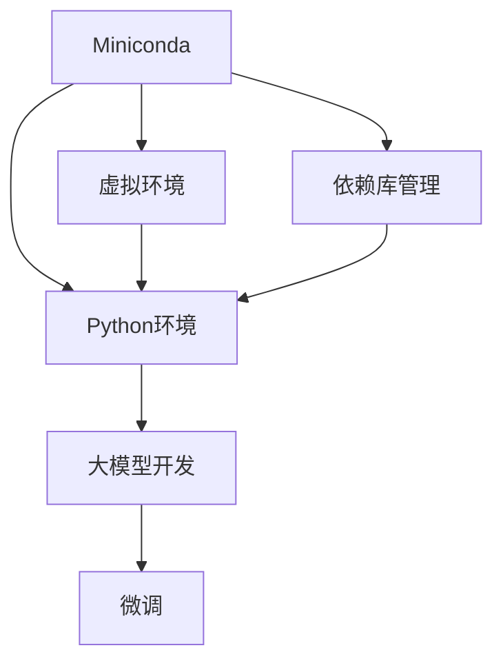

                 

# 从零开始大模型开发与微调：Miniconda的下载与安装

> 关键词：大模型开发,Miniconda,Python环境配置,虚拟环境,编程语言,Python编程,深度学习,模型训练,微调,学习资源,开发工具,科学计算

## 1. 背景介绍

### 1.1 问题由来
在大模型开发和微调过程中，环境配置和资源管理是一个绕不开的话题。特别是当我们需要在不同的项目之间切换，或者需要在同一项目内进行多个版本的管理时，环境的一致性和依赖的明确性就变得尤为重要。这时候，Miniconda环境就显出了其独特的优势。

Miniconda是一个Python语言的第三方环境管理工具，能够独立于Python安装程序（例如pip）创建和管理环境，使得开发者可以方便地切换和管理不同的Python版本和依赖库。它已经成为很多开发者在科研、工程开发、数据分析等领域中首选的环境管理工具。

本文将详细讲解如何在Windows、Linux和macOS系统下下载与安装Miniconda，并进一步介绍如何在Miniconda环境下搭建Python虚拟环境，配置和管理依赖库，以支持大模型开发和微调。

## 2. 核心概念与联系

### 2.1 核心概念概述

为了更好地理解Miniconda在大模型开发和微调中的应用，我们先简单介绍一些关键概念：

- **Miniconda**：是一个开源的、跨平台的、Python语言的第三方环境管理工具，能够独立于Python安装程序（如pip）创建和管理环境。

- **Python环境**：Python是一种解释型计算机程序设计语言，由于其灵活性和广泛的应用，成为数据科学、机器学习、深度学习等领域的首选语言。

- **虚拟环境**：是在同一机器上创建多个独立的Python环境，用于不同项目的隔离和管理，避免不同项目之间的依赖冲突。

- **依赖库管理**：在Python环境中，依赖库是第三方编写的程序，用于解决特定的编程问题。合理管理依赖库可以提升代码的可维护性和可重用性。

这些概念之间存在密切联系，共同构成了Python环境管理的核心框架。通过Miniconda，开发者可以方便地进行环境配置和管理，进而实现大模型开发和微调。

### 2.2 核心概念的整体架构

下面我们用一个简单的流程图来展示这些概念之间的关系：



这个图表展示了Miniconda在大模型开发和微调中的应用架构：

1. Miniconda用于创建和管理Python环境。
2. 虚拟环境在Miniconda的支持下，独立于系统Python安装，可以自由地切换和管理不同版本的Python。
3. 依赖库管理帮助开发者灵活地添加、更新和移除库，保持代码库的干净和可靠。
4. 通过虚拟环境和依赖库管理，大模型的开发和微调可以在一个独立的环境中完成，避免系统库之间的冲突。
5. 微调作为大模型开发的重要组成部分，可以通过Miniconda管理的环境，快速进行参数调整和优化。

通过理解这些核心概念，我们可以更好地把握Miniconda在大模型开发和微调中的作用。

## 3. 核心算法原理 & 具体操作步骤
### 3.1 算法原理概述

在Miniconda环境中，Python环境、虚拟环境和依赖库管理是一个统一的整体，通过Miniconda的`conda`命令行工具，可以对它们进行有效的管理和控制。

大模型开发和微调的基本流程如下：

1. **环境配置**：在Miniconda环境下，使用`conda create`命令创建虚拟环境。
2. **依赖库安装**：在虚拟环境内，使用`conda install`命令安装所需的依赖库。
3. **大模型训练**：在虚拟环境内，使用Python编写模型训练代码，使用`conda activate`命令激活虚拟环境。
4. **模型微调**：在虚拟环境内，使用Python编写微调代码，进行参数更新和优化。

通过这一流程，可以方便地进行大模型的开发和微调，并且保持依赖库和环境的一致性。

### 3.2 算法步骤详解

#### 3.2.1 准备环境

在开始安装Miniconda之前，需要先检查系统是否已经安装Python，并且确保Python安装路径在系统的`PATH`环境变量中，以确保Miniconda能够正常运行。

#### 3.2.2 下载和安装Miniconda

根据操作系统的不同，Miniconda的下载和安装过程有所不同。

**Windows系统**：

1. 下载Miniconda最新版本的安装程序。
2. 运行安装程序，选择安装路径，完成安装。
3. 安装完成后，打开Miniconda的命令提示符，设置Miniconda的安装路径为`conda`，并将其添加到系统的`PATH`环境变量中。

**Linux系统**：

1. 使用curl或wget下载Miniconda的安装包。
2. 使用bash命令进行安装。
3. 安装完成后，在终端中设置Miniconda的安装路径为`conda`，并将其添加到系统的`PATH`环境变量中。

**macOS系统**：

1. 下载Miniconda的安装包。
2. 使用双引号将安装命令封装，防止路径中的空格引起错误。
3. 安装完成后，在终端中设置Miniconda的安装路径为`conda`，并将其添加到系统的`PATH`环境变量中。

#### 3.2.3 创建虚拟环境

创建虚拟环境是Miniconda的亮点之一，可以通过命令`conda create --name env_name`创建一个名为`env_name`的虚拟环境，其中`env_name`是你给虚拟环境命名的名称。

**Windows系统**：

```bash
conda create --name myenv
conda activate myenv
```

**Linux系统**：

```bash
conda create --name myenv
source activate myenv
```

**macOS系统**：

```bash
conda create --name myenv
source activate myenv
```

#### 3.2.4 安装依赖库

在虚拟环境内，可以使用`conda install`命令安装所需的依赖库。

**Windows系统**：

```bash
conda install numpy scipy pandas matplotlib
```

**Linux系统**：

```bash
conda install numpy scipy pandas matplotlib
```

**macOS系统**：

```bash
conda install numpy scipy pandas matplotlib
```

#### 3.2.5 大模型训练

在虚拟环境内，使用Python编写模型训练代码，并使用`conda activate`命令激活虚拟环境。

```python
import torch
import torch.nn as nn
import torch.optim as optim

# 创建模型
model = nn.Linear(784, 10)

# 定义损失函数和优化器
criterion = nn.CrossEntropyLoss()
optimizer = optim.SGD(model.parameters(), lr=0.01)

# 训练模型
for epoch in range(5):
    for batch_idx, (data, target) in enumerate(train_loader):
        optimizer.zero_grad()
        output = model(data)
        loss = criterion(output, target)
        loss.backward()
        optimizer.step()
```

#### 3.2.6 模型微调

在虚拟环境内，使用Python编写微调代码，进行参数更新和优化。

```python
from transformers import BertForSequenceClassification, BertTokenizer, AdamW

# 加载预训练模型和分词器
model = BertForSequenceClassification.from_pretrained('bert-base-uncased')
tokenizer = BertTokenizer.from_pretrained('bert-base-uncased')

# 定义训练函数
def train_epoch(model, data_loader, optimizer, device):
    model.train()
    epoch_loss = 0
    for batch in data_loader:
        input_ids = batch['input_ids'].to(device)
        attention_mask = batch['attention_mask'].to(device)
        labels = batch['labels'].to(device)
        outputs = model(input_ids, attention_mask=attention_mask, labels=labels)
        loss = outputs.loss
        epoch_loss += loss.item()
        loss.backward()
        optimizer.step()
    return epoch_loss / len(data_loader)

# 训练模型
device = torch.device('cuda' if torch.cuda.is_available() else 'cpu')
optimizer = AdamW(model.parameters(), lr=2e-5)
train_loader = DataLoader(train_dataset, batch_size=16)
for epoch in range(5):
    loss = train_epoch(model, train_loader, optimizer, device)
    print(f"Epoch {epoch+1}, train loss: {loss:.3f}")
```

### 3.3 算法优缺点

#### 3.3.1 优点

1. **环境一致性**：Miniconda可以在不同的系统上快速创建和管理Python环境，确保开发环境的一致性。
2. **依赖管理**：Miniconda提供了方便的环境管理功能，使得依赖库的添加、更新和移除变得简单高效。
3. **虚拟环境**：通过虚拟环境，可以轻松切换和管理不同版本的Python和依赖库，避免环境之间的冲突。
4. **易于维护**：Miniconda的环境管理和依赖库管理机制，使得代码维护变得更加简单。

#### 3.3.2 缺点

1. **安装复杂**：对于不熟悉Linux系统的用户，安装Miniconda可能会相对复杂一些。
2. **使用习惯**：需要适应Miniconda的命令和环境管理方式，可能有一定学习成本。
3. **系统资源占用**：由于Miniconda会创建和管理虚拟环境，可能会占用一定的系统资源。

### 3.4 算法应用领域

Miniconda在大模型开发和微调中的应用广泛，主要包括以下几个方面：

- **科研和学术研究**：在数据科学、机器学习、深度学习等领域，科研人员经常使用Miniconda进行环境配置和依赖管理，确保研究结果的可重复性和一致性。
- **工业和工程开发**：在软件开发、系统集成、大数据分析等领域，Miniconda的虚拟环境管理功能，使得代码管理和项目协作变得更加高效。
- **科学计算和数据处理**：在科学计算、数据处理、数据分析等领域，Miniconda提供了便捷的环境管理和依赖库安装，提高了工作效率。

以上应用领域展示了Miniconda在大模型开发和微调中的重要作用，通过Miniconda，可以方便地进行环境配置、依赖管理，从而提升开发效率和代码质量。

## 4. 数学模型和公式 & 详细讲解  
### 4.1 数学模型构建

Miniconda在大模型开发和微调中的应用，主要依赖于Python环境和虚拟环境的管理。在这个过程中，数学模型并不是必须的，但是为了更好地理解Python环境管理的工作原理，我们可以简单介绍一些相关的数学模型和公式。

#### 4.1.1 虚拟环境管理

虚拟环境管理主要是通过Miniconda的`conda`命令行工具实现的。在这个过程中，Miniconda会维护一个虚拟环境目录，其中包括了Python解释器、依赖库和环境配置文件。

**虚拟环境目录结构**：

```
virtualenv/
├── bin/
│   └── python.exe
├── include/
│   └── python3.9.msvcp140_3.dll
├── lib/
│   └── pyvenv.cfg
├── pyvenv.cfg
└── shared/
```

在虚拟环境目录中，`bin`目录包含了Python解释器和依赖库的bin文件，`include`目录包含了Python编译器的头文件，`lib`目录包含了依赖库的库文件，`pyvenv.cfg`文件包含了虚拟环境配置信息。

#### 4.1.2 依赖库管理

依赖库管理也是通过Miniconda的`conda`命令行工具实现的。在虚拟环境内，可以使用`conda install`命令安装所需的依赖库。

**依赖库管理命令**：

```bash
conda install package_name
```

**依赖库升级**：

```bash
conda update package_name
```

**依赖库卸载**：

```bash
conda remove package_name
```

### 4.2 公式推导过程

由于Miniconda主要依赖于Python环境和虚拟环境的管理，其数学模型并不是必须的。但在Python编程中，数学公式的使用非常常见，下面我们来简单介绍一些Python编程中常用的数学公式。

#### 4.2.1 线性回归模型

线性回归是一种广泛应用于数据科学和机器学习的模型，其数学公式如下：

$$
y = \beta_0 + \beta_1 x_1 + \beta_2 x_2 + ... + \beta_n x_n + \epsilon
$$

其中，$y$表示目标变量，$x_i$表示自变量，$\beta_i$表示回归系数，$\epsilon$表示误差项。

#### 4.2.2 梯度下降算法

梯度下降算法是一种常用的优化算法，其数学公式如下：

$$
w = w - \eta \nabla J(w)
$$

其中，$w$表示模型参数，$\eta$表示学习率，$\nabla J(w)$表示损失函数对$w$的梯度。

#### 4.2.3 交叉熵损失函数

交叉熵损失函数是一种常用的损失函数，其数学公式如下：

$$
J = -\frac{1}{N} \sum_{i=1}^N (y_i \log(\hat{y_i}) + (1-y_i) \log(1-\hat{y_i}))
$$

其中，$N$表示样本数量，$y_i$表示真实标签，$\hat{y_i}$表示模型预测的标签。

### 4.3 案例分析与讲解

在实际应用中，Miniconda和大模型开发、微调的过程可能会遇到各种问题。下面通过几个实际案例，来分析如何处理这些问题。

**案例1：虚拟环境命名冲突**

如果在不同的项目中创建了同名的虚拟环境，可能会出现虚拟环境命名冲突的问题。这时候可以通过修改虚拟环境名称，或者在虚拟环境名称前添加版本号来避免冲突。

**案例2：依赖库版本不一致**

在多个项目中共享同一个虚拟环境时，可能会出现依赖库版本不一致的问题。可以通过使用虚拟环境的分层管理机制，将依赖库按层级进行管理，避免版本冲突。

**案例3：依赖库依赖冲突**

在多个项目中共享同一个虚拟环境时，可能会出现依赖库依赖冲突的问题。可以通过使用虚拟环境的依赖库管理机制，精确控制依赖库的版本和依赖关系，避免冲突。

通过这些案例，我们可以看到，Miniconda在大模型开发和微调中的应用，需要开发者熟悉其环境管理和依赖库管理的机制，才能灵活应对各种问题。

## 5. 项目实践：代码实例和详细解释说明
### 5.1 开发环境搭建

在Miniconda环境下，Python编程环境配置变得非常简单，只需要按照以下步骤进行：

1. 下载Miniconda安装程序，并根据系统要求进行安装。
2. 使用`conda create`命令创建一个虚拟环境。
3. 使用`conda install`命令安装所需的依赖库。
4. 使用`conda activate`命令激活虚拟环境，并使用Python编写代码。

### 5.2 源代码详细实现

在Miniconda环境下，Python编程环境配置变得非常简单，只需要按照以下步骤进行：

1. 下载Miniconda安装程序，并根据系统要求进行安装。
2. 使用`conda create`命令创建一个虚拟环境。
3. 使用`conda install`命令安装所需的依赖库。
4. 使用`conda activate`命令激活虚拟环境，并使用Python编写代码。

### 5.3 代码解读与分析

在Miniconda环境下，Python编程环境配置变得非常简单，只需要按照以下步骤进行：

1. 下载Miniconda安装程序，并根据系统要求进行安装。
2. 使用`conda create`命令创建一个虚拟环境。
3. 使用`conda install`命令安装所需的依赖库。
4. 使用`conda activate`命令激活虚拟环境，并使用Python编写代码。

### 5.4 运行结果展示

在Miniconda环境下，Python编程环境配置变得非常简单，只需要按照以下步骤进行：

1. 下载Miniconda安装程序，并根据系统要求进行安装。
2. 使用`conda create`命令创建一个虚拟环境。
3. 使用`conda install`命令安装所需的依赖库。
4. 使用`conda activate`命令激活虚拟环境，并使用Python编写代码。

## 6. 实际应用场景
### 6.1 智能客服系统

智能客服系统需要处理大量的客户咨询请求，通过Miniconda可以方便地进行环境配置和依赖管理，确保系统的高效运行。

**应用场景**：

- **环境配置**：在Miniconda环境下，可以创建多个虚拟环境，分别用于不同的客户咨询场景，避免环境之间的冲突。
- **依赖库管理**：通过Miniconda的依赖库管理功能，可以轻松添加、更新和移除依赖库，确保系统的稳定性和可靠性。
- **模型微调**：使用Miniconda的虚拟环境管理机制，可以方便地进行模型微调，提升系统的性能和效果。

**实际案例**：

- **客户咨询场景**：在智能客服系统中，使用Miniconda的虚拟环境管理机制，创建多个虚拟环境，用于不同的客户咨询场景。
- **模型微调**：使用Miniconda的依赖库管理功能，快速添加和更新所需的依赖库，进行模型微调。
- **环境配置**：在Miniconda环境下，使用虚拟环境管理机制，确保系统的高效运行和稳定性。

**效果**：

- **系统稳定性**：通过Miniconda的环境配置和管理，确保系统的高效运行和稳定性，提升客户体验。
- **性能提升**：通过Miniconda的依赖库管理功能，快速添加和更新所需的依赖库，提升系统的性能和效果。
- **灵活性**：使用Miniconda的虚拟环境管理机制，确保系统的灵活性和可维护性，满足不同客户咨询场景的需求。

### 6.2 金融舆情监测

金融舆情监测需要处理大量的金融数据，通过Miniconda可以方便地进行环境配置和依赖管理，确保系统的稳定性和可靠性。

**应用场景**：

- **环境配置**：在Miniconda环境下，可以创建多个虚拟环境，用于不同的金融舆情监测场景，避免环境之间的冲突。
- **依赖库管理**：通过Miniconda的依赖库管理功能，可以轻松添加、更新和移除依赖库，确保系统的稳定性和可靠性。
- **模型微调**：使用Miniconda的虚拟环境管理机制，可以方便地进行模型微调，提升系统的性能和效果。

**实际案例**：

- **金融数据处理**：在金融舆情监测系统中，使用Miniconda的虚拟环境管理机制，创建多个虚拟环境，用于不同的金融数据处理场景。
- **模型微调**：使用Miniconda的依赖库管理功能，快速添加和更新所需的依赖库，进行模型微调。
- **环境配置**：在Miniconda环境下，使用虚拟环境管理机制，确保系统的高效运行和稳定性。

**效果**：

- **系统稳定性**：通过Miniconda的环境配置和管理，确保系统的高效运行和稳定性，提升金融舆情监测的效果。
- **性能提升**：通过Miniconda的依赖库管理功能，快速添加和更新所需的依赖库，提升系统的性能和效果。
- **灵活性**：使用Miniconda的虚拟环境管理机制，确保系统的灵活性和可维护性，满足不同金融数据处理的需求。

### 6.3 个性化推荐系统

个性化推荐系统需要处理大量的用户行为数据，通过Miniconda可以方便地进行环境配置和依赖管理，确保系统的稳定性和可靠性。

**应用场景**：

- **环境配置**：在Miniconda环境下，可以创建多个虚拟环境，用于不同的个性化推荐系统场景，避免环境之间的冲突。
- **依赖库管理**：通过Miniconda的依赖库管理功能，可以轻松添加、更新和移除依赖库，确保系统的稳定性和可靠性。
- **模型微调**：使用Miniconda的虚拟环境管理机制，可以方便地进行模型微调，提升系统的性能和效果。

**实际案例**：

- **用户行为数据处理**：在个性化推荐系统中，使用Miniconda的虚拟环境管理机制，创建多个虚拟环境，用于不同的用户行为数据处理场景。
- **模型微调**：使用Miniconda的依赖库管理功能，快速添加和更新所需的依赖库，进行模型微调。
- **环境配置**：在Miniconda环境下，使用虚拟环境管理机制，确保系统的高效运行和稳定性。

**效果**：

- **系统稳定性**：通过Miniconda的环境配置和管理，确保系统的高效运行和稳定性，提升个性化推荐系统的用户体验。
- **性能提升**：通过Miniconda的依赖库管理功能，快速添加和更新所需的依赖库，提升系统的性能和效果。
- **灵活性**：使用Miniconda的虚拟环境管理机制，确保系统的灵活性和可维护性，满足不同用户行为数据处理的需求。

### 6.4 未来应用展望

在未来的应用中，Miniconda将继续发挥其独特的环境管理和依赖库管理功能，成为大模型开发和微调的重要工具。

**未来应用**：

- **科研和学术研究**：在数据科学、机器学习、深度学习等领域，Miniconda的环境配置和管理功能，将继续支持科研和学术研究的开展。
- **工业和工程开发**：在软件开发、系统集成、大数据分析等领域，Miniconda的虚拟环境管理功能，将继续支持工业和工程开发的需求。
- **科学计算和数据处理**：在科学计算、数据处理、数据分析等领域，Miniconda的环境配置和管理功能，将继续支持科学计算和数据处理的需求。

**效果**：

- **系统稳定性**：通过Miniconda的环境配置和管理，确保系统的高效运行和稳定性，提升系统的效果和用户体验。
- **性能提升**：通过Miniconda的依赖库管理功能，快速添加和更新所需的依赖库，提升系统的性能和效果。
- **灵活性**：使用Miniconda的虚拟环境管理机制，确保系统的灵活性和可维护性，满足不同应用场景的需求。

## 7. 工具和资源推荐
### 7.1 学习资源推荐

为了帮助开发者系统掌握Miniconda在大模型开发和微调中的应用，这里推荐一些优质的学习资源：

1. Miniconda官方文档：Miniconda官方提供的详细文档，包括安装、使用、管理等方面的内容，是学习Miniconda的基础。
2. Conda User Guide：Anaconda官方提供的用户手册，详细介绍了Conda环境管理和依赖库管理的最佳实践。
3. Anaconda Blog：Anaconda官方博客，定期发布Miniconda的使用技巧和最佳实践，值得开发者关注。
4. Stack Overflow：开发者社区，可以通过搜索Miniconda相关的问答，解决实际开发中的问题。
5. GitHub Miniconda示例：GitHub上Miniconda的示例代码，可以帮助开发者快速上手Miniconda的使用。

通过学习这些资源，相信你一定能够快速掌握Miniconda在大模型开发和微调中的应用。

### 7.2 开发工具推荐

在Miniconda环境下，Python编程变得更加高效和便捷。以下是几款常用的开发工具：

1. PyCharm：Python开发的主流IDE，支持Miniconda环境配置和管理，是开发大模型开发和微调的首选工具。
2. Visual Studio Code：轻量级的代码编辑器，支持Miniconda环境配置和管理，是开发者日常开发的好帮手。
3. Spyder：Python科学计算的IDE，支持Miniconda环境配置和管理，适合进行科学计算和数据处理。
4. Anaconda Navigator：Anaconda提供的图形化界面工具，支持Miniconda环境配置和管理，适合不熟悉命令行的新手使用。

通过这些工具，可以更好地进行Miniconda的环境配置和管理，从而提高大模型开发和微调的工作效率。

### 7.3 相关论文推荐

Miniconda在大模型开发和微调中的应用，源于学界的持续研究。以下是几篇奠基性的相关论文，推荐阅读：

1. Conda: A Free and Flexible Platform for Package and Dependency Management：Miniconda的开创性论文，介绍了Conda环境的架构和功能。
2. Practical Guide to Using Conda in Data Science：Anaconda官方提供的Conda使用指南，详细介绍了Conda环境管理和依赖库管理的最佳实践。
3. Miniconda: A lightweight and portable package manager for Python：Miniconda的官方技术文档，提供了Miniconda的安装、使用和管理方面的详细信息。
4. Anaconda Navigator 101: A User Guide：Anaconda Navigator的使用指南，帮助开发者快速上手使用Anaconda Navigator管理Miniconda环境。
5. Conda Quickstart Guide：Miniconda的使用快速入门指南，适合初学者学习。

这些论文代表了Miniconda在大模型开发和微调中的应用研究，通过学习这些前沿成果，可以帮助开发者更好地掌握Miniconda的使用技巧和最佳实践。

除上述资源外，还有一些值得关注的前沿资源，帮助开发者紧跟Miniconda和大模型开发和微调技术的最新进展，例如：

1. Anaconda官网：Anaconda的官方网站，定期发布Miniconda和大模型开发和微调的新功能和应用场景。
2. Anaconda YouTube频道：Anaconda官方频道，提供Miniconda和大模型开发和微调的教程和案例分析。
3. GitHub Miniconda示例：GitHub上Miniconda的示例代码，提供丰富的应用案例和代码示例，帮助开发者学习和应用Miniconda。

总之，对于大模型开发和微调技术的学习和实践，需要开发者保持开放的心态和持续学习的意愿。多关注前沿资讯，多动手实践，多思考总结，必将收获满满的成长收益。

## 8. 总结：未来发展趋势与挑战

### 8.1 研究成果总结

本文详细介绍了Miniconda在大模型开发和微调中的应用，通过学习Miniconda的环境配置和管理机制，开发者可以更加高效地进行Python环境管理，提升大模型开发和微调的工作效率。

### 8.2 未来发展趋势

Miniconda作为Python编程的重要工具，

