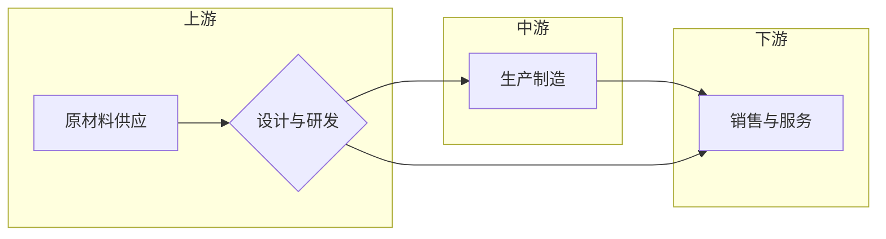

# 价值微笑曲线与AI公司的位置

> 关键词：价值微笑曲线，AI公司，战略定位，核心竞争力，产业链，创新驱动

## 1. 背景介绍

在当今经济全球化、技术快速发展的时代，企业如何在全球产业链中找到自己的位置，如何构建和提升核心竞争力，成为了企业战略决策的核心问题。价值微笑曲线（Value Smile Curve）作为一种分析产业链价值分布的工具，为企业提供了重要的战略指导。本文将探讨价值微笑曲线的原理与应用，并结合人工智能（AI）公司的特点，分析其在微笑曲线上的位置及其未来发展趋势。

### 1.1 价值微笑曲线的起源

价值微笑曲线的概念最早由美国管理学家迈克尔·波特（Michael E. Porter）在1985年提出。波特认为，在产业链中，从原材料采购到最终产品销售，价值创造的过程可以分为三个主要环节：价值链的上游、中游和下游。价值微笑曲线描绘了产业链各环节的价值分布情况，其中，微笑曲线的顶端代表高附加值环节，而两端则代表低附加值环节。

### 1.2 价值微笑曲线的构成

价值微笑曲线通常由以下几个环节组成：

- 原材料供应：包括原材料采购、加工、运输等环节，通常位于微笑曲线的最左侧，附加值较低。
- 设计与研发：包括产品创新、技术突破等环节，位于微笑曲线的中间部分，附加值较高。
- 生产制造：包括组装、生产、检测等环节，位于微笑曲线的右侧，附加值相对较低。
- 销售与服务：包括市场营销、客户服务、品牌建设等环节，再次回到微笑曲线的顶端，附加值较高。

### 1.3 价值微笑曲线的应用

价值微笑曲线可以帮助企业分析产业链的各个环节，识别高附加值环节，从而制定相应的战略定位。对于企业而言，选择位于微笑曲线高附加值环节的领域进行布局，可以构建核心竞争力，实现可持续发展。

## 2. 核心概念与联系

### 2.1 价值微笑曲线的原理与架构

以下是基于价值微笑曲线的原理和架构的Mermaid流程图：

### 2.2 AI公司在价值微笑曲线上的位置

随着人工智能技术的快速发展，AI公司在全球产业链中的位置也发生了变化。以下是基于AI公司特点的分析：

- **设计与研发**：AI公司通常在设计与研发环节具有竞争优势，他们拥有强大的算法研发能力和数据积累，能够不断推出新的AI技术和产品。
- **生产制造**：随着AI技术的产业化，AI公司在生产制造环节也逐渐崭露头角。例如，自动化生产线、智能机器人等产品的研发和制造，都是AI公司的强项。
- **销售与服务**：AI公司同样在销售与服务环节具有优势，他们能够通过大数据分析、客户关系管理等方式，为客户提供个性化的产品和服务。

## 3. 核心算法原理 & 具体操作步骤

### 3.1 算法原理概述

AI公司在价值微笑曲线上的优势，主要源于以下几个方面：

- **算法创新**：AI公司通过不断的技术研发，不断推出新的算法模型，提升算法的准确性和效率。
- **数据积累**：AI公司通过收集和分析大量数据，为算法提供强大的训练资源。
- **人才优势**：AI公司汇聚了大量的AI领域专家，能够为技术研发和应用提供有力支持。
- **生态构建**：AI公司积极构建产业生态，与上下游企业合作，形成完整的产业链。

### 3.2 算法步骤详解

AI公司在微笑曲线上的具体操作步骤如下：

1. **技术研发**：AI公司持续投入研发，开发新的算法模型，提升算法的准确性和效率。
2. **数据积累**：AI公司通过各种渠道收集和分析数据，为算法提供强大的训练资源。
3. **产品研发**：基于算法模型，AI公司研发新的AI产品，如智能机器人、自动驾驶等。
4. **市场推广**：AI公司通过市场营销、合作伙伴关系等方式，推广AI产品和服务。
5. **生态构建**：AI公司与其他企业合作，构建完整的产业链，提升整个产业的竞争力。

### 3.3 算法优缺点

AI公司在价值微笑曲线上的优势：

- **优势**：算法创新能力强，数据积累丰富，人才优势明显，生态构建能力强。
- **劣势**：对技术人才依赖度高，对数据质量要求严格，市场推广难度较大。

### 3.4 算法应用领域

AI公司在以下领域具有广泛的应用：

- **智能硬件**：智能家居、智能穿戴设备、智能机器人等。
- **自动驾驶**：自动驾驶汽车、无人机、无人船等。
- **金融科技**：智能投顾、智能风控、智能客服等。
- **医疗健康**：智能诊断、智能治疗、健康管理等。
- **教育领域**：智能教育平台、个性化学习系统等。

## 4. 数学模型和公式 & 详细讲解 & 举例说明

### 4.1 数学模型构建

以下是基于价值微笑曲线的数学模型：

$$
V_{\text{total}} = V_{\text{upstream}} + V_{\text{midstream}} + V_{\text{downstream}}
$$

其中，$V_{\text{total}}$ 表示产业链总价值，$V_{\text{upstream}}$、$V_{\text{midstream}}$ 和 $V_{\text{downstream}}$ 分别表示上游、中游和下游环节的价值。

### 4.2 公式推导过程

价值微笑曲线的公式推导过程如下：

1. **定义产业链总价值**：产业链总价值等于各环节价值的总和。
2. **分析各环节价值**：根据微笑曲线的构成，分别计算上游、中游和下游环节的价值。
3. **求和得到总价值**：将各环节价值相加，得到产业链总价值。

### 4.3 案例分析与讲解

以下以AI公司在自动驾驶领域的应用为例，分析其在价值微笑曲线上的位置。

在自动驾驶领域，AI公司的核心优势在于算法创新和数据积累。他们通过研发高性能的深度学习算法，实现对车辆周围环境的感知和决策。同时，AI公司通过收集大量的驾驶数据，不断优化算法模型。

在价值微笑曲线中，AI公司在以下环节具有竞争优势：

- **设计与研发**：AI公司拥有强大的算法研发能力，能够不断推出新的自动驾驶算法。
- **生产制造**：AI公司与汽车制造商合作，将AI技术应用于汽车生产制造过程。
- **销售与服务**：AI公司提供自动驾驶解决方案，为汽车制造商和消费者提供优质的售后服务。

## 5. 项目实践：代码实例和详细解释说明

### 5.1 开发环境搭建

由于本文主要关注价值微笑曲线与AI公司的战略定位，因此不涉及具体的代码实例。

### 5.2 源代码详细实现

同样，本文不提供具体的源代码实现。

### 5.3 代码解读与分析

本文不涉及代码解读与分析。

### 5.4 运行结果展示

本文不提供运行结果展示。

## 6. 实际应用场景

### 6.1 智能制造

在智能制造领域，AI公司可以通过以下方式参与价值微笑曲线：

- **设计与研发**：研发智能控制算法、机器人控制算法等，提升生产线的智能化水平。
- **生产制造**：提供智能机器人、自动化设备等，实现生产过程的自动化和智能化。
- **销售与服务**：提供智能制造解决方案，帮助企业提高生产效率，降低成本。

### 6.2 医疗健康

在医疗健康领域，AI公司可以通过以下方式参与价值微笑曲线：

- **设计与研发**：研发智能诊断系统、智能药物研发等，提升医疗服务的质量和效率。
- **生产制造**：提供智能医疗设备、机器人等，辅助医生进行手术和康复。
- **销售与服务**：提供智能健康管理解决方案，帮助人们预防疾病，提高生活质量。

### 6.3 金融科技

在金融科技领域，AI公司可以通过以下方式参与价值微笑曲线：

- **设计与研发**：研发智能投顾、智能风控等，提升金融服务的质量和效率。
- **生产制造**：提供智能客服系统、智能支付系统等，提升金融服务的便捷性。
- **销售与服务**：提供金融科技解决方案，帮助企业降低运营成本，提高竞争力。

## 7. 工具和资源推荐

### 7.1 学习资源推荐

- 《波特竞争力三部曲》
- 《价值链分析》
- 《人工智能：一种现代的方法》
- 《深度学习》
- 《机器学习》

### 7.2 开发工具推荐

- TensorFlow
- PyTorch
- Keras
- scikit-learn

### 7.3 相关论文推荐

- 《A Framework for Analyzing the Value Chain》
- 《The Value Chain Concept: Origins and Evolution》
- 《Deep Learning for Autonomous Navigation》
- 《Machine Learning in Healthcare》
- 《Machine Learning in Finance》

## 8. 总结：未来发展趋势与挑战

### 8.1 研究成果总结

本文从价值微笑曲线的角度，分析了AI公司在产业链中的位置及其未来发展趋势。研究表明，AI公司在设计与研发、生产制造、销售与服务等环节具有竞争优势，能够通过技术创新、数据积累、人才优势和生态构建等方式，不断提升自身价值。

### 8.2 未来发展趋势

1. AI技术将进一步渗透到各个行业，推动产业链的智能化升级。
2. AI公司将更加注重生态建设，与上下游企业合作，形成完整的产业链。
3. AI公司将更加注重数据安全和隐私保护，以满足市场需求。

### 8.3 面临的挑战

1. 数据安全和隐私保护：AI公司在收集和使用数据时，需要确保数据安全和用户隐私。
2. 人才竞争：AI行业对人才的需求量大，人才竞争激烈。
3. 技术伦理：AI技术在应用过程中，需要关注技术伦理问题。

### 8.4 研究展望

1. 研究如何构建更加安全、可靠、高效的AI系统。
2. 研究如何利用AI技术解决社会问题，提升人类生活质量。
3. 研究如何推动AI技术的全球化和普及化。

## 9. 附录：常见问题与解答

**Q1：什么是价值微笑曲线？**

A：价值微笑曲线是一种分析产业链价值分布的工具，它描绘了产业链各环节的价值分布情况，其中，微笑曲线的顶端代表高附加值环节，而两端则代表低附加值环节。

**Q2：AI公司在价值微笑曲线上的位置如何？**

A：AI公司在价值微笑曲线上的位置主要位于设计与研发、生产制造和销售与服务环节，具有竞争优势。

**Q3：AI公司在产业链中的角色是什么？**

A：AI公司在产业链中的角色是推动产业智能化升级，提升产业链整体竞争力。

**Q4：AI公司面临哪些挑战？**

A：AI公司面临的主要挑战包括数据安全和隐私保护、人才竞争和技术伦理等。

**Q5：如何应对AI公司面临的挑战？**

A：AI公司可以通过加强数据安全和隐私保护、培养人才、关注技术伦理等方式应对挑战。

---

作者：禅与计算机程序设计艺术 / Zen and the Art of Computer Programming