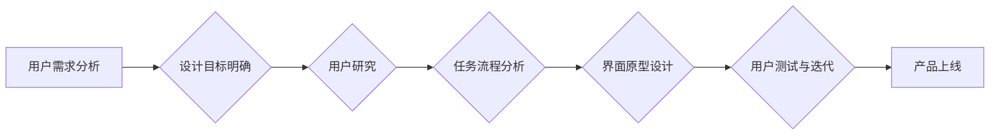

# 任务导向设计思维在CUI中的详细应用

> 关键词：任务导向设计，CUI（对话式用户界面），用户体验，设计流程，人工智能，自然语言处理

## 1. 背景介绍

随着人工智能技术的快速发展，对话式用户界面（CUI）作为一种新型的交互方式，逐渐成为人机交互领域的研究热点。CUI能够模拟人类对话，提供更加自然、便捷的用户体验。然而，如何设计出既符合用户需求又具有良好用户体验的CUI系统，成为了当前研究的一个重要课题。任务导向设计思维作为一种以用户为中心的设计方法，为CUI设计提供了新的思路。

## 2. 核心概念与联系

### 2.1 核心概念原理

#### 2.1.1 任务导向设计思维

任务导向设计思维是一种以用户为中心的设计方法，其核心思想是将用户的需求和目标作为设计的基础，通过深入了解用户在特定情境下的行为和任务，设计出符合用户习惯和需求的交互界面。

#### 2.1.2 对话式用户界面（CUI）

CUI是一种人机交互界面，通过自然语言交互的方式实现用户与系统之间的信息交流。CUI具有自然、直观、易用的特点，能够为用户提供更好的用户体验。

### 2.2 架构流程图

以下是一个简单的任务导向设计思维在CUI中的应用流程图：



## 3. 核心算法原理 & 具体操作步骤

### 3.1 算法原理概述

任务导向设计思维在CUI中的应用主要包括以下几个步骤：

1. 用户需求分析：通过调研、访谈等方式了解用户需求，明确设计目标。
2. 用户研究：深入了解用户背景、习惯和偏好，为设计提供依据。
3. 任务流程分析：分析用户在使用过程中的关键任务，确定交互流程。
4. 界面原型设计：根据任务流程和用户研究，设计符合用户习惯的交互界面。
5. 用户测试与迭代：通过用户测试收集反馈，对设计进行迭代优化。
6. 产品上线：将优化后的设计应用于实际产品。

### 3.2 算法步骤详解

#### 3.2.1 用户需求分析

用户需求分析是CUI设计的第一步，主要目的是明确设计目标和方向。具体步骤如下：

1. 确定用户群体：根据产品定位，明确目标用户群体。
2. 调研收集需求：通过问卷调查、访谈等方式，收集用户在使用现有产品或服务时的痛点和需求。
3. 分析需求：对收集到的需求进行分析，提炼出核心需求和设计目标。

#### 3.2.2 用户研究

用户研究旨在深入了解用户背景、习惯和偏好，为设计提供依据。具体步骤如下：

1. 用户画像：根据用户需求和特征，构建用户画像。
2. 用户行为分析：分析用户在现有产品或服务中的使用行为，了解用户习惯和偏好。
3. 用户反馈收集：通过用户测试、访谈等方式，收集用户对现有产品或服务的反馈。

#### 3.2.3 任务流程分析

任务流程分析是CUI设计的关键步骤，主要目的是确定交互流程。具体步骤如下：

1. 任务分解：将用户目标分解为一系列子任务。
2. 交互流程设计：根据任务分解结果，设计符合用户习惯的交互流程。
3. 交互模式选择：根据任务特性，选择合适的交互模式，如文本、语音、手势等。

#### 3.2.4 界面原型设计

界面原型设计是根据任务流程和用户研究，设计符合用户习惯的交互界面。具体步骤如下：

1. 界面布局：设计符合CUI特点的界面布局，包括输入框、按钮、提示框等元素。
2. 交互元素设计：设计符合用户习惯的交互元素，如按钮、菜单、滚动条等。
3. 交互动画设计：设计符合用户预期的交互动画，提升用户体验。

#### 3.2.5 用户测试与迭代

用户测试与迭代是CUI设计的重要环节，主要目的是通过用户反馈对设计进行优化。具体步骤如下：

1. 用户测试：邀请目标用户进行测试，收集用户反馈。
2. 数据分析：分析测试数据，找出设计中的问题。
3. 迭代优化：根据用户反馈和数据分析结果，对设计进行优化。

#### 3.2.6 产品上线

将优化后的设计应用于实际产品，并进行上线运营。

### 3.3 算法优缺点

#### 3.3.1 优点

1. 以用户为中心：关注用户需求，提升用户体验。
2. 符合用户习惯：设计符合用户习惯的交互界面。
3. 优化设计流程：简化设计流程，提高设计效率。

#### 3.3.2 缺点

1. 需要大量用户数据：设计过程中需要收集大量用户数据，成本较高。
2. 需要专业团队：设计过程中需要具备不同领域知识的专业团队。
3. 设计周期较长：从需求分析到产品上线，设计周期较长。

### 3.4 算法应用领域

任务导向设计思维在CUI中的应用非常广泛，以下是一些典型的应用领域：

1. 智能语音助手：如Siri、小爱同学等。
2. 智能客服系统：如阿里巴巴的智能客服系统。
3. 智能家居系统：如小米智能家居系统。
4. 智能驾驶系统：如特斯拉的自动驾驶系统。

## 4. 数学模型和公式 & 详细讲解 & 举例说明

### 4.1 数学模型构建

在CUI设计中，数学模型可以用来描述用户的行为、任务流程以及交互界面。以下是一个简单的数学模型示例：

$$
U = f(T, I, E)
$$

其中，$U$ 表示用户体验，$T$ 表示任务，$I$ 表示交互界面，$E$ 表示环境因素。

### 4.2 公式推导过程

假设用户完成任务 $T$ 时，需要与交互界面 $I$ 进行交互，并受到环境因素 $E$ 的影响。根据任务导向设计思维，我们可以推导出以下公式：

$$
U = f(T, I, E)
$$

其中，函数 $f$ 表示用户体验与任务、交互界面和环境因素之间的关系。

### 4.3 案例分析与讲解

以智能语音助手为例，我们可以将上述数学模型应用于实际场景：

1. 任务 $T$：用户查询天气预报。
2. 交互界面 $I$：语音输入框和语音输出框。
3. 环境因素 $E$：用户所处地点、天气状况等。

根据数学模型，我们可以分析用户体验 $U$ 的变化：

1. 如果用户所在地天气恶劣，交互界面设计为语音输入输出，则用户体验 $U$ 可能较好。
2. 如果用户所在地天气晴朗，交互界面设计为图形界面，则用户体验 $U$ 可能较差。

## 5. 项目实践：代码实例和详细解释说明

### 5.1 开发环境搭建

以Python为例，搭建CUI开发环境需要以下步骤：

1. 安装Python：从官方网站下载并安装Python。
2. 安装开发工具：安装PyCharm、Jupyter Notebook等开发工具。
3. 安装相关库：安装transformers、torch等库。

### 5.2 源代码详细实现

以下是一个简单的CUI示例代码：

```python
from transformers import AutoModelForCausalLM, AutoTokenizer

# 加载预训练模型和分词器
model = AutoModelForCausalLM.from_pretrained("gpt2")
tokenizer = AutoTokenizer.from_pretrained("gpt2")

# 定义交互函数
def interactive_chat():
    print("你好，我是你的AI助手，请问有什么可以帮助你的？")
    while True:
        text = input("你：")
        if text.strip() == "再见":
            print("AI助手：再见！")
            break
        inputs = tokenizer.encode(text, return_tensors="pt", add_special_tokens=True)
        outputs = model.generate(inputs, max_length=50)
        response = tokenizer.decode(outputs[0], skip_special_tokens=True)
        print("AI助手：" + response)

# 启动交互
interactive_chat()
```

### 5.3 代码解读与分析

上述代码使用transformers库加载了预训练的GPT-2模型和分词器。定义了一个交互函数`interactive_chat`，用于实现人机对话。在循环中，程序接收用户输入的文本，将其编码为模型所需的格式，并通过模型生成回复。最后将模型生成的回复解码为文本，并打印出来。

### 5.4 运行结果展示

运行上述代码后，程序会进入交互模式。用户可以通过输入文本与AI助手进行对话。例如，用户输入“今天的天气怎么样？”，AI助手会根据预训练的模型生成相应的回复。

## 6. 实际应用场景

### 6.1 智能语音助手

智能语音助手是一种常见的CUI应用场景。用户可以通过语音与智能语音助手进行交互，获取信息、执行任务等。

### 6.2 智能客服系统

智能客服系统可以通过CUI与用户进行交互，提供24小时在线服务，解答用户问题，提高服务效率。

### 6.3 智能家居系统

智能家居系统可以通过CUI与用户进行交互，实现远程控制家电、调节室内环境等功能。

### 6.4 智能驾驶系统

智能驾驶系统可以通过CUI与用户进行交互，提供导航、路况信息等功能。

## 7. 工具和资源推荐

### 7.1 学习资源推荐

1. 《人机交互设计原理与方法》
2. 《用户体验设计》
3. 《深度学习与自然语言处理》

### 7.2 开发工具推荐

1. PyCharm
2. Jupyter Notebook
3. transformers库

### 7.3 相关论文推荐

1. "Designing Conversational Agents with a关注User-Centered Approach"
2. "A Survey of User Experience in Human-Computer Interaction"
3. "Designing Conversational Agents with a Focus on Conversational Flow and User Experience"

## 8. 总结：未来发展趋势与挑战

### 8.1 研究成果总结

本文从任务导向设计思维的角度，详细探讨了CUI设计的方法和步骤。通过分析用户需求、进行用户研究、设计交互界面，最终实现一个既符合用户需求又具有良好用户体验的CUI系统。

### 8.2 未来发展趋势

1. 多模态交互：CUI将与图像、视频、语音等多模态交互技术相结合，提供更加丰富的用户体验。
2. 智能化：CUI将具备更强的智能化能力，能够更好地理解用户意图，提供更加个性化的服务。
3. 个性化：CUI将根据用户的行为和喜好，提供个性化的交互体验。

### 8.3 面临的挑战

1. 用户体验：如何设计出既符合用户需求又具有良好用户体验的CUI系统，是一个重要的挑战。
2. 智能化：如何提高CUI的智能化水平，使其更好地理解用户意图，是一个关键挑战。
3. 个性化：如何根据用户的行为和喜好，提供个性化的交互体验，是一个具有挑战性的问题。

### 8.4 研究展望

未来，任务导向设计思维在CUI中的应用将更加深入，有望在以下几个方面取得突破：

1. 提高用户体验：通过深入研究用户行为和需求，设计出更加符合用户习惯的CUI系统。
2. 增强智能化：结合自然语言处理、机器学习等技术，提高CUI的智能化水平。
3. 实现个性化：根据用户的行为和喜好，提供个性化的交互体验。

## 9. 附录：常见问题与解答

**Q1：任务导向设计思维在CUI设计中的具体应用步骤是什么？**

A：任务导向设计思维在CUI设计中的具体应用步骤包括用户需求分析、用户研究、任务流程分析、界面原型设计、用户测试与迭代以及产品上线。

**Q2：CUI设计需要注意哪些方面？**

A：CUI设计需要注意以下方面：
1. 用户体验：关注用户需求，提升用户体验。
2. 交互设计：设计符合用户习惯的交互界面。
3. 智能化：提高CUI的智能化水平。
4. 个性化：根据用户的行为和喜好，提供个性化的交互体验。

**Q3：如何进行用户测试？**

A：用户测试可以通过以下方式进行：
1. 设计测试场景：根据CUI设计，设计不同的测试场景。
2. 邀请用户参与：邀请目标用户参与测试。
3. 收集反馈：收集用户在测试过程中的反馈。
4. 分析数据：分析测试数据，找出设计中的问题。

**Q4：CUI设计需要哪些工具和技术？**

A：CUI设计需要以下工具和技术：
1. 开发工具：PyCharm、Jupyter Notebook等。
2. 人工智能技术：自然语言处理、机器学习等。
3. 设计工具：Sketch、Axure等。

作者：禅与计算机程序设计艺术 / Zen and the Art of Computer Programming