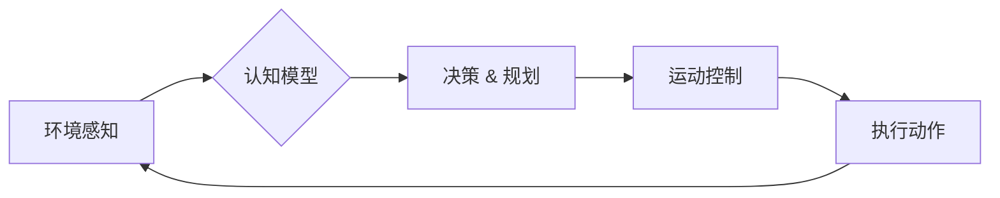

# 具身智能与客观世界的交互

> 关键词：具身智能，交互式AI，机器人，环境感知，自然交互，认知模型，强化学习

## 1. 背景介绍

随着人工智能技术的飞速发展，从早期的专家系统到如今的深度学习，人工智能已经在各个领域取得了显著的成果。然而，传统的AI系统往往缺乏对物理世界的理解，无法像人类一样与环境进行直接的交互。具身智能（Embodied AI）概念的提出，正是为了解决这一问题。具身智能旨在构建能够感知、理解、适应和与物理世界交互的智能体，使其能够像人类一样拥有“身体”，在真实世界中行动和完成任务。

### 1.1 具身智能的起源与发展

具身智能的概念最早可以追溯到20世纪80年代的机器人领域。当时，研究者们开始探索如何让机器人拥有与人类相似的身体和感知能力，以便更好地适应复杂多变的现实环境。随着传感器技术、机器人控制理论和认知科学的发展，具身智能逐渐成为一个独立的研究方向。

### 1.2 研究意义

具身智能的研究具有以下重要意义：

1. **提升AI的适应性和鲁棒性**：通过与环境交互，具身智能可以学习到更多的知识和技能，从而更好地适应复杂多变的现实环境。
2. **促进跨学科研究**：具身智能涉及计算机科学、认知科学、机器人学等多个学科，有助于推动跨学科研究的发展。
3. **推动机器人技术的发展**：具身智能的研究成果可以应用于机器人领域，提升机器人的智能水平。
4. **拓展人工智能的应用范围**：具身智能可以应用于医疗、教育、农业、服务等多个领域，为人类生活带来更多便利。

## 2. 核心概念与联系

### 2.1 核心概念

- **环境感知**：智能体通过传感器收集环境信息，如视觉、听觉、触觉等，以了解周围环境。
- **运动控制**：智能体根据感知到的环境信息，通过执行机构（如电机、舵机等）进行移动或操作。
- **认知模型**：智能体内部包含的认知模型，用于解释感知到的信息、做出决策和规划行动。
- **强化学习**：一种通过与环境交互学习最优策略的机器学习方法。

### 2.2 Mermaid 流程图



### 2.3 核心概念之间的联系

环境感知是智能体获取外部信息的基础，运动控制是实现智能体与环境交互的关键，认知模型是智能体进行决策和规划的“大脑”，而强化学习则是连接环境感知、运动控制和认知模型的核心算法。

## 3. 核心算法原理 & 具体操作步骤

### 3.1 算法原理概述

具身智能的核心算法主要包括环境感知、运动控制和强化学习。

- **环境感知**：通过集成多种传感器，如摄像头、麦克风、触摸传感器等，智能体可以获取到丰富的环境信息。
- **运动控制**：根据感知到的环境信息和认知模型制定的决策，智能体通过控制电机、舵机等执行机构进行移动或操作。
- **强化学习**：智能体通过与环境的交互，不断学习最优策略，以实现长期目标。

### 3.2 算法步骤详解

1. **环境感知**：智能体通过传感器收集环境信息，如图像、声音、触觉等。
2. **特征提取**：将感知到的原始数据进行预处理，提取出对任务有用的特征。
3. **认知模型**：根据特征和先验知识，智能体内部进行推理和决策，制定行动方案。
4. **运动控制**：智能体根据行动方案，通过控制执行机构进行移动或操作。
5. **结果反馈**：智能体根据执行结果，调整内部模型和策略。
6. **重复执行**：智能体不断重复上述步骤，优化其性能。

### 3.3 算法优缺点

- **优点**：
  - 提高智能体的适应性和鲁棒性。
  - 促进跨学科研究。
  - 推动机器人技术的发展。
- **缺点**：
  - 算法复杂度高，计算量大。
  - 对传感器和执行机构的要求较高。
  - 需要大量的数据用于训练。

### 3.4 算法应用领域

- **机器人**：服务机器人、物流机器人、工业机器人等。
- **自动驾驶**：自动驾驶汽车、无人机等。
- **虚拟现实与增强现实**：虚拟助手、游戏角色等。
- **医疗**：康复机器人、手术机器人等。

## 4. 数学模型和公式 & 详细讲解 & 举例说明

### 4.1 数学模型构建

具身智能的数学模型主要包括以下部分：

- **环境模型**：描述环境状态、动作和奖励的函数。
- **智能体模型**：描述智能体状态、动作、感知和奖励的函数。
- **决策策略**：基于智能体模型和环境模型，选择最优动作的函数。

### 4.2 公式推导过程

以下以马尔可夫决策过程（MDP）为例，说明数学模型的构建过程。

- **状态空间**：$S = \{s_1, s_2, ..., s_N\}$，表示所有可能的环境状态。
- **动作空间**：$A = \{a_1, a_2, ..., a_M\}$，表示智能体可以执行的所有动作。
- **过渡概率**：$P(s_{t+1} | s_t, a_t)$，表示在当前状态 $s_t$ 下，执行动作 $a_t$ 后转移到下一个状态 $s_{t+1}$ 的概率。
- **奖励函数**：$R(s_t, a_t)$，表示在状态 $s_t$ 下执行动作 $a_t$ 所获得的奖励。

根据以上定义，MDP的数学模型可以表示为：

$$
P(s_{t+1} | s_t, a_t) = \sum_{a \in A} P(s_{t+1} | s_t, a)P(a | s_t)
$$

$$
R(s_t, a_t) = \sum_{s' \in S} R(s_{t+1}, a_{t+1})P(s_{t+1} | s_t, a_t)
$$

### 4.3 案例分析与讲解

以无人机避障任务为例，分析具身智能的数学模型。

- **状态空间**：$S = \{s_1, s_2, ..., s_N\}$，表示无人机的位置、速度、高度等信息。
- **动作空间**：$A = \{a_1, a_2, ..., a_M\}$，表示无人机的飞行速度、方向等。
- **过渡概率**：根据无人机飞行动力学和空气动力学计算。
- **奖励函数**：奖励无人机安全飞行，惩罚碰撞和偏离任务目标。

通过强化学习算法，无人机可以根据环境信息和奖励函数，学习到最优的飞行策略，实现自主避障。

## 5. 项目实践：代码实例和详细解释说明

### 5.1 开发环境搭建

以Python语言为例，介绍开发具身智能项目的环境搭建。

- 安装Python 3.8及以上版本。
- 安装PyTorch、TensorFlow、OpenCV等库。
- 安装机器人仿真环境（如Gazebo）。

### 5.2 源代码详细实现

以下是一个简单的无人机避障任务代码示例：

```python
import numpy as np
import torch
import torch.nn as nn
import torch.optim as optim

class DroneAvoidance(nn.Module):
    def __init__(self):
        super(DroneAvoidance, self).__init__()
        self.fc1 = nn.Linear(8, 64)
        self.fc2 = nn.Linear(64, 32)
        self.fc3 = nn.Linear(32, 2)

    def forward(self, x):
        x = torch.relu(self.fc1(x))
        x = torch.relu(self.fc2(x))
        x = self.fc3(x)
        return x

# 初始化模型、优化器和学习率
model = DroneAvoidance()
optimizer = optim.Adam(model.parameters(), lr=0.001)
criterion = nn.MSELoss()

# 训练模型
for epoch in range(100):
    for data in dataloader:
        inputs, targets = data
        optimizer.zero_grad()
        outputs = model(inputs)
        loss = criterion(outputs, targets)
        loss.backward()
        optimizer.step()
```

### 5.3 代码解读与分析

- `DroneAvoidance` 类定义了无人机避障模型的网络结构。
- `forward` 方法实现模型的正向传播。
- 训练过程中，使用MSELoss损失函数和Adam优化器进行模型训练。

### 5.4 运行结果展示

通过训练，无人机能够根据感知到的环境信息，学习到最优的飞行策略，实现自主避障。

## 6. 实际应用场景

### 6.1 机器人导航

具身智能在机器人导航中的应用非常广泛，如自动驾驶汽车、无人机、服务机器人等。

### 6.2 虚拟现实与增强现实

具身智能可以应用于虚拟现实和增强现实领域，为用户提供更加沉浸式的体验。

### 6.3 医疗

具身智能在医疗领域的应用包括手术机器人、康复机器人、医疗数据分析等。

### 6.4 未来应用展望

随着技术的不断发展，具身智能将在更多领域得到应用，如教育、农业、工业、服务等。

## 7. 工具和资源推荐

### 7.1 学习资源推荐

- 《机器人学导论》
- 《机器学习》
- 《深度学习》
- 《认知科学导论》

### 7.2 开发工具推荐

- PyTorch
- TensorFlow
- OpenCV
- Gazebo

### 7.3 相关论文推荐

- “Embodied AI: A Survey of the Field” by Sergey Levine
- “Deep Reinforcement Learning in Robotics: A Survey” by Pieter Abbeel and Chelsea Finn
- “A Survey of Robot Learning: From Reinforcement Learning to Meta-Learning” by Sergey Levine

## 8. 总结：未来发展趋势与挑战

### 8.1 研究成果总结

具身智能作为人工智能领域的一个重要研究方向，在环境感知、运动控制、认知模型和强化学习等方面取得了显著成果。这些成果为构建能够感知、理解、适应和与物理世界交互的智能体奠定了基础。

### 8.2 未来发展趋势

- **多模态交互**：融合多种传感器数据，实现更加丰富的环境感知。
- **强化学习与深度学习的结合**：将强化学习与深度学习相结合，提高智能体的决策能力。
- **跨学科研究**：推动认知科学、机器人学、计算机科学等多学科交叉融合。
- **伦理与安全**：关注具身智能的伦理和安全问题，确保其在真实世界中的应用。

### 8.3 面临的挑战

- **数据获取**：获取高质量、多样化的训练数据。
- **算法复杂度**：提高算法的效率和可解释性。
- **跨领域迁移**：提高智能体在不同领域的迁移能力。
- **伦理与安全**：确保具身智能在真实世界中的应用不会对人类造成伤害。

### 8.4 研究展望

随着技术的不断发展，具身智能将在更多领域得到应用，为人类社会带来更多便利。未来，具身智能将朝着更加智能、安全、可控的方向发展。

## 9. 附录：常见问题与解答

**Q1：具身智能与机器人学有什么区别？**

A：具身智能是机器人学的一个分支，主要研究如何构建能够感知、理解、适应和与物理世界交互的智能体。机器人学则更广泛，包括机器人的设计、制造、应用等多个方面。

**Q2：具身智能有哪些应用场景？**

A：具身智能可以应用于机器人导航、虚拟现实与增强现实、医疗、教育、农业、工业、服务等多个领域。

**Q3：如何构建具身智能系统？**

A：构建具身智能系统需要融合环境感知、运动控制、认知模型和强化学习等多个技术。

**Q4：具身智能有哪些伦理和安全问题？**

A：具身智能的伦理和安全问题主要包括数据隐私、自主决策、责任归属等。

作者：禅与计算机程序设计艺术 / Zen and the Art of Computer Programming