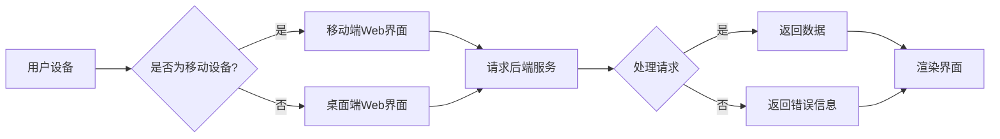

# 基于Java的智能家居设计：打造响应式智能家居前端界面 - Java与Web整合

> 关键词：Java, 智能家居, 前端界面, Web技术, 响应式设计, Spring Boot, Spring MVC, JavaScript, HTML5, CSS3

## 1. 背景介绍

随着物联网（IoT）技术的飞速发展，智能家居已经成为现代家庭生活的重要组成部分。智能家居系统通过集成各种传感器、执行器和控制中心，为用户提供便捷、舒适、安全的居住环境。然而，构建一个高效、易用的智能家居前端界面，是整个系统设计的关键。本文将探讨如何利用Java技术栈，结合Web开发技术，打造一个响应式的智能家居前端界面。

### 1.1 智能家居的发展现状

智能家居市场近年来呈现出快速增长的趋势，各种智能设备层出不穷。从传统的照明、空调、安防系统，到新兴的语音助手、健康监测、家庭娱乐等，智能家居应用场景日益丰富。然而，市场上现有的智能家居系统前端界面普遍存在以下问题：

- **用户体验不佳**：界面设计不够友好，交互操作复杂，缺乏个性化定制。
- **响应速度慢**：页面加载时间长，交互响应慢，影响用户体验。
- **兼容性差**：不同设备、不同操作系统上的界面体验不一致。

### 1.2 本文目标

本文旨在探讨如何利用Java技术栈和Web开发技术，构建一个响应式的智能家居前端界面。通过整合Spring Boot、Spring MVC、JavaScript、HTML5、CSS3等技术，实现一个高效、易用、跨平台的智能家居系统前端界面。

## 2. 核心概念与联系

### 2.1 核心概念

- **Java**：一种面向对象的编程语言，具有良好的跨平台性和丰富的生态系统。
- **Spring Boot**：一个基于Spring框架的微服务框架，简化了Java Web应用的开发。
- **Spring MVC**：Spring框架的一部分，用于构建Web应用，实现MVC设计模式。
- **JavaScript**：一种客户端脚本语言，用于实现网页的交互性和动态效果。
- **HTML5**：最新的HTML标准，提供了丰富的多媒体和交互功能。
- **CSS3**：用于样式设计的CSS扩展，支持响应式布局和动画效果。

### 2.2 架构流程图



## 3. 核心算法原理 & 具体操作步骤

### 3.1 算法原理概述

智能家居前端界面设计主要涉及以下几个方面：

- **用户界面设计**：根据用户需求设计直观、易用的界面布局和交互方式。
- **数据交互**：利用Web技术实现前端与后端的数据交换。
- **响应式设计**：根据设备屏幕尺寸和分辨率自动调整界面布局和元素大小。

### 3.2 算法步骤详解

1. **需求分析**：深入了解用户需求，确定智能家居系统的功能模块和界面设计要求。
2. **界面设计**：使用HTML5和CSS3设计响应式的界面布局和样式。
3. **数据交互**：使用JavaScript和Ajax技术实现前端与后端的数据交互。
4. **后端开发**：使用Spring Boot和Spring MVC开发后端服务，提供数据接口和业务逻辑。
5. **系统集成**：将前端界面与后端服务进行集成，实现智能家居系统的整体功能。

### 3.3 算法优缺点

**优点**：

- **跨平台性**：基于Web技术的前端界面可以在不同操作系统和设备上运行。
- **易用性**：使用Java技术栈可以快速开发功能丰富、易用的智能家居系统。
- **可扩展性**：系统架构灵活，方便后续扩展和维护。

**缺点**：

- **性能**：Web前端界面相比原生应用可能存在一定的性能差距。
- **安全性**：Web技术存在一定的安全风险，需要加强安全防护措施。

### 3.4 算法应用领域

基于Java的智能家居前端界面设计可以应用于以下领域：

- **家庭娱乐系统**：实现家庭影院、游戏、音乐播放等功能。
- **家庭安防系统**：实现监控视频查看、报警通知等功能。
- **家庭环境控制系统**：实现灯光、温度、湿度等环境参数的控制。
- **健康管理系统**：实现健康数据监测、运动建议等功能。

## 4. 数学模型和公式 & 详细讲解 & 举例说明

### 4.1 数学模型构建

智能家居前端界面设计主要涉及以下数学模型：

- **线性规划**：用于优化界面布局，实现最佳视觉效果。
- **决策树**：用于实现智能推荐功能，根据用户喜好推荐智能家居设备或服务。

### 4.2 公式推导过程

线性规划公式如下：

$$
\begin{align*}
\min\ & Z = \sum_{i=1}^{n} c_i x_i \\
\text{s.t.} \quad & a_{ij} x_i + b_i \leq 0 \quad \forall j \\
& x_i \geq 0 \quad \forall i
\end{align*}
$$

其中，$c_i$ 为第 $i$ 个变量的系数，$x_i$ 为第 $i$ 个变量的值，$a_{ij}$ 为第 $i$ 个变量在第 $j$ 个约束条件下的系数，$b_i$ 为第 $i$ 个约束条件的右侧值。

### 4.3 案例分析与讲解

以家庭环境控制系统为例，设计一个温度调节界面。用户可以通过界面调整空调温度，系统根据用户设定的温度和当前环境温度，自动控制空调的开启和关闭。

```html
<!-- 温度调节界面 -->
<div id="temperature-control">
    <label for="temperature">当前温度：</label>
    <span id="current-temperature">25</span>°C
    <button onclick="adjustTemperature(1)">升温</button>
    <button onclick="adjustTemperature(-1)">降温</button>
</div>

<script>
function adjustTemperature(delta) {
    var currentTemperature = parseInt(document.getElementById('current-temperature').innerText);
    var newTemperature = currentTemperature + delta;
    // 调用后端接口控制空调
    // ...
    document.getElementById('current-temperature').innerText = newTemperature + '°C';
}
</script>
```

## 5. 项目实践：代码实例和详细解释说明

### 5.1 开发环境搭建

1. 安装Java开发环境（如JDK 1.8以上版本）。
2. 安装IDE（如IntelliJ IDEA、Eclipse等）。
3. 安装Maven或Gradle构建工具。
4. 安装Node.js和npm（用于前端开发）。

### 5.2 源代码详细实现

以下是一个简单的智能家居前端界面示例代码：

```html
<!-- index.html -->
<!DOCTYPE html>
<html lang="en">
<head>
    <meta charset="UTF-8">
    <title>智能家居</title>
    <link rel="stylesheet" href="styles.css">
</head>
<body>
    <div id="header">
        <h1>智能家居</h1>
    </div>
    <div id="content">
        <div id="light-control">
            <h2>灯光控制</h2>
            <button onclick="toggleLight()">开关灯光</button>
        </div>
        <div id="temperature-control">
            <h2>温度控制</h2>
            <label for="temperature">当前温度：</label>
            <span id="current-temperature">25</span>°C
            <button onclick="adjustTemperature(1)">升温</button>
            <button onclick="adjustTemperature(-1)">降温</button>
        </div>
    </div>
    <script src="scripts.js"></script>
</body>
</html>
```

```css
/* styles.css */
#header {
    background-color: #333;
    color: #fff;
    padding: 10px;
    text-align: center;
}

#content {
    display: flex;
    justify-content: space-around;
    padding: 20px;
}

#light-control, #temperature-control {
    width: 300px;
    border: 1px solid #ccc;
    padding: 10px;
}

button {
    background-color: #4CAF50;
    color: white;
    padding: 10px 20px;
    border: none;
    cursor: pointer;
}
```

```javascript
// scripts.js
function toggleLight() {
    // 调用后端接口控制灯光
    // ...
}

function adjustTemperature(delta) {
    var currentTemperature = parseInt(document.getElementById('current-temperature').innerText);
    var newTemperature = currentTemperature + delta;
    // 调用后端接口控制空调
    // ...
    document.getElementById('current-temperature').innerText = newTemperature + '°C';
}
```

### 5.3 代码解读与分析

- `index.html`：定义了智能家居前端界面的结构，包括头部、内容区域等。
- `styles.css`：定义了界面样式，包括头部背景颜色、内容布局、按钮样式等。
- `scripts.js`：定义了与后端交互的JavaScript函数，包括切换灯光和调整温度。

### 5.4 运行结果展示

通过浏览器打开`index.html`文件，可以看到一个简单的智能家居前端界面，包括灯光控制和温度控制功能。用户可以通过界面切换灯光和调整温度。

## 6. 实际应用场景

基于Java的智能家居前端界面可以应用于以下实际场景：

- **智能家庭控制中心**：用户可以通过手机、平板电脑等设备访问智能家居系统，实现对家中设备的远程控制。
- **智慧社区管理平台**：物业管理员可以通过平台查看社区内智能家居设备的运行状态，进行故障排查和维护。
- **智能家居设备厂商**：将前端界面集成到自家的智能家居设备中，提升用户体验。

## 7. 工具和资源推荐

### 7.1 学习资源推荐

- 《Java核心技术》
- 《Spring Boot实战》
- 《JavaScript高级程序设计》
- 《HTML5与CSS3权威指南》

### 7.2 开发工具推荐

- IntelliJ IDEA
- Eclipse
- Chrome DevTools
- Postman

### 7.3 相关论文推荐

- 《Responsive Web Design: 7 Lessons Learned》
- 《A Comparison of Mobile Web, Native, and Hybrid Apps》
- 《The State of Progressive Web Apps》

## 8. 总结：未来发展趋势与挑战

### 8.1 研究成果总结

本文介绍了如何利用Java技术栈和Web开发技术，构建一个响应式的智能家居前端界面。通过整合Spring Boot、Spring MVC、JavaScript、HTML5、CSS3等技术，实现了高效、易用、跨平台的智能家居系统前端界面。

### 8.2 未来发展趋势

随着技术的不断发展，智能家居前端界面设计将呈现以下趋势：

- **更加智能化**：前端界面将具备更加智能的交互功能，如语音识别、手势控制等。
- **更加个性化**：根据用户喜好和需求，提供个性化的界面定制和功能配置。
- **更加安全可靠**：加强前端界面安全性，防止数据泄露和恶意攻击。

### 8.3 面临的挑战

智能家居前端界面设计面临着以下挑战：

- **兼容性**：需要考虑不同设备和浏览器的兼容性问题。
- **安全性**：需要加强前端界面的安全防护措施，防止数据泄露和恶意攻击。
- **性能优化**：需要优化前端界面性能，提高用户体验。

### 8.4 研究展望

未来，智能家居前端界面设计将朝着更加智能化、个性化、安全可靠的方向发展。通过技术创新和应用创新，智能家居前端界面将为用户带来更加便捷、舒适、安全的居住体验。

## 9. 附录：常见问题与解答

**Q1：如何实现智能家居前端界面的跨平台性？**

A：使用Web技术可以实现对不同操作系统和设备的跨平台支持。通过适配不同的设备和浏览器，确保前端界面在不同平台上都能正常运行。

**Q2：如何提高智能家居前端界面的安全性？**

A：加强前端界面的安全防护措施，如使用HTTPS协议、进行数据加密、防止XSS攻击等。同时，加强用户身份验证和权限控制，确保只有授权用户才能访问智能家居系统。

**Q3：如何优化智能家居前端界面的性能？**

A：优化前端代码，减少HTTP请求和页面加载时间。使用缓存技术，减少数据传输量。使用CSS3动画和JavaScript异步加载，提高页面交互性能。

**Q4：如何实现智能家居前端界面的个性化定制？**

A：通过用户喜好设置或问卷调查，收集用户偏好信息。根据用户喜好，动态调整前端界面样式、功能模块和布局。

**Q5：如何将智能家居前端界面与后端服务进行集成？**

A：使用HTTP协议进行前后端通信，通过Ajax技术实现异步数据交互。后端服务提供数据接口和业务逻辑，前端界面通过调用接口获取数据和执行业务操作。