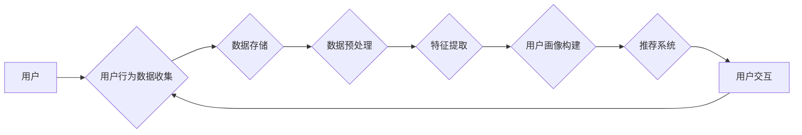

> 电商平台，用户行为分析，大数据分析，机器学习，推荐系统，个性化营销

# 基于大数据的电商平台用户行为的分析与应用研究

## 1. 背景介绍

随着互联网的普及和电子商务的快速发展，电商平台已经成为人们日常生活中不可或缺的一部分。电商平台通过提供丰富的商品、便捷的购物体验和个性化的推荐服务，吸引了大量用户。然而，在电商竞争日益激烈的市场环境中，如何深入了解用户行为，提高用户满意度，增加销售额，成为电商平台面临的重要挑战。

大数据技术的兴起为电商平台提供了强大的数据支持，通过对海量用户行为数据的分析，电商平台可以实现精准营销、个性化推荐、用户画像构建等功能，从而提升用户体验和商业价值。本文旨在探讨基于大数据的电商平台用户行为的分析与应用研究，分析用户行为数据，挖掘用户需求，为电商平台提供决策支持。

## 2. 核心概念与联系

### 2.1 核心概念

#### 2.1.1 大数据
大数据是指规模巨大、类型繁多、价值密度低的数据集合，无法通过传统数据处理应用软件工具进行捕捉、管理和处理的数据集合。大数据具有4V特点：Volume（大量）、Velocity（高速）、Variety（多样）和Value（价值）。

#### 2.1.2 用户行为
用户行为是指用户在使用电商平台过程中产生的各种操作，包括浏览、搜索、购买、评论等。用户行为数据反映了用户的需求、兴趣和偏好。

#### 2.1.3 机器学习
机器学习是指使计算机系统能够从数据中学习并做出决策或预测的技术。机器学习算法可以根据历史数据预测用户未来的行为。

#### 2.1.4 推荐系统
推荐系统是一种信息过滤系统，根据用户的历史行为和兴趣，向用户推荐相关商品、内容或服务。

#### 2.1.5 个性化营销
个性化营销是指根据用户的个性化需求和行为，提供定制化的营销策略和产品推荐。

### 2.2 核心概念原理和架构的 Mermaid 流程图



## 3. 核心算法原理 & 具体操作步骤

### 3.1 算法原理概述

基于大数据的电商平台用户行为分析主要涉及以下算法：

#### 3.1.1 数据预处理
数据预处理包括数据清洗、数据整合、数据转换等步骤，旨在提高数据质量，为后续分析提供可靠的数据基础。

#### 3.1.2 特征提取
特征提取是指从原始数据中提取出对分析任务有用的信息，如用户浏览记录、购买记录、评论内容等。

#### 3.1.3 用户画像构建
用户画像是指根据用户的历史行为数据，对用户的兴趣、需求、偏好等进行刻画，以便进行个性化推荐和营销。

#### 3.1.4 推荐系统
推荐系统根据用户画像和商品信息，为用户推荐相关商品。

### 3.2 算法步骤详解

基于大数据的电商平台用户行为分析的具体操作步骤如下：

1. 数据收集：通过日志、API接口等方式收集用户在电商平台上的行为数据。
2. 数据存储：将收集到的数据存储到数据库或分布式文件系统。
3. 数据预处理：对数据进行清洗、整合、转换等操作，提高数据质量。
4. 特征提取：从预处理后的数据中提取有用信息，如用户浏览记录、购买记录、评论内容等。
5. 用户画像构建：根据提取的特征，构建用户画像。
6. 推荐系统：根据用户画像和商品信息，为用户推荐相关商品。
7. 用户交互：收集用户对推荐结果的评价，为推荐系统提供反馈。

### 3.3 算法优缺点

#### 3.3.1 优点

- 高效处理海量数据，提供实时的用户行为分析。
- 可以根据用户个性化需求提供精准的推荐和营销。
- 有助于电商平台提升用户体验和商业价值。

#### 3.3.2 缺点

- 需要大量的数据和技术支持。
- 用户隐私保护问题。
- 模型泛化能力有限。

### 3.4 算法应用领域

基于大数据的电商平台用户行为分析广泛应用于以下领域：

- 个性化推荐
- 营销活动策划
- 用户行为预测
- 产品优化
- 风险控制

## 4. 数学模型和公式 & 详细讲解 & 举例说明

### 4.1 数学模型构建

用户行为分析中的数学模型主要包括：

#### 4.1.1 贝叶斯网络

贝叶斯网络是一种概率图模型，可以表示用户行为之间的概率关系。

#### 4.1.2 协同过滤

协同过滤是一种基于用户和物品相似度的推荐算法，可以用于推荐商品。

#### 4.1.3 支持向量机

支持向量机是一种分类算法，可以用于用户行为预测。

### 4.2 公式推导过程

以贝叶斯网络为例，假设用户行为 $X$ 和商品 $Y$ 之间的关系可以用贝叶斯网络表示，则有：

$$
P(X|Y) = \frac{P(Y|X)P(X)}{P(Y)}
$$

其中，$P(X|Y)$ 表示在已知商品 $Y$ 的情况下，用户行为 $X$ 发生的概率，$P(Y|X)$ 表示在已知用户行为 $X$ 的情况下，商品 $Y$ 发生的概率，$P(X)$ 表示用户行为 $X$ 发生的概率，$P(Y)$ 表示商品 $Y$ 发生的概率。

### 4.3 案例分析与讲解

以电商平台个性化推荐为例，我们使用协同过滤算法进行推荐。

假设用户 $u$ 对商品 $i$ 和 $j$ 的评分分别为 $r_{ui}$ 和 $r_{uj}$，用户 $v$ 对商品 $i$ 和 $j$ 的评分分别为 $r_{vi}$ 和 $r_{vj}$。则用户 $u$ 和 $v$ 的相似度为：

$$
s_{uv} = \frac{|r_{ui}-r_{uj}|+|r_{vi}-r_{vj}|}{|r_{ui}-r_{uj}|+|r_{vi}-r_{vj}|}
$$

根据用户 $u$ 和 $v$ 的相似度，以及用户 $v$ 对商品 $j$ 的评分 $r_{vj}$，为用户 $u$ 推荐商品 $j$ 的推荐分数为：

$$
r_{uj}^* = r_{uj} + s_{uv}(r_{vj}-r_{uj})
$$

通过计算用户 $u$ 对所有商品的推荐分数，选出分数最高的商品作为推荐结果。

## 5. 项目实践：代码实例和详细解释说明

### 5.1 开发环境搭建

由于篇幅限制，这里不提供具体的开发环境搭建步骤。一般而言，需要安装 Python、TensorFlow 或 PyTorch 等机器学习框架，以及 MySQL 或 MongoDB 等数据库。

### 5.2 源代码详细实现

以下是一个简单的基于协同过滤的推荐系统代码示例：

```python
import pandas as pd
import numpy as np
from sklearn.metrics.pairwise import cosine_similarity

# 加载数据
data = pd.read_csv('ratings.csv')

# 计算用户相似度
user_similarity = cosine_similarity(data)

# 为用户推荐商品
def recommend(user_id, user_similarity, data, top_k=10):
    # 获取用户相似度最高的用户
    similar_users = user_similarity[user_id].argsort()[::-1][1:top_k+1]
    # 获取相似用户的评分
    similar_user_ratings = data.loc[similar_users].mean()
    # 计算推荐分数
    recommended_ratings = data.loc[user_id] * user_similarity[user_id]
    # 获取推荐分数最高的商品
    recommended_items = recommended_ratings.argsort()[::-1][1:top_k+1]
    return recommended_items

# 推荐结果
recommended_items = recommend(0, user_similarity, data, top_k=10)
print('推荐商品：', recommended_items)
```

### 5.3 代码解读与分析

以上代码使用协同过滤算法为用户推荐商品。首先，加载用户评分数据；然后，计算用户相似度；接着，为用户推荐相似用户评分最高的商品。

### 5.4 运行结果展示

运行以上代码，可以得到用户0的推荐商品列表。

## 6. 实际应用场景

基于大数据的电商平台用户行为分析在实际应用中具有广泛的应用场景，以下列举几个典型应用：

### 6.1 个性化推荐

根据用户的历史行为和兴趣，为用户推荐相关商品，提高用户满意度和转化率。

### 6.2 营销活动策划

根据用户画像，制定精准的营销活动，提高活动效果。

### 6.3 用户行为预测

预测用户未来的行为，为电商平台提供决策支持。

### 6.4 产品优化

根据用户反馈和需求，优化产品功能和用户体验。

### 6.5 风险控制

通过分析用户行为，识别潜在的风险用户，降低平台风险。

## 7. 工具和资源推荐

### 7.1 学习资源推荐

- 《Python数据科学手册》
- 《机器学习实战》
- 《深度学习》

### 7.2 开发工具推荐

- TensorFlow
- PyTorch
- Hadoop
- Spark

### 7.3 相关论文推荐

- Collaborative Filtering for Pairwise Ranking
- Matrix Factorization Techniques for Recommender Systems
- A Latent Factor Model for Relational Data

## 8. 总结：未来发展趋势与挑战

### 8.1 研究成果总结

本文介绍了基于大数据的电商平台用户行为的分析与应用研究，分析了用户行为数据的收集、处理、分析和应用，探讨了个性化推荐、营销活动策划、用户行为预测等实际应用场景。

### 8.2 未来发展趋势

- 深度学习在用户行为分析中的应用将进一步深入。
- 多模态数据融合将成为用户行为分析的重要趋势。
- 个性化推荐和营销将更加精准和高效。

### 8.3 面临的挑战

- 用户隐私保护问题。
- 模型泛化能力不足。
- 数据安全性和可靠性问题。

### 8.4 研究展望

未来，基于大数据的电商平台用户行为分析研究将朝着以下方向发展：

- 提高用户隐私保护水平。
- 增强模型泛化能力。
- 实现多模态数据融合。
- 发展更加智能的推荐和营销技术。

## 9. 附录：常见问题与解答

### 9.1 常见问题

#### 9.1.1 什么是用户画像？

用户画像是指根据用户的历史行为数据，对用户的兴趣、需求、偏好等进行刻画，以便进行个性化推荐和营销。

#### 9.1.2 如何提高推荐系统的准确率？

提高推荐系统准确率的方法包括：使用更先进的推荐算法、收集更多用户行为数据、改进用户画像构建方法等。

#### 9.1.3 如何保护用户隐私？

保护用户隐私的方法包括：对用户数据进行脱敏处理、使用差分隐私技术、建立数据安全管理制度等。

### 9.2 解答

#### 9.2.1 什么是用户画像？

用户画像是指根据用户的历史行为数据，对用户的兴趣、需求、偏好等进行刻画，以便进行个性化推荐和营销。用户画像通常包括以下信息：

- 用户基本信息：年龄、性别、职业等。
- 用户行为数据：浏览记录、购买记录、评论内容等。
- 用户兴趣偏好：喜欢的商品、品牌、服务等。

#### 9.2.2 如何提高推荐系统的准确率？

提高推荐系统准确率的方法包括：

- 使用更先进的推荐算法：如深度学习、协同过滤、矩阵分解等。
- 收集更多用户行为数据：更多数据可以帮助模型更好地学习用户的兴趣和偏好。
- 改进用户画像构建方法：通过引入更多的特征，更全面地刻画用户。

#### 9.2.3 如何保护用户隐私？

保护用户隐私的方法包括：

- 对用户数据进行脱敏处理：对用户数据进行脱敏，如加密、匿名化等。
- 使用差分隐私技术：在保证隐私的前提下，对数据进行扰动处理，使攻击者无法准确推断出个体信息。
- 建立数据安全管理制度：对用户数据的安全进行管理，确保数据不被非法获取和使用。

---

作者：禅与计算机程序设计艺术 / Zen and the Art of Computer Programming