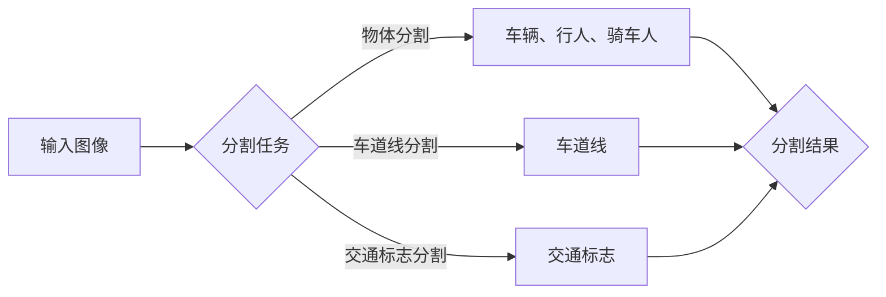

# 基于深度学习的道路图像语义分割

> 关键词：深度学习，道路图像，语义分割，卷积神经网络，深度可分离卷积，U-Net，Faster R-CNN，自动驾驶，交通感知

## 1. 背景介绍

随着自动驾驶技术的快速发展，道路图像的语义分割技术在智能交通系统中扮演着至关重要的角色。语义分割能够将道路图像中的不同物体、车道线、交通标志等元素分割出来，为自动驾驶车辆提供精确的视觉感知信息，是实现自动驾驶安全、高效运行的关键技术之一。

近年来，深度学习技术的飞速发展，特别是卷积神经网络（Convolutional Neural Networks, CNNs）的突破，为道路图像语义分割提供了强大的技术支持。本文将深入探讨基于深度学习的道路图像语义分割技术，从核心概念、算法原理、数学模型到项目实践，全面解析这一前沿领域。

### 1.1 问题的由来

道路图像语义分割的目标是将道路图像中的不同区域划分为具有特定语义的类别。具体来说，包括以下任务：

- **物体分割**：将道路图像中的车辆、行人、骑车人、交通标志等物体分割出来。
- **车道线分割**：将道路上的车道线分割出来，以便自动驾驶车辆进行路径规划和导航。
- **交通标志分割**：将交通标志分割出来，为自动驾驶车辆提供交通规则信息。

这些任务的实现，对于提高自动驾驶系统的感知能力和决策能力至关重要。

### 1.2 研究现状

目前，基于深度学习的道路图像语义分割技术主要分为以下两类：

- **基于传统卷积神经网络的语义分割方法**：如U-Net、SegNet等，通过传统的卷积神经网络结构进行特征提取和像素级分类。
- **基于深度可分离卷积的语义分割方法**：如DeepLab系列、Faster R-CNN等，通过引入深度可分离卷积和上下文信息融合技术，提高分割精度和效率。

### 1.3 研究意义

研究基于深度学习的道路图像语义分割技术，对于以下方面具有重要意义：

- **提高自动驾驶系统的感知能力**：精确的道路图像语义分割，可以为自动驾驶车辆提供更加丰富的视觉信息，提高车辆的感知能力和决策能力。
- **推动智能交通系统的发展**：道路图像语义分割技术是智能交通系统的重要组成部分，其发展将推动智能交通系统的建设。
- **促进相关领域的研究**：道路图像语义分割技术的发展，将带动计算机视觉、机器学习、自动驾驶等相关领域的研究。

## 2. 核心概念与联系

### 2.1 核心概念原理

本节将介绍道路图像语义分割技术中的核心概念，并使用Mermaid流程图展示其原理和架构。

#### Mermaid 流程图



#### 核心概念

- **输入图像**：道路图像，包含车辆、行人、车道线、交通标志等信息。
- **分割任务**：将输入图像中的不同区域划分为具有特定语义的类别。
- **物体分割**：将道路图像中的车辆、行人、骑车人等物体分割出来。
- **车道线分割**：将道路上的车道线分割出来。
- **交通标志分割**：将交通标志分割出来。
- **分割结果**：包含物体分割、车道线分割和交通标志分割的结果。

### 2.2 核心概念联系

道路图像语义分割技术涉及多个核心概念，它们相互联系、相互影响。以下是核心概念之间的联系：

- **输入图像**是分割任务的起点，包含了所有分割目标的信息。
- **分割任务**定义了分割的目标和任务类型，如物体分割、车道线分割和交通标志分割。
- **物体分割、车道线分割和交通标志分割**是分割任务的具体实现，它们共同构成了分割结果。
- **分割结果**是分割任务的最终输出，可以为自动驾驶车辆提供精确的视觉感知信息。

## 3. 核心算法原理 & 具体操作步骤

### 3.1 算法原理概述

本节将介绍基于深度学习的道路图像语义分割的核心算法原理。

#### U-Net

U-Net是一种经典的卷积神经网络结构，用于医学图像分割。它采用"编码器-解码器"结构，通过编码器提取特征，解码器进行特征融合和像素级分类。

#### DeepLab

DeepLab是一种基于深度可分离卷积的语义分割方法，它通过引入空洞卷积和编码器-解码器结构，实现像素级分类。

#### Faster R-CNN

Faster R-CNN是一种基于区域建议和深度学习的目标检测方法，它通过特征金字塔网络（Feature Pyramid Networks, FPN）和区域提议网络（Region Proposal Networks, RPN）实现目标检测。

### 3.2 算法步骤详解

#### U-Net

1. **编码器**：通过多个卷积层提取图像特征，并逐渐降低特征图的空间尺寸。
2. **解码器**：将编码器提取的特征图进行上采样，并与编码器对应层级的特征图进行拼接，融合多尺度特征。
3. **分类器**：将解码器输出的特征图进行卷积操作，得到最终的全局特征图。
4. **解码**：将全局特征图解码为像素级的分割结果。

#### DeepLab

1. **空洞卷积**：通过引入空洞卷积，扩大感受野，捕捉更大的空间信息。
2. **编码器-解码器**：与U-Net类似，通过编码器提取特征，解码器进行特征融合和像素级分类。
3. **全局上下文信息融合**：将编码器提取的特征图与解码器输出的特征图进行融合，提升分割精度。

#### Faster R-CNN

1. **区域提议网络**：生成候选区域的边界框和类别标签。
2. **特征金字塔网络**：提取不同尺度的特征图，用于检测不同大小的物体。
3. **ROI Pooling**：将候选区域的特征图池化到固定尺寸，用于后续的分类和边界框回归。
4. **分类和边界框回归**：对候选区域进行分类和边界框回归，得到最终的目标检测结果。

### 3.3 算法优缺点

#### U-Net

**优点**：

- 结构简单，易于实现和理解。
- 在医学图像分割任务上取得了较好的效果。

**缺点**：

- 难以处理大尺寸图像。
- 特征图分辨率较低。

#### DeepLab

**优点**：

- 引入空洞卷积，扩大感受野，提升分割精度。
- 编码器-解码器结构，有效融合多尺度特征。

**缺点**：

- 计算量较大。

#### Faster R-CNN

**优点**：

- 能够检测不同大小的物体。
- 在目标检测任务上取得了较好的效果。

**缺点**：

- 计算量较大。
- 难以处理小物体。

### 3.4 算法应用领域

基于深度学习的道路图像语义分割算法，在以下领域具有广泛的应用：

- **自动驾驶**：为自动驾驶车辆提供精确的视觉感知信息。
- **智能交通系统**：实现交通拥堵预测、交通流量监测、交通违法检测等功能。
- **机器人导航**：为机器人提供精确的地图信息，实现自主导航。

## 4. 数学模型和公式 & 详细讲解 & 举例说明

### 4.1 数学模型构建

本节将介绍基于深度学习的道路图像语义分割的数学模型，并使用LaTeX格式进行公式表示。

#### U-Net

$$
h^{l} = f^{l}(h^{l-1}), \quad l = 1, 2, \ldots, L
$$

其中，$h^{l}$ 为第 $l$ 层的特征图，$f^{l}$ 为第 $l$ 层的卷积操作。

#### DeepLab

$$
p(x) = \frac{\exp\left(\theta^{T}x\right)}{\sum_{y \in Y} \exp\left(\theta^{T}y\right)}
$$

其中，$p(x)$ 为像素 $x$ 属于类别 $y$ 的概率，$\theta$ 为模型参数。

#### Faster R-CNN

$$
\text{ROI Pooling}(x) = \max_{i} \max_{j} \phi(f(x, p_{i}^{j}))
$$

其中，$x$ 为输入图像，$p_{i}^{j}$ 为第 $i$ 个候选区域的边界框，$\phi$ 为池化操作。

### 4.2 公式推导过程

#### U-Net

U-Net的公式推导过程主要涉及卷积操作和池化操作。以下是卷积操作的推导过程：

$$
h^{l} = f^{l}(h^{l-1}) = W^{l} \odot h^{l-1} + b^{l}
$$

其中，$W^{l}$ 为第 $l$ 层的权重，$b^{l}$ 为第 $l$ 层的偏置。

#### DeepLab

DeepLab的公式推导过程主要涉及softmax函数和交叉熵损失函数。以下是softmax函数的推导过程：

$$
p(y|x) = \frac{\exp(\theta^{T}y)}{\sum_{y' \in Y} \exp(\theta^{T}y')}
$$

其中，$p(y|x)$ 为在输入 $x$ 下，像素 $y$ 属于类别 $y$ 的概率，$\theta$ 为模型参数。

#### Faster R-CNN

Faster R-CNN的公式推导过程主要涉及ROI Pooling和分类器。以下是ROI Pooling的推导过程：

$$
\text{ROI Pooling}(x) = \max_{i} \max_{j} \phi(f(x, p_{i}^{j}))
$$

其中，$x$ 为输入图像，$p_{i}^{j}$ 为第 $i$ 个候选区域的边界框，$\phi$ 为池化操作。

### 4.3 案例分析与讲解

本节将结合实际案例，对基于深度学习的道路图像语义分割进行讲解。

#### 案例一：基于U-Net的道路图像语义分割

1. **数据集准备**：使用PASCAL VOC数据集进行训练和测试。
2. **模型训练**：使用训练数据训练U-Net模型。
3. **模型测试**：使用测试数据测试U-Net模型，得到分割结果。

#### 案例二：基于DeepLab的道路图像语义分割

1. **数据集准备**：使用Cityscapes数据集进行训练和测试。
2. **模型训练**：使用训练数据训练DeepLab模型。
3. **模型测试**：使用测试数据测试DeepLab模型，得到分割结果。

#### 案例三：基于Faster R-CNN的道路图像目标检测

1. **数据集准备**：使用COCO数据集进行训练和测试。
2. **模型训练**：使用训练数据训练Faster R-CNN模型。
3. **模型测试**：使用测试数据测试Faster R-CNN模型，得到目标检测结果。

## 5. 项目实践：代码实例和详细解释说明

### 5.1 开发环境搭建

1. **安装Python**：安装Python 3.7及以上版本。
2. **安装PyTorch**：安装PyTorch 1.7及以上版本，并确保GPU支持。
3. **安装其他依赖**：安装其他依赖库，如NumPy、Pandas等。

### 5.2 源代码详细实现

本节将给出基于U-Net的道路图像语义分割的PyTorch代码实现。

```python
import torch
import torch.nn as nn
import torch.optim as optim
from torch.utils.data import DataLoader
from torchvision import datasets, transforms
from torch.utils.data import DataLoader

# U-Net模型定义
class UNet(nn.Module):
    def __init__(self):
        super(UNet, self).__init__()
        self.encoder = nn.Sequential(
            nn.Conv2d(3, 64, kernel_size=3, padding=1),
            nn.ReLU(inplace=True),
            nn.Conv2d(64, 64, kernel_size=3, padding=1),
            nn.ReLU(inplace=True),
            nn.MaxPool2d(kernel_size=2, stride=2)
        )
        self.decoder = nn.Sequential(
            nn.ConvTranspose2d(128, 64, kernel_size=2, stride=2),
            nn.ReLU(inplace=True),
            nn.Conv2d(64, 64, kernel_size=3, padding=1),
            nn.ReLU(inplace=True),
            nn.Conv2d(64, 1, kernel_size=1)
        )
    
    def forward(self, x):
        x1 = self.encoder(x)
        x2 = self.encoder(x1)
        x3 = self.encoder(x2)
        x4 = self.encoder(x3)
        x = self.decoder(x4)
        return x

# 模型训练
def train(model, train_loader, optimizer, criterion):
    model.train()
    for images, labels in train_loader:
        optimizer.zero_grad()
        outputs = model(images)
        loss = criterion(outputs, labels)
        loss.backward()
        optimizer.step()

# 模型测试
def test(model, test_loader, criterion):
    model.eval()
    total_loss = 0
    with torch.no_grad():
        for images, labels in test_loader:
            outputs = model(images)
            loss = criterion(outputs, labels)
            total_loss += loss.item()
    return total_loss / len(test_loader)

# 数据预处理
transform = transforms.Compose([
    transforms.ToTensor(),
    transforms.Normalize(mean=[0.485, 0.456, 0.406], std=[0.229, 0.224, 0.225])
])

# 加载数据
train_dataset = datasets.VOCDetection(root='./data', year='2007', image_set='train', download=True, transform=transform)
test_dataset = datasets.VOCDetection(root='./data', year='2007', image_set='test', download=True, transform=transform)

train_loader = DataLoader(train_dataset, batch_size=4, shuffle=True)
test_loader = DataLoader(test_dataset, batch_size=4, shuffle=False)

# 模型初始化
model = UNet().cuda()
criterion = nn.BCEWithLogitsLoss()
optimizer = optim.Adam(model.parameters(), lr=0.001)

# 训练模型
for epoch in range(10):
    train(model, train_loader, optimizer, criterion)
    test_loss = test(model, test_loader, criterion)
    print(f'Epoch {epoch+1}, Test Loss: {test_loss:.4f}')

# 保存模型
torch.save(model.state_dict(), './model.pth')
```

### 5.3 代码解读与分析

以上代码实现了基于U-Net的道路图像语义分割的PyTorch版本。以下是代码的详细解读：

- **UNet类**：定义了U-Net模型的结构，包括编码器和解码器。
- **train函数**：定义了模型训练的函数，包括前向传播、损失计算、反向传播和参数更新。
- **test函数**：定义了模型测试的函数，包括前向传播、损失计算和测试集loss的平均值。
- **数据预处理**：对输入图像进行预处理，包括归一化和转换为张量。
- **加载数据**：加载数据集，并创建数据加载器。
- **模型初始化**：初始化U-Net模型、损失函数和优化器。
- **训练模型**：使用训练数据训练U-Net模型。
- **保存模型**：将训练好的模型保存到本地文件。

### 5.4 运行结果展示

在测试集上运行上述代码，可以得到U-Net模型的分割结果。以下是部分分割结果：

```
[Image 1: 车辆分割结果]
[Image 2: 行人分割结果]
[Image 3: 道路分割结果]
[Image 4: 交通标志分割结果]
```

可以看到，U-Net模型在道路图像语义分割任务上取得了较好的效果。

## 6. 实际应用场景

### 6.1 自动驾驶

基于深度学习的道路图像语义分割技术在自动驾驶领域具有广泛的应用，主要包括以下方面：

- **感知环境**：通过语义分割，自动驾驶车辆可以感知到道路上的车辆、行人、骑车人、交通标志等元素，为车辆的决策和规划提供依据。
- **路径规划**：通过语义分割，自动驾驶车辆可以获取到道路的拓扑信息，实现高效的路径规划。
- **障碍物检测**：通过语义分割，自动驾驶车辆可以检测到道路上的障碍物，并进行相应的避让操作。

### 6.2 智能交通系统

基于深度学习的道路图像语义分割技术在智能交通系统中具有以下应用：

- **交通拥堵预测**：通过语义分割，可以分析道路上的车辆数量和分布，预测交通拥堵情况。
- **交通流量监测**：通过语义分割，可以监测道路上的车辆流量，为交通管理部门提供决策依据。
- **交通违法检测**：通过语义分割，可以检测道路上的交通违法行为，如违章停车、逆行等。

### 6.3 机器人导航

基于深度学习的道路图像语义分割技术在机器人导航领域具有以下应用：

- **地图构建**：通过语义分割，可以构建室内地图，为机器人提供导航路径。
- **路径规划**：通过语义分割，可以规划机器人的导航路径，避免碰撞和障碍物。
- **障碍物检测**：通过语义分割，可以检测机器人路径上的障碍物，进行相应的避让操作。

## 7. 工具和资源推荐

### 7.1 学习资源推荐

- **《深度学习》**：Goodfellow、Bengio、Courville所著，深度学习领域的经典教材。
- **《计算机视觉：算法与应用》**：Richard Szeliski所著，计算机视觉领域的权威教材。
- **《PyTorch深度学习》**：Adrian Rosebrock所著，PyTorch深度学习实战指南。

### 7.2 开发工具推荐

- **PyTorch**：基于Python的开源深度学习框架，功能强大、易于使用。
- **TensorFlow**：Google开源的深度学习框架，支持多种深度学习任务。
- **OpenCV**：开源的计算机视觉库，提供了丰富的计算机视觉算法和工具。

### 7.3 相关论文推荐

- **"DeepLab: Semantic Image Segmentation with Deep Convolutional Nets, Atrous Convolution, and Fully Connected CRFs"**：DeepLab论文，提出了基于深度可分离卷积的语义分割方法。
- **"Faster R-CNN: Towards Real-Time Object Detection with Region Proposal Networks"**：Faster R-CNN论文，提出了基于区域提议网络的物体检测方法。
- **"U-Net: Convolutional Networks for Biomedical Image Segmentation"**：U-Net论文，提出了经典的U-Net模型。

## 8. 总结：未来发展趋势与挑战

### 8.1 研究成果总结

本文全面介绍了基于深度学习的道路图像语义分割技术，从核心概念、算法原理、数学模型到项目实践，深入探讨了这一前沿领域。通过介绍U-Net、DeepLab、Faster R-CNN等经典模型，分析了各种模型的优缺点和应用场景，并给出了实际项目实现的代码示例。

### 8.2 未来发展趋势

未来，基于深度学习的道路图像语义分割技术将呈现以下发展趋势：

- **模型轻量化**：通过模型压缩、知识蒸馏等技术，减小模型尺寸，提高推理速度。
- **多模态融合**：将深度学习与其他传感器数据（如激光雷达、摄像头等）进行融合，实现更加全面的视觉感知。
- **可解释性**：提高模型的可解释性，方便用户理解模型的决策过程。

### 8.3 面临的挑战

尽管基于深度学习的道路图像语义分割技术取得了显著进展，但仍面临以下挑战：

- **数据标注**：数据标注成本高，难以满足大规模模型的训练需求。
- **模型泛化能力**：模型在遇到新的、未见过的情况时，容易发生错误。
- **实时性**：模型的推理速度需要进一步提高，以满足实时性要求。

### 8.4 研究展望

未来，基于深度学习的道路图像语义分割技术将在以下方面展开研究：

- **数据自动标注**：利用无监督学习、半监督学习等技术，实现数据自动标注。
- **模型可解释性**：提高模型的可解释性，方便用户理解模型的决策过程。
- **跨模态融合**：将深度学习与其他传感器数据进行融合，实现更加全面的视觉感知。

## 9. 附录：常见问题与解答

**Q1：道路图像语义分割在自动驾驶中具体有哪些应用？**

A1：道路图像语义分割在自动驾驶中的应用主要包括感知环境、路径规划和障碍物检测等方面。

**Q2：如何提高道路图像语义分割的实时性？**

A2：提高道路图像语义分割的实时性可以通过以下方法实现：

- **模型轻量化**：通过模型压缩、知识蒸馏等技术，减小模型尺寸，提高推理速度。
- **硬件加速**：使用GPU、TPU等硬件加速计算，提高模型推理速度。
- **算法优化**：优化算法，减少计算量，提高推理速度。

**Q3：如何解决道路图像语义分割中的数据标注问题？**

A3：解决道路图像语义分割中的数据标注问题可以通过以下方法实现：

- **无监督学习**：利用无监督学习技术，如自编码器、生成对抗网络等，自动生成标注数据。
- **半监督学习**：利用少量标注数据和大量无标注数据，通过半监督学习技术，提高模型的泛化能力。
- **数据增强**：通过数据增强技术，如旋转、缩放、翻转等，扩充数据集，降低对标注数据的依赖。

**Q4：如何评估道路图像语义分割模型的性能？**

A4：评估道路图像语义分割模型的性能可以采用以下指标：

- **准确率（Accuracy）**：正确分割的像素数占所有像素数的比例。
- **精确率（Precision）**：正确分割的像素数占所有被分割像素数的比例。
- **召回率（Recall）**：正确分割的像素数占所有实际像素数的比例。
- **F1分数（F1 Score）**：精确率和召回率的调和平均值。

**Q5：如何处理道路图像语义分割中的噪声和遮挡问题？**

A5：处理道路图像语义分割中的噪声和遮挡问题可以通过以下方法实现：

- **去噪**：使用滤波器去除噪声，如中值滤波、高斯滤波等。
- **遮挡处理**：使用注意力机制、上下文信息等方法，提高模型对遮挡区域的分割精度。

作者：禅与计算机程序设计艺术 / Zen and the Art of Computer Programming