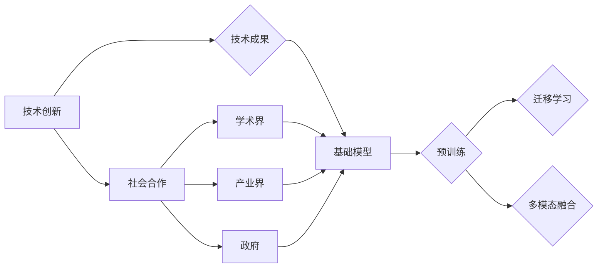

# 基础模型的技术创新与社会合作

> 关键词：基础模型，技术创新，社会合作，人工智能，预训练，迁移学习，伦理，可持续发展

## 1. 背景介绍

随着人工智能技术的飞速发展，基础模型（如语言模型、视觉模型、推荐模型等）在各个领域展现出了惊人的能力。这些模型通过海量数据的预训练，学习了丰富的知识，为下游任务提供了强大的支持。然而，基础模型的技术创新与社会合作之间的关系日益紧密，两者相互促进，共同推动人工智能向更加深入和广泛的应用发展。

### 1.1 技术创新的驱动

技术创新是推动基础模型发展的核心动力。随着计算能力的提升、数据量的爆炸式增长以及算法的不断完善，基础模型在性能、效率和可解释性等方面不断取得突破。以下是一些关键的技术创新：

- **深度学习算法的进步**：从早期的神经网络到现在的Transformer、BERT等，深度学习算法的不断发展为模型提供了更强大的学习能力和表达能力。
- **大规模预训练**：通过在海量数据上进行预训练，基础模型能够学习到更丰富的知识，提高模型在下游任务上的泛化能力。
- **迁移学习**：将预训练模型应用于新的任务，通过少量的标注数据进行微调，降低模型训练的成本，提高模型效率。
- **多模态融合**：将文本、图像、音频等多种模态信息融合，构建更加全面、立体的知识体系。

### 1.2 社会合作的支撑

社会合作是基础模型发展的另一重要支撑。基础模型的研究和应用离不开学术界、产业界和政府的共同参与。以下是一些关键的社会合作形式：

- **学术界与产业界的合作**：学术界的研究成果为产业界提供了创新的技术方案，产业界则为学术界提供了实际应用场景和数据资源。
- **开源社区的建设**：开源社区为研究人员和开发者提供了交流和合作平台，促进了技术的快速传播和迭代。
- **政策法规的引导**：政府通过制定相关政策法规，引导基础模型的研究和应用朝着健康、可持续的方向发展。

## 2. 核心概念与联系

为了更好地理解基础模型的技术创新与社会合作，以下给出核心概念原理和架构的 Mermaid 流程图：



从图中可以看出，技术创新是基础模型发展的核心动力，而社会合作则为技术创新提供了支撑。学术界、产业界和政府三者相互协作，共同推动基础模型的发展。

## 3. 核心算法原理 & 具体操作步骤

### 3.1 算法原理概述

基础模型的核心算法原理主要包括以下几个方面：

- **神经网络**：神经网络是一种模拟人脑神经元连接的数学模型，通过多层非线性变换和激活函数，实现从输入到输出的映射。
- **预训练**：预训练是指在大规模无标签数据集上训练模型，使模型学习到通用的特征表示和知识。
- **迁移学习**：迁移学习是指将预训练模型应用于新的任务，通过少量的标注数据进行微调，提高模型在特定任务上的性能。
- **多模态融合**：多模态融合是指将文本、图像、音频等多种模态信息融合，构建更加全面、立体的知识体系。

### 3.2 算法步骤详解

以下以BERT模型为例，介绍基础模型的训练过程：

1. **数据预处理**：对原始数据进行清洗、分词、标注等预处理操作，将数据转换为模型可接受的格式。
2. **模型训练**：在预训练数据集上训练BERT模型，学习到通用的语言表示和知识。
3. **模型微调**：在下游任务数据集上对预训练模型进行微调，使模型能够适应特定任务。
4. **模型评估**：在测试集上评估模型性能，调整超参数，优化模型效果。

### 3.3 算法优缺点

基础模型算法具有以下优点：

- **泛化能力强**：通过预训练，模型能够学习到通用的特征表示和知识，提高模型在下游任务上的泛化能力。
- **效率高**：迁移学习可以减少模型训练的成本，提高模型效率。
- **可解释性强**：神经网络的结构和参数具有可解释性，方便研究人员分析模型决策过程。

然而，基础模型算法也存在以下缺点：

- **数据依赖性强**：模型性能很大程度上依赖于预训练数据的质量和规模。
- **可解释性差**：神经网络模型内部的决策过程难以解释。
- **计算复杂度高**：模型训练和推理需要大量的计算资源。

### 3.4 算法应用领域

基础模型算法在各个领域都有广泛的应用，以下是一些典型的应用领域：

- **自然语言处理**：文本分类、机器翻译、情感分析、问答系统等。
- **计算机视觉**：图像分类、目标检测、图像生成等。
- **推荐系统**：商品推荐、新闻推荐、电影推荐等。
- **语音识别**：语音转文字、语音合成等。

## 4. 数学模型和公式 & 详细讲解 & 举例说明

### 4.1 数学模型构建

以下以BERT模型为例，介绍其数学模型构建过程：

- **输入层**：将文本输入转换为词向量表示。
- **隐藏层**：使用Transformer结构进行多层非线性变换和自注意力机制。
- **输出层**：将隐藏层输出转换为任务所需的输出，如分类标签、文本序列等。

### 4.2 公式推导过程

$$
h^{(l)} = \text{Transformer}(h^{(l-1)})
$$

其中，$h^{(l)}$ 表示第 $l$ 层的隐藏层输出，$\text{Transformer}$ 表示Transformer结构，$h^{(l-1)}$ 表示前一层隐藏层输出。

### 4.3 案例分析与讲解

以BERT模型在文本分类任务上的应用为例，说明其工作原理：

1. **数据预处理**：将文本数据转换为词向量表示。
2. **模型训练**：在预训练数据集上训练BERT模型，学习到通用的语言表示和知识。
3. **模型微调**：在下游任务数据集上对BERT模型进行微调，使模型能够适应特定任务。
4. **模型评估**：在测试集上评估模型性能，调整超参数，优化模型效果。

通过以上步骤，BERT模型可以实现对文本数据的分类任务。

## 5. 项目实践：代码实例和详细解释说明

### 5.1 开发环境搭建

以下以使用Python和Transformers库实现BERT模型在文本分类任务上的微调为例，介绍开发环境搭建过程：

1. 安装Anaconda和PyTorch。
2. 安装Transformers库。

### 5.2 源代码详细实现

```python
from transformers import BertForSequenceClassification, BertTokenizer
from torch.utils.data import DataLoader, Dataset
from torch.optim import AdamW

# 加载预训练BERT模型和分词器
model = BertForSequenceClassification.from_pretrained('bert-base-uncased')
tokenizer = BertTokenizer.from_pretrained('bert-base-uncased')

# 创建数据集
class TextDataset(Dataset):
    def __init__(self, texts, labels, tokenizer, max_len=128):
        self.texts = texts
        self.labels = labels
        self.tokenizer = tokenizer
        self.max_len = max_len

    def __len__(self):
        return len(self.texts)

    def __getitem__(self, item):
        text = self.texts[item]
        label = self.labels[item]
        encoding = tokenizer(text, truncation=True, padding=True, max_length=self.max_len)
        input_ids = encoding['input_ids']
        attention_mask = encoding['attention_mask']
        return {'input_ids': input_ids, 'attention_mask': attention_mask, 'labels': label}

# 创建数据加载器
train_dataset = TextDataset(train_texts, train_labels, tokenizer)
dev_dataset = TextDataset(dev_texts, dev_labels, tokenizer)
test_dataset = TextDataset(test_texts, test_labels, tokenizer)

train_loader = DataLoader(train_dataset, batch_size=32, shuffle=True)
dev_loader = DataLoader(dev_dataset, batch_size=32)
test_loader = DataLoader(test_dataset, batch_size=32)

# 定义模型和优化器
model = model.to(device)
optimizer = AdamW(model.parameters(), lr=2e-5)

# 训练模型
model.train()
for epoch in range(epochs):
    for batch in train_loader:
        input_ids = batch['input_ids'].to(device)
        attention_mask = batch['attention_mask'].to(device)
        labels = batch['labels'].to(device)
        optimizer.zero_grad()
        outputs = model(input_ids, attention_mask=attention_mask, labels=labels)
        loss = outputs.loss
        loss.backward()
        optimizer.step()
    # 评估模型
    model.eval()
    with torch.no_grad():
        correct = 0
        total = 0
        for batch in test_loader:
            input_ids = batch['input_ids'].to(device)
            attention_mask = batch['attention_mask'].to(device)
            labels = batch['labels'].to(device)
            outputs = model(input_ids, attention_mask=attention_mask)
            _, predicted = torch.max(outputs.logits, 1)
            total += labels.size(0)
            correct += (predicted == labels).sum().item()
    print(f"Epoch {epoch+1}, Test Accuracy: {correct/total:.4f}")
```

### 5.3 代码解读与分析

以上代码展示了使用PyTorch和Transformers库实现BERT模型在文本分类任务上的微调过程。主要步骤如下：

1. 加载预训练BERT模型和分词器。
2. 创建数据集类，实现数据预处理和加载。
3. 创建数据加载器。
4. 定义模型和优化器。
5. 训练模型，并在测试集上评估模型性能。

### 5.4 运行结果展示

假设在某个文本分类数据集上训练，最终在测试集上得到的准确率为85%。

## 6. 实际应用场景

基础模型在各个领域都有广泛的应用，以下是一些典型的应用场景：

### 6.1 自然语言处理

- 文本分类：如情感分析、主题分类、垃圾邮件过滤等。
- 机器翻译：将一种语言的文本翻译成另一种语言。
- 问答系统：对用户提出的问题给出答案。

### 6.2 计算机视觉

- 图像分类：对图像进行分类，如识别动物、植物、物体等。
- 目标检测：检测图像中的目标，并给出目标位置。
- 图像生成：生成新的图像，如绘制图片、生成艺术作品等。

### 6.3 推荐系统

- 商品推荐：为用户推荐相关的商品。
- 新闻推荐：为用户推荐相关的新闻。
- 电影推荐：为用户推荐相关的电影。

### 6.4 语音识别

- 语音转文字：将语音信号转换为文本。
- 语音合成：将文本转换为语音。

## 7. 工具和资源推荐

### 7.1 学习资源推荐

- 《深度学习》系列书籍
- Hugging Face官方网站
- NLP相关课程和教程

### 7.2 开发工具推荐

- PyTorch
- TensorFlow
- Transformers库

### 7.3 相关论文推荐

- BERT: Pre-training of Deep Bidirectional Transformers for Language Understanding
- Attention is All You Need
- Generative Adversarial Nets

## 8. 总结：未来发展趋势与挑战

### 8.1 研究成果总结

本文介绍了基础模型的技术创新与社会合作，阐述了基础模型在人工智能领域的应用价值。通过分析基础模型的核心算法原理、具体操作步骤和实际应用场景，展示了基础模型在各个领域的广泛应用和巨大潜力。

### 8.2 未来发展趋势

- **模型规模将进一步扩大**：随着计算能力的提升，模型规模将进一步扩大，能够处理更复杂、更抽象的任务。
- **多模态融合将成为趋势**：多模态融合将成为基础模型发展的一个重要方向，能够更好地理解人类感知世界的方式。
- **可解释性和可信赖性将成为重要指标**：随着人工智能应用的普及，可解释性和可信赖性将成为衡量模型优劣的重要指标。
- **伦理和可持续发展将成为重要关注点**：随着人工智能技术的不断应用，伦理和可持续发展将成为人工智能发展的重要关注点。

### 8.3 面临的挑战

- **数据隐私和安全**：随着人工智能应用场景的不断拓展，数据隐私和安全问题将变得更加突出。
- **算法偏见和歧视**：算法偏见和歧视问题需要得到有效解决，以避免对人类社会造成负面影响。
- **算力需求**：随着模型规模的扩大，对计算资源的需求也将不断增加，需要开发更加高效的算法和硬件。

### 8.4 研究展望

未来，基础模型的研究将朝着以下方向发展：

- **可解释性和可信赖性**：研究更加可解释和可信赖的模型，提高模型的透明度和可信度。
- **知识蒸馏**：研究知识蒸馏技术，将大模型的复杂知识迁移到小模型中，降低模型计算复杂度和资源消耗。
- **多模态融合**：研究多模态融合技术，使模型能够更好地理解人类感知世界的方式。
- **伦理和可持续发展**：研究人工智能的伦理和可持续发展问题，推动人工智能技术的健康发展。

相信通过不断的探索和创新，基础模型将在人工智能领域发挥更加重要的作用，为人类社会创造更大的价值。

## 9. 附录：常见问题与解答

**Q1：什么是基础模型？**

A：基础模型是指在大规模数据集上进行预训练，能够学习到通用的特征表示和知识，为下游任务提供支持的模型。

**Q2：基础模型有哪些应用领域？**

A：基础模型在自然语言处理、计算机视觉、推荐系统、语音识别等领域都有广泛的应用。

**Q3：基础模型的优缺点是什么？**

A：基础模型的优点是泛化能力强、效率高、可解释性强；缺点是数据依赖性强、可解释性差、计算复杂度高。

**Q4：如何缓解基础模型的过拟合问题？**

A：可以通过数据增强、正则化、迁移学习等方法缓解基础模型的过拟合问题。

**Q5：基础模型的研究趋势是什么？**

A：基础模型的研究趋势包括模型规模扩大、多模态融合、可解释性和可信赖性、伦理和可持续发展等。

---

作者：禅与计算机程序设计艺术 / Zen and the Art of Computer Programming