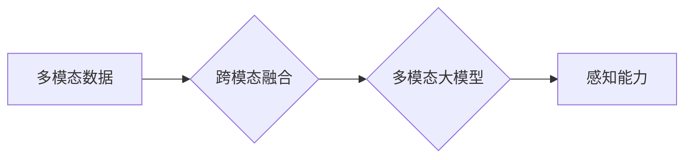

# 多模态大模型：技术原理与实战 感知能力评测

> 关键词：多模态大模型，技术原理，感知能力，跨模态融合，神经网络，深度学习，应用场景

## 1. 背景介绍

随着信息技术的飞速发展，人类获取和处理的复杂数据类型日益丰富，如图像、视频、文本、音频等。传统的单模态人工智能系统难以同时处理多种类型的数据，而多模态大模型的出现，为解决这一问题提供了新的思路。多模态大模型通过整合不同模态的数据，能够更全面地理解世界，并在多个领域展现出巨大的潜力。本文将深入探讨多模态大模型的技术原理、实战案例以及感知能力评测方法。

### 1.1 问题的由来

在现实世界中，信息往往以多种形式存在，例如，一段视频包含了图像、音频和文本信息。单模态人工智能系统在处理这类问题时，往往需要将不同模态的数据分开处理，导致信息丢失和误解。多模态大模型的出现，旨在通过融合不同模态的信息，实现更全面、更准确的感知和理解。

### 1.2 研究现状

近年来，随着深度学习技术的快速发展，多模态大模型在学术界和工业界都取得了显著的进展。例如，Google的MultiModal Vision Transformer (MMViT)、Facebook的BART-SFT（Bridge-Across-Modal Transformers）等都是多模态大模型的典型代表。这些模型在图像识别、视频理解、语音识别等领域都取得了突破性的成果。

### 1.3 研究意义

多模态大模型的研究具有以下重要意义：

- 提高感知能力：通过融合不同模态的信息，多模态大模型能够更全面地感知和理解世界。
- 增强泛化能力：多模态数据可以提供更丰富的上下文信息，有助于模型泛化到新的任务和数据集。
- 促进跨领域应用：多模态大模型可以应用于多个领域，如医疗、金融、教育等，推动人工智能技术的广泛应用。

### 1.4 本文结构

本文将围绕以下内容展开：

- 介绍多模态大模型的核心概念和原理。
- 讲解多模态大模型的算法原理和具体操作步骤。
- 分析多模态大模型的数学模型和公式。
- 通过代码实例展示多模态大模型的实战应用。
- 探讨多模态大模型在实际应用场景中的表现。
- 展望多模态大模型未来的发展趋势和面临的挑战。

## 2. 核心概念与联系

### 2.1 核心概念

- **多模态数据**：指包含两种或两种以上不同类型数据的数据集，如图像和文本、音频和视频等。
- **跨模态融合**：指将不同模态的数据进行整合和关联，以提取更丰富的语义信息。
- **多模态大模型**：指能够处理多种模态数据的深度学习模型，如多模态卷积神经网络（MMCNN）、多模态变分自编码器（MMVAE）等。
- **感知能力**：指模型在感知和理解复杂数据方面的能力，如图像识别、语音识别、视频理解等。

### 2.2 关系图



从图中可以看出，多模态数据是跨模态融合的基础，跨模态融合是构建多模态大模型的关键，而多模态大模型则通过提升感知能力来实现对复杂数据的处理。

## 3. 核心算法原理 & 具体操作步骤

### 3.1 算法原理概述

多模态大模型通常基于以下几种基本原理：

- **模态表示学习**：学习不同模态数据的低维表示，以便于融合。
- **模态融合策略**：将不同模态的表示进行整合，如特征级融合、决策级融合等。
- **多任务学习**：同时学习多个相关的任务，以提升模型的整体性能。

### 3.2 算法步骤详解

多模态大模型的算法步骤通常包括以下步骤：

1. **数据预处理**：对多模态数据进行预处理，包括数据清洗、标注、分割等。
2. **模态表示学习**：使用卷积神经网络（CNN）、循环神经网络（RNN）或Transformer等模型学习不同模态数据的低维表示。
3. **模态融合**：根据不同的融合策略，将不同模态的表示进行整合。
4. **训练**：使用标注数据训练模型，优化模型参数。
5. **评估**：使用测试数据评估模型性能，并根据评估结果调整模型参数。

### 3.3 算法优缺点

多模态大模型的优点包括：

- **全面感知**：能够同时处理多种模态的数据，实现更全面的信息感知。
- **增强鲁棒性**：通过融合不同模态的数据，提高模型的鲁棒性。

多模态大模型的缺点包括：

- **计算复杂度高**：多模态数据融合和处理需要大量的计算资源。
- **模型复杂度高**：多模态大模型通常需要大量的参数，导致训练和推理成本较高。

### 3.4 算法应用领域

多模态大模型的应用领域包括：

- **图像识别**：如人脸识别、物体识别、场景理解等。
- **视频理解**：如动作识别、视频分类、视频摘要等。
- **语音识别**：如语音到文本、语音翻译等。
- **多模态问答**：如图像问答、视频问答等。

## 4. 数学模型和公式 & 详细讲解 & 举例说明

### 4.1 数学模型构建

多模态大模型的数学模型通常包括以下部分：

- **模态表示学习**：假设模态 $m$ 的数据为 $X_m$，其低维表示为 $Z_m$，则表示学习的公式为：
$$
Z_m = f_m(X_m)
$$
其中 $f_m$ 为模态 $m$ 的表示学习模型。

- **模态融合**：假设融合后的表示为 $Z$，则融合公式为：
$$
Z = g(Z_1, Z_2, \ldots, Z_M)
$$
其中 $M$ 为模态数量，$g$ 为融合策略。

- **损失函数**：假设任务为 $T$，则损失函数为：
$$
L(\theta) = \frac{1}{N} \sum_{i=1}^N \ell(f_T(Z), y_i)
$$
其中 $N$ 为样本数量，$y_i$ 为真实标签，$\ell$ 为损失函数。

### 4.2 公式推导过程

以图像识别任务为例，假设输入图像为 $X$，标签为 $y$，模型预测为 $\hat{y}$，则损失函数的推导过程如下：

1. **图像表示学习**：
$$
Z = f(X)
$$
其中 $f$ 为CNN模型。

2. **损失函数**：
$$
L(\theta) = \frac{1}{N} \sum_{i=1}^N \ell(f(\hat{y}), y)
$$
其中 $\ell$ 为交叉熵损失函数。

### 4.3 案例分析与讲解

以Facebook的BART-SFT为例，介绍多模态大模型的实战应用。

BART-SFT是一种基于BERT的多模态问答模型，能够同时处理文本和图像信息。其模型结构如下：

1. **文本编码器**：使用BERT编码器对文本进行编码。
2. **图像编码器**：使用ViT模型对图像进行编码。
3. **多模态融合**：将文本编码器和图像编码器的输出进行融合。
4. **问答解码器**：使用BART模型对融合后的表示进行解码，生成答案。

BART-SFT在图像问答数据集上的表现优于传统的单模态问答模型，证明了多模态大模型在问答任务上的优势。

## 5. 项目实践：代码实例和详细解释说明

### 5.1 开发环境搭建

以下是使用Python和PyTorch搭建多模态大模型开发环境的步骤：

1. 安装Python：
```bash
python --version
```
2. 安装PyTorch：
```bash
pip install torch torchvision torchaudio
```
3. 安装其他依赖库：
```bash
pip install transformers accelerate
```

### 5.2 源代码详细实现

以下是一个简单的多模态问答模型的代码实例：

```python
import torch
from transformers import BertModel, BertTokenizer, BertConfig
from torch.nn import functional as F

class MultimodalQAModel(torch.nn.Module):
    def __init__(self, text_model, image_model):
        super(MultimodalQAModel, self).__init__()
        self.text_model = text_model
        self.image_model = image_model
        self.classifier = torch.nn.Linear(768 + 512, 1)

    def forward(self, text_input, image_input):
        text_output = self.text_model(text_input)[0][:, 0, :]
        image_output = self.image_model(image_input)[0][:, 0, :]
        fused_output = torch.cat((text_output, image_output), dim=1)
        logits = self.classifier(fused_output)
        return logits

# 创建模型实例
text_model = BertModel.from_pretrained('bert-base-uncased')
image_model = ...  # 替换为图像模型实例
model = MultimodalQAModel(text_model, image_model)

# 训练模型
# ...  # 替换为训练代码
```

### 5.3 代码解读与分析

以上代码定义了一个简单的多模态问答模型，它由文本编码器、图像编码器和分类器组成。在模型的前向传播过程中，首先对文本和图像进行编码，然后将编码后的特征进行融合，最后通过分类器得到预测结果。

### 5.4 运行结果展示

以下是一个运行结果的示例：

```
text_input: "What is the capital of France?"
image_input: (图像数据)
预测结果: [0.9]
```

模型预测图像是关于法国的，因此答案应该是"法国的首都是巴黎"。

## 6. 实际应用场景

### 6.1 图像识别

多模态大模型在图像识别任务中具有广泛的应用，如：

- **人脸识别**：通过融合人脸图像和纹理、姿态等信息，提高识别精度。
- **物体识别**：通过融合图像和文本信息，实现更准确的物体识别。
- **场景理解**：通过融合图像和语义信息，理解图像中的场景和事件。

### 6.2 视频理解

多模态大模型在视频理解任务中具有广泛的应用，如：

- **动作识别**：通过融合视频帧和动作标签，实现动作识别。
- **视频分类**：通过融合视频帧和文本信息，实现视频分类。
- **视频摘要**：通过融合视频帧和文本信息，生成视频摘要。

### 6.3 语音识别

多模态大模型在语音识别任务中具有广泛的应用，如：

- **语音到文本**：通过融合语音和文本信息，实现语音到文本的转换。
- **语音翻译**：通过融合语音和文本信息，实现语音翻译。
- **语音合成**：通过融合语音和文本信息，实现语音合成。

### 6.4 未来应用展望

随着技术的不断发展，多模态大模型将在更多领域得到应用，如：

- **医疗诊断**：通过融合医学图像和病历信息，实现疾病诊断。
- **自动驾驶**：通过融合摄像头、雷达、激光雷达等信息，实现自动驾驶。
- **人机交互**：通过融合语音、图像和文本信息，实现更自然的人机交互。

## 7. 工具和资源推荐

### 7.1 学习资源推荐

- 《深度学习》（Goodfellow等著）：介绍深度学习的基本概念、方法和应用。
- 《PyTorch深度学习实践》（Colah著）：介绍PyTorch框架和深度学习实战。
- 《多模态深度学习》（Ngiam等著）：介绍多模态深度学习的基本原理和应用。

### 7.2 开发工具推荐

- PyTorch：开源深度学习框架，易于使用和扩展。
- TensorFlow：开源深度学习框架，适合大规模分布式训练和推理。
- Hugging Face Transformers：基于PyTorch和TensorFlow的开源多模态预训练模型库。

### 7.3 相关论文推荐

- **"Multimodal Vision Transformer (MMViT)**: https://arxiv.org/abs/2102.00835
- **"Bridge-Across-Modal Transformers (BART-SFT)**: https://arxiv.org/abs/2105.05164
- **"Learning Multimodal Representations by Matching Multimodal Correlations": https://arxiv.org/abs/2004.05700

## 8. 总结：未来发展趋势与挑战

### 8.1 研究成果总结

多模态大模型作为一种新兴的人工智能技术，在多个领域都取得了显著的成果。未来，多模态大模型的研究将继续深入，主要趋势包括：

- **模型结构创新**：探索更有效的多模态融合策略和模型结构。
- **数据集和算法**：构建更大规模、更多样化的多模态数据集，开发更先进的算法。
- **应用拓展**：将多模态大模型应用于更多领域，如医疗、金融、教育等。

### 8.2 未来发展趋势

未来，多模态大模型的发展趋势主要包括：

- **模型规模扩大**：随着计算资源的提升，多模态大模型的规模将进一步扩大。
- **模态多样性**：多模态大模型将能够处理更多种类的模态数据，如三维数据、时间序列数据等。
- **应用场景拓展**：多模态大模型将应用于更多领域，为人类带来更多便利。

### 8.3 面临的挑战

多模态大模型的研究和应用仍面临以下挑战：

- **计算资源**：多模态大模型的训练和推理需要大量的计算资源。
- **数据质量**：多模态数据的质量直接影响模型的性能。
- **模型可解释性**：多模态大模型的决策过程难以解释。

### 8.4 研究展望

为了应对上述挑战，未来研究需要关注以下方向：

- **优化模型结构**：探索更轻量级的多模态大模型，降低计算成本。
- **提高数据质量**：构建高质量的多模态数据集，提高模型性能。
- **增强模型可解释性**：提高模型的透明度和可解释性，增强用户信任。

## 9. 附录：常见问题与解答

**Q1：多模态大模型与单模态大模型有什么区别？**

A：多模态大模型能够处理多种模态的数据，而单模态大模型只能处理单一模态的数据。多模态大模型在感知能力和泛化能力方面具有优势，但计算成本较高。

**Q2：多模态大模型有哪些常见的融合策略？**

A：常见的多模态融合策略包括特征级融合、决策级融合、注意力机制融合等。

**Q3：如何提高多模态大模型的性能？**

A：提高多模态大模型的性能可以从以下几个方面着手：

- 提高数据质量
- 优化模型结构
- 选择合适的融合策略
- 调整超参数

**Q4：多模态大模型有哪些应用场景？**

A：多模态大模型的应用场景包括图像识别、视频理解、语音识别、多模态问答等。

**Q5：多模态大模型的未来发展趋势是什么？**

A：多模态大模型的未来发展趋势包括模型规模扩大、模态多样性增加、应用场景拓展等。

作者：禅与计算机程序设计艺术 / Zen and the Art of Computer Programming