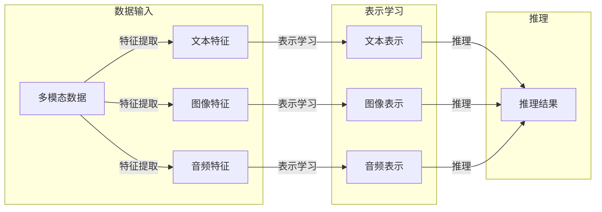

> 大模型, 多模态, 深度学习, 跨模态学习, 预训练, 微调, 模型部署, 推理引擎, 人工智能

# 多模态大模型：技术原理与实战 部署流程

多模态大模型（Multimodal Large Language Models）是近年来人工智能领域的一个重要研究方向。它融合了不同模态（如文本、图像、音频）的数据和知识，使得模型能够理解和生成更丰富、更贴近人类经验的内容。本文将深入探讨多模态大模型的技术原理、实战部署流程，并展望其未来发展趋势与挑战。

## 1. 背景介绍

随着深度学习技术的飞速发展，单模态大模型如BERT、GPT等在各自领域取得了显著的成果。然而，现实世界中的信息往往是多模态的，仅依赖单一模态的数据难以全面理解复杂场景。多模态大模型的出现，正是为了填补这一空白，通过整合不同模态的信息，提升模型的认知能力和泛化能力。

### 1.1 问题的由来

- **单一模态的局限性**：单模态模型难以全面理解复杂场景，例如，仅凭文本描述难以准确判断一个人的情感状态。
- **多模态数据的丰富性**：现实世界中的信息往往是多模态的，包括文本、图像、音频等，融合多模态数据能够提供更丰富的信息。
- **深度学习的发展**：深度学习技术的成熟，使得处理多模态数据成为可能。

### 1.2 研究现状

多模态大模型的研究主要集中在以下几个方面：

- **多模态特征提取**：从不同模态中提取特征，并进行融合。
- **多模态表示学习**：学习不同模态之间的表示关系。
- **多模态推理**：利用多模态表示进行推理和决策。

### 1.3 研究意义

- **提升模型认知能力**：通过融合多模态信息，模型能够更全面地理解世界。
- **拓展应用领域**：多模态大模型可以应用于更多领域，如智能交互、内容审核、医疗诊断等。
- **推动人工智能发展**：多模态大模型是人工智能技术发展的一个重要方向，有助于推动人工智能的进步。

## 2. 核心概念与联系

### 2.1 核心概念原理

- **多模态数据**：包含文本、图像、音频等多种模态的数据。
- **特征提取**：从不同模态中提取有用信息的过程。
- **表示学习**：学习数据表示的方法。
- **推理**：根据已知信息进行判断或预测的过程。

### 2.2 架构的 Mermaid 流程图



### 2.3 核心概念联系

多模态数据经过特征提取，学习到不同模态的表示，最终用于推理和决策。

## 3. 核心算法原理 & 具体操作步骤

### 3.1 算法原理概述

多模态大模型的算法原理主要包括以下几个方面：

- **特征提取**：使用卷积神经网络（CNN）提取图像特征，使用循环神经网络（RNN）或Transformer提取文本和音频特征。
- **表示学习**：使用自编码器或多任务学习等方法学习不同模态之间的表示关系。
- **推理**：使用多模态融合技术，如对齐、融合、注意力机制等，将不同模态的表示进行整合，进行推理和决策。

### 3.2 算法步骤详解

1. **数据预处理**：对多模态数据进行预处理，包括去噪、标准化、增强等。
2. **特征提取**：使用合适的模型提取不同模态的特征。
3. **表示学习**：学习不同模态之间的表示关系。
4. **推理**：利用多模态表示进行推理和决策。

### 3.3 算法优缺点

- **优点**：能够更全面地理解世界，拓展应用领域。
- **缺点**：模型复杂度高，计算量大，对数据质量要求高。

### 3.4 算法应用领域

- **智能交互**：如聊天机器人、语音助手等。
- **内容审核**：如文本、图像、视频内容审核。
- **医疗诊断**：如辅助诊断、药物研发等。
- **智能驾驶**：如环境感知、路径规划等。

## 4. 数学模型和公式 & 详细讲解 & 举例说明

### 4.1 数学模型构建

多模态大模型的数学模型主要包括以下几个部分：

- **特征提取器**：如CNN、RNN、Transformer等。
- **表示学习器**：如自编码器、多任务学习等。
- **推理器**：如对齐模型、融合模型、注意力机制等。

### 4.2 公式推导过程

以CNN为例，其卷积操作可以表示为：

$$
\text{conv}(x) = W \cdot x + b
$$

其中，$x$ 为输入特征，$W$ 为卷积核，$b$ 为偏置。

### 4.3 案例分析与讲解

以BERT为例，其核心思想是使用Transformer模型进行序列到序列的编码和解码。

## 5. 项目实践：代码实例和详细解释说明

### 5.1 开发环境搭建

1. 安装TensorFlow或PyTorch等深度学习框架。
2. 安装相关依赖库，如NumPy、Pandas等。
3. 准备多模态数据集。

### 5.2 源代码详细实现

以下是一个简单的多模态特征提取示例：

```python
import tensorflow as tf
from tensorflow.keras.layers import Input, Conv2D, Flatten, Dense

# 文本特征提取
text_input = Input(shape=(None,), dtype='int32')
text_embedding = Embedding(input_dim=vocab_size, output_dim=embedding_dim)(text_input)
text_features = Flatten()(text_embedding)

# 图像特征提取
image_input = Input(shape=(height, width, channels))
image_features = Conv2D(filters=64, kernel_size=(3, 3), activation='relu')(image_input)
image_features = Flatten()(image_features)

# 多模态特征融合
concatenated_features = tf.keras.layers.concatenate([text_features, image_features])
output = Dense(1, activation='sigmoid')(concatenated_features)

model = tf.keras.Model(inputs=[text_input, image_input], outputs=output)
model.compile(optimizer='adam', loss='binary_crossentropy')
```

### 5.3 代码解读与分析

上述代码使用TensorFlow构建了一个简单的多模态特征提取模型。模型包含文本和图像两个输入，分别使用Embedding层和CNN层提取特征，然后将特征进行拼接，最后使用Dense层进行分类。

### 5.4 运行结果展示

在训练数据集上训练模型，并在测试数据集上进行评估，可以得到模型的性能指标。

## 6. 实际应用场景

多模态大模型在实际应用场景中具有广泛的应用前景，以下是一些典型的应用案例：

### 6.1 智能客服

结合文本、语音和图像等多模态数据，实现更加智能的客服系统。

### 6.2 内容审核

对文本、图像和视频等多模态内容进行审核，防止不良信息传播。

### 6.3 医疗诊断

结合医疗影像、病例文本等多模态数据，辅助医生进行诊断。

### 6.4 智能驾驶

结合摄像头、雷达等多模态数据，实现更加安全的自动驾驶。

## 7. 工具和资源推荐

### 7.1 学习资源推荐

- 《深度学习》
- 《深度学习与计算机视觉》
- 《计算机视觉：算法与应用》

### 7.2 开发工具推荐

- TensorFlow
- PyTorch
- OpenCV

### 7.3 相关论文推荐

- 《Deep Learning for Multimodal Data Fusion》
- 《Multimodal Learning》
- 《Multimodal Deep Learning》

## 8. 总结：未来发展趋势与挑战

### 8.1 研究成果总结

多模态大模型在近年来取得了显著的研究成果，为人工智能领域的发展提供了新的思路和方向。

### 8.2 未来发展趋势

- **多模态融合技术**：研究更加有效的多模态融合方法，提升模型性能。
- **跨模态学习**：学习不同模态之间的表示关系，实现更加丰富的信息理解。
- **多模态生成模型**：生成更加逼真的多模态内容。

### 8.3 面临的挑战

- **数据获取**：多模态数据获取成本高，难以获取高质量的数据。
- **模型复杂度**：多模态模型复杂度高，计算量大。
- **模型解释性**：多模态模型的可解释性较差。

### 8.4 研究展望

未来，多模态大模型的研究将继续深入，为人工智能领域带来更多突破。

## 9. 附录：常见问题与解答

### 9.1 常见问题

1. 什么是多模态大模型？
2. 多模态大模型有哪些应用场景？
3. 如何实现多模态大模型？
4. 多模态大模型有哪些挑战？

### 9.2 解答

1. 多模态大模型是融合不同模态数据的大模型，能够理解和生成更丰富、更贴近人类经验的内容。
2. 多模态大模型可以应用于智能交互、内容审核、医疗诊断、智能驾驶等多个领域。
3. 实现多模态大模型需要使用深度学习技术，包括特征提取、表示学习、推理等。
4. 多模态大模型面临的挑战包括数据获取、模型复杂度、模型解释性等。

作者：禅与计算机程序设计艺术 / Zen and the Art of Computer Programming