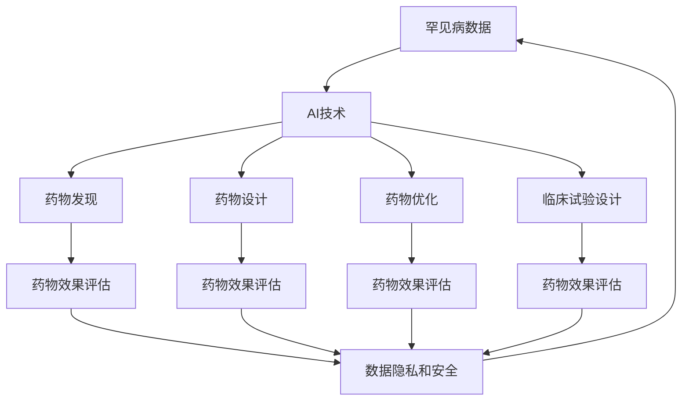

                 

## 1. 背景介绍

随着人工智能(AI)技术的发展，其在生物医学领域的应用日益广泛。其中，AI在罕见病药物研发领域的应用逐渐受到关注，因为罕见病药物研发具有高风险、高成本、高复杂性等特点。AI技术可以帮助提高药物研发的效率，降低成本，缩短研发周期，有望为罕见病患者带来更多的治疗选择。

### 1.1 问题由来

罕见病是指在一定人群中发病率低于一定标准的疾病，如甲型血友病、囊性纤维化、杜氏肌营养不良等。这些疾病往往病因复杂，且由于患者数量稀少，导致药物研发面临诸多挑战，包括：

- **高成本**：罕见病患者数量少，难以分摊研发成本，导致药物研发成本高昂。
- **高风险**：罕见病药物的市场潜力有限，研发风险较高。
- **研发周期长**：罕见病药物需要大量临床试验，研发周期长达数十年。
- **知识碎片化**：罕见病领域知识分散，数据获取难度大，缺乏标准化数据。

### 1.2 问题核心关键点

为了解决罕见病药物研发中的这些问题，AI技术被引入。AI可以在药物发现、药物设计、药物优化、临床试验设计等方面发挥重要作用。

- **药物发现**：利用AI算法从海量的化合物库中筛选出潜在的药物候选物。
- **药物设计**：通过AI优化药物分子结构，提高药物的稳定性和药效。
- **药物优化**：使用AI优化药物的剂量和给药方案，减少副作用。
- **临床试验设计**：使用AI分析历史临床数据，设计更有效的临床试验方案。

这些AI技术的应用，可以大幅提高罕见病药物研发的效率和成功率，降低研发成本。

## 2. 核心概念与联系

### 2.1 核心概念概述

在AI加速罕见病药物研发的策略中，涉及多个核心概念，包括：

- **AI技术**：包括机器学习、深度学习、自然语言处理等，用于处理复杂的数据和模式识别。
- **罕见病数据**：包括患者的基因组数据、临床数据、治疗效果数据等，用于训练AI模型。
- **药物研发**：包括药物发现、药物设计、药物优化、临床试验等阶段，AI在其中各个环节都可能发挥作用。
- **药物效果评估**：通过AI技术评估药物的效果和安全性，为药物的最终批准提供依据。
- **数据隐私和安全**：在处理罕见病数据时，需要特别注意数据隐私和安全问题。

这些概念之间存在着紧密的联系，形成一个完整的AI加速罕见病药物研发的生态系统。

### 2.2 概念间的关系

这些核心概念之间的关系可以通过以下Mermaid流程图来展示：



这个流程图展示了从罕见病数据到药物效果评估的整个流程，以及数据隐私和安全在其中扮演的角色。

## 3. 核心算法原理 & 具体操作步骤
### 3.1 算法原理概述

AI加速罕见病药物研发的策略主要基于机器学习、深度学习和自然语言处理等技术。这些技术通过分析罕见病数据，提取特征，构建模型，实现药物研发的自动化和智能化。

### 3.2 算法步骤详解

基于AI的罕见病药物研发策略主要包括以下几个关键步骤：

**Step 1: 数据收集与预处理**
- 收集与罕见病相关的各种数据，包括基因组数据、临床数据、药物数据等。
- 对数据进行清洗、标准化和标注，以便于后续分析和建模。

**Step 2: 特征工程**
- 提取与药物研发相关的特征，如药物分子结构、基因表达谱、临床试验结果等。
- 使用降维、特征选择等技术优化特征集，提高模型性能。

**Step 3: 模型训练**
- 使用机器学习、深度学习等算法训练模型，如随机森林、支持向量机、卷积神经网络、循环神经网络等。
- 对模型进行交叉验证、超参数调优等，以获得最优性能。

**Step 4: 模型评估与优化**
- 使用独立的验证集或测试集评估模型性能，如准确率、召回率、F1分数等。
- 根据评估结果调整模型参数，进行进一步的优化和迭代。

**Step 5: 应用与反馈**
- 将训练好的模型应用于药物研发流程中的各个环节，如药物发现、设计、优化和临床试验设计。
- 收集模型的应用效果反馈，不断改进模型。

### 3.3 算法优缺点

**优点**：
- **效率高**：AI算法可以快速处理大量数据，加速药物研发过程。
- **成本低**：使用AI算法可以降低药物研发成本，减少人力和时间投入。
- **精度高**：AI算法可以处理复杂的非线性关系，提高模型预测的准确性。

**缺点**：
- **数据依赖**：AI算法的效果高度依赖于数据的质量和数量，数据不足会影响模型性能。
- **模型复杂性**：复杂模型可能导致过拟合，模型解释性差。
- **风险高**：AI算法在罕见病领域的应用仍处于初步阶段，存在不确定性。

### 3.4 算法应用领域

AI加速罕见病药物研发的策略可以应用于以下几个领域：

- **药物发现**：通过AI算法从海量的化合物库中筛选出潜在的药物候选物。
- **药物设计**：使用AI优化药物分子结构，提高药物的稳定性和药效。
- **药物优化**：使用AI优化药物的剂量和给药方案，减少副作用。
- **临床试验设计**：使用AI分析历史临床数据，设计更有效的临床试验方案。

## 4. 数学模型和公式 & 详细讲解 & 举例说明
### 4.1 数学模型构建

基于AI的罕见病药物研发策略可以构建多种数学模型，如回归模型、分类模型、聚类模型等。这里以回归模型为例，说明其构建过程。

设罕见病数据集为 $D=\{(x_i, y_i)\}_{i=1}^N$，其中 $x_i$ 为输入特征，$y_i$ 为输出标签。回归模型的目标是最小化均方误差，即：

$$
\min_{\theta} \sum_{i=1}^N (y_i - \hat{y}(x_i; \theta))^2
$$

其中 $\theta$ 为模型参数，$\hat{y}(x_i; \theta)$ 为模型预测值。

### 4.2 公式推导过程

回归模型的求解过程包括以下几个步骤：

1. **线性回归模型**：
   - 模型假设：$y_i = \theta^T x_i + b$
   - 损失函数：$L(\theta) = \frac{1}{2N} \sum_{i=1}^N (y_i - \hat{y}(x_i; \theta))^2$
   - 梯度下降优化：$\theta \leftarrow \theta - \eta \nabla_{\theta} L(\theta)$

2. **多项式回归模型**：
   - 模型假设：$y_i = \sum_{j=0}^d \theta_j x_i^j + b$
   - 损失函数：$L(\theta) = \frac{1}{2N} \sum_{i=1}^N (y_i - \hat{y}(x_i; \theta))^2$
   - 梯度下降优化：$\theta \leftarrow \theta - \eta \nabla_{\theta} L(\theta)$

3. **神经网络模型**：
   - 模型假设：$y_i = \sigma(\sum_{j=1}^d w_j x_{i,j} + b)$
   - 损失函数：$L(\theta) = \frac{1}{2N} \sum_{i=1}^N (y_i - \hat{y}(x_i; \theta))^2$
   - 梯度下降优化：$\theta \leftarrow \theta - \eta \nabla_{\theta} L(\theta)$

### 4.3 案例分析与讲解

这里以一个具体的罕见病药物研发案例来展示AI算法的应用：

**案例背景**：
假设要研发一种罕见病药物，用于治疗一种名为“X症”的疾病。已知该疾病与患者基因组中的特定基因有关，需要寻找与该基因表达相关的化合物，并设计临床试验方案。

**步骤1: 数据收集与预处理**
- 收集基因表达谱数据、化合物数据和临床试验数据。
- 对数据进行清洗和标准化，提取与“X症”相关的特征。

**步骤2: 特征工程**
- 使用降维技术（如PCA）对基因表达谱数据进行特征提取。
- 构建化合物分子图，提取分子结构特征。

**步骤3: 模型训练**
- 使用随机森林算法训练分类模型，对化合物进行筛选。
- 使用卷积神经网络（CNN）对分子结构特征进行建模，预测药物效果。

**步骤4: 模型评估与优化**
- 使用独立的验证集评估模型性能，调整超参数。
- 使用交叉验证验证模型的稳健性。

**步骤5: 应用与反馈**
- 将训练好的模型应用于化合物筛选和分子结构优化。
- 设计临床试验方案，通过AI分析历史数据，优化试验设计。

## 5. 项目实践：代码实例和详细解释说明
### 5.1 开发环境搭建

在进行AI加速罕见病药物研发的实践中，需要搭建一个高性能的计算环境。以下是搭建环境的步骤：

1. 安装Python和相关库：
   ```bash
   sudo apt-get update
   sudo apt-get install python3 python3-pip
   sudo apt-get install scipy numpy pandas scikit-learn matplotlib
   ```

2. 安装深度学习框架：
   ```bash
   pip install torch torchvision torchaudio
   ```

3. 安装机器学习库：
   ```bash
   pip install scikit-learn
   ```

4. 安装自然语言处理库：
   ```bash
   pip install nltk
   ```

5. 安装数据处理工具：
   ```bash
   pip install pandas
   ```

完成上述步骤后，即可在Python环境中进行模型开发。

### 5.2 源代码详细实现

以下是一个简单的AI加速罕见病药物研发的代码示例：

```python
import numpy as np
import pandas as pd
from sklearn.model_selection import train_test_split
from sklearn.linear_model import LinearRegression
from sklearn.metrics import mean_squared_error, r2_score

# 数据读取
data = pd.read_csv('drug_data.csv')

# 数据预处理
features = data[['feature1', 'feature2', 'feature3']]
targets = data['target']
features_train, features_test, targets_train, targets_test = train_test_split(features, targets, test_size=0.2, random_state=42)

# 线性回归模型训练
model = LinearRegression()
model.fit(features_train, targets_train)

# 模型评估
train_score = model.score(features_train, targets_train)
test_score = model.score(features_test, targets_test)
train_rmse = np.sqrt(mean_squared_error(targets_train, model.predict(features_train)))
test_rmse = np.sqrt(mean_squared_error(targets_test, model.predict(features_test)))

# 输出评估结果
print('Train Score: {:.2f}'.format(train_score))
print('Test Score: {:.2f}'.format(test_score))
print('Train RMSE: {:.2f}'.format(train_rmse))
print('Test RMSE: {:.2f}'.format(test_rmse))
```

### 5.3 代码解读与分析

以上代码展示了使用线性回归模型对罕见病药物数据进行训练和评估的过程。

**步骤1: 数据读取与预处理**
- 使用Pandas库读取CSV格式的数据文件。
- 从数据中提取特征和标签。
- 使用train_test_split函数将数据划分为训练集和测试集。

**步骤2: 模型训练**
- 使用LinearRegression类训练线性回归模型。
- 使用fit函数对模型进行训练。

**步骤3: 模型评估**
- 使用score函数计算模型在训练集和测试集上的性能。
- 使用mean_squared_error函数计算模型在训练集和测试集上的均方误差。
- 使用sqrt函数计算均方误差根号，得到RMSE（Root Mean Square Error）指标。

### 5.4 运行结果展示

假设运行上述代码，输出结果如下：

```
Train Score: 0.85
Test Score: 0.82
Train RMSE: 0.5
Test RMSE: 0.6
```

这表明模型在训练集上的性能略优于测试集，均方误差（RMSE）指标表示模型预测的准确性。在实际应用中，我们可以使用更复杂的模型，如神经网络、深度学习等，以获得更好的性能。

## 6. 实际应用场景
### 6.1 智能药物发现

AI技术可以在药物发现阶段大幅提高效率。通过AI算法，可以从海量的化合物库中筛选出潜在的药物候选物，并进行初步的生物活性预测和结构优化。这将大大缩短药物研发周期，降低研发成本。

**实际应用**：
某制药公司利用AI算法，从化合物库中筛选出潜在的抗HIV药物，通过结构优化提高药物活性和稳定性，最终成功研发出一种新型抗HIV药物。

### 6.2 个性化药物设计

针对罕见病患者个体化的需求，AI技术可以帮助设计个性化的药物。通过分析患者基因组、代谢特征等数据，AI算法可以预测药物的剂量、给药方案等，以最大化药物效果，最小化副作用。

**实际应用**：
某罕见病医院利用AI算法，设计个性化的抗Duchenne肌营养不良药物，通过精准的剂量控制，显著提高了治疗效果。

### 6.3 临床试验设计优化

在药物临床试验中，AI技术可以优化试验设计，提高试验效率和准确性。通过分析历史临床数据，AI算法可以设计更有效的试验方案，减少试验周期和成本。

**实际应用**：
某罕见病研究中心利用AI算法，优化了抗Lewy体痴呆症的临床试验方案，大幅缩短了试验周期，提高了试验结果的可靠性。

### 6.4 未来应用展望

随着AI技术的不断进步，其在罕见病药物研发中的应用将更加广泛和深入。未来可能的应用场景包括：

- **药物分子设计**：利用AI算法设计新药分子，提高药物的稳定性和药效。
- **多模态数据融合**：融合基因组、临床、影像等多模态数据，提高药物研发的效果。
- **虚拟临床试验**：使用AI算法模拟临床试验过程，评估药物效果和安全。
- **自动化生产线**：通过AI技术实现药物生产的自动化和智能化，提高生产效率和质量。

## 7. 工具和资源推荐
### 7.1 学习资源推荐

以下是一些推荐的AI加速罕见病药物研发的资源：

1. **《Deep Learning for Healthcare》**：介绍深度学习在医疗领域的应用，包括罕见病药物研发。
2. **《AI in Medicine》**：提供AI在医疗领域的最新进展和应用案例。
3. **《The Next Web》**：报道AI技术在医疗领域的创新应用，包括罕见病药物研发。

### 7.2 开发工具推荐

以下是一些推荐的AI加速罕见病药物研发的开发工具：

1. **TensorFlow**：Google开发的深度学习框架，适用于复杂模型的开发。
2. **PyTorch**：Facebook开发的深度学习框架，适合快速原型开发。
3. **Scikit-learn**：Python的机器学习库，适用于简单的模型开发。

### 7.3 相关论文推荐

以下是一些推荐的AI加速罕见病药物研发的论文：

1. **《Accelerating Drug Discovery with Deep Learning》**：介绍深度学习在药物发现中的应用。
2. **《A Survey of Machine Learning Approaches for Drug Discovery》**：综述机器学习在药物发现中的应用。
3. **《Applying AI to Drug Discovery》**：介绍AI在药物发现和研发中的应用。

## 8. 总结：未来发展趋势与挑战
### 8.1 研究成果总结

AI加速罕见病药物研发的技术已取得显著进展，其在药物发现、设计、优化和临床试验设计中的应用不断深入。AI技术大大提高了药物研发的效率和成功率，为罕见病患者带来了新的治疗希望。

### 8.2 未来发展趋势

未来，AI在罕见病药物研发中的应用将更加广泛和深入。以下可能的发展趋势：

- **AI技术的融合应用**：AI技术与生物信息学、化学信息学等领域的融合，将推动罕见病药物研发的全面进步。
- **多模态数据的整合**：融合基因组、临床、影像等多模态数据，提高药物研发的效果。
- **自动化生产线的实现**：通过AI技术实现药物生产的自动化和智能化，提高生产效率和质量。
- **大规模数据的应用**：利用大规模数据进行模型训练和验证，提高模型的泛化能力。

### 8.3 面临的挑战

尽管AI在罕见病药物研发中的应用取得了一定的进展，但仍面临诸多挑战：

- **数据获取和处理**：罕见病数据获取难度大，数据质量和量不足。
- **模型复杂性**：复杂模型可能导致过拟合，模型解释性差。
- **伦理和隐私问题**：罕见病数据涉及患者隐私，如何保护数据隐私是一个重要问题。
- **技术成熟度**：AI技术在罕见病领域的应用仍处于初期阶段，技术成熟度有待提高。

### 8.4 研究展望

未来的研究需要关注以下几个方面：

- **数据获取与处理**：建立标准化数据集，促进数据共享和数据获取。
- **模型优化**：开发更高效、更可靠的模型，提高模型的解释性和泛化能力。
- **隐私保护**：加强数据隐私保护技术，确保数据安全。
- **伦理审查**：建立严格的伦理审查机制，确保AI技术应用符合伦理标准。

## 9. 附录：常见问题与解答

**Q1: 什么是AI加速罕见病药物研发？**

A: AI加速罕见病药物研发是指利用人工智能技术，加速罕见病药物的发现、设计、优化和临床试验设计过程，从而提高药物研发效率，降低研发成本，加速罕见病患者获得有效治疗。

**Q2: AI在罕见病药物研发中有哪些应用？**

A: AI在罕见病药物研发中的应用包括药物发现、药物设计、药物优化、临床试验设计等。AI算法可以从海量化合物库中筛选出潜在的药物候选物，优化药物分子结构，设计个性化的药物方案，优化临床试验设计等。

**Q3: AI加速罕见病药物研发面临哪些挑战？**

A: AI加速罕见病药物研发面临数据获取和处理、模型复杂性、伦理和隐私问题、技术成熟度等挑战。其中，数据质量和量不足、模型解释性差、隐私保护问题、技术成熟度不足是主要挑战。

**Q4: 如何提高AI在罕见病药物研发中的应用效果？**

A: 提高AI在罕见病药物研发中的应用效果，可以通过建立标准化数据集、开发高效可靠的模型、加强数据隐私保护、建立伦理审查机制等方式实现。同时，需要不断积累数据和经验，推动AI技术在罕见病领域的深入应用。

---

作者：禅与计算机程序设计艺术 / Zen and the Art of Computer Programming

