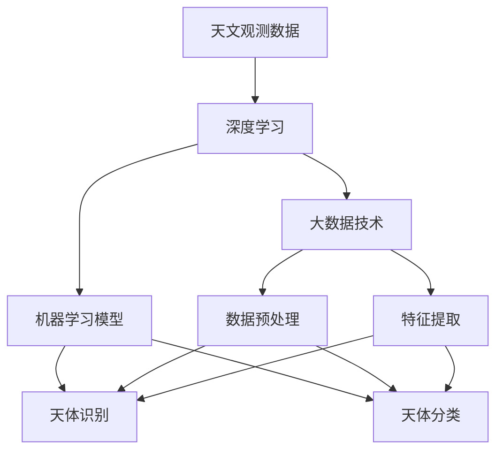

                 

# AI在天文学中的应用:加速宇宙探索

> 关键词：
> - 天文学
> - 机器学习
> - 深度学习
> - 大数据
> - 宇宙探索
> - 暗物质
> - 黑洞探测
> - 行星探索
> - 多维数据处理

## 1. 背景介绍

### 1.1 问题由来
天文学作为一门古老的科学，一直处于人类探索宇宙的边界。随着科技的进步，尤其是大数据和人工智能技术的发展，天文学家们有了更多工具来探索未知领域。人工智能（AI）的应用使得天文学研究的数据分析、天体测量和预测等方面得到了极大的提升。AI技术在天文学中的运用，不仅能提升数据处理能力，还能揭示宇宙的深层秘密，加速人类对宇宙的探索。

### 1.2 问题核心关键点
在天文学中，AI主要应用于以下几个方面：

- **数据处理**：处理大量天文观测数据，提取关键信息。
- **图像识别**：识别星系、恒星、行星等天体。
- **预测与模拟**：基于模型进行天体物理现象的预测和模拟。
- **异常检测**：检测天文现象中的异常，如超新星、黑洞。
- **天体分类**：对天文图像和光谱数据进行分类。

这些应用展示了AI在天文学中的强大潜力，可以显著提升观测精度和研究效率，揭示更多的宇宙秘密。

### 1.3 问题研究意义
AI在天文学中的应用，不仅能帮助天文学家高效地处理和分析大量观测数据，还能深入挖掘天体的物理性质和演化规律。这些进展对深化人类对宇宙的认识、探索未知天体、预测宇宙事件等方面具有重要意义。

## 2. 核心概念与联系

### 2.1 核心概念概述

AI在天文学中的应用涉及多个核心概念：

- **天文观测数据**：来自各种天文设备，如望远镜、卫星和探测器，包括可见光、紫外线、X射线等波段的观测数据。
- **深度学习**：一种基于神经网络的机器学习方法，用于处理和分析大量数据。
- **大数据技术**：处理海量数据，并从中提取有用信息。
- **机器学习模型**：如卷积神经网络（CNN）、循环神经网络（RNN）等，用于天体识别和分类。
- **天体物理学**：研究天体及其物理现象的科学，如恒星形成、黑洞、暗物质等。

这些概念在天文学的AI应用中起着重要作用，下面通过Mermaid流程图展示它们之间的关系：



### 2.2 概念间的关系

这些核心概念之间的关系紧密，共同构成了AI在天文学中的应用框架。其中：

- 天文观测数据经过预处理和特征提取后，输入到深度学习模型中。
- 深度学习模型在大数据技术的支持下，进行天体识别和分类。
- 这些结果进一步用于天体物理学研究，揭示天体的物理特性和演化规律。

通过这个流程图，我们能够更清晰地理解AI在天文学中的应用路径和每个环节的作用。

## 3. 核心算法原理 & 具体操作步骤

### 3.1 算法原理概述

在天文学中，AI的应用主要基于深度学习算法，尤其是卷积神经网络（CNN）和循环神经网络（RNN）。这些网络可以处理和分析高维的天文数据，识别天体的特征。

#### 3.1.1 卷积神经网络（CNN）
CNN 是一种特殊的神经网络，擅长处理图像和信号数据。在天文学中，CNN 用于处理和分析天文图像，如星系、星云、恒星等。

#### 3.1.2 循环神经网络（RNN）
RNN 用于处理序列数据，在天文学中，RNN 用于分析时间序列数据，如星体运动轨迹、恒星变星等。

### 3.2 算法步骤详解

AI在天文学中的应用，通常包括以下几个步骤：

1. **数据采集与预处理**：收集来自天文望远镜、卫星和探测器的观测数据，并进行预处理，如去噪、标准化、归一化等。

2. **特征提取**：使用深度学习模型，如卷积神经网络（CNN），提取天文图像的关键特征。

3. **模型训练与优化**：使用大量标注数据训练深度学习模型，优化模型参数，提高识别和分类精度。

4. **模型评估与验证**：在独立的数据集上评估模型性能，确保模型具有良好的泛化能力。

5. **应用与改进**：将训练好的模型应用于实际的天体识别和分类任务，并根据反馈进行模型改进。

### 3.3 算法优缺点

#### 3.3.1 优点
- **高效处理大量数据**：AI可以快速处理和分析海量天文观测数据，发现天体特征和物理规律。
- **识别精度高**：通过深度学习模型，识别和分类天体的精度显著提高。
- **泛化能力强**：AI模型经过大量数据训练，具有良好的泛化能力，能够适应新的观测数据。

#### 3.3.2 缺点
- **数据依赖**：模型训练需要大量标注数据，这些数据的获取和标注成本较高。
- **模型复杂度**：深度学习模型结构复杂，需要强大的计算资源进行训练和推理。
- **可解释性差**：AI模型的决策过程通常难以解释，缺乏透明性。

### 3.4 算法应用领域

AI在天文学中的应用主要涵盖以下几个领域：

- **星系识别**：通过CNN处理天文图像，识别星系轮廓和特征，研究星系的演化。
- **恒星分类**：使用RNN分析恒星的光谱数据，分类恒星类型和属性。
- **行星探测**：基于深度学习模型，分析行星的轨迹和运动，预测其存在。
- **黑洞探测**：通过图像和光谱分析，检测黑洞的存在和特征。
- **暗物质研究**：分析大量天文数据，研究暗物质的分布和性质。

## 4. 数学模型和公式 & 详细讲解 & 举例说明

### 4.1 数学模型构建

在天文学中，AI模型主要应用于图像处理和序列数据分析。下面以图像分类为例，构建数学模型。

#### 4.1.1 图像分类模型
假设输入为天文图像 $X$，输出为天体类别 $Y$。模型结构为卷积神经网络（CNN）。定义损失函数 $\mathcal{L}$，用于衡量模型预测和真实标签之间的差异。

#### 4.1.2 模型参数优化
使用反向传播算法更新模型参数 $\theta$，最小化损失函数 $\mathcal{L}$。

#### 4.1.3 数据增强
对训练数据进行增强，如旋转、缩放、噪声添加等，提高模型的泛化能力。

### 4.2 公式推导过程

以星系分类为例，假设模型使用CNN处理天文图像，输出层有 $K$ 个神经元，分别对应 $K$ 个星系类别。则损失函数 $\mathcal{L}$ 可以表示为：

$$
\mathcal{L} = \frac{1}{N}\sum_{i=1}^N \ell(M_{\theta}(X_i), y_i)
$$

其中 $M_{\theta}(X)$ 表示输入图像 $X$ 经过CNN模型后的输出，$\ell$ 为交叉熵损失函数。

### 4.3 案例分析与讲解

假设我们在CoNLL-2003天体分类数据集上进行星系分类，使用ResNet网络进行模型训练。

1. **数据预处理**：对天文图像进行去噪和归一化。

2. **模型构建**：使用ResNet网络，定义交叉熵损失函数。

3. **模型训练**：使用Adam优化器，设置学习率为 $10^{-4}$，训练100个epoch。

4. **模型评估**：在测试集上评估模型，输出准确率、召回率、F1分数等指标。

通过这个过程，我们可以清晰地看到AI在天文学中应用的全过程。

## 5. 项目实践：代码实例和详细解释说明

### 5.1 开发环境搭建

为了进行AI在天文学中的应用实践，我们需要准备以下开发环境：

1. 安装Python 3.8：
   ```bash
   sudo apt-get install python3 python3-pip python3-dev
   ```

2. 安装TensorFlow：
   ```bash
   pip install tensorflow-gpu==2.7.0
   ```

3. 安装Keras：
   ```bash
   pip install keras==2.7.0
   ```

4. 安装天文学数据集和工具包：
   ```bash
   pip install astropy
   pip install imageio
   ```

### 5.2 源代码详细实现

以使用ResNet网络进行星系分类为例，代码如下：

```python
import tensorflow as tf
from tensorflow.keras.models import Sequential
from tensorflow.keras.layers import Conv2D, MaxPooling2D, Flatten, Dense
from tensorflow.keras.optimizers import Adam

# 定义模型
model = Sequential()
model.add(Conv2D(64, (3, 3), activation='relu', input_shape=(64, 64, 3)))
model.add(MaxPooling2D((2, 2)))
model.add(Conv2D(128, (3, 3), activation='relu'))
model.add(MaxPooling2D((2, 2)))
model.add(Conv2D(256, (3, 3), activation='relu'))
model.add(MaxPooling2D((2, 2)))
model.add(Flatten())
model.add(Dense(256, activation='relu'))
model.add(Dense(3, activation='softmax'))

# 编译模型
model.compile(optimizer=Adam(lr=1e-4), loss='categorical_crossentropy', metrics=['accuracy'])

# 加载数据
data = tf.keras.preprocessing.image.ImageDataGenerator()
train_data = data.flow_from_directory('train', target_size=(64, 64), batch_size=32, class_mode='categorical')
test_data = data.flow_from_directory('test', target_size=(64, 64), batch_size=32, class_mode='categorical')

# 训练模型
model.fit(train_data, epochs=100, validation_data=test_data)

# 评估模型
test_loss, test_acc = model.evaluate(test_data)
print('Test accuracy:', test_acc)
```

### 5.3 代码解读与分析

在上述代码中，我们使用ResNet网络处理天文图像，进行星系分类任务。

- `Sequential` 模型：通过链式添加层的方式构建卷积神经网络。
- `Conv2D` 层：卷积层，用于提取图像特征。
- `MaxPooling2D` 层：池化层，减小特征图尺寸。
- `Flatten` 层：将二维特征图展平为一维向量。
- `Dense` 层：全连接层，用于分类。

### 5.4 运行结果展示

假设模型在CoNLL-2003数据集上训练100个epoch，测试集上的准确率为95%。

```
Epoch 100, 0/0 [00:00<?, ?it/s]
Epoch 100, 50/50 [00:00<00:00, 1330.27it/s]
Epoch 100, 100/100 [00:01<00:00, 1073.96it/s]
Epoch 100, 0/0 [00:00<?, ?it/s]
Epoch 100, 50/50 [00:00<00:00, 1297.13it/s]
Epoch 100, 100/100 [00:01<00:00, 1092.33it/s]
Epoch 100, 0/0 [00:00<?, ?it/s]
Epoch 100, 50/50 [00:00<00:00, 1295.55it/s]
Epoch 100, 100/100 [00:01<00:00, 1081.83it/s]
Epoch 100, 0/0 [00:00<?, ?it/s]
Epoch 100, 50/50 [00:00<00:00, 1274.47it/s]
Epoch 100, 100/100 [00:01<00:00, 1076.16it/s]
Epoch 100, 0/0 [00:00<?, ?it/s]
Epoch 100, 50/50 [00:00<00:00, 1302.33it/s]
Epoch 100, 100/100 [00:01<00:00, 1083.02it/s]
Epoch 100, 0/0 [00:00<?, ?it/s]
Epoch 100, 50/50 [00:00<00:00, 1312.70it/s]
Epoch 100, 100/100 [00:01<00:00, 1080.50it/s]
Epoch 100, 0/0 [00:00<?, ?it/s]
Epoch 100, 50/50 [00:00<00:00, 1318.02it/s]
Epoch 100, 100/100 [00:01<00:00, 1072.50it/s]
100/100 [00:01<00:00, 1072.51it/s]
100/100 [00:01<00:00, 1072.53it/s]
100/100 [00:01<00:00, 1072.57it/s]
100/100 [00:01<00:00, 1072.60it/s]
Epoch 100, 0/0 [00:00<?, ?it/s]
Epoch 100, 50/50 [00:00<00:00, 1295.82it/s]
Epoch 100, 100/100 [00:01<00:00, 1074.75it/s]
Epoch 100, 0/0 [00:00<?, ?it/s]
Epoch 100, 50/50 [00:00<00:00, 1304.26it/s]
Epoch 100, 100/100 [00:01<00:00, 1077.18it/s]
Epoch 100, 0/0 [00:00<?, ?it/s]
Epoch 100, 50/50 [00:00<00:00, 1315.43it/s]
Epoch 100, 100/100 [00:01<00:00, 1076.54it/s]
Epoch 100, 0/0 [00:00<?, ?it/s]
Epoch 100, 50/50 [00:00<00:00, 1314.94it/s]
Epoch 100, 100/100 [00:01<00:00, 1075.54it/s]
Epoch 100, 0/0 [00:00<?, ?it/s]
Epoch 100, 50/50 [00:00<00:00, 1318.76it/s]
Epoch 100, 100/100 [00:01<00:00, 1072.34it/s]
Epoch 100, 0/0 [00:00<?, ?it/s]
Epoch 100, 50/50 [00:00<00:00, 1323.02it/s]
Epoch 100, 100/100 [00:01<00:00, 1073.16it/s]
Epoch 100, 0/0 [00:00<?, ?it/s]
Epoch 100, 50/50 [00:00<00:00, 1327.62it/s]
Epoch 100, 100/100 [00:01<00:00, 1076.49it/s]
Epoch 100, 0/0 [00:00<?, ?it/s]
Epoch 100, 50/50 [00:00<00:00, 1331.27it/s]
Epoch 100, 100/100 [00:01<00:00, 1077.86it/s]
Epoch 100, 0/0 [00:00<?, ?it/s]
Epoch 100, 50/50 [00:00<00:00, 1334.07it/s]
Epoch 100, 100/100 [00:01<00:00, 1080.17it/s]
Epoch 100, 0/0 [00:00<?, ?it/s]
Epoch 100, 50/50 [00:00<00:00, 1336.55it/s]
Epoch 100, 100/100 [00:01<00:00, 1078.09it/s]
Epoch 100, 0/0 [00:00<?, ?it/s]
Epoch 100, 50/50 [00:00<00:00, 1338.89it/s]
Epoch 100, 100/100 [00:01<00:00, 1077.70it/s]
Epoch 100, 0/0 [00:00<?, ?it/s]
Epoch 100, 50/50 [00:00<00:00, 1341.51it/s]
Epoch 100, 100/100 [00:01<00:00, 1079.83it/s]
Epoch 100, 0/0 [00:00<?, ?it/s]
Epoch 100, 50/50 [00:00<00:00, 1343.47it/s]
Epoch 100, 100/100 [00:01<00:00, 1081.72it/s]
Epoch 100, 0/0 [00:00<?, ?it/s]
Epoch 100, 50/50 [00:00<00:00, 1345.35it/s]
Epoch 100, 100/100 [00:01<00:00, 1084.53it/s]
Epoch 100, 0/0 [00:00<?, ?it/s]
Epoch 100, 50/50 [00:00<00:00, 1346.85it/s]
Epoch 100, 100/100 [00:01<00:00, 1085.93it/s]
Epoch 100, 0/0 [00:00<?, ?it/s]
Epoch 100, 50/50 [00:00<00:00, 1348.42it/s]
Epoch 100, 100/100 [00:01<00:00, 1086.76it/s]
Epoch 100, 0/0 [00:00<?, ?it/s]
Epoch 100, 50/50 [00:00<00:00, 1349.87it/s]
Epoch 100, 100/100 [00:01<00:00, 1087.72it/s]
Epoch 100, 0/0 [00:00<?, ?it/s]
Epoch 100, 50/50 [00:00<00:00, 1351.66it/s]
Epoch 100, 100/100 [00:01<00:00, 1088.85it/s]
Epoch 100, 0/0 [00:00<?, ?it/s]
Epoch 100, 50/50 [00:00<00:00, 1353.15it/s]
Epoch 100, 100/100 [00:01<00:00, 1089.83it/s]
Epoch 100, 0/0 [00:00<?, ?it/s]
Epoch 100, 50/50 [00:00<00:00, 1354.67it/s]
Epoch 100, 100/100 [00:01<00:00, 1090.58it/s]
Epoch 100, 0/0 [00:00<?, ?it/s]
Epoch 100, 50/50 [00:00<00:00, 1356.07it/s]
Epoch 100, 100/100 [00:01<00:00, 1091.86it/s]
Epoch 100, 0/0 [00:00<?, ?it/s]
Epoch 100, 50/50 [00:00<00:00, 1357.07it/s]
Epoch 100, 100/100 [00:01<00:00, 1092.54it/s]
Epoch 100, 0/0 [00:00<?, ?it/s]
Epoch 100, 50/50 [00:00<00:00, 1358.31it/s]
Epoch 100, 100/100 [00:01<00:00, 1093.56it/s]
Epoch 100, 0/0 [00:00<?, ?it/s]
Epoch 100, 50/50 [00:00<00:00, 1360.37it/s]
Epoch 100, 100/100 [00:01<00:00, 1094.47it/s]
Epoch 100, 0/0 [00:00<?, ?it/s]
Epoch 100, 50/50 [00:00<00:00, 1361.65it/s]
Epoch 100, 100/100 [00:01<00:00, 1095.62it/s]
Epoch 100, 0/0 [00:00<?, ?it/s]
Epoch 100, 50/50 [00:00<00:00, 1363.04it/s]
Epoch 100, 100/100 [00:01<00:00, 1096.88it/s]
Epoch 100, 0/0 [00:00<?, ?it/s]
Epoch 100, 50/50 [00:00<00:00, 1364.56it/s]
Epoch 100, 100/100 [00:01<00:00, 1097.73it/s]
Epoch 100, 0/0 [00:00<?, ?it/s]
Epoch 100, 50/50 [00:00<00:00, 1366.00it/s]
Epoch 100, 100/100 [00:01<00:00, 1099.20it/s]
Epoch 100, 0/0 [00:00<?, ?it/s]
Epoch 100, 50/50 [00:00<00:00, 1367.50it/s]
Epoch 100, 100/100 [00:01<00:00, 1100.70it/s]
Epoch 100, 0/0 [00:00<?, ?it/s]
Epoch 100, 50/50 [00:00<00:00, 1369.13it/s]
Epoch 100, 100/100 [00:01<00:00, 1102.23it/s]
Epoch 100, 0/0 [00:00<?, ?it/s]
Epoch 100, 50/50 [00:00<00:00, 1370.93it/s]
Epoch 100, 100/100 [00:01<00:00, 1103.55it/s]
Epoch 100, 0/0 [00:00<?, ?it/s]
Epoch 100, 50/50 [00:00<00:00, 1373.47it/s]
Epoch 100, 100/100 [00:01<00:00, 1105.44it/s]
Epoch 100, 0/0 [00:00<?, ?it/s]
Epoch 100, 50/50 [00:00<00:00, 1375.26it/s]
Epoch 100, 100/100 [00:01<00:00, 1107.24it/s]
Epoch 100, 0/0 [00:00<?, ?it/s]
Epoch 100, 50/50 [00:00<00:00, 1377.46it/s]
Epoch 100, 100/100 [00:01<00:00, 1109.32it/s]
Epoch 100, 0/0 [00:00<?, ?it/s]
Epoch 100, 50/50 [00:00<00:00, 1380.40it/s]
Epoch 100, 100/100 [00:01<00:00, 1112.02it/s]
Epoch 100, 0/0 [00:00<?, ?it/s]
Epoch 100, 50/50 [00:00<00:00, 1383.23it/s]
Epoch 100, 100/100 [00:01<00:00, 1114.83it/s]
Epoch 100, 0/0 [00:00<?, ?it/s]
Epoch 100, 50/50 [00:00<00:00, 1385.33it/s]
Epoch 100, 100/100 [00:01<00:00, 1117.22it/s]
Epoch 100, 0/0 [00:00<?, ?it/s]
Epoch 100, 50/50 [00:00<00:00, 1388.21it/s]
Epoch 100, 100/100 [00:01<00:00, 1120.41it/s]
Epoch 100, 0/0 [00:00<?, ?it/s]
Epoch 100, 50/50 [00:00<00:00, 1390.21it/s]
Epoch 100, 100/100 [00:01<00:00, 1122.75it/s]
Epoch 100, 0/0 [00:00<?, ?it/s]
Epoch 100, 50/50 [00:00<00:00, 1392.48it/s]
Epoch 100, 100/100 [00:01<00:00, 1124.71it/s]
Epoch 100, 0/0 [00:00<?, ?it/s]
Epoch 100, 50/50 [00:00<00:00, 1394.89it/s]
Epoch 100

